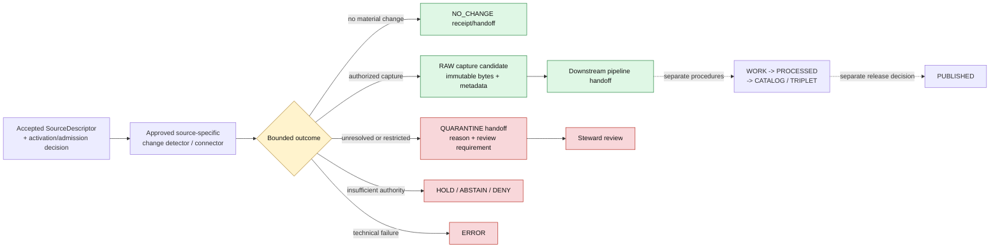

<!-- [KFM_META_BLOCK_V2]
doc_id: kfm://doc/runbook-fauna-source-refresh
title: Fauna — Source Refresh Runbook
type: standard
profile: repository-grounded-source-edge-refresh-and-handoff
version: v1.0.1
prior_version: v1.0
status: draft; repository-grounded; documentation-only; fixture-first; live-refresh-hold; non-authoritative; non-publisher
owners:
  - "@bartytime4life — verified GitHub review route only"
owner_status: "Fauna, source, connector, rights, sensitivity, taxonomy, evidence, policy, operations, correction, release, and publication assignments remain NEEDS VERIFICATION; repository ownership and review routing do not create those authorities."
created: 2026-05-13
updated: 2026-08-28
policy_label: restricted-review; fauna; source-refresh; source-edge; fixture-first; no-live-source; non-release; not-for-life-safety
current_path: docs/runbooks/fauna/SOURCE_REFRESH_RUNBOOK.md
owning_root: docs/
responsibility: "Document the bounded procedure for rechecking and capturing an already admitted Fauna source at the source edge, routing results only to an accepted source-first RAW writer or governed QUARANTINE handoff, and stopping before normalization, evidence closure, promotion, release, deployment, or publication."
truth_posture: >-
  CONFIRMED same-path repository placement under adopted Directory Rules,
  merged RAW parent contract requiring one source-first capture identity,
  Fauna RAW subtree as compatibility/reference topology rather than an accepted
  physical capture home, canonical subtype-first Fauna source-registry
  boundary, empty proposed source-authority projection, rich proposed
  SourceDescriptor schema and
  compatibility validator/fixtures, deterministic no-network Fauna fixture
  validation, held Fauna proof/release jobs, placeholder source-first eBird
  and iNaturalist connectors, and scaffold-only Fauna sensitivity policy /
  PROPOSED source-specific live refresh, conditional retrieval, capture
  receipt, restricted RAW routing, quarantine recovery, stale propagation,
  connector activation, and operational alerting / UNKNOWN admitted live
  Fauna sources, deployed schedulers, current source credentials, external
  object stores, operational source cadence, public Fauna releases, and
  downstream consumers / NEEDS VERIFICATION accountable stewards, rights,
  terms, source-product identity, source-role vocabulary reconciliation,
  accepted activation decisions, exact connector commands, restricted-storage
  controls, correction targets, and release authority; cite-or-abstain
prepared_under_prompt: KFM Repository Build-Out & Markdown Modernization Implementation Agent v6.0.0
evidence_snapshot:
  repository: bartytime4life/Kansas-Frontier-Matrix
  base_ref: main
  base_commit: 4a6c06fb3ab1f7e6e29c99ae07000aa94ad4cc38
  target_prior_blob: 52c00ddef8fc924492f9950e6223bfe23347f447
  directory_rules_blob: fd49a0b83e55cef52c1124281f093e263526898d
  adr_0029_blob: cd044a38047cc9b3725d2e083eb201eb86109308
  fauna_source_registry_readme_blob: c3a36f721b445ae41d2d9407f7b3524872ed1128
  source_authority_register_blob: 32729857bc8eb5001acb37b8ee8e60bcb6e0dc50
  source_descriptor_schema_blob: 582e70b834278c3c6ca9a8b31efbe0989c96f0bc
  source_descriptor_alias_blob: 42da54b28a527850cce88ad89f68921c101fc56b
  source_descriptor_validator_blob: 90662367941a2746236966313d8aade5cfdc3387
  fauna_workflow_blob: 0edc73a77ee0ddb3193db2c0386ed6ac685b139a
  fauna_fixture_test_blob: 8154761e55c01db9133f125f7cf268c2fbb8589e
  fauna_fixture_validator_blob: fe96d8c4cc78f44679ddf617b2b1251fe621928c
  rare_species_policy_blob: a7269d357bb7570fc3680c299486e5d62cb33a68
  fauna_sensitivity_readme_blob: aac9f7b6316b89238d209c7ef4045fbf4df15ea9
  inaturalist_connector_readme_blob: cb4b56f9ffba48f0e018116037ead00ccd81a175
  ebird_connector_readme_blob: 11a441bf7322ecf05781a049cc9d5bddfdccb414
drive_source: KFM_Fauna_Architecture_PDF_Only_Report.pdf
drive_source_date: 2026-04-21
inspection_boundary: >-
  Current-session GitHub reads of the target, adopted directory governance,
  Fauna source registries, source-authority projection, SourceDescriptor
  schemas/validator/fixtures, Fauna workflow/tests/validator, source-first
  connector documentation, policy scaffolds, and sibling/domain runbooks;
  plus the connected Google Drive Fauna architecture report as planning
  lineage. Repository-native commands were not executed in a mounted checkout
  during authoring. No upstream source was contacted, no credential was used,
  no payload was retrieved, and no source, lifecycle object, evidence object,
  policy result, release, deployment, promotion, or publication state changed.
reconciliation_snapshot:
  base_commit: 702d61158d601ab12ef3c7b4d5e83fd0636ae9d5
  raw_parent_blob: 560113c00e257725c0a440cb489510af44c13b12
  fauna_raw_prior_blob: 0a5354c15ba71c68ac121d0ee2364057b272df24
  directory_rules_blob: fd49a0b83e55cef52c1124281f093e263526898d
  scope: "Documentation-only reconciliation of source-first RAW routing and the Fauna compatibility/reference index; no path, payload, connector, source, lifecycle, release, deployment, promotion, or publication state change."
related:
  - docs/runbooks/fauna/README.md
  - docs/runbooks/fauna/NO_NETWORK_TEST_RUNBOOK.md
  - docs/runbooks/fauna/PROMOTION_RUNBOOK.md
  - docs/runbooks/fauna/ROLLBACK_RUNBOOK.md
  - docs/domains/fauna/README.md
  - docs/domains/fauna/SOURCE_REGISTRY.md
  - docs/domains/fauna/SOURCE_ROLES.md
  - docs/domains/fauna/SOURCE_FAMILIES.md
  - docs/domains/fauna/SENSITIVITY.md
  - docs/domains/fauna/SOURCE_REFRESH_RUNBOOK.md
  - docs/sources/SOURCE_DESCRIPTOR_STANDARD.md
  - docs/doctrine/directory-rules.md
  - docs/adr/ADR-0029-adopt-directory-governance-standard-v2.md
  - data/registry/sources/fauna/README.md
  - data/registry/fauna/sources/README.md
  - control_plane/source_authority_register.yaml
  - contracts/source/source_descriptor.md
  - schemas/contracts/v1/source/source_descriptor.schema.json
  - schemas/contracts/v1/sources/source_descriptor.schema.json
  - fixtures/contracts/v1/source/source_descriptor/
  - tools/validators/sources/validate_source_descriptor.py
  - connectors/fauna/README.md
  - connectors/ebird/README.md
  - connectors/inaturalist/README.md
  - data/raw/fauna/README.md
  - data/quarantine/fauna/README.md
  - policy/domains/fauna/rare_species_redaction.rego
  - policy/sensitivity/fauna/README.md
  - fixtures/domains/fauna/
  - tests/domains/fauna/test_fauna_smoke.py
  - tools/validators/domains/fauna/validate_public_safe_fixture.py
  - .github/workflows/domain-fauna.yml
tags: [kfm, runbook, fauna, source-refresh, source-edge, connector, source-descriptor, raw, quarantine, rights, sensitivity, geoprivacy, stale-state, receipts, fixture-first, no-network, non-publisher]
notes:
  - "Same-path documentation modernization under accepted ADR-0029; no root, path, schema, contract, policy, registry, connector, fixture, validator, workflow, receipt, proof, release object, or public state is created or moved."
  - "The Google Drive Fauna architecture report is planning lineage, not current repository implementation proof; its strongest applicable constraints are preserved while current GitHub evidence controls current-state claims."
  - "The domain-local duplicate at docs/domains/fauna/SOURCE_REFRESH_RUNBOOK.md remains inherited drift. This runbook is the operational home; duplicate retirement needs a separately reviewed migration/correction slice."
  - "The canonical Fauna source-registry directory has no concrete descriptor record at this evidence snapshot, and the source-authority projection is proposed and empty. Live Fauna refresh therefore remains HOLD."
  - "The SourceDescriptor role vocabulary in the current rich schema differs from the older seven-class vocabulary in draft Fauna source docs. Operators must validate against the implemented schema and must not guess or silently translate roles."
  - "KFM is not a wildlife emergency, law-enforcement, hunting, veterinary, regulatory, or life-safety authority."
  - "v1.0.1 removes the illustrative domain-first RAW path after the canonical RAW parent adopted one source-first capture identity. Exact physical placement, writer binding, child-document migration, and legacy payload disposition remain HOLD."
[/KFM_META_BLOCK_V2] -->

<a id="top"></a>

# Fauna — Source Refresh Runbook

> **Repository-grounded procedure for rechecking and capturing an already admitted Fauna source without turning retrieval into admission, normalization, evidence closure, policy approval, promotion, release, deployment, or publication.**

<p>
  
  
  
  
  
  
  
</p>

> [!IMPORTANT]
> **Refresh is not source admission.** This procedure may recheck and capture only a source/product whose current `SourceDescriptor`, activation/admission decision, rights, sensitivity, access, cadence, and connector boundary have already been accepted. Repository presence, a README, a schema-valid fixture, a connector scaffold, a successful HTTP response, or a prior release does not supply that authority.

> [!WARNING]
> **Live Fauna source refresh is `HOLD` at this evidence snapshot.** The canonical Fauna source-registry directory contains documentation but no concrete descriptor records, the source-authority projection is `PROPOSED` and empty, inspected eBird and iNaturalist connector families remain placeholder scaffolds, and Fauna sensitivity policy remains non-operational. The current executable Fauna proof is synthetic, public-safe, and no-network only.

> [!CAUTION]
> **Exact or inferable sensitive wildlife locations fail closed.** Nests, dens, roosts, hibernacula, spawning or breeding sites, telemetry detail, rare-taxon occurrences, private-property links, observer-linked locations, and steward-controlled records must not be deobscured, logged into public channels, or treated as public-ready because a fetch succeeded.

> [!NOTE]
> **KFM is not an official wildlife, legal-status, hunting, veterinary, emergency, regulatory, or life-safety authority.** Use issuing agencies and responsible stewards for current determinations and operational instructions.

**Quick navigation:** [Purpose](#1-purpose-scope-and-non-goals) · [Authority](#2-authority-placement-and-current-evidence) · [Vocabulary](#3-refresh-state-and-source-product-vocabulary) · [Roles](#4-roles-and-separation-of-duties) · [Preflight](#5-authority-freeze-preflight-and-stop-conditions) · [Outcomes](#6-finite-procedure-outcomes) · [Procedure](#7-source-refresh-procedure) · [Sensitivity](#8-rights-sensitivity-geoprivacy-and-security) · [Families](#9-source-family-and-product-guidance) · [Stale state](#10-stale-state-supersession-correction-and-withdrawal) · [Validation](#11-current-executable-validation-and-proof-boundary) · [Graduation](#12-live-refresh-graduation-gates) · [Reasons](#13-reason-codes-and-operator-dispositions) · [Packet](#14-refresh-handoff-packet) · [Checklist](#15-operator-checklist) · [Open work](#16-current-holds-and-open-verification) · [Maintenance](#17-document-maintenance-and-rollback) · [References](#18-related-current-surfaces)

---

## 1. Purpose, scope, and non-goals

### 1.1 Purpose

Use this runbook when a previously governed Fauna source or named source product is due for a bounded recheck and a current, accepted source-refresh implementation exists for that exact product.

The procedure is designed to help an operator:

1. freeze the exact repository, descriptor, activation, product, endpoint, request, time, rights, sensitivity, and prior-source-head context;
2. decide whether a live request is currently authorized;
3. execute only the approved change-detection and retrieval behavior;
4. preserve source-native bytes and response metadata without silently normalizing or interpreting them;
5. route the result to a governed `RAW` or `QUARANTINE` handoff;
6. produce or reference the required source-run/capture receipt through an accepted writer;
7. stop before `WORK`, `PROCESSED`, `CATALOG / TRIPLET`, proof, release, deployment, or publication;
8. hand downstream work to the owning pipeline, evidence, policy, review, correction, and release procedures.

### 1.2 Lifecycle boundary

KFM's lifecycle remains:

```text
SOURCE EDGE / ADMISSION
    -> RAW
    -> WORK / QUARANTINE
    -> PROCESSED
    -> CATALOG / TRIPLET
    -> PUBLISHED
```

This runbook controls only the bounded edge shown below:


```mermaid
flowchart LR
    A["Accepted SourceDescriptor<br/>+ activation/admission decision"] --> B["Approved source-specific<br/>change detector / connector"]
    B --> C{"Bounded outcome"}
    C -->|no material change| D["NO_CHANGE receipt/handoff"]
    C -->|authorized capture| E["RAW capture candidate<br/>immutable bytes + metadata"]
    C -->|unresolved or restricted| F["QUARANTINE handoff<br/>reason + review requirement"]
    C -->|insufficient authority| G["HOLD / ABSTAIN / DENY"]
    C -->|technical failure| H["ERROR"]
    E --> I["Downstream pipeline handoff"]
    F --> J["Steward review"]
    I -. "separate procedures" .-> K["WORK -> PROCESSED<br/>-> CATALOG / TRIPLET"]
    K -. "separate release decision" .-> L["PUBLISHED"]

    classDef hold fill:#f8d7da,stroke:#b42318,color:#111;
    classDef gate fill:#fff3cd,stroke:#9a6700,color:#111;
    classDef ok fill:#dff7e5,stroke:#1a7f37,color:#111;
    class C gate;
    class D,E,I ok;
    class F,G,H,J hold;
```

### 1.3 In scope

- refresh preflight for an already admitted source/product;
- source/product identity and request-scope freeze;
- source-specific conditional or manifest-based change detection;
- bounded retrieval through an accepted connector;
- integrity, completeness, response-metadata, and source-head capture;
- source-edge rights and sensitivity checks;
- routing to an accepted source-first RAW writer or the governed `data/quarantine/fauna/` interface;
- no-change, capture, quarantine, hold, abstain, deny, and error handoffs;
- source-run/capture receipt requirements;
- stale-source evidence and supersession handoff;
- downstream invalidation or correction notification when a refresh reveals a material change.

### 1.4 Out of scope

This runbook does not:

- discover or onboard a new source;
- create, approve, or edit a `SourceDescriptor`;
- activate a connector or source;
- choose a live endpoint, API version, cadence, terms, credential, or rate limit from memory;
- infer or upgrade `source_role`;
- resolve taxonomy;
- normalize source-native records;
- decide whether a detection proves presence, abundance, occupancy, range, status, or safety;
- perform a public geoprivacy transform;
- create an `EvidenceBundle`, `PolicyDecision`, `ReviewRecord`, proof pack, catalog record, graph edge, or release manifest;
- write directly to `WORK`, `PROCESSED`, `CATALOG`, `TRIPLET`, `PUBLISHED`, proof, registry, or release state;
- invalidate public caches autonomously;
- publish maps, tiles, APIs, dashboards, exports, alerts, stories, or AI answers;
- approve correction, withdrawal, rollback, release, deployment, promotion, or publication.

> [!IMPORTANT]
> If the requested work includes source admission, normalization, evidence resolution, public-safe transformation, release, or correction, split those transitions into their owning review boundaries. Do not stretch this runbook across them.

[Back to top](#top)

---

## 2. Authority, placement, and current evidence

### 2.1 Directory Rules result

**Placement result: `PLACE`.**

The target is an existing tracked operational procedure under:

```text
docs/runbooks/fauna/SOURCE_REFRESH_RUNBOOK.md
```

Accepted ADR-0029 adopts Directory Rules v2, under which `docs/runbooks/` owns human operational procedures and `fauna/` is the domain segment. This update does not create a root, move a file, change an authority boundary, or establish a parallel schema, contract, policy, registry, receipt, proof, release, or public-data home.

A domain-local duplicate also exists at:

```text
docs/domains/fauna/SOURCE_REFRESH_RUNBOOK.md
```

That document identifies its own placement conflict and recommends this runbook path as the operational home. It remains inherited drift. Do not silently delete it, rewrite history, or maintain both as independent authorities. Retirement, redirect, tombstone, or migration requires a separate reviewable change with backlink repair and rollback.

### 2.2 Current repository evidence

| Surface | Current-session evidence | Bounded conclusion |
|---|---|---|
| Requested runbook | Existing tracked file at the requested path | Same-path modernization is appropriate. |
| Directory governance | ADR-0029 is accepted and adopts the current Directory Rules bytes | `docs/runbooks/fauna/` is the correct responsibility-root placement for this procedure. |
| Canonical Fauna source registry | `data/registry/sources/fauna/` contains `.gitkeep` and its README, but no concrete descriptor record | No admitted Fauna source is established by this directory inventory. |
| Domain-first source-registry sibling | `data/registry/fauna/sources/README.md` declares compatibility/no-independent-writes | Descriptor writes belong in the subtype-first registry, not the compatibility view. |
| Source-authority projection | `control_plane/source_authority_register.yaml` is `PROPOSED`, `implementation_status: ABSENT`, `completeness: empty`, and `entries: []` | The projection activates or admits no source. |
| SourceDescriptor shape | A rich singular schema exists; a plural compatibility alias and validator/fixtures exist; schema status is `PROPOSED` | Shape validation is available, but it does not admit or activate a source. |
| Source-role vocabulary | The rich schema's current enum differs materially from the older seven-class vocabulary in draft Fauna source docs | Role vocabulary is `CONFLICTED`; operators must use the exact accepted descriptor/schema and must not guess translations. |
| Fauna fixture validation | The domain workflow runs a deterministic no-network standard-library fixture suite | One bounded public-safe synthetic profile is executable. |
| Fauna proof/release jobs | Workflow jobs explicitly hold proof production and release dry-run | Green held jobs do not establish proof or release readiness. |
| Fauna policy | Rare-species Rego is a proposed stub with no real rules; sensitivity README is a proposed scaffold | Binding sensitivity/geoprivacy enforcement is not verified. |
| eBird connector | Source-first package is version `0.0.0`; fetch/admit modules and descriptor are placeholders; no runnable connector command | Live eBird refresh is not supported by verified implementation. |
| iNaturalist connector | Source-first family has placeholder package/runtime modules and unresolved descriptor/activation state | Live iNaturalist refresh is not supported by verified implementation. |
| Other Fauna source families | Source-family documentation exists | Implementation, admission, rights, current terms, and activation remain source-by-source `NEEDS VERIFICATION`. |
| Public Fauna operation | No deployed source scheduler, public release, cache, or runtime consumer was verified in this session | Do not infer operational readiness or public behavior. |

### 2.3 Google Drive planning lineage

The connected Drive Fauna architecture report is an implementation blueprint, not repository proof. Its applicable constraints are retained here:

- start with source registry, core contracts, public-safety validators, and synthetic proof before live connectors;
- do not activate KDWP, USFWS, GBIF, eBird, iNaturalist, NatureServe, or EDDMapS merely because they are named;
- preserve source-role separation;
- fail closed on sensitive-species leakage;
- block public use when rights are unknown;
- treat occurrence aggregators as access paths, not legal-status or regulatory authorities;
- preserve continuity, migration, tests, and rollback rather than discarding earlier work.

Current GitHub evidence now resolves some path and maturity questions that the earlier Drive report correctly left unknown. Where the report and current repository differ, current repository evidence controls current implementation claims.

### 2.4 Current live-refresh determination

```text
LIVE_FAUNA_REFRESH = HOLD
```

The hold is caused by missing source-specific authority and executable closure, not by an inability to write documentation. A live run may proceed only after every gate in [§12](#12-live-refresh-graduation-gates) is verified for the exact source product.

[Back to top](#top)

---

## 3. Refresh-state and source-product vocabulary

### 3.1 Keep these states separate

| State family | Examples | Why it must remain separate |
|---|---|---|
| Source descriptor state | draft, reviewed, approved, deactivated, superseded | Describes the governance record, not source reachability or data truth. |
| Connector activation state | disabled, candidate, active, suspended | Governs whether network behavior is allowed; directory presence is not activation. |
| Retrieval state | not attempted, no change, captured, partial, failed | Describes one source-edge run. |
| Lifecycle state | RAW, WORK, QUARANTINE, PROCESSED, CATALOG / TRIPLET, PUBLISHED | Describes governed data state; retrieval does not skip lifecycle gates. |
| Evidence state | unresolved, partial, resolved, invalidated | A payload can be captured without supporting a consequential claim. |
| Rights state | verified open, verified restricted, permission required, unknown, denied | Fetch permission and redistribution permission are not the same. |
| Sensitivity state | public, restricted, sensitive location, steward controlled, unknown review required | Public visibility cannot be inferred from access. |
| Review state | needs review, reviewed, approved, rejected, superseded | Review cannot be inferred from a commit, test, or HTTP response. |
| Release state | not released, candidate, released, deprecated, withdrawn | Release is downstream of source refresh. |
| Stale state | current for declared use, stale, unknown, superseded, withdrawn | Stale support is not automatically incorrect substance. |
| Correction state | unaffected, review required, correction candidate, corrected, withdrawn | A changed source may require correction, but the refresh operator does not approve it. |

### 3.2 Source family is not product

A connector family can expose multiple products with different roles, rights, grains, cadences, APIs, and sensitivity. Never refresh a broad family label when the governed object names a product.

Examples:

- eBird API, EBD, and Sampling Event Data are distinct products;
- an iNaturalist observation product is distinct from taxa, projects, identifications, or media;
- a USFWS listing/status product is distinct from occurrence or survey evidence;
- a GBIF occurrence response is distinct from registry metadata and download archives;
- a NatureServe rank is distinct from an element-occurrence record;
- a regulatory determination is distinct from a modeled range or public map derivative.

The refresh key should bind at least:

```text
source_id
descriptor_version
source_product_id
connector_version
request/profile version
spatial scope
temporal scope
rights/terms version
sensitivity posture
prior source-head identity
```

### 3.3 Access path is not evidence role

An aggregator, API, mirror, archive, or connector describes how material was reached. It does not automatically define what the material can support.

Preserve:

- original publisher and contributing institution;
- record basis or source-native class;
- product identity;
- source and observation times;
- access path and retrieval time;
- record-level rights;
- coordinate privacy/obscuration;
- quality and verification flags;
- correction, deletion, and supersession identifiers.

Do not upgrade a role because a source is official, convenient, aggregated, research-grade, mapped, current-looking, or cited by another system.

### 3.4 Current source-role conflict

Draft Fauna source documents describe a seven-class vocabulary:

```text
observed | regulatory | modeled | aggregate | administrative | candidate | synthetic
```

The current rich SourceDescriptor implementation schema exposes a different, larger enum including values such as:

```text
authoritative_for_claim
regulatory_context
observation
occurrence_evidence
aggregator
model_context
candidate_signal
historical_context
fixture_only
```

This is a current repository conflict, not a choice for the refresh operator. Until resolved:

1. resolve the exact accepted descriptor;
2. validate it through the declared implementation schema/validator;
3. preserve its exact role value;
4. do not translate between vocabularies in a connector;
5. record the conflict for schema/source governance;
6. abstain or hold when the downstream consumer cannot interpret the accepted value safely.

[Back to top](#top)

---

## 4. Roles and separation of duties

Actual named assignments remain `NEEDS VERIFICATION`. The role boundaries below are the minimum operating model.

| Role | May do | Must not do through this runbook |
|---|---|---|
| Source steward | Confirm source/product identity, cadence, authority scope, source-head semantics, and supersession | Approve sensitivity, release, or publication outside delegated authority |
| Connector steward | Maintain the source-specific connector, deterministic request/capture behavior, and no-network tests | Activate a source from a local placeholder or bypass descriptor/activation gates |
| Retrieval operator | Execute an already approved run, monitor bounded behavior, and assemble the handoff | Edit source roles, rights, policy, review, or release state to make a run pass |
| Rights reviewer | Confirm current access, storage, transformation, redistribution, attribution, and expiration terms | Treat technical reachability as permission |
| Fauna steward | Confirm domain/product boundary, biological interpretation limits, and downstream routing | Treat aggregation, model output, or context as observed occurrence truth |
| Sensitivity/geoprivacy reviewer | Decide restricted handling and whether downstream public-safe transformation may be attempted | Permit exact sensitive exposure through a connector-side convenience transform |
| Taxonomy steward | Resolve taxonomic identity and crosswalks downstream | Let refresh-time names silently become canonical taxa |
| Validation steward | Own accepted schema, validator, fixture, and test evidence | Present fixture success as source admission or truth |
| Evidence/proof steward | Resolve evidence and proof downstream | Treat a source-run receipt as an EvidenceBundle |
| Correction/rollback steward | Evaluate material changes against released objects and coordinate correction/withdrawal/rollback | Allow silent overwrite of released lineage |
| Release authority | Decide promotion/release after all downstream gates close | Delegate release to a watcher or connector |
| Docs steward | Keep this procedure aligned with current controls | Convert documentation into operational authority by wording alone |

### 4.1 Required separation

For any material, restricted, sensitive, or public-impacting refresh:

- the retrieval operator must not self-approve unresolved rights;
- the connector author must not self-approve source activation solely from green connector tests;
- the Fauna steward must not bypass the sensitivity reviewer for exact or inferable protected locations;
- the watcher must not act as release authority;
- the model or AI system must not assign source role, rights, sensitivity, review, or release authority;
- the release authority must remain separate from refresh execution when consequence or policy requires it.

[Back to top](#top)

---

## 5. Authority freeze, preflight, and stop conditions

### 5.1 Authority freeze record

Before any network-capable action, record or resolve:

```yaml
refresh_authority_freeze:
  repository_commit: "<exact reviewed commit>"
  runbook_version: "v1.0"
  source_id: "<accepted stable source id>"
  descriptor_ref: "<canonical descriptor path or governed resolver id>"
  descriptor_version: "<exact descriptor version>"
  descriptor_spec_hash: "<digest>"
  activation_decision_ref: "<accepted decision>"
  source_product_id: "<exact product>"
  connector_path: "connectors/<source_id>/"
  connector_version: "<exact commit/package version>"
  request_profile_ref: "<accepted request profile>"
  spatial_scope: "<bounded scope>"
  temporal_scope: "<bounded scope>"
  prior_source_head: "<version/etag/manifest/digest/checkpoint>"
  rights_review_ref: "<current review>"
  sensitivity_review_ref: "<current review>"
  credential_ref: "<secret-manager reference only; never secret value>"
  raw_or_quarantine_writer_ref: "<accepted interface>"
  receipt_writer_ref: "<accepted interface>"
  operator: "<accountable operator>"
  reviewers: ["<required role(s)>"]
  planned_start: "<UTC timestamp>"
  timeout_and_budget: "<bounded values>"
```

The example is a documentation template. It is not a current schema or emitted object.

### 5.2 Mandatory preflight

All of these must be true for the exact source product:

- [ ] The canonical `SourceDescriptor` record exists under the accepted source-registry topology or resolves through an accepted governed resolver.
- [ ] The descriptor validates against the current implementation schema.
- [ ] `source_id`, product identity, source role, authority rank, owner/steward, and admissibility limits are complete.
- [ ] Review state and connector activation state explicitly permit this run.
- [ ] Rights and terms were reviewed recently enough for the planned use.
- [ ] Fetch, storage, transformation, retention, attribution, and redistribution permissions are distinguished.
- [ ] Current sensitivity and geoprivacy obligations are explicit.
- [ ] The connector path is source-first (`connectors/<source_id>/`) and not a domain-first compatibility subtree.
- [ ] The exact connector implementation, command, dependencies, tests, and configuration were verified.
- [ ] The connector has no network side effect on import.
- [ ] Network enablement is explicit and scoped.
- [ ] Endpoint/product/API version and request shape were verified from current source documentation.
- [ ] Pagination, manifests, range requests, timeouts, retries, rate limits, and backoff are bounded and source-compliant.
- [ ] Credentials come from an approved secret mechanism and cannot appear in logs, receipts, paths, PRs, or artifacts.
- [ ] The previous source-head/checkpoint is resolvable.
- [ ] The destination writer enforces `RAW` or `QUARANTINE` only.
- [ ] Immutable capture identity and digest rules are accepted.
- [ ] Partial-response handling fails closed.
- [ ] The source-run/capture receipt writer and storage authority are accepted.
- [ ] Downstream handoff owner is known.
- [ ] Previously released dependents, if any, can be identified for stale/correction review.
- [ ] A stop/abort path and incident contact exist.
- [ ] No open branch, pull request, migration, or incident owns the same source state.

### 5.3 Current snapshot preflight result

At the evidence snapshot, the following blocking conditions are confirmed:

```text
no concrete canonical Fauna SourceDescriptor inventory
+ empty proposed source-authority projection
+ placeholder source-first connectors for inspected families
+ non-operational Fauna sensitivity policy
+ no verified live source command or scheduler
= HOLD
```

### 5.4 Immediate stop conditions

Stop before a request, or abort the request safely, when any of these occurs:

- descriptor missing, ambiguous, stale, unreviewed, superseded, or noncanonical;
- activation decision absent, expired, contradicted, or not source-product-specific;
- rights or terms unknown, changed, expired, or incompatible with planned storage/use;
- sensitivity or public precision unresolved;
- role vocabulary cannot be interpreted consistently by schema and consumer;
- source/product/API identity cannot be pinned;
- request scope is broader than reviewed;
- connector imports or starts network work implicitly;
- credentials would be logged, committed, or exposed;
- rate-limit or anti-abuse controls would be evaded;
- robots, source terms, or access controls would be bypassed;
- response is partial, truncated, unexpectedly paginated, structurally changed, or too large for the accepted budget;
- checksum/signature/manifest verification fails;
- source obscuration or privacy flags would be lost;
- exact sensitive coordinates appear in a public log, summary, test artifact, or review surface;
- destination can write beyond `RAW` or `QUARANTINE`;
- receipt writer or immutable identity is unavailable;
- source reports deletion, withdrawal, correction, embargo, or legal restriction requiring steward action;
- another active change owns the same source checkpoint;
- operator cannot identify a safe stop and rollback/handoff path.

[Back to top](#top)

---

## 6. Finite procedure outcomes

The following are **documentation-level procedure outcomes**, not a verified emitted contract. A future machine contract must be separately reviewed before code depends on these names.

| Outcome | Meaning | Allowed next action |
|---|---|---|
| `HOLD` | Preconditions or authority are not closed | Resolve the named blocker; do not contact the source |
| `ABSTAIN` | Available evidence is insufficient to decide safely | Narrow scope or obtain review; do not infer permission |
| `DENY` | Current authority or policy forbids the request or handling | Record the decision; no fetch or downstream use |
| `NO_CHANGE` | An accepted source-specific detector establishes no material source-product change | Record the check through the accepted receipt/checkpoint path; no payload rewrite |
| `RAW_CAPTURED` | Complete authorized source-native material and metadata were immutably captured to the accepted RAW interface | Hand off; no normalization or publication |
| `QUARANTINED` | Material or metadata were captured/held because identity, integrity, rights, sensitivity, schema, completeness, or review is unresolved | Steward review only |
| `ERROR` | Technical execution failed without a safe completed capture | Record bounded failure; preserve prior valid checkpoint |
| `CANCELLED` | Authorized operator stopped the run before completion | Record cancellation and cleanup/readback; do not treat as no change |

### 6.1 Outcome rules

- `NO_CHANGE` requires a source-specific accepted detector. A generic `304`, matching file size, unchanged timestamp, or identical row count is not universally sufficient.
- `RAW_CAPTURED` does not mean admitted for normalization, evidence-sufficient, public-safe, reviewed, or releasable.
- `QUARANTINED` is not a failed release and is not permission to repair records in place.
- `ERROR` does not reset freshness.
- `HOLD`, `ABSTAIN`, and `DENY` must preserve their reasons.
- No outcome in this runbook writes to `PUBLISHED` or changes release state.

[Back to top](#top)

---

## 7. Source refresh procedure

### 7.1 Step 0 — freeze exact authority and scope

1. Record the authority-freeze fields in [§5.1](#51-authority-freeze-record).
2. Pin the repository commit and exact connector bytes.
3. Resolve the canonical descriptor and activation decision.
4. Name the source product, not merely the organization or connector family.
5. Bound spatial, temporal, taxonomic, record-type, page-count, byte, request-count, and time budgets.
6. Identify prior source-head/checkpoint and prior successful run.
7. Identify any released dependents that might require stale/correction review.
8. Confirm operator and required reviewers.
9. If any value is unresolved, return `HOLD` or `ABSTAIN`.

### 7.2 Step 1 — validate descriptor and activation

Run the accepted SourceDescriptor validation path against the canonical record.

Check at minimum:

- stable `source_id`;
- descriptor version and digest;
- source type and exact role;
- authority rank and limits;
- publisher and owner/steward;
- rights status, terms, attribution, redistribution, and last verification;
- sensitivity default and restrictions;
- cadence and stale policy;
- access method, endpoints, auth posture, and rate limits;
- source-head fields and update semantics;
- admissibility and prohibited claim families;
- review, release, and lifecycle state;
- connector activation state and governance references.

A schema pass proves shape only. Separately confirm that the descriptor is accepted, current, and bound to an activation decision.

### 7.3 Step 2 — verify source-product request contract

Before building a request:

1. verify the product and API/archive documentation current to the run;
2. verify endpoint, method, parameters, versions, authentication, pagination, filters, and response type;
3. verify permitted spatial and temporal scope;
4. verify whether coordinate privacy, embargo, deletion, and quality flags are present;
5. verify whether conditional request validators are stable and meaningful;
6. verify whether a manifest, version identifier, data release, checksum, signature, or change feed is authoritative for that product;
7. verify timeout, retry, backoff, concurrency, and rate-limit behavior;
8. verify whether a complete product requires multiple pages, files, partitions, or linked metadata;
9. record the deterministic request fingerprint without secrets.

Do not improvise live parameters from examples in this runbook.

### 7.4 Step 3 — execute bounded change detection

Use the source-specific approved strategy. Possible strategies include:

| Strategy | Use only when | Required evidence |
|---|---|---|
| `ETag` / `If-None-Match` | The product documents validator semantics and the connector preserves them | Request/response headers, endpoint, product, time, and prior/new validator |
| `Last-Modified` / `If-Modified-Since` | The product documents meaningful modification time | Header semantics, timezone, source-product scope, and prior/new value |
| Release/version identifier | The upstream publishes stable product versions/releases | Prior/new version and source documentation |
| Manifest/checksum comparison | The upstream publishes authoritative manifests/checksums | Manifest identity, signature/digest verification, and file set |
| Deterministic API high-water mark | The API documents stable ordering/cursor/change token | Cursor semantics, pagination closure, time bounds, and replay test |
| Archive inventory comparison | Product is a bounded archive/file family | File names, sizes, digests, manifest, expected set, and completeness |
| Event/change feed | Source provides a governed event stream | Event identity, ordering, replay, retention, and checkpoint semantics |
| Full bounded re-capture | No reliable detector exists but terms and budgets allow deterministic capture | Explicit approval, byte/request budget, complete digest comparison, and no silent overwrite |

#### `304 Not Modified`

A `304` may support `NO_CHANGE` only when:

- the exact product and request scope match the prior checkpoint;
- the validator semantics are accepted;
- no required side resource, terms, schema, rights, sensitivity, or product version changed independently;
- the receipt/checkpoint writer records the check;
- the result is not used to extend unrelated review, rights, evidence, release, or correction validity.

A successful no-change check does **not** automatically make every downstream claim current.

#### No reliable detector

When the source exposes no trustworthy change signal:

- do not invent one from file size, record count, page count, or UI appearance;
- use a separately approved bounded full capture and digest comparison, or
- return `HOLD` / `ABSTAIN`.

### 7.5 Step 4 — retrieve through the accepted connector

For an authorized changed source:

1. enable network access explicitly for this run;
2. use only the approved endpoint/product and request fingerprint;
3. apply bounded timeout, retry, backoff, concurrency, and byte/request limits;
4. preserve response status and safe headers;
5. fetch every required page/partition/file or fail closed as partial;
6. preserve source-native encoding and compression when the capture contract requires it;
7. do not normalize, deduplicate, taxonomically resolve, generalize, or summarize source-native records in the capture step;
8. do not deobscure or infer withheld coordinates;
9. do not include credentials, signed URLs, tokens, cookies, private identifiers, or exact sensitive coordinates in ordinary logs;
10. stop on unexpected schema, content type, redirect, host, size, or pagination behavior.

### 7.6 Step 5 — verify capture integrity and completeness

Before routing:

- confirm expected response/file set;
- confirm every page/partition completed;
- compute accepted content digest(s);
- verify upstream checksum/signature/manifest where available;
- record content type, encoding, compression, and byte count;
- record request fingerprint and response/source-head metadata;
- preserve source, observation, update, publication, and retrieval times separately when available;
- preserve deletion, correction, embargo, obscuration, license, quality, and provenance flags;
- compare against prior capture without overwriting prior bytes;
- classify the material change;
- detect suspicious expansion, contraction, schema drift, or identity drift;
- route any unresolved condition to `QUARANTINED` or `ERROR`.

### 7.7 Step 6 — evaluate source-edge rights and sensitivity

This is not full downstream policy evaluation. It is the minimum fail-closed intake check.

Ask:

- Is retrieval still permitted?
- Is storage of the captured form permitted?
- Are record-level licenses present and preserved?
- Is redistribution prohibited or conditional?
- Did terms change since the descriptor review?
- Does the payload include exact sensitive locations, telemetry, private-property links, observer identity, or steward-controlled fields?
- Did the source change obscuration, embargo, or access flags?
- Is an approved restricted RAW writer available?
- Could logs, filenames, counts, samples, diffs, or error messages expose protected information?

If the exact accepted restricted-storage and policy path is not verified, route sensitive or rights-uncertain material to the approved quarantine interface or stop before capture. Do not create an ad hoc restricted store.

### 7.8 Step 7 — route only to RAW or QUARANTINE

#### RAW candidate

Use the accepted RAW interface only when:

- source/product identity is closed;
- retrieval was authorized;
- capture is complete and integral;
- rights permit the planned storage;
- sensitivity handling is accepted;
- immutable identity and prior-version lineage are preserved;
- the RAW writer cannot write downstream lifecycle state.

The responsibility shape is source-first:

```text
one registered source_id
  -> one immutable source-first capture identity
  -> accepted physical RAW writer/path (NEEDS VERIFICATION)
  -> governed Fauna reference or WORK/QUARANTINE handoff
```

The accepted rules determine identity, not an exact physical RAW path. Do not infer `data/raw/fauna/`, a source-named child directory, or any other tracked directory as the capture home. Use only an accepted writer/path contract for the source product; none is established by this runbook.

#### QUARANTINE

Use quarantine when any material issue remains, including:

- rights or terms uncertainty;
- sensitivity/geoprivacy uncertainty;
- source-role or product identity conflict;
- checksum/signature/manifest failure;
- partial capture;
- schema or field drift;
- unexpected precision;
- missing provenance;
- deletion/withdrawal/correction requiring steward review;
- unsupported content type or size;
- suspicious or malformed payload;
- lack of an accepted restricted RAW path.

Quarantine must preserve:

- immutable original capture or safe reference;
- reason code(s);
- source/product/run identity;
- access restrictions;
- reviewer requirements;
- retry/review history;
- disposition and correction lineage;
- no public path.

### 7.9 Step 8 — produce the source-run/capture handoff

Through the accepted receipt/process-memory writer, record or reference:

```yaml
source_refresh_handoff:
  run_id: "<stable run id>"
  outcome: "<finite procedure outcome>"
  source_id: "<stable source id>"
  descriptor_ref: "<canonical descriptor>"
  descriptor_version: "<version>"
  descriptor_spec_hash: "<digest>"
  activation_decision_ref: "<decision>"
  source_product_id: "<product>"
  connector_ref: "<path/version/commit>"
  request_profile_ref: "<profile>"
  request_fingerprint: "<secret-free digest>"
  started_at: "<UTC>"
  completed_at: "<UTC>"
  prior_source_head: "<prior checkpoint>"
  observed_source_head: "<new checkpoint>"
  response_summary:
    status: "<bounded status>"
    content_type: "<type>"
    bytes: "<count>"
    pages_or_files: "<count>"
  artifacts:
    - ref: "<governed RAW or QUARANTINE reference>"
      digest: "<digest>"
  completeness: "<complete | partial | unknown>"
  rights_state: "<preserved state>"
  sensitivity_state: "<preserved state>"
  source_role: "<exact accepted value>"
  material_change: "<none | metadata | records | schema | rights | sensitivity | withdrawal | unknown>"
  reason_codes: []
  downstream_review_required: []
  previous_run_ref: "<prior run>"
  correction_or_withdrawal_signal_ref: "<optional>"
  notes: "<bounded, no sensitive details>"
```

The template is `PROPOSED` documentation. Use an accepted repository contract when one exists.

A receipt records what ran. It is not proof, evidence closure, policy approval, source truth, review approval, or release authority.

### 7.10 Step 9 — stop and read back

Before declaring the refresh procedure complete:

- read back the stored RAW/QUARANTINE reference through the governed internal interface;
- verify digest, size, source/product/run identity, and access posture;
- verify prior capture remains intact;
- verify no files appeared in `WORK`, `PROCESSED`, `CATALOG`, `TRIPLET`, `PUBLISHED`, proof, registry, or release state from the connector action;
- verify no exact sensitive details leaked to logs, summaries, test output, PR artifacts, or public telemetry;
- verify the handoff references resolve;
- notify the downstream owner;
- create a stale/correction/withdrawal review signal when material;
- end the connector operation.

[Back to top](#top)

---

## 8. Rights, sensitivity, geoprivacy, and security

### 8.1 Rights are use-specific

Do not collapse these questions:

| Question | Example decision |
|---|---|
| May KFM contact the endpoint? | access allowed / credentialed / denied |
| May KFM download the product? | allowed under account or terms |
| May KFM store source-native bytes? | allowed, restricted, time-limited, or denied |
| May KFM transform the data? | allowed with conditions or unknown |
| May KFM redistribute source records? | often stricter than download permission |
| May KFM publish an aggregate or generalized derivative? | source/product/record specific |
| What attribution is required? | dataset-, publisher-, institution-, or record-level |
| Does a license expire or require periodic review? | terms/version dependent |
| Are records governed by additional steward/community authority? | review required |
| May a model train on the data? | separate decision; never inferred |

"We could fetch it" is not "we may publish it."

### 8.2 Sensitive Fauna classes

Treat at least these as deny-by-default until exact policy and review are verified:

- exact or reverse-engineerable locations of rare or sensitive taxa;
- nests, dens, roosts, hibernacula, spawning sites, breeding sites, maternity sites, colonies, or migration concentrations;
- telemetry, acoustic, camera-trap, eDNA, banding, tracking, or survey detail that exposes protected locations or individuals;
- steward-controlled heritage/element-occurrence records;
- private-property, landowner, observer, collector, permit, or contact information;
- coordinates obscured, generalized, private, or embargoed upstream;
- small-cell aggregates or map products from which exact locations can be inferred;
- disease, mortality, invasive, or incident reports carrying private or harmful precision;
- culturally governed wildlife knowledge or locations;
- records whose public precision or terms are unknown.

### 8.3 Source geoprivacy is evidence

The connector must preserve upstream spatial state such as:

```text
open
obscured
private
generalized
withheld
embargoed
missing
restricted
unknown
```

It must not:

- reverse obscuration;
- infer exact coordinates from place names, timestamps, neighboring records, media, elevation, or user history;
- replace withheld geometry with a guessed centroid;
- expose exact geometry in a diff, stack trace, log, filename, sample, screenshot, or test artifact;
- treat public API availability as permission to republish exact detail.

### 8.4 Public-safe transformation is downstream

A public-safe derivative requires separately governed:

- transformation profile;
- source and target precision;
- sensitivity and rights policy result;
- deterministic transform identity where practical;
- `RedactionReceipt` or equivalent;
- validation;
- steward review;
- evidence/proof linkage;
- release decision;
- correction and rollback path.

The current Fauna fixture suite proves only that two small synthetic, fixture-only scenarios comply with a narrow public-safe profile. It does not implement operational redaction.

### 8.5 Security and operational controls

A live connector must demonstrate:

- explicit network activation;
- allowlisted scheme/host/port/redirect behavior;
- DNS/SSRF protections appropriate to implementation;
- bounded timeouts, retries, pagination, memory, decompression, and disk use;
- no secret values in logs or receipts;
- least-privilege credentials and revocation path;
- content-type and archive-member validation;
- path traversal and archive-bomb defenses;
- deterministic capture identity;
- restricted filesystem/object-store permissions;
- audit trail;
- cancellation;
- source-compliant rate limits and user-agent/contact behavior;
- no attempts to evade source controls.

[Back to top](#top)

---

## 9. Source-family and product guidance

These rows are source-family orientation only. They do not establish current endpoints, rights, cadence, or activation.

| Family/product class | Preserve | Never imply | Current refresh posture |
|---|---|---|---|
| Kansas wildlife steward/status sources | issuing authority, jurisdiction, effective/revision time, product identity, sensitive-site restrictions | that a status determination is an observed occurrence | `HOLD` until exact descriptor, terms, product, connector, and steward review |
| USFWS listing/status/critical-habitat products | regulatory product identity, jurisdiction, effective time, revision, geometry/source distinctions | that regulatory context is occurrence evidence | `HOLD` source-by-source |
| GBIF occurrence/download products | originating publisher/institution, record basis, dataset key, occurrence ID, license, coordinate privacy, download identity | that GBIF is the original evidence authority or legal-status authority | `HOLD` until product-specific descriptor and connector proof |
| eBird API | API product, request/time scope, checklist/observation identity, effort limits, rights, privacy | that absence from a response proves biological absence | connector scaffold only; live refresh `HOLD` |
| eBird Basic Dataset | release/download identity, product terms, checklist links, complete file set, redistribution limits | that a bulk download is a public-release grant | connector scaffold only; live refresh `HOLD` |
| eBird Sampling Event Data | sampling-event/checklist/effort identity and relationship to observations | that effort metadata is a species occurrence | connector scaffold only; live refresh `HOLD` |
| iNaturalist observations | observation/identification/taxon/media identities, quality grade, original and record-level licenses, obscured/private state | that research grade is KFM truth, taxonomy authority, legal status, or unrestricted location truth | placeholder connector; live refresh `HOLD` |
| iDigBio/Symbiota/collection products | specimen/occurrence basis, collection event, institution, determiner, media and rights, collection security | that specimen evidence bypasses current sensitivity or taxonomy review | `HOLD` until exact implementation proof |
| NatureServe/heritage products | rank versus occurrence distinction, access/redistribution limits, steward authority, sensitivity | that a rank is an observed occurrence or an occurrence is public | `HOLD`; controlled-access review required |
| EDDMapS/invasive reporting | report basis, verification state, time, privacy, parcel precision, correction state | that a candidate report is confirmed or safe to expose | `HOLD` until exact product and policy closure |
| Agency monitoring/eDNA/acoustic/telemetry | method, sampling event, equipment/assay context, QA, uncertainty, access restrictions, exact source time | that detection equals abundance/occupancy or that telemetry is public-safe | deny-by-default exact precision; live refresh `HOLD` |
| Modeled range/suitability/utilization/richness | model identity, inputs, run/version, scale, valid time, uncertainty, validation | that modeled or aggregated output is observed occurrence truth | model pipeline, not source-refresh shortcut |
| Historical fauna sources | source vintage, taxonomy at source time, location uncertainty, digitization limits, correction lineage | current conditions or modern precision | source/product-specific review required |
| Habitat/hydrology/soil/land-cover context | owning-domain identity, role, scale, time, and governed join purpose | that contextual correlation becomes Fauna truth | refresh in owning source/domain lane, then governed join |

### 9.1 Per-source appendix requirement

Before any source product graduates, its connector/source documentation should specify:

- stable `source_id` and `source_product_id`;
- accepted descriptor and activation decision;
- current source-owned documentation and terms;
- endpoint/archive and version;
- authentication and secret handling;
- request/filter/pagination contract;
- cadence and change detector;
- source-head semantics;
- full-capture completeness rule;
- rights and attribution;
- sensitivity and spatial-state handling;
- source-native schema and drift strategy;
- immutable capture and receipt shape;
- no-network fixtures and negative tests;
- RAW/QUARANTINE writer;
- correction/deletion/withdrawal behavior;
- incident and rollback/cancellation path;
- explicit non-goals and public-release prohibition.

[Back to top](#top)

---

## 10. Stale state, supersession, correction, and withdrawal

### 10.1 Stale is not wrong

A source or dependent claim is stale when support has aged beyond a declared condition for a requested use. It may remain accurate for its original time scope. Wrong, corrected, superseded, and withdrawn are separate states.

### 10.2 No-change does not renew everything

An accepted `NO_CHANGE` outcome may update a source-check checkpoint for the exact product and request. It does not automatically renew:

- rights review;
- sensitivity review;
- source role;
- taxonomy;
- model validity;
- EvidenceBundle closure;
- public release;
- review approval;
- legal/regulatory effective status;
- downstream claim freshness;
- correction or rollback readiness.

Each has its own governing time and owner.

### 10.3 Unreachable or failed source

When a source cannot be checked:

- preserve the prior successful checkpoint;
- do not record `NO_CHANGE`;
- do not reset freshness;
- record bounded `ERROR`, `HOLD`, or `ABSTAIN`;
- apply the descriptor's accepted stale policy;
- notify dependents when their declared use crosses a threshold;
- do not issue wildlife or safety conclusions from missing refresh evidence.

### 10.4 Source supersession

When an upstream source/product/version is replaced:

- preserve old descriptor and capture identity;
- do not overwrite source role or product identity in place;
- record `superseded_by` / predecessor references through accepted objects;
- compare authority, terms, scope, schema, cadence, and sensitivity;
- treat successor admission as a separate governed decision;
- keep prior releases reconstructable;
- identify dependent EvidenceBundles, catalogs, indexes, tiles, APIs, and AI receipts for review.

### 10.5 Material change classes

A refresh may surface:

```text
metadata-only
record additions
record updates
record deletions
schema change
taxonomy change
rights/terms change
sensitivity/privacy change
source-product/version change
regulatory/status revision
correction
withdrawal
embargo
unknown
```

The refresh operator records the signal and handoff. The owning stewards decide whether it triggers reprocessing, evidence invalidation, correction, withdrawal, rollback, or a new release.

### 10.6 Deletion and withdrawal

Do not silently drop a prior record because the source no longer returns it.

Preserve:

- prior identity;
- last-seen/source time;
- deletion/withdrawal signal and source semantics;
- reason when supplied;
- downstream dependencies;
- correction/withdrawal review state;
- public invalidation and rollback target when applicable.

A source-side disappearance can mean deletion, filtering, access change, pagination error, transient outage, embargo, or product migration. Treat meaning as `UNKNOWN` until source semantics support a disposition.

[Back to top](#top)

---

## 11. Current executable validation and proof boundary

### 11.1 Confirmed repository-native commands

The repository declares these bounded commands:

```bash
python tools/validators/sources/validate_source_descriptor.py
```

This validates SourceDescriptor fixtures through the plural compatibility entrypoint, which delegates to the shared JSON Schema runner and the current rich implementation shape. A pass proves fixture/schema conformance only.

```bash
KFM_NO_NETWORK=1 PYTHONDONTWRITEBYTECODE=1 \
python -m unittest discover \
  --start-directory tests/domains/fauna \
  --pattern 'test_fauna_smoke.py' \
  --verbose
```

This runs the accepted deterministic Fauna fixture suite used by `.github/workflows/domain-fauna.yml`.

### 11.2 What the Fauna suite proves

The current workflow and tests confirm a narrow profile:

- standard-library execution;
- no network access inside the test boundary;
- explicit valid and invalid synthetic fixture inventory;
- public-safe fixture-only posture;
- missing source-descriptor reference fails closed;
- unresolved taxonomy, evidence, rights, policy, geoprivacy, review, correction, and rollback states fail closed;
- forbidden precise-location fields and encoded coordinate clues fail closed;
- sensitive-withheld synthetic scenarios require transform disclosure and a redaction-receipt reference;
- valid fixtures are not released and not eligible for promotion.

### 11.3 What it does not prove

A green result does not prove:

- live source reachability;
- accepted SourceDescriptor or activation;
- current rights or terms;
- source-specific pagination or completeness;
- connector runtime;
- source-native schema;
- taxonomic correctness;
- biological presence, absence, abundance, range, status, or safety;
- operational restricted storage;
- real geoprivacy transformation;
- EvidenceBundle/proof closure;
- active policy enforcement;
- human review;
- release readiness;
- correction or rollback execution;
- deployment or publication.

### 11.4 Held jobs

The current Fauna workflow explicitly holds:

- proof production, because no accepted Fauna proof producer/deterministic proof command is verified;
- release dry-run, because no accepted candidate manifest contract or domain release command is verified.

A green held job means the hold remained intact. It is not a proof or release.

### 11.5 Authoring-session validation limit

This documentation update was authored through connected repository reads/writes, not a mounted checkout. The commands above were not executed locally in this session. Hosted pull-request checks are separate evidence and must be reported at the exact head.

[Back to top](#top)

---

## 12. Live refresh graduation gates

A source product may move from `HOLD` to an executable refresh candidate only when all applicable rows are verified.

| Gate | Minimum evidence |
|---|---|
| Placement | Source-first connector path and one-capture identity accepted; physical RAW writer/path verified; no domain-first duplicate implementation or payload copy |
| Source identity | Canonical stable `source_id` and exact product identity |
| Descriptor | Concrete descriptor in accepted registry; rich schema pass; digest/version |
| Vocabulary | Source-role value accepted by schema, contract, policy, and consumers |
| Activation | Explicit reviewed activation decision scoped to source product and environment |
| Ownership | Accountable source, connector, rights, sensitivity, validation, and operations owners |
| Terms | Current source-owned terms; access/storage/transform/redistribution distinctions |
| Credentials | Approved secret handling, least privilege, rotation, revocation, no logging |
| Connector | Implemented deterministic command/API, bounded configuration, no side effects on import |
| Change detector | Source-specific accepted semantics and replay tests |
| Completeness | Pagination/partition/file-set closure; partial capture fails closed |
| Integrity | Content digest and upstream checksum/signature/manifest handling where available |
| Time | Source, observation, publication/update, retrieval, and checkpoint times preserved |
| Privacy/sensitivity | Obscuration/embargo/private fields preserved; exact sensitive handling reviewed |
| Destination | Enforced RAW/QUARANTINE-only writer; restricted-storage controls verified |
| Receipt | Accepted source-run/capture receipt contract, writer, identity, storage, and readback |
| Fixtures | Public-safe synthetic and approved source-shaped fixtures; no restricted payloads in repo |
| Negative tests | Rights unknown, sensitivity unknown, partial page set, schema drift, oversized payload, redirect/host change, secret leakage, coordinate leakage, malformed archive, and cancellation |
| CI | Exact connector tests and source-boundary checks run no-network by default |
| Dry run | No-network or approved replay demonstrates deterministic handoff |
| Correction | Deletion, correction, withdrawal, and supersession signals route to owning procedures |
| Rollback/cancel | Safe cancellation and prior checkpoint preservation |
| Release separation | Tests prove connector cannot write downstream/release/public state |
| Review | Independent human review appropriate to consequence |
| Operations | Scheduler, alerts, SLO/budgets, incident contact, audit, and disable switch verified |
| Public non-effect | Explicit confirmation that graduation does not itself release or publish |

### 12.1 Recommended first live-adjacent slice

The smallest safe next slice is not a statewide or unrestricted live download. It is:

1. one source product;
2. one accepted descriptor;
3. one disabled-by-default connector command;
4. one deterministic no-network response fixture;
5. one conditional/no-change case;
6. one complete changed-capture case;
7. one partial/rights/sensitivity failure case;
8. one RAW/QUARANTINE interface fake;
9. one source-run receipt;
10. proof that no downstream lifecycle or public state can be written.

Live access remains a separate authorization after that slice is reviewed.

[Back to top](#top)

---

## 13. Reason codes and operator dispositions

The codes below are **PROPOSED documentation vocabulary** unless an existing validator emits the exact code. Do not claim machine support without checking the owning contract.

| Proposed reason code | Use | Default disposition |
|---|---|---|
| `SOURCE_DESCRIPTOR_MISSING` | No canonical descriptor resolves | `HOLD` |
| `SOURCE_DESCRIPTOR_INVALID` | Descriptor fails current schema | `HOLD` |
| `SOURCE_DESCRIPTOR_STALE` | Review/version/digest no longer current | `HOLD` |
| `SOURCE_ROLE_CONFLICT` | Schema/docs/consumer cannot agree on role | `ABSTAIN` / `HOLD` |
| `ACTIVATION_DECISION_MISSING` | No accepted product-scoped activation | `DENY` / `HOLD` |
| `OWNER_UNASSIGNED` | Required accountable role absent | `HOLD` |
| `RIGHTS_UNKNOWN` | Retrieval/storage/use terms unresolved | `ABSTAIN` / `QUARANTINED` |
| `RIGHTS_DENIED` | Planned action prohibited | `DENY` |
| `TERMS_CHANGED` | Upstream terms differ from reviewed version | `HOLD` |
| `SENSITIVITY_UNRESOLVED` | Precision/geoprivacy/steward posture unresolved | `QUARANTINED` / `HOLD` |
| `RESTRICTED_STORAGE_UNVERIFIED` | No accepted storage route for sensitive capture | `DENY` / `HOLD` |
| `CONNECTOR_NOT_IMPLEMENTED` | Package/module is placeholder | `HOLD` |
| `CONNECTOR_NOT_TESTED` | Exact source-specific tests absent or unsettled | `HOLD` |
| `NETWORK_NOT_AUTHORIZED` | Explicit network gate is closed | `DENY` |
| `SOURCE_PRODUCT_UNPINNED` | Family named but product/version unclear | `ABSTAIN` |
| `CHANGE_DETECTOR_UNVERIFIED` | ETag/cursor/manifest semantics unknown | `HOLD` |
| `NO_CHANGE_CONFIRMED` | Accepted detector establishes no material change | `NO_CHANGE` |
| `SOURCE_HEAD_CHANGED` | Accepted detector shows product change | continue bounded capture |
| `PAGINATION_INCOMPLETE` | Not all pages/partitions completed | `QUARANTINED` / `ERROR` |
| `CAPTURE_PARTIAL` | File/response set incomplete | `QUARANTINED` / `ERROR` |
| `CHECKSUM_MISMATCH` | Digest/manifest/signature verification fails | `QUARANTINED` |
| `SOURCE_SCHEMA_DRIFT` | Unexpected response shape | `QUARANTINED` |
| `CONTENT_TYPE_UNEXPECTED` | Response type differs from contract | `QUARANTINED` / `ERROR` |
| `PAYLOAD_BUDGET_EXCEEDED` | Size/request/time limit crossed | `CANCELLED` / `ERROR` |
| `REDIRECT_OR_HOST_CHANGED` | Network destination differs from allowlist | `DENY` / `ERROR` |
| `SECRET_EXPOSURE_RISK` | Credential could enter log/artifact | `CANCELLED` / incident handoff |
| `SENSITIVE_LOCATION_EXPOSURE_RISK` | Exact/inferable location could leak | `QUARANTINED` / incident handoff |
| `RAW_WRITER_UNAVAILABLE` | Accepted RAW interface unavailable | `ERROR` |
| `QUARANTINE_WRITER_UNAVAILABLE` | Safe hold interface unavailable | `DENY` / `ERROR` |
| `RECEIPT_WRITER_UNAVAILABLE` | Governed process-memory path unavailable | `ERROR` |
| `SOURCE_CORRECTION_SIGNAL` | Upstream flags corrected records | handoff to correction review |
| `SOURCE_WITHDRAWAL_SIGNAL` | Upstream withdraws product/records | handoff to withdrawal review |
| `SOURCE_SUPERSEDED` | Product/version replaced | handoff to successor admission |
| `SOURCE_UNAVAILABLE` | Source could not be checked | `ERROR`; do not reset freshness |
| `OPERATOR_CANCELLED` | Authorized cancellation | `CANCELLED` |
| `DOWNSTREAM_WRITE_ATTEMPTED` | Connector attempts forbidden lifecycle/public write | `ERROR` / incident review |

Where the current Fauna fixture validator already emits exact codes—such as `SOURCE_DESCRIPTOR_REF_MISSING`, `TAXONOMY_UNRESOLVED`, `RIGHTS_STATE_UNRESOLVED`, `GEOPRIVACY_STATE_UNRESOLVED`, `POLICY_STATE_UNRESOLVED`, `PRECISE_LOCATION_FIELD_FORBIDDEN`, or `LIVE_URL_FORBIDDEN`—preserve those codes within that fixture profile. Do not silently rename machine findings to this proposed operational vocabulary.

[Back to top](#top)

---

## 14. Refresh handoff packet

Use a packet like this for review. Replace every placeholder with resolvable evidence; do not include credentials or protected location detail.

```markdown
title: Fauna source refresh handoff

## Identity
- Repository commit:
- Runbook version:
- Source ID:
- Descriptor ref/version/spec hash:
- Activation decision ref:
- Source product:
- Connector ref/version:
- Request profile ref:
- Prior source-head:

## Authority and review
- Source steward:
- Connector steward:
- Retrieval operator:
- Rights review ref:
- Sensitivity review ref:
- Taxonomy/Fauna review required:
- Downstream owner:

## Scope and budgets
- Spatial scope:
- Temporal scope:
- Taxonomic/record scope:
- Request/page/file budget:
- Byte/time budget:
- Network allowlist:
- Credential reference:

## Execution
- Started/completed:
- Change detector:
- Request fingerprint:
- Outcome:
- Observed source-head:
- Response/file count:
- Bytes:
- Capture completeness:
- Artifact ref(s) and digest(s):
- RAW or QUARANTINE destination:
- Receipt ref:

## Governance
- Exact source role:
- Rights state:
- Sensitivity state:
- Upstream obscuration/embargo preserved:
- Reason codes:
- Material change class:
- Source correction/withdrawal/supersession signal:
- Previously released dependents identified:

## Validation and readback
- Descriptor validation:
- Connector tests:
- Integrity/manifest check:
- Pagination/file-set closure:
- Destination readback:
- Forbidden downstream writes checked:
- Sensitive log/artifact scan:
- Hosted exact-head checks:

## Next governed transition
- No further action:
- Pipeline handoff:
- Rights/sensitivity review:
- Taxonomy review:
- Stale-state review:
- Correction/withdrawal/rollback review:

## Explicit non-effects
- No source admission:
- No source-role change:
- No taxonomy decision:
- No EvidenceBundle/proof:
- No policy/review approval:
- No promotion/release:
- No deployment/publication:
```

[Back to top](#top)

---

## 15. Operator checklist

### Before the run

- [ ] Exact source product and current descriptor are resolved.
- [ ] Descriptor passes the current implementation schema.
- [ ] Source-role conflict is resolved for this product.
- [ ] Activation decision explicitly permits the environment and operation.
- [ ] Rights, terms, and sensitivity reviews are current.
- [ ] Connector is source-first, implemented, tested, and disabled by default.
- [ ] Endpoint/product/API version and request contract are current.
- [ ] Change detector semantics are accepted.
- [ ] Pagination/completeness and integrity rules are accepted.
- [ ] Budgets, timeouts, retries, and rate limits are bounded.
- [ ] Secrets and network allowlist are configured safely.
- [ ] RAW/QUARANTINE and receipt writers are accepted.
- [ ] Prior source-head and previous run resolve.
- [ ] Downstream and correction owners are known.
- [ ] No overlapping work owns the same checkpoint.
- [ ] Stop/cancel and incident paths are ready.

### During the run

- [ ] Network was enabled explicitly.
- [ ] Request stayed inside approved scope and host.
- [ ] No credentials or sensitive detail entered logs.
- [ ] All pages/partitions/files completed.
- [ ] Source-native bytes and metadata were preserved.
- [ ] Upstream privacy/obscuration/embargo flags were preserved.
- [ ] Unexpected schema, redirects, content types, or size caused a stop/hold.
- [ ] No normalization, taxonomy resolution, public generalization, or release action occurred.
- [ ] Connector wrote only through accepted RAW/QUARANTINE/receipt interfaces.

### After the run

- [ ] Finite outcome and reasons are recorded.
- [ ] Artifact digest, count, size, and source-head read back correctly.
- [ ] Prior capture remains intact and linked.
- [ ] No forbidden downstream/public write occurred.
- [ ] Sensitive logs/artifacts were checked.
- [ ] Handoff references resolve.
- [ ] Material change class is recorded.
- [ ] Stale/correction/withdrawal/supersession review was signaled when required.
- [ ] Downstream owner acknowledged handoff.
- [ ] The run was not described as release, deployment, promotion, or publication.

[Back to top](#top)

---

## 16. Current holds and open verification

| ID | Item | Current state | Required closure |
|---|---|---|---|
| `FSR-01` | Domain-local duplicate runbook | Inherited duplicate/drift | Inventory backlinks and consumers; choose redirect/tombstone/migration; preserve history and rollback |
| `FSR-02` | `docs/runbooks/fauna/README.md` | One-byte placeholder at snapshot | Separate lane-boundary/navigation update; do not infer runbook-lane maturity |
| `FSR-03` | Concrete canonical Fauna descriptors | None in inspected canonical directory | Add reviewed records through accepted source-admission process |
| `FSR-04` | Source-authority projection | Proposed, absent, empty | Establish owning objects and projection/generator before relying on it |
| `FSR-05` | Source-role vocabulary | Conflict between rich schema and draft seven-class Fauna docs | Accepted vocabulary decision, migration/crosswalk, schema/contract/policy/consumer alignment |
| `FSR-06` | SourceDescriptor canonical path semantics | Singular rich implementation + plural alias | Confirm canonical path and migration semantics without parallel authority |
| `FSR-07` | SourceDescriptor fixture-root metadata | Declared and observed fixture roots differ in docs | Reconcile schema metadata, validator, common harness, and fixtures |
| `FSR-08` | Fauna source activation | No accepted active source verified | Product-specific descriptor + activation decision + owners + review |
| `FSR-09` | eBird connector | Placeholder scaffold; no command | Implement bounded source-product slice with no-network tests and terms review |
| `FSR-10` | iNaturalist connector | Placeholder scaffold; unresolved local descriptor | Implement bounded product slice; preserve per-record licenses and geoprivacy |
| `FSR-11` | Other source-first connectors | Maturity not fully inspected here | Verify each exact source/product before inclusion |
| `FSR-12` | Fauna sensitivity policy | Scaffold; rare-species Rego has no real rules | Accepted fail-closed policy, tests, owners, evaluator, and receipt path |
| `FSR-13` | Restricted RAW storage | Not verified | Define and test access control, encryption, audit, retention, and no-public path |
| `FSR-14` | Source-run/capture receipt | No accepted live producer verified | Contract/schema/writer/identity/readback/tests/retention |
| `FSR-15` | Change-detection contracts | Source-specific behavior unverified | Per-product accepted ETag/version/manifest/cursor semantics and replay tests |
| `FSR-16` | Quarantine recovery | Operational owner/transition unverified | Reason-specific steward review, immutable disposition, correction lineage |
| `FSR-17` | Stale propagation | No end-to-end operational proof | Accepted policy/evaluator/dependent inventory/receipts/public behavior |
| `FSR-18` | Proof production | Workflow explicitly held | EvidenceRef resolution, proof producer, fixtures, validator, access, linkage |
| `FSR-19` | Release dry-run | Workflow explicitly held | Candidate manifest contract, independent review, correction and rollback |
| `FSR-20` | Deployed scheduler/operations | Unknown | Verify scheduler, disable switch, alerting, audit, SLOs, incident ownership |
| `FSR-21` | Public Fauna releases and consumers | Unknown | Inventory exact releases, APIs, maps, tiles, indexes, AI receipts, caches, and rollback targets |
| `FSR-22` | Source terms/cadences | Needs source-by-source verification | Current source-owned terms, product docs, cadence, endpoint, limits, and attribution |
| `FSR-23` | Fauna RAW compatibility subtree | Parent index reconciled; six child READMEs retain legacy physical-lane language | Inventory payloads and consumers; accept source-first physical placement and reference/migration contract; reconcile children without copying or deleting bytes |
| `FSR-23` | Taxonomy-change handling | Downstream procedure not verified | Accepted taxon authority/crosswalk/correction workflow |
| `FSR-24` | Live-source authorization | Not granted by this document | Separate review after every graduation gate closes |

[Back to top](#top)

---

## 17. Document maintenance and rollback

### 17.1 When to update this runbook

Update this file when any of these materially changes:

- adopted Directory Rules or runbook placement;
- source-registry topology;
- SourceDescriptor contract/schema/validator or role vocabulary;
- connector activation object;
- accepted source-product refresh contract;
- RAW/QUARANTINE or receipt writer;
- rights/sensitivity/geoprivacy policy;
- Fauna no-network fixtures or validator;
- domain workflow proof/release holds;
- stale/correction/withdrawal routing;
- operational ownership or live-source authorization;
- public dependent inventory.

Do not update operational claims from memory. Pin current repository evidence and source-owned terms.

### 17.2 Documentation validation

For a documentation-only change, verify:

- one H1;
- metadata dates parse as ISO dates;
- current path and doc identity are preserved;
- relative links resolve;
- truth labels remain accurate;
- proposed commands are not presented as executed;
- no exact sensitive location, credentials, private identifiers, or restricted source text is included;
- no release/deployment/publication claim is inferred;
- exact-head hosted checks are reported separately.

### 17.3 Rollback of this documentation change

Before merge:

- close the draft pull request;
- delete the task branch if authorized;
- no repository history rewrite is needed.

After an authorized merge:

- use a reviewed revert of the merge/commit, or
- apply a bounded forward correction.

Do not rewrite shared history. Reverting this file changes documentation only. It does not deactivate a source, delete captured bytes, reverse a lifecycle transition, restore a release, invalidate a cache, or perform operational rollback.

### 17.4 Operational cancellation versus correction

- **Cancellation** stops an in-progress refresh and preserves the last valid checkpoint.
- **Quarantine** holds a new capture or metadata state for review.
- **Correction** changes or supersedes a governed downstream object with visible lineage.
- **Withdrawal** removes current support or public availability through an authorized transition.
- **Rollback** restores a prior safe release through release controls.

Do not use file deletion or force-push as a substitute for any of these.

[Back to top](#top)

---

## 18. Related current surfaces

### Governing placement and lifecycle

- [Directory Rules](../../doctrine/directory-rules.md)
- [ADR-0029 — adopt Directory Rules v2](../../adr/ADR-0029-adopt-directory-governance-standard-v2.md)
- [Fauna domain lane](../../domains/fauna/README.md)

### Source governance

- [Source Descriptor Standard](../../sources/SOURCE_DESCRIPTOR_STANDARD.md)
- [Fauna Source Registry](../../domains/fauna/SOURCE_REGISTRY.md)
- [Fauna Source Roles](../../domains/fauna/SOURCE_ROLES.md)
- [Fauna Source Families](../../domains/fauna/SOURCE_FAMILIES.md)
- [Canonical Fauna source-registry README](../../../data/registry/sources/fauna/README.md)
- [Domain-first compatibility source-registry README](../../../data/registry/fauna/sources/README.md)
- [Source-authority projection](../../../control_plane/source_authority_register.yaml)
- [SourceDescriptor contract](../../../contracts/source/source_descriptor.md)
- [Rich SourceDescriptor schema](../../../schemas/contracts/v1/source/source_descriptor.schema.json)
- [Plural SourceDescriptor alias](../../../schemas/contracts/v1/sources/source_descriptor.schema.json)
- [SourceDescriptor fixtures](../../../fixtures/contracts/v1/source/source_descriptor/README.md)
- [SourceDescriptor validator](../../../tools/validators/sources/validate_source_descriptor.py)

### Connectors and lifecycle

- [Connector-root boundary](../../../connectors/README.md)
- [Fauna connector compatibility index](../../../connectors/fauna/README.md)
- [eBird connector lane](../../../connectors/ebird/README.md)
- [iNaturalist connector lane](../../../connectors/inaturalist/README.md)
- [Fauna RAW boundary](../../../data/raw/fauna/README.md)
- [Fauna QUARANTINE boundary](../../../data/quarantine/fauna/README.md)

### Sensitivity and validation

- [Fauna sensitivity doctrine](../../domains/fauna/SENSITIVITY.md)
- [Fauna rare-species policy scaffold](../../../policy/domains/fauna/rare_species_redaction.rego)
- [Fauna sensitivity-policy scaffold](../../../policy/sensitivity/fauna/README.md)
- [Fauna fixture README](../../../fixtures/domains/fauna/README.md)
- [Fauna smoke tests](../../../tests/domains/fauna/test_fauna_smoke.py)
- [Fauna public-safe fixture validator](../../../tools/validators/domains/fauna/validate_public_safe_fixture.py)
- [Fauna domain workflow](../../../.github/workflows/domain-fauna.yml)

### Downstream procedures

- [Fauna no-network test runbook](NO_NETWORK_TEST_RUNBOOK.md)
- [Fauna promotion runbook](PROMOTION_RUNBOOK.md)
- [Fauna rollback runbook](ROLLBACK_RUNBOOK.md)
- [Fauna runbook lane README](README.md)

### Inherited duplicate

- [Domain-local source-refresh duplicate](../../domains/fauna/SOURCE_REFRESH_RUNBOOK.md) — inherited drift; do not treat as independent operational authority.

---

## Final operating rule

> **Resolve authority first; fetch only the exact approved product; preserve one source-first capture identity plus source-native rights, sensitivity, time, and lineage; route only through an accepted RAW writer or governed QUARANTINE handoff; emit a bounded handoff; then stop. A watcher may observe and propose. It does not decide truth, policy, release, or publication.**

[Back to top](#top)
