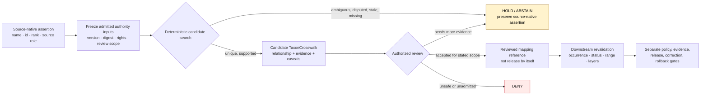

<!-- [KFM_META_BLOCK_V2]
doc_id: kfm://doc/runbook-fauna-taxonomy-resolution
title: Fauna Taxonomy Resolution Runbook
type: standard
profile: repository-grounded-taxonomy-resolution-handoff
version: v1.0
prior_version: proposed-scaffold
status: draft; repository-grounded; manual-handoff; executable-resolution-hold; no-network-by-default; fail-closed; non-authoritative; non-publisher
owners:
  - "@bartytime4life — verified GitHub review route only"
owner_status: "Fauna, taxonomy, source, rights, evidence, policy, sensitivity, schema, validation, review, correction, release, and independent-review assignments remain NEEDS VERIFICATION; CODEOWNERS routing does not create those authorities."
created: NEEDS VERIFICATION — scaffold predates this repository-grounded replacement
updated: 2026-08-24
policy_label: public; fauna; taxonomy; no-network; ambiguity-abstain; source-role-aware; correction-aware; non-release
current_path: docs/runbooks/fauna/TAXONOMY_RESOLUTION_RUNBOOK.md
owning_root: docs/
responsibility: "Document the bounded, fail-closed procedure for preserving source-native Fauna taxonomy assertions, preparing reviewable Taxon and TaxonCrosswalk candidates, classifying ambiguity and authority conflict, and handing downstream impacts to authorized reviewers without inventing taxonomic truth or implying source admission, policy approval, release, deployment, or publication."
truth_posture: >-
  CONFIRMED same-path runbook placement under accepted Directory Rules,
  substantive draft Taxon and TaxonCrosswalk semantic contracts, permissive
  paired schema scaffolds, README-only taxonomy helper and resolver-validator
  lanes, one-line placeholder taxonomy test, one bounded Fauna workflow that
  checks synthetic taxonomy_state but does not resolve taxonomy, proposed
  ambiguity policy with no real rules, and a Fauna source-registry lane without
  admitted descriptor records / PROPOSED future closed Taxon and TaxonCrosswalk
  schemas, version-pinned authority snapshots, deterministic resolver,
  evidence-bound mapping packet, accepted ambiguity/tie-break policy, fixture
  matrix, review record, correction propagation, and CI profile / UNKNOWN live
  taxonomy-source admission, current authority snapshot versions, operational
  resolver behavior, production policy enforcement, downstream consumers,
  release state, deployment, and public behavior; cite-or-abstain
prepared_under_prompt: KFM Repository Build-Out & Markdown Modernization Implementation Agent v6.0.0
evidence_snapshot:
  repository: bartytime4life/Kansas-Frontier-Matrix
  base_ref: main
  base_commit: 4a6c06fb3ab1f7e6e29c99ae07000aa94ad4cc38
  target_prior_blob: 7c30a3320f60ad5b19ad129c6b30dfbc92ff8d1c
  directory_rules_blob: fd49a0b83e55cef52c1124281f093e263526898d
  taxon_schema_blob: 3ee60e2f4e4cf85b0fabdc5edb3ec5bde98d598e
  taxon_crosswalk_schema_blob: 08340159da340492651c8c253979d56cfeeb5809
  taxonomy_package_readme_blob: 49492b00256211fc7344a2e434d0a5705080d33c
  taxonomy_resolver_readme_blob: 8fc976b01147227679392e47ad7bcca40d71d9d0
  taxonomy_test_placeholder_blob: 3a119fbbec5dd5480da679a678270b89db6b95a6
  domain_fauna_workflow_blob: 0edc73a77ee0ddb3193db2c0386ed6ac685b139a
  ambiguity_policy_stub_blob: 52a9c0e896b9bec4eebfe8b08e0daf3c4ff310e4
  fauna_source_registry_readme_blob: c3a36f721b445ae41d2d9407f7b3524872ed1128
  fauna_validator_index_blob: 85ae1a31410c1761e92d1060a871658157f217de
  public_safe_fixture_validator_blob: fe96d8c4cc78f44679ddf617b2b1251fe621928c
inspection_boundary: >-
  Current-session GitHub reads of the target scaffold, accepted Directory Rules
  and ADR-0029, the parent runbook index, Fauna Taxon and TaxonCrosswalk
  contracts and schemas, Fauna identity and open-question documents, taxonomy
  helper and validator README lanes, source registry, policy stubs, fixtures,
  tests, validators, and domain workflow. Initial evidence reads were taken at
  main@67e1e2c698dff941b689dba35cfc968ac573a5af; main then advanced through
  PR #3500, whose only changed file was docs/runbooks/atmosphere/README.md.
  The target was re-read unchanged at main@4a6c06fb3ab1f7e6e29c99ae07000aa94ad4cc38,
  and the direct-dependency blobs pinned above were outside that intervening
  change. Repository-native commands were not executed in a mounted checkout during
  authoring. No live taxonomy service was contacted; no taxonomy source was
  admitted; no Taxon, TaxonCrosswalk, EvidenceBundle, PolicyDecision,
  ReviewRecord, CorrectionNotice, release decision, deployment, promotion, or
  publication was created or changed.
related:
  - docs/runbooks/README.md
  - docs/runbooks/fauna/NO_NETWORK_TEST_RUNBOOK.md
  - docs/runbooks/fauna/PROMOTION_RUNBOOK.md
  - docs/runbooks/fauna/ROLLBACK_RUNBOOK.md
  - docs/doctrine/directory-rules.md
  - docs/adr/ADR-0029-adopt-directory-governance-standard-v2.md
  - docs/domains/fauna/IDENTITY_MODEL.md
  - docs/domains/fauna/OPEN_QUESTIONS.md
  - docs/domains/fauna/MISSING_OR_PLANNED_FILES.md
  - contracts/domains/fauna/taxon.md
  - contracts/domains/fauna/taxon_crosswalk.md
  - schemas/contracts/v1/domains/fauna/taxon.schema.json
  - schemas/contracts/v1/domains/fauna/taxon_crosswalk.schema.json
  - packages/taxonomy/README.md
  - tools/validators/taxonomy_resolver/README.md
  - tools/validators/domains/fauna/README.md
  - tests/domains/fauna/test_taxonomy_resolution.py
  - tests/domains/fauna/test_fauna_smoke.py
  - policy/domains/fauna/abstain_on_ambiguous.rego
  - data/registry/sources/fauna/README.md
  - .github/workflows/domain-fauna.yml
tags: [kfm, runbook, fauna, taxonomy, taxon, crosswalk, ambiguity, synonym, split, lump, source-role, evidence, no-network, correction, release-hold]
notes:
  - "Same-path documentation modernization under accepted ADR-0029; no root, lane, contract, schema, policy, source descriptor, package, validator, test, workflow, receipt, proof, release object, or public state is created or moved."
  - "The current repository can reject an unresolved taxonomy_state inside a synthetic public-safe fixture, but it does not currently prove how a taxon was resolved."
  - "Operational taxonomy resolution remains HOLD until admitted, version-pinned authority inputs, closed schemas, an executable resolver, exact fixtures/tests, accepted policy, evidence, review, correction, and downstream-impact handling exist."
[/KFM_META_BLOCK_V2] -->

<a id="top"></a>

# Fauna Taxonomy Resolution Runbook

> **Repository-grounded, fail-closed procedure for preserving a source-native animal name or identifier, preparing a reviewable taxonomic mapping, and classifying ambiguity without turning a label match, crosswalk candidate, model suggestion, or green fixture test into taxonomic authority.**

<p>
  
  
  
  
  
  
</p>

> [!IMPORTANT]
> **This runbook does not resolve taxonomy by itself.** It documents how to preserve inputs, prepare a bounded candidate, stop on ambiguity, and hand the candidate to the owning taxonomy, evidence, policy, and review authorities. A name match, identifier lookup, schema parse, passing test, workflow result, crosswalk row, or human-readable conclusion is not accepted taxonomic truth or release authority.

> [!CAUTION]
> **Default execution is no-network.** Do not query a live taxonomy service, download a current backbone, use credentials, or silently refresh an authority snapshot while following this procedure. Live-source admission, terms review, snapshot identity, version pinning, and retrieval receipts are separate governed work.

> [!WARNING]
> **Taxonomy can change downstream sensitivity.** A taxon label may be public in isolation yet become harmful when joined to an exact occurrence, nest, den, roost, hibernaculum, spawning site, telemetry path, private parcel, or reverse-engineerable derivative. Do not expose those joins through this procedure.

**Quick navigation:** [Purpose](#1-purpose-scope-and-non-goals) · [Authority](#2-authority-placement-and-current-evidence) · [State model](#3-taxonomy-resolution-state-model) · [Invariants](#4-non-negotiable-invariants) · [Preflight](#5-preflight-and-stop-conditions) · [Procedure](#6-bounded-resolution-procedure) · [Relationships](#7-mapping-relationship-guide) · [Outcomes](#8-outcomes-and-reason-codes) · [Commands](#9-current-executable-boundary) · [Handoff](#10-review-handoff-packet) · [Downstream impact](#11-downstream-impact-and-correction) · [Sensitivity](#12-rights-sensitivity-and-public-surface-controls) · [Validation](#13-validation-and-test-matrix) · [Troubleshooting](#14-troubleshooting) · [Open work](#15-current-holds-and-open-verification) · [Maintenance](#16-maintenance-document-correction-and-rollback) · [Checklist](#appendix-a-operator-checklist) · [Template](#appendix-b-illustrative-handoff-template) · [Anti-patterns](#appendix-c-anti-patterns)

---

## 1. Purpose, scope, and non-goals

### Purpose

Use this runbook when a Fauna record carries a source-native animal name, identifier, rank, synonym, or candidate concept and KFM must determine what may be asserted next without losing source lineage or overstating certainty.

The operator's bounded responsibilities are to:

1. freeze the repository revision, source record, and declared authority snapshots;
2. preserve the source-native identifier, spelling, authorship, rank, and source role;
3. separate taxon identity from occurrence, legal status, range, habitat, and release state;
4. attempt only deterministic, version-scoped matching against supplied governed inputs;
5. classify exact, synonym, broad, narrow, related, disputed, candidate, deprecated, superseded, or no-match relationships without inventing equivalence;
6. stop on ambiguity, missing authority, unadmitted source, stale version, generated suggestion, or unresolved provenance;
7. produce a value-minimized review handoff with evidence and downstream-impact references;
8. preserve correction and rollback targets before a mapping is used by later lifecycle stages.

### In scope

- `Taxon` and `TaxonCrosswalk` candidate preparation;
- source-native scientific names, common names, identifiers, ranks, authorship, hierarchy, and name status;
- exact identifier matches, reviewed synonyms, split/lump candidates, broad/narrow relationships, deprecated or superseded concepts, disputed mappings, and no-match outcomes;
- version and digest capture for supplied authority snapshots;
- source-role, rights, evidence, review, policy, sensitivity, correction, and downstream-impact checks;
- no-network fixture or local-snapshot rehearsal;
- truthful review handoff at an exact repository revision.

### Out of scope

This runbook does not:

- declare KFM the taxonomic authority of record;
- contact or activate a live taxonomy source;
- choose a current ITIS, GBIF, NatureServe, USFWS, IUCN, Wikidata, or other authority version;
- infer accepted identity from a field observation, occurrence aggregator, common name, image classifier, fuzzy search, model, AI answer, or UI label;
- prove occurrence, abundance, range, habitat, conservation status, legal status, disease, mortality, or invasive status;
- define machine shape in Markdown;
- create a source descriptor, admitted vocabulary snapshot, `EvidenceBundle`, `PolicyDecision`, `ReviewRecord`, `CorrectionNotice`, release manifest, or rollback record;
- mutate RAW, WORK, QUARANTINE, PROCESSED, CATALOG, TRIPLET, or PUBLISHED state;
- expose sensitive exact locations or authorize a public layer, API response, map popup, export, Focus Mode answer, or AI response;
- replace taxonomic steward review where the mapping is consequential, disputed, ambiguous, or downstream-sensitive.

[Back to top](#top)

---

## 2. Authority, placement, and current evidence

### 2.1 Directory Rules basis

Accepted [ADR-0029](../../adr/ADR-0029-adopt-directory-governance-standard-v2.md) adopts [Directory Rules v2](../../doctrine/directory-rules.md). This file is a human operational procedure and remains at the existing path:

```text
docs/runbooks/fauna/TAXONOMY_RESOLUTION_RUNBOOK.md
```

This is a same-path `PLACE` update under the `docs/` responsibility root. It creates no parallel taxonomy, schema, policy, source-registry, validator, evidence, release, or publication home.

| Responsibility | Owning surface | Relationship to this runbook |
|---|---|---|
| Human taxonomy-resolution procedure | `docs/runbooks/fauna/` | **Owned here** |
| Taxon meaning | [`contracts/domains/fauna/taxon.md`](../../../contracts/domains/fauna/taxon.md) | Referenced; not redefined |
| Crosswalk meaning | [`contracts/domains/fauna/taxon_crosswalk.md`](../../../contracts/domains/fauna/taxon_crosswalk.md) | Referenced; not redefined |
| Machine shape | [`taxon.schema.json`](../../../schemas/contracts/v1/domains/fauna/taxon.schema.json) and [`taxon_crosswalk.schema.json`](../../../schemas/contracts/v1/domains/fauna/taxon_crosswalk.schema.json) | Referenced; currently permissive scaffolds |
| Reusable resolver mechanics | [`packages/taxonomy/`](../../../packages/taxonomy/README.md) | Proposed helper boundary; not authority |
| Resolver validation | [`tools/validators/taxonomy_resolver/`](../../../tools/validators/taxonomy_resolver/README.md) | Documentary routing lane; no executable resolver confirmed |
| Domain validation | [`tools/validators/domains/fauna/`](../../../tools/validators/domains/fauna/README.md) | Three bounded non-taxonomy-resolution slices |
| Source admission and authority snapshots | [`data/registry/sources/fauna/`](../../../data/registry/sources/fauna/README.md) and accepted registry homes | Required upstream support; no admitted records confirmed in this lane |
| Policy | [`policy/domains/fauna/`](../../../policy/domains/fauna/README.md) | Owns allow, deny, restrict, and abstain behavior |
| Fixtures and tests | `fixtures/domains/fauna/`, `tests/domains/fauna/` | Prove bounded behavior only |
| Evidence, review, correction, release | Owning proof, governance, correction, and release surfaces | Separate authority and state |
| Public delivery | Governed APIs and released public-safe carriers | Not exercised here |

### 2.2 Current repository status at the evidence snapshot

| Surface | CONFIRMED repository evidence | Safe conclusion |
|---|---|---|
| Target file | Eleven-line `PROPOSED scaffold`, blob `7c30a332...` | Replacement is needed; scaffold is not an operating procedure |
| Directory governance | ADR-0029 is accepted; Directory Rules bytes are pinned | Same-path runbook content is placement-safe |
| `Taxon` contract | Substantive draft semantic contract | Meaning is documented; operational authority remains held |
| `TaxonCrosswalk` contract | Substantive draft semantic contract | Mapping relationships are documented; accepted mappings are not established |
| Paired schemas | Draft 2020-12 schemas with empty `properties` and `additionalProperties: true` | JSON may parse while every material taxonomy field remains unenforced |
| `packages/taxonomy/` | README and `.gitkeep` only | No reusable resolver implementation is confirmed |
| `tools/validators/taxonomy_resolver/` | README and `.gitkeep` only | No executable taxonomy resolver validator is confirmed |
| `test_taxonomy_resolution.py` | One-line `PROPOSED placeholder` | No taxonomy-resolution test behavior is implemented there |
| Domain Fauna workflow | Runs `test_fauna_smoke.py` only | Hosted workflow checks synthetic fixture hygiene, not taxonomy resolution |
| Public-safe fixture validator | Requires `taxonomy_state: synthetic-resolved` and rejects another state | It checks a declaration; it does not derive or verify the taxon mapping |
| Ambiguity policy | `abstain_on_ambiguous.rego` says `PROPOSED greenfield stub. No real rules yet.` | Do not treat it as accepted or operational ambiguity policy |
| Fauna source registry lane | README plus `.gitkeep`; no descriptor instances in the inspected directory | No admitted taxonomy authority snapshot is established there |
| Live resolver, production policy, review, correction, release, public consumers | Not proved by inspected repository evidence | **UNKNOWN / HOLD** |

> [!IMPORTANT]
> The repository currently proves a narrower fact: a synthetic public-safe fixture can be required to *declare* `synthetic-resolved`, and an unresolved declaration can be rejected. It does not prove how an actual animal name or source identifier becomes an accepted KFM taxon concept.

### 2.3 Evidence hierarchy for a resolution attempt

Use evidence in this order for the claim being made:

1. accepted KFM doctrine and decisions for boundaries;
2. admitted, version-pinned taxonomy authority or source-native vocabulary records;
3. source-native identifier and source record;
4. reviewed `TaxonCrosswalk` and its evidence;
5. explicit steward review and correction lineage;
6. downstream carriers only after governed release.

A display label, fuzzy match, search result, model score, generated suggestion, map legend, graph label, or prior answer is not taxonomy authority.

[Back to top](#top)

---

## 3. Taxonomy-resolution state model

Keep these states independent:

| Axis | Example | Must not be collapsed into |
|---|---|---|
| Source assertion | Source record says `Name A`, native ID `123` | Accepted KFM identity |
| Authority snapshot | Versioned vocabulary contains concept `X` | Source admission or rights clearance |
| Match result | Candidate exact/synonym/broad/narrow relation | Reviewed crosswalk |
| Review state | Taxonomy steward accepts, disputes, or holds candidate | Policy decision |
| Evidence state | Mapping support resolves to admissible evidence | Release state |
| Policy state | Use is allowed, restricted, denied, or abstained | Taxonomic correctness |
| Lifecycle state | Candidate is in WORK, QUARANTINE, or later stage | Publication |
| Release state | Immutable released object exists | Current authority truth forever |
| Correction state | Split, lump, synonym, misidentification, or withdrawal recorded | Silent overwrite |
| Public presentation | Label appears in a map, API, export, or AI answer | Source or taxonomy authority |

### 3.1 Intended bounded flow



### 3.2 Lifecycle posture

```text
RAW -> WORK / QUARANTINE -> PROCESSED -> CATALOG / TRIPLET -> PUBLISHED
```

Taxonomy resolution ordinarily occurs in `WORK` and may route a candidate to `QUARANTINE`. A reviewed mapping can support later `PROCESSED` objects, but the mapping does not promote itself. Publication remains a separate governed transition.

[Back to top](#top)

---

## 4. Non-negotiable invariants

1. **Preserve the source-native assertion.** Never overwrite the original name, identifier, rank, authorship, spelling, or source record with a normalized label.
2. **Identifier before label.** Prefer an exact source-native or authority identifier under a pinned version. A text match alone is not equivalence.
3. **Version every authority input.** A taxonomy without a version, release identity, digest, or retrieval provenance is not stable enough for consequential resolution.
4. **Source role remains explicit.** An occurrence source may report a name; that does not make the source a taxonomic authority.
5. **Crosswalk is a claim.** Exact, synonym, broad, narrow, related, disputed, candidate, deprecated, superseded, and no-match mappings each require their own provenance and review posture.
6. **Ambiguity fails closed.** Multiple candidates, conflicting authorities, missing hierarchy, stale snapshots, or unresolved splits/lumps produce `HOLD` or `ABSTAIN`, not a guessed winner.
7. **Generated suggestions are non-authoritative.** Fuzzy matching, AI, embeddings, classifiers, and model scores may propose candidates only.
8. **No hidden live lookup.** The resolver must use explicit supplied or admitted snapshots. A helper may not silently call the network.
9. **Taxon is not occurrence.** Resolving an identity does not prove the animal occurred at a place or time.
10. **Taxon is not status.** Resolving a name does not assign federal, state, global, legal, or conservation status.
11. **Sensitivity travels downstream.** A public taxon identity can become restricted through an occurrence or sensitive-site join.
12. **Correction is first-class.** Splits, lumps, synonym changes, misidentifications, source withdrawals, and authority updates must preserve prior identities and downstream impact.
13. **EvidenceRef must close where consequential.** A reference string is not an `EvidenceBundle`.
14. **A validator pass is bounded.** It is not source admission, taxonomy authority, review approval, policy approval, release, deployment, or publication.
15. **Cite or abstain.** When the scoped authority cannot be stated and supported, preserve the source-native assertion and abstain from one accepted identity.

[Back to top](#top)

---

## 5. Preflight and stop conditions

### 5.1 Required inputs

Before attempting a mapping, record:

- [ ] exact repository revision;
- [ ] candidate object or record identifier;
- [ ] source-native taxon name exactly as received;
- [ ] source-native taxon identifier, if present;
- [ ] source-native rank, authorship, parent, and name status, if present;
- [ ] source descriptor or explicit source-admission reference;
- [ ] canonical source role for the assertion;
- [ ] rights, attribution, access, and redistribution posture;
- [ ] each authority snapshot identifier, version, digest, and provenance;
- [ ] requested use: internal normalization, occurrence validation, status join, public label, export, map, API, or AI;
- [ ] sensitivity and downstream-join context;
- [ ] evidence references and reviewer role;
- [ ] correction and rollback target for affected downstream objects.

### 5.2 Mandatory stop conditions

Stop and emit `HOLD`, `ABSTAIN`, `DENY`, or `ERROR` as appropriate when:

| Condition | Minimum outcome | Required next step |
|---|---|---|
| No admitted source descriptor or authority snapshot | `HOLD` | Source admission and snapshot review |
| Authority version or digest absent | `HOLD` | Pin the exact snapshot |
| Live lookup would be required | `HOLD` | Commission and review a no-network snapshot or separately authorized connector |
| Source-native identifier/name missing | `ERROR` or `HOLD` | Correct input or preserve incomplete source state |
| Multiple candidates remain | `ABSTAIN` / `HOLD` | Taxonomy steward review |
| Two authorities disagree | `ABSTAIN` / `HOLD` | Preserve both scoped opinions; do not merge |
| Candidate requires a split or lump | `HOLD` | Downstream impact inventory and review |
| Candidate mapping is broad, narrow, or related rather than exact | `HOLD` | Preserve relationship and caveat; do not upcast |
| Taxon concept is deprecated, withdrawn, stale, or superseded | `HOLD` | Resolve replacement and correction lineage |
| Fuzzy match, model, AI, or generated label is the only support | `DENY` | Obtain admitted authority evidence |
| Source role is occurrence/aggregate/model but used as taxonomic authority | `DENY` | Restore correct role and authority source |
| Mapping would reveal a sensitive location or reverse-engineerable join | `DENY` | Route through sensitivity, geoprivacy, and review controls |
| Evidence reference does not resolve | `ABSTAIN` / `HOLD` | Repair evidence closure |
| Required reviewer or correction target is unknown | `HOLD` | Establish review and rollback path |
| Parser, schema, registry, or resolver fails unexpectedly | `ERROR` | Record value-safe failure and stop |

> [!CAUTION]
> Do not convert `HOLD` into `PASS` by deleting context, dropping alternate candidates, weakening a rank check, choosing the first search result, or changing the authority snapshot during the run.

[Back to top](#top)

---

## 6. Bounded resolution procedure

### Step 1 — Freeze the subject and requested use

Record the exact repository commit, input object, source record, and requested consumer. The same source-native name may require different caveats for internal normalization, federal reconciliation, international biodiversity search, public display, or a sensitive occurrence join.

Do not begin with “What is the accepted name?” Begin with:

> Which source asserted which taxonomic concept, under which source role and time, and what exact use is being requested?

### Step 2 — Preserve the source-native assertion

Copy the following without normalization or correction:

- native identifier;
- scientific name;
- authorship;
- rank;
- parent or hierarchy path;
- name status;
- common name and language, where provided;
- source record reference;
- source time and retrieval provenance.

Normalization belongs in a separate candidate field. Never replace the original source value.

### Step 3 — Verify source and authority admissibility

Confirm that each input has:

- a source or vocabulary identity;
- an explicit source role;
- rights and permitted-use posture;
- a version/release identifier;
- a content digest or immutable reference;
- retrieval provenance;
- steward or review state;
- known limitations.

At the current evidence snapshot, the inspected Fauna source-registry directory contains no descriptor instances. Therefore an operational source-backed resolution attempt remains `HOLD` unless another accepted registry surface supplies the required records.

### Step 4 — Load explicit no-network snapshots

Use only supplied, reviewed, local snapshots. Record their identity before matching. Do not let helper code refresh them.

Minimum snapshot record:

| Field | Requirement |
|---|---|
| Authority or source vocabulary ID | Required |
| Version or release | Required |
| Digest or immutable pointer | Required |
| Retrieved at | Required for provenance; not automatically identity-bearing |
| Source role | Required |
| Rights / permitted use | Required |
| Review state | Required |
| Supersedes / superseded by | Required when known |
| Limitations | Required when material |

### Step 5 — Attempt exact identifier resolution

If the source-native identifier is from the same admitted authority and version:

1. look up the exact identifier;
2. verify one and only one concept is returned;
3. compare rank, scientific name, authorship, parent, and status;
4. record discrepancies;
5. classify the relationship; do not assume `exact` merely because the ID exists.

An identifier reused, deprecated, redirected, or version-shifted requires explicit correction handling.

### Step 6 — Attempt deterministic name and synonym resolution

Only after identifier handling:

1. normalize Unicode and whitespace without losing the original value;
2. compare exact scientific name plus authorship where available;
3. compare rank and parent context;
4. inspect admitted synonym relations;
5. retain all candidates and the path by which each was found;
6. stop when more than one candidate remains or when rank/hierarchy conflict is material.

Common names are routing aids, not sufficient taxonomic identity.

### Step 7 — Classify the mapping relationship

Choose the narrowest supported relationship from [§7](#7-mapping-relationship-guide). A candidate may not be promoted from `broad`, `narrow`, `related`, `disputed`, `candidate`, or `no-match` to `exact` for convenience.

### Step 8 — Evaluate authority conflict and time

Compare:

- authority scope;
- source version;
- valid/effective interval;
- synonym, split, lump, and supersession history;
- downstream use;
- evidence and review state.

When authorities disagree, preserve separate scoped mappings. Do not invent a third merged identity. The current repository's proposed ITIS-versus-GBIF tie-break idea is not codified in an accepted policy bundle, so this runbook does not choose one.

### Step 9 — Prepare the candidate packet

Prepare a value-minimized handoff containing:

- source-native assertion;
- authority snapshot references;
- candidate target concepts;
- proposed mapping relationship;
- exact discrepancies and alternatives;
- source-role and rights posture;
- evidence references;
- review need;
- sensitivity and public-surface obligations;
- downstream objects and releases that may be affected;
- correction and rollback targets;
- finite operator outcome and reason codes.

Use [Appendix B](#appendix-b-illustrative-handoff-template) only as a documentation aid. It is not a canonical schema.

### Step 10 — Obtain authorized review

Taxonomy steward review is required when the mapping is:

- disputed or authority-scoped;
- synonym-based without an exact stable ID;
- broad, narrow, related, split, or lump;
- deprecated, superseded, or corrected;
- material to legal/conservation status;
- material to sensitive-species handling;
- used to alter a released label, layer, API, export, graph, or AI response;
- otherwise consequential under the owning policy.

Record the review result separately. This runbook cannot authenticate or approve the reviewer.

### Step 11 — Revalidate downstream objects

After an accepted mapping exists for the stated scope, identify and revalidate every dependent:

- occurrence evidence;
- restricted/public derivatives;
- conservation or legal status;
- range and seasonal range;
- migration route;
- sensitive-site records;
- mortality, disease, and invasive-species records;
- catalog/triplet projections;
- search, layer, tile, API, export, Focus Mode, and AI carriers.

A taxon correction may change sensitivity, aggregation, field allowlists, evidence bundles, public labels, or release eligibility.

### Step 12 — Preserve correction and rollback

Do not overwrite prior accepted mappings. Emit correction/supersession lineage through the owning object families, retain the prior identity for audit, identify affected releases, and invalidate or rebuild derivatives only through governed procedures.

[Back to top](#top)

---

## 7. Mapping relationship guide

The Fauna crosswalk contract documents the following relationship families. Treat this table as semantic guidance, not proof of a machine enum.

| Relationship | Use when | Required posture |
|---|---|---|
| `exact` | Same taxonomic concept under the stated versions and scope | Preserve both identifiers, version, evidence, and review |
| `synonym` | One authority explicitly treats the source concept/name as a synonym of the target | Record synonym authority, version, and temporal scope |
| `broad` | Source concept contains the target plus additional concepts | Do not upcast to exact; preserve caveat |
| `narrow` | Source concept is contained by the target or maps to only part of it | Do not upcast; downstream aggregation may change |
| `related` | Meaning overlaps but equivalence is not supportable | Keep as contextual link only |
| `parent` / `child` | Hierarchical relation is supported | Do not substitute parent for species-level identity |
| `disputed` | Authorities conflict or the concept is contested | Preserve each scoped opinion; `ABSTAIN` from one universal answer |
| `candidate` | Automated or preliminary mapping awaits review | Keep in WORK/QUARANTINE; no public use |
| `deprecated` | Source or target concept is no longer active | Resolve replacement and correction lineage |
| `superseded` | A newer reviewed mapping replaces this one | Retain prior mapping and forward link |
| `no-match` | No admitted candidate can be supported | Preserve source-native assertion; do not invent a concept |

### 7.1 Split and lump handling

A split or lump is not a simple synonym:

- **split:** one prior concept maps to multiple newer concepts;
- **lump:** multiple prior concepts map to one newer concept.

Both require downstream impact review because occurrence, status, range, sensitivity, and release claims may no longer be transferable without additional evidence.

### 7.2 Misidentification handling

A corrected identification is a correction to an assertion, not merely a label update. Preserve:

- original assertion;
- original source and evidence;
- correction basis;
- corrected concept;
- reviewer;
- affected downstream objects;
- correction time;
- rollback or withdrawal path.

[Back to top](#top)

---

## 8. Outcomes and reason codes

### 8.1 Operator handoff outcomes

Until an accepted executable resolver contract exists, use these as human handoff states only:

| Outcome | Meaning |
|---|---|
| `READY_FOR_TAXONOMY_REVIEW` | Inputs, snapshot identities, candidate relations, evidence refs, caveats, and impacts are complete enough for an authorized reviewer |
| `HOLD` | A checkable prerequisite is unresolved: admission, version, digest, ambiguity, review, correction, or downstream impact |
| `ABSTAIN` | Available evidence is insufficient to assert one scoped taxonomic identity |
| `DENY` | The attempt relies on an unadmitted source, generated authority, unsafe disclosure, role upcast, or prohibited public use |
| `ERROR` | The procedure could not complete because input or tooling failed |
| `SUPERSEDED` | A prior mapping remains auditable but a reviewed successor now applies to the stated scope |

`READY_FOR_TAXONOMY_REVIEW` is not `PASS`, acceptance, source admission, policy approval, or release.

### 8.2 Documentary future machine vocabulary

[`tools/validators/taxonomy_resolver/README.md`](../../../tools/validators/taxonomy_resolver/README.md) documents future result and reason-code names, including:

- `TAXONOMY_RESOLVER_PASS`, `TAXONOMY_RESOLVER_FAIL`, `TAXONOMY_RESOLVER_DENY`, `TAXONOMY_RESOLVER_RESTRICT`, `TAXONOMY_RESOLVER_HOLD`, `TAXONOMY_RESOLVER_ABSTAIN`;
- `TAXONOMY_REF_MISSING`, `TAXONOMY_TERM_MISSING`, `TAXONOMY_TERM_UNKNOWN`, `TAXONOMY_TERM_DUPLICATE`, `TAXONOMY_TERM_AMBIGUOUS`;
- `TAXONOMY_TERM_DEPRECATED`, `TAXONOMY_VERSION_STALE`, `TAXONOMY_ROOT_UNTRUSTED`, `TAXONOMY_HIERARCHY_MISSING`;
- `TAXONOMY_CROSSWALK_UNREVIEWED`, `TAXONOMY_CROSSWALK_DRIFT`, `TAXONOMY_PROVENANCE_MISSING`;
- `TAXONOMY_GENERATED_LABEL_DENIED`, `PUBLIC_SURFACE_LEAKAGE_DENIED`, and `VALIDATOR_SYSTEM_ERROR`.

These names are **documented but not confirmed as an implemented CLI, schema enum, policy contract, or workflow result**. Do not build automation that depends on them until implementation and tests land.

### 8.3 Minimum reason mapping

| Condition | Operator outcome | Documentary reason candidate |
|---|---|---|
| Required source/authority ref absent | `HOLD` | `TAXONOMY_REF_MISSING` |
| Native name or ID absent | `ERROR` / `HOLD` | `TAXONOMY_TERM_MISSING` |
| No admitted candidate | `ABSTAIN` | `TAXONOMY_TERM_UNKNOWN` |
| Multiple candidates | `ABSTAIN` / `HOLD` | `TAXONOMY_TERM_AMBIGUOUS` |
| Duplicate/conflicting identifiers | `HOLD` | `TAXONOMY_TERM_DUPLICATE` |
| Stale or unsupported snapshot | `HOLD` | `TAXONOMY_VERSION_STALE` |
| Unadmitted authority root | `DENY` | `TAXONOMY_ROOT_UNTRUSTED` |
| Missing parent/hierarchy context | `HOLD` | `TAXONOMY_HIERARCHY_MISSING` |
| Unreviewed crosswalk | `HOLD` | `TAXONOMY_CROSSWALK_UNREVIEWED` |
| Source/target versions drifted | `HOLD` | `TAXONOMY_CROSSWALK_DRIFT` |
| Missing provenance/evidence | `ABSTAIN` / `HOLD` | `TAXONOMY_PROVENANCE_MISSING` |
| AI/fuzzy/generated suggestion treated as truth | `DENY` | `TAXONOMY_GENERATED_LABEL_DENIED` |
| Mapping would expose unsupported public state | `DENY` | `PUBLIC_SURFACE_LEAKAGE_DENIED` |
| Resolver/parser failure | `ERROR` | `VALIDATOR_SYSTEM_ERROR` |

[Back to top](#top)

---

## 9. Current executable boundary

### 9.1 What can be run now

The current domain workflow runs this bounded suite:

```bash
KFM_NO_NETWORK=1 PYTHONDONTWRITEBYTECODE=1 \
python -m unittest discover \
  --start-directory tests/domains/fauna \
  --pattern 'test_fauna_smoke.py' \
  --verbose
```

That suite:

- blocks selected network calls inside its test boundary;
- accepts only synthetic, fixture-only, unreleased, promotion-ineligible candidates;
- requires a synthetic `taxon_ref`;
- requires `taxonomy_state: synthetic-resolved`;
- rejects the fixture whose taxonomy state is unresolved;
- checks fixture hygiene and sensitive-location withholding controls.

It does **not**:

- inspect an admitted taxonomy snapshot;
- map a source-native ID or name;
- choose an accepted concept;
- verify a synonym, split, lump, rank, parent, or authorship;
- resolve a `TaxonCrosswalk`;
- create evidence or review records;
- authorize public use.

### 9.2 Schema syntax checks

The paired schema files can be checked for JSON syntax:

```bash
python -m json.tool \
  schemas/contracts/v1/domains/fauna/taxon.schema.json \
  >/dev/null

python -m json.tool \
  schemas/contracts/v1/domains/fauna/taxon_crosswalk.schema.json \
  >/dev/null
```

A successful parse proves only that the files are valid JSON. Because both schemas currently declare no properties and allow additional properties, these checks do not establish field-level taxonomy conformance.

### 9.3 What is not currently available

At the evidence snapshot:

- `packages/taxonomy/` has no confirmed executable helper;
- `tools/validators/taxonomy_resolver/` has no confirmed validator script;
- `tests/domains/fauna/test_taxonomy_resolution.py` is a one-line placeholder;
- no accepted `make` target or aggregate taxonomy-resolution command was established;
- no admitted authority snapshot or source descriptor instance was established in the inspected Fauna source-registry lane;
- no accepted ambiguity/tie-break policy was established.

Do not invent or advertise a command such as `validate_taxonomy_resolution.py` merely because a README proposes that future filename.

### 9.4 Hosted CI interpretation

A green `domain-fauna` workflow proves the bounded synthetic fixture suite passed at that exact head. It does not prove taxonomy resolution. When reporting CI:

- pin the exact head SHA;
- name the workflow and job;
- distinguish completed, pending, skipped, and held jobs;
- distinguish introduced failures from inherited repository failures;
- retain the explicit proof and release holds;
- do not claim review, merge, release, deployment, promotion, or publication.

[Back to top](#top)

---

## 10. Review handoff packet

A review handoff should contain enough information to reproduce the candidate without exposing sensitive values.

### 10.1 Required sections

| Section | Required content |
|---|---|
| Subject | Candidate/object ID, source record ref, requested use |
| Revision | Repository commit and changed-area scope |
| Source-native assertion | Native ID, exact name, authorship, rank, parent, status |
| Source posture | Source descriptor ref, source role, rights, limitations |
| Authority inputs | Snapshot IDs, versions, digests, retrieval refs |
| Candidate mappings | Target IDs, relationship, rank/hierarchy comparison, alternates |
| Evidence | EvidenceRefs and resolution status |
| Conflict/ambiguity | Competing candidates or authority disagreements |
| Sensitivity | Whether the mapping changes a sensitive-species or precise-location obligation |
| Downstream impact | Occurrences, statuses, ranges, layers, releases, and consumers affected |
| Correction/rollback | Prior mapping, successor/correction path, rollback target |
| Outcome | `READY_FOR_TAXONOMY_REVIEW`, `HOLD`, `ABSTAIN`, `DENY`, `ERROR`, or `SUPERSEDED` |
| Review | Required reviewer class; actual identity recorded in the owning review object |
| Non-effects | No source admission, policy approval, release, deployment, promotion, or publication |

### 10.2 Review questions

The reviewer should answer:

1. Are source role and authority scope appropriate for the claim?
2. Are all authority snapshots explicit, immutable, and permitted for this use?
3. Was the source-native assertion preserved?
4. Is the proposed relationship narrower than or equal to the evidence?
5. Were all alternate candidates and disagreements retained?
6. Does rank, parentage, authorship, and temporal scope agree?
7. Does the mapping require split/lump or correction treatment?
8. Do evidence references resolve?
9. Does the mapping alter sensitivity or public-surface obligations?
10. Are downstream invalidation and rollback targets complete?
11. Is another reviewer or source steward required?
12. Is the correct result acceptance for a stated scope, `HOLD`, `ABSTAIN`, or `DENY`?

[Back to top](#top)

---

## 11. Downstream impact and correction

### 11.1 Impact matrix

| Taxonomic change | Minimum downstream review |
|---|---|
| Spelling normalization only | Confirm source-native value retained and no identity rotation |
| Accepted-name change | Public labels, search, APIs, exports, citations, and crosswalks |
| Synonym update | Occurrence joins, duplicate handling, status/range references |
| Rank or parent change | Hierarchy queries, aggregation, facets, graph edges |
| Split | Re-evaluate every dependent record; prior evidence may not identify the new child concept |
| Lump | Re-evaluate aggregation, status, sensitivity, and duplicate logic |
| Misidentification | Correct source assertion lineage and every dependent occurrence/status/range product |
| Deprecated or superseded ID | Crosswalk, replacement ref, correction notice, consumer compatibility |
| Authority disagreement | Preserve scoped opinions and caveats; abstain from universal accepted-name claims |
| Source withdrawal | Hold dependent mappings and releases until replacement support is reviewed |
| Sensitivity-driver change | Re-run geoprivacy, tile field, public API, export, Focus Mode, and AI no-leak checks |

### 11.2 Correction discipline

A correction should:

1. identify the prior Taxon or TaxonCrosswalk mapping;
2. state the correction basis and evidence;
3. preserve the prior source-native assertion;
4. record the successor mapping and review;
5. inventory affected downstream objects and releases;
6. determine whether public carriers must be withdrawn, corrected, or rebuilt;
7. preserve rollback targets and cache/index invalidation needs;
8. keep prior records auditable.

A Git commit that changes a label is not, by itself, a taxonomy correction record.

[Back to top](#top)

---

## 12. Rights, sensitivity, and public-surface controls

### 12.1 Rights and source terms

A taxonomy authority may permit lookup but restrict redistribution, bundling, derivative publication, or automated access. Record permitted use before creating a reusable snapshot or public crosswalk. Do not infer permission from public reachability.

### 12.2 Sensitive-species handling

Taxonomic resolution may trigger or change sensitivity. Before any mapping reaches a public consumer:

- verify the taxon-level sensitivity driver;
- inspect occurrence and sensitive-site joins;
- confirm exact coordinates and reverse-engineerable hints are absent;
- require geoprivacy, redaction, review, policy, and release records where applicable;
- re-run public field allowlists and no-leak checks;
- preserve caveats without identifying a restricted site.

### 12.3 Public surfaces

The following are downstream carriers, not taxonomy authority:

- map labels and legends;
- feature properties and popups;
- search facets and autocomplete;
- tiles and exports;
- graph labels;
- dashboards and reports;
- Focus Mode and AI answers;
- embeddings and vector indexes.

They must retain the approved taxon reference, authority/version caveat, review/release state, and correction lineage appropriate to the use. They must not use a display string as the only identity.

### 12.4 Generated language

AI may summarize a reviewed, released mapping. It may not choose among ambiguous candidates, invent an accepted concept, suppress an authority disagreement, or reveal a sensitive join. Missing or conflicted support produces `ABSTAIN` or `DENY`.

[Back to top](#top)

---

## 13. Validation and test matrix

### 13.1 Required future fixtures

A real taxonomy-resolution profile should include only synthetic or rights-cleared, minimized, no-network fixtures for:

| Case | Expected relationship/outcome |
|---|---|
| Exact stable ID and matching hierarchy | Candidate `exact`; review policy as configured |
| Reviewed synonym | `synonym` with authority/version evidence |
| Common-name-only input | `ABSTAIN` / `HOLD` |
| Multiple exact-name candidates | `TAXONOMY_TERM_AMBIGUOUS` |
| Conflicting IDs or duplicate aliases | `TAXONOMY_TERM_DUPLICATE` |
| Missing parent or rank conflict | `TAXONOMY_HIERARCHY_MISSING` |
| Broad mapping | `broad`; never exact |
| Narrow mapping | `narrow`; never exact |
| Related concept | `related`; contextual only |
| No match | Preserve source-native assertion; `ABSTAIN` |
| Deprecated concept with replacement | `HOLD` until correction/replacement review |
| Stale authority version | `TAXONOMY_VERSION_STALE` |
| Unadmitted authority root | `DENY` |
| Split | `HOLD`; downstream impact required |
| Lump | `HOLD`; downstream impact required |
| Authority disagreement | Separate scoped mappings; `ABSTAIN` from universal answer |
| Fuzzy/model/AI suggestion only | `TAXONOMY_GENERATED_LABEL_DENIED` |
| Missing provenance/evidence | `TAXONOMY_PROVENANCE_MISSING` |
| Sensitive public join | `PUBLIC_SURFACE_LEAKAGE_DENIED` |
| Parser/runtime fault | `VALIDATOR_SYSTEM_ERROR` |

### 13.2 Minimum implementation proof

Before this runbook can describe an operational resolver as `CONFIRMED`, current repository evidence should establish:

- closed reviewed `Taxon` and `TaxonCrosswalk` schemas;
- admitted, version-pinned, digest-bound authority snapshots;
- deterministic no-network resolver implementation;
- explicit source-role and authority rules;
- exact relationship enum and reason-code contract;
- synthetic positive and negative fixtures;
- substantive taxonomy-resolution tests;
- network-denial tests;
- ambiguity, conflict, split/lump, stale-version, untrusted-root, generated-label, and public-leakage tests;
- evidence and review handoff;
- correction and downstream invalidation tests;
- dedicated CI with exact-head evidence;
- clear non-effects and rollback.

### 13.3 Current status

| Proof item | Current state |
|---|---|
| Semantic contracts | **CONFIRMED substantive drafts** |
| Closed schemas | **ABSENT / NEEDS VERIFICATION** |
| Admitted authority snapshots | **UNKNOWN / HOLD** |
| Resolver implementation | **ABSENT in inspected helper/validator lanes** |
| Taxonomy-resolution fixtures | **NOT CONFIRMED as a dedicated fixture set** |
| Taxonomy-resolution test | **PLACEHOLDER** |
| Ambiguity policy | **PROPOSED stub; no real rules** |
| Domain workflow | **CONFIRMED synthetic fixture hygiene only** |
| Evidence/review/correction closure | **UNKNOWN / HOLD** |
| Release/public use | **UNKNOWN / HOLD** |

[Back to top](#top)

---

## 14. Troubleshooting

| Symptom | Likely cause | Safe response |
|---|---|---|
| A name resolves differently after rerun | Snapshot/version drift or hidden live lookup | Stop; pin version/digest and compare receipts |
| One label returns several taxa | Homonym, missing authorship/rank, or broad search | Preserve all candidates; `ABSTAIN` / `HOLD` |
| Identifier exists but name/rank differs | Deprecated/reused ID, correction, or source mismatch | Do not call exact; inspect authority history |
| Source record uses an old synonym | Legitimate historical/source-native assertion | Preserve original; propose synonym crosswalk |
| Two authorities choose different accepted names | Scoped authority disagreement | Keep separate mappings and caveats |
| Resolver proposes a likely match with confidence | Model/fuzzy candidate only | Keep as candidate; require admitted authority evidence |
| Schema validation passes any object | Current schemas are permissive scaffolds | Do not infer semantic conformance |
| `domain-fauna` workflow is green | Smoke fixture passed | Do not infer resolver, evidence, policy, or release maturity |
| Public layer label changed unexpectedly | Downstream carrier drift | Stop publication path; inspect release/correction lineage |
| Split/lump changes occurrence counts | Historical records cannot be reassigned automatically | Quarantine affected derivatives pending review |
| Taxon update reveals a sensitive species/site join | Join-induced sensitivity | Deny public exposure; route through geoprivacy/review |
| No reviewer or rollback target exists | Governance closure missing | `HOLD` |

### 14.1 Failure reporting

Reports must be value-safe. Include:

- reason code;
- JSON Pointer or field path;
- source/authority reference;
- version/digest;
- candidate count;
- outcome;
- reviewer need.

Do not print restricted coordinates, private identifiers, full sensitive records, credentials, or source payloads merely to explain a taxonomy failure.

[Back to top](#top)

---

## 15. Current holds and open verification

| ID | Item | Current state | Blocks |
|---|---|---|---|
| `FAUNA-TAX-01` | Confirm accountable taxonomy, source, schema, evidence, policy, review, and correction stewards | `NEEDS VERIFICATION` | Review authority |
| `FAUNA-TAX-02` | Admit and pin permitted taxonomy authority snapshots | `HOLD` | Operational resolution |
| `FAUNA-TAX-03` | Close `Taxon` and `TaxonCrosswalk` schemas | `HOLD` | Machine conformance |
| `FAUNA-TAX-04` | Implement deterministic no-network taxonomy helper/resolver | `HOLD` | Executable resolution |
| `FAUNA-TAX-05` | Replace placeholder taxonomy test with exact positive/negative coverage | `HOLD` | Behavioral proof |
| `FAUNA-TAX-06` | Accept relationship and reason-code contracts | `HOLD` | Stable machine outcomes |
| `FAUNA-TAX-07` | Codify ambiguity and authority-disagreement policy | `HOLD` | Automated allow/abstain behavior |
| `FAUNA-TAX-08` | Resolve required versus optional authority anchors | `NEEDS VERIFICATION` | Profile completeness |
| `FAUNA-TAX-09` | Prove EvidenceRef-to-EvidenceBundle and review handoff | `HOLD` | Consequential use |
| `FAUNA-TAX-10` | Prove split/lump/misidentification downstream invalidation | `HOLD` | Correction safety |
| `FAUNA-TAX-11` | Prove sensitive-join and public-surface no-leak behavior | `HOLD` | Public use |
| `FAUNA-TAX-12` | Add dedicated exact-head CI and receipt handling | `HOLD` | Hosted validation evidence |
| `FAUNA-TAX-13` | Reconcile source-registry topology without parallel authority | `NEEDS VERIFICATION` | Canonical source records |
| `FAUNA-TAX-14` | Verify production consumers and external compatibility needs | `UNKNOWN` | Migration/rollback scope |

Operational taxonomy resolution, downstream promotion, release, deployment, and publication remain **HOLD**.

[Back to top](#top)

---

## 16. Maintenance, document correction, and rollback

### 16.1 Update this runbook when

- an executable taxonomy resolver lands;
- schemas close or version;
- an authority snapshot is admitted or withdrawn;
- policy outcomes or reason codes change;
- fixture/test/CI entry points change;
- a correction reveals a missing downstream dependency;
- source rights, sensitivity, or public-surface obligations change;
- Directory Rules or an accepted ADR changes placement or authority;
- a referenced path is migrated or retired.

### 16.2 Documentation correction

When a statement becomes stale:

1. pin the revision that disproves it;
2. label the old statement `STALE` or `SUPERSEDED`;
3. correct the smallest affected section;
4. update evidence snapshot and exact commands;
5. preserve open holds;
6. repair links;
7. validate the changed Markdown;
8. record whether the correction changes behavior or documentation only.

### 16.3 Rollback of this documentation change

This update replaces one scaffold at the same path. Rollback is the normal Git revert of the feature-branch commit or pull request. Reverting the document:

- does not revert taxonomy data;
- does not restore or change a source snapshot;
- does not invalidate an EvidenceBundle;
- does not roll back a policy decision or release;
- does not correct a public carrier.

Any operational taxonomy correction must use the owning correction and release procedures, not a Markdown revert.

[Back to top](#top)

---

## Appendix A — Operator checklist

### Authority and inputs

- [ ] Exact repository revision recorded.
- [ ] Requested use and consumer recorded.
- [ ] Source-native name, ID, rank, authorship, parent, and status preserved.
- [ ] Source descriptor and source role verified.
- [ ] Rights and permitted use verified.
- [ ] Authority snapshots have versions, digests, and provenance.
- [ ] No hidden network lookup or credential use.

### Matching

- [ ] Exact identifier attempted before label matching.
- [ ] Name, authorship, rank, parent, and status compared.
- [ ] Synonym relation is authority-scoped and versioned.
- [ ] Alternate candidates retained.
- [ ] Relationship is not broader than support.
- [ ] Split/lump/deprecation/supersession checked.
- [ ] Generated/fuzzy/AI candidates remain non-authoritative.

### Governance

- [ ] EvidenceRefs and resolution state recorded.
- [ ] Ambiguity or conflict produces `HOLD`/`ABSTAIN`.
- [ ] Sensitive joins checked.
- [ ] Reviewer class identified.
- [ ] Downstream impact inventory complete.
- [ ] Correction and rollback targets identified.
- [ ] No release, deployment, promotion, or publication implied.

### Handoff

- [ ] Outcome and reason codes recorded.
- [ ] Value-safe findings only.
- [ ] Exact snapshots and digests listed.
- [ ] Open questions explicit.
- [ ] Hosted checks, if any, pinned to exact head.
- [ ] Human review remains separate.

[Back to top](#top)

---

## Appendix B — Illustrative handoff template

> [!NOTE]
> This YAML is a documentation template only. It is not a canonical contract, schema, policy input, evidence object, review record, or release object.

```yaml
taxonomy_resolution_handoff:
  handoff_version: "illustrative-v1"
  repository_revision: "<full-commit-sha>"
  subject_ref: "<internal-candidate-ref>"
  requested_use: "<internal-normalization|occurrence-join|status-join|public-label|other>"

  source_native:
    source_descriptor_ref: "<required>"
    source_role: "<required>"
    record_ref: "<required>"
    taxon_id: "<value-or-null>"
    scientific_name: "<exact-source-value>"
    authorship: "<value-or-null>"
    rank: "<value-or-null>"
    parent_ref: "<value-or-null>"
    name_status: "<value-or-null>"

  authority_snapshots:
    - authority_ref: "<required>"
      version: "<required>"
      digest: "<required>"
      retrieval_receipt_ref: "<required>"
      rights_state: "<required>"

  candidate_mappings:
    - target_taxon_ref: "<candidate-ref>"
      relationship: "<exact|synonym|broad|narrow|related|disputed|candidate|deprecated|superseded|no-match>"
      evidence_refs: []
      discrepancies: []
      limitations: []

  operator_outcome: "<READY_FOR_TAXONOMY_REVIEW|HOLD|ABSTAIN|DENY|ERROR|SUPERSEDED>"
  reason_codes: []
  ambiguity_notes: []
  sensitivity_review_required: true
  downstream_refs: []
  correction_target_ref: "<value-or-null>"
  rollback_target_ref: "<value-or-null>"
  reviewer_class_required: "<taxonomy-steward-or-other>"
  release_effect: "none"
  deployment_effect: "none"
  publication_effect: "none"
```

[Back to top](#top)

---

## Appendix C — Anti-patterns

Do not:

- resolve by common name alone;
- select the first search result;
- treat a fuzzy match score as authority;
- let AI choose an accepted concept;
- download an unreviewed current backbone during validation;
- omit authority version or digest;
- overwrite the source-native assertion;
- use an occurrence aggregator as taxonomic authority by access-path convenience;
- upcast `broad`, `narrow`, `related`, `candidate`, or `disputed` to `exact`;
- collapse split/lump history into a silent rename;
- hide alternate candidates or authority disagreements;
- treat `Taxon` as occurrence, range, status, or habitat evidence;
- treat a crosswalk as proof of equivalence without review;
- treat permissive schema success as semantic validation;
- treat `synthetic-resolved` as proof of real resolution;
- treat a green `domain-fauna` workflow as resolver evidence;
- expose a sensitive occurrence because the taxon label is public;
- update public labels without correction and release lineage;
- create a second taxonomy registry under a convenient path;
- publish from a runbook, test, helper package, validator, map, graph, or AI answer.

[Back to top](#top)
