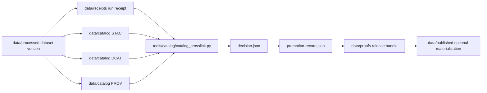

<!-- [KFM_META_BLOCK_V2]
doc_id: kfm://doc/NEEDS_VERIFICATION
title: First KFM Thin Slice
type: standard
version: v1
status: draft
owners: NEEDS_VERIFICATION
created: NEEDS_VERIFICATION
updated: 2026-04-14
policy_label: public
related: [
  ../../README.md,
  ../README.md,
  ../../data/README.md,
  ../../data/processed/README.md,
  ../../data/receipts/README.md,
  ../../data/catalog/README.md,
  ../../data/proofs/README.md,
  ../../data/published/README.md,
  ../../tools/catalog/README.md,
  ../../tools/validators/README.md,
  ../../tools/validators/promotion_gate/README.md,
  ../../tests/README.md
]
tags: [kfm, runbook, thin-slice, catalog-closure, promotion, proofs]
notes: [
  "This runbook is a proposed thin-slice implementation guide and artifact scaffold.",
  "Target path for this document is docs/runbooks/first-kfm-thin-slice/README.md.",
  "owners, doc_id, created date, and policy_label remain NEEDS VERIFICATION."
]
[/KFM_META_BLOCK_V2] -->

<a id="top"></a>

# `docs/runbooks/first-kfm-thin-slice/README.md`

Runbook for standing up the **first evidence-backed KFM thin slice** from processed authority through receipts, catalog closure, promotion, and proof.

> [!NOTE]
> **Status:** experimental  
> **Document status:** draft  
> **Owners:** `NEEDS VERIFICATION`  
> **Path:** `docs/runbooks/first-kfm-thin-slice/README.md`  
>       
> **Quick jump:** [Scope](#scope) · [Repo fit](#repo-fit) · [Accepted inputs](#accepted-inputs) · [Exclusions](#exclusions) · [Directory tree](#directory-tree) · [Quickstart](#quickstart) · [Usage](#usage) · [Diagram](#diagram) · [Artifact set](#artifact-set) · [Task list](#task-list) · [FAQ](#faq)

> [!IMPORTANT]
> This runbook exists because KFM doctrine distinguishes **documentation** from **proof**.
>
> The goal here is not to explain the system again.  
> The goal is to create **one small, inspectable artifact chain** that proves the system can work.

> [!TIP]
> Keep the KFM trust split visible while running this slice:
>
> **receipt ≠ proof ≠ catalog ≠ publication**
>
> This runbook should produce one example of each without collapsing them into one file or one helper.

---

## Scope

This runbook defines the smallest useful end-to-end KFM slice that can prove:

- a processed artifact exists
- a receipt exists
- a `STAC / DCAT / PROV` catalog triplet exists
- the triplet can be cross-checked
- a promotion decision exists
- a release-proof surface exists
- an optional published materialization can point back to release truth

This is a **runbook**, not a standards file and not a lane contract.

Its job is operational:

- tell a maintainer what to create
- keep the first slice small
- preserve trust-boundary separation
- leave later hardening steps visible

[Back to top](#top)

---

## Repo fit

| Concern | Surface |
|---|---|
| This file | `docs/runbooks/first-kfm-thin-slice/README.md` |
| Parent runbooks lane | [`../README.md`](../README.md) |
| Repo root | [`../../README.md`](../../README.md) |
| Lifecycle contract | [`../../data/README.md`](../../data/README.md) |
| Processed authority | [`../../data/processed/README.md`](../../data/processed/README.md) |
| Process memory | [`../../data/receipts/README.md`](../../data/receipts/README.md) |
| Catalog closure | [`../../data/catalog/README.md`](../../data/catalog/README.md) |
| Release evidence | [`../../data/proofs/README.md`](../../data/proofs/README.md) |
| Optional materialized release scope | [`../../data/published/README.md`](../../data/published/README.md) |
| Catalog helper lane | [`../../tools/catalog/README.md`](../../tools/catalog/README.md) |
| Promotion / validation lane | [`../../tools/validators/README.md`](../../tools/validators/README.md), [`../../tools/validators/promotion_gate/README.md`](../../tools/validators/promotion_gate/README.md) |
| Verification lane | [`../../tests/README.md`](../../tests/README.md) |

### Why this path fits

This document belongs under `docs/runbooks/` because it is:

- implementation-facing
- procedural
- intended to be executed or followed
- narrower than doctrine
- broader than a single tool README

### Boundary rule

Use this runbook to **build one thin slice**.

Do **not** use it to:

- redefine standards
- redefine schema authority
- redefine policy logic
- claim mounted CI enforcement
- describe broader repo truth than the slice actually proves

[Back to top](#top)

---

## Accepted inputs

This runbook assumes you are willing to create or verify a tiny set of artifacts:

| Input | Why it belongs |
|---|---|
| one small processed dataset version | provides authoritative subject matter |
| one manifest and checksum set | provides stable identity and integrity anchors |
| one run receipt | proves process memory exists |
| one STAC record | proves spatial/temporal discovery can exist |
| one DCAT record | proves dataset/distribution discovery can exist |
| one PROV bundle | proves outward lineage can exist |
| one promotion decision | proves release-facing governance can be expressed |
| one proof pack | proves release evidence can be assembled |
| one thin helper run | proves cross-link checks are executable |

### Smallest useful subject

The starter subject in this runbook is:

- `dataset_id`: `floodplain-kansas`
- `dataset_version_id`: `floodplain-kansas__v1`
- `release_id`: `floodplain-kansas-v1`

This is illustrative but coherent.

[Back to top](#top)

---

## Exclusions

This runbook does **not** require:

- live API routes
- workflow YAML
- signature or Rekor integration
- external storage
- large datasets
- full schema registry enforcement
- final production naming decisions
- UI or Focus Mode integration

Those are later hardening steps.

[Back to top](#top)

---

## Directory tree

```text
docs/
└── runbooks/
    └── first-kfm-thin-slice/
        └── README.md

data/
├── processed/
│   └── hydrology/
│       └── floodplain-kansas/
│           └── v1/
│               ├── README.md
│               ├── manifest.json
│               ├── checksums.txt
│               └── assets/
│                   ├── floodplain-kansas.geojson
│                   └── floodplain-kansas-summary.json
├── receipts/
│   └── runs/
│       └── run-2026-04-14-floodplain-kansas-v1.json
├── catalog/
│   ├── stac/
│   │   └── items/
│   │       └── floodplain-kansas__v1.json
│   ├── dcat/
│   │   └── datasets/
│   │       └── floodplain-kansas__v1.jsonld
│   └── prov/
│       └── floodplain-kansas__v1.prov.json
├── proofs/
│   └── releases/
│       └── floodplain-kansas-v1/
│           ├── decision.json
│           ├── promotion-record.json
│           ├── release-manifest.json
│           └── release-proof-pack.json
└── published/
    └── floodplain-kansas-v1/
        └── README.md

tools/
└── catalog/
    └── catalog_crosslink.py

tests/
└── catalog/
    └── test_catalog_crosslink.py
```

[Back to top](#top)

---

## Quickstart

### 1. Create the processed subject

Create this subtree first:

```text
data/processed/hydrology/floodplain-kansas/v1/
```

With:

- `README.md`
- `manifest.json`
- `checksums.txt`
- `assets/floodplain-kansas.geojson`
- `assets/floodplain-kansas-summary.json`

### 2. Create the receipt

Create:

```text
data/receipts/runs/run-2026-04-14-floodplain-kansas-v1.json
```

### 3. Create the catalog triplet

Create:

```text
data/catalog/stac/items/floodplain-kansas__v1.json
data/catalog/dcat/datasets/floodplain-kansas__v1.jsonld
data/catalog/prov/floodplain-kansas__v1.prov.json
```

### 4. Create the promotion/proof artifacts

Create:

```text
data/proofs/releases/floodplain-kansas-v1/decision.json
data/proofs/releases/floodplain-kansas-v1/promotion-record.json
data/proofs/releases/floodplain-kansas-v1/release-manifest.json
data/proofs/releases/floodplain-kansas-v1/release-proof-pack.json
```

### 5. Run the catalog helper

```bash
python tools/catalog/catalog_crosslink.py \
  --decision data/proofs/releases/floodplain-kansas-v1/decision.json \
  --record data/proofs/releases/floodplain-kansas-v1/promotion-record.json \
  --output catalog-crosslink-report.json
```

### 6. Run the thin-slice test

```bash
pytest -q tests/catalog/test_catalog_crosslink.py
```

[Back to top](#top)

---

## Usage

### Operating intent

This runbook should be used when you need to replace “the docs say this should work” with “here is one real artifact chain that does work.”

### Recommended execution order

1. **Processed**
2. **Receipt**
3. **Catalog triplet**
4. **Crosslink helper**
5. **Promotion decision**
6. **Proof surface**
7. **Optional published materialization**

### Why this order matters

Because KFM doctrine is not “publish first, explain later.”

The slice should prove:

- truth first
- then process memory
- then outward closure
- then release decision
- then proof
- then outward materialization

[Back to top](#top)

---

## Diagram



This is the smallest slice that turns KFM doctrine into inspectable artifact reality.

[Back to top](#top)

---

## Artifact set

### Processed authority

| File | Role |
|---|---|
| `data/processed/.../manifest.json` | stable identity and asset inventory |
| `data/processed/.../checksums.txt` | asset digest surface |
| `data/processed/.../assets/*.json` | thin-slice subject matter |

### Process memory

| File | Role |
|---|---|
| `data/receipts/...json` | run memory and audit linkage |

### Catalog closure

| File | Role |
|---|---|
| STAC item | spatial / temporal discovery |
| DCAT dataset | dataset / distribution discovery |
| PROV bundle | lineage and activity trace |

### Release evidence

| File | Role |
|---|---|
| `decision.json` | machine-readable promotion decision |
| `promotion-record.json` | compact release review record |
| `release-manifest.json` | closure + receipt release anchor |
| `release-proof-pack.json` | compact proof bundle |

### Optional outward materialization

| File | Role |
|---|---|
| `data/published/.../README.md` | outward materialization pointer only |

[Back to top](#top)

---

## Task list

### Definition of done for the first slice

- [ ] one processed dataset version exists
- [ ] one receipt exists
- [ ] one STAC record exists
- [ ] one DCAT record exists
- [ ] one PROV record exists
- [ ] the three records cross-link coherently
- [ ] `catalog_crosslink.py` runs successfully
- [ ] one passing test exists
- [ ] one promotion decision exists
- [ ] one proof bundle exists
- [ ] optional published materialization points back to release truth
- [ ] no object collapses receipt, proof, catalog, and publication into one file

### Next hardening steps

- [ ] replace illustrative hashes with real digests
- [ ] add one failing fixture
- [ ] add schema-backed validation
- [ ] add one correction example
- [ ] add freshness / stale-state example
- [ ] add attestation only after that lane is truly wired

[Back to top](#top)

---

## FAQ

### Why is this in `docs/runbooks/` instead of `data/`?

Because this document is procedural. It tells maintainers how to build the first slice; it is not itself part of the data lifecycle.

### Is this a standard?

No. It is a runbook backed by doctrine.

### Does this prove the whole system is production-ready?

No. It proves one coherent thin slice exists.

### Why keep the slice so small?

Because the first goal is inspectability, not scale.

### Should this file include the literal example payloads?

Yes, if you want this runbook to be self-sufficient.  
They can be added under a later appendix or companion files.  
This version keeps the runbook path and execution shape explicit first.

---

## Appendix

<details>
<summary><strong>Companion artifact files expected by this runbook</strong></summary>

This runbook assumes the companion artifact files described in the thin-slice scaffold are created under:

- `data/processed/...`
- `data/receipts/...`
- `data/catalog/...`
- `data/proofs/...`
- `data/published/...`
- `tools/catalog/catalog_crosslink.py`
- `tests/catalog/test_catalog_crosslink.py`

If you want this runbook to become fully self-contained, the next revision should inline the exact example payloads or link to checked-in companion fixture files.

</details>

[Back to top](#top)
