<!-- [KFM_META_BLOCK_V2]
doc_id: kfm://doc/runbooks/flora/no-network-test-runbook
title: Flora · No-Network Test Runbook
type: standard
version: v0.1
status: draft
owners: <PROPOSED — Flora domain steward + Docs steward>
created: 2026-05-13
updated: 2026-05-13
policy_label: public
related:
  - docs/runbooks/README.md                     # PROPOSED
  - docs/domains/flora/README.md                # PROPOSED
  - docs/doctrine/directory-rules.md
  - docs/doctrine/lifecycle-law.md              # PROPOSED
  - docs/doctrine/truth-posture.md              # PROPOSED
  - schemas/contracts/v1/                       # PROPOSED schema home
  - fixtures/domains/flora/                     # PROPOSED fixture home
  - tests/domains/flora/                        # PROPOSED test home
  - policy/domains/flora/                       # PROPOSED policy home
tags: [kfm, flora, runbook, no-network, fixtures, tests, ci, governance]
notes:
  - First credible thin slice for Flora is fixture/validator-first and pre-live-source. [DOM-FLORA] [UNIFIED]
  - "No-live-network fixture pipeline" is a PROPOSED Flora capability per the Atlas verification backlog.
  - All path, command, validator-name, and CI-job claims are PROPOSED until verified against mounted repo evidence.
[/KFM_META_BLOCK_V2] -->

<a id="top"></a>

# 🌿 Flora · No-Network Test Runbook

> Governed, deterministic, side-effect-free Flora validation — proves the trust spine before any live botanical source is touched.


| Field | Value |
|---|---|
| **Status** | `draft` · awaiting Flora-lane PR-0 review |
| **Owners** | `<PROPOSED — Flora domain steward + Docs steward>` |
| **Last reviewed** | 2026-05-13 |
| **Authority of doctrine cited** | CONFIRMED (project corpus) |
| **Authority of repo paths quoted** | PROPOSED until verified against mounted repo |
| **Lifecycle phase covered** | Pre-`RAW` build-out and `RAW → WORK / QUARANTINE` simulation |
| **Public-release implication** | None — fixtures must never appear in `data/published/` |

> [!IMPORTANT]
> This runbook describes a **doctrinal procedure**, not a verified pipeline. Every command, path, validator name, and CI workflow below is **PROPOSED** until checked against mounted repo evidence. Treat the *shape* of the procedure as authoritative; treat the *specifics* as drafts to be reconciled with the repo.

---

## 🧭 Quick Links

- [1. Purpose](#1-purpose)
- [2. Scope and non-scope](#2-scope-and-non-scope)
- [3. Doctrinal background](#3-doctrinal-background)
- [4. The no-network principle](#4-the-no-network-principle)
- [5. Prerequisites](#5-prerequisites)
- [6. Fixture inventory](#6-fixture-inventory)
- [7. Procedure — local run](#7-procedure--local-run)
- [8. Procedure — CI run](#8-procedure--ci-run)
- [9. Expected outcomes](#9-expected-outcomes)
- [10. Failure handling](#10-failure-handling)
- [11. Rollback and correction](#11-rollback-and-correction)
- [12. Verification backlog](#12-verification-backlog)
- [13. Related docs](#13-related-docs)
- [Appendix A — Fixture skeleton (illustrative)](#appendix-a--fixture-skeleton-illustrative)
- [Appendix B — Directory Rules basis](#appendix-b--directory-rules-basis)
- [Appendix C — Glossary](#appendix-c--glossary)

---

## 1. Purpose

This runbook describes how to exercise the **Flora** domain end-to-end using only deterministic local fixtures — **without** contacting GBIF, iNaturalist, NatureServe, USFWS, state rare-plant programs, herbaria portals, or any other external Flora source.

A passing run proves, in offline conditions, that:

- Flora schemas, contracts, validators, policy gates, and finite-outcome envelopes behave as designed against curated inputs.
- Rare, protected, and culturally sensitive plant geometry **fails closed** before any live source is wired in.
- The pipeline emits the right receipts, decisions, and abstentions — and **only** the right receipts, decisions, and abstentions.
- No code path under test reaches the network, mutates canonical stores, or publishes artifacts.

A failing run produces a structured, reason-coded diagnosis that maps to a fixture, a validator, a policy rule, or an envelope shape — not to a transient external condition.

> [!NOTE]
> Flora is one of KFM's **deny-by-default sensitive lanes**. The Atlas records "no-live-network fixture pipeline" and "exact sensitive public geometry denial" as PROPOSED Flora validators. This runbook is how those validators get exercised before any source endpoint is activated. [DOM-FLORA] [ENCY]

---

## 2. Scope and non-scope

### In scope

- Validating Flora **object families** against schemas and contracts using local fixtures: `PlantTaxon`, `SpecimenRecord`, `FloraOccurrence`, `RarePlantRecord`, `VegetationCommunity`, `InvasivePlantRecord`, `PhenologyObservation`, `RangePolygon`, `HabitatAssociation`, `BotanicalSurvey`, `RestorationPlanting`, `RedactionReceipt`. [DOM-FLORA]
- Exercising **policy gates** against valid, invalid, denied, abstaining, and rollback fixtures. [BLD-COMP §§20, 30]
- Exercising **finite-outcome envelopes** (`ANSWER` / `ABSTAIN` / `DENY` / `ERROR`) for proposed Flora API surfaces.
- Proving **no-live-network behavior** — no DNS, no outbound sockets, no live source descriptors resolved against remote endpoints.
- Producing run receipts, validation reports, policy decisions, and (synthetic) release-candidate skeletons that downstream gates can ingest.

### Out of scope

- Live Flora source activation (GBIF, iNaturalist, NatureServe, USFWS, state programs, herbaria IPTs).
- Promotion of any fixture-derived artifact past `data/processed/` into `data/catalog/`, `data/published/`, or `release/`.
- AI runtime evaluation against any non-`MockAdapter` provider.
- Production observability, telemetry, or external attestation chains (`cosign`, Rekor) — these belong to release-time runbooks.
- 3D / scene / story-node validation involving Flora — those depend on conditional 3D admission and are deferred. [UIAI]

> [!WARNING]
> **Fixtures are not publication artifacts.** No file produced or transformed by this runbook may be promoted to `data/published/`, served by a governed API, or referenced by a real `ReleaseManifest`. Synthetic data carrying a `mock_marker` MUST stay inside `fixtures/`, `tests/`, and ephemeral CI workspaces.

---

## 3. Doctrinal background

The KFM test pyramid begins with **deterministic no-network fixture tests** and only later reaches live-source or runtime tests. [BLD-COMP §§5.3, 20; IMPL-PIPE §§22, 26]

For Flora specifically, the first credible thin slice is described as **schema/fixture/validator-first**, using **public-safe flora fixtures before any live source activation**. [UNIFIED §30.5; DOM-FLORA]

```mermaid
flowchart LR
  A[Fixture Inventory<br/>fixtures/domains/flora/] --> B[Schema Validation]
  B --> C[Contract / Vocabulary Check]
  C --> D[Source-Role Validation]
  D --> E[Rights & Sensitivity Validation]
  E --> F[Evidence Closure<br/>EvidenceRef → EvidenceBundle]
  F --> G[Policy Gate<br/>ALLOW / DENY / ABSTAIN / RESTRICT]
  G --> H[Finite-Outcome Envelope<br/>ANSWER / ABSTAIN / DENY / ERROR]
  H --> I[Run Receipts<br/>+ Validation Reports]
  I --> J{All assertions<br/>pass?}
  J -- yes --> K[✅ No-network test pass]
  J -- no --> L[❌ Reason-coded fail<br/>→ §10 Failure handling]

  classDef offline fill:#0d3b66,stroke:#000,color:#fff;
  classDef gate fill:#7d1f1f,stroke:#000,color:#fff;
  classDef pass fill:#2ea043,stroke:#000,color:#fff;
  classDef fail fill:#a40e26,stroke:#000,color:#fff;
  class A,B,C,D,E,F offline
  class G,H gate
  class K pass
  class L fail
```



*Figure 1 — Doctrinal no-network test flow for Flora. **PROPOSED** node labels; mounted-repo wiring NEEDS VERIFICATION.*

### Why Flora gets its own no-network runbook

Flora carries three properties that make a flat, generic test runbook insufficient:

1. **Rare-plant sensitivity.** Exact locations of rare, protected, or culturally sensitive flora must default to generalized, withheld, staged, or denied public geometry. Tests must prove this denial *before* any real coordinate enters the system. [DOM-FLORA §I; ENCY §7.6]
2. **Taxonomy reconciliation.** Plant names crosswalk across ITIS, GBIF, USDA PLANTS, NatureServe, state checklists, and herbaria identifiers; the no-network suite must exercise reconciliation against fixtures rather than live registries. [DOM-FLORA §K]
3. **Source-role discipline.** Herbaria, citizen-science, regulatory, and survey sources carry different authority. A source-role mismatch must `DENY` deterministically in fixture form. [BLD-COMP §§5.3, 20]

---

## 4. The no-network principle

A Flora no-network test **MUST** be:

- **Deterministic** — identical inputs produce identical receipts, decisions, and outcomes across runs and machines.
- **Offline-capable** — no DNS, HTTP, S3, OCI, or proxy traffic during validation. Validators that need a URL consume a recorded fixture, not a live fetch.
- **Reproducible** — fixture inputs are content-addressed; tool versions are pinned (per the C13/C14 starter-pack discipline). [PASS-10 §C14-01]
- **Side-effect free** — no writes to `data/raw/`, `data/work/`, `data/processed/`, `data/catalog/`, `data/published/`, `release/`, or any external store. All emitted artifacts land in an **ephemeral workspace** (e.g., a CI scratch dir or `./.kfm-no-network/` locally) and are discarded after assertion.
- **Public-safe by construction** — fixtures contain synthetic, generalized, or steward-vetted public-safe geometry. **No real rare-plant coordinates, no living-person data, no unauthorized redistribution-class material.** [BLD-COMP §20; DOM-FLORA §§11-12]
- **Mock-marker-tagged** — every synthetic fixture carries an obvious `mock_marker` (or equivalent) that downstream validators check. A fixture without a marker is rejected. [UIAI §20]

> [!CAUTION]
> If a fixture **would** contain a real exact rare-plant location, a real specimen barcode tied to a living collector, or any source-rights-limited record — **stop and route to steward review**. Synthesize a public-safe analogue instead. The no-network suite is not a back-channel for sensitive data.

### What "no network" enforces (PROPOSED)

| Enforcement | Mechanism (PROPOSED) | Status |
|---|---|---|
| No outbound DNS | Network namespace / `nsjail` / GitHub Actions `--block-network` action / hosts-file null route | PROPOSED |
| No HTTP egress | Process-level egress firewall in CI job | PROPOSED |
| No accidental live-source resolver | `SourceDescriptor` validator refuses any descriptor missing a `fixture_ref` or `mock_marker` during this lane | PROPOSED |
| No write outside ephemeral workspace | CI workspace is `/tmp/...` scoped; production paths are read-only bind-mounts | PROPOSED |
| Determinism | JCS canonicalization + content-addressed `spec_hash` per intake; pinned tool versions | PROPOSED |

---

## 5. Prerequisites

Before running this procedure, the following SHOULD exist in the repo. Every item is **PROPOSED** until mounted-repo evidence verifies it.

| Prerequisite | Proposed location | Status |
|---|---|---|
| Flora object schemas | `schemas/contracts/v1/domains/flora/*.schema.json` | PROPOSED [DIRRULES §12] |
| Flora contracts (semantics) | `contracts/domains/flora/*.md` | PROPOSED [DIRRULES §12] |
| Flora policy gates | `policy/domains/flora/*.rego` | PROPOSED [DIRRULES §12] |
| Flora valid/invalid/denied/abstention/rollback fixtures | `fixtures/domains/flora/{valid,invalid,denied,abstain,rollback}/...` | PROPOSED [BLD-COMP §20] |
| Flora unit/contract tests | `tests/domains/flora/...` | PROPOSED [DIRRULES §12] |
| Domain validator entrypoint | `tools/validators/domains/flora/` | PROPOSED [DIRRULES §7.5] |
| MockAdapter for AI boundary tests | `runtime/mock/` | PROPOSED [DIRRULES §10.1] |
| Pinned toolchain | `tool-versions.yaml` (root) | PROPOSED [PASS-10 §C14-01] |
| CI workflow | `.github/workflows/flora-no-network.yml` (PROPOSED name) | PROPOSED |

> [!NOTE]
> If any of the above is missing, the runbook still has value as a **shape** for the missing artifact. The Verification Backlog (§12) lists open items the steward should resolve before declaring this lane CONFIRMED.

---

## 6. Fixture inventory

Per the KFM fixture rule, **every major Flora object family** should have at least one **valid**, one **invalid**, one **denied**, one **abstention**, and one **rollback or correction** fixture. Sensitive lanes additionally require **public-safe transformed** fixtures rather than real exact data. [BLD-COMP §20; DOM-FLORA §§11-12]

### 6.1 Required fixture matrix (PROPOSED)

| Object family | Valid | Invalid | Denied | Abstain | Rollback / correction | Public-safe transform |
|---|:---:|:---:|:---:|:---:|:---:|:---:|
| `PlantTaxon` | ✅ | ✅ | — | ✅ (ambiguous synonymy) | ✅ | n/a |
| `SpecimenRecord` | ✅ | ✅ | ✅ (source-role mismatch) | ✅ (missing evidence) | ✅ | ✅ (generalized locality) |
| `FloraOccurrence` | ✅ | ✅ | ✅ (sensitive geometry) | ✅ | ✅ | ✅ (rounded coords / withheld) |
| `RarePlantRecord` | — | ✅ | ✅ **(default)** | ✅ | ✅ | ✅ (steward-vetted summary only) |
| `VegetationCommunity` | ✅ | ✅ | — | ✅ | ✅ | n/a (already polygon-aggregate) |
| `InvasivePlantRecord` | ✅ | ✅ | — | ✅ | ✅ | ✅ (where landowner-linked) |
| `PhenologyObservation` | ✅ | ✅ | — | ✅ (missing time) | ✅ | n/a |
| `RangePolygon` | ✅ | ✅ | ✅ (private layer) | ✅ | ✅ | ✅ (generalized envelope) |
| `HabitatAssociation` | ✅ | ✅ | — | ✅ | ✅ | n/a |
| `BotanicalSurvey` | ✅ | ✅ | ✅ (rights ambiguity) | ✅ | ✅ | ✅ |
| `RestorationPlanting` | ✅ | ✅ | — | ✅ | ✅ | ✅ |
| `RedactionReceipt` | ✅ | ✅ | — | — | ✅ | n/a |

`✅` = fixture required · `—` = not applicable for this object family · all entries **PROPOSED**.

### 6.2 Fixture file shape (PROPOSED)

Every fixture is a single JSON document carrying, at minimum:

- A canonical object payload conforming to the relevant schema in `schemas/contracts/v1/domains/flora/`.
- An obvious `mock_marker` (e.g., `"kfm:mock": true`).
- An `expected` block declaring the finite outcome (`ANSWER` / `ABSTAIN` / `DENY` / `ERROR`) and the **reason code** the validator should emit.
- A `kfm:fixture_class` tag matching one of: `valid`, `invalid`, `denied`, `abstain`, `rollback`, `public-safe`.

> [!IMPORTANT]
> A fixture without `mock_marker` MUST be rejected by the Flora source-descriptor validator. This is the primary firebreak between the no-network lane and any future live-source admission.

---

## 7. Procedure — local run

The commands below are **illustrative** and reflect the doctrinal shape of the procedure. Actual commands depend on the validator entrypoints, CLI flags, and test runner the repo settles on — **NEEDS VERIFICATION** against mounted repo evidence.

### Step 1 — Pre-flight (offline check)

```bash
# Confirm offline posture before invoking any validator.
# PROPOSED check; substitute the project's preferred network-isolation tool.
unshare -rn -- /bin/sh -c 'ping -c 1 -W 1 1.1.1.1 || echo "offline: ok"'
```

> [!TIP]
> Run the entire procedure inside a network-isolated shell (e.g., `unshare -rn`, `nsjail`, a sandbox container with `--network=none`, or a CI runner with egress blocked). Any test that succeeds *only* with a live network has failed the no-network contract.

### Step 2 — Schema validation

```bash
# Validate every fixture against its declared schema.
# PROPOSED entrypoint; actual command NEEDS VERIFICATION.
kfm-validate schemas \
  --schema-root schemas/contracts/v1/domains/flora/ \
  --fixtures fixtures/domains/flora/ \
  --report out/flora-schema-report.json
```

### Step 3 — Contract / vocabulary check

```bash
# Confirm object meaning matches the Flora ubiquitous language.
# PROPOSED entrypoint.
kfm-validate contracts \
  --contracts contracts/domains/flora/ \
  --fixtures fixtures/domains/flora/valid/ \
  --report out/flora-contract-report.json
```

### Step 4 — Source-role and rights validation

```bash
# Prove that a source cannot be used outside its declared authority,
# and that a fixture missing rights metadata fails closed.
# PROPOSED entrypoint.
kfm-validate source-roles \
  --registry fixtures/domains/flora/source-registry/ \
  --fixtures fixtures/domains/flora/ \
  --report out/flora-source-role-report.json
```

### Step 5 — Sensitivity validation (rare-plant deny path)

```bash
# Exercise every denied/public-safe fixture; assert the validator emits DENY
# (or the correct transformed derivative) for sensitive geometry.
# PROPOSED entrypoint.
kfm-validate sensitivity \
  --fixtures fixtures/domains/flora/denied/ \
  --fixtures fixtures/domains/flora/public-safe/ \
  --report out/flora-sensitivity-report.json
```

### Step 6 — Evidence closure

```bash
# Confirm every claim's EvidenceRef resolves to an EvidenceBundle (in fixture form),
# or that the envelope abstains with a reason code.
# PROPOSED entrypoint.
kfm-validate evidence \
  --bundles fixtures/domains/flora/evidence-bundles/ \
  --fixtures fixtures/domains/flora/ \
  --report out/flora-evidence-report.json
```

### Step 7 — Policy gate (Conftest / OPA)

```bash
# Run the Flora policy bundle against fixtures; expected fail-closed behaviour.
# PROPOSED entrypoint.
conftest test \
  --policy policy/domains/flora/ \
  --all-namespaces \
  fixtures/domains/flora/
```

### Step 8 — Finite-outcome envelope shape

```bash
# Confirm proposed Flora API envelopes produce ANSWER/ABSTAIN/DENY/ERROR
# with the right reason codes for each fixture class.
# PROPOSED entrypoint.
kfm-validate envelopes \
  --domain flora \
  --fixtures fixtures/domains/flora/ \
  --report out/flora-envelope-report.json
```

### Step 9 — Receipt emission

```bash
# Emit a RunReceipt for the entire no-network suite, suitable for ingestion
# by future Gate A (Identity & Integrity) once live sources are wired in.
# PROPOSED entrypoint.
kfm-emit run-receipt \
  --workspace out/ \
  --target-zone NO_NETWORK_TEST \
  --out out/flora-no-network-run-receipt.json
```

---

## 8. Procedure — CI run

A CI workflow that wraps the local procedure should:

1. **Block egress** at the runner level (job-level firewall, `--network=none` container, or equivalent).
2. **Pin toolchain** via `tool-versions.yaml` (and a matching SBOM if available). [PASS-10 §C14-01]
3. **Run Steps 2 – 8** with `set -euo pipefail` semantics.
4. **Upload reports** (`out/flora-*-report.json`, `out/flora-no-network-run-receipt.json`) as build artifacts.
5. **Fail closed** on any non-zero exit, any unexpected `ALLOW` for a denied fixture, or any unexpected `DENY` for a valid fixture.
6. **Refuse to publish** any artifact to `data/published/`, `release/`, or external storage.

> [!NOTE]
> Workflow file location is **PROPOSED** as `.github/workflows/flora-no-network.yml`. The directory rules treat `.github/` as canonical for workflows and templates. [DIRRULES §5]

<details>
<summary><strong>Click to view illustrative CI workflow skeleton (PROPOSED — NEEDS VERIFICATION)</strong></summary>

```yaml
# .github/workflows/flora-no-network.yml          (PROPOSED path)
# This is an illustrative skeleton, not a verified workflow.

name: flora-no-network
on:
  pull_request:
    paths:
      - "schemas/contracts/v1/domains/flora/**"
      - "contracts/domains/flora/**"
      - "policy/domains/flora/**"
      - "fixtures/domains/flora/**"
      - "tests/domains/flora/**"
      - "tools/validators/domains/flora/**"
      - ".github/workflows/flora-no-network.yml"
  push:
    branches: [main]

permissions:
  contents: read

jobs:
  no_network:
    name: "Flora • No-Network Validation"
    runs-on: ubuntu-latest
    timeout-minutes: 20
    steps:
      - uses: actions/checkout@v4

      - name: Block outbound network (illustrative)
        run: |
          # PROPOSED — substitute the project's preferred isolation method.
          sudo iptables -P OUTPUT DROP || true
          sudo iptables -A OUTPUT -o lo -j ACCEPT || true

      - name: Pin toolchain
        run: |
          # PROPOSED — read tool-versions.yaml and set up runtimes accordingly.
          cat tool-versions.yaml || echo "TODO: tool-versions.yaml not yet authored"

      - name: Schema validation
        run: kfm-validate schemas --schema-root schemas/contracts/v1/domains/flora/ \
             --fixtures fixtures/domains/flora/ --report out/flora-schema-report.json

      - name: Contract / vocabulary check
        run: kfm-validate contracts --contracts contracts/domains/flora/ \
             --fixtures fixtures/domains/flora/valid/ --report out/flora-contract-report.json

      - name: Source-role validation
        run: kfm-validate source-roles --registry fixtures/domains/flora/source-registry/ \
             --fixtures fixtures/domains/flora/ --report out/flora-source-role-report.json

      - name: Sensitivity validation
        run: kfm-validate sensitivity --fixtures fixtures/domains/flora/denied/ \
             --fixtures fixtures/domains/flora/public-safe/ \
             --report out/flora-sensitivity-report.json

      - name: Evidence closure
        run: kfm-validate evidence --bundles fixtures/domains/flora/evidence-bundles/ \
             --fixtures fixtures/domains/flora/ --report out/flora-evidence-report.json

      - name: Policy gate
        run: conftest test --policy policy/domains/flora/ --all-namespaces \
             fixtures/domains/flora/

      - name: Envelope shape
        run: kfm-validate envelopes --domain flora --fixtures fixtures/domains/flora/ \
             --report out/flora-envelope-report.json

      - name: Emit RunReceipt
        run: kfm-emit run-receipt --workspace out/ --target-zone NO_NETWORK_TEST \
             --out out/flora-no-network-run-receipt.json

      - uses: actions/upload-artifact@v4
        with:
          name: flora-no-network-reports
          path: out/
```

</details>

---

## 9. Expected outcomes

For the suite to be considered **passing**, every fixture must produce the outcome declared in its `expected` block, with the expected reason code.

| Fixture class | Expected envelope outcome | Notes |
|---|---|---|
| `valid` | `ANSWER` | Schema, contract, source-role, rights, sensitivity, and evidence checks all pass. |
| `invalid` | `ERROR` | Schema or contract violation; reason code identifies the failing field. |
| `denied` | `DENY` | Sensitivity, source-role, or rights gate fired; reason code names the gate. |
| `abstain` | `ABSTAIN` | Evidence missing/ambiguous, or required review state not present. |
| `rollback` | `ANSWER` (against prior release) | Rollback target resolves; correction notice present. |
| `public-safe` | `ANSWER` (transformed) | Redaction/generalization receipt emitted; exact geometry never present. |

A run with **all expected outcomes matched** is a green run. A run with **any unexpected outcome** is a red run; see §10.

> [!TIP]
> The strongest signal of test health is not "everything passed" but **"every fixture produced exactly the outcome it was designed to produce."** A `denied` fixture that flipped to `ANSWER` is at least as bad as a `valid` fixture that returned `ERROR`.

---

## 10. Failure handling

When the suite fails, **read the reason code before reading the stack trace.** Reason codes are designed to point at a doctrine layer; stack traces point at code.

### 10.1 Classification

| Symptom | Likely layer | First diagnostic step |
|---|---|---|
| Schema validation fails on a `valid` fixture | Schema or fixture drift | Diff fixture against `schemas/contracts/v1/domains/flora/` |
| Contract check fails | Vocabulary drift | Compare `contracts/domains/flora/*.md` to the Atlas C-section (Ubiquitous language) |
| Source-role mismatch on a `valid` fixture | Source registry drift | Inspect `fixtures/domains/flora/source-registry/` entries |
| Sensitivity gate allows a `denied` fixture | **Policy regression — STOP** | Treat as a sensitive-lane incident; do not merge |
| Evidence closure fails | Bundle layout or `EvidenceRef` shape | Run `kfm-validate evidence` with `--verbose` |
| Envelope returns `ERROR` for `valid` | Envelope wiring or finite-outcome map | Inspect proposed Flora envelope spec |
| Test contacts the network | Egress not blocked | Inspect runner / shell isolation |

### 10.2 Sensitive-lane incidents

> [!WARNING]
> If a fixture in `denied/` or `public-safe/` produces an unexpected `ANSWER`, this is a **sensitive-lane incident**. Do not merge. File an entry in `docs/registers/DRIFT_REGISTER.md` (PROPOSED), notify the Flora steward, and treat the failing fixture as a permanent negative-path regression test once fixed.

### 10.3 What never to do on failure

- **Do not** loosen the fixture's `expected` block to make the test green.
- **Do not** add an `allow_rule` exception in `policy/domains/flora/` without a recorded ADR and steward review.
- **Do not** delete a `denied` or `public-safe` fixture; demote it to `archive/` with lineage instead.
- **Do not** publish, promote, or expose any fixture-derived artifact while diagnosing.

---

## 11. Rollback and correction

The no-network suite itself is side-effect free, so "rollback" here is about **reverting changes to the test surface** — schemas, fixtures, validators, policies, or the workflow.

| Change type | Rollback posture | Correction posture |
|---|---|---|
| Fixture addition | Revert PR; preserve fixture in `archive/` if it captured a real bug | Keep the fixture as a permanent regression test |
| Fixture deletion (denied/public-safe) | **Block.** Sensitive-lane fixtures are not deletable without ADR | File a correction notice; restore from history |
| Schema field change | Revert PR; downstream contracts and fixtures must move together | Author a compatibility note; see C11-03 schema-diff gate [PASS-10] |
| Policy rule change | Revert PR; sensitive-lane policy changes require ADR | Add a negative-path fixture capturing the incident |
| Validator entrypoint change | Revert PR; update this runbook and pinned toolchain together | Republish runbook with updated commands |
| Workflow change | Revert PR; ensure egress block remains intact | Add a network-egress smoke test to the workflow |

> [!NOTE]
> Rollback of **published** artifacts is governed by `docs/runbooks/<...>` rollback drills (PROPOSED). This runbook does not produce published artifacts, so its rollback model is the standard PR-revert + drift-register entry.

---

## 12. Verification backlog

The following items are **NEEDS VERIFICATION** against mounted-repo evidence. None of these may be promoted from PROPOSED to CONFIRMED without inspecting the actual repo.

| Item | Evidence that would settle it |
|---|---|
| Existence of `schemas/contracts/v1/domains/flora/` and its files | Mounted repo file listing + schema validation pass |
| Existence of `fixtures/domains/flora/{valid,invalid,denied,abstain,rollback,public-safe}/` | Mounted repo file listing |
| Existence and name of the `kfm-validate` (or equivalent) CLI | `tools/` directory inspection |
| Name and shape of the Flora policy bundle | `policy/domains/flora/` inspection + Conftest dry run |
| Name and shape of the no-network CI workflow | `.github/workflows/` listing |
| Egress-block mechanism used in CI | Workflow content + runner configuration |
| Exact `mock_marker` field name and convention | Fixture-level inspection + validator source |
| Public-safe redaction/generalization thresholds for rare plants | Steward policy doc + sensitivity matrix entry |
| Runbook location convention — `docs/runbooks/flora/` (subfolder) vs. `docs/runbooks/flora_NO_NETWORK_TEST.md` (flat) | Repo convention scan + Directory Rules §6.1 / §12 reconciliation |

---

## 13. Related docs

- `docs/doctrine/directory-rules.md` — **CONFIRMED** authority for repo placement; underpins every path in this runbook.
- `docs/doctrine/lifecycle-law.md` — **PROPOSED** path; doctrine for `RAW → WORK / QUARANTINE → PROCESSED → CATALOG / TRIPLET → PUBLISHED`.
- `docs/doctrine/truth-posture.md` — **PROPOSED** path; cite-or-abstain doctrine.
- `docs/domains/flora/README.md` — **PROPOSED** path; Flora domain dossier landing page.
- `docs/runbooks/README.md` — **PROPOSED** path; runbook index and naming convention.
- `docs/registers/VERIFICATION_BACKLOG.md` — **PROPOSED** path; cross-domain verification queue.
- `docs/registers/DRIFT_REGISTER.md` — **PROPOSED** path; sensitive-lane incident log.
- `docs/adr/ADR-0001-schema-home.md` — **PROPOSED** path; schema-home convention.

> [!NOTE]
> All link targets above are **PROPOSED**. Render-time link checking will flag broken targets; that is the correct behaviour until the repo catches up to the doctrine.

[Back to top ↑](#top)

---

## Appendix A — Fixture skeleton (illustrative)

The block below is **illustrative**, not directly extracted from any KFM repo artifact. It exists to ground the fixture-shape language in §6 and §9.

<details>
<summary><strong>Click to view a synthetic <code>FloraOccurrence</code> public-safe fixture (illustrative)</strong></summary>

```json
{
  "kfm:mock": true,
  "kfm:fixture_class": "public-safe",
  "kfm:domain": "flora",
  "object_type": "FloraOccurrence",
  "schema_version": "v1",
  "occurrence_id": "synthetic:flora:0001",
  "taxon": {
    "scientific_name": "Andropogon gerardii",
    "kfm:taxon_resolver_status": "fixture-resolved"
  },
  "location": {
    "geometry_type": "Point-generalized",
    "generalization_method": "1km-grid-centroid",
    "redaction_receipt_ref": "fixture:rr:flora:0001",
    "coordinates": [-98.50, 38.50]
  },
  "observed": "2024-07-15",
  "source": {
    "source_id": "fixture:src:herbaria-synthetic",
    "source_role": "specimen_aggregator",
    "rights": {
      "class": "public-CC-BY-4.0",
      "attribution_required": true
    },
    "sensitivity_class": "public-generalized"
  },
  "evidence_ref": "fixture:evidence:flora:0001",
  "expected": {
    "outcome": "ANSWER",
    "reason_code": "public_safe_generalized_geometry",
    "notes": "Generalized 1km centroid is admissible; exact point withheld."
  }
}
```

A matching `RarePlantRecord` `denied` fixture would carry `kfm:fixture_class: "denied"`, an exact geometry placeholder that the validator must refuse, and an `expected.outcome` of `DENY` with a `reason_code` such as `sensitive_geometry_no_review`.

</details>

[Back to top ↑](#top)

---

## Appendix B — Directory Rules basis

| Path | Directory Rules basis | Status |
|---|---|---|
| `docs/runbooks/` | §6.1 — `docs/` canonical; runbooks listed as "ops procedures, rollback drills, validation runs" | **CONFIRMED** as the canonical home |
| `docs/runbooks/flora/` subfolder | §12 Domain Placement Law — "the domain appears as a segment inside the responsibility root" | **PROPOSED** organizational choice. An alternative compound-name pattern (e.g., `docs/runbooks/flora_NO_NETWORK_TEST.md`) is consistent with examples elsewhere in the corpus (`ui_LOCAL_DEV.md`, `governed_ai_VALIDATION.md`) and may be preferred for cross-cutting subsystem runbooks. The Flora domain steward and Docs steward should pick one convention and apply it uniformly. |
| `fixtures/domains/flora/...` | §12 — lane pattern under canonical `fixtures/` | **PROPOSED** until verified |
| `tests/domains/flora/...` | §12 — lane pattern under canonical `tests/` | **PROPOSED** until verified |
| `policy/domains/flora/...` | §12 — lane pattern under canonical `policy/` | **PROPOSED** until verified |
| `schemas/contracts/v1/domains/flora/...` | §7.4 / §12 + ADR-0001 schema-home rule | **PROPOSED** until verified |
| `.github/workflows/flora-no-network.yml` | §5 — `.github/` canonical for workflows | **PROPOSED** filename until verified |

[Back to top ↑](#top)

---

## Appendix C — Glossary

A compact glossary keyed to terms used in this runbook. Definitions are drawn from project corpus; canonical homes are doctrine docs cited inline.

| Term | Working definition (this doc) | Canonical home |
|---|---|---|
| **No-network test** | Deterministic, offline, side-effect-free validation of fixtures, schemas, contracts, policies, and envelopes — no DNS, no HTTP, no live source resolution. | [DOM-FLORA §K]; [UNIFIED §§26, 30.5] |
| **Fixture class** | One of `valid`, `invalid`, `denied`, `abstain`, `rollback`, `public-safe`. | [BLD-COMP §20] |
| **Mock marker** | Obvious, machine-checkable tag on every synthetic fixture; downstream validators refuse unmarked payloads outside live-source lanes. | [UIAI §20] |
| **EvidenceRef → EvidenceBundle closure** | A claim's `EvidenceRef` must resolve to an `EvidenceBundle` in fixture form, or the envelope must `ABSTAIN`. | [ENCY]; [GAI] |
| **Finite-outcome envelope** | The four-state result space — `ANSWER` / `ABSTAIN` / `DENY` / `ERROR` — emitted by Flora-facing API surfaces. | [DOM-FLORA §J]; [GAI] |
| **Sensitive-lane incident** | An unexpected `ANSWER` (or `ALLOW`) on a fixture designed to be denied — a regression with public-safety implications. | [DOM-FLORA §§I, M]; [ENCY §20.5] |
| **`RAW → WORK/QUARANTINE → PROCESSED → CATALOG/TRIPLET → PUBLISHED`** | KFM's lifecycle invariant. Promotion is a **governed state transition**, not a file move. | [DIRRULES §0]; [ENCY] |

[Back to top ↑](#top)

---

<sub>**Citations** (project-internal shorthand): **[DIRRULES]** Directory Rules · **[DOM-FLORA]** Flora domain dossier · **[ENCY]** KFM Encyclopedia · **[UNIFIED]** Unified Implementation Architecture Build Manual · **[BLD-COMP]** Build Manual, Compatibility section · **[UIAI]** Whole-UI / Governed-AI Expansion Report · **[GAI]** Governed AI doctrine · **[PASS-10]** Pass-10 Idea Index / Category Atlas · **[IMPL-PIPE]** Implementation Pipeline notes.</sub>

---

**Related docs:** [Directory Rules](../doctrine/directory-rules.md) · [Flora domain README](../../domains/flora/README.md) *(PROPOSED)* · [Runbooks index](../README.md) *(PROPOSED)* · [Verification Backlog](../../registers/VERIFICATION_BACKLOG.md) *(PROPOSED)*

**Last updated:** 2026-05-13

[Back to top ↑](#top)
