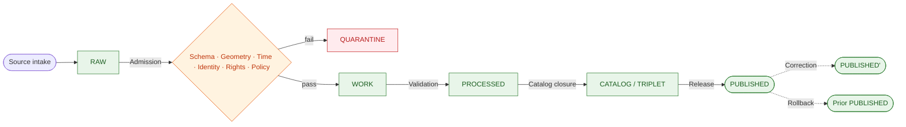
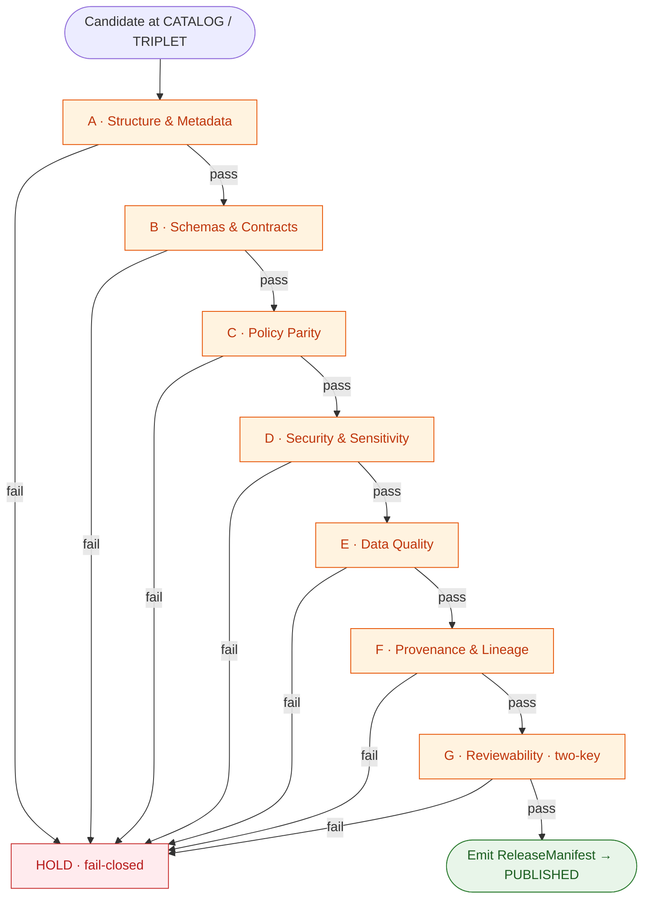
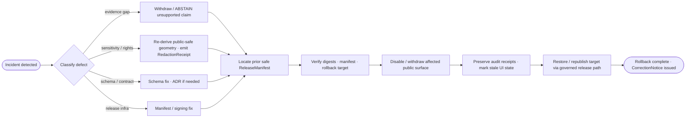

<!-- [KFM_META_BLOCK_V2]
doc_id: kfm://doc/runbooks/flora/promotion-runbook
title: Flora — Promotion Runbook (RAW → PUBLISHED)
type: standard
version: v0.1
status: draft
owners: [TODO — flora-domain-steward, release-authority, docs-steward]  # PLACEHOLDER — verify against CODEOWNERS
created: 2026-05-13
updated: 2026-05-13
policy_label: public
related:
  - kfm://doctrine/directory-rules
  - kfm://doctrine/lifecycle-law
  - kfm://doctrine/trust-membrane
  - kfm://doc/domains/flora            # PROPOSED home: docs/domains/flora/
  - kfm://doc/architecture/governed-api
  - kfm://doc/runbooks/flora/ROLLBACK  # PROPOSED sibling; NEEDS VERIFICATION
  - kfm://doc/runbooks/flora/VALIDATION # PROPOSED sibling; NEEDS VERIFICATION
  - kfm://adr/ADR-0001-schema-home
tags: [kfm, flora, promotion, lifecycle, policy-as-code, fail-closed, runbook]
notes:
  - "Path PROPOSED per Directory Rules §4: docs/ is canonical for human-facing control plane (incl. runbooks); domain appears as a segment inside the responsibility root."
  - "Implementation maturity UNKNOWN — no mounted repo inspected in this session. All paths, route names, schemas, validators, and CI workflows below are PROPOSED."
[/KFM_META_BLOCK_V2] -->

<a id="top"></a>

# Flora — Promotion Runbook

> Governed, evidence-first procedure for moving Flora claims, layers, and bundles from `RAW` through `WORK / QUARANTINE → PROCESSED → CATALOG / TRIPLET → PUBLISHED`. **Promotion is a governed state transition, not a file move.**

<p align="center">
  
  
  
  
  
  
  
</p>

| Field | Value |
|---|---|
| **Status** | `draft` |
| **Owners** | `TODO` — flora domain steward · release authority · docs steward _(verify against `CODEOWNERS`)_ |
| **Updated** | 2026-05-13 |
| **Authority of this doc** | CONFIRMED **doctrine** · PROPOSED **implementation** _(no repo mounted)_ |
| **Authority of any path quoted here** | PROPOSED until verified against repo evidence and ADRs |

---

## Quick links

- [1. Purpose & scope](#1-purpose--scope)
- [2. Doctrinal anchors](#2-doctrinal-anchors)
- [3. Lifecycle at a glance](#3-lifecycle-at-a-glance)
- [4. Promotion gate matrix (A → G) for Flora](#4-promotion-gate-matrix-a--g-for-flora)
- [5. Flora sensitivity decision matrix](#5-flora-sensitivity-decision-matrix)
- [6. Required artifacts per transition](#6-required-artifacts-per-transition)
- [7. Step-by-step procedure](#7-step-by-step-procedure)
- [8. Reason codes & recovery paths](#8-reason-codes--recovery-paths)
- [9. Rollback procedure](#9-rollback-procedure)
- [10. CI / pre-flight expectations](#10-ci--pre-flight-expectations)
- [11. Pre-promotion checklist](#11-pre-promotion-checklist)
- [12. Verification backlog](#12-verification-backlog)
- [Appendix A. Object families touched by Flora promotion](#appendix-a-object-families-touched-by-flora-promotion)
- [Appendix B. Glossary (Flora-relevant subset)](#appendix-b-glossary-flora-relevant-subset)
- [Related docs](#related-docs)

---

> [!IMPORTANT]
> **Promotion in KFM is a governed state transition, not a file move.** A transition is *closed* only when:
>
> 1. every required artifact for that gate exists,
> 2. every `EvidenceRef` **resolves** to an `EvidenceBundle` (and `source_id` → `SourceDescriptor`, `model_id` → `ModelRunReceipt` where applicable), and
> 3. the policy gate has **evaluated and recorded** its decision.
>
> Missing any of these → the transition **fails closed** and the prior state is preserved. The trust membrane forbids any public client, normal UI surface, or released AI surface from reaching `RAW`, `WORK`, `QUARANTINE`, canonical/internal stores, graph internals, vector indexes, source APIs, or direct model runtimes. **PUBLISHED is the only state from which the governed API may emit `ANSWER`.**

---

## 1. Purpose & scope

This runbook is the operational procedure for the **Flora** domain lane. It tells a steward, a release authority, and CI exactly what must be true — and what must be **proved** — before a Flora claim, layer, evidence bundle, or release candidate is allowed to cross a lifecycle gate.

**In scope** (Flora-owned object families):

`PlantTaxon` · `SpecimenRecord` · `FloraOccurrence` · `RarePlantRecord` · `VegetationCommunity` · `InvasivePlantRecord` · `PhenologyObservation` · `RangePolygon` · `HabitatAssociation` · `BotanicalSurvey` · `RestorationPlanting` · `RedactionReceipt`.

**Out of scope** (joined to, but not owned by, Flora):

- `HabitatPatch`, suitability surfaces → owned by **Habitat**.
- Animal taxa and occurrences → owned by **Fauna**.
- Soil / hydrology / agriculture / hazards / roads / settlements / archaeology / people-DNA-land → keep their own truth.

> [!NOTE]
> This runbook **does not** make policy or contract decisions — those live in `policy/domains/flora/` _(PROPOSED)_, `contracts/domains/flora/` _(PROPOSED)_, and the ADR set. This runbook tells you **how to execute** the procedure those decisions imply.

---

## 2. Doctrinal anchors

| Doctrine | What it forces here |
|---|---|
| **Lifecycle invariant** | Every Flora artifact moves through `RAW → WORK / QUARANTINE → PROCESSED → CATALOG / TRIPLET → PUBLISHED`. No skipping. |
| **Cite-or-abstain** | A Flora claim without a resolvable `EvidenceBundle` cannot become an `ANSWER`. Default is `ABSTAIN` or `DENY`. |
| **Trust membrane** | The public Flora map layers, popups, Evidence Drawer payloads, and Focus Mode answers consume **released** artifacts only — never `RAW`, `WORK`, `QUARANTINE`, canonical stores, or model runtimes. |
| **Fail-closed on sensitivity** | Rare, protected, or culturally sensitive flora **default to** generalized geometry, withheld geometry, staged access, or denial. Exact geometry of sensitive taxa is a hard fail unless an explicit `RedactionReceipt` + review path documents the transform. |
| **Promotion = state transition** | A `PromotionReceipt` (Gates A → G) and a `ReleaseManifest` are what change the state. Copying a file into `data/published/` is not promotion. |
| **Release authority ≠ author** | Where materiality applies, the release authority for a Flora artifact must be distinct from the original author. |
| **Reversibility** | Every promotion must point at a `RollbackCard` and a `CorrectionNotice` path before it is allowed to publish. |

---

## 3. Lifecycle at a glance

The Flora lane is an instance of the universal KFM pipeline. The gates below are the only routes by which content reaches `PUBLISHED`.



> [!NOTE]
> **Diagram status:** the *shape* of this pipeline is CONFIRMED doctrine. The specific Flora-lane wiring of validators, policy bundles, and CI workflows is PROPOSED — verify each named tool against repo evidence before relying on the runbook to operate that tool.

---

## 4. Promotion gate matrix (A → G) for Flora

KFM enforces **seven gates** between authoring and publication. The shared envelope (Gates A–G) is CONFIRMED doctrine; the Flora-lane *evidence* each gate inspects is listed below.

| Gate | Name | What it checks (generic) | Flora-specific evidence |
|---|---|---|---|
| **A** | Structure & Metadata | `MetaBlock v2` presence; zone correctness; required catalog fields. | Flora artifact carries `MetaBlock v2` incl. `steward_org`, `authority_to_control` where culturally sensitive flora applies (CARE-aligned). |
| **B** | Schemas & Contracts | JSON Schema + OpenAPI validation against the canonical schema home (`schemas/contracts/v1/...` per ADR-0001). | `PlantTaxon`, `FloraOccurrence`, `RarePlantRecord`, `VegetationCommunity`, `InvasivePlantRecord`, `PhenologyObservation`, `RangePolygon`, `HabitatAssociation` validate against their pinned schemas. **PROPOSED schema paths.** |
| **C** | Policy Parity | Same OPA/Rego bundle (pinned by digest) runs in CI (Conftest) and at runtime (PDP / Gatekeeper). | `policy/domains/flora/*.rego` _(PROPOSED)_ evaluated with the same digest in PR and runtime. Negative fixtures pinned. |
| **D** | Security & Sensitivity | License/SPDX allowlist; sensitivity rubric; geoprivacy and rights posture. | Default-**DENY** on exact rare-plant geometry; **DENY** on unresolved rights; **DENY** on culturally sensitive plant knowledge without `authority_to_control` consent. See §5. |
| **E** | Data Quality | DQ profilers and assertions meeting thresholds. | Taxonomic reconciliation passes (e.g. GBIF / ITIS / NatureServe crosswalk closure); geometry sanity; phenology temporal sanity; uncertainty bounds present. **PROPOSED thresholds.** |
| **F** | Provenance & Lineage | Receipt + lineage validation; `spec_hash` recomputation match; signed attestation. | `RunReceipt`, `EvidenceBundle`, `source_head`, signed (DSSE / cosign) attestation; lineage edges resolve to `SourceDescriptor`. |
| **G** | Reviewability | Two-key approval: CODEOWNERS-enforced human review **plus** policy approval. | Release authority distinct from author where materiality applies; `ReviewRecord` present for rare-plant, culturally sensitive, and steward-controlled cases. |

> [!CAUTION]
> **Auto-merge fires only when all seven gates pass.** Any single failure blocks promotion until remediation. There is no “temporary bypass.” Bypassing a gate creates uncited public claims — exactly the failure mode the trust membrane exists to prevent.



---

## 5. Flora sensitivity decision matrix

Flora carries some of the most consequential sensitivity logic in KFM. The matrix below is the **decision surface** Gate D evaluates on every release candidate.

| Class of Flora material | Public surface default | Allowed only when | Outcome on failure |
|---|---|---|---|
| Generally observed plant taxon (non-sensitive) | Public, evidence-backed | Standard Gates A–G pass | `DENY` until gates pass |
| `FloraOccurrence` — sensitive taxon, exact coordinates | **`DENY`** (fail closed) | `RedactionReceipt` + review + generalized geometry (county / ecoregion / buffered centroid) + `authority_to_control` (where applicable) | `DENY` published; restricted exact coords stay internal, access-controlled |
| `RarePlantRecord` — exact location | **`DENY`** (fail closed) | Steward review + Redaction Receipt + public-safe derivative + `ReviewRecord` | `DENY`; promote a *redacted* derivative or hold |
| Culturally sensitive plant knowledge | **`DENY`** (fail closed) | `authority_to_control` consent present, valid, unrevoked (CARE) | `DENY`; record reason; queue stewardship review |
| Invasive plant record on a public-facing parcel | Public, but linkage to landowner identity removed | Person-parcel join not exposed; rights cleared | `DENY` join; publish generalized invasive surface only |
| Phenology observation tied to a sensitive specimen | Public **only** as anonymized/aggregated derivative | `AggregationReceipt` + sensitivity transform | `DENY` raw observation; allow aggregated derivative |
| Source rights `UNKNOWN` | **`DENY`** | Rights resolution + new `SourceDescriptor` | `DENY`; quarantine source |
| Style filter as the only "protection" | **Not a valid mechanism** | — | `DENY`; sensitive geometry must be transformed at promotion time, not hidden client-side |

> [!WARNING]
> **Style-side hiding is not redaction.** Filtering layers in MapLibre is a rendering choice; it is **not** a sensitivity protection. Sensitive geometry that exists in the released tile/bundle has *already* leaked, regardless of whether a default style hides it. Sensitivity transforms must happen **upstream of** publication and must produce a `RedactionReceipt`.

---

## 6. Required artifacts per transition

Every transition is closed only when the artifacts below **exist and resolve**.

| Transition | Pre-condition | Required artifacts (PROPOSED minimum) | Failure-closed outcome |
|---|---|---|---|
| `— → RAW` (Admission) | Source identity & rights minimally established; source-role intent set. | `SourceDescriptor` (role, authority, rights, sensitivity, cadence); hash of payload or reference. | Source not admitted; logged as candidate awaiting steward. |
| `RAW → WORK / QUARANTINE` (Normalization) | Schema / geometry / time / identity / evidence / rights / policy rules are runnable. | `TransformReceipt`; `ValidationReport` (working set); `PolicyDecision`; `QUARANTINE` for failures. | Quarantine with reason — never silently promotes. |
| `WORK → PROCESSED` (Validation) | Validators are deterministic and tied to fixtures; required receipts present. | `ValidationReport` pass; `RedactionReceipt` if sensitivity applies; `AggregationReceipt` if applies. | Stay in `WORK`; structured `FAIL` outcome. |
| `PROCESSED → CATALOG / TRIPLET` (Catalog closure) | `EvidenceRef`s resolve; catalog matrix and digests close. | `CatalogMatrix` entry; `EvidenceBundle`; graph/triplet projections if applicable. | `HOLD` at `PROCESSED`; structured `FAIL`; no public edge. |
| `CATALOG / TRIPLET → PUBLISHED` (Release) | Review state where required; release authority distinct from author when materiality applies. | `ReleaseManifest`; `RollbackCard` (rollback target); correction path; `ReviewRecord` (if required); `PromotionReceipt` (Gates A–G). | `HOLD` at `CATALOG`; no public surface change. |
| `PUBLISHED → PUBLISHED'` (Correction) | Detected error or new evidence; downstream derivatives identified. | `CorrectionNotice`; `ReviewRecord`; invalidation list; `ReleaseManifest` update or supersession. | Stale-state announcement; **no silent edit**. |
| `PUBLISHED → prior PUBLISHED` (Rollback) | Failed release or post-publication failure; targeted prior release identified. | `RollbackCard`; `CorrectionNotice`; `ReleaseManifest` reverts to prior release; downstream derivative invalidation. | Held at current state until rollback validated. |

> [!NOTE]
> **Resolution, not reference.** A `ReleaseManifest` that *references* an `EvidenceBundle` which cannot be fetched and verified is **not** closed. A dangling `EvidenceRef` is the textbook fail-closed condition.

---

## 7. Step-by-step procedure

This is the operator-facing sequence for a single Flora release candidate. Each step has an explicit owner and an explicit fail-closed outcome.

### Step 1 — Confirm intake & source role

- Confirm the relevant `SourceDescriptor` exists in the source registry _(PROPOSED `data/registry/sources/flora/`)_.
- Confirm `source_role` is set (e.g. `herbarium`, `citizen_science`, `agency_dataset`, `restoration_project`, `survey`, `modeled_derivative`).
- Confirm `rights`, `sensitivity`, and `cadence` are non-empty.

**Owner:** Flora domain steward.
**Fail-closed if:** `rights` is `UNKNOWN`, `sensitivity` is unresolved, or `source_role` is missing → quarantine source.

### Step 2 — Normalize & quarantine on defect

- Run the Flora normalization pipeline _(PROPOSED `pipelines/domains/flora/`)_ against `RAW` payloads.
- Emit a `TransformReceipt` for every successful transform; route geometry / identity / rights / policy failures to `QUARANTINE` with a reason code.
- **Exact rare-plant coordinates must not survive to `WORK` without an associated redaction plan.**

**Owner:** Flora pipeline + automated policy gate.
**Fail-closed if:** geometry invalid, schema mismatch, rights unknown, sensitivity unresolved → `QUARANTINE`.

### Step 3 — Validate against schemas & DQ

- Run schema validators against `schemas/contracts/v1/domains/flora/...` _(PROPOSED)_.
- Run DQ assertions:
  - Taxonomic reconciliation closure (e.g. GBIF Backbone / ITIS / NatureServe — pick per source policy).
  - Geometry sanity (no zero-area polygons; valid CRS; coordinate uncertainty present where required).
  - Temporal sanity for `PhenologyObservation` (event time within plausible season).
  - Uncertainty bounds present for points and modeled surfaces.
- Emit a `ValidationReport`.

**Owner:** Validators + Flora steward.
**Fail-closed if:** any required validator reports `FAIL` or `ABSTAIN` → stay in `WORK`.

### Step 4 — Resolve sensitivity → emit Redaction / Aggregation receipts

- For every sensitive `FloraOccurrence`, `RarePlantRecord`, or culturally sensitive record:
  - Compute the public-safe derivative (generalized polygon, buffered centroid, county/ecoregion aggregation).
  - Record the transform parameters (radius, generalization method, seed if jittered).
  - Emit a `RedactionReceipt` (and `AggregationReceipt` where applicable) bound to the source identity and the transform.
- Confirm `authority_to_control` consent for culturally sensitive plant knowledge.

**Owner:** Flora domain steward (with cultural authority where applicable).
**Fail-closed if:** transform missing, consent missing/revoked, or exact geometry still present in candidate → `DENY` publication path.

### Step 5 — Catalog closure

- Bind the candidate to a `CatalogMatrix` entry.
- Resolve every `EvidenceRef` to its `EvidenceBundle` (do not just *reference*).
- Compute and pin `spec_hash` over the canonical bundle (sorted-key JSON canonicalization).
- Generate graph/triplet projections if Flora joins (e.g. Flora ↔ Habitat, Flora ↔ Fauna) are in scope.

**Owner:** Catalog tooling + Flora steward.
**Fail-closed if:** any `EvidenceRef` is dangling or `spec_hash` does not recompute → `HOLD` at `PROCESSED`.

### Step 6 — Build the release candidate

- Assemble the `ReleaseManifest` binding:
  - artifact digests (e.g. `EvidenceBundle`, `LayerManifest`, `MapReleaseManifest` for tile assets),
  - validation status,
  - policy posture (sensitivity label, rights status),
  - review state,
  - rollback target (`RollbackCard`),
  - correction path.
- Sign the manifest (DSSE / cosign per release policy) and record the attestation reference _(e.g. Rekor index)_ inside the `RunReceipt`.

**Owner:** Release tooling.
**Fail-closed if:** missing rollback target, unsigned manifest, or attestation verification fails → `HOLD` at `CATALOG / TRIPLET`.

### Step 7 — Two-key release approval (Gate G)

- Solicit a `ReviewRecord` from a release authority **distinct from** the original author when materiality applies (rare/protected/culturally sensitive flora; anything affecting a public layer).
- Confirm CODEOWNERS-enforced human approval **and** policy approval (Conftest / OPA decision recorded).

**Owner:** Release authority + Flora domain steward + automated policy.
**Fail-closed if:** single-key approval, or release authority equals author for material change → `HOLD`.

### Step 8 — Publish via the governed surface

- Promotion emits a `PromotionReceipt` enumerating Gates A–G outcomes.
- The governed API begins serving the released artifact set; the Evidence Drawer resolves clicked features to the `EvidenceBundle`.
- Record the transition timestamp, release authority identity, and `ReleaseManifest` digest.

**Owner:** Release authority.
**Fail-closed if:** any of the above cannot be recorded → revert to `CATALOG / TRIPLET`; the release is *not* considered live.

### Step 9 — Post-publication watch

- Monitor for correction triggers: new evidence, source-rights change, sensitivity reclassification, consent revocation, stale-source detection.
- Watch for derivative drift (e.g. downstream tile rebuilds, graph projections, search/vector indexes).
- Trigger §9 *Rollback procedure* on any post-publication failure.

**Owner:** Flora domain steward + correction / rollback authority.

---

## 8. Reason codes & recovery paths

When promotion fails, the gate must record a reason. The set below is the canonical PROPOSED catalog from KFM doctrine, narrowed to the failure families Flora encounters most often.

| Failure family | Reason code | Gate(s) where it fires | Recovery path |
|---|---|---|---|
| Missing required artifact | `MISSING_RECEIPT`, `MISSING_EVIDENCE`, `MISSING_REVIEW` | Normalization / Validation / Catalog / Release | Re-emit missing receipt; re-run review; re-validate. |
| Schema / contract mismatch | `SCHEMA_MISMATCH`, `CONTRACT_DRIFT` | Normalization / Validation | Schema fix and/or ADR; re-run validator. |
| Rights / sensitivity unresolved | `RIGHTS_UNKNOWN`, `SENSITIVITY_UNRESOLVED` | Admission / Validation / Catalog / Release | Steward review; rights resolution; tier reassignment. |
| Source-role collapse risk | `ROLE_COLLAPSE`, `ROLE_DOWNCAST_FORBIDDEN` | Validation / Catalog / Release | Restore source role; refuse upcast. |
| Review state inadequate | `REVIEW_NEEDED`, `REVIEW_INSUFFICIENT`, `REVIEW_REJECTED` | Catalog / Release | Run required review; supply `ReviewRecord`. |
| Release infrastructure error | `RELEASE_MANIFEST_INVALID`, `ROLLBACK_TARGET_MISSING` | Release | Manifest fix; supply rollback target. |
| Sensitivity protection failure (Flora-specific) | `EXACT_RARE_GEOMETRY_PRESENT`, `STYLE_FILTER_ONLY`, `AUTHORITY_TO_CONTROL_MISSING` | Validation / Release | Re-derive public-safe geometry; emit `RedactionReceipt`; secure consent. |
| Provenance / signing failure | `INVALID_SPEC_HASH`, `UNSIGNED_RELEASE_MANIFEST`, `MISSING_RUN_RECEIPT` | Release | Re-canonicalize and re-hash; re-sign; emit receipt. |

> [!TIP]
> The reason code surface above is the same set the Evidence Drawer can surface to a steward, and the same set the Focus Mode runtime should be able to translate into a finite envelope (`ANSWER` / `ABSTAIN` / `DENY` / `ERROR`). Keep the codes stable.

---

## 9. Rollback procedure

Rollback for Flora follows the universal KFM model. **A rollback is itself a governed release**; it is not a file copy and not a silent revert.



### Operator steps

1. **Trigger.** Confirm the post-publication failure class (evidence gap, sensitivity breach, schema/contract, release infra, AI-output, etc.).
2. **Identify rollback target.** Locate the prior safe `ReleaseManifest` referenced by the `RollbackCard` on the currently published release.
3. **Verify the target.** Recompute digests; verify manifest signatures; confirm the prior `EvidenceBundle`s are still resolvable.
4. **Withdraw the failed surface.** Disable / withdraw affected public layers, tile sets, popups, and Evidence Drawer projections. Mark stale UI state explicitly — do **not** silently swap.
5. **Preserve audit chain.** Keep the failed `ReleaseManifest`, all gate receipts, and the `CorrectionNotice` linked to the rollback record.
6. **Republish the target.** Run the rollback target through the same governed release path (it is a fresh `ReleaseManifest` even though the content is prior).
7. **Invalidate derivatives.** Re-fan-out: tile rebuilds, graph projections, search indexes, vector indexes — all must be rebuilt or invalidated.
8. **Drill, then close.** Treat the rollback as a tested transition — an untested rollback target is not a rollback target.

> [!WARNING]
> **Rollback never bypasses Gates A → G.** The rollback target was previously released through the gates; it must clear them again for the rebuilt environment. A rollback that bypasses gates is just another uncited public claim.

---

## 10. CI / pre-flight expectations

> **Status:** all paths, workflow names, and tool versions below are **PROPOSED**. No mounted repo was inspected; treat the names as the *shape* the runbook expects, not as observed code.

| Stage | What CI does | Fail-closed on |
|---|---|---|
| `fmt` / `lint` | Format and lint Rego, JSON schemas, fixtures. | Syntax errors, drift from canonical form. |
| `schema-validate` | Validate Flora artifacts against `schemas/contracts/v1/domains/flora/` _(PROPOSED)_. | Any schema mismatch. |
| `policy-conftest` | Run Conftest against the **pinned-by-digest** OPA bundle (`policy/domains/flora/` _(PROPOSED)_) over good- and negative-path fixtures. | Any negative fixture **fails to be denied**. |
| `dq-assert` | Run DQ profilers (taxonomic reconciliation, geometry sanity, phenology temporal sanity, uncertainty bounds). | DQ thresholds unmet. |
| `provenance-verify` | Recompute `spec_hash` over canonical bundle; verify DSSE/cosign signature; check `RunReceipt` linkage. | Hash mismatch, unsigned manifest, missing receipt. |
| `sensitivity-deny` | Exercise negative fixtures: exact rare-plant geometry, style-filter-only "protection", missing `authority_to_control`. | Any of these reaches a published state in the fixture. |
| `release-checklist` | Validate `ReleaseManifest`, `RollbackCard`, `ReviewRecord` presence and shape; confirm release authority ≠ author where required. | Missing manifest fields; single-key approval. |
| `parity-check` | Confirm the OPA bundle digest pinned in CI **equals** the digest pinned in runtime deployment manifests. | Digest drift between CI and runtime. |

<details>
<summary><b>Illustrative skeleton — <code>.github/workflows/flora-promotion.yml</code> (PROPOSED · do not assume present)</b></summary>

```yaml
# PROPOSED skeleton — illustrative, not observed in any mounted repo.
# Paths, action versions, and policy/* fixtures below are placeholders
# and must be reconciled against repo evidence before use.
name: flora-promotion-gate
on:
  pull_request:
  workflow_dispatch:

jobs:
  promotion:
    runs-on: ubuntu-latest
    steps:
      - uses: actions/checkout@v4

      - name: Install tooling
        run: |
          pip install --quiet jsonschema       # schema validation
          curl -sSfL -o /usr/local/bin/conftest \
            https://github.com/open-policy-agent/conftest/releases/latest/download/conftest_Linux_x86_64
          chmod +x /usr/local/bin/conftest

      - name: Schema validate (Gate B)
        run: tools/validators/flora/validate_artifacts.py  # PROPOSED

      - name: Policy check (Gate C · D · partial G)
        run: |
          conftest test fixtures/flora/good/   -p policy/domains/flora -n gates/promotion
          conftest test fixtures/flora/bad/    -p policy/domains/flora -n gates/promotion && exit 1 || echo "deny ok"

      - name: DQ assertions (Gate E)
        run: tools/validators/flora/dq_assert.py            # PROPOSED

      - name: Provenance verify (Gate F)
        run: tools/attest/verify_release.sh                  # PROPOSED

      - name: Build PromotionReceipt
        run: tools/release/build_promotion_receipt.py        # PROPOSED
```

</details>

---

## 11. Pre-promotion checklist

Use this before any release authority signs Gate G. Every box should be ticked **with a link to evidence**, not from memory.

- [ ] `SourceDescriptor` resolves; `rights`, `sensitivity`, and `cadence` non-empty.
- [ ] All `EvidenceRef`s resolve to `EvidenceBundle`s (no dangling refs).
- [ ] Schemas validate against `schemas/contracts/v1/domains/flora/...` _(PROPOSED)_.
- [ ] `ValidationReport` is `PASS` for every required validator.
- [ ] Taxonomic reconciliation closed (GBIF / ITIS / NatureServe per source policy).
- [ ] No exact rare/protected/culturally sensitive geometry in candidate; `RedactionReceipt` issued where applicable.
- [ ] `authority_to_control` consent present and unrevoked where CARE applies.
- [ ] Style filter is **not** the sole sensitivity protection.
- [ ] `spec_hash` recomputes; manifest is signed; attestation reference recorded.
- [ ] `RollbackCard` present and **drilled** (untested rollback ≠ rollback).
- [ ] `ReviewRecord` present; release authority distinct from author for material changes.
- [ ] Reason-code surface available for any structured `FAIL` outcome.
- [ ] Downstream derivatives (tiles, graph projections, search indexes) identified for invalidation if rollback fires.
- [ ] Docs updated (this runbook + any affected domain doc) **or** a deliberate decision recorded not to.

---

## 12. Verification backlog

These are the open items that block this runbook from rising above PROPOSED to CONFIRMED implementation. Each requires concrete repo evidence.

| Item | Evidence that would settle it | Status |
|---|---|---|
| Confirm Flora source endpoints and rights posture (GBIF, iNaturalist, NatureServe, USFWS, KS state programs). | `data/registry/sources/flora/` entries; rights review records. | `NEEDS VERIFICATION` |
| Confirm Flora schema home and exact paths. | Files under `schemas/contracts/v1/domains/flora/` + ADR-0001. | `NEEDS VERIFICATION` |
| Confirm Flora policy bundle home, pinned digest, and parity between CI and runtime. | `policy/domains/flora/`, deployment manifest digest match. | `NEEDS VERIFICATION` |
| Confirm Flora-specific rare-plant policy (generalization radius, ecoregion vs county, jitter seed). | Rego rule + steward-approved parameter file. | `NEEDS VERIFICATION` |
| Confirm reviewability burden (CODEOWNERS for `policy/domains/flora/` and `schemas/contracts/v1/domains/flora/`). | `CODEOWNERS` entries. | `NEEDS VERIFICATION` |
| Confirm Evidence Drawer + Focus Mode wiring for Flora claims. | Runtime fixtures, citation validation reports, AI receipt fixtures. | `NEEDS VERIFICATION` |
| Confirm rollback drill cadence for Flora releases. | Recorded `RollbackCard` drill receipts. | `NEEDS VERIFICATION` |
| Confirm runbook sibling files (`ROLLBACK`, `VALIDATION`, `LOCAL_DEV`) and naming convention (`docs/runbooks/flora/...` vs flat `docs/runbooks/flora_*.md`). | Repo `docs/runbooks/` tree + ADR if naming changes. | `NEEDS VERIFICATION` |

> [!NOTE]
> Until these items are settled, treat every named path, workflow, and tool in this runbook as **PROPOSED**. The doctrine — gates, fail-closed posture, lifecycle invariant, sensitivity matrix — is CONFIRMED; the wiring is not.

---

## Appendix A. Object families touched by Flora promotion

<details>
<summary><b>Expand — Flora-owned and Flora-adjacent object families</b></summary>

**Flora-owned (CONFIRMED scope, PROPOSED field realization):**

`PlantTaxon` · `SpecimenRecord` · `FloraOccurrence` · `RarePlantRecord` · `VegetationCommunity` · `InvasivePlantRecord` · `PhenologyObservation` · `RangePolygon` · `HabitatAssociation` · `BotanicalSurvey` · `RestorationPlanting` · `RedactionReceipt`.

**Universal envelope objects this runbook expects:**

`SourceDescriptor` · `EvidenceRef` · `EvidenceBundle` · `DatasetVersion` · `ValidationReport` · `TransformReceipt` · `AggregationReceipt` · `RunReceipt` · `PolicyDecision` · `PromotionReceipt` · `ReleaseManifest` · `LayerManifest` · `MapReleaseManifest` · `CorrectionNotice` · `RollbackCard` · `ReviewRecord` · `CatalogRecord` / `CatalogMatrix` · `EvidenceDrawerPayload` · `RuntimeResponseEnvelope` · `AIReceipt` · `CitationValidationReport`.

**Cross-lane relations preserved at promotion:**

- Flora ↔ Habitat — habitat association, vegetation community context.
- Flora ↔ Fauna — pollinator, food-web, invasive, biodiversity context.
- Flora ↔ Soil / Hydrology — substrate, wetland, riparian, drought context.
- Flora ↔ Hazards — fire, drought, flood, smoke, vegetation stress.

Each relation **must preserve** source role, sensitivity, ownership, and `EvidenceBundle` support across the gate.

</details>

## Appendix B. Glossary (Flora-relevant subset)

<details>
<summary><b>Expand — terms used above (project-defined)</b></summary>

- **Promotion** — CONFIRMED: a governed release transition, not a file movement.
- **Trust membrane** — CONFIRMED: the boundary that prevents raw, unreviewed, restricted, or generated state from becoming public truth.
- **EvidenceRef → EvidenceBundle** — CONFIRMED: an `EvidenceRef` is a *pointer*; it must **resolve** to a fetchable, verifiable `EvidenceBundle` before a claim can carry public authority.
- **PromotionReceipt** — CONFIRMED doctrine / PROPOSED implementation: governed state-transition record enumerating Promotion Gates A–G as auditable promotion memory.
- **ReleaseManifest** — CONFIRMED doctrine / PROPOSED implementation: record of the published artifact set, digests, policy posture, release state, correction path, and rollback target.
- **RollbackCard** — CONFIRMED: rollback target and drill object that preserves history while repointing current release state.
- **RedactionReceipt** — CONFIRMED object family / PROPOSED implementation: record of a public-safe field or geometry transformation, including the parameters of the transform.
- **CARE / `authority_to_control`** — CONFIRMED metadata extension: the body whose authority governs an asset; required for Indigenous, marginalized-community, sensitive-cultural, or sovereignty-implicating Flora knowledge.
- **`spec_hash`** — CONFIRMED doctrine: canonical (JCS+SHA-256-style) hash recomputed at promotion; mismatch is a hard fail.

</details>

---

## Related docs

- _(PROPOSED · NEEDS VERIFICATION)_ `docs/doctrine/directory-rules.md` — placement law for any path quoted here.
- _(PROPOSED · NEEDS VERIFICATION)_ `docs/doctrine/lifecycle-law.md` — `RAW → PUBLISHED` invariant.
- _(PROPOSED · NEEDS VERIFICATION)_ `docs/doctrine/trust-membrane.md` — what may and may not reach a public client.
- _(PROPOSED · NEEDS VERIFICATION)_ `docs/domains/flora/README.md` — Flora domain dossier and ubiquitous language.
- _(PROPOSED · NEEDS VERIFICATION)_ `docs/runbooks/flora/ROLLBACK.md` — Flora rollback drill.
- _(PROPOSED · NEEDS VERIFICATION)_ `docs/runbooks/flora/VALIDATION.md` — Flora validation runs.
- _(PROPOSED · NEEDS VERIFICATION)_ `docs/adr/ADR-0001-schema-home.md` — schema home convention referenced for Gate B.
- _(PROPOSED · NEEDS VERIFICATION)_ `policy/domains/flora/` — Flora policy bundle (OPA / Rego).
- _(PROPOSED · NEEDS VERIFICATION)_ `schemas/contracts/v1/domains/flora/` — Flora schema home.

---

<sub>**Last updated:** 2026-05-13 · **Doc id:** `kfm://doc/runbooks/flora/promotion-runbook` · **Status:** draft · **Authority:** doctrine CONFIRMED · implementation PROPOSED</sub>

<sub>[⬆ Back to top](#top)</sub>
