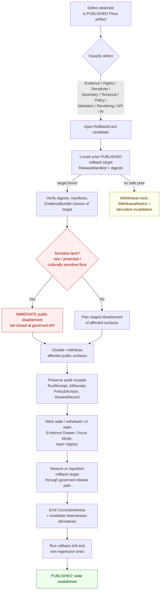

<!-- [KFM_META_BLOCK_V2]
doc_id: kfm://doc/runbook/flora/rollback
title: Flora Rollback Runbook
type: standard
subtype: runbook
domain: flora
version: v1
status: draft
owners: <TODO — flora steward + release authority + docs steward>
created: 2026-05-13
updated: 2026-05-13
policy_label: public
related:
  - docs/runbooks/README.md
  - docs/domains/flora/README.md
  - docs/architecture/governed-ai/README.md
  - docs/doctrine/lifecycle-law.md
  - docs/doctrine/trust-membrane.md
  - release/README.md
  - data/published/layers/flora/README.md
  - data/rollback/README.md
tags: [kfm, runbook, rollback, flora, release, governance]
notes:
  - Path 'docs/runbooks/flora/ROLLBACK_RUNBOOK.md' is PROPOSED. Existing planned subsystem runbooks use flat naming (e.g. 'docs/runbooks/ui_ROLLBACK.md'); domain-as-subdirectory may require an ADR or DRIFT_REGISTER entry. See §2 (Repo fit) below.
[/KFM_META_BLOCK_V2] -->

# 🌱 Flora Rollback Runbook

> Step-by-step procedure for **rolling back a published Flora release** without bypassing the trust membrane, the lifecycle invariant, or sensitivity controls on rare and culturally sensitive plant data.

<!-- Badges: placeholders until Shields.io endpoints and CI hooks are wired. -->


| **Status** | **Domain** | **Owners** | **Updated** |
|---|---|---|---|
| Draft (PROPOSED) | Flora | `<TODO — flora steward · release authority · docs steward>` | 2026-05-13 |

> [!IMPORTANT]
> **Rollback is a governed state transition, not a file move.**
> A path-level copy that bypasses validators, policy gates, EvidenceBundle resolution, catalog closure, and release-decision recording is a violation of the lifecycle invariant regardless of which directory the bytes end up in.

---

## Quick jump

- [1. Scope](#1-scope)
- [2. Repo fit](#2-repo-fit)
- [3. When to use this runbook](#3-when-to-use-this-runbook)
- [4. Out of scope](#4-out-of-scope)
- [5. Flora rollback model at a glance](#5-flora-rollback-model-at-a-glance)
- [6. Defect → correction × rollback matrix](#6-defect--correction--rollback-matrix)
- [7. Required artifacts and homes](#7-required-artifacts-and-homes)
- [8. Procedure — standard Flora rollback](#8-procedure--standard-flora-rollback)
- [9. Procedure — sensitive-lane fail-closed disablement](#9-procedure--sensitive-lane-fail-closed-disablement)
- [10. Validation, drill, and acceptance](#10-validation-drill-and-acceptance)
- [11. Post-rollback obligations](#11-post-rollback-obligations)
- [12. Anti-patterns and refusal triggers](#12-anti-patterns-and-refusal-triggers)
- [13. Worked example (illustrative)](#13-worked-example-illustrative)
- [14. Related docs and runbooks](#14-related-docs-and-runbooks)
- [15. Open verification items](#15-open-verification-items)

---

## 1. Scope

This runbook covers **rollback of a PUBLISHED Flora release** — generalized occurrence layers, range/distribution layers, vegetation-community layers, invasive-plant layers, phenology/condition layers, habitat-association summaries, review-candidate views, Evidence Drawer payloads tied to Flora features, and Focus-Mode answers tied to released Flora EvidenceBundles.

It applies when any of the following has occurred or is suspected:

- A defect is detected in a released Flora artifact (evidence, rights, sensitivity, geometry, temporal, policy, validation, rendering, API, or AI-output class).
- A released artifact, layer, catalog record, or AI answer is no longer supported by its EvidenceBundle.
- A change in rights, source role, or sensitivity tier invalidates a public Flora surface.
- A sensitivity leak (precise rare-plant location, culturally sensitive material, restricted geometry) has reached a public surface and must be removed immediately.

**Status of the rollback model itself:** CONFIRMED doctrine — KFM treats correction and rollback as publication requirements, not afterthoughts, and a released claim is treated as safely publishable only when a visible correction path and rollback target exist.

**Status of any specific repo wiring quoted below** (paths, route names, schema homes, validator commands, dashboard names): PROPOSED / NEEDS VERIFICATION until checked against the mounted repository.

[Back to top](#-flora-rollback-runbook)

---

## 2. Repo fit

**Proposed path:** `docs/runbooks/flora/ROLLBACK_RUNBOOK.md` — PROPOSED.

| Field | Value | Status |
|---|---|---|
| Owning responsibility root | `docs/` (Canonical — human-facing control plane) | CONFIRMED rule |
| Subdirectory | `docs/runbooks/` ("ops procedures, rollback drills, validation runs") | CONFIRMED rule |
| Domain segment | `flora/` (per Domain Placement Law: domain as a lane inside a responsibility root) | CONFIRMED rule / PROPOSED file convention |
| Companion subsystem runbooks (reference style) | `docs/runbooks/ui_ROLLBACK.md`, `docs/runbooks/governed_ai_ROLLBACK.md` | PROPOSED |

> [!NOTE]
> **Directory Rules basis.** Per Directory Rules, `docs/` is the canonical authority surface for runbooks and a domain MUST NOT become a root folder; it must appear as a segment inside a responsibility root. Existing planned subsystem runbooks use flat `<subsystem>_<TYPE>.md` naming. This runbook uses a `<domain>/<TYPE>.md` subdirectory pattern; if the repo convention turns out to prefer flat `flora_ROLLBACK.md` instead, this file should be moved and an entry opened in `docs/registers/DRIFT_REGISTER.md`.

**Upstream (consumed by this runbook):**

- `docs/doctrine/lifecycle-law.md` — RAW → WORK / QUARANTINE → PROCESSED → CATALOG / TRIPLET → PUBLISHED
- `docs/doctrine/trust-membrane.md` — no public client reaches RAW / WORK / QUARANTINE / canonical / graph internals / vector indexes / source APIs / direct model runtimes
- `docs/domains/flora/README.md` — Flora doctrine, ubiquitous language, source families
- `release/README.md` — release-decision plane (manifests, rollback cards, correction notices)

**Downstream (referenced by this runbook):**

- `release/rollback_cards/` — the RollbackCard artifact home
- `release/correction_notices/` — public CorrectionNotice home
- `data/published/layers/flora/` — released Flora artifacts the rollback acts on
- `data/rollback/` — alias-revert receipts (data-plane mirror of the release-plane decision)
- `data/proofs/` — EvidenceBundle / ProofPack home
- `apps/governed-api/` — the only public route through which clients may read published Flora data

[Back to top](#-flora-rollback-runbook)

---

## 3. When to use this runbook

Use this runbook when **all** of the following are true:

1. The affected artifact is in **PUBLISHED** state. Defects detected in PROCESSED, CATALOG / TRIPLET, or release-candidate state are handled by the corresponding promotion-gate failure, not by rollback.
2. The defect is Flora-scoped. Cross-domain defects (e.g., a habitat × flora × hydrology surface) follow the **lowest common responsibility root** that owns the surface, with Flora-specific controls applied where Flora records contribute.
3. A **rollback target** (a prior PUBLISHED release manifest, digest-pinned artifact set, or "no safe prior" determination requiring withdrawal) can be named.

If a prior safe release **does not exist**, the action is **withdrawal**, not rollback — see §11.

[Back to top](#-flora-rollback-runbook)

---

## 4. Out of scope

This runbook does **not** cover:

- Source-admission rollback (rights revocation, source-role downgrade). See `docs/runbooks/<TODO>` and the Flora source registry.
- Schema / contract rollback. See `docs/adr/` and the schema-home ADR.
- Generic UI feature-flag rollback. See `docs/runbooks/ui_ROLLBACK.md`.
- AI adapter / kill-switch rollback (provider, MockAdapter, citation validator). See `docs/runbooks/governed_ai_ROLLBACK.md`.
- Infrastructure rollback (reverse-proxy, VPN, firewall). See `infra/` and `docs/security/`.
- Validation runs and drills not triggered by a release defect. See `docs/runbooks/<TODO — flora validation runbook>`.

[Back to top](#-flora-rollback-runbook)

---

## 5. Flora rollback model at a glance



**Reading the diagram.** Rollback flows through the **same governed release path** as the original promotion. It does not write directly to `data/published/`; it routes through `release/` (the decision plane) and emits new receipts, a CorrectionNotice, and — if appropriate — a superseding ReleaseManifest pointing at the rollback target. A sensitive-lane breach short-circuits to immediate public disablement first, then completes the standard flow.

[Back to top](#-flora-rollback-runbook)

---

## 6. Defect → correction × rollback matrix

> [!NOTE]
> **Source.** The defect-class matrix below is taken from KFM's master correction-and-rollback model. Postures are CONFIRMED doctrine; the precise reason codes are PROPOSED.

| Defect class | Typical Flora trigger | Correction posture | Rollback posture | Reason code (PROPOSED) |
|---|---|---|---|---|
| **Evidence gap** | Released occurrence claim no longer resolves to an EvidenceBundle; citation broken | ABSTAIN or withdraw the unsupported claim | Restore prior evidence-supported release | `MISSING_EVIDENCE` |
| **Rights defect** | Source rights revoked, redistribution class changed, license now incompatible with public release | DENY public use; quarantine source / artifact | Withdraw affected artifacts | `RIGHTS_UNKNOWN` |
| **Sensitivity leak** | Precise rare-plant / culturally sensitive location reached a public layer, popup, drawer, or AI answer | Redact / generalize and notify stewards | **Immediate public disablement** (see §9) | `SENSITIVITY_UNRESOLVED` |
| **Geometry defect** | Invalid geometry, wrong projection, over-precise generalization, footprint mismatch in a derivative | Rebuild derivative layer and EvidenceBundle payload | Restore previous digest-pinned artifact | `SCHEMA_MISMATCH` / `GEOM_INVALID` |
| **Temporal defect** | `observed`, `valid`, `retrieval`, `release`, or `correction` time recorded incorrectly; phenology window mislabeled | Correct the time field set | Mark stale until rebuilt | `TEMPORAL_DRIFT` |
| **Policy defect** | Policy gate evaluated stale rules; PolicyDecision absent or wrong outcome | Re-run policy and DecisionEnvelope | Disable route / layer if gate failed | `POLICY_REGRESSION` |
| **Validation defect** | Schema-validator regression released bad records | Re-run validators against prior fixture set | Restore previous catalog state | `CONTRACT_DRIFT` |
| **Rendering defect** | MapLibre style, sprites, glyphs, or tile artifact mis-serves released geometry | Rebuild StyleManifest / TileArtifactManifest | Restore prior `MapReleaseManifest.rollback_target` | `STYLE_DRIFT` |
| **API defect** | Governed API emits wrong envelope outcome; `FloraDecisionEnvelope` schema mismatch | Re-run contract tests; pin prior route | Disable route until corrected | `ENVELOPE_DRIFT` |
| **AI-output defect** | Focus-Mode answer cites a withdrawn EvidenceBundle, fails CitationValidationReport, or leaks restricted content | Invalidate AIReceipt and RuntimeResponseEnvelope | Remove answer; **preserve the EvidenceBundle** | `AI_CITATION_FAIL` |
| **Catalog defect** | Catalog closure regressed; orphan EvidenceRef; STAC/DCAT/PROV inconsistency | Re-emit catalog closure after proof repair | Restore previous catalog state | `CATALOG_CLOSURE_FAIL` |

> [!CAUTION]
> **AI rollback does not delete evidence.** Removing an AI answer (or invalidating an AIReceipt) MUST NOT delete or alter the underlying `EvidenceBundle`. The evidence remains; only the interpretive derivative is withdrawn.

[Back to top](#-flora-rollback-runbook)

---

## 7. Required artifacts and homes

> [!IMPORTANT]
> A Flora rollback is **closed** only when (i) every required artifact below exists, (ii) every required artifact **resolves** the artifacts it depends on (`EvidenceRef → EvidenceBundle`, `source_id → SourceDescriptor`, `model_id → ModelRunReceipt`), and (iii) the policy gate has evaluated and recorded its decision. Missing any of these means the rollback fails closed and the prior PUBLISHED state is preserved.

| Artifact | Owns | Proposed home | Status |
|---|---|---|---|
| `RollbackCard` | The rollback decision — affected release, defect class, rollback target, reviewer, signatures | `release/rollback_cards/` | CONFIRMED doctrine / PROPOSED implementation |
| `ReleaseManifest` (rollback target) | The prior PUBLISHED release the system is reverting to | `release/manifests/<release_id>/` | CONFIRMED doctrine / PROPOSED implementation |
| `ReleaseManifest` (superseding) | The new PUBLISHED' release that points at the rollback target and supersedes the defective release | `release/manifests/<new_release_id>/` | PROPOSED |
| `CorrectionNotice` | Public notice naming the defect, the supersession, and the invalidation list | `release/correction_notices/` | CONFIRMED doctrine / PROPOSED implementation |
| `WithdrawalNotice` *(when no safe prior exists)* | Public notice that the artifact has been withdrawn rather than rolled back | `release/withdrawal_notices/` | PROPOSED |
| Alias-revert receipts | Data-plane evidence that public aliases (URLs, layer IDs, manifest pointers) have moved | `data/rollback/` | PROPOSED; treatment of `data/rollback/` vs `release/rollback_cards/` is OPEN per Directory Rules §18 |
| `EvidenceBundle` | The resolved evidence package for every restored claim | `data/proofs/` | CONFIRMED doctrine / PROPOSED implementation |
| `RedactionReceipt` *(sensitivity-leak class)* | Record of public-safe geometry / field transformation | `data/proofs/` or `data/receipts/` per ADR | CONFIRMED doctrine / PROPOSED implementation |
| `ReviewRecord` | Steward / release-authority approval for the rollback (separation of duties where materiality applies) | `data/receipts/` | CONFIRMED doctrine / PROPOSED implementation |
| `PolicyDecision` | Re-evaluated policy outcome for every restored surface | `data/receipts/` | CONFIRMED doctrine / PROPOSED implementation |
| `AIReceipt` invalidations *(AI-defect class)* | Marks affected Focus-Mode answers as withdrawn | `data/receipts/ai/` | PROPOSED |

> [!NOTE]
> **Release plane vs. data plane.** `release/` owns release **decisions** (manifests, rollback cards, correction notices, signatures). `data/published/` owns the public-safe **artifacts** clients read. `data/rollback/` owns alias-revert **receipts**. A released PMTiles file does not live in `release/`; a release manifest does not live in `data/published/`. Mixing these is one of the four named drift patterns in Directory Rules §10.

[Back to top](#-flora-rollback-runbook)

---

## 8. Procedure — standard Flora rollback

> [!WARNING]
> If the defect class is **Sensitivity leak**, jump to **§9** first. Complete the immediate disablement, then return here for the full rollback. Do **not** wait for steward review to disable a confirmed sensitivity leak.

### Step 1 — Detect, triage, and open a RollbackCard candidate

1. Confirm the artifact is in PUBLISHED state. (If not, treat as a promotion-gate failure, not rollback.)
2. Classify the defect against the matrix in [§6](#6-defect--correction--rollback-matrix). If multiple classes apply, take the **most restrictive posture**.
3. Open a `RollbackCard` candidate under `release/rollback_cards/` with: `affected_release_id`, `defect_class`, `defect_reason_code`, `detected_at`, `detector_role`, `suspected_rollback_target`, `sensitive_lane` (boolean), `derivative_invalidation_set` (initial), and `reviewer` (TBD).

### Step 2 — Locate and verify the rollback target

1. Read `affected_release.ReleaseManifest.rollback_target` (or `MapReleaseManifest.rollback_target` for map releases). If absent, the affected release was promoted out of policy and the action becomes **withdrawal** — see §11.
2. Resolve the target `ReleaseManifest` from `release/manifests/<release_id>/`.
3. Verify target integrity:
   - All artifact digests in the target manifest resolve and match.
   - Every `EvidenceRef` in the target resolves to an `EvidenceBundle`.
   - The target's `PolicyDecision` set is intact and still valid under current policy (re-evaluate if policy has changed since target was published).
   - The target's review state is still valid (no revoked ReviewRecords).
4. If verification fails, the target is **not safe** — escalate to a steward and consider withdrawal.

### Step 3 — Steward and release-authority review

1. Route the `RollbackCard` candidate to the **flora steward** for defect classification and sensitivity confirmation.
2. Route it to the **release authority** (separation of duties: must be distinct from the original author of the defective release where materiality applies).
3. Record both decisions as `ReviewRecord` artifacts. The `RollbackCard` is not actionable without both records resolving.

### Step 4 — Re-evaluate policy

1. Run the Flora policy gate against the rollback target with current rules.
2. Record a `PolicyDecision` for each restored public surface.
3. If any decision is `DENY` or `RESTRICT`, the rollback cannot include that surface; remove it from the supersession set and add it to the withdrawal set.

### Step 5 — Disable / withdraw the defective public surfaces

> [!TIP]
> Run the disablement **before** publishing the superseding manifest. The trust-membrane invariant is preserved when no public client can read a defective Flora surface during the transition.

1. Through the governed API only (`apps/governed-api/`), do the following:
   - Mark the affected `LayerManifest` entries in the Flora layer registry as `withdrawn` or `superseded`.
   - Cause the affected routes to return the appropriate `FloraDecisionEnvelope` outcome:
     - `DENY` for sensitivity / rights defects
     - `ABSTAIN` for evidence / temporal / AI defects
     - `ERROR` only for true infrastructure failure
   - Remove the affected `EvidenceDrawerPayload` cache entries.
   - Mark affected `AIReceipt` records as **invalidated** (do not delete; preserve audit lineage).
2. Update the Flora map style only via a new `StyleManifest` + `MapReleaseManifest`; do not edit a published style in place.

### Step 6 — Preserve audit receipts

Preserve **all** of the following from the defective release. Do not delete or overwrite:

- `RunReceipt` records (intake, transform, validation, catalog, release)
- `AIReceipt` records (invalidated, not deleted)
- `PolicyDecision` records
- `ReviewRecord` records
- `ValidationReport` records
- `PromotionDecision` for the defective promotion

These remain the audit trail explaining how the defective release came to be PUBLISHED and why it was rolled back.

### Step 7 — Mark stale / withdrawn UI state

Through the governed API, surface the rollback to public-facing clients:

| Surface | Marking |
|---|---|
| Evidence Drawer | `release_state = withdrawn` or `superseded`; show CorrectionNotice link |
| Focus Mode answer | Affected answers return `ABSTAIN` with `abstain_reason = "answer withdrawn pending rollback"` |
| Map layer registry | Layer marked `withdrawn` / `superseded`; trust badge updated |
| Time slider | Affected snapshots marked stale; non-regression for prior lineage preserved |
| Correction / stale-state view | Affected feature listed with CorrectionNotice link |

### Step 8 — Publish the superseding release

1. Promote the rollback target through the **same governed release path** as any other release: validation, policy, catalog closure, release-candidate review, promotion decision, release manifest. Rollback **is** a release; it just happens to point at a prior digest-pinned artifact set.
2. Emit the new `ReleaseManifest` with:
   - `supersedes = <defective_release_id>`
   - `rollback_target = <previous_target_id>` (every release names a rollback target, including this one)
   - `rollback_cause = <defect_reason_code>`
   - Updated `signatures` (DSSE / Sigstore per `release/signatures/`)
3. Emit a `CorrectionNotice` to `release/correction_notices/` naming: the defective release, the defect class, the affected claims/features/layers, the supersession, and the **derivative-invalidation set** (downstream catalogs, triplets, AI answers, story nodes, exports).
4. Move public aliases (URLs, layer IDs, manifest pointers) to the new release via `data/rollback/` alias-revert receipts.

### Step 9 — Close the RollbackCard

Mark the `RollbackCard` `status = closed` only when steps 2–8 are complete **and** rollback validation (§10) passes. A `RollbackCard` that closes without a passing drill is itself a defect.

[Back to top](#-flora-rollback-runbook)

---

## 9. Procedure — sensitive-lane fail-closed disablement

> [!CAUTION]
> **Default outcome: DENY.** Per the Sensitive / Deny-by-Default Register, exact rare-plant, protected, or culturally sensitive flora locations DENY public exact output by default. A confirmed leak is an emergency-class disablement, not a normal rollback step.

Trigger conditions:

- Precise location of a rare, protected, or culturally sensitive plant has reached a public layer, popup, EvidenceDrawerPayload, Focus-Mode answer, story node, export, or downstream derivative.
- Source role downgraded (steward record published as public observation, or similar `ROLE_COLLAPSE`).
- Rights revocation on a sensitive-lane source.

**Immediate steps** (run before Step 3 of §8; do **not** wait for full review):

1. **Disable at the governed API.** Cause `FloraDecisionEnvelope` to return `DENY` for the affected `feature_id` / `layer_id` set. The trust membrane forbids any public client, normal UI surface, or released AI surface from reaching the underlying canonical store directly, so disabling at `apps/governed-api/` removes the public surface.
2. **Pull the layer.** Remove the affected layer from the Flora layer registry. Do not edit the layer in place.
3. **Suppress Evidence Drawer payloads.** Invalidate any `EvidenceDrawerPayload` cache entries that resolve to the affected feature.
4. **Invalidate AI answers.** Mark any `AIReceipt` whose `evidence_ids` intersect the affected set as `withdrawn`. Cause Focus Mode to return `DENY` for the affected feature set, with `deny_reason` referencing the sensitivity classification (do **not** disclose the precise reason in public text).
5. **Pull derivatives.** Story nodes, exports, dashboards, scenes, and catalog records that include the affected feature are removed from public surfaces and added to the derivative-invalidation set.
6. **Notify stewards.** Notify the flora steward, the sensitivity-review steward, and (if culturally sensitive) the cultural-review steward. Record notification in a `ReviewRecord` with `purpose = "sensitivity-leak notification"`.
7. **Open the RollbackCard.** The rollback proceeds per §8, with `defect_class = sensitivity_leak` and `defect_reason_code = SENSITIVITY_UNRESOLVED`.
8. **Issue a public CorrectionNotice** as soon as steward review confirms the supersession set. The CorrectionNotice MUST NOT republish the precise location it is correcting.

> [!WARNING]
> **No silent edits.** Do not "fix" a sensitivity leak by editing the published artifact in place, re-tiling, or pushing a quiet style update. That collapses the trust membrane and bypasses the correction path. The only correct action is disablement → superseding release.

[Back to top](#-flora-rollback-runbook)

---

## 10. Validation, drill, and acceptance

A Flora rollback is accepted only after the **rollback drill** passes. The drill rehearses the rollback against the released artifact set and must return:

| Check | Expected | Status |
|---|---|---|
| Rollback target manifest resolves and verifies | `pass` | PROPOSED test home: `tests/domains/flora/release/` |
| All target `EvidenceRef`s resolve to `EvidenceBundle`s | `pass` | PROPOSED |
| Schema validation of restored `LayerManifest`, `MapReleaseManifest`, `EvidenceDrawerPayload`, `FloraDecisionEnvelope` | `pass` | PROPOSED |
| Citation validation across restored Focus-Mode answers | `pass` (`cite-or-abstain` compliance = 100%) | PROPOSED |
| Sensitivity policy: exact sensitive Flora geometry denial on public surfaces | `pass` (DENY at first gate) | CONFIRMED requirement / PROPOSED implementation |
| Source-role mismatch denial (e.g., observation as legal/regulatory truth) | `pass` | PROPOSED |
| Stale-state handling visible on Evidence Drawer, Focus Mode, layer registry | `pass` | PROPOSED |
| Non-regression for prior lineage (older releases still resolve where supported) | `pass` | PROPOSED |
| No-network fixture lane runs without live source calls | `pass` | PROPOSED |
| `RollbackCard` signed by steward **and** release authority | `pass` | CONFIRMED requirement / PROPOSED implementation |

```text
# Illustrative — exact command paths PROPOSED until verified in mounted repo
# Do not treat as a confirmed CLI surface.

$ kfm release rollback drill \
    --domain flora \
    --release-id <affected_release_id> \
    --target-id  <rollback_target_id> \
    --fixture-lane no-network \
    --report-out  tests/domains/flora/release/rollback_drill_report.json
```

> [!NOTE]
> **Drill cadence.** Per the master Governance Health Indicators, **rollback rehearsal rate** should be non-zero and periodic. A release that has never been rehearsed for rollback is itself a release-quality defect.

[Back to top](#-flora-rollback-runbook)

---

## 11. Post-rollback obligations

A rollback is not finished when the public surfaces revert. The following obligations remain.

1. **Publish the CorrectionNotice.** Public-facing; names the defect class, the supersession, and links to the new ReleaseManifest. Sensitivity-class notices MUST NOT republish the precise content they correct.
2. **Invalidate downstream derivatives.** The `derivative_invalidation_set` in the RollbackCard must be exhausted: catalog records re-emitted, triplet projections rebuilt or marked stale, AI answers withdrawn, exports re-issued, story nodes updated, dashboards refreshed.
3. **Preserve supersession lineage.** The defective release is **not deleted**. It is preserved with `status = superseded` and a forward link to the new release. Supersession lineage gaps are a CONFIRMED governance defect.
4. **Update freshness and trust badges.** Surfaces consuming Flora data must reflect the new release time, the supersession state, and the corrected trust posture.
5. **Update validators.** If the defect was preventable, add the missing validator or fixture to the Flora validator and fixture set. Add a non-regression test that fails against the defective release and passes against the rollback target.
6. **Update this runbook.** If the procedure changed in any material way, edit this runbook before closing the RollbackCard. If not, record "no doctrinal change" in the RollbackCard.
7. **Withdrawal track.** Where no safe prior release exists, the action is **withdrawal**, not rollback. Emit a `WithdrawalNotice` to `release/withdrawal_notices/` and disable the affected surfaces. Subsequent re-release follows the full promotion path from PROCESSED → PUBLISHED, not the rollback path.

[Back to top](#-flora-rollback-runbook)

---

## 12. Anti-patterns and refusal triggers

> [!WARNING]
> **Stop and refuse.** Any one of these is sufficient to halt the rollback and escalate.

| Anti-pattern | Why it's wrong | Correct posture |
|---|---|---|
| Editing a published artifact in place | Collapses the supersession trail; the lifecycle invariant treats promotion as a state transition, not a file move | Emit a superseding ReleaseManifest |
| Deleting the defective release | Erases the audit trail explaining the defect | Mark `status = superseded`; preserve and forward-link |
| Rolling back without a target | A release is treated as safely publishable only when a rollback target exists; "no target" means the defective release was promoted out of policy | Withdrawal track (§11) |
| Skipping derivative invalidation | Derivatives become orphan truth; catalogs, triplets, AI answers, and stories will continue to cite the withdrawn claim | Exhaust the derivative-invalidation set |
| Letting AI summarize during rollback | AI runs over released `EvidenceBundle`s only; mid-rollback some bundles are invalidated, others restored | Force Focus Mode to `ABSTAIN` for the affected feature set during the transition |
| Republishing the precise content in a sensitivity-class CorrectionNotice | Re-leaks the sensitive content | Reference the supersession; describe the class of correction, not the precise content |
| Single-actor rollback on a material release | Violates separation of duties | Steward + release authority, distinct from original author where materiality applies |
| "Hidden file copy" rollback | Bypasses validators, policy gates, EvidenceBundle creation, catalog closure, and release-decision recording | Route through `release/`; emit the full receipt set |

[Back to top](#-flora-rollback-runbook)

---

## 13. Worked example (illustrative)

> [!NOTE]
> **Status: ILLUSTRATIVE.** The names, identifiers, and step outputs below are placeholder — they show shape, not real values. Adapt to the real release identifiers in the mounted repo.

<details>
<summary><strong>Example A — Rare-plant sensitivity leak on a public range layer (sensitivity_leak class)</strong></summary>

**Detection.** A reviewer notices that the public `flora.range.<species_id>` layer renders a point cluster overlapping a steward-controlled population.

**Step 1 — Triage.** Defect class: `sensitivity_leak`; reason code `SENSITIVITY_UNRESOLVED`. Sensitive lane: yes.

**Step 9.1–9.6 — Immediate disablement.**
- `apps/governed-api/` is configured to return `DENY` for `feature_id = flora.feature.<id>` and the affected `layer_id`.
- The layer is pulled from the Flora layer registry.
- `EvidenceDrawerPayload` cache invalidated.
- Focus Mode answers tied to `evidence_ids` intersecting the feature are forced to `DENY`.
- Story node `<story_id>` referencing the feature is removed from public surfaces.
- Flora steward + cultural-review steward notified via ReviewRecord.

**Step 2 — Locate target.** `affected_release.ReleaseManifest.rollback_target` points to the prior generalized-only release; verified intact.

**Step 4 — Policy re-evaluation.** Generalized range polygon under steward-reviewed `RedactionReceipt` re-evaluates to `ALLOW (generalized)`. Exact geometry stays `DENY`.

**Step 8 — Superseding release.** New ReleaseManifest emitted; `supersedes = <defective_release_id>`, `rollback_cause = SENSITIVITY_UNRESOLVED`. Generalized-only layer republished.

**Step 11 — Obligations.** CorrectionNotice published referencing the supersession class (not the precise location). Validator added: "exact sensitive Flora geometry denial" non-regression test against the defective release.

</details>

<details>
<summary><strong>Example B — Evidence gap on a vegetation-community polygon (evidence_gap class)</strong></summary>

**Detection.** Citation validator reports that polygon `flora.veg.<id>` in release `<r-id>` cites an `EvidenceRef` that no longer resolves.

**Step 1 — Triage.** Defect class: `evidence_gap`; reason code `MISSING_EVIDENCE`. Sensitive lane: no.

**Step 2 — Target.** Prior release with intact EvidenceBundle resolved.

**Step 5 — Disablement.** Affected feature returns `ABSTAIN` with `abstain_reason = "evidence under review"`. Layer remains public; only the affected polygon is suppressed in the Evidence Drawer.

**Step 8 — Supersession.** New ReleaseManifest republishes the previous polygon set; the new polygon is held in WORK / QUARANTINE pending evidence repair.

**Step 11 — Obligations.** Validator added to fail closed when an `EvidenceRef` resolution rate drops below threshold for any Flora layer.

</details>

<details>
<summary><strong>Example C — Temporal defect on a phenology layer (temporal_defect class)</strong></summary>

**Detection.** Phenology layer mislabels `observed_time` as `valid_time` for a subset of observations.

**Step 1 — Triage.** Defect class: `temporal_defect`; reason code `TEMPORAL_DRIFT`. Sensitive lane: no.

**Step 5 — Disablement.** Affected snapshots in the time slider are marked stale via a stale-state flag on the layer.

**Step 8 — Supersession.** Layer rebuilt with corrected time fields and republished through the standard promotion path. Old release marked superseded; not deleted.

**Step 11 — Obligations.** Non-regression test added covering source/observed/valid/retrieval/release/correction time distinctness for Flora records.

</details>

[Back to top](#-flora-rollback-runbook)

---

## 14. Related docs and runbooks

| Type | Doc | Status |
|---|---|---|
| Doctrine | `docs/doctrine/lifecycle-law.md` — RAW → … → PUBLISHED invariant | PROPOSED presence |
| Doctrine | `docs/doctrine/trust-membrane.md` — public surfaces never reach internal stores | PROPOSED presence |
| Doctrine | `docs/doctrine/truth-posture.md` — cite-or-abstain | PROPOSED presence |
| Domain | `docs/domains/flora/README.md` — Flora doctrine, ubiquitous language, sources | PROPOSED presence |
| Architecture | `docs/architecture/governed-api.md` | PROPOSED presence |
| Architecture | `docs/architecture/governed-ai/README.md` | PROPOSED presence |
| Release plane | `release/README.md` — manifests, rollback cards, correction notices, withdrawal notices, signatures | PROPOSED presence |
| Data plane | `data/published/layers/flora/README.md` | PROPOSED presence |
| Data plane | `data/rollback/README.md` — alias-revert receipts | PROPOSED presence |
| Runbook | `docs/runbooks/ui_ROLLBACK.md` — UI rollback, feature flags, schema deprecation | PROPOSED |
| Runbook | `docs/runbooks/governed_ai_ROLLBACK.md` — AI adapter rollback and kill switch | PROPOSED |
| Register | `docs/registers/DRIFT_REGISTER.md` | PROPOSED presence |
| Register | `docs/registers/VERIFICATION_BACKLOG.md` | PROPOSED presence |

[Back to top](#-flora-rollback-runbook)

---

## 15. Open verification items

| Item | Evidence that would settle it | Status |
|---|---|---|
| Flora rollback wired to a real governed-API route emitting `FloraDecisionEnvelope` | Mounted-repo route, contract test, fixture coverage | NEEDS VERIFICATION |
| `release/rollback_cards/` exists as the rollback-decision home | Mounted-repo directory; ADR resolving `release/rollback_cards/` vs `data/rollback/` split | NEEDS VERIFICATION |
| `RollbackCard` schema home (`schemas/contracts/v1/release/rollback_card.schema.json` PROPOSED) | Mounted-repo schema, validator, fixture | NEEDS VERIFICATION |
| Rollback-drill CLI / CI hook exists | Mounted-repo CI workflow, tool entry, drill report fixture | NEEDS VERIFICATION |
| Sensitivity-leak fail-closed test covers all Flora public surfaces (layer, drawer, Focus Mode, story, export) | Mounted-repo tests under `tests/domains/flora/` | NEEDS VERIFICATION |
| Separation-of-duties enforcement: release authority ≠ original author at material thresholds | Policy gate, governance doctrine, repo enforcement | NEEDS VERIFICATION |
| `docs/runbooks/flora/` (subdirectory) vs `docs/runbooks/flora_ROLLBACK.md` (flat) naming | ADR or DRIFT_REGISTER entry; mounted-repo convention | NEEDS VERIFICATION |
| Naming of `WithdrawalNotice` vs `withdrawal_notices/` folder | Directory Rules confirms folder; artifact name PROPOSED | NEEDS VERIFICATION |
| Derivative-invalidation coverage measurement | Mounted-repo health indicator dashboard | NEEDS VERIFICATION |

[Back to top](#-flora-rollback-runbook)

---

<sub>**Last updated:** 2026-05-13 · **Status:** Draft (PROPOSED) · **Owners:** `<TODO — flora steward · release authority · docs steward>` · **Related:** [`docs/runbooks/README.md`](../README.md) · [`docs/domains/flora/README.md`](../../domains/flora/README.md) · [`release/README.md`](../../../release/README.md) · [Back to top](#-flora-rollback-runbook)</sub>
