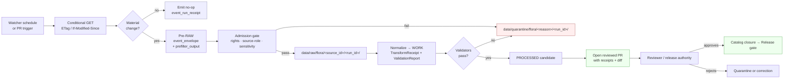

<!-- [KFM_META_BLOCK_V2]
doc_id: kfm://doc/flora-source-refresh-runbook
title: Flora — Source Refresh Runbook
type: standard
version: v0.1
status: draft
owners: TODO — Flora domain steward, Docs steward, Sources steward
created: 2026-05-13
updated: 2026-05-13
policy_label: public
related:
  - docs/doctrine/directory-rules.md
  - docs/doctrine/lifecycle-law.md
  - docs/doctrine/trust-membrane.md
  - docs/sources/SOURCE_DESCRIPTOR_STANDARD.md
  - docs/domains/flora/README.md
  - docs/runbooks/governed_ai_VALIDATION.md
  - docs/adr/ADR-0001-schema-home.md
tags: [kfm, runbook, flora, sources, watcher, refresh, governance]
notes:
  - Path PROPOSED per Directory Rules §4 Step 3 (domain segment under responsibility root).
  - Implementation maturity UNKNOWN; no mounted repo evidence in this session.
  - All paths labeled PROPOSED until verified against mounted repo + ADRs.
[/KFM_META_BLOCK_V2] -->

# 🌿 Flora — Source Refresh Runbook

> Governed procedure for re-checking, re-fetching, and proposing updates to Flora sources without bypassing evidence, sensitivity, review, or release controls. A source refresh is **a watcher event that opens a reviewed PR**, never a direct publish.


| Field | Value |
|---|---|
| **Document type** | Operational runbook (standard doc) |
| **Authority class** | Doctrine — CONFIRMED · Procedure — PROPOSED · Specific paths — PROPOSED |
| **Lane** | Flora (`domains/flora/`) |
| **Owners** | TODO — Flora domain steward · Sources steward · Docs steward (reviewable placeholder) |
| **Last reviewed** | TODO (placeholder; populate on first merge) |
| **Supersedes** | None (new doc) |
| **Lifecycle scope** | Pre-RAW admission edge → RAW → WORK / QUARANTINE → PROCESSED → CATALOG / TRIPLET → PUBLISHED |
| **Audience** | Flora steward · Sources steward · Watcher maintainers · Release authority · Reviewers |

---

## Quick jump

- [1. Purpose & scope](#1-purpose--scope)
- [2. Doctrine recap (read first)](#2-doctrine-recap-read-first)
- [3. Flora source families this runbook covers](#3-flora-source-families-this-runbook-covers)
- [4. Preconditions](#4-preconditions)
- [5. Procedure — the refresh sequence](#5-procedure--the-refresh-sequence)
- [6. Material-change classification](#6-material-change-classification)
- [7. Receipts emitted by each step](#7-receipts-emitted-by-each-step)
- [8. Sensitivity & fail-closed behaviors](#8-sensitivity--fail-closed-behaviors)
- [9. Kill switch & abort](#9-kill-switch--abort)
- [10. Verification](#10-verification)
- [11. Rollback](#11-rollback)
- [12. Common failure modes](#12-common-failure-modes)
- [13. Related docs](#13-related-docs)
- [14. Open questions & verification backlog](#14-open-questions--verification-backlog)
- [Appendix A — Worked example (illustrative)](#appendix-a--worked-example-illustrative)

---

## 1. Purpose & scope

**Purpose.** Re-fetch, re-validate, and *propose* updates to Flora sources (specimen portals, occurrence aggregators, rare-plant programs, vegetation surveys, vegetation indices, restoration project records) without bypassing the KFM trust membrane.

**In scope.**
- Conditional re-fetch of Flora `SourceDescriptor` targets.
- Material-change detection against the prior canonical state.
- Emission of pre-RAW admission receipts, `RunReceipt`, and supporting proof.
- Opening a reviewed PR or review packet when material change is detected.
- Quarantine routing when rights, sensitivity, taxonomy, or schema state is unclear.

**Out of scope.**
- Direct publication to `data/published/layers/flora/...` from a watcher run. *(Forbidden by doctrine — see §2.)*
- Editing canonical taxonomy or rare-plant sensitivity rules. *(Owned by domain steward; see `docs/domains/flora/README.md` — PROPOSED.)*
- Schema or contract changes. *(Require ADR; see `docs/adr/`.)*
- Cross-domain joins (Habitat × Flora, Agriculture × Flora). *(Out of lane — see `docs/runbooks/<domain>/` runbooks.)*

> [!IMPORTANT]
> A **source refresh is not a publish.** Watchers detect change; reviewers and the release authority decide what becomes public. A refresh that bypasses review, policy, evidence closure, or the release gate violates the KFM lifecycle invariant regardless of which directory the bytes end up in.

---

## 2. Doctrine recap (read first)

This runbook only encodes operational steps. The rules that make those steps safe are doctrine. Two pieces of doctrine cannot be relaxed inside this runbook.

### 2.1 Lifecycle invariant — CONFIRMED

> **RAW → WORK / QUARANTINE → PROCESSED → CATALOG / TRIPLET → PUBLISHED.**
> Promotion is a **governed state transition, not a file move.**

A source refresh produces material that enters at the **pre-RAW admission edge** and moves through RAW. It does not skip phases, and it does not produce a `ReleaseManifest` by itself.

### 2.2 Watcher-as-non-publisher — CONFIRMED doctrine, PROPOSED implementation

KFM dynamic source watchers MUST detect material change and open **reviewed PRs or review packets**, not publish refreshed artifacts directly. Source updates enter review and validation lanes before any tile, catalog, or layer rebuild.

### 2.3 Trust membrane — CONFIRMED

Watchers, fetchers, and refresh jobs MUST NOT:

- Mutate `data/processed/`, `data/catalog/`, `data/triplets/`, or `data/published/` directly.
- Expose RAW, WORK, or QUARANTINE to public clients, the UI, or the AI surface.
- Bypass `policy/` decisions for rights, sensitivity, or release state.
- Treat a fluent generation, summary, or popup as proof of source state.



> [!NOTE]
> The diagram reflects KFM doctrine (CONFIRMED). The exact step ownership in the repository (job names, package paths, runner identities) is **PROPOSED / UNKNOWN** until verified against the mounted repository and accepted ADRs.

[⬆ Back to top](#-flora--source-refresh-runbook)

---

## 3. Flora source families this runbook covers

The doctrinal Flora source basis is `SRC-FLORA, SRC-HAB, EXT-GBIF, EXT-INAT, EXT-NATSERVE, EXT-FWS`, plus state rare-plant programs, herbaria / specimen portals, vegetation surveys, remote-sensing vegetation indices, and restoration project records. Each refresh job MUST classify the watcher type so the right validators run.

| Source family (illustrative) | Watcher type | Typical cadence | Refresh risks | Sensitivity defaults |
|---|---|---|---|---|
| Herbarium / specimen portal | `api` or `file` | Monthly–quarterly | Schema drift; locality precision changes | Generalize exact rare-taxon locations; fail closed |
| GBIF mirror / extract | `api` | Weekly | Provider rate limits; coordinate uncertainty changes | Rare-taxon points → generalized polygon |
| iNaturalist observations | `api` | Daily–weekly | Identification flux; obscured coordinates | Respect upstream geoprivacy; do not de-obscure |
| NatureServe / state rare-plant program | `file` or `api` | Quarterly–annual | Status changes; rights / redistribution unclear | Default to redaction; steward approval required |
| USFWS listings (T/E, candidate) | `file` or `api` | As-issued | Listing changes propagate downstream | Public layer must reflect current listing |
| Vegetation surveys (community) | `file` | Annual / project-bound | Methodology drift; CRS / scale mismatch | Community polygons — generalization MAY apply |
| Remote-sensing vegetation indices (rasters) | `stac` or `file` | Per-scene / seasonal | COG validity; cloud cover; QA flags | Public-safe; document raster provenance |
| Restoration planting records | `file` | Per-project | Site coordinates may be sensitive | Steward approval; default to coarse geometry |

> [!NOTE]
> The watcher-type enum (`stac, gtfs, tile, file, api`) is project doctrine. Specific endpoints, rights terms, source roles, and refresh cadences for any individual Flora source are **PROPOSED / UNKNOWN** until recorded in `data/registry/sources/flora/` and validated against the `SourceDescriptor` standard.

[⬆ Back to top](#-flora--source-refresh-runbook)

---

## 4. Preconditions

Before a Flora source refresh may execute, all of these MUST be true. Missing any precondition → **abort with a structured failure**, not a partial run.

- [ ] **SourceDescriptor exists** at `data/registry/sources/flora/<source_id>.json` (PROPOSED path) with: source role, rights, sensitivity class, watcher type, cadence, retrieval plan, signature reference.
- [ ] **Source role is set** (`observation | model | regulatory | legal | status`) and not invented at refresh time.
- [ ] **Rights & redistribution class are recorded** and not `unknown`.
- [ ] **Sensitivity defaults** for the source family are declared (e.g., rare-plant generalization rule).
- [ ] **No-network fixture exists** under `tests/fixtures/flora/sources/<source_id>/` (PROPOSED) for dry-run replay.
- [ ] **Watcher signature reference** resolves (OCI signature artifact, per the watcher registry pattern).
- [ ] **Kill switch is not engaged** (see §9).
- [ ] **Reviewer / release authority is reachable** for the eventual PR (CODEOWNERS entry for Flora exists).

> [!WARNING]
> If any precondition is **UNKNOWN** rather than satisfied, the run MUST exit with a structured failure receipt and **MUST NOT** create a RAW capture. An unknown-rights or unknown-source-role refresh is a quarantine event by design.

[⬆ Back to top](#-flora--source-refresh-runbook)

---

## 5. Procedure — the refresh sequence

Each numbered step has a **purpose**, a **what-to-emit**, and a **fail-closed** rule. Steps execute sequentially; later steps MUST NOT run if any earlier step ended in `DENY`, `ABSTAIN`, or `ERROR`.

### Step 1 — Initialize run identity

- **Purpose.** Establish a deterministic, auditable run identity before any network or file work.
- **Inputs.** `source_id`, current `SourceDescriptor` (with `spec_hash`), prior `RunReceipt` (last successful run for this source).
- **Emit.** `run_id` (deterministic, derived from source identity + UTC date or trigger), `event_envelope` initial fields (trigger, actor, scheduled vs. manual).
- **Fail-closed.** If `SourceDescriptor` is missing, unparseable, or its `spec_hash` does not match recomputed canonical hash (JCS canonicalization → SHA-256), abort with `ERROR` and emit a structured failure receipt. Do **not** proceed to fetch.

```bash
# Illustrative pseudocode — exact tool/script names are PROPOSED.
# TODO: replace with real workflow once tools/refresh paths are verified.
RUN_ID="$(make-run-id --source "${SOURCE_ID}" --trigger "${TRIGGER}")"
verify-source-descriptor --source "${SOURCE_ID}" --check spec_hash
```

### Step 2 — Conditional fetch

- **Purpose.** Avoid unnecessary refetches; obtain ETag / Last-Modified / digest evidence of upstream state.
- **Method.** Conditional GET (`If-None-Match`, `If-Modified-Since`), or watcher-type-appropriate equivalent (`stac` item digest, file SHA, API cursor / since-token).
- **Emit.** `prefilter_output` with: requested URL, response status, response ETag / Last-Modified, response digest (when fetched), upstream content type, retrieval timestamp.
- **No-network mode.** If running under the no-network fixture, replay the recorded fixture and skip the live request. Mark the receipt with `mode = "fixture"`.
- **Fail-closed.** Network error, provider unreachable, unapproved provider, or schema-unknown response type → exit `ERROR`. Do not write to RAW.

### Step 3 — Admission (pre-RAW → RAW)

- **Purpose.** Verify rights, source-role consistency, and sensitivity class **before** the payload is admitted into RAW.
- **Gate inputs.** `SourceDescriptor`, `prefilter_output`, current `policy/domains/flora/` rules (PROPOSED).
- **Emit.** `event_run_receipt` (admission attempt outcome), and on `ALLOW` a `RawCaptureReceipt`.
- **Where bytes land on ALLOW.** `data/raw/flora/<source_id>/<run_id>/` (PROPOSED — Directory Rules §9.1).
- **Where bytes land on RESTRICT / DENY / ABSTAIN.** `data/quarantine/flora/<reason>/<run_id>/` with a structured `QuarantineRecord`.

> [!CAUTION]
> The admission decision is **not** a `ReleaseManifest`. Admitting material into RAW does not grant any public-facing visibility — RAW is never a public surface.

### Step 4 — Material-change detection

- **Purpose.** Decide whether this refresh is a *no-op*, a *minor change*, or a *material change*.
- **Method.** Compare canonical hashes (JCS-canonicalized SourceDescriptor + payload digest) and any per-source diff signals (centroid shift, status change, local-patch area, record count delta, taxonomic identity changes).
- **Emit.** `material_change_report` with: prior `spec_hash`, current `spec_hash`, signal-by-signal verdict, and overall classification.
- **Outcomes.** `no_op` → exit cleanly with receipt; `changed` → continue; `failed` → quarantine with reason; `reviewer_required` → halt and request steward attention.

See [§6 Material-change classification](#6-material-change-classification) for the signal thresholds.

### Step 5 — Normalize (RAW → WORK)

- **Purpose.** Transform RAW into normalized Flora candidate records (`PlantTaxon`, `SpecimenRecord`, `FloraOccurrence`, `RarePlantRecord`, `VegetationCommunity`, `InvasivePlantRecord`, `PhenologyObservation`, `RangePolygon`, `HabitatAssociation`, `BotanicalSurvey`, `RestorationPlanting`).
- **Emit.** `TransformReceipt` and (where applicable) `RedactionReceipt` for any geoprivacy transform applied to rare-taxon coordinates.
- **Fail-closed.** Any record whose sensitivity class is unresolved at this step **MUST** move to QUARANTINE — not WORK — until steward review classifies it.

### Step 6 — Validate (WORK → PROCESSED candidate)

Run the standard Flora validator set against the normalized records:

| Validator | What it checks | Fail-closed outcome |
|---|---|---|
| Schema validation | `SourceDescriptor`, normalized record shapes against `schemas/contracts/v1/domains/flora/` (PROPOSED) | Stay in WORK with structured `FAIL`. |
| Source-descriptor validation | Required fields, source-role enum, rights enum, sensitivity enum | Quarantine with reason. |
| Rights validation | Redistribution class is permissive enough for proposed use | DENY public path; restrict to steward-only. |
| Sensitivity validation | Rare-plant / culturally sensitive records carry redaction or generalization | Force redaction; if impossible, DENY. |
| Taxonomy resolution | Names resolve against the chosen authority (e.g., ITIS, GBIF backbone) | ABSTAIN; flag for steward. |
| Temporal logic | Observed / valid / retrieval / source times are consistent | ABSTAIN on missing material temporal scope. |
| Geometry validity | Geometry parses, CRS recorded, no self-intersection or NaN | Quarantine with `GeometryRepairReport`. |
| Citation validation | Each claim resolves to an `EvidenceRef` → `EvidenceBundle` | ABSTAIN on uncited claims. |
| Public-safe redaction check | No exact rare-plant coordinates in any public-bound artifact | DENY (hard fail-closed). |
| Source-role mismatch denial | Observation source not used as regulatory source, etc. | DENY with reason code. |
| Stale-state non-regression | Prior lineage entries still resolve | ABSTAIN; flag for correction notice. |

- **Emit.** `ValidationReport`, plus a `PolicyDecision` summarizing the admission posture for downstream.

### Step 7 — Catalog & evidence closure (PROCESSED → CATALOG / TRIPLET *candidate*)

- **Purpose.** Make sure every claim in the candidate set has a closed evidence chain before any human is asked to review.
- **Emit.** `EvidenceBundle` projection for the candidate set, candidate `CatalogRecord` (STAC / DCAT / PROV fragments), candidate graph/triplet projection if applicable.
- **Fail-closed.** Any unresolved `EvidenceRef` → HOLD at PROCESSED; **do not** open a PR.

### Step 8 — Open the reviewed PR (the *only* externalizing step)

- **Purpose.** Surface the refresh to humans for review. This is where the watcher hands off control.
- **PR body MUST include.** `run_id`, `spec_hash` before/after, `material_change_report` summary, signal-by-signal diff, `ValidationReport` digest, `PolicyDecision`, links to receipts and candidate `EvidenceBundle`.
- **PR body MUST NOT include.** Exact sensitive geometry, unredacted rare-plant coordinates, internal credentials, raw provider response bodies that contain sensitive locality data.
- **Fail-closed.** If the watcher cannot open the PR (auth, branch protection, kill switch), emit a structured failure receipt and quarantine the candidate set; do not retry blindly.

### Step 9 — Reviewer / release authority decision

The watcher's job is done. The next decisions are governance, not automation:

- **Approve & release** → standard promotion gates (`Admission → Normalization → Validation → Catalog closure → Release`) execute, ending in a `ReleaseManifest` with a rollback target and correction path.
- **Approve as restricted / steward-only** → release manifest scoped to restricted views; no public layer changes.
- **Reject** → quarantine with reason; correction path opened if a prior release is now wrong.
- **Hold for steward review** → no movement.

> [!IMPORTANT]
> A `ReleaseManifest` is produced **only** by the release authority through the standard publication flow — never by the refresh watcher itself. The watcher's terminal artifact is the PR.

[⬆ Back to top](#-flora--source-refresh-runbook)

---

## 6. Material-change classification

Material-change thresholds for Flora are **PROPOSED** and require domain-steward calibration. The watcher emits a `material_change_report` regardless of outcome, so reviewers can see why a no-op was a no-op.

| Signal | Example threshold (PROPOSED — calibrate per source) | Outcome on trip |
|---|---|---|
| Canonical `spec_hash` change | Any change | At minimum `changed`. |
| Record count delta | ±X% versus prior canonical state | `changed`; reviewer notes if outside band. |
| Taxonomic identity changes | New taxon, renamed taxon, lumping / splitting | `reviewer_required` (always). |
| Listing-status change (T/E, candidate, state-listed) | Any change | `reviewer_required`. |
| Coordinate uncertainty change for a known rare taxon | Any tightening of uncertainty | `reviewer_required` — sensitivity-sensitive. |
| CRS / scale / projection change at source | Any change | `failed` → quarantine until reconciled. |
| Provider-side schema drift | New required field / removed field | `failed` → quarantine; ADR / migration may be needed. |
| Centroid shift for an existing community polygon | Above per-source threshold | `changed`. |
| Local-patch area delta for community polygon | Above per-source threshold | `changed`. |
| Source-role declaration change | Any change | `reviewer_required` (source-role anti-collapse rule). |

> [!NOTE]
> The signal set is doctrine-aligned (centroid shift, status change, local patch area, identity changes). The numeric thresholds are **PROPOSED** and live in the per-source `SourceDescriptor`, not in this runbook.

[⬆ Back to top](#-flora--source-refresh-runbook)

---

## 7. Receipts emitted by each step

Every step MUST leave audit memory. Receipts are emitted under `data/receipts/` (per Directory Rules §9.1) — never inside the source payload directory.

| Step | Primary receipt(s) | Companion artifacts | Mandatory fields (PROPOSED minimums) |
|---|---|---|---|
| Initialize | `event_envelope` (initial) | — | `run_id`, `source_id`, `trigger`, `actor`, `scheduled_at`, `mode` |
| Conditional fetch | `prefilter_output` | Cached response digest | `url`, `status`, `etag`, `last_modified`, `digest`, `retrieved_at`, `provider` |
| Admission | `event_run_receipt`, `RawCaptureReceipt` *or* `QuarantineRecord` | `PolicyDecision` (admission) | `outcome`, `policy_id`, `rights_decision`, `source_role`, `sensitivity_class`, `reasons[]` |
| Material-change | `material_change_report` | Signal trace | `prior_spec_hash`, `current_spec_hash`, `signals[]`, `classification` |
| Normalize | `TransformReceipt`, `RedactionReceipt` (if applied) | `GeometryRepairReport` (if applied) | `inputs[]`, `outputs[]`, `tool_versions`, `losses[]` |
| Validate | `ValidationReport`, `PolicyDecision` | `CitationValidationReport` (if applicable) | `validator_id`, `passes[]`, `failures[]`, `deterministic_inputs` |
| Catalog & evidence closure | Candidate `CatalogRecord`, `EvidenceBundle` projection | Candidate graph/triplet projection | `evidence_refs[]`, `closure_status`, `digests` |
| Open PR | `RunReceipt` (terminal) | PR URL, PR body digest | `source_url`, `etag`, `spec_hash`, `artifacts[]`, `provider`, `actor`, `timestamps`, `signature_ref` |

> [!TIP]
> A reviewer should be able to reconstruct the entire refresh from the receipts alone, **without** re-fetching from the provider. If they cannot, the receipts are incomplete and the run is not auditable.

[⬆ Back to top](#-flora--source-refresh-runbook)

---

## 8. Sensitivity & fail-closed behaviors

Flora carries some of the strictest sensitivity defaults in the KFM domain set. The runbook MUST enforce these regardless of source-family convenience.

- **Exact rare-plant locations fail closed.** They never appear in any public-bound artifact emitted by this runbook. If exact coordinates are present in the source payload, they remain in RAW (or QUARANTINE) and are generalized / withheld before any record can leave WORK.
- **Geoprivacy transforms are receipt-bearing.** Any centroid fuzzing, buffer, county-/ecoregion-generalization, or redaction emits a `RedactionReceipt` recording the transform method and parameters.
- **Culturally sensitive plant knowledge** follows steward-controlled review. If a source descriptor flags cultural sensitivity, the refresh routes the candidate to steward review even when nothing else has changed.
- **Source-role mismatch denial is hard.** An observation source cannot be promoted into a regulatory-source slot via a refresh.
- **Unknown rights fail closed.** A source whose redistribution class is `unknown` cannot pass admission, period.

| Sensitivity tier (illustrative) | Default treatment by this runbook |
|---|---|
| Public-safe taxon page metadata | Pass through normal pipeline. |
| Generalized occurrence (county / ecoregion) | Pass with `RedactionReceipt` if generalization was applied at this step. |
| Exact rare-plant point | DENY public layer; restricted view only with steward approval. |
| Steward-controlled record (culturally sensitive) | DENY public layer; route to steward review even on `no_op`. |
| Restoration site with sensitive landowner data | Generalize geometry; redact identifiers; steward approval before any public emission. |

> [!WARNING]
> "Public-safe by default" means *the public surface defaults to less specificity, not more.* If the runbook is unsure whether a record is public-safe, it MUST treat it as restricted until steward review says otherwise.

[⬆ Back to top](#-flora--source-refresh-runbook)

---

## 9. Kill switch & abort

A kill-switch file (path TBD; recorded in `infra/` or `control_plane/`, per repo convention — **PROPOSED / NEEDS VERIFICATION**) causes any aggregator or release gate to fail-closed. This runbook honors the kill switch at three places:

1. **At Step 1 (initialize).** If the kill switch is engaged, abort before any fetch.
2. **At Step 8 (open PR).** If the kill switch is engaged between fetch and PR, do not open the PR; quarantine the candidate set and emit a structured failure receipt referencing the kill switch state.
3. **At any external command** that would mutate `data/processed/`, `data/catalog/`, `data/triplets/`, `data/published/`, or open a release PR.

> [!CAUTION]
> The kill switch is fail-closed, not fail-loud. A kill-switched run produces *receipts that the run was halted*, not error noise. Reviewers should see "halted by kill switch" as a first-class outcome, not as a generic failure.

[⬆ Back to top](#-flora--source-refresh-runbook)

---

## 10. Verification

A refresh run is "verified" only when **all** of the following hold:

- [ ] `RunReceipt` exists with non-empty `source_url`, `spec_hash`, `artifacts[]`, `provider`.
- [ ] Canonical hash check passes (JCS canonicalization of the `SourceDescriptor` → SHA-256 == recorded `spec_hash`).
- [ ] `ValidationReport` is `pass` for all blocking validators (schema, source-descriptor, rights, sensitivity, citation, source-role mismatch, public-safe redaction).
- [ ] `material_change_report` classification matches the receipts (no silent re-classification).
- [ ] PR body shows receipt rollup, not a free-text summary.
- [ ] Signature reference resolves (watcher descriptor is signed; OCI signature present).
- [ ] No exact sensitive geometry in any committed artifact, PR body, or comment.
- [ ] If `mode = "fixture"`, the run replayed a recorded no-network fixture; if `mode = "live"`, conditional GET evidence is recorded.

> [!NOTE]
> KFM doctrine says branch protection / checks rollup should block merge until receipts verify. The exact CI job names, OPA bundle locations, and required checks remain **UNKNOWN / NEEDS VERIFICATION** for this lane in the absence of mounted-repo evidence.

[⬆ Back to top](#-flora--source-refresh-runbook)

---

## 11. Rollback

A refresh PR can be rolled back at three stages, with different mechanics.

| Stage | What "rollback" means | Mechanism (PROPOSED) |
|---|---|---|
| Before merge | Close the PR without merging; quarantine the candidate set. | Add a quarantine `event_run_receipt` referencing the abandoned `run_id`. |
| After merge, before release | The PR shipped the candidate set into PROCESSED / CATALOG candidate, but no `ReleaseManifest` was issued. | Revert the PR; emit a correction receipt; quarantine intermediate candidates. |
| After release | A `ReleaseManifest` referenced material from this refresh and a defect was found. | Issue a `RollbackCard` referencing the prior `ReleaseManifest` and the rollback target; emit a `CorrectionNotice` if downstream derivatives are invalidated; restore the prior release via the standard release path. |

> [!IMPORTANT]
> Rollback is **never** a hidden file copy. Every rollback emits a rollback attestation (per Master MapLibre Atlas doctrine) and identifies the prior safe artifact set. A revert that leaves no receipt is a violation, not a rollback.

Rollback drills for this runbook live alongside other rollback drills (path **PROPOSED**: `docs/runbooks/flora/ROLLBACK_DRILL.md` — not yet authored).

[⬆ Back to top](#-flora--source-refresh-runbook)

---

## 12. Common failure modes

These show up often enough to call them out by name. None of them is an acceptable "skip review" justification.

<details>
<summary><strong>F-01 — "It's just a refresh, no taxonomy changed."</strong></summary>

A clean `spec_hash` change with no taxonomic identity drift can still carry sensitivity changes (new listing status, new geoprivacy flags). The watcher MUST run the full validator set, not a subset. Skipping validators on the assumption of similarity is how source-role drift sneaks into release.
</details>

<details>
<summary><strong>F-02 — "The provider is down; let's promote yesterday's candidate."</strong></summary>

A candidate that exists in WORK or PROCESSED is not a substitute for a successful refresh. If the provider is unreachable, the run ends in `ERROR` with a no-network receipt. Yesterday's candidate is governed by its own receipts, not by today's failed run.
</details>

<details>
<summary><strong>F-03 — "Rights are 'TBD' but the data looks fine."</strong></summary>

`rights = unknown` is a quarantine reason, full stop. Apparent benignity is not evidence of permission. The refresh fails at admission, not at release.
</details>

<details>
<summary><strong>F-04 — "The PR body got a bit long; I trimmed the diff."</strong></summary>

Trimming reviewer-facing diff signals (centroid shifts, listing changes, taxonomic identity diff) breaks the audit chain. If the PR body is too long, link to a `material_change_report` artifact; do not summarize it away.
</details>

<details>
<summary><strong>F-05 — "I generalized the rare-plant point inside the PR description as a courtesy."</strong></summary>

Generalized geometry belongs in a `RedactionReceipt`, not free-text. A PR description is not a release artifact and is not the right home for transformed sensitive geometry. Keep the receipts authoritative.
</details>

<details>
<summary><strong>F-06 — "The watcher published the artifact directly because review was slow."</strong></summary>

This is the doctrine violation the watcher-as-non-publisher rule exists to prevent. The fix is to escalate the review backlog, not to bypass it. A direct publish by the watcher is a security incident; open an entry in the drift register and treat the published artifact as withdrawn.
</details>

[⬆ Back to top](#-flora--source-refresh-runbook)

---

## 13. Related docs

> Linked paths are **PROPOSED** until verified against mounted-repo state. TODO entries are placeholders for docs that the dossier sequence anticipates but that have not been confirmed authored.

- `docs/doctrine/directory-rules.md` — placement authority for every path mentioned here.
- `docs/doctrine/lifecycle-law.md` — the RAW → PUBLISHED invariant.
- `docs/doctrine/trust-membrane.md` — what watchers, fetchers, and refreshers may not do.
- `docs/sources/SOURCE_DESCRIPTOR_STANDARD.md` — required fields the refresh consumes.
- `docs/domains/flora/README.md` — domain scope, object families, sensitivity defaults. *(TODO — confirm authored.)*
- `docs/runbooks/flora/ROLLBACK_DRILL.md` — companion rollback drill. *(TODO — not yet authored.)*
- `docs/runbooks/flora/CORRECTION_NOTICE.md` — companion correction-notice runbook. *(TODO — not yet authored.)*
- `docs/runbooks/governed_ai_VALIDATION.md` — citation validation & abstain behavior for any Focus Mode answer that consumes Flora.
- `docs/adr/ADR-0001-schema-home.md` — schema home convention referenced by validators.
- `docs/registers/DRIFT_REGISTER.md` — where drift between this runbook and repo reality is recorded.
- `docs/registers/VERIFICATION_BACKLOG.md` — where open verification items below should be tracked.

[⬆ Back to top](#-flora--source-refresh-runbook)

---

## 14. Open questions & verification backlog

Items below are explicitly unresolved and SHOULD be tracked in `docs/registers/VERIFICATION_BACKLOG.md`. They are listed here so a reader of this runbook sees the boundary between doctrine and unverified detail.

- **NEEDS VERIFICATION** — Path convention: `docs/runbooks/flora/<name>.md` (domain segment) vs. `docs/runbooks/flora_<name>.md` (flat-prefix, as proposed in the Whole-UI / Governed-AI dossier for `ui_*` and `governed_ai_*` runbooks). Pick one in an ADR before more domain runbooks land.
- **NEEDS VERIFICATION** — Concrete locations: kill-switch file, watcher registry, OCI signature registry, OPA / Rego bundle for Flora policy gates.
- **NEEDS VERIFICATION** — CI job names, branch-protection check names, and which check is required for merge.
- **NEEDS VERIFICATION** — Whether `connectors/domains/flora/` (Directory Rules §4 Step 1) or `pipelines/domains/flora/` owns the refresh executable for each watcher type.
- **NEEDS VERIFICATION** — Per-source numeric thresholds for material-change signals (record-count band, centroid-shift tolerance, patch-area delta).
- **NEEDS VERIFICATION** — Taxonomy authority of record for Flora (ITIS vs. GBIF backbone vs. domain-curated) and the resolver location.
- **NEEDS VERIFICATION** — Exact `SourceDescriptor` field list for Flora (extends standard with cultural-sensitivity / geoprivacy fields).
- **UNKNOWN** — Whether `docs/runbooks/flora/` exists in the mounted repository; whether any Flora `SourceDescriptor` files have landed; whether the no-network fixture pattern is implemented for Flora yet.
- **OPEN** — Should a Flora refresh ever auto-merge a "no-op" PR? (Doctrine leans **no**; watcher remains a PR-opener, not a merger.)

[⬆ Back to top](#-flora--source-refresh-runbook)

---

## Appendix A — Worked example (illustrative)

> [!NOTE]
> The values below are **illustrative**, not sourced from any specific Flora `SourceDescriptor`. They show what the receipts and PR body should look like; they do not record a real refresh.

**Scenario.** A scheduled weekly refresh of an external occurrence aggregator for the Flora lane. Three records change status; one rare-taxon record gains a tighter coordinate uncertainty.

```text
run_id        : flora-occurrence-aggregator-2026W19-001
source_id     : ext-occurrence-aggregator-flora
watcher_type  : api
trigger       : schedule
mode          : live
provider      : <approved-provider-id>
spec_hash old : 7c2c…(JCS/SHA-256 over prior SourceDescriptor)
spec_hash new : 9b1a…
classification: reviewer_required
signals       :
  - record_count_delta:    +12 records ............ within band (changed)
  - taxonomic_identity:    no changes ............. clean
  - listing_status:        3 records changed ...... reviewer_required
  - rare_taxon_uncertainty:1 record tightened ..... reviewer_required (sensitivity)
  - crs:                   unchanged .............. clean
  - schema_drift:          none ................... clean
  - source_role:           unchanged .............. clean
receipts      :
  - event_envelope, prefilter_output, event_run_receipt
  - RawCaptureReceipt, TransformReceipt, RedactionReceipt (1×)
  - ValidationReport (pass), CitationValidationReport (pass)
  - PolicyDecision (allow with obligations: redact, restrict)
  - material_change_report (reviewer_required)
  - RunReceipt (terminal)
pr_body       :
  - links to all receipts above
  - generalized polygon shown for rare-taxon record (no exact point)
  - reviewer ask: confirm listing-status updates and approve restricted view
```

**What this run did NOT do.**

- It did not publish anything.
- It did not edit canonical taxonomy.
- It did not expose the exact rare-taxon coordinate anywhere outside RAW.
- It did not produce a `ReleaseManifest`.

[⬆ Back to top](#-flora--source-refresh-runbook)

---

### Related docs

- [`docs/doctrine/directory-rules.md`](../../doctrine/directory-rules.md) — placement authority *(path PROPOSED)*
- [`docs/sources/SOURCE_DESCRIPTOR_STANDARD.md`](../../sources/SOURCE_DESCRIPTOR_STANDARD.md) — descriptor contract *(path PROPOSED)*
- [`docs/domains/flora/README.md`](../../domains/flora/README.md) — Flora lane scope *(path PROPOSED)*

**Last updated:** TODO (placeholder — set on first merge).

[⬆ Back to top](#-flora--source-refresh-runbook)
