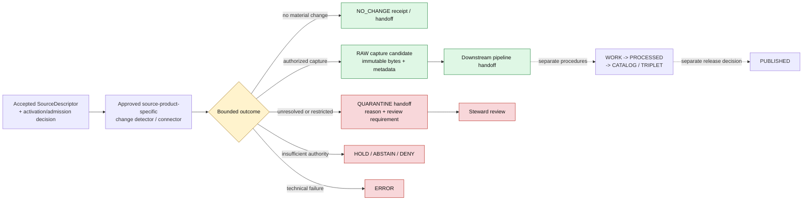

<!-- [KFM_META_BLOCK_V2]
doc_id: kfm://doc/runbook-flora-source-refresh
title: Flora — Source Refresh Runbook
type: standard
profile: repository-grounded-source-edge-refresh-and-handoff
version: v1.1
prior_version: v1.0
status: draft; repository-grounded; documentation-only; fixture-first; live-refresh-hold; non-authoritative; non-publisher
owners:
  - "@bartytime4life — verified GitHub review route only"
owner_status: "Flora, source, connector, rights, sensitivity, cultural-knowledge, taxonomy, evidence, policy, operations, correction, release, and publication assignments remain NEEDS VERIFICATION; repository ownership and review routing do not create those authorities."
created: 2026-05-13
updated: 2026-08-28
policy_label: restricted-review; flora; source-refresh; source-edge; fixture-first; no-live-source; rare-plant-sensitive; non-release; not-for-life-safety
current_path: docs/runbooks/flora/SOURCE_REFRESH_RUNBOOK.md
owning_root: docs/
responsibility: "Document the bounded procedure for rechecking and capturing an already admitted Flora source product at the source edge, routing results only to governed RAW or QUARANTINE handoffs, and stopping before normalization, taxonomy resolution, evidence closure, promotion, release, deployment, or publication."
truth_posture: >-
  CONFIRMED same-path repository placement under accepted Directory Rules,
  a documented subtype-first Flora source-registry lane containing one
  PROPOSED placeholder rather than a complete SourceDescriptor, an empty
  projection-only source-authority register, the rich proposed SourceDescriptor
  schema and compatibility validator/fixtures, one deterministic no-network
  public-safe Flora fixture profile, explicit Flora proof/release workflow
  holds, a documentation-only Flora connector compatibility lane, source-first
  connector naming drift, scaffolded and inactive Flora policy, and a
  scaffold-only sensitivity lane / PROPOSED source-product-specific live
  refresh, conditional retrieval, capture receipts, restricted RAW routing,
  quarantine recovery, stale propagation, connector activation, and
  operational alerting / UNKNOWN admitted live Flora sources, deployed
  schedulers, current credentials, external object stores, operational source
  cadence, public Flora releases, and downstream consumers / NEEDS VERIFICATION
  accountable stewards, rights and terms, source-product identity, source-role
  vocabulary reconciliation, accepted activation decisions, exact connector
  commands, restricted-storage controls, culturally sensitive plant-knowledge
  authority, correction targets, and release authority; cite-or-abstain
prepared_under_prompt: KFM Repository Build-Out & Markdown Modernization Implementation Agent v6.0.0
evidence_snapshot:
  repository: bartytime4life/Kansas-Frontier-Matrix
  base_ref: main
  base_commit: 35bb62209569f63af78c6fefe4c85015d3bdceb1
  target_prior_blob: 3f5bae3605c4196a2fd9847eb8dd64f2ea85a83b
  directory_rules_blob: fd49a0b83e55cef52c1124281f093e263526898d
  adr_0029_blob: a4de0d7a96b78da59cfc499d1025e1508afd8dd9
  flora_source_registry_readme_blob: 356cd29ca5a764ffe1e774fb565bce50bba46011
  flora_source_placeholder_blob: 4cf877d234542990be382913d0ab0917f8fb3398
  source_authority_register_blob: 32729857bc8eb5001acb37b8ee8e60bcb6e0dc50
  source_descriptor_schema_blob: 582e70b834278c3c6ca9a8b31efbe0989c96f0bc
  source_descriptor_alias_blob: 42da54b28a527850cce88ad89f68921c101fc56b
  source_descriptor_validator_blob: 90662367941a2746236966313d8aade5cfdc3387
  source_descriptor_fixture_readme_blob: 81708ab3e4ec1d05d7939807225192adf28276de
  flora_fixture_readme_blob: d09d667a5493628284095941c7a930034dcb7433
  flora_fixture_test_blob: 18d15781b78487de4c786c5ee38254f3a48e49e3
  flora_fixture_validator_blob: 17933f997f7cb1219e3057ea74bf2c077dc45386
  flora_workflow_blob: 3fe6b1ba8150960692b6b2fc764c6aa31d09565c
  flora_policy_readme_blob: 247fc146131f4e6598af9fd939cf087d92523ed6
  flora_sensitivity_readme_blob: 4c65abec24135f7e4467fd108e163cdce594d5f9
  flora_connector_index_blob: 9460bc9f0a29d0944d7193f04eccf643b2cab740
  usda_plants_connector_readme_blob: 97b104034f29ead800bf16793c3155d62394fff4
  flora_raw_readme_blob: 5a43f1788b887bd38fc54e593c566a915976413b
  flora_quarantine_readme_blob: bd74daceab6ef8be1bb8da5489fec25c4833ad8c
  domain_duplicate_blob: e63eec20889478edbef869aa0731f2b87ae312f5
reconciliation_snapshot:
  base_commit: 1bc300c5aeaf5323edead670d648edfb8c3f21c2
  target_prior_blob: 08c1f76ff328ff0636ca8d1f8e2a6dd03275ee3c
  flora_raw_prior_blob: 5a43f1788b887bd38fc54e593c566a915976413b
  flora_raw_head_blob: b43d9ef27b100b26d6b72f516d84ff1c44cb3287
  scope: "Same-path reconciliation of the Flora RAW README boundary only; the original v1.0 evidence snapshot and all other evidence pins remain historical."
drive_source: KFM_Flora_Architecture_PDF_Only_Implementation_Blueprint.pdf
drive_source_date: 2026-04-21
inspection_boundary: >-
  Current-session GitHub reads of the target, accepted directory governance,
  Flora source registry and placeholder record, source-authority projection,
  SourceDescriptor schemas/validator/fixtures, Flora workflow/tests/validator,
  source-first connector documentation, domain and sensitivity policy
  scaffolds, RAW/QUARANTINE lanes, and sibling/domain runbooks; plus the
  connected Google Drive Flora architecture blueprint as planning lineage.
  Repository-native commands were not executed in a mounted checkout during
  authoring. No upstream source was contacted, no credential was used, no
  payload was retrieved, and no source, lifecycle object, evidence object,
  policy result, release, deployment, promotion, or publication state changed.
related:
  - docs/runbooks/flora/README.md
  - docs/runbooks/flora/NO_NETWORK_TEST_RUNBOOK.md
  - docs/runbooks/flora/PROMOTION_RUNBOOK.md
  - docs/runbooks/flora/ROLLBACK_RUNBOOK.md
  - docs/domains/flora/README.md
  - docs/domains/flora/SOURCE_REGISTRY.md
  - docs/domains/flora/SOURCE_ROLES.md
  - docs/domains/flora/SOURCE_FAMILIES.md
  - docs/domains/flora/SOURCE_INTAKE.md
  - docs/domains/flora/SENSITIVITY.md
  - docs/domains/flora/SOURCE_REFRESH_RUNBOOK.md
  - docs/sources/SOURCE_DESCRIPTOR_STANDARD.md
  - docs/doctrine/directory-rules.md
  - docs/adr/ADR-0029-adopt-directory-governance-standard-v2.md
  - data/registry/sources/flora/README.md
  - data/registry/sources/flora/usda_plants.yaml
  - data/registry/flora/sources/README.md
  - control_plane/source_authority_register.yaml
  - contracts/source/source_descriptor.md
  - schemas/contracts/v1/source/source_descriptor.schema.json
  - schemas/contracts/v1/sources/source_descriptor.schema.json
  - fixtures/contracts/v1/source/source_descriptor/
  - tools/validators/sources/validate_source_descriptor.py
  - connectors/flora/README.md
  - connectors/usda-plants/README.md
  - connectors/usda_plants/README.md
  - connectors/usda/plants/README.md
  - connectors/gbif/README.md
  - connectors/inaturalist/README.md
  - connectors/idigbio/README.md
  - connectors/natureserve/README.md
  - connectors/eddmaps/README.md
  - data/raw/flora/README.md
  - data/quarantine/flora/README.md
  - policy/domains/flora/README.md
  - policy/sensitivity/flora/README.md
  - fixtures/domains/flora/
  - tests/domains/flora/test_flora_smoke.py
  - tools/validators/domains/flora/validate_public_safe_fixture.py
  - .github/workflows/domain-flora.yml
tags: [kfm, runbook, flora, source-refresh, source-edge, connector, source-descriptor, raw, quarantine, rights, sensitivity, geoprivacy, rare-plants, cultural-knowledge, taxonomy, stale-state, receipts, fixture-first, no-network, non-publisher]
notes:
  - "Same-path documentation modernization under accepted ADR-0029; no root, path, schema, contract, policy, registry, connector, fixture, validator, workflow, receipt, proof, release object, or public state is created or moved."
  - "The Google Drive Flora architecture blueprint is planning lineage, not current repository implementation proof; its strongest applicable source-role, rare-plant, cultural-sensitivity, no-network, and anti-collapse constraints are preserved while current GitHub evidence controls current-state claims."
  - "The domain-local duplicate at docs/domains/flora/SOURCE_REFRESH_RUNBOOK.md remains inherited drift and already names this runbook path as canonical. Duplicate retirement or conversion to a redirect needs a separately reviewed migration/correction slice."
  - "The subtype-first Flora source-registry lane contains a README and one PROPOSED placeholder file, not a schema-valid admitted SourceDescriptor or activation decision. The parallel domain-first lane remains unresolved. Live Flora refresh therefore remains HOLD."
  - "The current rich SourceDescriptor source_role vocabulary differs materially from the older seven-role vocabulary in draft Flora source-role documentation. Operators must validate against the implemented schema and must not guess or silently translate roles."
  - "KFM is not an official botanical, conservation-status, foraging, poison-control, land-access, regulatory, emergency, or life-safety authority."
  - "v1.1 reconciles the same-path Flora RAW README after its documentation-only modernization. It does not admit a source, activate a connector, write payloads, establish restricted storage or receipts, or change the live-refresh hold."
[/KFM_META_BLOCK_V2] -->

<a id="top"></a>

# Flora — Source Refresh Runbook

> **Repository-grounded procedure for rechecking and capturing an already admitted Flora source product without turning retrieval into admission, taxonomy resolution, normalization, evidence closure, policy approval, promotion, release, deployment, or publication.**

<p>
  
  
  
  
  
  
  
</p>

> [!IMPORTANT]
> **Refresh is not source admission.** This procedure may recheck and capture only a source product whose current `SourceDescriptor`, activation/admission decision, rights, sensitivity, access, cadence, exact product identity, and connector boundary have already been accepted. Repository presence, a README, a placeholder YAML file, a schema-valid fixture, a connector scaffold, a successful HTTP response, or a prior release does not supply that authority.

> [!WARNING]
> **Live Flora source refresh is `HOLD` at this evidence snapshot.** The inspected subtype-first Flora source-registry lane contains one `PROPOSED` placeholder rather than a complete admitted `SourceDescriptor`; the source-authority projection is empty and implementation-absent; `connectors/flora/` is documentation-only; source-first connector paths remain draft or conflicted; Flora policy is scaffolded and evaluator-unbound; and the sensitivity lane is a scaffold. The current executable Flora proof is synthetic, public-safe, and no-network only.

> [!CAUTION]
> **Exact or inferable sensitive plant locations fail closed.** Rare, protected, threatened, culturally sensitive, steward-controlled, commercially vulnerable, or collection-sensitive plant records must not be deobscured, logged into public channels, joined into reverse-engineerable products, or treated as public-ready because retrieval succeeded. Upstream obscuration is a minimum protection, not permission to infer the hidden location.

> [!NOTE]
> **KFM is not an official botanical, conservation-status, foraging, poison-control, land-access, regulatory, emergency, or life-safety authority.** Use issuing agencies, responsible institutions, rights holders, and qualified stewards for current determinations and operational instructions.

**Quick navigation:** [Purpose](#1-purpose-scope-and-non-goals) · [Authority](#2-authority-placement-and-current-evidence) · [Vocabulary](#3-refresh-state-and-source-product-vocabulary) · [Roles](#4-roles-and-separation-of-duties) · [Preflight](#5-authority-freeze-preflight-and-stop-conditions) · [Outcomes](#6-finite-procedure-outcomes) · [Procedure](#7-source-refresh-procedure) · [Sensitivity](#8-rights-sensitivity-geoprivacy-cultural-knowledge-and-security) · [Families](#9-source-family-and-product-guidance) · [Stale state](#10-stale-state-supersession-correction-and-withdrawal) · [Validation](#11-current-executable-validation-and-proof-boundary) · [Graduation](#12-live-refresh-graduation-gates) · [Reasons](#13-reason-codes-and-operator-dispositions) · [Packet](#14-refresh-handoff-packet) · [Checklist](#15-operator-checklist) · [Open work](#16-current-holds-and-open-verification) · [Maintenance](#17-document-maintenance-and-rollback) · [References](#18-related-current-surfaces)

---

## 1. Purpose, scope, and non-goals

### 1.1 Purpose

Use this runbook only when a previously governed Flora source and an exact named source product are due for a bounded recheck, and a current accepted source-refresh implementation exists for that product.

The procedure helps an operator:

1. freeze the exact repository, descriptor, activation decision, source product, endpoint, request, temporal scope, rights, sensitivity, prior source head, and connector context;
2. decide whether any live request is currently authorized;
3. execute only the approved change-detection and retrieval behavior;
4. preserve source-native bytes and response metadata without silently normalizing names, coordinates, taxonomy, statuses, or claims;
5. route the result to a governed `RAW` or `QUARANTINE` handoff;
6. produce or reference the required source-run or capture receipt through an accepted writer;
7. stop before `WORK`, `PROCESSED`, `CATALOG / TRIPLET`, proof, release, deployment, or publication;
8. hand downstream work to the owning taxonomy, pipeline, evidence, policy, review, correction, and release procedures.

### 1.2 Lifecycle boundary

KFM's lifecycle remains:

```text
SOURCE EDGE / ADMISSION
    -> RAW
    -> WORK / QUARANTINE
    -> PROCESSED
    -> CATALOG / TRIPLET
    -> PUBLISHED
```

This runbook controls only the bounded edge shown below:


```mermaid
flowchart LR
    A["Accepted SourceDescriptor<br/>+ activation/admission decision"] --> B["Approved source-product-specific<br/>change detector / connector"]
    B --> C{"Bounded outcome"}
    C -->|no material change| D["NO_CHANGE receipt / handoff"]
    C -->|authorized capture| E["RAW capture candidate<br/>immutable bytes + metadata"]
    C -->|unresolved or restricted| F["QUARANTINE handoff<br/>reason + review requirement"]
    C -->|insufficient authority| G["HOLD / ABSTAIN / DENY"]
    C -->|technical failure| H["ERROR"]
    E --> I["Downstream pipeline handoff"]
    F --> J["Steward review"]
    I -. "separate procedures" .-> K["WORK -> PROCESSED<br/>-> CATALOG / TRIPLET"]
    K -. "separate release decision" .-> L["PUBLISHED"]

    classDef hold fill:#f8d7da,stroke:#b42318,color:#111;
    classDef gate fill:#fff3cd,stroke:#9a6700,color:#111;
    classDef ok fill:#dff7e5,stroke:#1a7f37,color:#111;
    class C gate;
    class D,E,I ok;
    class F,G,H,J hold;
```

### 1.3 In scope

- refresh preflight for an already admitted source product;
- source family, exact product, access path, and request-scope freeze;
- source-product-specific conditional, version, manifest, cursor, or inventory-based change detection;
- bounded retrieval through an accepted connector;
- integrity, completeness, response-metadata, and source-head capture;
- source-edge rights, sensitivity, cultural-knowledge, and source-role checks;
- routing to approved Flora `RAW` or `QUARANTINE` interfaces;
- no-change, capture, quarantine, hold, abstain, deny, error, and cancellation handoffs;
- source-run or capture receipt requirements;
- stale-source evidence and source-product supersession handoff;
- downstream invalidation or correction notification when a refresh reveals a material change.

### 1.4 Out of scope

This runbook does not:

- discover or onboard a new source;
- create, approve, or edit a `SourceDescriptor`;
- turn `data/registry/sources/flora/usda_plants.yaml` into an admitted descriptor;
- resolve the parallel source-registry topology;
- activate a connector or source;
- choose a live endpoint, API version, cadence, terms, credential, or rate limit from memory;
- infer, upgrade, downcast, or silently translate `source_role`;
- decide accepted taxonomy, synonymy, nativity, invasiveness, conservation status, or current presence;
- normalize source-native records;
- infer presence from taxonomy, county distribution, a model, a checklist, or habitat context;
- perform a public geoprivacy transform;
- expose culturally sensitive plant knowledge or collection-security information;
- create an `EvidenceBundle`, `PolicyDecision`, `ReviewRecord`, proof pack, catalog record, graph edge, or release manifest;
- write directly to `WORK`, `PROCESSED`, `CATALOG`, `TRIPLET`, `PUBLISHED`, proof, registry, or release state;
- invalidate public caches autonomously;
- publish maps, tiles, APIs, dashboards, exports, alerts, stories, or AI answers;
- approve correction, withdrawal, rollback, release, deployment, promotion, or publication.

> [!IMPORTANT]
> If requested work includes source admission, taxonomy resolution, normalization, evidence resolution, public-safe transformation, release, or correction, split those transitions into their owning review boundaries. Do not stretch this runbook across them.

[Back to top](#top)

---

## 2. Authority, placement, and current evidence

### 2.1 Directory Rules result

**Placement result: `PLACE`.**

The target is an existing tracked operational procedure under:

```text
docs/runbooks/flora/SOURCE_REFRESH_RUNBOOK.md
```

The owning responsibility root is `docs/`; `runbooks/` owns human operational procedures; and `flora/` is the domain lane. This update preserves the existing path and document identity. It creates no root, compatibility root, schema home, registry home, connector home, receipt home, proof home, release home, or public-data home.

The separate file at:

```text
docs/domains/flora/SOURCE_REFRESH_RUNBOOK.md
```

already identifies this runbook path as canonical and warns against a second editable source. It remains inherited drift. Retirement, tombstoning, or conversion to a redirect requires a separate migration with backlink repair, owner review, readback, and rollback.

### 2.2 Current repository determination

At the pinned evidence snapshot, the strongest supported determination is:

```text
LIVE_FLORA_SOURCE_REFRESH = HOLD
```

| Surface | Current inspected evidence | Safe operational consequence |
|---|---|---|
| Flora source registry | `data/registry/sources/flora/` contains a substantive README and `usda_plants.yaml`. | The lane exists, but directory presence is not admission. |
| USDA PLANTS record | `usda_plants.yaml` says `status: PROPOSED` and identifies itself as a placeholder created from a documentation inventory. | It is not a complete schema-valid `SourceDescriptor`, activation decision, rights review, sensitivity review, source head, or connector approval. |
| Registry topology | The subtype-first lane and `data/registry/flora/sources/` both exist in documentation. | Do not create or maintain divergent descriptor truth; topology remains `NEEDS VERIFICATION`. |
| Source-authority projection | `control_plane/source_authority_register.yaml` is `PROPOSED`, `projection_only`, `implementation_status: ABSENT`, `completeness: empty`, with `entries: []`. | It cannot supply source authority or activation. |
| SourceDescriptor machine shape | A rich proposed schema exists under the singular path; a plural path delegates to it as a compatibility alias. | Validate exact accepted records through the current validator, but do not treat schema validity as admission or activation. |
| Source-role vocabulary | The rich schema defines a sixteen-value `source_role` enum. Draft Flora source-role docs define an older seven-role vocabulary. | Preserve the exact value from the accepted descriptor and implemented schema. Do not guess, alias, or translate at runtime. |
| SourceDescriptor validator | The current wrapper validates fixtures through the declared plural alias and rich singular implementation. | A validation pass proves shape only. |
| Flora domain fixture proof | One deterministic, standard-library, no-network public-safe fixture profile is executable. | It proves bounded fixture conformance, not live source access, botanical truth, rights, sensitivity approval, or release. |
| Flora CI | `domain-flora` runs the synthetic fixture suite; proof production and release dry-run are explicit holds. | Green held jobs do not authorize source access or public use. |
| Flora connector lane | `connectors/flora/` is a documentation-only compatibility index, not a runtime implementation home. | No live Flora connector command is established there. |
| Source-first connectors | Flora-relevant source-first README lanes exist, including GBIF, iNaturalist, iDigBio, NatureServe, EDDMapS, USDA, USFWS, KDWP, and herbarium variants. | Presence documents potential boundaries; it does not prove implementation, activation, terms, endpoint health, or safe writes. |
| USDA PLANTS connector identity | `connectors/usda-plants/`, `connectors/usda_plants/`, and `connectors/usda/plants/` are competing path candidates. | Exact implementation home and command remain unresolved; do not activate by convenience. |
| Flora domain policy | `policy/domains/flora/` is repository-grounded but scaffolded, inactive, evaluator-unbound, and internally conflicted. | Do not claim operational source-edge policy enforcement. |
| Flora sensitivity policy | `policy/sensitivity/flora/README.md` is a proposed scaffold. | Exact rare-plant and cultural-sensitivity enforcement remains unproved. |
| Flora RAW lane | `data/raw/flora/README.md` is a substantive repository-grounded routing-and-hold boundary; the tracked lane contains only its README, a root `.gitkeep`, and four source-label subdirectories containing `.gitkeep` files. | The logical lifecycle home and fail-closed routing are documented, but accepted source-specific writer, restricted storage, readback, receipt, and live payload behavior remain unproved. |
| Flora quarantine lane | `data/quarantine/flora/README.md` documents a fail-closed no-public-path hold lane and two confirmed reason sublanes. | Quarantine semantics are documented, but payload writers, policy automation, and review completion remain unproved. |

### 2.3 Evidence labels

**CONFIRMED**

- accepted Directory Rules govern same-path placement;
- the requested file and the domain-local duplicate both exist;
- the canonical-looking runbook path is under `docs/runbooks/flora/`;
- the inspected source registry has one proposed placeholder record;
- the source-authority projection is empty and implementation-absent;
- the SourceDescriptor schema, compatibility alias, validator, and fixtures exist;
- the Flora public-safe fixture validator, tests, and workflow exist;
- proof and release jobs are held;
- `connectors/flora/` is documentation-only;
- Flora policy is scaffolded and inactive;
- the sensitivity README is a scaffold;
- the RAW README and quarantine README are substantive boundaries, while the RAW payload and source-label subdirectories remain empty;
- no upstream source was contacted during this documentation update.

**PROPOSED**

- live source-product refresh contracts;
- source-specific change detectors and retrieval commands;
- capture-receipt and source-head writer contracts;
- restricted RAW storage and readback;
- quarantine recovery automation;
- stale-state propagation and downstream invalidation;
- connector activation and operational monitoring;
- the reason-code vocabulary in this runbook where no accepted enum was located.

**UNKNOWN**

- admitted live Flora sources outside the inspected placeholder lane;
- deployed schedulers and runtime credentials;
- external object stores and restricted-storage implementation;
- operational freshness windows and source terms;
- public Flora releases and downstream consumers;
- currently deployed policy evaluator and enforcement points.

**NEEDS VERIFICATION**

- accountable Flora, source, rights, sensitivity, cultural-knowledge, taxonomy, operations, evidence, correction, and release stewards;
- exact current source-product terms, endpoints, versions, and cadence;
- accepted source activation decisions;
- canonical source-first connector paths and commands;
- record-level licenses and upstream obscuration behavior;
- receipt schema, accepted writer, and readback contract;
- correction, withdrawal, and rollback targets.

### 2.4 Google Drive source boundary

`KFM_Flora_Architecture_PDF_Only_Implementation_Blueprint.pdf` is used as planning lineage. Its applicable constraints are retained:

- separate taxonomy, specimens, occurrences, status, models, generalized public products, and AI explanation;
- keep source role first-class;
- use no-network fixture proof before live connectors;
- fail closed for rare, protected, culturally sensitive, and exact-location plant material;
- preserve source-native identity, uncertainty, precision, rights, time, and obscuration;
- treat aggregators and access paths as distinct from originating evidence authority;
- keep migration, correction, proof, review, and rollback visible.

The blueprint could not inspect the current repository when written. Current repository evidence therefore controls present-state claims.

[Back to top](#top)

---

## 3. Refresh state and source-product vocabulary

### 3.1 Keep the state axes separate

A source refresh crosses several independently governed state systems. Never compress them into one `active`, `valid`, or `published` flag.

| State axis | Example values | Owner | This runbook may change it? |
|---|---|---|---:|
| Source admission | proposed, admitted, denied, retired, superseded | Source-governance authority | No |
| Connector activation | disabled, fixture-only, live candidate, live active, quarantined, retired | Connector/source authority | No |
| Retrieval | not requested, no change, captured, partial, failed | Connector operator | Yes, within accepted scope |
| Lifecycle | source edge, RAW, WORK, QUARANTINE, PROCESSED, CATALOG / TRIPLET, PUBLISHED | Data and release controls | Only source-edge handoff to RAW or QUARANTINE |
| Evidence | unresolved, candidate, supported, superseded, withdrawn | Evidence authority | No |
| Rights | verified open, verified restricted, permission required, unknown, denied | Rights authority | No |
| Sensitivity | public, restricted, sensitive location, culturally sensitive, steward controlled, unknown review required | Sensitivity/steward authority | No |
| Taxonomy | raw name, candidate concept, reconciled, ambiguous, superseded | Taxonomy authority | No |
| Review | draft, needs review, reviewed, approved, rejected, superseded | Assigned reviewer | No |
| Release | not released, candidate, released, deprecated, withdrawn | Release authority | No |
| Correction | none, investigation open, corrected, superseded, withdrawn, rollback pending | Correction/release authority | No |

A refresh may return `RAW_CAPTURED` while evidence is unresolved, rights are restricted, taxonomy is ambiguous, and release remains `not_released`. Those states are not contradictory.

### 3.2 Source family is not source product

A family name does not identify what was retrieved.

| Family label | Exact product questions that must be frozen |
|---|---|
| USDA PLANTS | Which database export, checklist, county/state distribution table, taxonomy snapshot, version, vintage, and format? |
| GBIF | Which occurrence download, query predicate, download key, dataset/publisher set, record filters, taxon scope, and citation package? |
| iNaturalist | Which observation export or API query, project, taxon scope, quality state, license filter, obscuration posture, cursor, and time window? |
| iDigBio / Symbiota / herbarium portal | Which collection export, institution/collection codes, specimen subset, media bundle, georeference fields, and version? |
| NatureServe / heritage program | Which public status product, rank product, licensed element-occurrence product, or steward-controlled export? |
| USFWS ECOS | Which listing, recovery, critical-habitat, species-profile, or administrative product and publication date? |
| EDDMapS | Which invasive-plant occurrence product, review state, geography, and access method? |
| Remote sensing | Which HLS, Landsat, Sentinel, vegetation-index, phenology, condition, or classification product, algorithm, collection, tile, scene, window, and quality mask? |
| Vegetation survey | Which survey protocol, plot/community product, project, season, schema, spatial support, and steward? |
| Restoration record | Which project registry, planting record, establishment observation, monitoring product, rights posture, and site-precision rule? |

Record an immutable product identity or abstain. Do not let a generic family label select a feed dynamically.

### 3.3 Access path is not evidence role

- GBIF, iDigBio, Symbiota, and other aggregators or portals may distribute records from originating publishers.
- A portal response does not upgrade the portal to specimen, observation, legal-status, or stewardship authority.
- Preserve originating dataset, institution, collection, publisher, license, basis of record, record identifier, and record-level limitations.
- A taxonomic checklist or county distribution table is not a precise occurrence.
- A specimen is not automatically current presence.
- A regulatory listing is not an observation.
- A vegetation index or suitability model is not a field observation.
- Habitat, soil, hydrology, land cover, agriculture, roads, and settlement data are covariates or context unless separately admitted for a permitted claim.

### 3.4 Source-role vocabulary conflict

The current rich schema accepts these exact `source_role` values:

```text
authoritative_for_claim
regulatory_context
legal_context
observation
occurrence_evidence
aggregator
operational_context
remote_sensing_observation
model_context
candidate_signal
historical_context
corroborating_context
derived_public_product
steward_review_source
citation_source
fixture_only
```

Older draft Flora documentation uses:

```text
observed
regulatory
modeled
aggregate
administrative
candidate
synthetic
```

This is a material vocabulary conflict.

Operator rule:

1. load the accepted descriptor;
2. validate against the current implementation schema;
3. preserve its exact accepted value;
4. reject unknown or legacy-only values unless a reviewed migration/adapter explicitly maps them;
5. record the migration reference when a mapping is used;
6. never invent a role from source reputation, URL, filename, or retrieved fields.

[Back to top](#top)

---

## 4. Roles and separation of duties

The following are accountability classes, not claims that named individuals currently fill them.

| Role | Responsibility | Must not silently assume |
|---|---|---|
| Source steward | Own source identity, product scope, admission, retirement, and supersession. | Rights, sensitivity, taxonomy, or release authority. |
| Connector steward | Own connector implementation, version, request behavior, retries, rate limits, and kill switch. | Source admission or public release. |
| Refresh operator | Execute the frozen run, preserve evidence, stop on deviations, and hand off results. | Descriptor editing, policy override, or release approval. |
| Rights reviewer | Verify license, terms, attribution, redistribution, consent, and expiration. | Botanical or sensitivity authority. |
| Sensitivity / geoprivacy reviewer | Classify location risk, inferability, collection security, public precision, and transform obligations. | Rights clearance or taxonomic truth. |
| Cultural-knowledge / authority-to-control steward | Decide handling of culturally sensitive plant knowledge and community authority where applicable. | Generic public-domain permission or source admission. |
| Taxonomy steward | Resolve names, concepts, synonymy, accepted identifiers, and versioned crosswalks. | Occurrence truth or release authority. |
| Data custodian | Own approved RAW/QUARANTINE storage, encryption, access, retention, and readback. | Source or release approval. |
| Receipt writer / auditor | Emit authenticated capture and handoff records through an accepted contract. | Proof, policy, or release decisions. |
| Evidence steward | Resolve EvidenceRefs and EvidenceBundles downstream. | Source retrieval or release approval. |
| Policy reviewer | Review policy identity, input completeness, result, and obligations. | Rights facts, source truth, or release authority. |
| Correction steward | Coordinate stale, superseded, deleted, withdrawn, or materially changed support. | Automatic public rollback. |
| Release authority | Decide release, withdrawal, correction, and rollback after all prerequisites close. | Source operation or evidence authorship where separation is required. |
| Documentation steward | Maintain this runbook and links. | Operational authority created by documentation. |

### 4.1 Current owner posture

`@bartytime4life` is the verified repository review route for the inspected surfaces. That does not establish independent Flora expertise, source stewardship, rights-holder authority, sensitivity review, cultural authority, policy approval, operational custody, or release approval.

If the required accountable roles are not identified for the exact product and operation, return `HOLD`.

### 4.2 Minimum separation

At minimum:

- the operator must not self-create the descriptor used to authorize the run;
- unknown rights must not be converted to permission by the connector operator;
- rare-plant or cultural-sensitivity review must not be replaced by a general code review;
- the receipt writer must not rewrite source bytes after digesting them;
- source refresh must not approve downstream normalization or evidence;
- release approval remains outside this runbook;
- urgent public disablement may be initiated by an authorized incident path, but correction, withdrawal, and rollback records still follow their own controls.

[Back to top](#top)

---

## 5. Authority freeze, preflight, and stop conditions

### 5.1 Freeze the operation before execution

Record an authority freeze before any network request or external-file read.

```yaml
refresh_authority_freeze:
  repository:
    ref: "<branch-or-commit>"
    commit_sha: "<40-hex>"
  runbook:
    path: "docs/runbooks/flora/SOURCE_REFRESH_RUNBOOK.md"
    version: "v1.0"
    blob_sha: "<git-blob>"
  source:
    source_id: "<exact SourceDescriptor source_id>"
    descriptor_version: "<semver>"
    descriptor_digest: "<accepted digest>"
    descriptor_schema_id: "<exact schema id>"
    registry_ref: "<canonical registry record>"
    activation_decision_ref: "<accepted decision>"
    activation_state: "<must authorize the exact live behavior>"
  product:
    family: "<source family>"
    product_id: "<exact upstream product>"
    upstream_version_or_vintage: "<version, date, release, collection, or snapshot>"
    endpoint_or_object_ref: "<approved reference>"
    request_scope_digest: "<digest of exact query, manifest, inventory, or request>"
    source_timezone: "<timezone or not-applicable>"
  authority:
    source_role: "<exact accepted schema value>"
    rights_review_ref: "<current review>"
    rights_verified_at: "<timestamp>"
    sensitivity_review_ref: "<current review>"
    sensitivity_floor: "<accepted class>"
    cultural_authority_ref: "<required or not-applicable>"
    cadence_ref: "<accepted cadence>"
  connector:
    connector_ref: "<accepted source-first implementation>"
    connector_version: "<immutable version or commit>"
    command_or_entrypoint: "<exact supported command>"
    change_detector: "<etag, version, manifest, cursor, inventory, or full recapture>"
    credential_ref: "<secret-manager reference; never the secret>"
    kill_switch_ref: "<tested control>"
  prior_head:
    observation_ref: "<prior source-head receipt>"
    content_identity: "<etag, revision, digest, cursor, manifest, or inventory>"
    observed_at: "<timestamp>"
  handoff:
    raw_writer_ref: "<accepted writer or not-authorized>"
    quarantine_writer_ref: "<accepted writer>"
    receipt_contract_ref: "<accepted contract>"
    receipt_writer_ref: "<accepted writer>"
    readback_method: "<independent readback>"
    downstream_notification_ref: "<queue, issue, or review route>"
  correction:
    affected_source_versions: ["<known version refs>"]
    downstream_consumer_inventory_ref: "<inventory or unknown>"
    cancellation_path: "<how to stop this run>"
    correction_handoff: "<separate correction route>"
```

The freeze is a review and execution input. It is not a source admission or release decision.

### 5.2 Mandatory preflight gates

| Gate | Pass condition | Failure outcome |
|---|---|---|
| Repository freeze | Exact base, target blob, runbook version, and active branch are known. | `HOLD` |
| Descriptor identity | One complete descriptor resolves from the accepted registry lane and validates against the current schema. | `HOLD` or `ERROR` |
| Placeholder exclusion | The selected record is not a documentation-generated placeholder. | `HOLD` |
| Activation | A reviewed decision authorizes the exact product, endpoint, method, scope, and connector state. | `DENY` or `HOLD` |
| Product identity | Exact product, release/vintage, query, fields, geography, and temporal scope are frozen. | `ABSTAIN` |
| Source role | Exact accepted current-schema value is present and role conflict is resolved. | `HOLD` |
| Rights | Terms, attribution, redistribution, record-level license, and expiration are current. | `DENY` or `HOLD` |
| Sensitivity | Location, inferability, collection security, private-property, embargo, and cultural-knowledge posture are reviewed. | `DENY` or `HOLD` |
| Connector identity | One accepted source-first connector implementation and exact command are known. | `HOLD` |
| Change detector | Detector semantics are supported for the exact product. | `ABSTAIN` |
| Credential handling | Secret reference, minimum scope, rotation, and logging controls are approved. | `DENY` |
| Network rehearsal | No-network fixture and negative cases pass for the changed implementation. | `HOLD` |
| Storage | Approved RAW and QUARANTINE writers, access controls, retention, encryption, and readback exist. | `HOLD` |
| Receipt | Accepted receipt contract and writer exist; values and sensitive details are not leaked. | `HOLD` |
| Concurrency | No overlapping run, migration, correction, or active PR owns the same product/head. | `CANCELLED` or `HOLD` |
| Operator authority | Accountable operator and escalation route are known. | `HOLD` |
| Kill switch | Stop behavior is tested and reachable. | `DENY` |
| Downstream handoff | Review route and correction notification path are identified. | `HOLD` |

### 5.3 Immediate stop conditions

Stop before retrieval when any of the following is true:

- the only registry material is a placeholder;
- descriptor identity, schema, digest, or version is unresolved;
- activation is missing, expired, fixture-only, disabled, quarantined, or scoped differently;
- exact product or request scope is ambiguous;
- source-role vocabulary would require an undocumented translation;
- rights, terms, attribution, redistribution, account terms, or record-level license are unknown or stale;
- sensitivity, public precision, collection security, or cultural authority is unknown;
- the request could reveal or reverse upstream obscuration;
- connector implementation home, version, or command is unresolved;
- rate limits, robots/access requirements, or credential policy are not accepted;
- approved RAW or QUARANTINE writer is absent;
- receipt writer or readback is absent;
- a current correction, source withdrawal, or supersession is unresolved;
- a concurrent run or branch owns the same source-product head;
- the response would be logged to a public PR, console, CI summary, telemetry stream, or issue;
- the source changes terms, auth, schema, endpoint, redirect target, content type, or data shape during the run.

Stop after retrieval and route to QUARANTINE when:

- bytes were retrieved but integrity or completeness is unresolved;
- a product unexpectedly includes exact, inferable, embargoed, or culturally sensitive information;
- record-level rights are mixed or missing;
- source role differs across records and no accepted split exists;
- the payload contains previously unseen collections, publishers, fields, media, geometries, or identifiers;
- upstream obscuration or coordinate uncertainty changed;
- taxonomy or status fields changed materially and downstream interpretation could drift;
- retrieval is partial, paginated incompletely, cursor-inconsistent, or non-replayable;
- the accepted RAW writer rejects the payload;
- the receipt cannot be written or independently read back.

Do not continue to normalization after any stop.

[Back to top](#top)

---

## 6. Finite procedure outcomes

These are documentation-level procedure dispositions. They do not create an API enum, policy decision, source state, or release state.

| Outcome | Meaning | Required handoff |
|---|---|---|
| `HOLD` | Checkable authority, ownership, identity, rights, sensitivity, connector, storage, or receipt evidence is unresolved. | Verification task; no live request or additional write. |
| `ABSTAIN` | The operator cannot make a bounded determination from available evidence. | Record missing evidence and narrow the scope. |
| `DENY` | The requested operation conflicts with accepted rights, sensitivity, access, activation, or safety controls. | Denial record or review packet; do not fetch or expose. |
| `NO_CHANGE` | Approved change detection found no product change within its exact semantics. | Source-head/no-change receipt; stale and rights states remain separate. |
| `RAW_CAPTURED` | Approved immutable source-native bytes and metadata were accepted by the RAW writer and read back. | Downstream pipeline notification; stop. |
| `QUARANTINED` | Retrieved or candidate material was accepted by the QUARANTINE writer with a reason and review requirement. | Steward review; no normal processing or public path. |
| `ERROR` | Technical failure prevented a trustworthy determination or complete handoff. | Failure receipt without sensitive values; retry only under a new reviewed run. |
| `CANCELLED` | Operator, kill switch, concurrency guard, source withdrawal, or superseding instruction ended the run. | Cancellation record; preserve partial-state inventory. |

### 6.1 Outcomes that are intentionally absent

This runbook does not return:

- `ALLOW_PUBLIC`;
- `PROMOTED`;
- `PROCESSED`;
- `CATALOGED`;
- `PROVED`;
- `APPROVED`;
- `RELEASED`;
- `DEPLOYED`;
- `PUBLISHED`;
- `ANSWER`.

Those belong to separate authorities and procedures.

[Back to top](#top)

---

## 7. Source refresh procedure

### Step 1 — Open the refresh record and freeze authority

**Goal:** establish exact scope before side effects.

1. assign a run identifier through the accepted mechanism;
2. record operator, trigger, base commit, runbook blob, descriptor reference, activation reference, product identity, request digest, connector version, and prior source head;
3. verify no overlapping run, correction, migration, or active branch owns the same source-product head;
4. resolve the kill switch and escalation path;
5. return `HOLD` if any required freeze field is unresolved.

Do not derive authority from this runbook, a watcher alert, or a scheduler tick.

### Step 2 — Resolve and validate the exact SourceDescriptor

**Goal:** prove that a complete current descriptor exists.

1. resolve the descriptor from the accepted registry interface;
2. reject documentation-generated placeholders;
3. verify descriptor version and digest;
4. validate with the current declared validator;
5. verify `domain_scope` includes Flora where required;
6. preserve the exact `source_role`;
7. verify review, lifecycle, connector, and release fields without treating them as a single approval;
8. resolve the separate activation/admission decision.

Current repository evidence includes the validation command:

```bash
python tools/validators/sources/validate_source_descriptor.py
```

A pass proves schema conformance only. It does not prove live reachability, terms, rights, sensitivity, activation, botanical claims, or release.

### Step 3 — Reverify terms, rights, sensitivity, cultural authority, and cadence

**Goal:** prevent stale governance metadata from authorizing a new capture.

Check:

- current source terms and version;
- license or terms URL and retrieved copy/reference;
- attribution requirements;
- redistribution and commercial-use posture;
- credential/account conditions;
- record-level and media-level license behavior;
- embargo, suppression, deletion, and takedown behavior;
- rare/protected taxon handling;
- upstream obscuration and coordinate uncertainty;
- locality text, collection notes, specimen images, collector information, and private-property clues;
- culturally sensitive plant knowledge and authority to control;
- cadence, freshness expectation, source timezone, and known update window;
- source-specific restrictions on automation, bulk access, caching, or derivative products.

If any condition changed, return `HOLD` or `DENY` and route descriptor/activation review. Do not update the descriptor inside this run.

### Step 4 — Rehearse the accepted implementation without network access

**Goal:** prove deterministic boundaries before live contact.

Run the current bounded Flora fixture suite where applicable:

```bash
KFM_NO_NETWORK=1 PYTHONDONTWRITEBYTECODE=1 \
python -m unittest discover \
  --start-directory tests/domains/flora \
  --pattern 'test_flora_smoke.py' \
  --verbose
```

This suite is not a live connector test. A complete source-product refresh implementation also needs product-specific fixtures that prove:

- exact request construction;
- no-change behavior;
- changed response behavior;
- pagination/cursor/manifest completeness;
- mixed record-level rights;
- source-role preservation;
- upstream obscuration preservation;
- exact-location and transform-secret non-disclosure;
- schema/content-type drift;
- partial transfer and timeout behavior;
- cancellation and retry behavior;
- RAW/QUARANTINE writer failure;
- receipt failure and readback mismatch.

Do not install or activate a live connector merely to satisfy the rehearsal.

### Step 5 — Perform approved change detection

**Goal:** determine whether a bounded retrieval is necessary.

Use only the detector accepted for the exact source product:

| Detector | Appropriate when | Required caution |
|---|---|---|
| HTTP ETag / conditional GET | The accepted endpoint documents stable representation validators. | Weak/strong semantics, redirects, auth variants, content negotiation, and query scope must be frozen. |
| Last-Modified / conditional GET | The endpoint documents reliable modification time. | Clock, granularity, timezone, and server behavior may miss changes. |
| Release/version identifier | The publisher exposes a stable product release or dataset version. | Product identity must not be confused with page or API software version. |
| Manifest or checksum | The publisher exposes a complete, stable manifest or digest. | Verify algorithm, canonicalization, coverage, and signature/transport. |
| API cursor / updated-since token | The API guarantees cursor ordering and replay. | Handle deletion, reprocessing, late records, pagination, and cursor expiry. |
| Archive inventory | The source publishes a stable file/object inventory. | Compare members, sizes, versions, tombstones, and digests—not only archive filename. |
| Event feed | The source publishes authoritative change events. | Events are signals; verify the referenced product state. |
| Bounded full recapture | No trustworthy incremental detector exists and terms permit it. | Requires explicit size, cost, cadence, rate-limit, and snapshot-review approval. |

Record request scope, detector inputs, response status, response headers allowed by policy, observed time, and source-head identity.

#### `304 Not Modified` rule

A `304` or equivalent may support `NO_CHANGE` only for the exact request and representation semantics. It does not prove:

- rights are still valid;
- source role is correct;
- sensitivity classification is current;
- taxonomy is stable;
- record deletions outside the query did not occur;
- evidence remains sufficient;
- a public release is fresh;
- a prior release remains approved.

Do not renew governance timestamps merely because bytes did not change.

### Step 6 — Retrieve and preserve source-native material

**Goal:** acquire only the approved product without interpretation.

- use the accepted connector and credential reference;
- enforce scope, rate limits, timeout, maximum bytes/records/pages, redirects, content types, and host allowlist;
- prevent SSRF, local-file, metadata-service, and internal-network access;
- stream into the accepted capture mechanism;
- preserve source-native bytes or immutable source references;
- preserve response metadata needed for replay;
- preserve archive members and order where material;
- preserve publisher, dataset, collection, institution, record, and media identifiers;
- preserve raw taxon text and source-native taxonomy fields;
- preserve source-native coordinates, uncertainty, obscuration flags, locality text, and precision only in authorized restricted handling;
- do not normalize, geocode, taxonomically reconcile, clip, simplify, generalize, redact, infer, classify, aggregate, or join inside this step;
- do not echo payload values, URLs with secrets, authorization headers, exact coordinates, locality text, or transform parameters into logs.

If capture is partial or the source changes during transfer, return `ERROR` or `QUARANTINED`; do not fabricate completeness.

### Step 7 — Verify transport integrity and bounded completeness

**Goal:** decide whether the captured object is a trustworthy source-native snapshot candidate.

Verify as applicable:

- digest of captured bytes;
- source-published checksum or signature;
- content length;
- archive integrity;
- manifest member coverage;
- page or cursor continuity;
- record count only when contractually meaningful;
- duplicate page/member detection;
- request/response product identity;
- redirect chain and final host;
- media/content types;
- decompression and expansion limits;
- source version/vintage;
- retrieval start/end and source timezone;
- deletion/tombstone representation;
- retry and resumed-transfer semantics;
- readback through an independent path.

Integrity proves bytes or representation consistency. It does not prove botanical truth, rights, sensitivity, taxonomy, evidence, or release.

### Step 8 — Apply source-edge rights, sensitivity, and role disposition

**Goal:** choose only RAW, QUARANTINE, or a fail-closed result.

Route to `QUARANTINE` when any of the following is present or unresolved:

- unknown, mixed, expired, revoked, or record-level rights;
- exact or inferable rare/protected plant location;
- culturally sensitive plant knowledge;
- private-property, access-route, collector, collection-security, or commercial-harvest clues;
- changed obscuration, precision, coordinate uncertainty, or locality detail;
- unexpected source publishers, collections, datasets, media, or terms;
- source-role ambiguity or mixed-role product without an accepted split;
- taxonomy/status drift that could alter downstream claims;
- partial or non-replayable capture;
- schema, content type, manifest, cursor, or endpoint drift;
- missing approved RAW writer;
- receipt or readback failure.

Route to `RAW` only when the accepted source-edge policy and review context allow the exact source-native product to enter RAW. RAW is internal lifecycle state, not public-safe status.

Do not perform public redaction or generalization here unless an accepted source-edge contract explicitly owns that transform. Prefer quarantine and downstream review.

### Step 9 — Write through accepted interfaces and emit the capture handoff

**Goal:** preserve lifecycle and accountability boundaries.

The logical destinations are:

```text
data/raw/flora/
data/quarantine/flora/
```

The current repository does not prove a source-specific accepted writer or physical storage implementation. Therefore:

- call only the accepted writer or adapter;
- do not construct an ad hoc path and copy bytes;
- do not write receipts into payload directories when the accepted receipt family lives elsewhere;
- do not put proof, policy, review, catalog, or release objects in RAW/QUARANTINE;
- record immutable capture identity, source/product identity, request digest, response identity, byte digest, actor, connector version, times, outcome, reason codes, destination reference, and readback result;
- keep secret material and sensitive values out of public or broadly visible receipts;
- link, do not embed, rights and sensitivity review records;
- mark fixture, test, or demonstration material so it cannot be mistaken for source capture;
- stop if the receipt cannot be persisted and read back.

A file appearing under a logical lifecycle directory is not proof that this step closed.

### Step 10 — Read back, reconcile, notify, and stop

**Goal:** finish the source-edge operation without crossing authority boundaries.

1. read back captured bytes/reference, metadata, and receipt through an independent method;
2. recompute and compare identities;
3. verify no unexpected files, logs, temporary objects, or public artifacts remain;
4. verify no write occurred to `WORK`, `PROCESSED`, `CATALOG`, `TRIPLET`, `PUBLISHED`, proof, policy, registry, or release state;
5. record one finite outcome;
6. notify the downstream owning procedure or steward;
7. when material change may affect released claims, open a correction/invalidation handoff without changing release state;
8. cancel retries and revoke temporary credentials or leases as required;
9. stop.

The next transition begins only under its own accepted contract, evidence, and review.

[Back to top](#top)

---

## 8. Rights, sensitivity, geoprivacy, cultural knowledge, and security

### 8.1 Sensitive fields are broader than coordinates

Treat all of the following as potentially location-revealing or restricted:

- latitude/longitude, geometry, geohash, grid cell, parcel, section-township-range, and site code;
- verbatim locality, directions, trail or access notes, landowner, collector route, and habitat description;
- collection event numbers, catalog numbers, media, labels, specimen images, and linked field notebooks;
- observation time precise enough to correlate with other sources;
- elevation, microhabitat, phenology, host association, population size, and survey effort;
- source-native uncertainty, obscuration flags, coordinate precision, and withholding status;
- private-property, lease, easement, permit, restoration site, and access-control information;
- traditional, medicinal, ceremonial, subsistence, or culturally sensitive plant knowledge;
- redaction offsets, jitter seeds, generalization thresholds, reversible transforms, and internal exact-to-public crosswalks;
- joins that reconstruct any of the above.

A payload can be sensitive even when it contains no `geometry` field.

### 8.2 Upstream obscuration and withholding

- never request hidden original coordinates unless the exact controlled-access agreement, purpose, role, storage, reviewer, and audit path authorize it;
- never infer hidden coordinates from tiles, neighboring records, bounding boxes, media metadata, time, elevation, habitat, or repeated requests;
- preserve upstream obscured/private/captive/withheld status;
- never reduce source uncertainty or increase precision;
- treat an upstream public representation as the maximum public precision, not a guarantee that KFM may republish it;
- if obscuration behavior changes, quarantine the affected product and notify sensitivity review.

### 8.3 Record-level and media-level rights

Dataset-level terms may not cover every record or image. Preserve and evaluate:

- originating publisher and institution;
- occurrence/specimen record license;
- media license and creator;
- attribution string and citation requirements;
- dataset key, collection code, catalog number, and source record URL/reference;
- restrictions on redistribution, commercial use, bulk caching, derivatives, and machine learning;
- takedown, correction, and deletion mechanisms;
- consent, agreement, or steward-controlled access references.

Unknown or conflicting rights return `DENY` or `QUARANTINED`.

### 8.4 Culturally sensitive plant knowledge

Open-source or public-source status does not erase community authority or ethical duties.

Before capturing or exposing culturally sensitive knowledge, require:

- the exact knowledge category and purpose;
- authority-to-control or equivalent steward determination where applicable;
- permitted audience and use;
- source and community terms;
- precision and aggregation rules;
- retention and deletion requirements;
- citation and attribution requirements;
- correction, revocation, and withdrawal path.

Do not place restricted cultural knowledge in public PRs, issues, logs, fixtures, documentation examples, or AI prompts.

### 8.5 Taxonomy and status are separate from retrieval

A refresh may reveal changed:

- scientific names and authorships;
- source symbols or taxon identifiers;
- accepted/synonym relationships;
- ranks and concepts;
- nativity, invasive status, or cultivation flags;
- legal or conservation status;
- distribution/checklist values.

Preserve source-native values and notify taxonomy or status review. Do not rewrite accepted KFM concepts or public claims inside source refresh.

### 8.6 Security controls

An accepted live implementation should prove:

- host and scheme allowlists;
- DNS rebinding and redirect controls;
- SSRF and local-resource denial;
- least-privilege credentials;
- secret redaction and no credentials in repository state;
- bounded time, size, records, pages, archive expansion, and retries;
- decompression-bomb and parser-hardening limits;
- content-type and file-signature checks;
- isolated temporary storage and cleanup;
- immutable write or append-only capture behavior;
- restricted-access logging and telemetry;
- cancellation and kill-switch behavior;
- supply-chain pinning for connector dependencies;
- audit event and receipt integrity;
- no public-client or direct-model path to source endpoints or restricted lifecycle stores.

[Back to top](#top)

---

## 9. Source family and product guidance

This table is operational guidance, not source admission.

| Source family / product | Product-specific freeze | Source-edge concerns | Default disposition without accepted closure |
|---|---|---|---|
| USDA PLANTS taxonomy/checklist/distribution | Exact export/table, snapshot/vintage, symbols, taxonomy fields, state/county scope, format, and source version. | Multiple connector path candidates; placeholder registry record; checklist/distribution is not specimen occurrence; role mapping unresolved. | `HOLD` |
| Kansas herbarium or institutional specimen export | Institution, collection, export version, catalog-number range, media inclusion, georeference fields, locality fields, and rights. | Collection security, rare taxa, specimen media, collector/locality detail, record-level license, taxonomy drift. | `HOLD` or `QUARANTINED` |
| GBIF occurrence download | Download key, exact predicate, publisher/dataset set, taxon/geography/time filters, quality filters, and citation package. | Aggregator/source distinction, record licenses, basis of record, coordinate uncertainty, sensitive fields, deletions and republished records. | `HOLD` |
| iNaturalist observation product | Query/project/taxon/time/geography, quality state, license filter, fields, cursor, and obscuration behavior. | Identification changes, observation/media licenses, private/obscured coordinates, users and personal metadata, deleted observations. | `HOLD` |
| iDigBio or Symbiota specimen product | Portal, institution/collection set, export/query version, record/media fields, and pagination method. | Portal is access path; preserve institution and record identity; mixed rights; locality precision; collection security. | `HOLD` |
| NatureServe / heritage public product | Exact public API/report/rank/status product and version. | Rank/status is not occurrence; terms and citation; stale status; public precision. | `HOLD` |
| NatureServe / heritage controlled occurrence product | Exact agreement, licensed product, audience, purpose, geography, fields, and steward decision. | Controlled access, exact element occurrences, redistribution, cultural/sensitivity restrictions, restricted storage. | `DENY` absent explicit authorization |
| USFWS ECOS plant product | Exact listing/recovery/critical-habitat/species-profile product, publication/effective date, and jurisdiction. | Regulatory context is not field occurrence; effective time differs from retrieval time; corrections and delistings. | `HOLD` |
| KDWP or state stewardship/status product | Exact issuing program, product, authority scope, date, and access class. | State status/stewardship role, rare-plant sensitivity, controlled records, terms, current authority. | `HOLD` |
| EDDMapS invasive occurrence product | Exact species/geography/date/review filter, export/API version, and record fields. | Observation review, private property, landowner links, media rights, source role, duplicates. | `HOLD` |
| Remote-sensing vegetation/phenology product | Platform, collection, algorithm, version, scene/tile, spatial/temporal window, masks, bands, units, and quality flags. | Remote-sensing observation versus model context; cloud/snow/quality masks; version drift; derived-product rights; not proof of taxon presence. | `HOLD` |
| Vegetation-community survey | Project, protocol, plot/community schema, season, geography, steward, and version. | Method and taxonomy drift, precise plots, private land, culturally sensitive knowledge, source time. | `HOLD` |
| Restoration planting/monitoring record | Project, record type, site, sponsor, time, monitoring method, and access class. | Site security, private property, commercial or cultural sensitivity, planned planting versus observed establishment. | `HOLD` |
| Historical flora source | Edition/archive/collection/item, transcription/OCR status, map/georeference method, and date semantics. | Historical name concepts, uncertain locality, rights, transcription error, georeferencing uncertainty, no claim of current presence. | `HOLD` |
| Habitat/soil/hydrology/land-cover context | Exact external product, version, role, and join purpose. | Context is not Flora occurrence; joins can increase sensitivity; separate source admission and lifecycle. | `ABSTAIN` unless separately governed |

### 9.1 Product rules

For every family:

- one source descriptor may need multiple separately activated products;
- one endpoint may expose products with different rights, roles, sensitivity, cadence, and review requirements;
- one product refresh must not broaden the accepted query or fields;
- a new API version, export format, source publisher, collection, table, or algorithm is a new review event;
- a full product replacement must preserve supersession and deletion semantics;
- a source product may be captured while downstream claims remain stale, abstained, denied, or withdrawn.

[Back to top](#top)

---

## 10. Stale state, supersession, correction, and withdrawal

### 10.1 Stale is not deleted

A missed cadence, failed request, or `NO_CHANGE` result must not silently:

- delete the prior source version;
- mark it current beyond its reviewed freshness policy;
- extend rights or review validity;
- update public release time;
- remove stale UI state;
- overwrite correction or withdrawal state.

Record source freshness independently from release freshness and claim support.

### 10.2 Material source changes that require downstream notification

Notify the correction or owning review path when a refresh reveals:

- source withdrawal, endpoint retirement, or product supersession;
- license, terms, attribution, redistribution, or access change;
- changed publisher, collection, or data provider;
- record deletion, takedown, embargo, or consent revocation;
- changed coordinate precision, obscuration, uncertainty, locality, or media;
- changed taxonomy, conservation status, legal status, or source role;
- materially different counts, geography, time range, or coverage;
- changed algorithm, collection, quality flags, or uncertainty for a derived product;
- compromised integrity, signature, archive, or source-head history;
- changed citation requirements;
- security incident or credential compromise.

A notification does not itself invalidate or roll back a release. It opens the owning governed transition.

### 10.3 Supersession

Never overwrite a source version in place merely because the upstream product is “latest.”

Preserve:

- prior source-head and capture identity;
- new source-head and capture identity;
- source/product supersession relationship;
- retrieval, source, publication, effective, and correction times;
- changed rights/sensitivity/role/cadence posture;
- downstream consumer and release references where known;
- correction or withdrawal handoff.

### 10.4 Upstream deletion and takedown

When an upstream record disappears:

1. record the observation without republishing the deleted content;
2. preserve internal audit evidence only as permitted by rights, consent, retention, and legal policy;
3. notify evidence and correction owners;
4. determine whether downstream claims, tiles, indexes, caches, exports, stories, or AI receipts depend on it;
5. do not restore or expose the content from cache by default;
6. follow separate correction, withdrawal, and rollback procedures.

### 10.5 Operational cancellation versus rollback

- `CANCELLED` ends an in-progress source-edge run.
- QUARANTINE holds captured or candidate material.
- Correction changes or supersedes records and claims.
- Withdrawal removes public support or availability under a release decision.
- Rollback restores a prior released state through the governed release path.
- Reverting this Markdown file changes documentation only.

Do not call every stop a rollback.

[Back to top](#top)

---

## 11. Current executable validation and proof boundary

### 11.1 SourceDescriptor shape validation

Repository-declared command:

```bash
python tools/validators/sources/validate_source_descriptor.py
```

Current bounded meaning:

- validates the declared SourceDescriptor fixture family through the plural compatibility schema;
- delegates to the rich singular schema implementation;
- proves only machine shape and expected fixture behavior;
- does not admit or activate a source;
- does not contact an endpoint;
- does not verify rights, sensitivity, current terms, or source truth;
- does not evaluate policy, resolve evidence, write lifecycle state, approve release, or publish.

### 11.2 Flora public-safe fixture validation

Repository-declared command:

```bash
KFM_NO_NETWORK=1 PYTHONDONTWRITEBYTECODE=1 \
python -m unittest discover \
  --start-directory tests/domains/flora \
  --pattern 'test_flora_smoke.py' \
  --verbose
```

Current bounded meaning:

- executes one explicit synthetic positive fixture and exact negative fixtures;
- blocks common socket, DNS, connection, and URL-open paths in the suite;
- rejects exact-location aliases and transform-secret aliases;
- freezes source-role, taxonomy, rights, sensitivity, and non-release governance fields for the fixture profile;
- checks deterministic, sorted, machine-readable findings;
- proves public-safe fixture-profile conformance only.

It does not prove:

- botanical identity or occurrence;
- live connector behavior;
- source admission or activation;
- record-level rights;
- rare-plant or cultural-sensitivity approval;
- taxonomy resolution;
- a real geoprivacy transform;
- accepted policy evaluation;
- EvidenceBundle or proof construction;
- release readiness, deployment, publication, or safe public use.

### 11.3 Hosted workflow boundary

`.github/workflows/domain-flora.yml` currently:

- runs the bounded fixture suite;
- declares no-network and synthetic-only scope;
- holds Flora proof production;
- holds Flora release dry-run;
- performs no live source access, lifecycle promotion, deployment, or publication.

A green held workflow is evidence that the hold guard remained intact. It is not evidence that a live refresh implementation exists.

### 11.4 Validation still required for a live product

Before any live product graduates, add or verify:

- source-product-specific connector unit tests;
- deterministic request and change-detector fixtures;
- pagination/cursor/manifest/archive completeness tests;
- source schema/content-type drift tests;
- record/media rights tests;
- sensitivity and upstream-obscuration tests;
- restricted-storage and access-control tests;
- RAW/QUARANTINE writer and readback tests;
- receipt contract, privacy, integrity, and failure tests;
- concurrency, idempotency, retry, cancellation, and kill-switch tests;
- source withdrawal, deletion, and supersession tests;
- observability tests that prove sensitive values are not emitted;
- bounded live metadata probe only after separate authorization;
- downstream correction/invalidation handoff tests.

[Back to top](#top)

---

## 12. Live-refresh graduation gates

Live refresh remains `HOLD` until all applicable gates close for one exact source product.

| Gate | Required evidence |
|---|---|
| Product identity | Exact source family, product, version/vintage, endpoint/object, request scope, fields, geography, time, and update semantics. |
| Descriptor | Complete current SourceDescriptor in one accepted registry lane; schema pass; digest; review; no placeholder status. |
| Source authority | Accepted authority/admission decision and resolvable owner; projection-only register is not enough. |
| Role vocabulary | Current schema value accepted; legacy role mapping resolved through a reviewed migration or adapter. |
| Connector placement | One accepted source-first implementation home; aliases and parallel paths resolved or explicitly bounded. |
| Connector implementation | Pinned code, command, dependencies, host allowlist, auth, rate limits, timeouts, bounds, and kill switch. |
| Change detector | Product-supported semantics with deterministic no-change and changed fixtures. |
| Rights | Current terms, license, attribution, redistribution, record/media rights, account conditions, expiration, takedown, and review evidence. |
| Sensitivity | Rare/protected/cultural/collection-security classification, upstream obscuration handling, inferability analysis, permitted precision, and steward review. |
| Storage | Approved restricted RAW and QUARANTINE physical storage, encryption, access, retention, deletion, backup, and readback. |
| Receipt | Accepted capture/source-head/handoff contract, authenticated writer, privacy controls, and independent readback. |
| Tests | No-network positive/negative/boundary tests plus bounded integration proof for the exact implementation. |
| Policy | Accepted package, entrypoint, input, finite result, obligations, evaluator, consumer, receipt, native tests, correction, and rollback. |
| Operations | Accountable owner, scheduler/manual trigger, monitoring, alerting, budget, concurrency, idempotency, cancellation, and incident route. |
| Downstream boundary | Explicit handoff to normalization/taxonomy/evidence procedures; no direct public path. |
| Correction | Consumer inventory, stale propagation, source deletion/withdrawal handling, correction route, and rollback target. |
| Review | Independent review appropriate to rights, sensitivity, cultural authority, security, and consequence. |
| Release separation | Proof that source refresh cannot approve or publish a release. |

Graduation should begin with one low-risk, public-safe, bounded product—not a broad connector family or all Flora sources.

[Back to top](#top)

---

## 13. Reason codes and operator dispositions

The following codes are **PROPOSED** until an accepted contract or schema establishes the canonical vocabulary.

| Proposed code | Default disposition | Meaning |
|---|---|---|
| `DESCRIPTOR_MISSING` | `HOLD` | No descriptor resolves for the exact product. |
| `DESCRIPTOR_PLACEHOLDER_ONLY` | `HOLD` | Registry material is a documentation placeholder, not an admitted descriptor. |
| `DESCRIPTOR_INVALID` | `ERROR` | Descriptor fails current schema validation. |
| `DESCRIPTOR_DIGEST_MISMATCH` | `ERROR` | Frozen and recomputed descriptor identity differ. |
| `REGISTRY_TOPOLOGY_UNRESOLVED` | `HOLD` | Parallel registry lanes could create divergent source truth. |
| `AUTHORITY_REGISTER_EMPTY` | `HOLD` | Projection supplies no accepted source authority entry. |
| `ACTIVATION_MISSING` | `HOLD` | No accepted decision authorizes the operation. |
| `ACTIVATION_NOT_LIVE` | `DENY` | State is disabled, fixture-only, quarantined, retired, or otherwise not authorized. |
| `PRODUCT_IDENTITY_AMBIGUOUS` | `ABSTAIN` | Exact product, release, query, fields, geography, or time is not frozen. |
| `SOURCE_ROLE_CONFLICT` | `HOLD` | Descriptor and documentation vocabularies or product roles conflict. |
| `SOURCE_ROLE_TRANSLATION_UNREVIEWED` | `DENY` | Runtime would guess or silently map a role. |
| `CONNECTOR_PATH_AMBIGUOUS` | `HOLD` | Multiple candidate implementation homes exist. |
| `CONNECTOR_NOT_IMPLEMENTED` | `HOLD` | Documentation exists without an accepted executable connector. |
| `CONNECTOR_VERSION_UNPINNED` | `HOLD` | Exact code/dependency identity is absent. |
| `RIGHTS_UNKNOWN` | `DENY` | Rights or redistribution posture is unknown. |
| `RIGHTS_EXPIRED` | `HOLD` | Rights review is outside its accepted validity window. |
| `RECORD_LICENSE_MIXED` | `QUARANTINED` | Record/media licenses require per-item review. |
| `TERMS_CHANGED` | `HOLD` | Upstream terms differ from the frozen review. |
| `SENSITIVITY_UNKNOWN` | `DENY` | Sensitivity or public precision is unresolved. |
| `EXACT_LOCATION_RISK` | `QUARANTINED` | Exact or inferable sensitive location is present. |
| `UPSTREAM_OBSCURATION_RISK` | `DENY` | Operation could expose or reverse hidden coordinates. |
| `CULTURAL_AUTHORITY_REQUIRED` | `HOLD` | Culturally sensitive knowledge lacks an accountable decision. |
| `COLLECTION_SECURITY_RISK` | `QUARANTINED` | Specimen/locality/media detail may expose a vulnerable collection or site. |
| `JOIN_INDUCED_SENSITIVITY` | `QUARANTINED` | Combined context makes a protected location inferable. |
| `CADENCE_UNVERIFIED` | `HOLD` | Refresh timing and freshness semantics are unresolved. |
| `SOURCE_HEAD_UNAVAILABLE` | `ABSTAIN` | No trustworthy change detector or prior head exists. |
| `NO_CHANGE` | `NO_CHANGE` | Accepted detector found no change within exact semantics. |
| `RESPONSE_IDENTITY_MISMATCH` | `ERROR` | Retrieved product does not match frozen identity. |
| `TRANSFER_PARTIAL` | `QUARANTINED` | Capture is incomplete or non-replayable. |
| `INTEGRITY_FAILURE` | `ERROR` | Digest, manifest, archive, or signature check failed. |
| `CONTENT_TYPE_DRIFT` | `QUARANTINED` | Response type or schema changed unexpectedly. |
| `PAGINATION_INCOMPLETE` | `QUARANTINED` | Page/cursor coverage is incomplete or inconsistent. |
| `RAW_WRITER_UNVERIFIED` | `HOLD` | No accepted RAW writer or readback contract exists. |
| `QUARANTINE_WRITER_UNVERIFIED` | `HOLD` | No accepted QUARANTINE writer or readback contract exists. |
| `RECEIPT_WRITER_UNVERIFIED` | `HOLD` | Capture cannot be recorded through an accepted writer. |
| `READBACK_MISMATCH` | `ERROR` | Persisted object or receipt differs from expected identity. |
| `CONCURRENT_REFRESH` | `CANCELLED` | Another authorized run owns the same product/head. |
| `KILL_SWITCH_ENGAGED` | `CANCELLED` | Authorized stop control ended the run. |
| `SOURCE_WITHDRAWN` | `CANCELLED` | Upstream or source authority withdrew the product. |
| `SOURCE_SUPERSEDED` | `CANCELLED` | A newer accepted product/decision replaced the requested one. |
| `UNEXPECTED_SENSITIVE_LOG_OUTPUT` | `ERROR` | Sensitive value appeared in logs, telemetry, PR, issue, or summary. |

Do not add these to contracts, schemas, policy, or runtime enums from this runbook. Open a separate reviewed change if machine use is needed.

[Back to top](#top)

---

## 14. Refresh handoff packet

A reviewable source-edge handoff should contain or reference:

### 14.1 Identity

- run ID;
- repository commit and branch;
- runbook path, version, and blob;
- source ID and descriptor version/digest;
- activation/admission decision reference;
- exact source family and product identity;
- upstream version, release, vintage, query, or snapshot;
- connector reference, version, and entrypoint;
- operator and trigger;
- retrieval start/end and source timezone.

### 14.2 Request and source-head evidence

- canonical request-scope digest;
- detector type and accepted semantics;
- prior source head;
- observed source head;
- response status and permitted metadata;
- redirect/final-host evidence;
- manifest, cursor, inventory, version, or checksum evidence;
- no-change explanation when applicable.

### 14.3 Capture evidence

- capture/reference identity;
- byte/content digest;
- size, archive member, page, cursor, or record coverage where meaningful;
- completeness and integrity result;
- RAW or QUARANTINE destination reference;
- writer identity and version;
- independent readback result;
- temporary-object cleanup result.

### 14.4 Governance references

- exact accepted source role;
- rights review reference and validity time;
- sensitivity/geoprivacy review reference;
- cultural-authority reference or explicit not-applicable decision;
- cadence/freshness reference;
- credential reference and scope—not the credential;
- policy result reference only if an accepted source-edge evaluator actually ran;
- reviewer/escalation route.

### 14.5 Outcome and follow-up

- one finite procedure outcome;
- public-safe reason codes;
- unresolved questions;
- downstream pipeline/taxonomy/evidence notification;
- stale/correction/invalidation notification;
- cancellation or kill-switch state;
- consumer inventory reference;
- source supersession/withdrawal reference;
- next authorized step;
- explicit statement that no release, deployment, promotion, or publication occurred.

### 14.6 Exclude from broadly visible packets

- API keys, tokens, cookies, authorization headers, or secret-manager values;
- exact sensitive coordinates or locality text;
- hidden source coordinates;
- culturally restricted knowledge;
- private-property, access-route, collector, or collection-security detail;
- reversible transform parameters;
- full restricted payloads or media;
- personal data not required by the approved audit contract.

[Back to top](#top)

---

## 15. Operator checklist

### Before contact

- [ ] Current main/base and target blob are frozen.
- [ ] No overlapping branch, PR, run, correction, or migration owns the same product.
- [ ] One complete non-placeholder SourceDescriptor resolves and validates.
- [ ] Activation decision authorizes the exact product, endpoint, scope, connector, and live behavior.
- [ ] Exact current-schema `source_role` is preserved; vocabulary conflict is resolved.
- [ ] Rights, terms, attribution, redistribution, record/media licenses, and expiration are current.
- [ ] Sensitivity, obscuration, inferability, collection security, and cultural authority are reviewed.
- [ ] Connector path, version, command, dependencies, credential reference, and host allowlist are accepted.
- [ ] Product-specific no-network positive, negative, and boundary tests pass.
- [ ] Rate, time, size, page, record, archive, and retry limits are frozen.
- [ ] RAW and QUARANTINE writers, restricted storage, retention, readback, and cleanup are accepted.
- [ ] Receipt contract and writer are accepted.
- [ ] Kill switch and escalation route are tested.
- [ ] Downstream and correction notification routes are known.

### During contact

- [ ] Request matches the frozen digest.
- [ ] No unapproved redirect, host, auth, product, field, geography, or time expansion occurred.
- [ ] Sensitive values and secrets are absent from logs and telemetry.
- [ ] Pagination/cursor/manifest/archive coverage is bounded and tracked.
- [ ] Upstream obscuration, uncertainty, rights, and record provenance are preserved.
- [ ] Source-native bytes are not normalized or interpreted.
- [ ] Stop conditions are checked after every material response change.
- [ ] Kill switch remains reachable.

### Before handoff

- [ ] Integrity and completeness checks finished.
- [ ] RAW/QUARANTINE choice is justified by current accepted controls.
- [ ] Accepted writer persisted the object or reference.
- [ ] Capture/source-head receipt persisted without prohibited values.
- [ ] Independent readback matches identity and digest.
- [ ] Temporary and partial objects are inventoried and cleaned or quarantined.
- [ ] No write occurred beyond the source edge.
- [ ] One finite outcome is recorded.
- [ ] Downstream and correction owners were notified where required.
- [ ] No release, deployment, promotion, publication, or public cache change occurred.

[Back to top](#top)

---

## 16. Current holds and open verification

| Item | Current status | Required next evidence |
|---|---|---|
| Live Flora refresh | `HOLD` | One exact product closes every graduation gate. |
| USDA PLANTS registry record | Placeholder only | Complete descriptor, validation, review, admission, activation, rights, sensitivity, product, connector, and source-head evidence. |
| Source-authority register | Empty / implementation absent | Accepted owning records or resolver without turning projection into authority. |
| Registry topology | `NEEDS VERIFICATION` | One canonical lane; sibling disposition, migration, backlink repair, readback, and rollback. |
| Source-role vocabulary | `CONFLICTED` | Accepted schema/doc reconciliation and migration/adapter tests. |
| Flora connector home | Documentation-only compatibility lane | Accepted source-first implementation for exact product. |
| USDA PLANTS connector aliases | `CONFLICTED` | Canonical path decision and migration/compatibility closure. |
| Other source-first connector maturity | Mixed draft/scaffold | Exact code, descriptor, activation, terms, tests, and supported command per product. |
| Flora RAW writer | `UNKNOWN` | Accepted physical storage and writer/readback contract. |
| Flora QUARANTINE writer | `UNKNOWN` | Accepted writer, access, retention, reason, review, and readback contract. |
| Source-run/capture receipt | `NEEDS VERIFICATION` | Accepted contract, writer, privacy controls, fixture tests, and readback. |
| Flora domain policy | Scaffold/inactive/evaluator-unbound | Accepted package, entrypoint, tests, evaluator, consumer, receipts, correction, and rollback. |
| Flora sensitivity policy | Proposed scaffold | Domain/steward-reviewed rules, tests, transform obligations, and enforcement. |
| Cultural-knowledge governance | `UNKNOWN` | Accountable authority and machine/human review contract where applicable. |
| Product-specific no-network tests | Not established for live connectors | Request, detector, capture, rights, sensitivity, writer, receipt, failure, and cancellation fixtures. |
| Restricted storage | `UNKNOWN` | Access control, encryption, retention, backup, deletion, audit, and incident tests. |
| Proof production | Workflow `HOLD` | EvidenceBundle/proof contracts, producers, validators, review, access, and release linkage. |
| Release dry-run | Workflow `HOLD` | Candidate contract, proof/policy/review closure, correction, withdrawal, and rollback. |
| Accountable owners | `NEEDS VERIFICATION` | Accepted source, connector, rights, sensitivity, cultural, taxonomy, operations, evidence, correction, and release assignments. |
| Downstream consumers | `UNKNOWN` | Versioned inventory of pipelines, catalogs, releases, APIs, UI, tiles, indexes, exports, and external consumers. |
| Domain-local duplicate | Inherited drift | Separate redirect/tombstone migration, backlink repair, readback, and rollback. |
| Flora runbook README | One-byte placeholder | Separate lane-boundary/navigation update grounded in current child runbooks. |

### 16.1 Smallest credible next operational slice

The smallest credible implementation is not “turn on Flora refresh.” It is:

1. choose one public-safe, low-risk, exact product;
2. settle its source-first connector identity;
3. create and review one complete SourceDescriptor and activation decision;
4. verify current terms, rights, cadence, and product semantics;
5. implement deterministic no-network request/change/capture fixtures;
6. implement bounded RAW/QUARANTINE writers and readback;
7. implement a privacy-safe capture receipt;
8. exercise cancellation, integrity failure, schema drift, and sensitive-field quarantine;
9. keep downstream processing, proof, release, deployment, and publication out of scope;
10. deliver the result as a separate reviewable PR.

The placeholder USDA PLANTS record is a candidate for descriptor reconciliation, not evidence that USDA PLANTS is already the correct first live source.

[Back to top](#top)

---

## 17. Document maintenance and rollback

### 17.1 Updating this runbook

Update the runbook when current repository evidence materially changes:

- accepted Directory Rules or placement;
- source registry topology;
- SourceDescriptor schema or vocabulary;
- activation-decision contract;
- connector identity, command, or live state;
- source rights, sensitivity, or cultural-governance contract;
- RAW/QUARANTINE writer and storage;
- receipt contract;
- source-product tests and workflow;
- policy evaluator and enforcement;
- correction, withdrawal, or rollback procedures.

Do not update current-state claims from memory, a generated summary, an unmerged branch, or a green held workflow.

### 17.2 Documentation rollback before merge

Before merge, rollback is:

1. close the draft PR;
2. delete the feature branch after review;
3. preserve review discussion where useful;
4. make no operational source or lifecycle claim from the abandoned text.

### 17.3 Documentation rollback after merge

After merge, use:

- a reviewed revert of the exact documentation commit; or
- a bounded forward-correction PR.

Do not rewrite shared history.

Reverting this document does not:

- deactivate a source or connector;
- revoke a credential;
- delete captured bytes;
- reverse a lifecycle transition;
- restore a prior descriptor;
- undo a policy decision;
- invalidate a public cache;
- withdraw or roll back a release;
- notify downstream consumers.

Those require their owning procedures.

### 17.4 Operational cancellation and correction

When an actual run is in progress:

- use the accepted kill switch or cancellation path;
- inventory partial requests, temporary objects, leases, credentials, and receipts;
- prevent retries and downstream handoff;
- route partial material to approved quarantine or secure deletion under policy;
- open correction/invalidation review if prior public claims may be affected;
- preserve audit evidence within rights and sensitivity constraints.

Do not use a Git revert as an operational stop control.

[Back to top](#top)

---

## 18. Related current surfaces

### Governing placement and lifecycle

- [`docs/doctrine/directory-rules.md`](../../doctrine/directory-rules.md)
- [`docs/adr/ADR-0029-adopt-directory-governance-standard-v2.md`](../../adr/ADR-0029-adopt-directory-governance-standard-v2.md)
- [`docs/runbooks/README.md`](../README.md)

### Flora runbooks

- [`docs/runbooks/flora/README.md`](README.md) — currently a placeholder; do not infer a mature lane index.
- [`docs/runbooks/flora/NO_NETWORK_TEST_RUNBOOK.md`](NO_NETWORK_TEST_RUNBOOK.md) — older draft; current executable scope is proven by repository tests/workflow, not every proposed path in that document.
- [`docs/runbooks/flora/PROMOTION_RUNBOOK.md`](PROMOTION_RUNBOOK.md) — separate downstream promotion procedure; current exact operational maturity remains bounded.
- [`docs/runbooks/flora/ROLLBACK_RUNBOOK.md`](ROLLBACK_RUNBOOK.md) — separate published-state rollback procedure.
- [`docs/domains/flora/SOURCE_REFRESH_RUNBOOK.md`](../../domains/flora/SOURCE_REFRESH_RUNBOOK.md) — inherited duplicate/drift; not a second writable authority.

### Flora source and domain guidance

- [`docs/domains/flora/README.md`](../../domains/flora/README.md)
- [`docs/domains/flora/SOURCE_REGISTRY.md`](../../domains/flora/SOURCE_REGISTRY.md)
- [`docs/domains/flora/SOURCE_ROLES.md`](../../domains/flora/SOURCE_ROLES.md)
- [`docs/domains/flora/SOURCE_FAMILIES.md`](../../domains/flora/SOURCE_FAMILIES.md)
- [`docs/domains/flora/SOURCE_INTAKE.md`](../../domains/flora/SOURCE_INTAKE.md)
- [`docs/domains/flora/SENSITIVITY.md`](../../domains/flora/SENSITIVITY.md)

### Source registry and descriptor controls

- [`data/registry/sources/flora/README.md`](../../../data/registry/sources/flora/README.md)
- [`data/registry/sources/flora/usda_plants.yaml`](../../../data/registry/sources/flora/usda_plants.yaml)
- [`control_plane/source_authority_register.yaml`](../../../control_plane/source_authority_register.yaml)
- [`contracts/source/source_descriptor.md`](../../../contracts/source/source_descriptor.md)
- [`schemas/contracts/v1/source/source_descriptor.schema.json`](../../../schemas/contracts/v1/source/source_descriptor.schema.json)
- [`schemas/contracts/v1/sources/source_descriptor.schema.json`](../../../schemas/contracts/v1/sources/source_descriptor.schema.json)
- [`fixtures/contracts/v1/source/source_descriptor/`](../../../fixtures/contracts/v1/source/source_descriptor/)
- [`tools/validators/sources/validate_source_descriptor.py`](../../../tools/validators/sources/validate_source_descriptor.py)

### Connector boundaries

- [`connectors/flora/README.md`](../../../connectors/flora/README.md)
- [`connectors/usda-plants/README.md`](../../../connectors/usda-plants/README.md)
- [`connectors/usda_plants/README.md`](../../../connectors/usda_plants/README.md)
- [`connectors/usda/plants/README.md`](../../../connectors/usda/plants/README.md)
- [`connectors/gbif/README.md`](../../../connectors/gbif/README.md)
- [`connectors/inaturalist/README.md`](../../../connectors/inaturalist/README.md)
- [`connectors/idigbio/README.md`](../../../connectors/idigbio/README.md)
- [`connectors/natureserve/README.md`](../../../connectors/natureserve/README.md)
- [`connectors/eddmaps/README.md`](../../../connectors/eddmaps/README.md)

### Lifecycle, policy, fixtures, and validation

- [`data/raw/flora/README.md`](../../../data/raw/flora/README.md)
- [`data/quarantine/flora/README.md`](../../../data/quarantine/flora/README.md)
- [`policy/domains/flora/README.md`](../../../policy/domains/flora/README.md)
- [`policy/sensitivity/flora/README.md`](../../../policy/sensitivity/flora/README.md)
- [`fixtures/domains/flora/README.md`](../../../fixtures/domains/flora/README.md)
- [`tests/domains/flora/test_flora_smoke.py`](../../../tests/domains/flora/test_flora_smoke.py)
- [`tools/validators/domains/flora/validate_public_safe_fixture.py`](../../../tools/validators/domains/flora/validate_public_safe_fixture.py)
- [`.github/workflows/domain-flora.yml`](../../../.github/workflows/domain-flora.yml)

### Planning lineage

- `KFM_Flora_Architecture_PDF_Only_Implementation_Blueprint.pdf` — connected Google Drive planning source dated 2026-04-21; not repository implementation proof.

[Back to top](#top)
