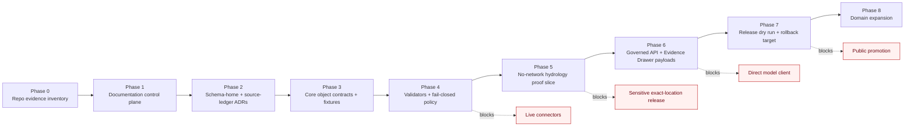

<!-- [KFM_META_BLOCK_V2]
doc_id: kfm://doc/NEEDS_VERIFICATION__foundation_strategy
title: Foundation Strategy
type: standard
version: v1
status: draft
owners: NEEDS_VERIFICATION
created: NEEDS_VERIFICATION
updated: 2026-04-27
policy_label: NEEDS_VERIFICATION
related: [docs/runbooks/foundation-strategy.md, docs/README.md, docs/registers/AUTHORITY_LADDER.md, docs/registers/CANONICAL_LINEAGE_EXPLORATORY.md, docs/intake/IDEA_INTAKE.md, docs/adr/ADR-0001-schema-home.md, docs/adr/ADR-0002-source-ledger-authority.md, docs/architecture/pipeline-lifecycle.md, schemas/contracts/v1/source_descriptor.schema.json, schemas/contracts/v1/evidence_bundle.schema.json, schemas/contracts/v1/runtime_response_envelope.schema.json, policy/publication.rego]
tags: [kfm, runbook, foundation, strategy, governance, evidence, policy, thin-slice]
notes: [Generated from attached KFM doctrine and current-session workspace evidence. Target file existence, owner, created date, policy label, and adjacent repo paths remain NEEDS VERIFICATION because no mounted KFM Git repository was available.]
[/KFM_META_BLOCK_V2] -->

<a id="top"></a>

# Foundation Strategy

Runbook for making Kansas Frontier Matrix governable, testable, evidence-resolving, and reversible before live-source activation, UI expansion, or model-runtime work.


> [!IMPORTANT]
> **Status:** `draft`  
> **Owners:** `NEEDS_VERIFICATION`  
> **Path:** `docs/runbooks/foundation-strategy.md`  
> **Current evidence posture:** attached KFM doctrine is usable; mounted-repo implementation depth is **UNKNOWN** until a real checkout is inspected.  
> **Quick jumps:** [Strategy in one sentence](#strategy-in-one-sentence) · [When to use this runbook](#when-to-use-this-runbook) · [Operating law](#operating-law) · [Foundation sequence](#foundation-sequence) · [First PR](#first-pr) · [Accepted inputs](#accepted-inputs) · [Exclusions](#exclusions) · [Diagram](#diagram) · [File families](#file-families) · [Validation](#validation) · [Rollback](#rollback) · [Open verification backlog](#open-verification-backlog)

> [!NOTE]
> This runbook is not a generic project bootstrap checklist. It is the KFM foundation strategy: preserve the truth path, expose authority, make proof objects executable, and delay broad delivery until the system can prove what it publishes.

---

## Strategy in one sentence

Build KFM from the **governance and proof spine outward**: repo evidence inventory → documentation control plane → source and schema authority → core object contracts → validators and policy gates → one no-network hydrology proof slice → governed API/UI trust payloads → release dry run → domain expansion.

That order exists to prevent the common failure mode: a polished map, assistant, tile bundle, or domain lane that looks useful but cannot reconstruct its claims to evidence, policy posture, review state, release state, and correction lineage.

[Back to top](#top)

---

## When to use this runbook

Use this runbook when a contributor is about to:

- create or revise foundation-level KFM docs, schemas, policies, validators, CI, or registries;
- choose a canonical home for a recurring object family;
- start a first proof-bearing PR after a no-repo or doctrine-only planning phase;
- decide whether a live connector, public UI route, map layer, Focus Mode answer, or release artifact is safe to add;
- resolve drift between strong corpus doctrine and unverified repository reality.

Do **not** use it as a domain-specific data model. Hydrology, soils, fauna, archaeology, roads, settlements, hazards, air, geology, agriculture, people/land, MapLibre, Cesium, and AI lanes still need their own docs and gates.

[Back to top](#top)

---

## Current evidence posture

| Claim | Label | Working interpretation |
|---|---:|---|
| KFM’s governing doctrine is evidence-first, map-first, time-aware, policy-aware, and release-aware. | **CONFIRMED** | Supported by the attached KFM corpus and repeated across the pipeline, documentation, UI, AI, and component-pass materials. |
| The mounted workspace for this drafting session did not expose a real KFM Git repository. | **CONFIRMED** | No implementation behavior, workflow coverage, emitted proof object, route, branch setting, or package manager should be claimed from this session alone. |
| This target file should live at `docs/runbooks/foundation-strategy.md`. | **PROPOSED** | The path was requested and fits the runbook role, but the real repo tree still needs verification. |
| The first implementation wave should be docs/control-plane + schema-home/source-ledger + no-network fixtures, not live data or UI polish. | **PROPOSED** | Strongly aligned with current doctrine and the latest implementation planning corpus. |
| Existing owners, policy label, created date, and adjacent docs are known. | **UNKNOWN** | Use placeholders until the real repo, CODEOWNERS, document registry, and policy labels are inspected. |

[Back to top](#top)

---

## Operating law

| Law | Foundation meaning | Fail-closed outcome |
|---|---|---|
| `RAW -> WORK / QUARANTINE -> PROCESSED -> CATALOG / TRIPLET -> PUBLISHED` | A data or claim path is not trusted until each lifecycle stage has the right evidence and review posture. | Hold in `WORK` or `QUARANTINE`; do not publish. |
| Public clients use governed interfaces | Public UI, Focus Mode, exports, and map popups must not query raw, work, quarantine, or canonical stores directly. | Deny the public path or replace it with a governed API contract. |
| EvidenceRef resolves to EvidenceBundle | Consequential claims must be inspectable. | Runtime answer must `ABSTAIN`, `DENY`, or `ERROR`. |
| Promotion is a governed state transition | Publishing is not a folder move, tile upload, or model response. | Block promotion until manifest, catalog closure, policy, review, and rollback references are complete. |
| AI is interpretive only | Model output cannot become source truth, policy proof, or release approval. | No direct model-client path; no uncited model answer. |
| Derived surfaces are rebuildable | Tiles, vector indexes, search views, summaries, graph projections, stories, and scenes do not replace canonical truth. | Mark as derivative and require evidence/catolog/proof links. |
| Sensitive and rights-unclear material fails closed | Exact locations, living-person data, DNA, archaeology, rare species, cultural material, and critical infrastructure require special care. | Quarantine, redact, generalize, deny, or delay release. |
| Small reversible changes outrank broad rewrites | The foundation should become reviewable one proof-bearing slice at a time. | Re-scope to the smallest PR with explicit rollback. |

[Back to top](#top)

---

## Foundation sequence

| Phase | Goal | Primary outputs | Gate before moving on |
|---:|---|---|---|
| 0 | Inspect the real checkout | repo inventory, branch state, package manager, docs/schema/policy/test/workflow map | No implementation claim without direct evidence. |
| 1 | Create documentation control plane | authority ladder, canon/lineage/exploratory register, idea intake, docs landing links | Source authority is visible and linked. |
| 2 | Resolve schema and source authority | `ADR-0001-schema-home`, `ADR-0002-source-ledger-authority`, source ledger skeleton | No dual schema authority drift. |
| 3 | Establish shared object contracts | SourceDescriptor, EvidenceBundle, PolicyDecision, RuntimeResponseEnvelope, RunReceipt, ReleaseManifest, LayerManifest | Valid and invalid fixtures exist. |
| 4 | Make validators and policy executable | schema validators, evidence validator, source registry validator, deny-by-default policy stubs | Valid fixtures pass; invalid fixtures fail. |
| 5 | Prove one no-network public-safe slice | hydrology HUC12 fixture, EvidenceBundle fixture, no-network validation path | No live fetch, no secrets, no public release. |
| 6 | Define governed API and UI payloads | runtime envelope, Evidence Drawer payload, Focus Mode payload, finite outcomes | Client cannot bypass evidence and policy. |
| 7 | Run release dry run | catalog closure sketch, release manifest fixture, proof-pack shape, rollback target | Promotion is still dry-run only. |
| 8 | Expand domains | lane-specific source descriptors, policies, fixtures, validators, docs | Each lane inherits foundation gates instead of inventing them. |
| 9 | Harden operations | CI gates, platform settings, security boundary, correction drills | Branch protection and deployed behavior verified separately. |

[Back to top](#top)

---

## First PR

The preferred first PR is intentionally small:

**PR-0001 — Documentation Control Plane, Schema-Home ADR, Source Ledger Skeleton, and Hydrology No-Network Fixture**

### Create or update

| Path or family | Status | Purpose |
|---|---:|---|
| `docs/registers/AUTHORITY_LADDER.md` | **PROPOSED** | Make source hierarchy visible. |
| `docs/registers/CANONICAL_LINEAGE_EXPLORATORY.md` | **PROPOSED** | Stop corpus, lineage, and exploratory materials from competing as peers. |
| `docs/intake/IDEA_INTAKE.md` | **PROPOSED** | Give future “New Ideas” a controlled lane. |
| `docs/adr/ADR-0001-schema-home.md` | **PROPOSED** | Resolve `contracts/` versus `schemas/` authority before schema-bearing files spread. |
| `docs/adr/ADR-0002-source-ledger-authority.md` | **PROPOSED** | Define where source records, authority levels, and promotion decisions live. |
| `docs/architecture/pipeline-lifecycle.md` | **PROPOSED** | Explain truth-path stages and promotion boundaries in repo-native form. |
| `schemas/contracts/v1/source_descriptor.schema.json` | **PROPOSED** | Source identity, role, rights, cadence, scope, and validation posture. |
| `schemas/contracts/v1/evidence_bundle.schema.json` | **PROPOSED** | Inspectable support unit for visible claims. |
| `schemas/contracts/v1/runtime_response_envelope.schema.json` | **PROPOSED** | Finite runtime output contract. |
| `schemas/contracts/v1/policy_decision.schema.json` | **PROPOSED** | Policy outcome, reason codes, and fail-closed state. |
| `data/fixtures/hydrology/huc12_public_safe.valid.json` | **PROPOSED** | Public-safe no-network hydrology fixture. |
| `data/fixtures/evidence_bundle/minimal.valid.json` | **PROPOSED** | Minimal positive evidence fixture. |
| `data/fixtures/evidence_bundle/missing_ref.invalid.json` | **PROPOSED** | Negative evidence-resolution fixture. |
| `policy/source_roles.rego` | **PROPOSED** | Source-role denial and admission posture. |
| `policy/sensitivity.rego` | **PROPOSED** | Sensitive-location and rights fail-closed posture. |
| `policy/publication.rego` | **PROPOSED** | Publication gate stub. |
| `tools/validators/validate_json_schema.py` | **PROPOSED** | Repo-native equivalent accepted if Python is not the project validator stack. |
| `tools/validators/validate_evidence_bundle.py` | **PROPOSED** | EvidenceBundle closure check. |
| `tools/validators/validate_source_registry.py` | **PROPOSED** | Source ledger and source descriptor sanity check. |
| `.github/workflows/schema-contracts.yml` | **NEEDS VERIFICATION** | Add only after actual workflow conventions are inspected. |

### Deliberately do not touch

- live connectors;
- real raw data;
- public UI routes;
- production infrastructure;
- model runtime;
- secrets;
- published release paths;
- broad domain expansion;
- branch protection settings without platform access.

[Back to top](#top)

---

## Accepted inputs

The foundation phase accepts only evidence and artifacts that can be reviewed without pretending runtime maturity exists.

| Accepted input | Why it belongs here |
|---|---|
| Workspace/repo inspection transcript | Separates current implementation reality from doctrine. |
| Source authority register or source ledger draft | Prevents strong corpus materials from becoming accidental canon. |
| ADR drafts for schema and source authority | Resolves file-home conflicts before machine contracts multiply. |
| Minimal valid and invalid fixtures | Makes expected behavior executable without live data. |
| Public-safe hydrology fixture | Gives KFM a proof lane without sensitive-location or rights complexity. |
| SourceDescriptor and EvidenceBundle contract drafts | Formalizes the path from source to inspectable claim. |
| Policy stubs with deny reasons | Makes fail-closed behavior concrete early. |
| No-network validator outputs | Keeps first proof reproducible and reviewable. |
| Documentation indexes and registers | Make future expansion navigable and auditable. |

[Back to top](#top)

---

## Exclusions

| Excluded item | Where it goes instead |
|---|---|
| Live source harvesting | Later lane-specific connector PR after SourceDescriptor, rights, cadence, and tests are approved. |
| Production tiles, COGs, PMTiles, or GeoParquet bundles | Release candidate workflow after catalog/proof closure exists. |
| Raw, work, or quarantine data in public paths | Governed lifecycle storage only, with no public client access. |
| Secrets, API keys, credentials, tokens, or private endpoints | Secret manager or deployment configuration outside repo artifacts. |
| Direct browser calls to model runtimes or source APIs | Governed API boundary. |
| Exact sensitive locations | Restricted/steward-reviewed lane with redaction or generalization receipts. |
| “Because the corpus says so” implementation claims | Direct repo evidence, tests, emitted artifacts, logs, or platform settings. |
| Broad UI polish | After Evidence Drawer and Focus Mode payload contracts exist. |
| Emergency/life-safety outputs | Official alerting and emergency systems remain authoritative. KFM may provide contextual evidence only. |

[Back to top](#top)

---

## Diagram



[Back to top](#top)

---

## File families

> [!NOTE]
> File homes below are **PROPOSED** until the real repository is mounted. If the repo already has stronger conventions, adapt through an ADR rather than creating parallel authority.

| Family | Candidate path | Truth role | Human / machine | Update trigger |
|---|---|---|---|---|
| Authority ladder | `docs/registers/AUTHORITY_LADDER.md` | Governs source order and source class meaning. | Human-facing | New source class or authority conflict. |
| Canon register | `docs/registers/CANONICAL_LINEAGE_EXPLORATORY.md` | Separates canon, lineage, exploratory, deprecated, and superseded materials. | Human-facing | New corpus batch or supersession. |
| Idea intake | `docs/intake/IDEA_INTAKE.md` | Converts idea packets into triaged candidates, not automatic canon. | Human-facing | New idea packet or promoted item. |
| Schema-home ADR | `docs/adr/ADR-0001-schema-home.md` | Prevents `contracts/` and `schemas/` drift. | Human-facing | Machine contract location changes. |
| Source-ledger ADR | `docs/adr/ADR-0002-source-ledger-authority.md` | Defines source registry authority and update obligations. | Human-facing | Source ledger or registry placement change. |
| Pipeline lifecycle | `docs/architecture/pipeline-lifecycle.md` | Explains lifecycle states and promotion seams. | Human-facing | Lifecycle, promotion, or release-state change. |
| Source contract | `schemas/contracts/v1/source_descriptor.schema.json` | Defines source admission shape. | Machine-readable | New source class or source role. |
| Evidence contract | `schemas/contracts/v1/evidence_bundle.schema.json` | Defines inspectable support bundle. | Machine-readable | EvidenceRef/EvidenceBundle resolver changes. |
| Runtime envelope | `schemas/contracts/v1/runtime_response_envelope.schema.json` | Defines finite response outcomes and citation state. | Machine-readable | API or Focus Mode output changes. |
| Policy decision | `schemas/contracts/v1/policy_decision.schema.json` | Defines deny/allow/hold outcomes and reason codes. | Machine-readable | Policy gate shape changes. |
| Receipts | `data/receipts/` | Records process memory and replay context. | Both | Ingest, transform, validation, review, or dry-run execution. |
| Proofs | `data/proofs/` | Records release-significant proof packs and attestations. | Both | Release candidate or promotion dry run. |
| Catalog closure | `data/catalog/` | Holds STAC/DCAT/PROV closure artifacts where repo convention confirms. | Both | Dataset version or release candidate. |
| Policies | `policy/` | Encodes source-role, rights, sensitivity, and publication gates. | Machine-readable + reviewed prose | New gate or deny reason. |
| Validators | `tools/validators/` | Makes contracts executable. | Machine-readable | New schema, fixture, policy, or release gate. |
| Tests and fixtures | `tests/` and `data/fixtures/` | Proves valid and invalid cases. | Machine-readable | Any contract, policy, validator, or runtime output change. |
| Workflows | `.github/workflows/` | Thin orchestration only; business logic stays in tools/validators. | Machine-readable | CI convention verified and validator suite ready. |

[Back to top](#top)

---

## Runtime boundaries

The foundation phase must keep these runtime boundaries visible even before implementation:

| Surface | Allowed in foundation phase | Blocked in foundation phase |
|---|---|---|
| Governed API | Contract sketches, finite outcomes, no-network fixtures. | Public route claiming live production behavior. |
| Evidence Drawer | Payload contract, minimal fixture, resolver expectations. | Drawer populated from raw stores or browser-side source joins. |
| Focus Mode | `ANSWER`, `ABSTAIN`, `DENY`, `ERROR` envelope design. | Uncited model answers or direct browser-to-model calls. |
| MapLibre shell | LayerManifest and Evidence Drawer payload design. | Trust-bearing client computation or direct source API calls. |
| Release | Dry-run manifest and rollback target shape. | Public promotion, production publish, or signed-release claims without proof. |
| Domain lanes | Hydrology public-safe no-network fixture. | Broad domain activation or sensitive exact-location outputs. |

[Back to top](#top)

---

## Validation

> [!WARNING]
> Commands below are starter checks for a real checkout. Do not treat them as proof until they run in the target repository and their outputs are reviewed.

### Phase 0 inspection

```bash
git status --short
git branch --show-current
git rev-parse --show-toplevel

find .github docs contracts schemas policy data tools tests apps packages infra release \
  -maxdepth 3 -type f 2>/dev/null | sort
```

### Foundation document checks

```bash
# Use repo-native doc tooling if present.
python tools/docs/check_doc_structure.py docs/runbooks/foundation-strategy.md
```

### Schema and fixture checks

```bash
# Use repo-native validator equivalents if Python is not the project stack.
python tools/validators/validate_json_schema.py \
  schemas/contracts/v1/source_descriptor.schema.json \
  data/fixtures/source_descriptor/minimal.valid.json

python tools/validators/validate_json_schema.py \
  schemas/contracts/v1/evidence_bundle.schema.json \
  data/fixtures/evidence_bundle/minimal.valid.json
```

### Evidence resolution checks

```bash
python tools/validators/validate_evidence_bundle.py \
  data/fixtures/evidence_bundle/minimal.valid.json

python tools/validators/validate_evidence_bundle.py \
  data/fixtures/evidence_bundle/missing_ref.invalid.json
```

### Policy checks

```bash
# Run only if the repo uses OPA/Rego or an equivalent policy engine.
opa test policy
```

### No-public-bypass checks

```bash
# Replace with repo-native grep/ripgrep policy if available.
grep -RInE "raw/|work/|quarantine/|localhost:11434|source api|direct model" \
  apps web ui packages docs 2>/dev/null || true
```

### Definition of done

- [ ] Real checkout inspected and evidence boundary recorded.
- [ ] Target file owner and policy label verified or explicitly left as placeholders.
- [ ] Authority ladder and canon/register docs exist or are queued before broader docs expansion.
- [ ] Schema-home ADR exists before schema-bearing files multiply.
- [ ] Source-ledger authority ADR exists before source descriptors are admitted.
- [ ] Valid and invalid fixtures exist for core contracts.
- [ ] Validators prove at least one positive and one negative case.
- [ ] Policy stubs include explicit deny reasons.
- [ ] No live connector, raw data, public route, model runtime, secret, or production release is touched.
- [ ] Rollback is a PR revert with no data migration or public withdrawal requirement.

[Back to top](#top)

---

## Rollback

The foundation PR should be reversible by design.

| Failure | Immediate action | Rollback path |
|---|---|---|
| Existing repo convention conflicts with proposed paths | Stop and write/update ADR before adding files. | Revert proposed path additions; keep inventory notes. |
| Schema-home ambiguity remains unresolved | Do not create parallel schemas. | Revert schema files; keep ADR draft. |
| Validator fails valid fixture | Fix schema/fixture mismatch before widening. | Revert validator or fixture changes. |
| Invalid fixture passes | Tighten schema/policy before merge. | Revert schema/policy change if blocker cannot be fixed. |
| Source rights or sensitivity unclear | Hold source descriptors inactive. | Quarantine or remove source candidate from PR. |
| Public path can reach raw/work/quarantine/canonical store | Block route or remove public binding. | Revert route/UI integration. |
| Model runtime path bypasses governed API | Remove direct model path. | Revert runtime integration. |
| PR grows beyond foundation scope | Split into follow-up PRs. | Keep control-plane files only; revert broad expansion. |

[Back to top](#top)

---

## Risk register

| Risk | Why it matters | Mitigation |
|---|---|---|
| Authority collision | Strong docs can compete as apparent peers. | Authority ladder, canon register, lineage archive. |
| Schema drift | Lanes may invent incompatible receipt, evidence, and envelope shapes. | Schema-home ADR and shared contract wave. |
| Premature live connectors | Source terms, cadence, rights, and sensitivity may be unverified. | Inactive SourceDescriptors and no-network fixtures first. |
| UI bypass | A map can look authoritative while skipping evidence and policy. | Governed API, Evidence Drawer, finite runtime envelopes. |
| AI overreach | Generated language may appear as truth. | EvidenceBundle-first retrieval and cite-or-abstain behavior. |
| Sensitive-location leakage | Exact coordinates can create real-world harm. | Fail-closed policy, redaction/generalization receipts, staged access. |
| Runtime maturity overclaim | Docs may outrun tests, workflows, or branch settings. | Truth labels and direct repo/platform verification. |
| Scope burst | Broad rewrites hide uncertainty and are hard to review. | Small reversible PRs with explicit exclusions. |

[Back to top](#top)

---

## Open verification backlog

| Item | Status | How to close |
|---|---:|---|
| Does `docs/runbooks/foundation-strategy.md` already exist in the target repo? | **UNKNOWN** | Mount repo and inspect path. |
| Who owns `docs/runbooks/`? | **UNKNOWN** | Check `CODEOWNERS`, docs registry, and team conventions. |
| What policy label applies? | **UNKNOWN** | Check document registry or policy-label standard. |
| Is `schemas/contracts/v1/` canonical? | **NEEDS VERIFICATION** | Resolve with `ADR-0001-schema-home.md`. |
| Are contracts and schemas already split by convention? | **UNKNOWN** | Inspect `contracts/README.md`, `schemas/README.md`, fixtures, and validators. |
| Does the repo use Python, Node, Go, or another validator stack? | **UNKNOWN** | Inspect package files and existing tools. |
| Are workflow YAML files present and merge-blocking? | **UNKNOWN** | Inspect `.github/workflows/` and platform branch rules. |
| Are proof objects already emitted anywhere? | **UNKNOWN** | Search `data/receipts/`, `data/proofs/`, release artifacts, and CI outputs. |
| Is hydrology already the active proof lane? | **PROPOSED / NEEDS VERIFICATION** | Inspect hydrology fixtures, tests, schemas, and runbooks. |
| Are Evidence Drawer and Focus Mode implemented? | **UNKNOWN** | Inspect UI/API surfaces and runtime tests. |
| Are branch protections, secrets, reverse proxy, and VPN posture configured? | **UNKNOWN** | Verify platform and deployment settings outside repo docs. |

[Back to top](#top)

---

## Appendix: truth labels

<details>
<summary>Truth-label usage in this runbook</summary>

| Label | Use |
|---|---|
| **CONFIRMED** | Verified in this session from attached documents, visible workspace evidence, or direct inspection. |
| **INFERRED** | Strongly implied by doctrine or adjacent evidence, but not directly verified as implementation. |
| **PROPOSED** | Recommended design, file, schema, process, or sequence not proven present in the real repo. |
| **UNKNOWN** | Not verifiable without mounted repo, logs, workflows, dashboards, runtime traces, branch settings, or owner registry. |
| **NEEDS VERIFICATION** | Specific check required before merge, activation, or public release. |

</details>

[Back to top](#top)
