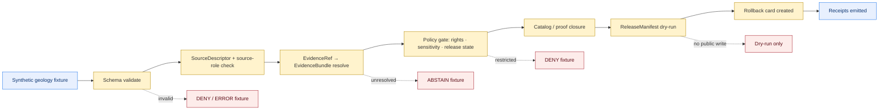
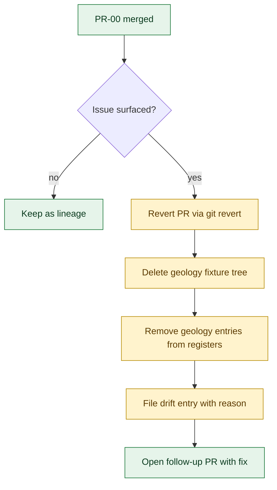

<!-- [KFM_META_BLOCK_V2]
doc_id: kfm://doc/geology-no-network-test-runbook
title: Geology & Natural Resources — No-Network Test Runbook
type: standard
version: v0.1
status: draft
owners: <Geology lane subsystem owner> + <Docs steward> + <QA owner> (PROPOSED: fill in from CODEOWNERS once verified)
created: 2026-05-12
updated: 2026-05-12
policy_label: public
related:
  - docs/runbooks/README.md
  - docs/domains/geology/README.md
  - docs/doctrine/directory-rules.md
  - docs/doctrine/lifecycle-law.md
  - docs/doctrine/trust-membrane.md
  - docs/architecture/contract-schema-policy-split.md
  - docs/adr/ADR-0001-schema-home.md
  - schemas/contracts/v1/domains/geology/
  - fixtures/domains/geology/
  - tests/domains/geology/
  - policy/domains/geology/
tags: [kfm, runbook, geology, no-network, fixtures, validation, governance]
notes:
  - All paths are PROPOSED until mounted-repo evidence confirms each one.
  - Validator names, package manager, and command shell are UNKNOWN this session.
  - Runbook intentionally describes a deterministic, offline slice — the lowest-trust starting move.
[/KFM_META_BLOCK_V2] -->

# 🪨 Geology & Natural Resources — No-Network Test Runbook

> Procedure for running KFM's first deterministic, offline test slice against the Geology / Natural Resources lane — proving the trust spine end-to-end **without any live source, network call, public data, or release surface**.

[](#)
[](#)
[](#)
[](#)
[](#)
[](#)
<!-- TODO: replace with real Shields.io endpoints (CI status, license, last-updated) once repo wiring is verified. -->

| Field | Value |
|---|---|
| **Status** | `draft` — PROPOSED implementation, CONFIRMED doctrine |
| **Owners** | *Geology lane subsystem owner* + *Docs steward* + *QA owner* (PROPOSED — confirm via `CODEOWNERS`) |
| **Last updated** | 2026-05-12 |
| **Runbook class** | Validation run (no-network fixture slice) |
| **Lifecycle phase exercised** | RAW (fixture) → WORK → CATALOG / TRIPLET → PUBLISHED candidate (dry-run only) |
| **Trust posture** | cite-or-abstain · deny-by-default · finite outcomes (ANSWER / ABSTAIN / DENY / ERROR) |
| **Reversibility** | Fully reversible — revert PR, delete fixtures, no public effect |

---

## Quick jump

- [1. Purpose](#1-purpose)
- [2. Scope & non-goals](#2-scope--non-goals)
- [3. Truth posture (what is verifiable here)](#3-truth-posture-what-is-verifiable-here)
- [4. Prerequisites](#4-prerequisites)
- [5. End-to-end flow](#5-end-to-end-flow)
- [6. Fixture inventory](#6-fixture-inventory)
- [7. Validation commands (illustrative)](#7-validation-commands-illustrative)
- [8. Acceptance gates](#8-acceptance-gates)
- [9. Expected finite outcomes per fixture class](#9-expected-finite-outcomes-per-fixture-class)
- [10. Failure modes & triage](#10-failure-modes--triage)
- [11. Rollback path](#11-rollback-path)
- [12. Sensitivity guardrails](#12-sensitivity-guardrails)
- [13. Related docs](#13-related-docs)
- [14. Open verification items](#14-open-verification-items)
- [Appendix A — Geology object families (reference)](#appendix-a--geology-object-families-reference)
- [Appendix B — Geology source families (reference)](#appendix-b--geology-source-families-reference)

---

## 1. Purpose

This runbook describes how to execute the **first deterministic, no-network slice** of KFM tests for the **Geology & Natural Resources** domain. It binds:

- a small, synthetic fixture set (one `SourceDescriptor`, one `EvidenceBundle`, one `LayerManifest`, one `ReleaseManifest`, and **one geology object** — e.g., a generalized `GeologicUnit` polygon) to
- the canonical KFM validator chain (schema → source role → evidence → policy → release → rollback), running entirely **offline**.

It is the geology lane's instantiation of the project-wide **PR-00 no-network fixture** template:

> **PR-00 (CONFIRMED doctrine):** *Create synthetic fixtures for SourceDescriptor, EvidenceBundle, LayerManifest, ReleaseManifest and one [domain] object. Acceptance: Fixture validation passes; no network access. Rollback: revert PR.*

The runbook does **not** decide what fixtures should mean, what schemas should require, or what policies should deny. Those decisions live in `contracts/`, `schemas/`, and `policy/`. The runbook only describes **how to run and gate the offline proof** that those decisions are enforceable for geology.

> [!IMPORTANT]
> The geology lane carries elevated sensitivity. Exact borehole, well-log, sample, private-well, and sensitive-resource locations **must never** appear in fixtures, even as test data. Public-safe generalized geometry is the only admissible form here. See [§12](#12-sensitivity-guardrails).

[Back to top ↑](#-geology--natural-resources--no-network-test-runbook)

---

## 2. Scope & non-goals

### In scope

- Synthetic, deterministic geology fixtures kept under fixture roots (no live KGS / USGS / KCC fetches).
- Schema validation, source-role validation, evidence closure, policy negative tests, and release / rollback dry-run for one geology object.
- One `EvidenceDrawerPayload`-style projection (PROPOSED) to prove the public-side trust path without exposing a public surface.
- A reversible PR matching the PR-00 acceptance template.

### Out of scope (deferred to later PRs)

| Out of scope here | Belongs in |
|---|---|
| Live connector to KGS, USGS NGMDB / GeMS, KCC, WWC5, MRDS | A later domain-lane connector PR (after rights + source-role policy land) |
| Cross-section generation, borehole correlation, hydrostratigraphy linkage | Geology analytical functions PR, after proof-lane slice |
| 3D subsurface scene, Cesium adapter | 3D / Planetary lane, conditional on 2D proof passing |
| Focus Mode answers grounded in geology evidence | Governed-AI runbook after MockAdapter slice |
| Real source rights review, signed release attestation | Rights & release lanes; record `NEEDS VERIFICATION` until inspected |

> [!NOTE]
> The point of PR-00 is to be **deliberately boring**. If a feature is exciting, it is almost certainly out of scope for this runbook.

[Back to top ↑](#-geology--natural-resources--no-network-test-runbook)

---

## 3. Truth posture (what is verifiable here)

| Item | Label | Why |
|---|---|---|
| KFM doctrine (lifecycle, cite-or-abstain, trust membrane, finite outcomes, deny-by-default) | **CONFIRMED** | Established across `kfm_encyclopedia`, `KFM_Unified_Implementation_Architecture_Build_Manual`, and `directory-rules.md`. |
| Geology domain mission, source families, object families, sensitivity posture | **CONFIRMED** doctrine / **PROPOSED** implementation | DOM-GEOL §§7.8 and Geology lane atlas. |
| `docs/runbooks/<domain>/...` as the proper home for this file | **CONFIRMED** (Directory Rules §6.1, §12) | `docs/runbooks/` is canonical; domain appears as a segment, not a root. |
| Concrete paths under `schemas/contracts/v1/domains/geology/`, `fixtures/domains/geology/`, `policy/domains/geology/`, `tests/domains/geology/` | **PROPOSED** | Default per ADR-0001 and Directory Rules §12; mounted-repo confirmation outstanding. |
| Validator binary names, package manager, language, command shell | **UNKNOWN** | No mounted repo this session. Commands in [§7](#7-validation-commands-illustrative) are illustrative. |
| Real source rights (KGS, USGS, KCC, KDHE) | **NEEDS VERIFICATION** | DOM-GEOL marks rights/terms NEEDS VERIFICATION; do not assume any redistribution class. |
| The geology lane has zero current implementation in the repo | **UNKNOWN** | Not asserted either way — verify before claiming. |

> [!CAUTION]
> Do **not** copy any path, command, or validator name from this runbook into a PR without first checking it against current repo evidence. The runbook is doctrinally correct; the specifics are PROPOSED.

[Back to top ↑](#-geology--natural-resources--no-network-test-runbook)

---

## 4. Prerequisites

### 4.1 Doctrinal prerequisites (CONFIRMED)

The following must already be in force, by doctrine, before PR-00 can be meaningful:

- The lifecycle invariant is recognized: **RAW → WORK / QUARANTINE → PROCESSED → CATALOG / TRIPLET → PUBLISHED**, with promotion as a governed state transition.
- The trust membrane discipline is recognized: public clients never read RAW / WORK / QUARANTINE / unpublished candidates; they read released artifacts via the governed API.
- Finite runtime outcomes are recognized: **ANSWER · ABSTAIN · DENY · ERROR**.
- Cite-or-abstain is the default truth posture: a claim without a resolvable `EvidenceBundle` abstains; an unreviewed claim does not publish.

### 4.2 Implementation prerequisites (PROPOSED — verify before running)

- [ ] `schemas/contracts/v1/` is the live machine-schema authority (per ADR-0001). If `contracts/<domain>/*.schema.json` is also present and divergent, raise it as a drift entry **before** adding geology fixtures.
- [ ] `policy/` is the singular canonical policy root (per Directory Rules §6.5). If `policies/` exists too, declare it `mirror` / `legacy` before this run lands.
- [ ] Geology lane segments exist or will be created in the same PR with per-folder READMEs:
  - `schemas/contracts/v1/domains/geology/`
  - `policy/domains/geology/`
  - `tests/domains/geology/`
  - `fixtures/domains/geology/` *or* `tests/fixtures/domains/geology/` — **one** authority, not both.
- [ ] No CI job in this PR makes outbound network calls. If sandboxing is unavailable, document the constraint and use a `--no-network` flag or equivalent.
- [ ] No real source credentials, no real borehole / well-log coordinates, no proprietary log data enter the fixture tree under any path.

### 4.3 Environmental prerequisites

| Need | Why | Status |
|---|---|---|
| Deterministic JSON canonicalizer (RFC 8785 / JCS) | Stable `spec_hash` across machines and languages | NEEDS VERIFICATION — confirm tool choice |
| SHA-256 hashing for artifact / spec digests | Identity and rollback verification | CONFIRMED doctrine |
| Schema validator (e.g., JSON Schema 2020-12 capable) | Schema gate | NEEDS VERIFICATION — confirm validator implementation |
| Policy runtime (e.g., OPA / Conftest or equivalent) | Negative policy fixtures and deny tests | NEEDS VERIFICATION — confirm engine |
| Repo test runner | Orchestrates the validator chain | UNKNOWN — confirm |

[Back to top ↑](#-geology--natural-resources--no-network-test-runbook)

---

## 5. End-to-end flow

The runbook walks one fixture through the trust spine and proves each gate is enforceable offline.



<!-- Diagram is illustrative; PROPOSED node names match doctrinal validator chain. NEEDS VERIFICATION once repo wiring exists. -->

The forward path (`A → I`) is the **happy path**: one valid fixture passes every gate, emits receipts, dry-runs a release, and produces a rollback card — without writing to any public surface. The negative branches (`X / Y / Z / P`) are required by KFM's negative-fixture rule: *every major object family should have at least one valid fixture, one invalid fixture, one denied fixture, one abstention fixture, and one rollback or correction fixture* (CONFIRMED doctrine).

[Back to top ↑](#-geology--natural-resources--no-network-test-runbook)

---

## 6. Fixture inventory

The minimum geology PR-00 set. All fixtures are **synthetic**, **public-safe**, and **bear no real spatial coordinates of any actual sensitive feature**.

### 6.1 Core PR-00 fixtures (required)

| Fixture | Class | Object | Purpose | Expected outcome |
|---|---|---|---|---|
| `geology__source_descriptor.valid.json` | valid | `SourceDescriptor` | Synthetic geology source with declared role, rights class, sensitivity, freshness | passes schema + source-role gates |
| `geology__source_descriptor.unknown_rights.invalid.json` | invalid | `SourceDescriptor` | Unknown rights status | `DENY` at rights gate |
| `geology__evidence_bundle.valid.json` | valid | `EvidenceBundle` | Resolves a single `EvidenceRef`; supports one generalized geologic unit claim | passes evidence closure |
| `geology__evidence_bundle.missing.invalid.json` | abstention | `EvidenceBundle` | `EvidenceRef` points to nothing resolvable | `ABSTAIN` at evidence gate; `DENY` if published |
| `geology__layer_manifest.public_safe.valid.json` | valid | `LayerManifest` | Generalized bedrock-unit tile layer descriptor | passes catalog closure |
| `geology__release_manifest.dry_run.valid.json` | valid | `ReleaseManifest` | Dry-run only — no public write | passes release dry-run gate |
| `geology__geologic_unit.public_safe.valid.json` | valid | `GeologicUnit` (generalized) | One generalized unit polygon with uncertainty and source-role badges | passes domain-specific gates |
| `geology__geologic_unit.exact_borehole.denied.json` | denied | `Borehole`-shaped | Carries exact coordinates of a synthetic "private well" | `DENY` at sensitivity gate |
| `geology__rollback_card.dry_run.valid.json` | rollback | `RollbackCard` | Rollback target for the dry-run release | passes rollback drill |

### 6.2 Required fixture-class coverage (CONFIRMED doctrine)

Per the project test posture, **every major object family** present in this slice must satisfy:

```text
valid · invalid · denied · abstention · rollback-or-correction
```

If any of the five is missing for a fixture family, PR-00 is not yet complete for that family.

### 6.3 PROPOSED fixture homes

```text
fixtures/domains/geology/
├── README.md
├── valid/
│   ├── geology__source_descriptor.valid.json
│   ├── geology__evidence_bundle.valid.json
│   ├── geology__layer_manifest.public_safe.valid.json
│   ├── geology__release_manifest.dry_run.valid.json
│   └── geology__geologic_unit.public_safe.valid.json
├── invalid/
│   ├── geology__source_descriptor.unknown_rights.invalid.json
│   └── geology__evidence_bundle.missing.invalid.json
└── denied/
    └── geology__geologic_unit.exact_borehole.denied.json
```

> [!NOTE]
> Whether root `fixtures/domains/geology/` or `tests/fixtures/domains/geology/` is canonical is **NEEDS VERIFICATION** per Directory Rules §6.6. Pick one and declare the rule in both READMEs. Do not create both.

[Back to top ↑](#-geology--natural-resources--no-network-test-runbook)

---

## 7. Validation commands (illustrative)

> [!WARNING]
> Commands below are **illustrative**. The exact validator names, package manager, language, and shell are **UNKNOWN** until the mounted repo is inspected. Use them as the *shape* of the run, not the literal call. Replace each with the verified command before relying on it in CI.

### 7.1 Linear execution (developer / local)

```bash
# 1. Schema gate — JSON Schema 2020-12 validation of every fixture
<repo-schema-validator> \
  --schema-root schemas/contracts/v1/ \
  --fixtures   fixtures/domains/geology/ \
  --no-network

# 2. Source-role gate — confirm declared role matches source authority register
<repo-source-role-validator> \
  --register control_plane/source_authority_register.yaml \
  --fixtures fixtures/domains/geology/valid/ \
            fixtures/domains/geology/invalid/

# 3. Evidence closure — every EvidenceRef in valid fixtures resolves; missing bundle abstains
<repo-evidence-validator> \
  --bundles fixtures/domains/geology/valid/ \
  --abstain-on-missing

# 4. Policy negative suite — denied / restricted / unknown-rights fixtures must fail closed
<repo-policy-runner> \
  --bundle policy/domains/geology/ \
  --input  fixtures/domains/geology/denied/ \
           fixtures/domains/geology/invalid/ \
  --expect deny

# 5. Catalog + release dry-run — no writes to data/published/ or release/
<repo-release-dry-run> \
  --manifest fixtures/domains/geology/valid/geology__release_manifest.dry_run.valid.json \
  --no-public-write

# 6. Rollback drill — apply the rollback card against the dry-run release
<repo-rollback-drill> \
  --card fixtures/domains/geology/valid/geology__rollback_card.dry_run.valid.json \
  --dry-run
```

### 7.2 What success looks like

- All steps exit `0` for valid fixtures.
- Steps 1–4 emit **non-zero** for invalid / denied / abstention fixtures **with the expected reason class** (e.g., `schema_invalid`, `unknown_rights`, `evidence_missing`, `sensitivity_restricted`).
- No outbound network call is recorded (verify via egress proxy logs or `--no-network` enforcement).
- Receipts (`RunReceipt`, `ValidationReport`, `DecisionEnvelope`) are emitted to the configured receipts location and are **deterministic** — re-running the suite produces the same `spec_hash` for the same input.

> [!TIP]
> Run the suite twice on a clean checkout. If a `spec_hash` rotates between runs without an input change, that is a **NormalizationError.nondeterministic_serialization** — fix the canonicalizer before relying on the receipts.

[Back to top ↑](#-geology--natural-resources--no-network-test-runbook)

---

## 8. Acceptance gates

PR-00 for geology is **only** accepted when every box below is checked. PROPOSED commands MUST be verified before merge.

- [ ] All geology fixtures live under one fixture authority (no duplicate fixture homes).
- [ ] Every fixture is **synthetic** and carries **no real sensitive coordinates** (boreholes, private wells, sensitive deposits, exact extraction sites).
- [ ] Schema gate passes for every valid fixture; fails for every invalid fixture with a typed schema error.
- [ ] Source-role gate denies unknown / unmapped source roles.
- [ ] Evidence closure: every valid `EvidenceRef` resolves to its `EvidenceBundle`; missing bundle path returns `ABSTAIN` and the published path returns `DENY`.
- [ ] Policy negative suite returns `DENY` for: unknown rights, restricted sensitivity, missing release state, source-role mismatch, exact-sensitive-geometry fixture.
- [ ] Catalog / proof closure rejects an incomplete bundle.
- [ ] Release dry-run completes **without** writing to `data/published/` or `release/manifests/` outside the dry-run target.
- [ ] Rollback drill emits a `RollbackCard` whose target restores the prior release manifest cleanly.
- [ ] Receipts are deterministic across two consecutive runs.
- [ ] CI run records **zero** outbound network calls.
- [ ] PR body cites the Directory Rules sections that justify every placement (§6.1, §6.6, §12 at minimum).
- [ ] Drift entry filed in `docs/registers/DRIFT_REGISTER.md` if anything in the mounted repo conflicts with this runbook.

[Back to top ↑](#-geology--natural-resources--no-network-test-runbook)

---

## 9. Expected finite outcomes per fixture class

KFM's runtime envelope returns one of **ANSWER · ABSTAIN · DENY · ERROR**. PR-00 must demonstrate all four are reachable from geology fixtures.

| Fixture class | Expected outcome | Reason class (illustrative) |
|---|---|---|
| Valid `SourceDescriptor` + `EvidenceBundle` + generalized `GeologicUnit` | `ANSWER` | — |
| Missing `EvidenceBundle` for a declared `EvidenceRef` | `ABSTAIN` | `evidence_missing` |
| Unknown rights status on `SourceDescriptor` | `DENY` | `rights_unknown` |
| Restricted sensitivity (exact borehole geometry) | `DENY` | `sensitivity_restricted` |
| Source-role mismatch (observation source used as authority) | `DENY` | `source_role_mismatch` |
| Schema invalid fixture | `ERROR` | `schema_invalid` |
| Hash drift between `EvidenceRef.spec_hash` and `EvidenceBundle.spec_hash` | `DENY` | `hash_mismatch` |
| Non-deterministic serialization | `ERROR` | `normalization_nondeterministic` |

> [!IMPORTANT]
> A passing PR-00 is one where **every row above is reached by at least one fixture**. A suite where only `ANSWER` is reached has not exercised the trust spine.

[Back to top ↑](#-geology--natural-resources--no-network-test-runbook)

---

## 10. Failure modes & triage

<details>
<summary><b>Click to expand the triage table</b></summary>

| Symptom | Likely cause | Action |
|---|---|---|
| Schema gate passes a fixture that should fail | Schema home divergence — `contracts/<x>.schema.json` vs `schemas/contracts/v1/...` | Stop. File a drift entry. Resolve per ADR-0001 before continuing. |
| `EvidenceBundle` resolves on a fixture that should abstain | Catalog index keying on a mutable path rather than `spec_hash` | Re-key by `spec_hash` first, `bundle_id` second. Catalog rule from project doctrine. |
| Restricted-sensitivity fixture passes policy gate | Policy bundle missing the geology sensitivity module | Add `policy/domains/geology/sensitivity.rego` (or equivalent); re-run negative suite. |
| Receipts differ between two runs on identical input | Non-deterministic JSON serialization | Canonicalize per RFC 8785 / JCS. Confirm hash algo tag is `sha256`. |
| Release dry-run writes to `data/published/` | Promotion path bypassed validators | Halt. Drift §13.2 violation. Treat as governance incident; revert PR. |
| Rollback drill cannot restore prior manifest | Rollback target not captured before dry-run release | Block PR. The runbook's invariant is that **every** release has a rollback target. |
| CI run logs any outbound DNS / TCP | Network discipline broken in fixture or validator | Halt PR. Find the egress; pin or remove. No public release path until offline-clean. |
| Geology fixture carries a real well / borehole coordinate | Sensitive-data leak into fixtures | **Security incident** per `docs/runbooks/SENSITIVE_DATA_INCIDENT.md` (PROPOSED). Rotate, audit, scrub history. |

</details>

[Back to top ↑](#-geology--natural-resources--no-network-test-runbook)

---

## 11. Rollback path

PR-00 is **fully reversible** by design. There is no public surface, no release alias, no canonical mutation. Rollback is mechanical.



### Rollback steps

1. **Revert the PR** under git. History is preserved.
2. **Delete the geology fixture tree** if it landed at a path that is now disputed.
3. **Remove geology entries** from any register that was updated in this PR (`docs/registers/VERIFICATION_BACKLOG.md`, `docs/registers/CANONICAL_LINEAGE_EXPLORATORY.md`, etc.).
4. **File a drift entry** in `docs/registers/DRIFT_REGISTER.md` describing what failed and why.
5. **Open a corrective PR** that addresses the issue and re-runs this runbook from §5.

There is no public effect to undo. There are no consumer-facing artifacts to withdraw. There is no `CorrectionNotice` because there was no released claim.

[Back to top ↑](#-geology--natural-resources--no-network-test-runbook)

---

## 12. Sensitivity guardrails

The geology lane is **not** an unconditionally safe public domain. The project's sensitivity posture is unambiguous:

> [!CAUTION]
> *Exact borehole, sample, sensitive resource, well-log, and private well locations default to **restricted or generalized public geometry**. Occurrence, deposit, estimate, permit, production, and reserve claims must remain distinct. Unclear rights, unresolved source role, missing evidence, unresolved sensitivity, or absent release state **blocks** public promotion.* — CONFIRMED doctrine (DOM-GEOL · ENCY)

For PR-00 specifically:

- Fixtures **must not** carry coordinates copied from real KGS WWC5, KGS LAS, KCC, USGS MRDS, or any other real source. Use synthetic numeric stand-ins.
- Fixture file names and field values must **not** include identifiable operator, lessee, or landowner names.
- The `denied` fixture that exercises "exact borehole geometry" must use **synthetic** coordinates clearly marked as test data (e.g., outside any inhabited area, with a `"synthetic": true` flag).
- The runbook explicitly forbids using `data/raw/geology/...` as a fixture source. RAW data is captured under source-role discipline, not as test material.

If any of these guardrails are violated, treat it as a sensitive-data incident, not a test bug.

[Back to top ↑](#-geology--natural-resources--no-network-test-runbook)

---

## 13. Related docs

- `docs/runbooks/README.md` — runbook index and ops conventions <!-- TODO: confirm presence -->
- `docs/domains/geology/README.md` — geology domain semantics, source families, object families <!-- TODO: confirm presence -->
- `docs/doctrine/directory-rules.md` — path placement authority (§6.1, §6.6, §12)
- `docs/doctrine/lifecycle-law.md` — RAW → … → PUBLISHED invariant
- `docs/doctrine/trust-membrane.md` — public path discipline
- `docs/adr/ADR-0001-schema-home.md` — schema-home rule (`schemas/contracts/v1/...`)
- `docs/architecture/contract-schema-policy-split.md` — meaning / shape / admissibility split
- `schemas/contracts/v1/domains/geology/` — machine schemas for geology objects (PROPOSED)
- `policy/domains/geology/` — geology admissibility policy (PROPOSED)
- `fixtures/domains/geology/` *or* `tests/fixtures/domains/geology/` — geology fixtures (one authority, PROPOSED)
- `docs/registers/DRIFT_REGISTER.md` — file drift entries here when this runbook conflicts with the mounted repo

[Back to top ↑](#-geology--natural-resources--no-network-test-runbook)

---

## 14. Open verification items

These must be resolved by inspection or ADR before this runbook can be promoted from `draft` to `published`.

- [ ] Confirm `schemas/contracts/v1/` is in use as the machine-schema authority (ADR-0001) and `contracts/<domain>/*.schema.json` is **not** also active.
- [ ] Confirm `policy/` is the singular policy root; declare `policies/` (if present) as `mirror` / `legacy`.
- [ ] Confirm whether root `fixtures/` or `tests/fixtures/` is canonical and document the rule in both READMEs.
- [ ] Verify the actual repo test runner, schema validator, policy engine, and canonicalizer; replace illustrative commands in §7 with verified calls.
- [ ] Verify `docs/runbooks/<domain>/<RUNBOOK>.md` vs `docs/runbooks/<domain>_<RUNBOOK>.md` naming — prior expansion reports used the flat form (e.g., `docs/runbooks/ui_VALIDATION.md`); this file uses the subdirectory form per Domain Placement Law (§12). Reconcile via ADR or per-folder README.
- [ ] Verify owner names against `CODEOWNERS`.
- [ ] Confirm a `docs/runbooks/SENSITIVE_DATA_INCIDENT.md` exists (or create it) before §10 / §12 can reference it as live procedure.
- [ ] Confirm CI can enforce `--no-network` (sandbox, egress proxy, or equivalent).

[Back to top ↑](#-geology--natural-resources--no-network-test-runbook)

---

## Appendix A — Geology object families (reference)

<details>
<summary><b>Click to expand object family list (CONFIRMED domain, PROPOSED schema realization)</b></summary>

From DOM-GEOL / KFM encyclopedia / Culmination Atlas:

- `GeologicUnit`
- `SurficialUnit`
- `Lithology`
- `StratigraphicInterval`
- `GeologicAge`
- `StructureFeature` / `FaultStructure`
- `GeologyBoundaryVersion`
- `BoreholeReference` *(sensitive — generalized only in public surfaces)*
- `WellLogReference` *(sensitive — generalized only)*
- `CoreSample`
- `GeophysicalObservation`
- `GeochemistrySampleReference`
- `MineralOccurrence`
- `ResourceDeposit`
- `ResourceEstimate` *(distinct from occurrence — must not collapse)*
- `ExtractionSite` *(sensitive)*
- `ReclamationRecord`
- `CrossSection`
- `HydrostratigraphicUnit` *(cross-lane with hydrology — geology owns)*

**Anti-collapse rule (CONFIRMED doctrine):** occurrence, deposit, estimate, permit, production, and reserve claims **must remain distinct**. PR-00 fixtures should not blur these.

</details>

---

## Appendix B — Geology source families (reference)

<details>
<summary><b>Click to expand source family list (CONFIRMED roles, NEEDS VERIFICATION rights)</b></summary>

From DOM-GEOL / Culmination Atlas. Roles are `authority / observation / context / model` — actual role depends on the use.

| Source family | Role band | Rights | Freshness |
|---|---|---|---|
| Kansas Geological Survey (KGS) data and maps | authority / observation / context / model | NEEDS VERIFICATION | source-vintage specific |
| KGS surficial geology and geologic maps | authority / observation / context / model | NEEDS VERIFICATION | source-vintage specific |
| USGS NGMDB and GeMS | authority / observation / context / model | NEEDS VERIFICATION | source-vintage specific |
| KGS oil and gas wells and production | authority / observation / context / model | NEEDS VERIFICATION | source-vintage specific |
| KCC oil and gas regulatory data | authority / observation / context / model | NEEDS VERIFICATION | source-vintage specific |
| KGS / KDHE WWC5 and water-well program | authority / observation / context / model | NEEDS VERIFICATION | source-vintage specific |
| KGS LAS digital well logs and well tops | authority / observation / context / model | NEEDS VERIFICATION | source-vintage specific |
| USGS MRDS | authority / observation / context / model | NEEDS VERIFICATION | source-vintage specific |

**Reminder:** none of the sources above is used as fixture data in PR-00. PR-00 fixtures are synthetic. The table is reference material only — it documents *what the lane is for*, not *what is being fetched here*.

</details>

---

<sub>**Related docs:** see [§13](#13-related-docs) · **Last updated:** 2026-05-12 · **Status:** draft · **Truth posture:** CONFIRMED doctrine / PROPOSED implementation · [Back to top ↑](#-geology--natural-resources--no-network-test-runbook)</sub>
