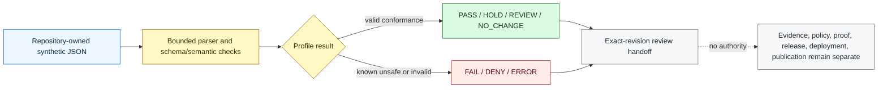

<!-- [KFM_META_BLOCK_V2]
doc_id: kfm://doc/geology-no-network-test-runbook
title: Geology & Natural Resources — No-Network Test Runbook
type: runbook; operational-procedure; domain-lane; sensitive-domain; non-authoritative
version: v0.2
prior_version: v0.1 planning-oriented draft
status: draft; repository-grounded; four-bounded-no-network-fixture-profiles-executable; broader-source-evidence-policy-proof-release-and-live-operation-held; non-publisher
owners:
  - "@bartytime4life — verified GitHub review route only"
owner_status: "Geology, Natural Resources, source, rights, sensitivity, evidence, policy, validation, proof, review, release, correction, rollback, security, and operations assignments remain NEEDS VERIFICATION; CODEOWNERS routing does not create those authorities."
created: 2026-05-12
updated: 2026-08-25
policy_label: public-review; geology; natural-resources; no-network; synthetic-fixtures; sensitive-location; fail-closed; non-release
current_path: docs/runbooks/geology/NO_NETWORK_TEST_RUNBOOK.md
owning_root: docs/
responsibility: "Document the exact bounded Geology no-network procedures currently supported by repository fixtures, validators, focused tests, and read-only workflow orchestration, while keeping live sources, real subsurface or resource payloads, evidence closure, policy decisions, proof, review, release, deployment, promotion, publication, and public authority outside the test boundary."
truth_posture: cite-or-abstain
prepared_under_prompt: KFM Repository Build-Out & Markdown Modernization Implementation Agent v6.0.0
evidence_snapshot:
  repository: bartytime4life/Kansas-Frontier-Matrix
  base_ref: main
  base_commit: a125b5b949627898f5a0b0f52a0a09f53b0c0483
  target_prior_blob: b17513a0ba8b16c5b29fc330f967db30e52f6a2c
  directory_rules_blob: fd49a0b83e55cef52c1124281f093e263526898d
  directory_rules_adoption_adr_blob: a4de0d7a96b78da59cfc499d1025e1508afd8dd9
  geology_workflow_blob: 79b6066c9dede603df328d66601fe757ae68c5b3
  geology_domain_readme_blob: 5ed55479c776563b65275cd9bc4628266a37aedc
  geology_validator_index_blob: 8879efb79a54f1bd637d686f528b293bf3557747
  resource_class_test_blob: 55ad09149480f72bd79a714f7df5fe626be19653
  aem_campaign_test_blob: 133538820ebe9578a2b8b7f6b69c130cdc9e01b6
  public_safe_geometry_test_blob: 3ff26a1b45f571f1d441975168fbe07514003080
  production_material_change_test_blob: 779ff37af46ac591df8f69dd602cf23faf4c78b1
  source_authority_register_blob: 32729857bc8eb5001acb37b8ee8e60bcb6e0dc50
  geology_proof_readme_blob: fc07012855bb4019008a3b0dce035dc8088156f6
  geology_release_candidate_readme_blob: f0313cafc641c049d367af82418212e0bad1fc35
drive_sources:
  - title: KFM_Geology_Natural_Resources_Architecture_PDF_Only_Report_2026-04-21.pdf
    file_id: 1kxONABD4knMG1HYaJR740tzZ_EBrt7Ca
    sha256: d334f43df8fd74f17115cc0f51861cf8238c9cb99d37adaf95f5e4e1655fdf51
    role: planning lineage; not current repository implementation proof
  - title: KFM_Greenfield_Commissioning_Plan_v2_FULL.pdf
    file_id: 161zjrR23nrv2b9ejne7iRDasVNnvCFwc
    sha256: d0b27fc3a2e4c18637e978c67fb8e8bb7af5de4726d33ddc4ae2a6e1fbff51b5
    role: commissioning and operating-law lineage; not current runtime, release, or publication proof
inspection_boundary: "Current-session GitHub reads of the target, accepted Directory Rules decision, Geology domain workflow, validators, tests, fixture inventories, source-authority projection, proof lane, release-candidate lane, and related documentation; plus connected Google Drive planning sources. Repository-native commands were not executed in a mounted checkout during authoring. No live source, credential, real subsurface record, geometry payload, restricted well log, evidence resolver, policy evaluator, proof producer, release service, deployed consumer, or public carrier was exercised."
related:
  - docs/runbooks/README.md
  - docs/runbooks/geology/README.md
  - docs/runbooks/geology/SOURCE_REFRESH_RUNBOOK.md
  - docs/runbooks/geology/PROMOTION_RUNBOOK.md
  - docs/runbooks/geology/ROLLBACK_RUNBOOK.md
  - docs/doctrine/directory-rules.md
  - docs/adr/ADR-0029-adopt-directory-governance-standard-v2.md
  - docs/domains/geology/README.md
  - tools/validators/domains/geology/README.md
  - tools/validators/domains/geology/validate_resource_class_distinction.py
  - tools/validators/domains/geology/validate_aem_campaign.py
  - tools/validators/domains/geology/validate_production_material_change.py
  - tools/validators/geology/public_safe_geometry/README.md
  - tools/validators/geology/public_safe_geometry/validate_public_safe_geometry.py
  - tests/domains/geology/test_source_role_anti_collapse.py
  - tests/domains/geology/test_aem_campaign.py
  - tests/domains/geology/test_public_safe_geometry.py
  - tests/domains/geology/test_production_material_change.py
  - fixtures/domains/geology/resource_class/README.md
  - fixtures/domains/geology/aem_survey_campaign/README.md
  - fixtures/contracts/v1/domains/geology/public_safe_geometry/cases.json
  - fixtures/contracts/v1/domains/geology/production_material_change/
  - control_plane/source_authority_register.yaml
  - data/registry/sources/geology/README.md
  - data/registry/sensitivity/geology/README.md
  - data/proofs/geology/README.md
  - release/candidates/geology/README.md
  - .github/workflows/domain-geology.yml
tags: [kfm, geology, natural-resources, runbook, no-network, synthetic-fixtures, validation, sensitive-location, anti-collapse, fail-closed]
notes:
  - "v0.2 replaces the no-mounted-repository assumption, hypothetical PR-00 object chain, illustrative command placeholders, and unverified release-dry-run claims with the exact current bounded executable profiles."
  - "The retained operating principle is fixture-first, deterministic, reversible, synthetic, and no-live-source; the current implementation does not prove an end-to-end EvidenceBundle, policy, proof, release, rollback, or public-answer path."
  - "Three focused test modules actively block common Python socket, DNS, HTTP, and urllib entry points; the production-material-change profile is file-only but does not install an active socket guard. No operating-system egress sandbox is established here."
  - "The workflow body executes four bounded profiles even though its opening comment still says three; this documentation-only update records that conflict without changing workflow bytes or invalidating an existing workflow-bound receipt."
  - "This document changes no source, contract, schema, policy, fixture, validator, test, workflow, evidence object, operational receipt, proof, candidate, lifecycle state, runtime, deployment, promotion, rollback execution, or publication state."
[/KFM_META_BLOCK_V2] -->

<a id="top"></a>

# Geology & Natural Resources — No-Network Test Runbook

> **Run and interpret the Geology lane's current synthetic fixture profiles without contacting live sources, exposing sensitive subsurface or resource locations, or confusing fixture conformance with geologic truth, evidence closure, policy approval, proof, release, or publication.**

[](#current-repository-posture)
[](#current-executable-profiles)
[](#no-network-contract)
[](#sensitivity-rights-and-security)
[](#current-holds-and-graduation-gates)
[](#authority-and-placement)

> [!IMPORTANT]
> **A green local or hosted result proves only the bounded synthetic profile executed at the tested revision.** It does not establish a real geologic unit, mineral occurrence, resource deposit, resource estimate, reserve, permit, production fact, campaign state, source admission, rights clearance, sensitivity decision, `EvidenceBundle`, `PolicyDecision`, proof, candidate, release, deployment, promotion, or publication.

> [!WARNING]
> **Never place real, exact, or reverse-engineerable subsurface or resource locations in this procedure.** Borehole, private-well, well-log, core, sample, geochemistry, operator/parcel, extraction-targetable, transform-secret, restricted endpoint, or credential detail does not belong in fixtures, logs, workflow summaries, issues, pull requests, screenshots, or review packets.

> [!CAUTION]
> **"No network" is bounded, not magical.** Three focused suites patch common Python socket, DNS, HTTP, and `urllib` entry points. The production-material-change profile is file-only and declares network fetch disabled, but its focused test does not install the same active guards. The workflow environment variable `KFM_NO_NETWORK=1` is a convention, not an operating-system firewall, namespace, proxy, or egress policy.

**Quick navigation:** [Purpose](#purpose-and-terminal-boundary) · [Authority](#authority-and-placement) · [Posture](#current-repository-posture) · [Profiles](#current-executable-profiles) · [Network](#no-network-contract) · [Fixtures](#fixture-inventory-and-frozen-invariants) · [Preflight](#preconditions-and-stop-conditions) · [Local run](#local-procedure) · [CI](#hosted-ci-procedure) · [Results](#finite-outcomes-and-result-interpretation) · [Failures](#failure-diagnosis) · [Sensitivity](#sensitivity-rights-and-security) · [Receipts](#evidence-receipts-and-proof-boundary) · [Handoff](#review-handoff) · [Holds](#current-holds-and-graduation-gates) · [Rollback](#correction-and-document-rollback) · [References](#related-current-surfaces) · [Checklist](#operator-checklist) · [Lineage](#v01-lineage-and-superseded-assumptions)

---

<a id="purpose-and-terminal-boundary"></a>

## Purpose and terminal boundary

Use this runbook to execute and review the exact Geology fixture-safety and change-assessment slices currently wired by the repository:

```text
resource-class anti-collapse fixture profile
  + sparse announcement-bound AEM campaign-candidate profile
  + metadata-only public-safe-geometry assessment profile
  + production-material-change assessment profile
  + focused tests
  + deterministic validators
  + read-only domain workflow
  -> bounded conformance or stable fail-closed findings
  -> exact-revision review handoff
  -/> live source access
  -/> real geologic or resource truth
  -/> source admission or rights clearance
  -/> evidence, policy, proof, review, or release authority
  -/> lifecycle mutation, deployment, promotion, or publication
```

The KFM lifecycle remains:

```text
RAW -> WORK / QUARANTINE -> PROCESSED -> CATALOG / TRIPLETS -> PUBLISHED
```

This procedure does not enter, advance, or mutate that lifecycle. It reads repository-owned synthetic files and emits test or validator output only.

### In scope

- `tools/validators/domains/geology/validate_resource_class_distinction.py`;
- `tools/validators/domains/geology/validate_aem_campaign.py`;
- `tools/validators/geology/public_safe_geometry/validate_public_safe_geometry.py`;
- `tools/validators/domains/geology/validate_production_material_change.py`;
- the four focused Geology test modules named below;
- the exact or discovered fixture profiles documented below;
- `.github/workflows/domain-geology.yml`, especially `validate-geology`;
- bounded JSON parsing, deterministic identity, expected polarity, stable findings, CLI behavior, source-role and claim-class anti-collapse, sensitive-location denial, common network-entry-point guards, and hosted-check interpretation;
- a public-safe review handoff tied to an exact revision.

### Out of scope

- live KGS, KCC, KDHE, USGS, NGMDB, GeMS, WWC5, LAS, MRDS, oil/gas, production, AEM, well-log, core, sample, geophysics, geochemistry, or other source requests;
- source admission, activation, endpoint verification, credentials, retrieval, cadence, rights review, or source health;
- real coordinates, geometries, records, operators, parcels, leases, titles, wells, logs, samples, resource targets, or protected source payloads;
- canonical geology vocabulary or scientific interpretation;
- economic viability, resource/reserve certification, engineering suitability, extraction guidance, legal/title/lease/permit conclusions, or investment guidance;
- general Geology schema coverage beyond the named profiles;
- active Geology policy evaluation or sensitivity adjudication;
- `EvidenceRef` resolution to a real `EvidenceBundle`;
- proof construction, candidate assembly, release dry run, deployment, publication, cache invalidation, correction execution, withdrawal execution, or operational rollback;
- public API, map, tile, export, search, graph, Evidence Drawer, Focus Mode, or AI-answer behavior.

**Maximum result:** a bounded validation handoff for the exact synthetic profiles at an exact repository revision.

[Back to top](#top)

---

<a id="authority-and-placement"></a>

## Authority and placement

### Directory Rules result

**`PLACE` — confirmed for this same-path update.**

Accepted [ADR-0029](../../adr/ADR-0029-adopt-directory-governance-standard-v2.md) adopts [Directory Rules v2](../../doctrine/directory-rules.md). A human operational procedure belongs under `docs/runbooks/`, with `geology/` as the domain segment. The tracked target therefore remains:

```text
docs/runbooks/geology/NO_NETWORK_TEST_RUNBOOK.md
```

This update creates no new root, parallel runbook authority, contract home, schema home, policy home, source registry, fixture lane, proof lane, release lane, or public path.

| Responsibility | Owning surface | This runbook's role |
|---|---|---|
| Human procedure | `docs/runbooks/geology/` | Explain exact execution, interpretation, stops, and handoff |
| Geology meaning | `docs/domains/geology/`, `contracts/domains/geology/` | Cite; do not redefine geologic or resource truth |
| Machine shape | `schemas/contracts/v1/domains/geology/` | Document only the schemas actually invoked by the bounded profiles |
| Synthetic inputs | `fixtures/domains/geology/`, `fixtures/contracts/v1/domains/geology/` | Consume only the profiles named here |
| Validator implementation | `tools/validators/domains/geology/`, `tools/validators/geology/` | Document exact entry points and bounded finding contracts |
| Executable tests | `tests/domains/geology/` | Document assertions and network guards without expanding their proof |
| Workflow orchestration | `.github/workflows/domain-geology.yml` | Bind results to a revision; do not infer release authority |
| Source admission | source registry and source-authority controls | Require separately accepted records; this procedure activates none |
| Policy and sensitivity | `policy/domains/geology/`, `policy/sensitivity/geology/` | Record current posture; this procedure does not evaluate them |
| Evidence and proof | evidence contracts and `data/proofs/geology/` | Keep fixture references distinct from evidence closure |
| Candidate and release | `release/candidates/geology/`, shared release roots | Preserve holds; do not assemble or approve |
| Public clients | governed APIs and released artifacts | Outside this procedure |

A tracked path, detailed Markdown page, passing fixture, green workflow, generated authoring receipt, pull request, or merge does not create an authority that the owning system has not supplied.

[Back to top](#top)

---

<a id="current-repository-posture"></a>

## Current repository posture

The following observations are pinned to `main@a125b5b949627898f5a0b0f52a0a09f53b0c0483`. They describe repository bytes and bounded executable surfaces, not deployed behavior.

| Surface | Confirmed repository state | Safe conclusion |
|---|---|---|
| Prior runbook | v0.1 planning draft written under a no-mounted-repository assumption | Its hypothetical object chain and illustrative commands are superseded for current behavior |
| Geology workflow | `domain-geology` exists, uses `contents: read`, installs the declared test profile, executes four bounded validation slices, and keeps proof/release jobs held | Four fixture profiles are wired; proof and release are not |
| Workflow summary comment | Opening comment says three bounded profiles, while executable steps run four | `CONFLICTED` documentation note; the executable YAML body is the current orchestration evidence |
| Resource-class validator/test | Substantive deterministic validator plus focused unittest | Synthetic occurrence/deposit/estimate anti-collapse is executable |
| AEM validator/test | Substantive document-bound validator plus focused unittest | One sparse, historical announcement candidate is executable without asserting current campaign state |
| Public-safe geometry validator/test | Substantive metadata-only validator, 18 cases, focused unittest | Coordinate-free assessment is executable; no geometry transform is |
| Production-material-change validator/test | Substantive schema-bound validator plus focused pytest | Version-pinned metadata comparison is executable; no live KGS request is |
| Other Geology validators/tests | Workflow classifies accepted substantive files and requires other modules to remain placeholders | Broader Geology validation is not silently established |
| Makefile target | Workflow fails if `geology-validate` or `validate-geology` appears without deliberate wiring | Run the exact commands below; do not invent a Make target |
| Source-authority projection | `entries: []`, `implementation_status: ABSENT`, `authority_mode: projection_only` | No source is admitted or activated by the central projection |
| Geology proof lane | Repository-grounded draft; workflow checks for absence of an accepted producer/artifact | No accepted Geology proof producer or proof closure is established |
| Geology candidate lane | Parent README only; no verified child dossier | No active Geology release candidate or public carrier is established |
| Workflow receipt check | Public-safe-geometry step validates an existing documentation-convergence authoring receipt | That receipt is provenance for named docs/workflow bytes, not scientific or release proof |
| Deployment and public serving | Not established by the inspected surfaces | `UNKNOWN`; no public effect may be inferred |

### Planning-source relationship

The connected Geology architecture PDF remains useful for domain scope, sensitivity, public-safe geometry, fixture-first validation, and source-role anti-collapse. It was created without a mounted repository and explicitly labeled its paths and implementation details as proposed. The current repository's contracts, fixtures, validators, tests, workflow, receipts, proof lane, and release lane therefore control current-behavior statements in this runbook.

The connected commissioning plan reinforces the smallest-complete-circle, authority-freeze, evidence-first, public-safe, reversible-change, and non-publisher posture. It does not upgrade these fixture profiles into an operating source, proof, release, deployment, or publication system.

[Back to top](#top)

---

<a id="current-executable-profiles"></a>

## Current executable profiles

| Profile | Exact implementation | Inputs | Bounded result | Does not prove |
|---|---|---|---|---|
| Resource-class anti-collapse | `validate_resource_class_distinction.py` + `test_source_role_anti_collapse.py` | Three valid and eight exact-negative synthetic resource-class fixtures | Occurrence, deposit, and estimate stay distinct; known invalids fail with exact sidecar findings | Canonical resource vocabulary, reserve status, rights, economic viability, proof, release |
| GMD 3 AEM campaign candidate | `validate_aem_campaign.py` + `test_aem_campaign.py` | One valid and eleven exact-negative document-bound fixtures plus one citation-only/candidate-only SourceDescriptor fixture | Planned announcement posture remains sparse, current state unknown, downstream stages and authority upcasts denied | Acquisition, campaign completion, source admission, live endpoint, rights clearance, evidence closure |
| Public-safe geometry assessment | `validate_public_safe_geometry.py` + `test_public_safe_geometry.py` | Eighteen coordinate-free metadata cases | Two `HOLD`, sixteen `DENY`, no `ALLOW`; exact and withheld public exposure fail closed | Geometry transform, transform receipt, policy, review, release, map/API/export safety |
| Production-material-change assessment | `validate_production_material_change.py` + `test_production_material_change.py` | Six observed valid packets and all committed invalid JSON packets | Packet outcomes exactly cover `NO_CHANGE`, `REVIEW`, `HOLD`, and `ERROR`; production stays production evidence | Live KGS retrieval, physical geology, deposit/estimate/reserve truth, lifecycle mutation, publication |

### Shared operating boundary


```mermaid
flowchart LR
  A["Repository-owned synthetic JSON"] --> B["Bounded parser and schema/semantic checks"]
  B --> C{"Profile result"}
  C -->|valid conformance| D["PASS / HOLD / REVIEW / NO_CHANGE"]
  C -->|known unsafe or invalid| E["FAIL / DENY / ERROR"]
  D --> F["Exact-revision review handoff"]
  E --> F
  F -. no authority .-> G["Evidence, policy, proof, release, deployment, publication remain separate"]

  classDef input fill:#eef6ff,stroke:#0969da,color:#102a43;
  classDef gate fill:#fff8c5,stroke:#9a6700,color:#3b2f00;
  classDef safe fill:#dafbe1,stroke:#1a7f37,color:#0d3b1e;
  classDef deny fill:#ffebe9,stroke:#b42318,color:#5b0a14;
  classDef hold fill:#f6f8fa,stroke:#6e7781,color:#24292f;
  class A input;
  class B,C gate;
  class D safe;
  class E deny;
  class F,G hold;
```

The profiles do not form a single end-to-end trust spine. They are separate, bounded checks sharing a domain workflow and fail-closed doctrine.

[Back to top](#top)

---

<a id="no-network-contract"></a>

## No-network contract

### What is positively established

1. The workflow uses repository fixtures and local validators; none of its four validation commands asks for a live source URL.
2. Resource-class tests patch:
   - `socket.socket.connect`;
   - `socket.socket.connect_ex`;
   - `socket.create_connection`;
   - `socket.getaddrinfo`;
   - `urllib.request.urlopen`.
3. AEM tests patch the same common entry points.
4. Public-safe-geometry tests patch the same common entry points and additionally inspect validator source for common HTTP and geometry client imports.
5. The public-safe fixture corpus contains no `https://` marker or coordinate-bearing fields named by its tests.
6. The production-material-change validator reads one bounded local JSON packet and reports `network_fetch: false` and `publication: false` in its CLI authority summary.
7. The workflow sets `KFM_NO_NETWORK=1` and `PYTHONDONTWRITEBYTECODE=1`; deterministic profiles also set `PYTHONHASHSEED=0` where configured.

### What is not established

- an operating-system network namespace;
- firewall, seccomp, container egress, proxy, DNS, or service-mesh denial;
- interception of every possible Python, native, subprocess, package, or future network client;
- repository-wide no-network behavior;
- a socket guard inside `test_production_material_change.py`;
- absence of network access in unrelated workflow setup actions or dependency installation;
- offline package installation;
- production runtime isolation.

> [!IMPORTANT]
> The dependency-install step may contact package infrastructure unless the runner cache and installer are independently proven offline. The **profile execution** is no-live-source; the complete job is not claimed to be physically disconnected.

### Forbidden inputs and behaviors

Stop the run if any profile or command:

- contains or derives real coordinates, geometry bytes, WKT/WKB, private-well identity, well-log detail, operator/parcel linkage, extraction target, or transform secret;
- references a live data endpoint, credential, connector, source head, or unrestricted source payload;
- reads `data/raw/`, `data/work/`, `data/quarantine/`, canonical/private stores, or released public stores as fixture input;
- fetches or refreshes a source;
- writes lifecycle, proof, candidate, release, published, deployment, or public-serving state;
- turns a fixture citation into source admission;
- treats `KFM_NO_NETWORK=1` as sufficient proof of egress denial.

[Back to top](#top)

---

<a id="fixture-inventory-and-frozen-invariants"></a>

## Fixture inventory and frozen invariants

### Resource-class anti-collapse

**Valid inventory — exact:**

```text
fixtures/domains/geology/resource_class/valid/
├── mineral_occurrence.json
├── resource_deposit.json
└── resource_estimate.json
```

**Invalid inventory — exact, each paired with an `.expected_error.txt` sidecar:**

```text
fixtures/domains/geology/resource_class/invalid/
├── estimate_as_observation.json
├── estimate_as_reserve.json
├── estimate_missing_classification.json
├── modeled_potential_as_deposit.json
├── occurrence_as_deposit.json
├── permit_as_deposit.json
├── precise_resource_location.json
└── production_as_deposit.json
```

Frozen invariants include:

- one valid case for each profile resource character;
- exact valid/invalid inventories;
- exact sorted finding code/path sidecars;
- bounded evidence, assumption, and limitation counts;
- valid calendar dates;
- closed top-level and claim shapes;
- no estimate support on non-estimate records;
- exact-location aliases denied without echoing values;
- deterministic finding order;
- duplicate-key, nonfinite-number, non-object, oversized, and missing-input failure handling;
- network guards not called during normal fixture validation.

### AEM campaign candidate

**Valid inventory — exact:**

```text
fixtures/domains/geology/aem_survey_campaign/valid/
└── valid_1.json
```

**Invalid inventory — exact, each paired with an `.expected_error.txt` sidecar:**

```text
fixtures/domains/geology/aem_survey_campaign/invalid/
├── invalid_acquisition_claim.json
├── invalid_campaign_state_completed.json
├── invalid_correction_ref_scheme.json
├── invalid_downstream_stage_field.json
├── invalid_false_release_state.json
├── invalid_missing_supporting_reference.json
├── invalid_non_fixture_reference.json
├── invalid_required_limitation_missing.json
├── invalid_self_supersession.json
├── invalid_silent_supersession.json
└── invalid_unscoped_planning_field.json
```

The valid profile is pinned to:

```text
fixtures/contracts/v1/source/source_descriptor/valid/
valid_ku_news_gmd3_aem_announcement_2026_05_11.json
```

Frozen invariants include:

- fixed campaign candidate identity and 2026-05-11 announcement date;
- `announcement_reported_state: planned`;
- `current_campaign_state: unknown`;
- `acquisition_evidence_state: not_bound_to_profile`;
- citation-source and candidate-only authority;
- unresolved-rights and no-public-release posture;
- no live endpoint, credential, connector, or source-head authority;
- downstream acquisition, raw, processing, inversion, datum, geometry, product, and uncertainty claims denied;
- false release, self-supersession, silent supersession, invalid correction scheme/time, and claim-identity drift denied;
- exact source-descriptor byte hash checked;
- network guards not called during normal validation.

### Public-safe geometry

Current fixture carrier:

```text
fixtures/contracts/v1/domains/geology/public_safe_geometry/cases.json
```

The suite contains eighteen metadata-only cases:

| Expected outcome | Count | Meaning |
|---|---:|---|
| `HOLD` | 2 | Coherent generalized metadata still lacks transform, evidence, policy, review, and release authority |
| `DENY` | 16 | Exact, withheld, unsafe, malformed, or overclaiming states fail closed |
| `ALLOW` | 0 | This profile grants no publication authority |

Named clean-decision examples include:

- `generalized-borehole-hold` → `HOLD`;
- `withheld-sample-deny` → `DENY`;
- `exact-resource-location-deny` → `DENY`;
- `generalized-boundary-hold` → `HOLD`.

Frozen invariants include:

- schema is JSON Schema 2020-12, closed, authority `NONE`;
- coordinate material is `DENIED`;
- release/publication wiring is `UNWIRED`;
- all source/public geometry references are opaque fixture references or `null`;
- no release manifest, release state, or publication authorization;
- no coordinates, bounding boxes, centroids, latitude/longitude, WKT/WKB, or live URLs in the fixture;
- deterministic `spec_hash` and assessment ID;
- malformed duplicate JSON fails without echoing the sensitive sentinel;
- validator source contains no common HTTP or geometry client imports named by the test.

### Production material change

Current fixture roots:

```text
fixtures/contracts/v1/domains/geology/production_material_change/
├── valid/
└── invalid/
```

Observed valid packets:

```text
coverage_regression_hold.json
material_change_review.json
no_change.json
operational_error.json
prior_missing_hold.json
rights_unresolved_hold.json
```

The focused test discovers all committed `*.json` files in both directories rather than freezing every filename. Therefore:

- every committed valid packet must pass;
- every committed invalid packet must fail with at least one finding;
- the valid outcome set must equal exactly `NO_CHANGE`, `REVIEW`, `HOLD`, and `ERROR`;
- all valid packets must carry deterministic `spec_hash` and `assessment_id`;
- `material_change_review.json` must report exactly:
  `COVERAGE_END`, `FOOTPRINT_DIGEST`, `MANIFEST_DIGEST`, and `RECORD_COUNT`;
- adding or removing a fixture changes the executed set but is not itself rejected as an inventory mismatch.

The profile preserves:

- `source_role: PRODUCTION_RECORDS`;
- `support_type: OFFICIAL_DERIVED_PRODUCTION_REFERENCE`;
- version-pinned prior/current snapshots;
- canonical sorted unique evidence refs, reasons, and change dimensions;
- missing baseline, unresolved rights, and coverage regression as fail-closed `HOLD`;
- production as production evidence, not physical geology, deposit, estimate, reserve, ownership, or future-availability truth;
- watcher non-publisher posture;
- bounded JSON parsing and deterministic CLI exit codes.

[Back to top](#top)

---

<a id="preconditions-and-stop-conditions"></a>

## Preconditions and stop conditions

### Preconditions

Before running:

- [ ] Work from a clean checkout of the exact revision under review.
- [ ] Confirm the target revision contains the four validators, four tests, named fixture roots, and `.github/workflows/domain-geology.yml`.
- [ ] Use Python 3.11 to match the hosted workflow unless a reviewed workflow change says otherwise.
- [ ] Install the repository-declared `project-test` dependency profile in an isolated environment.
- [ ] Confirm no real or restricted Geology data has been substituted for fixtures.
- [ ] Confirm the review packet can identify the exact commit or synthetic merge tested.
- [ ] Confirm expected invalid fixtures remain synthetic and safe to display by filename.
- [ ] Confirm the operator understands that green fixture conformance is not evidence, policy, proof, release, or publication authority.

### Mandatory stop conditions

Stop and classify the result before continuing if:

1. the target branch is not the branch intended for review;
2. a target validator, test, schema, or fixture path is missing or has moved without a reviewed migration;
3. a fixture is a symlink, is unexpectedly large, contains duplicate keys, or includes real/restricted material;
4. a known invalid fixture is accepted;
5. a valid fixture is rejected and the reason is not understood;
6. an expected finding code or path changes;
7. any common network guard is called;
8. the production profile begins importing or invoking a network client without a companion no-network test change;
9. deterministic hash or identity changes without a deliberate input/spec change;
10. the workflow's accepted substantive/placeholder inventory fails;
11. proof or release material appears while the workflow still treats those lanes as held;
12. a source is upcast, rights are silently marked verified, campaign state is asserted, or production is relabeled as geology/resource truth;
13. logs or outputs echo candidate values that tests intend to suppress;
14. hosted checks run against an unexpected revision;
15. an overlapping branch or pull request begins owning the same paths.

Do not weaken a validator, delete a negative fixture, alter an expected outcome, or broaden source authority merely to obtain green output.

[Back to top](#top)

---

<a id="local-procedure"></a>

## Local procedure

Run from the repository root.

### 1. Record the exact revision and working state

```bash
git rev-parse --show-toplevel
git rev-parse HEAD
git status --short
```

Expected:

- the repository root resolves;
- the recorded SHA is the revision being reviewed;
- the worktree is clean, or every local change is explicitly part of the review.

### 2. Create an isolated Python environment

Use the repository's established environment convention. One portable example is:

```bash
python3.11 -m venv .venv-kfm-geology-no-network
. .venv-kfm-geology-no-network/bin/activate
python -m pip install --upgrade pip
python tools/ci/install_python_ci.py project-test
```

> [!CAUTION]
> Dependency installation is not claimed to be offline. Use an approved locked cache or isolated runner where physical no-egress installation is required.

### 3. Set the bounded execution environment

```bash
export KFM_NO_NETWORK=1
export PYTHONDONTWRITEBYTECODE=1
export PYTHONHASHSEED=0
export TZ=UTC
```

These variables improve repeatability and communicate intent. They do not replace active guards or host-level isolation.

### 4. Run the resource-class profile

```bash
python tests/domains/geology/test_source_role_anti_collapse.py --verbose

python tools/validators/domains/geology/validate_resource_class_distinction.py \
  fixtures/domains/geology/resource_class/valid/*.json

if python tools/validators/domains/geology/validate_resource_class_distinction.py \
  fixtures/domains/geology/resource_class/invalid/*.json; then
  echo "ERROR: known-invalid Geology resource-class fixtures were accepted" >&2
  exit 1
fi
```

Expected:

- focused unittest passes;
- all valid fixtures exit successfully;
- the invalid batch exits nonzero;
- no sensitive candidate value is echoed;
- no network guard is called.

### 5. Run the AEM campaign-candidate profile

```bash
python tests/domains/geology/test_aem_campaign.py --verbose

python tools/validators/domains/geology/validate_aem_campaign.py \
  fixtures/domains/geology/aem_survey_campaign/valid/*.json

if python tools/validators/domains/geology/validate_aem_campaign.py \
  fixtures/domains/geology/aem_survey_campaign/invalid/*.json; then
  echo "ERROR: known-invalid Geology AEM campaign fixtures were accepted" >&2
  exit 1
fi
```

Expected:

- one sparse valid candidate passes;
- all eleven invalid fixtures fail with exact sidecar findings;
- the source descriptor remains citation-only/candidate-only and byte-pinned;
- no current campaign state or acquisition evidence is asserted;
- no network guard is called.

### 6. Run the public-safe geometry profile

```bash
python -m pytest -q -p no:cacheprovider \
  tests/domains/geology/test_public_safe_geometry.py

python tools/validators/geology/public_safe_geometry/validate_public_safe_geometry.py \
  --fixtures
```

Expected:

- focused test module passes;
- fixture replay reports eighteen matching cases;
- expected polarity remains two `HOLD` and sixteen `DENY`;
- authority remains `NONE`;
- no coordinate-bearing material or live endpoint is consumed;
- no transform or release is claimed.

The hosted workflow additionally validates the existing authoring receipt:

```bash
python tools/validators/validate_generated_receipt.py \
  data/receipts/generated/genrec-geology-public-safe-documentation-convergence-20260824.json \
  --repo-root .
```

That check binds the artifacts named by that receipt. It is not part of the geometry-assessment semantics.

### 7. Run the production-material-change profile

```bash
python -m pytest -q -p no:cacheprovider \
  tests/domains/geology/test_production_material_change.py
```

Expected:

- schema validation passes;
- every committed valid fixture passes;
- every committed invalid fixture fails closed;
- valid packet outcomes cover exactly `NO_CHANGE`, `REVIEW`, `HOLD`, and `ERROR`;
- deterministic hash and assessment identity checks pass;
- CLI behavior distinguishes valid, semantic failure, and missing input;
- no live KGS request occurs.

> [!CAUTION]
> This focused module does not actively patch sockets. Treat it as a deterministic local-file profile, not proof of host-level egress denial.

### 8. Optional workflow-parity inspection

The workflow also checks explicit substantive-versus-placeholder inventories. Review its current source before claiming full parity:

```bash
sed -n '1,360p' .github/workflows/domain-geology.yml
```

Do not create or invoke a `make geology-validate` target unless a reviewed change deliberately updates the workflow and its authority boundary.

### 9. Record a bounded result

Capture:

```text
repository:
revision:
working_tree:
python_version:
dependency_profile:
profile:
command:
start_time_utc:
end_time_utc:
exit_code:
bounded_result:
expected_invalid_rejection:
network_guard_scope:
unexpected_output:
sensitive_content_observed: false
operator:
notes:
```

Do not paste full fixture payloads, exact restricted values, secrets, or real source data into the record.

[Back to top](#top)

---

<a id="hosted-ci-procedure"></a>

## Hosted CI procedure

The current workflow is:

```text
.github/workflows/domain-geology.yml
```

### Trigger and authority posture

- runs on pull requests;
- runs on pushes to `main`;
- allows manual dispatch;
- uses `contents: read`;
- does not persist checkout credentials;
- uses concurrency cancellation;
- validates bounded profiles;
- keeps proof and release-dry-run readiness separate and held.

### Review procedure

1. Open or update the scoped pull request.
2. Record the PR head SHA and current base SHA.
3. Wait for the `domain-geology` workflow to start.
4. Inspect checkout logs to determine whether the job tested the exact head, GitHub's synthetic merge, or another revision.
5. Confirm all four validation steps executed:
   - resource-class fixture;
   - AEM campaign fixture;
   - public-safe geometry fixture;
   - production-material-change fixture.
6. Confirm the workflow's boundary inventory step passed.
7. Confirm proof and release jobs remained explicit holds rather than being misreported as passes.
8. Separate:
   - introduced failures;
   - inherited failures;
   - skipped checks;
   - pending checks;
   - stale-head results.
9. Recheck the current PR head before handing off.
10. Do not convert green CI into review, merge, release, deployment, promotion, or publication authority.

### Workflow result language

Use:

```text
CONFIRMED: domain-geology executed at <tested SHA or synthetic merge SHA>.
CONFIRMED: <named profile steps> succeeded or failed.
PENDING: <named runs/jobs still in progress>.
SKIPPED: <named jobs explicitly skipped>.
INHERITED / INTRODUCED / UNKNOWN: <failure classification with evidence>.
HOLD: proof and release producers remain unestablished.
```

Avoid:

```text
"Geology is validated."
"The source is current."
"The layer is safe."
"The release passed."
"The data is published."
```

[Back to top](#top)

---

<a id="finite-outcomes-and-result-interpretation"></a>

## Finite outcomes and result interpretation

The four profiles do not share one outward vocabulary. Preserve each layer's result semantics.

| Layer/profile | Current result vocabulary | Interpretation |
|---|---|---|
| Resource-class validator/test | process/test pass or stable fail findings | Fixture conformance or rejection only |
| AEM validator/test | process/test pass or stable fail findings | Historical sparse candidate conformance only |
| Public-safe geometry assessment | `HOLD`, `DENY`, `ERROR`; no `ALLOW` | Metadata assessment only; `HOLD` is not release permission |
| Production-material-change packet | `NO_CHANGE`, `REVIEW`, `HOLD`, `ERROR` | Watcher/change-assessment disposition only |
| Production validator CLI wrapper | `PASS`, `FAIL`, `ERROR` | Whether the packet conforms, not whether its real-world claim is true |
| Governed runtime envelope | `ANSWER`, `ABSTAIN`, `DENY`, `ERROR` | Separate runtime behavior; not exercised end-to-end here |

### Safe conclusions

**Resource class**

- `PASS`: the synthetic candidate conforms to the frozen profile.
- expected nonzero invalid batch: known anti-collapse violations remain rejected.
- neither result certifies a resource, reserve, permit, production record, or economic conclusion.

**AEM**

- `PASS`: the candidate remains exactly bounded to the document-reported planned state.
- expected nonzero invalid batch: authority upcasts, current-state claims, downstream-stage fields, false release, or correction defects remain rejected.
- neither result establishes present campaign status or acquisition evidence.

**Public-safe geometry**

- `HOLD`: coherent metadata still lacks required transform/evidence/policy/review/release support.
- `DENY`: public exposure is unsafe or the candidate is invalid.
- `ERROR`: the assessment could not be evaluated safely.
- no result authorizes a map, API, tile, export, or publication.

**Production material change**

- `NO_CHANGE`: the two synthetic snapshots match under the profile and rights are verified in the fixture.
- `REVIEW`: declared metadata changed and requires review.
- `HOLD`: baseline, rights, or coverage conditions block assessment.
- `ERROR`: operational profile error.
- no result turns production records into geology, deposit, estimate, reserve, ownership, or future-availability truth.

[Back to top](#top)

---

<a id="failure-diagnosis"></a>

## Failure diagnosis

| Symptom | Likely class | Required response |
|---|---|---|
| Required path missing | Branch drift, move, incomplete checkout | Stop; inspect current authority and migration evidence |
| Dependency import fails | Environment not installed from declared profile | Recreate isolated environment; do not modify tests to hide it |
| Valid resource/AEM fixture rejected | Validator, fixture, or expected semantics changed | Compare exact bytes and sidecars; require a reviewed semantic change |
| Known invalid resource/AEM fixture accepted | Fail-closed regression | Block handoff; restore rejection before proceeding |
| Expected sidecar finding differs | Contract or validator drift | Review code/path meaning; never accept arbitrary nonzero failure |
| Public-safe suite gains `ALLOW` | Authority expansion | Stop; require contract, policy, review, release, and negative-test evidence |
| Public-safe fixture contains coordinate marker or URL | Sensitive-input boundary failure | Treat as a sensitivity/security incident; do not publish logs or payload |
| Production valid outcome set changes | Fixture/profile drift | Review packet semantics and update only with explicit authority |
| `NO_CHANGE` survives differing fields | Materiality regression | Block; inspect change-dimension computation |
| `REVIEW` survives unresolved rights or coverage regression | Fail-closed regression | Block; expected disposition is `HOLD` |
| Hash or assessment ID changes on reordered equivalent input | Non-determinism | Fix canonicalization before relying on identity |
| Common network mock called | Network-boundary regression | Block; identify call path and add deterministic denial |
| Production profile imports a network client | Uncovered no-network expansion | Add an active guard and review the profile before retaining "no-network" |
| Validator output echoes sentinel/candidate values | Sensitive-output regression | Block and redact; return only stable code/path findings |
| Workflow says accepted file became placeholder | Implementation regression | Restore substantive implementation or deliberately revise inventory |
| Workflow says an unaccepted file became substantive | Unwired capability surfaced | Commission, document, test, and wire deliberately; do not bypass inventory |
| Existing generated receipt hash mismatch | Artifact changed outside receipt scope | Create or update the correct authoring receipt; do not weaken integrity |
| Proof artifact/producer appears in held lane | Authority/state transition | Stop; establish contract, policy, fixtures, access, review, and release linkage |
| Hosted job tests stale head | Concurrency/stale evidence | Discard as current-head evidence and rerun |
| Hosted failure appears in unrelated path | Possibly inherited | Compare base/sibling runs; label `UNKNOWN` until attributable |
| Real source or restricted payload appears | Rights/sensitivity incident | Quarantine, stop dissemination, follow incident/correction governance |

### Failure packet minimum

```text
profile:
tested_revision:
command:
exit_code:
finding_codes_and_paths:
expected_result:
actual_result:
introduced_or_inherited:
network_guard_status:
sensitivity_status:
source_activation_status: none
lifecycle_effect: none
recommended_disposition: HOLD
rollback_or_correction:
```

Do not include raw sensitive values.

[Back to top](#top)

---

<a id="sensitivity-rights-and-security"></a>

## Sensitivity, rights, and security

### Default posture

Exact or reverse-engineerable borehole, private-well, well-log, core, sample, geochemistry, sensitive-resource, operator/parcel, extraction-targetable, and infrastructure-linked details fail closed for ordinary public exposure.

The test corpus must remain:

- synthetic;
- coordinate-free where the profile requires it;
- non-identifying;
- source-inactive;
- credential-free;
- rights-safe for repository review;
- free of transform offsets, masking secrets, private endpoints, and access routes.

### Claim-class and source-role anti-collapse

| Must remain distinct | Must not be inferred |
|---|---|
| Mineral occurrence | Deposit, estimate, reserve, ownership, permit, production |
| Resource deposit | Quantified estimate, reserve, economic viability, active extraction |
| Resource estimate | Direct observation, reserve, ownership, production, engineering certainty |
| Permit/regulatory record | Physical geology, deposit, production, ownership/title |
| Production record | Deposit, estimate, reserve, future availability, active operation |
| Planned AEM announcement | Current campaign state, acquired data, inversion product, public release |
| Generalized public geometry metadata | Executed transform, exact-source safety, publication permission |
| Fixture SourceDescriptor | Admitted source, verified rights, live connector, authority for real claims |

### Incident posture

If a real or potentially identifying value enters this procedure:

1. stop the command and prevent further log propagation;
2. do not paste the value into a ticket, PR, chat, or screenshot;
3. preserve only the minimum safe metadata needed to identify affected files and commits;
4. quarantine the material under the owning incident/sensitivity process;
5. assess repository history, caches, artifacts, forks, and workflow logs;
6. require rights/sensitivity/security review before any correction;
7. use a reviewed history-safe correction; do not rewrite shared history without explicit authority;
8. record correction, withdrawal, or rollback references where public exposure occurred.

This runbook does not itself authenticate an incident commander or define a sensitive-data response authority.

[Back to top](#top)

---

<a id="evidence-receipts-and-proof-boundary"></a>

## Evidence, receipts, and proof boundary

### What the run may produce

- terminal output;
- unittest or pytest results;
- stable code/path findings;
- workflow logs and summaries;
- commit/run identifiers;
- an AI-authoring `GENERATED_RECEIPT` for documentation bytes when required.

### What those outputs are not

They are not:

- a source admission;
- a source snapshot or source-of-truth record;
- an `EvidenceRef` or `EvidenceBundle` for a real claim;
- a `PolicyDecision`;
- a sensitivity clearance;
- a `ReviewRecord`;
- a transform, redaction, or aggregation receipt;
- a `ProofPack`;
- a release candidate dossier;
- a `PromotionDecision`;
- a `ReleaseManifest`;
- a correction, withdrawal, or rollback execution;
- a public API, map, tile, export, or AI answer.

### Generated authoring receipt

This runbook's AI-assisted repository update requires a generated authoring receipt under the repository's receipt rules. That receipt:

- binds the runbook's final bytes;
- records prompt and source hashes;
- records validation gates and pending human review;
- supports authoring provenance;
- does not prove the runbook's commands were executed in a mounted checkout;
- does not grant merge, review, release, deployment, promotion, or publication authority.

A historical receipt remains historical process memory. Validate it against the exact artifact revision it declares; do not replay it against changed bytes and reinterpret a mismatch as scientific failure.

[Back to top](#top)

---

<a id="review-handoff"></a>

## Review handoff

### Required packet

```markdown
## Geology no-network validation handoff

- Repository:
- Base SHA:
- Tested head or synthetic merge SHA:
- Branch / PR:
- Profile(s) executed:
- Exact commands:
- Local environment:
- Fixture inventory result:
- Expected invalid rejection result:
- Public-safe polarity:
- Production outcome set:
- Network guard scope:
- Host-level egress status:
- Sensitive data observed: no / HOLD
- Introduced failures:
- Inherited failures:
- Pending or skipped checks:
- Source activation: none
- Lifecycle writes: none
- Evidence/policy/proof/release effect: none
- Human reviewer route:
- Human review state: pending
- Rollback:
- Open verification:
```

### Appropriate reviewer capabilities

The verified GitHub route is `@bartytime4life`. Capability assignments remain `NEEDS VERIFICATION`. A complete review should cover, as applicable:

- Geology and Natural Resources semantics;
- source role and rights;
- subsurface/resource sensitivity;
- validator and fixture correctness;
- deterministic identity;
- evidence/proof boundaries;
- policy and review posture;
- release/correction/rollback;
- security and operations;
- documentation accuracy.

CODEOWNERS routing or repository permission does not create those subject-matter authorities.

### Handoff disposition

Use one:

- `READY_FOR_HUMAN_REVIEW` — bounded profile and documentation checks passed; authority claims remain limited;
- `HOLD` — unresolved semantics, sensitivity, rights, network, test, receipt, overlap, or revision issue;
- `CHANGES_REQUESTED` — specific correction is required;
- `ABANDON` — the branch is no longer the correct review boundary.

Do not use `APPROVED_FOR_RELEASE` or `PUBLISHED` from this runbook.

[Back to top](#top)

---

<a id="current-holds-and-graduation-gates"></a>

## Current holds and graduation gates

### Confirmed current holds

- central source-authority projection has no entries;
- no source is admitted or activated by this procedure;
- no live Geology connector or source retrieval is exercised;
- broader Geology validator families remain placeholders or documentation-only;
- active Geology policy evaluation is not established by these profiles;
- real EvidenceRef-to-EvidenceBundle resolution is not exercised;
- no accepted Geology proof producer or populated proof closure is established;
- no child Geology release-candidate dossier is established;
- release dry run, signer custody, deployment, and publication are not established;
- accountable steward and independent reviewer roles remain unresolved.

### Required evidence before broadening

A future profile may graduate only when its own scoped change establishes, as applicable:

1. accepted object and source-role meaning;
2. closed machine schema;
3. rights and sensitivity posture;
4. deterministic identity;
5. exact positive and negative fixtures;
6. active no-network enforcement proportionate to the claim;
7. stable findings and bounded output;
8. evidence closure;
9. policy evaluation;
10. authenticated review;
11. proof linkage;
12. candidate and release linkage;
13. correction and rollback targets;
14. governed public consumer behavior;
15. hosted exact-revision validation;
16. accountable ownership and separation of duties.

Do not bundle live source activation, broad domain expansion, proof production, release, and public UI changes into this documentation slice.

[Back to top](#top)

---

<a id="correction-and-document-rollback"></a>

## Correction and document rollback

### Before merge

- close the draft pull request;
- delete the task branch if no longer needed;
- no data, source, release, deployment, or public rollback is required.

### After an authorized merge

Use a reviewed revert of the merge commit or a bounded forward-correction pull request against current `main`.

Do not:

- force-push shared history;
- silently restore v0.1's obsolete implementation claims;
- change fixtures, validators, workflow, or receipts merely to make the prose look consistent;
- imply that documentation rollback changes operational Geology state.

### What repository rollback changes

- this runbook;
- its authoring receipt, if reverted in the same change;
- documentation links or metadata that directly depend on it.

### What repository rollback does not change

- source admission;
- real Geology data;
- evidence or proof objects;
- policy decisions;
- release candidates;
- published artifacts;
- deployed services;
- caches;
- public claims.

If any of those later become affected, use their owning correction, withdrawal, rollback, and release procedures rather than this documentation rollback.

[Back to top](#top)

---

<a id="related-current-surfaces"></a>

## Related current surfaces

### Operational and domain documentation

- [Geology runbook lane](./README.md)
- [Geology source refresh runbook](./SOURCE_REFRESH_RUNBOOK.md)
- [Geology promotion runbook](./PROMOTION_RUNBOOK.md)
- [Geology rollback runbook](./ROLLBACK_RUNBOOK.md)
- [Geology domain landing](../../domains/geology/README.md)
- [Directory Rules](../../doctrine/directory-rules.md)
- [ADR-0029](../../adr/ADR-0029-adopt-directory-governance-standard-v2.md)

### Validators and tests

- [Per-domain Geology validator index](../../../tools/validators/domains/geology/README.md)
- [Resource-class validator](../../../tools/validators/domains/geology/validate_resource_class_distinction.py)
- [AEM candidate validator](../../../tools/validators/domains/geology/validate_aem_campaign.py)
- [Production-material-change validator](../../../tools/validators/domains/geology/validate_production_material_change.py)
- [Public-safe geometry lane](../../../tools/validators/geology/public_safe_geometry/README.md)
- [Public-safe geometry validator](../../../tools/validators/geology/public_safe_geometry/validate_public_safe_geometry.py)
- [Resource-class focused test](../../../tests/domains/geology/test_source_role_anti_collapse.py)
- [AEM focused test](../../../tests/domains/geology/test_aem_campaign.py)
- [Public-safe geometry focused test](../../../tests/domains/geology/test_public_safe_geometry.py)
- [Production-material-change focused test](../../../tests/domains/geology/test_production_material_change.py)

### Governance, proof, and release boundaries

- [Source-authority projection](../../../control_plane/source_authority_register.yaml)
- [Geology source registry](../../../data/registry/sources/geology/README.md)
- [Geology sensitivity registry](../../../data/registry/sensitivity/geology/README.md)
- [Geology proof-support lane](../../../data/proofs/geology/README.md)
- [Geology release-candidate lane](../../../release/candidates/geology/README.md)
- [Geology workflow](../../../.github/workflows/domain-geology.yml)

[Back to top](#top)

---

<a id="operator-checklist"></a>

## Operator checklist

### Before

- [ ] Exact revision recorded.
- [ ] Worktree state recorded.
- [ ] No overlapping PR owns the same profile or runbook.
- [ ] Python 3.11 and `project-test` profile available.
- [ ] Fixture roots and validators match this runbook.
- [ ] No real or restricted data is present.
- [ ] No source activation is intended.
- [ ] Network boundary and its limitations are understood.

### During

- [ ] Resource-class focused test passes.
- [ ] Resource valid fixtures pass.
- [ ] Resource invalid fixtures are rejected.
- [ ] AEM focused test passes.
- [ ] AEM valid fixture passes.
- [ ] AEM invalid fixtures are rejected.
- [ ] Public-safe focused test passes.
- [ ] Public-safe replay remains 2 `HOLD` / 16 `DENY`.
- [ ] Production focused test passes.
- [ ] Production valid outcome set remains exact.
- [ ] No common network guard is called.
- [ ] No sensitive value is echoed.
- [ ] No lifecycle, proof, candidate, release, or published path is written.

### After

- [ ] Tested SHA or synthetic merge SHA recorded.
- [ ] Introduced, inherited, pending, and skipped results separated.
- [ ] Proof and release holds remain visible.
- [ ] Human review remains pending unless independently completed.
- [ ] Authoring receipt validates against final runbook bytes.
- [ ] Rollback path recorded.
- [ ] No claim of source freshness, scientific truth, release, deployment, promotion, or publication was made.

[Back to top](#top)

---

<a id="v01-lineage-and-superseded-assumptions"></a>

## v0.1 lineage and superseded assumptions

v0.1 remains useful planning lineage. This update preserves its strongest principles:

- start with deterministic synthetic fixtures;
- prohibit live source access in the first proof;
- fail closed on unknown rights and sensitive exact locations;
- exercise negative cases, not only happy paths;
- keep source role and resource claim class explicit;
- prefer deterministic identity and repeatable output;
- keep the change reversible;
- distinguish a pull request from publication.

The following v0.1 claims are superseded as current implementation descriptions:

| v0.1 assumption | v0.2 repository-grounded result |
|---|---|
| No mounted-repository evidence; all paths proposed | Current GitHub bytes, blobs, tests, validators, fixtures, and workflow were inspected |
| One hypothetical PR-00 chain from SourceDescriptor through ReleaseManifest and RollbackCard | Four separate bounded profiles are executable; no end-to-end release/proof chain is established |
| Illustrative unknown validator commands | Exact workflow commands are documented |
| Fixture home unresolved | Both domain and contract fixture roots are current, with responsibility determined by the profile |
| `ANSWER / ABSTAIN / DENY / ERROR` must all be reached by this suite | Current profiles use distinct bounded vocabularies; no governed runtime envelope is exercised end-to-end |
| Release dry run and rollback card are part of current acceptance | Proof and release-dry-run producers remain held |
| Source families can be summarized as one role band | Source role is claim-relative; current central authority projection remains empty |
| Synthetic exact coordinate stand-ins are acceptable | Current public-safe profile is coordinate-free; do not add coordinate material merely to test denial |
| Cesium or 3D work is a named deferred path | Renderer choice and 3D architecture are outside this runbook and require current ADR/repository evidence |

The long object-family and source-family appendices from v0.1 are not repeated here because the current domain landing, contracts, registries, and validator indexes own those inventories. This runbook retains only distinctions needed to execute and interpret the named no-network profiles.

---

<sub>**Current path:** `docs/runbooks/geology/NO_NETWORK_TEST_RUNBOOK.md` · **Version:** v0.2 · **Updated:** 2026-08-25 · **Status:** repository-grounded draft · **Truth posture:** cite-or-abstain · [Back to top](#top)</sub>
