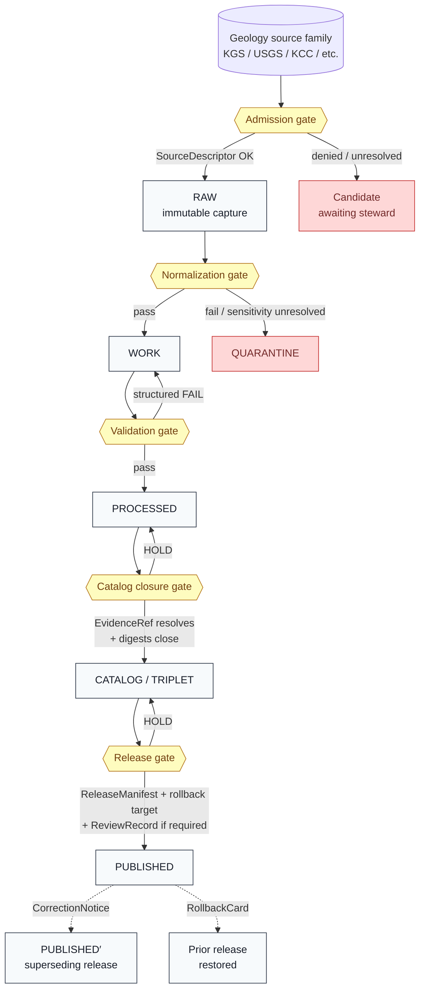

<!-- [KFM_META_BLOCK_V2]
doc_id: kfm://doc/runbook-geology-promotion
title: Geology Promotion Runbook
type: standard
version: v1
status: draft
owners: TODO — Docs steward + Geology domain steward + Release authority (placeholder; assign before merge)
created: TODO — YYYY-MM-DD
updated: TODO — YYYY-MM-DD
policy_label: public
related:
  - docs/doctrine/directory-rules.md
  - docs/doctrine/lifecycle-law.md
  - docs/domains/geology/README.md
  - docs/adr/ADR-0001-schema-home.md
  - release/manifests/
  - schemas/contracts/v1/release/promotion_decision.schema.json
tags: [kfm, runbook, geology, promotion, lifecycle, governance]
notes:
  - Path under docs/runbooks/geology/ is PROPOSED; see Repo fit § for the placement basis.
  - Most implementation claims in this runbook are PROPOSED until repo evidence confirms them.
[/KFM_META_BLOCK_V2] -->

# Geology Promotion Runbook

> Operational procedure for moving Geology artifacts through the KFM lifecycle invariant — **RAW → WORK / QUARANTINE → PROCESSED → CATALOG / TRIPLET → PUBLISHED** — with the geology-specific guards, separation of duties, correction path, and rollback target required for each governed state transition.


**Status:** `draft` · **Owners:** TODO (Docs steward + Geology domain steward + Release authority) · **Last updated:** TODO

> [!IMPORTANT]
> **Promotion is a governed state transition, not a file move.** A path-level copy that bypasses validators, policy gates, evidence-bundle closure, catalog closure, or release-decision recording is an invariant violation regardless of which directory the bytes ended up in. When any gate cannot be closed, **hold the prior state and quarantine the failure** — never silently advance.

---

## Quick jump

- [1. Scope and boundary](#1-scope-and-boundary)
- [2. Repo fit and placement basis](#2-repo-fit-and-placement-basis)
- [3. Roles and separation of duties](#3-roles-and-separation-of-duties)
- [4. Promotion flow at a glance](#4-promotion-flow-at-a-glance)
- [5. Pre-flight checklist](#5-pre-flight-checklist)
- [6. Lifecycle gates](#6-lifecycle-gates)
  - [6.1 Admission (— → RAW)](#61-admission----raw)
  - [6.2 Normalization (RAW → WORK / QUARANTINE)](#62-normalization-raw--work--quarantine)
  - [6.3 Validation (WORK → PROCESSED)](#63-validation-work--processed)
  - [6.4 Catalog closure (PROCESSED → CATALOG / TRIPLET)](#64-catalog-closure-processed--catalog--triplet)
  - [6.5 Release (CATALOG / TRIPLET → PUBLISHED)](#65-release-catalog--triplet--published)
- [7. Geology-specific guards](#7-geology-specific-guards)
- [8. Failure-closed reason codes](#8-failure-closed-reason-codes)
- [9. Correction path (PUBLISHED → PUBLISHED′)](#9-correction-path-published--published)
- [10. Rollback path (PUBLISHED → prior release)](#10-rollback-path-published--prior-release)
- [11. Stale-state markers](#11-stale-state-markers)
- [12. Anti-patterns to refuse](#12-anti-patterns-to-refuse)
- [13. Verification backlog](#13-verification-backlog)
- [14. Related docs](#14-related-docs)
- [15. Appendix — illustrative artifacts](#15-appendix--illustrative-artifacts)

---

## 1. Scope and boundary

This runbook governs the operational decisions an actor MUST make at each lifecycle gate for the **Geology / Natural Resources** lane. **CONFIRMED doctrine** [DOM-GEOL §10/M; ENCY Appendix E; DIRRULES §0]: Geology publication requires `ReleaseManifest`, `EvidenceBundle`, validation/policy support, review state where required, a correction path, a stale-state rule, and a rollback target.

**In scope (Geology object families — PROPOSED field realization, CONFIRMED naming):** GeologicUnit, SurficialUnit, Lithology, StratigraphicInterval, GeologicAge, FaultStructure, GeologyBoundaryVersion, BoreholeReference, WellLogReference, CoreSample, GeophysicalObservation, GeochemistrySampleReference, MineralOccurrence, ResourceDeposit, ExtractionSite, ReclamationRecord, CrossSection, HydrostratigraphicUnit, and any public-safe generalized derivatives of the above.

**Out of scope (handled by other lanes or other runbooks):**

| Concern | Handled by | Why not here |
|---|---|---|
| Hydrology measurements | Hydrology lane | Geology may relate hydrostratigraphy; it does not own measurements. |
| Soil mapunit truth | Soil lane | Geology supplies parent-material context only. |
| Fault/landslide/subsidence **risk** | Hazards lane | Geology owns the structure; hazards owns the risk. |
| Lease, parcel, operator | People/Land lane | Ownership records cannot prove a deposit. |
| MapLibre/Evidence-Drawer/Focus rendering | UI runbooks | Geology supplies released evidence; UI never reads canonical/internal stores. |
| AI surface templates and bindings | Governed-AI runbooks | AI is interpretive; Geology releases evidence the AI may cite. |

> [!NOTE]
> Cross-lane relations (Geology ↔ Soil/Hydrology/Hazards/People-Land) MUST preserve ownership, source role, sensitivity, and `EvidenceBundle` support. A geology promotion never silently rewrites an adjacent lane's truth.

[Back to top ↑](#geology-promotion-runbook)

---

## 2. Repo fit and placement basis

### Placement

| Aspect | Value | Status |
|---|---|---|
| This file | `docs/runbooks/geology/PROMOTION_RUNBOOK.md` | PROPOSED |
| Responsibility root | `docs/` (human-facing control plane) | CONFIRMED |
| Sub-root | `docs/runbooks/` (ops procedures, rollback drills, validation runs) | CONFIRMED |
| Domain segment | `geology/` inside `docs/runbooks/` | PROPOSED — see note below |
| Authority class | Canonical (human-facing) | CONFIRMED |

> [!NOTE]
> **Placement basis** (Directory Rules §3, §4, §6.1): The owning responsibility root is `docs/` because the file explains an operational procedure to humans. `docs/runbooks/` is the established sub-root for runbooks. **Directory Rules §4 Step 3** permits a domain segment **inside** a responsibility root (e.g., `docs/domains/<domain>/`), so a `docs/runbooks/geology/` nesting is consistent with the rules. PROPOSED runbook examples cited elsewhere in the project use a flat `<subsystem>_<ACTION>.md` form (e.g., `docs/runbooks/ui_LOCAL_DEV.md`); the nested form chosen here groups multiple geology runbooks under one folder. Either form is rule-compatible; converging on one is an ADR-class decision (Directory Rules §2.4).

### What this runbook depends on (upstream)

```
docs/doctrine/                         # KFM operating law (CONFIRMED canonical)
  ├── directory-rules.md               # placement, lifecycle, trust membrane
  ├── lifecycle-law.md                 # RAW → PUBLISHED invariant (PROPOSED file)
  ├── truth-posture.md                 # CONFIRMED/PROPOSED/UNKNOWN/NEEDS VERIFICATION
  └── trust-membrane.md                # what public clients may not reach
docs/domains/geology/                  # geology doctrine (PROPOSED file home)
schemas/contracts/v1/                  # PROPOSED schema home (ADR-0001)
  ├── source/source_descriptor.schema.json
  ├── evidence/evidence_bundle.schema.json
  ├── policy/policy_decision.schema.json
  ├── release/promotion_decision.schema.json
  ├── release/release_manifest.schema.json   # PROPOSED filename
  └── release/rollback_target.schema.json
policy/domains/geology/                # PROPOSED — geology-lane gates
tests/domains/geology/                 # PROPOSED — enforceability proof
fixtures/domains/geology/              # PROPOSED — golden/valid/invalid inputs
```

### What depends on this runbook (downstream)

| Consumer | Use |
|---|---|
| Geology domain editors and stewards | Day-to-day promotion authorship and review |
| Release authority | Release-gate decisions and ReleaseManifest signing |
| Correction reviewer | Step-by-step correction and rollback execution |
| AI surface steward | Boundaries for what Focus Mode may cite from geology |
| Docs steward | Drift register input, ADR triggers, audit trail |

> [!CAUTION]
> Paths inside `schemas/contracts/v1/`, `policy/domains/geology/`, `tests/domains/geology/`, and `fixtures/domains/geology/` are **PROPOSED** in this session. Treat them as targets to verify against a mounted repo and ADR-0001 before treating them as authoritative.

[Back to top ↑](#geology-promotion-runbook)

---

## 3. Roles and separation of duties

**CONFIRMED doctrine** [Atlas §24.7]: KFM separates policy-significant release duties when maturity justifies it. Author ≠ release authority once materiality applies, and sensitive lanes require multi-role review. For geology, **borehole locations, well-log content, exact resource locations, private/proprietary data, and rare-resource sites are sensitive** by default [DOM-GEOL §I; ENCY §7.8].

### Roles invoked by this runbook

| Role | Responsibility for geology promotion |
|---|---|
| **Source steward** | Owns admission, rights confirmation, and sensitivity tag for the geology source family (e.g., KGS, USGS geologic maps, KCC, borehole repositories, geophysics, geochemistry). |
| **Domain steward (Geology)** | Owns geology object meaning, contracts, validators; signs off on normalization and PROCESSED/CATALOG promotion for non-sensitive routines. |
| **Sensitivity reviewer** | Approves redaction, generalization, or withholding for borehole/well-log/sample/private-well/sensitive-resource records. |
| **Rights-holder representative** | Confirms releasability where rights, sovereignty, or proprietary access constraints apply. |
| **Release authority** | Issues `ReleaseManifest`; authorizes PUBLISHED transitions; authorizes rollback. Distinct from author when materiality applies. |
| **Correction reviewer** | Reviews `CorrectionNotice` and `RollbackCard` before they amend a PUBLISHED claim. |
| **Docs steward** | Audits the audit trail; owns the drift register entry that this runbook may generate. |

### Separation-of-duties matrix for geology (PROPOSED)

| Action | Author may also approve? | Required separation (PROPOSED) |
|---|---|---|
| Source admission (— → RAW) | Yes for routine; **No** when rights/sovereignty unresolved | Source steward (+ rights-holder rep where applicable) |
| Normalization receipts (RAW → WORK) | Yes for routine; **No** when transforms are sensitivity-relevant (e.g., generalizing borehole geometry) | Domain steward (+ sensitivity reviewer if sensitivity-relevant) |
| Promotion to PROCESSED / CATALOG | Yes for non-sensitive routine; **No** for sensitive lanes (borehole, well-log, exact resource location) | Domain steward + sensitivity reviewer (sensitive lanes) |
| Release to PUBLISHED | **No** when materiality applies | Author ≠ release authority; rights-holder rep where applicable |
| Sensitive-lane release (borehole / well-log / private well / proprietary resource detail) | **No** | Author + sensitivity reviewer + release authority + rights-holder rep |
| Correction / rollback | **No** when correction is steward-significant | Author or detector + correction reviewer + release authority |

> [!WARNING]
> **Maturity caveat (CONFIRMED doctrine):** Separation of duties is maturity-dependent. Early-stage doctrine work MAY be authored and approved by the same actor when materiality is low. **As soon as a release touches a public surface, separation MUST be enforced by tooling** (PR-required reviewer groups, branch protections, or equivalent) — not by custom. Whether that tooling exists in the current repo is **NEEDS VERIFICATION**.

[Back to top ↑](#geology-promotion-runbook)

---

## 4. Promotion flow at a glance

The diagram below reflects the KFM lifecycle invariant **as it applies to Geology**. Failure at any gate **HOLDs the prior state**; promotion is never silent.



> [!NOTE]
> The trust membrane forbids any public client, normal UI surface, or released AI surface from reaching **RAW, WORK, QUARANTINE, canonical/internal stores, graph internals, vector indexes, source APIs, or direct model runtimes**. The gates above are the only routes by which content reaches PUBLISHED, and PUBLISHED is the only state from which the governed API may emit `ANSWER` [Atlas §24.6.2; GAI; MAP-MASTER].

[Back to top ↑](#geology-promotion-runbook)

---

## 5. Pre-flight checklist

Before initiating any geology promotion, the operator MUST be able to answer **yes** to every item below.

- [ ] The target source family has a `SourceDescriptor` with **source role, rights, sensitivity, cadence, steward, and release posture** recorded.
- [ ] The intended source role (observed / regulatory / modeled / aggregate / administrative / candidate / synthetic) is set at admission and will **not** be upgraded by promotion.
- [ ] The resource class (occurrence / deposit / estimate / permit / production / reserve) is named and will remain distinct from sibling classes through every gate.
- [ ] The default geometry posture for borehole / sample / well-log / private well / sensitive-resource is **restricted or generalized**, unless an explicit rights-and-sensitivity decision permits otherwise.
- [ ] A rollback target is identifiable (prior `ReleaseManifest`) or this is a genuine first release with `previous_release: null` recorded.
- [ ] A correction path exists (where to file a `CorrectionNotice`, who reviews it).
- [ ] Separation of duties for this promotion is satisfied per §3.
- [ ] Governed AI will not be permitted to author or supersede the claim — only summarize or cite the released `EvidenceBundle`.

> [!TIP]
> If any item is unclear, treat the promotion as **NEEDS VERIFICATION** and do not advance. Documenting the gap in `docs/registers/VERIFICATION_BACKLOG.md` is the correct next step.

[Back to top ↑](#geology-promotion-runbook)

---

## 6. Lifecycle gates

Each subsection below names the **pre-condition**, **required artifacts**, **geology-specific guards**, **failure-closed behavior**, and the **operator's decision**. Required artifacts and reason codes are PROPOSED per Atlas §24.6 until repo-mounted schemas, validators, and policy decisions confirm them.

### 6.1 Admission (— → RAW)

**Pre-condition.** Source identity and rights are minimally established at discovery; the source-role intent is set [Atlas §24.6.1].

**Required artifacts (PROPOSED minimum).**

| Artifact | Geology-specific note |
|---|---|
| `SourceDescriptor` | Role, authority, rights, sensitivity, cadence, steward. For KGS / USGS geologic maps / KCC / borehole repositories, list rights and redistribution class explicitly. |
| Hash of payload or reference | Immutable capture pointer. |

**Geology guards.**

- The source role MUST be set at admission. Promotion later in the lifecycle cannot "upgrade" a `modeled` source to `observed`, an `aggregate` to `per-place`, or a `candidate` to `regulatory`. Role is fixed at admission [Atlas §24.1; §24.9.3].
- Borehole, well-log, and proprietary geophysics/geochemistry feeds default to **restricted or generalized** sensitivity unless rights confirm otherwise [DOM-GEOL §I; ENCY §7.8].

**Failure-closed behavior.** Source is not admitted; the candidate is logged as awaiting steward action. No RAW entry is created.

**Operator decision.** Approve admission, hold for steward, or deny.

[Back to top ↑](#geology-promotion-runbook)

### 6.2 Normalization (RAW → WORK / QUARANTINE)

**Pre-condition.** Schema, geometry, time, identity, evidence, rights, and policy rules are runnable against the captured RAW payload [Atlas §24.6.1].

**Required artifacts (PROPOSED minimum).**

| Artifact | Purpose |
|---|---|
| `TransformReceipt` | What ran, on what, with what spec hash. |
| `ValidationReport` (working set) | Schema, geometry, time, identity checks. |
| `PolicyDecision` | Allow / deny / restrict / abstain for this normalized payload. |
| `RedactionReceipt` (when applicable) | Records public-safe geometry transforms for borehole/sample locations. |

**Geology guards.**

- **Public-safe geometry** for borehole, sample, well-log, and private-well locations is the **default** until a release decision approves anything more precise. Each generalization step emits a `RedactionReceipt` [Atlas §10/I].
- **Schema/geometry/time normalization** must preserve interpretation version and uncertainty for units, structures, cross-sections, and resource claims [ENCY §7.8.D]. Do not silently collapse uncertainty into the value.
- **Stratigraphy and lithology** normalization must keep observed-vs-correlated and observed-vs-interpreted distinct.

**Failure-closed behavior.** Move the record to **QUARANTINE** with a reason code (see §8). Never silently promote.

**Operator decision.** Advance to WORK, or quarantine with structured reason.

[Back to top ↑](#geology-promotion-runbook)

### 6.3 Validation (WORK → PROCESSED)

**Pre-condition.** Validators are deterministic and tied to fixtures; required receipts are present [Atlas §24.6.1].

**Required artifacts (PROPOSED minimum).**

| Artifact | Purpose |
|---|---|
| `ValidationReport` pass | Deterministic outcomes against fixtures. |
| `RedactionReceipt` (if sensitivity applies) | Captures the transform that made geometry public-safe. |
| `AggregationReceipt` (if aggregation applies) | Records the aggregation method; prevents per-place reading of aggregate outputs. |

**Geology validators (PROPOSED — verify under `tests/domains/geology/` and `policy/domains/geology/`):**

- **Source-role validator** — refuses upcast (e.g., modeled → observed) [DOM-GEOL §K].
- **Resource-class anti-collapse test** — proves occurrence, deposit, estimate, permit, production, and reserve remain distinct [DOM-GEOL §K; ENCY §7.8].
- **Public-safe geometry test** — proves exact borehole/sample/private-well/sensitive-resource geometry cannot publish [DOM-GEOL §K; Atlas §24.9.2].
- **Borehole/well-log rights test** — proves restricted records do not leak into PROCESSED via joined or derivative payloads [DOM-GEOL §K].
- **AI evidence-before-model test** — proves AI surfaces cannot cite WORK or unreleased PROCESSED material [DOM-GEOL §K; GAI].

**Failure-closed behavior.** Stay in WORK with a structured `FAIL` outcome. No PROCESSED entry is created.

**Operator decision.** Advance to PROCESSED, or return to WORK with reason codes.

[Back to top ↑](#geology-promotion-runbook)

### 6.4 Catalog closure (PROCESSED → CATALOG / TRIPLET)

**Pre-condition.** `EvidenceRef`s resolve — not merely reference — to a closed `EvidenceBundle`; the catalog matrix and digests close [Atlas §24.6.1; §24.6.2].

**Required artifacts (PROPOSED minimum).**

| Artifact | Purpose |
|---|---|
| `CatalogMatrix` entry | Domain catalog record for this object. |
| `EvidenceBundle` | Resolved evidence: source, scope, provenance, policy, citation, review context. |
| Graph / triplet projections (if applicable) | Derivative indexes built from released or review-authorized evidence; never root truth. |

**Closure rule (CONFIRMED).** A transition is closed only when (i) the required artifacts above exist, (ii) every required artifact **resolves** the artifacts it depends on (`EvidenceRef` → `EvidenceBundle`, `source_id` → `SourceDescriptor`, `model_id` → `ModelRunReceipt`), and (iii) the policy gate evaluated and recorded its decision [Atlas §24.6.2].

**Failure-closed behavior.** HOLD at PROCESSED with a structured FAIL outcome. No public edge is exposed.

**Operator decision.** Promote to CATALOG / TRIPLET, or HOLD with reason codes.

[Back to top ↑](#geology-promotion-runbook)

### 6.5 Release (CATALOG / TRIPLET → PUBLISHED)

**Pre-condition.** Review state is satisfied where required; release authority is distinct from the original author when materiality applies [Atlas §24.6.1].

**Required artifacts (PROPOSED minimum).**

| Artifact | Purpose |
|---|---|
| `ReleaseManifest` | The release decision, with release_id, release_state, policy_label, rights_status, sensitivity, artifact digests, evidence_refs, and rollback block. |
| Rollback target | Either a `previous_release` id or `null` for a first release; a `rollback_plan_ref` where applicable. |
| Correction path | A defined route for filing a `CorrectionNotice`. |
| `ReviewRecord` | Required for sensitive geology releases (borehole / well-log / sensitive-resource / proprietary). |
| `PromotionDecision` | Governed state-transition record naming gates, outcome, reviewer, rollback target, and reasons. |

**Geology guards.**

- **Sensitivity tier** in the `ReleaseManifest` MUST reflect the geometry posture. Exact borehole/sample/private-well/sensitive-resource geometry SHOULD be `restricted` or `review_required`, with `generalized` or `public` reserved for outputs that passed public-safe geometry tests [Atlas §10/I].
- **Resource claims** (occurrence / deposit / estimate / permit / production / reserve) MUST be named as a distinct claim in any release that references them; one cannot stand in for another [DOM-GEOL §I; ENCY §7.8].
- **Cross-lane linkage** to soil, hydrology, hazards, or people/land MUST preserve ownership; a geology release cannot prove a measurement, a risk, or an ownership claim that another lane owns [Atlas §10/F].

**Failure-closed behavior.** HOLD at CATALOG. No public surface changes.

**Operator decision.** Issue `ReleaseManifest` and promote to PUBLISHED, or HOLD with reason codes.

> [!IMPORTANT]
> **Release without `ReleaseManifest` or rollback target is an invariant violation** [Atlas §24.9.2]. So is releasing through a rendering surface (MapLibre, Evidence Drawer, Focus Mode, story export, AI answer) that bypasses the governed API.

[Back to top ↑](#geology-promotion-runbook)

---

## 7. Geology-specific guards

The guards below are the geology lane's contribution **on top of** the universal gates. Each guard has a doctrine basis and a test home; both are PROPOSED until repo evidence confirms them.

| Guard | What it prevents | Doctrine basis | Test home (PROPOSED) |
|---|---|---|---|
| **Source-role anti-collapse** | Treating a modeled estimate as an observation; treating an aggregate as a per-place reading; treating a candidate as regulatory | Atlas §24.1; DOM-GEOL §B/K | `tests/domains/geology/source_role_*` |
| **Resource-class anti-collapse** | Confusing occurrence / deposit / estimate / permit / production / reserve | DOM-GEOL §I; ENCY §7.8 | `tests/domains/geology/resource_class_*` |
| **Public-safe geometry** | Exact borehole / sample / well-log / private-well / sensitive-resource locations reaching public outputs | DOM-GEOL §I; Atlas §24.9.2 | `tests/domains/geology/public_safe_geometry_*` |
| **Borehole / well-log rights** | Restricted records leaking via joined or derivative payloads | DOM-GEOL §K | `tests/domains/geology/borehole_well_log_rights_*` |
| **Catalog closure for geology** | Releasing a unit, structure, or resource without a closed `EvidenceBundle` | Atlas §24.6.2; DOM-GEOL §K | `tests/domains/geology/catalog_closure_*` |
| **AI evidence-before-model** | Focus Mode citing WORK / unreleased PROCESSED, or generating uncited geology language | DOM-GEOL §K/L; GAI | `tests/domains/geology/ai_evidence_before_model_*` |
| **Cross-lane non-replacement** | A geology release rewriting soil, hydrology, hazards, or ownership truth | Atlas §10/F | `tests/domains/geology/cross_lane_*` |

[Back to top ↑](#geology-promotion-runbook)

---

## 8. Failure-closed reason codes

When a gate fails, the failure MUST be recorded with a structured reason code. The catalog below is PROPOSED per Atlas §24.6.3 and applies across the lifecycle; specific geology validators MAY emit additional, namespaced codes.

| Failure family | Reason code (PROPOSED) | Gate(s) where it fires | Recovery path |
|---|---|---|---|
| Missing required artifact | `MISSING_RECEIPT`, `MISSING_EVIDENCE`, `MISSING_REVIEW` | Normalization / Validation / Catalog / Release | Re-emit missing receipt; re-run review; re-validate. |
| Schema / contract mismatch | `SCHEMA_MISMATCH`, `CONTRACT_DRIFT` | Normalization / Validation | Schema fix and/or ADR; re-run validator. |
| Rights / sensitivity unresolved | `RIGHTS_UNKNOWN`, `SENSITIVITY_UNRESOLVED` | Admission / Validation / Catalog / Release | Steward review; rights resolution; tier reassignment. |
| Source-role collapse risk | `ROLE_COLLAPSE`, `ROLE_DOWNCAST_FORBIDDEN` | Validation / Catalog / Release | Restore source role; refuse upcast. |
| Review state inadequate | `REVIEW_NEEDED`, `REVIEW_INSUFFICIENT`, `REVIEW_REJECTED` | Catalog / Release | Run required review; supply `ReviewRecord`. |
| Release infrastructure error | `RELEASE_MANIFEST_INVALID`, `ROLLBACK_TARGET_MISSING` | Release | Manifest fix; supply rollback target. |
| Correction lineage broken | `CORRECTION_DERIVATIVES_UNRESOLVED`, `CORRECTION_PRIOR_RELEASE_MISSING` | Correction | Resolve derivatives; supersession entry. |

[Back to top ↑](#geology-promotion-runbook)

---

## 9. Correction path (PUBLISHED → PUBLISHED′)

**When to use.** A defect is detected in a released geology claim — for example, a misclassified unit, a wrong source role, a leaked precise borehole location, an incorrect lithology assignment, or a stale reference to a superseded `GeographyVersion`.

**Procedure (PROPOSED).**

1. **Classify the defect.** Evidence, source-role, rights, sensitivity, geometry, temporal, policy, validation, rendering, API, or AI-output [BLD-GREEN §20].
2. **Preserve the original release record.** Do not silently mutate the prior `ReleaseManifest` or `EvidenceBundle`.
3. **Identify downstream derivatives.** PMTiles, GeoParquet, STAC items, layer descriptors, story exports, and AI receipts that referenced the corrected claim.
4. **Emit a `CorrectionNotice`** that lists invalidated derivatives.
5. **Update the relevant `EvidenceBundle`** (the old bundle is retained for audit; the new bundle is linked via supersession).
6. **Publish a superseding release** (`ReleaseManifest` with a `correction_lineage` entry pointing at the prior release).
7. **Mark stale-state** on the prior `ReleaseManifest`; never silently edit the old one.
8. **Re-run the AI evidence-before-model test** so Focus Mode cannot cite the corrected-out content.

**Defect-class to posture (PROPOSED):**

| Defect class | Correction posture | Rollback posture |
|---|---|---|
| Evidence gap | ABSTAIN or withdraw the unsupported claim | Restore prior evidence-supported release |
| Rights / sensitivity violation | Downgrade tier; redact; supersede | Restore prior compliant release |
| Source-role collapse | Restore role; supersede | Restore prior release that did not collapse the role |
| Geometry precision leak | Generalize; supersede; emit `RedactionReceipt` | Restore prior generalized release |
| Stale source / drifted schema | Re-validate; supersede or mark stale | N/A unless wrong, not merely stale |

[Back to top ↑](#geology-promotion-runbook)

---

## 10. Rollback path (PUBLISHED → prior release)

**When to use.** A failed release or post-publication failure where the prior release is known-safe and restoring it is the right answer — for example, a sensitive geometry leak that requires immediate withdrawal of the affected artifact set.

**Procedure (PROPOSED).**

1. **Identify the affected release** and its `release_id`.
2. **Locate the prior safe artifact set** (`previous_release` in the active `ReleaseManifest`'s `rollback` block).
3. **Verify digests and manifests** (`sha256` / `blake3` of each prior artifact; `spec_hash` of the prior manifest).
4. **Disable or withdraw affected public surfaces** through the governed release path.
5. **Preserve audit receipts** — never delete the failed release's records.
6. **Mark stale or withdrawn UI state** (Evidence Drawer / Focus Mode / map shell badges) so consumers see the change.
7. **Restore or republish the rollback target** through the same governed release path; emit a `CorrectionNotice` describing the rollback.
8. **Invalidate downstream derivatives** (tiles, parquet, STAC items, exports, AI receipts) tied to the rolled-back release.

> [!WARNING]
> **Rollback is not a hidden file copy.** A file-level swap that bypasses `RollbackCard`, `CorrectionNotice`, and the governed release path is an invariant violation regardless of how quickly it restores service [BLD-GREEN §20; Atlas §24.9.2].

[Back to top ↑](#geology-promotion-runbook)

---

## 11. Stale-state markers

A geology claim may go **stale** before it goes **wrong**. The markers below are CONFIRMED doctrine from Atlas §24.8.1; the operator MUST treat any of them as a signal to re-evaluate the claim's release state.

| Marker | Triggered by | Required action |
|---|---|---|
| Source freshness expired | `SourceDescriptor` cadence passed without a new admission | Re-admit or supersede; otherwise mark dependent geology claims stale. |
| Schema version drift | Object schema upgraded past the published claim's `schema_version` | Migrate, re-validate, re-release; or mark stale. |
| `GeographyVersion` drift | Published claim still bound to a replaced version | Rebind to current `GeographyVersion`; re-release; or mark stale. |
| Time-scope outside support | Claim's temporal scope falls outside current data support window | Mark stale; do not refresh silently. |
| Model version superseded | `ModelRunReceipt` references an older model than current | Re-run; supersede; or mark stale. |
| Review aged out | `ReviewRecord` older than the review-cycle tolerance for the lane | Trigger steward review; potentially downgrade tier. |
| Rights status changed | Change in `SourceDescriptor` rights or rights-holder communication | Re-evaluate tier; potentially downgrade; emit `CorrectionNotice` if necessary. |
| Policy version changed | Policy referenced by `PolicyDecision` was superseded | Re-run gate; potentially supersede release. |

[Back to top ↑](#geology-promotion-runbook)

---

## 12. Anti-patterns to refuse

The patterns below are explicit DENY surfaces in KFM doctrine [Atlas §24.9; ENCY]. A geology promotion that exhibits any of them is a release-blocking failure.

| Anti-pattern | Why it fails closed |
|---|---|
| Public client reads RAW / WORK / QUARANTINE | Trust membrane bypassed; promotion gates skipped. |
| Map shell consumes canonical / internal store directly | Renderer becomes the public surface and inherits no governance. |
| AI returns uncited geology language | Generated text substitutes for evidence; cite-or-abstain rule broken. |
| AI answers from RAW / WORK rather than `EvidenceBundle` | AI becomes its own truth source. |
| Sensitive borehole / well-log geometry released without redaction | `RedactionReceipt` missing; rights/sensitivity violation. |
| Aggregate cited as per-place observation | Source-role collapse; matrix-cell semantics violated. |
| Release without `ReleaseManifest` or rollback target | Public surface cannot be rolled back; release not auditable. |
| Promotion that upgrades a source role (e.g., modeled → observed) | Source role is fixed at admission; never upgraded by promotion. |
| Re-publishing a corrected claim without invalidating derivatives | `CorrectionNotice` must list invalidated derivatives; rollback card if needed. |
| Documenting the change instead of validating it | Docs never substitute for validators, fixtures, or schema. |

[Back to top ↑](#geology-promotion-runbook)

---

## 13. Verification backlog

The items below are **NEEDS VERIFICATION** for geology per Atlas §10/N and are the gating questions an operator should expect to encounter in early geology promotions.

| Item to verify | Evidence that would settle it | Status |
|---|---|---|
| KGS and KCC source descriptors | Mounted repo files; `source_authority_register.yaml`; emitted `SourceDescriptor`s | NEEDS VERIFICATION |
| Borehole / well-log public policy | `policy/domains/geology/` rules; passing public-safety tests | NEEDS VERIFICATION |
| Resource classification scheme and tests | `contracts/domains/geology/`; passing resource-class anti-collapse tests | NEEDS VERIFICATION |
| Geology API surface and route names | `apps/governed-api/src/routes/`; route map docs | NEEDS VERIFICATION / UNKNOWN |
| Geology MapLibre layer manifests and Evidence Drawer integration | `data/published/layers/geology/`; `EvidenceDrawerPayload` schema; passing fixture tests | NEEDS VERIFICATION |
| Schema home for geology contracts under `schemas/contracts/v1/` (per ADR-0001) | Mounted schema files; ADR-0001 status | NEEDS VERIFICATION |
| Whether separation-of-duties is tooling-enforced or custom | Branch protection rules; CODEOWNERS; PR review settings | NEEDS VERIFICATION |
| Whether `docs/runbooks/<domain>/` (this file's path) is the chosen convention | Existing runbook files in the mounted repo | PROPOSED |

> [!NOTE]
> Operators encountering one of these gaps SHOULD open an entry in `docs/registers/VERIFICATION_BACKLOG.md` rather than guess. A guessed answer enters the drift register the moment it touches a public surface.

[Back to top ↑](#geology-promotion-runbook)

---

## 14. Related docs

> The links below are repo-relative and point at PROPOSED homes consistent with Directory Rules §5–§6 and ADR-0001. Anchors will firm up as the docs tree converges.

- [`docs/doctrine/directory-rules.md`](../../doctrine/directory-rules.md) — placement protocol, lifecycle invariant, trust membrane.
- [`docs/doctrine/lifecycle-law.md`](../../doctrine/lifecycle-law.md) — RAW → PUBLISHED gates (PROPOSED file).
- [`docs/doctrine/trust-membrane.md`](../../doctrine/trust-membrane.md) — what public clients may not reach.
- [`docs/domains/geology/README.md`](../../domains/geology/README.md) — geology domain doctrine, object families, validators (PROPOSED).
- [`docs/adr/ADR-0001-schema-home.md`](../../adr/ADR-0001-schema-home.md) — canonical schema home under `schemas/contracts/v1/`.
- [`docs/runbooks/`](../) — runbook index (sibling runbooks: validation, rollback drill, local dev).
- [`docs/registers/AUTHORITY_LADDER.md`](../../registers/AUTHORITY_LADDER.md) — authority order across doctrine, repo, source, and runtime.
- [`docs/registers/VERIFICATION_BACKLOG.md`](../../registers/VERIFICATION_BACKLOG.md) — open verification items, including geology gaps above.
- [`release/manifests/`](../../../release/manifests/) — release decisions; the artifact home for `ReleaseManifest`.
- [`schemas/contracts/v1/release/promotion_decision.schema.json`](../../../schemas/contracts/v1/release/promotion_decision.schema.json) — `PromotionDecision` schema (PROPOSED home).
- [`schemas/contracts/v1/release/rollback_target.schema.json`](../../../schemas/contracts/v1/release/rollback_target.schema.json) — rollback target schema (PROPOSED home).

[Back to top ↑](#geology-promotion-runbook)

---

## 15. Appendix — illustrative artifacts

> [!NOTE]
> The artifact stubs below are **illustrative** and reflect doctrine, not a verified production schema. The authoritative shape for any artifact lives under `schemas/contracts/v1/...` per ADR-0001. Treat field names, enums, and structure here as PROPOSED.

<details>
<summary><strong>A. Illustrative <code>SourceDescriptor</code> stub for a geology source (PROPOSED)</strong></summary>

```json
{
  "object_type": "SourceDescriptor",
  "schema_version": "v1",
  "source_id": "src-geology-kgs-bedrock-2024",
  "source_family": "kgs-geologic-maps",
  "source_role": "regulatory",
  "rights_status": "open",
  "sensitivity": "generalized",
  "cadence": "annual",
  "steward": "TODO — Geology source steward",
  "rights_terms_ref": "TODO — rights record path or kfm:// id",
  "release_posture": "public-safe-generalized",
  "notes": [
    "Source role is fixed at admission; promotion cannot upgrade to 'observed'.",
    "Exact borehole geometry in dependent payloads defaults to restricted."
  ]
}
```

</details>

<details>
<summary><strong>B. Illustrative <code>PromotionDecision</code> stub for a geology release (PROPOSED)</strong></summary>

```json
{
  "object_type": "PromotionDecision",
  "schema_version": "v1",
  "promotion_id": "prom-geology-bedrock-2026-001",
  "candidate_ref": "kfm://catalog/geology/bedrock-unit/2026-001",
  "gates": [
    {"gate": "admission", "outcome": "pass", "evidence_ref": "kfm://receipt/admission/..."},
    {"gate": "normalization", "outcome": "pass", "evidence_ref": "kfm://receipt/transform/..."},
    {"gate": "validation", "outcome": "pass", "evidence_ref": "kfm://report/validation/..."},
    {"gate": "catalog_closure", "outcome": "pass", "evidence_ref": "kfm://bundle/evidence/..."},
    {"gate": "release", "outcome": "pass", "evidence_ref": "kfm://manifest/release/rel-geology-bedrock-2026-001"}
  ],
  "outcome": "PROMOTED",
  "reviewer": "TODO — release authority distinct from author",
  "rollback_target": null,
  "reasons": [
    "All required artifacts present and resolved.",
    "Public-safe geometry tests passed; borehole geometry generalized per RedactionReceipt rcpt-redact-2026-001."
  ]
}
```

</details>

<details>
<summary><strong>C. Illustrative <code>ReleaseManifest</code> rollback block for geology (PROPOSED)</strong></summary>

```json
{
  "release_id": "rel-geology-bedrock-2026-002",
  "release_state": "PUBLISHED",
  "policy_label": "public",
  "rights_status": "open",
  "sensitivity": "generalized",
  "correction_lineage": ["rel-geology-bedrock-2026-001"],
  "rollback": {
    "rollback_supported": true,
    "previous_release": "rel-geology-bedrock-2026-001",
    "rollback_plan_ref": "release/rollback_cards/rc-geology-bedrock-2026-002.json"
  }
}
```

</details>

<details>
<summary><strong>D. Short glossary for placement disambiguation</strong></summary>

| Term | Short definition |
|---|---|
| **Promotion** | A governed state transition between lifecycle phases. Not a file move. |
| **Trust membrane** | The boundary that prevents raw / unreviewed / model-generated / internal state from becoming public truth. Operational form: `apps/governed-api/`. |
| **`EvidenceBundle` / `EvidenceRef`** | Resolved support package for claims; lives in `data/proofs/`. References resolve via `packages/evidence-resolver/` (PROPOSED). |
| **`ReleaseManifest`** | The release decision artifact; lives in `release/manifests/`. |
| **`CorrectionNotice`** | Public notice of a corrected claim; lives in `release/correction_notices/`. |
| **`RollbackCard`** | Rollback decision artifact; lives in `release/rollback_cards/`. |
| **`RuntimeResponseEnvelope`** | Finite-outcome wrapper (`ANSWER`, `ABSTAIN`, `DENY`, `ERROR`) returned by the governed API; schema in `schemas/contracts/v1/runtime/`. |

</details>

[Back to top ↑](#geology-promotion-runbook)

---

### Related docs

- [`docs/doctrine/directory-rules.md`](../../doctrine/directory-rules.md)
- [`docs/domains/geology/README.md`](../../domains/geology/README.md) — PROPOSED
- [`docs/runbooks/`](../) — sibling runbooks index

**Last updated:** TODO — YYYY-MM-DD (sync with the KFM Meta Block above)

[Back to top ↑](#geology-promotion-runbook)
