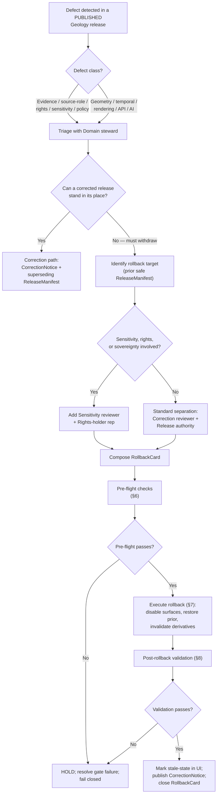

<!-- [KFM_META_BLOCK_V2]
doc_id: kfm://doc/runbooks/geology/rollback-runbook
title: Geology — Rollback Runbook
type: standard
version: v0.1
status: draft
owners: [TODO: confirm — Domain steward (Geology); Release authority; Correction reviewer; Docs steward]
created: 2026-05-12
updated: 2026-05-12
policy_label: public
related:
  - docs/doctrine/lifecycle-law.md
  - docs/doctrine/directory-rules.md
  - docs/domains/geology/README.md
  - docs/architecture/governed-api.md
  - docs/governance/separation-of-duties.md
  - release/manifests/
  - release/rollback_cards/
  - release/correction_notices/
  - data/rollback/
tags: [kfm, geology, rollback, runbook, release, correction]
notes:
  - PROPOSED runbook; no rollback drill has been verified against a mounted repo in this session.
  - Path placement follows Directory Rules §4 Step 3 (domain as segment in responsibility root).
[/KFM_META_BLOCK_V2] -->

# Geology — Rollback Runbook

> Rollback procedure for **Kansas Frontier Matrix** *Geology and Natural Resources* releases — restore a prior governed release, invalidate downstream derivatives, and emit auditable receipts when a published claim, layer, or artifact must be withdrawn.

<!-- Badges: placeholders until CI, policy, and release infrastructure are verified in a mounted repo. -->


<!-- TODO: replace with live Shields.io endpoints once CI, build, and release dashboards are wired. -->

**Status:** `draft` &nbsp;·&nbsp; **Owners:** *[TODO]* Domain steward (Geology), Release authority, Correction reviewer, Docs steward &nbsp;·&nbsp; **Last updated:** 2026-05-12

---

## Quick jump

- [1. Purpose and scope](#1-purpose-and-scope)
- [2. When to roll back vs. correct](#2-when-to-roll-back-vs-correct)
- [3. Roles and separation of duties](#3-roles-and-separation-of-duties)
- [4. Rollback decision flow](#4-rollback-decision-flow)
- [5. Required artifacts](#5-required-artifacts)
- [6. Pre-flight checks](#6-pre-flight-checks)
- [7. Execute the rollback](#7-execute-the-rollback)
- [8. Post-rollback validation](#8-post-rollback-validation)
- [9. UI and Evidence Drawer behavior](#9-ui-and-evidence-drawer-behavior)
- [10. Geology-specific sensitivity considerations](#10-geology-specific-sensitivity-considerations)
- [11. Cross-lane invalidation](#11-cross-lane-invalidation)
- [12. Rollback drills](#12-rollback-drills)
- [13. Anti-patterns](#13-anti-patterns)
- [14. Related docs](#14-related-docs)
- [15. Appendix](#15-appendix)

---

## 1. Purpose and scope

**CONFIRMED doctrine.** Every released claim, layer, catalog record, artifact, or Focus Mode answer in KFM must have a visible **correction path** and a **rollback target** before it is treated as safely publishable. A rollback is a *governed state transition* from a `PUBLISHED` release back to a prior safe release — never a silent file copy and never a hidden mutation of the canonical record.

**PROPOSED scope.** This runbook covers rollbacks of *Geology and Natural Resources* domain releases — `GeologicUnit`, `Lithology`, `StratigraphicInterval`, `GeologicAge`, `FaultStructure`, `Borehole`, `WellLog`, `CoreSample`, `GeophysicalObservation`, `GeochemistrySample`, `MineralOccurrence`, `ResourceDeposit`, `ExtractionSite`, `ReclamationRecord`, `CrossSection`, and `HydrostratigraphicUnit` — and the layer, tile, evidence drawer, and Focus Mode surfaces that depend on them.

**Out of scope.** Source admission, normalization, validation, and initial release belong in the corresponding `INGEST`, `VALIDATION`, and `RELEASE` runbooks. Incident response unrelated to a governed release belongs in `docs/security/`. Hydrology measurements, soils, hazards risk, and ownership/lease/permit/title claims are governed by their own lanes.

> [!IMPORTANT]
> **Geology is not an emergency or safety-of-life surface.** Resource estimates, deposit claims, and subsurface interpretations are governed evidence, not operational guidance. A rollback never substitutes for an official advisory, alert, or regulatory action.

[Back to top](#geology--rollback-runbook)

---

## 2. When to roll back vs. correct

KFM separates **correction** (publish a superseding release) from **rollback** (revert to a prior release). Both are governed transitions; the choice depends on whether the *current* release can stand while corrected, or whether it must be withdrawn first.

| Situation | Posture | Action |
|---|---|---|
| Released claim contains an error but evidence still supports a corrected version. | Correct in place. | Emit `CorrectionNotice`; publish superseding `ReleaseManifest`; invalidate derivatives. |
| Released claim has no current evidence-supported successor. | Withdraw first. | **Roll back** to prior safe release; emit `RollbackCard` + `CorrectionNotice`. |
| Sensitivity, rights, or sovereignty issue surfaced post-publication. | Withdraw immediately. | **Roll back**; sensitivity reviewer + rights-holder rep where applicable. |
| Release infrastructure error (`RELEASE_MANIFEST_INVALID`, `ROLLBACK_TARGET_MISSING`). | Withdraw the release. | **Roll back**; fix manifest; re-promote through normal gates. |
| AI Focus Mode template, citation binding, or policy binding produced uncited or unsafe output. | Withdraw the AI surface. | Kill-switch Focus Mode for the affected layer; **roll back** if a released artifact is implicated. |
| Stale evidence but the claim is not wrong. | Stale-state marker. | Mark stale in Evidence Drawer; correction or rollback only if substance is affected. |

**CONFIRMED doctrine.** A *stale* claim and a *wrong* claim are distinct. Rollback is the response to a release that is **wrong, withdrawn, or infrastructurally invalid** — not to staleness alone.

### Defect-class crosswalk (PROPOSED for Geology)

| Defect class | Geology example | Correction posture | Rollback posture |
|---|---|---|---|
| **Evidence gap** | `MineralOccurrence` published without resolvable `EvidenceBundle`. | ABSTAIN; withdraw unsupported claim. | Restore prior evidence-supported release. |
| **Source-role collapse** | `ResourceDeposit` cited as observation when source was an estimate. | Restore source role; re-validate. | Roll back if collapse is in published artifact. |
| **Rights** | KGS or KCC redistribution terms misclassified. | Quarantine the affected source; re-admit. | Roll back if material was published. |
| **Sensitivity** | Exact `Borehole` or `WellLog` location exposed past tier policy. | Generalize, redact, re-release. | Roll back immediately; emit `RedactionReceipt`. |
| **Geometry** | Cross-section linework misregistered against `GeologicUnit` polygons. | Re-promote with fix. | Roll back if user-visible. |
| **Temporal** | `GeologicAge` boundary attribution incorrect. | Correct; supersede. | Roll back if downstream interpretations propagate. |
| **Policy** | Gate produced `ALLOW` where `DENY` was required. | Fix policy bundle; revalidate. | Roll back the policy bundle; fail closed. |
| **Validation** | `Lithology` validator regression admitted invalid records. | Fix validator; re-validate cohort. | Roll back affected release; quarantine cohort. |
| **Rendering** | `LayerManifest` style mismatch leaks restricted attributes. | Style fix + re-release. | Roll back the layer; invalidate caches. |
| **API** | `GeologyDecisionEnvelope` returns `ANSWER` where `ABSTAIN` is required. | Adapter fix + re-release. | Roll back adapter; restore prior contract. |
| **AI output** | Focus Mode summarizes uncited Geology claim. | Disable template; require citation. | Roll back AI surface; emit `AIReceipt` audit. |

[Back to top](#geology--rollback-runbook)

---

## 3. Roles and separation of duties

**CONFIRMED doctrine.** Correction and rollback are *steward-significant*: the author or detector of the defect **must not** also approve the rollback. Separation rises with materiality and sensitivity.

| Role | Responsibility in rollback | Required for Geology? |
|---|---|---|
| **Detector / author** | Files the rollback request; surfaces evidence of the defect. | Yes. |
| **Domain steward (Geology)** | Owns geology contracts, validators, and rollback scoping. | Yes. |
| **Sensitivity reviewer** | Re-evaluates redaction, generalization, and tier for sensitive geology lanes (boreholes, well logs, resource exact locations). | When sensitive content is implicated. |
| **Rights-holder representative** | Confirms sovereignty / cultural / consent terms where applicable. | When indigenous, sovereign, or consent-bound content is implicated. |
| **Correction reviewer** | Reviews `CorrectionNotice` and `RollbackCard` before they amend a `PUBLISHED` claim. | Yes. |
| **Release authority** | Issues the rollback `ReleaseManifest`; authorizes the transition. **Must differ from the author when materiality applies.** | Yes for material releases. |
| **AI surface steward** | Reviews Focus Mode templates and AIReceipt audits if AI output is implicated. | When Focus Mode / Evidence Drawer AI surfaces are implicated. |
| **Docs steward** | Updates this runbook, related ADRs, and the drift register if convention changed. | After-the-fact. |

> [!NOTE]
> **Maturity note.** Directory Rules treat separation of duties as maturity-dependent. Early-stage, low-materiality rollbacks may be authored and approved by the same actor; sensitive-lane and high-materiality rollbacks require explicit separation. The enforcement tooling is **PROPOSED** and not verified in this session.

[Back to top](#geology--rollback-runbook)

---

## 4. Rollback decision flow

The diagram below is a **PROPOSED** decision flow grounded in lifecycle-law doctrine. Route names, queue names, and exact tooling are **UNKNOWN** until verified against a mounted repository.



> [!NOTE]
> **NEEDS VERIFICATION.** The diagram reflects lifecycle-law doctrine and the gate semantics described in the Atlas (Release / Correction / Rollback transitions). It does **not** reflect a verified queue name, workflow name, or service in any mounted repository.

[Back to top](#geology--rollback-runbook)

---

## 5. Required artifacts

**CONFIRMED doctrine.** A rollback transition is closed only when every required artifact (i) exists, (ii) resolves its dependencies, and (iii) records a policy-gate decision. Missing any of these means the transition **fails closed** and the prior state is preserved.

| Artifact | Purpose | PROPOSED home | Truth label |
|---|---|---|---|
| **`RollbackCard`** | Rollback decision record (target release, reason, scope, derivatives). | `release/rollback_cards/` | CONFIRMED doctrine / PROPOSED home |
| **`CorrectionNotice`** | Public notice of withdrawal or supersession. | `release/correction_notices/` | CONFIRMED doctrine / PROPOSED home |
| **`ReleaseManifest`** (target) | The prior safe release the rollback restores. | `release/manifests/` | CONFIRMED doctrine / PROPOSED home |
| **`ReviewRecord`** | Correction-reviewer + release-authority sign-off. | `release/reviews/` *(PROPOSED)* | NEEDS VERIFICATION |
| **`PolicyDecision`** | Gate outcome at rollback time (`ALLOW` / `DENY` / `ABSTAIN` / `ERROR`). | `data/receipts/policy/` *(PROPOSED)* | NEEDS VERIFICATION |
| **`CacheInvalidationRecord`** | What was invalidated (CDN, tile cache, search index) and why. | `data/receipts/cache/` *(PROPOSED)* | NEEDS VERIFICATION |
| **Rollback receipt / attestation** | Signed attestation that rollback was executed. | `data/rollback/` (data plane) | CONFIRMED doctrine / PROPOSED home |
| **Downstream-derivative invalidation list** | Catalog/index/triplet entries to invalidate. | Embedded in `RollbackCard`. | PROPOSED |

> [!IMPORTANT]
> **Rollback is pointer-based.** Per existing doctrine (`ML-057-047`), rollback should shift lineage / manifest pointers back to the prior safe artifact set rather than delete artifacts. Prior tile, COG, or GeoParquet artifacts referenced by a prior `MapReleaseManifest` should remain digest-addressed and retrievable.

[Back to top](#geology--rollback-runbook)

---

## 6. Pre-flight checks

Run **every** check before executing the rollback. Any failure HOLDs the rollback at the current state and surfaces a structured reason code.

| # | Check | Failure → reason code (PROPOSED) | Notes |
|---|---|---|---|
| 1 | **Target release is identified.** A prior `ReleaseManifest` digest is named in the `RollbackCard`. | `ROLLBACK_TARGET_MISSING` | If no prior safe release exists, correction (§2) is the only path. |
| 2 | **Target release is still safe.** Sensitivity, rights, and policy posture of the target release are still valid. | `SENSITIVITY_UNRESOLVED` / `RIGHTS_UNKNOWN` | A previously safe release can become unsafe if rights or sensitivity rules have since changed. |
| 3 | **EvidenceBundle dependencies still resolve.** Target `EvidenceRef`s resolve to `EvidenceBundle`s; `SourceDescriptor`s exist. | `MISSING_EVIDENCE` | Required by closure rule (resolution, not just reference). |
| 4 | **Downstream derivatives are enumerated.** All catalog / triplet / search-index / tile artifacts depending on the current release are listed. | `CORRECTION_DERIVATIVES_UNRESOLVED` | Without this list, invalidation cannot be complete. |
| 5 | **Separation of duties satisfied.** Author ≠ release authority where materiality applies; sensitivity reviewer + rights-holder rep where applicable. | `REVIEW_INSUFFICIENT` | See §3. |
| 6 | **Policy gate evaluates and records.** A `PolicyDecision` for the rollback action exists. | `RELEASE_MANIFEST_INVALID` | Closure rule (iii). |
| 7 | **No conflicting in-flight release.** No superseding release is currently mid-promotion for the same objects. | *(PROPOSED)* `INFLIGHT_CONFLICT` | Avoid race against the correction path. |
| 8 | **Kill-switch posture confirmed.** Geology layer kill-switch (if applicable) is set to fail closed for the affected layers. | *(PROPOSED)* `KILLSWITCH_UNSET` | Kill-switch blocks publication and prevents re-promotion before the rollback closes. |

> [!CAUTION]
> If any pre-flight check fails, **do not proceed**. The lifecycle invariant requires the system to fail closed and preserve the prior state. Surface the reason code, update the `RollbackCard`, and route back to triage.

[Back to top](#geology--rollback-runbook)

---

## 7. Execute the rollback

> [!WARNING]
> The commands below are **illustrative**. Real tool names, flags, and paths are **UNKNOWN** until verified against a mounted repository. Treat each step as a *governed action* — not a shell command — until the corresponding tool surface is confirmed.

### 7.1 Disable or withdraw public surfaces

1. **Set the geology layer kill-switch** for the affected `LayerManifest`(s) so the `GeologyDecisionEnvelope` and layer manifest resolver fail closed.
2. **Withdraw Focus Mode** templates that summarize the affected released `EvidenceBundle`(s) — Focus Mode must `DENY` or `ABSTAIN` until the rollback closes.
3. **Mark the Evidence Drawer** for affected `feature_id`s with a *withdrawal in progress* state. The Drawer reads released payloads only; the kill-switch and a withdrawn `ReleaseManifest` ensure no stale evidence is served.

```text
# Illustrative — verify against actual tooling before use
kfm release rollback start \
  --domain geology \
  --release-id <current_release_id> \
  --target-release-id <prior_safe_release_id> \
  --rollback-card release/rollback_cards/<rollback_card_id>.json
```

### 7.2 Restore the rollback target

1. **Update `release/manifests/`** so the active `ReleaseManifest` pointer for the affected Geology objects resolves to the **target** prior release's manifest digest.
2. **Restore catalog and triplet projections** for the target release. Per doctrine, rollback should shift lineage pointers rather than delete artifacts.
3. **Republish layer manifests** that referenced the rolled-back artifacts; affected `TileArtifactManifest`s point to the **target** digest.

```text
# Illustrative
kfm release manifest set-active \
  --domain geology \
  --manifest release/manifests/<target_release_id>.json
```

### 7.3 Invalidate derivatives

1. **CDN / tile cache invalidation** — emit a `CacheInvalidationRecord` listing the invalidated keys (tile URIs, style hashes, sprite digests).
2. **Search index** — drop or rebuild Geology search-index entries referencing the rolled-back release.
3. **Graph / triplet projection** — invalidate triples that depend on the rolled-back `EvidenceBundle`s.
4. **AI surface** — invalidate any `AIReceipt` indexes that referenced the rolled-back release; require re-resolution at next Focus Mode call.

### 7.4 Emit receipts and notices

1. **`RollbackCard`** — finalize with target release, reason, scope, separation-of-duties signatures, and invalidation list.
2. **`CorrectionNotice`** — publish so the public surface explains *what was withdrawn and why* without exposing sensitive detail.
3. **Rollback attestation / receipt** — write to `data/rollback/` (data plane) so the rollback is auditable.

[Back to top](#geology--rollback-runbook)

---

## 8. Post-rollback validation

A rollback is not closed until validation confirms the target state is the served state and no stale derivative leaks through.

| # | Validation | Method (PROPOSED) | Failure means |
|---|---|---|---|
| 1 | **Rollback replay test.** Re-run the rollback against the target manifest in a non-production environment. | Rollback drill fixture. | `ROLLBACK_TARGET_MISSING` or manifest divergence — re-open `RollbackCard`. |
| 2 | **Layer load test.** Public layer routes load the **target** `LayerManifest` digest, not the rolled-back one. | E2E smoke test on Geology layers. | Cache or CDN still serves stale; re-invalidate. |
| 3 | **Evidence Drawer test.** Drawer for affected `feature_id`s either resolves to the target `EvidenceBundle` or returns `DENY` / `ABSTAIN` with a remediation message. | Drawer fixture test. | Stale payload leak — escalate. |
| 4 | **Focus Mode test.** Focus Mode against the affected released claim returns `ABSTAIN` or cites the **target** evidence — never the withdrawn release. | Focus Mode citation validator. | Uncited or withdrawn citation — disable AI surface. |
| 5 | **Policy-gate negative tests.** Policy deny / abstain fixtures fire as expected for the rolled-back content. | Policy fixture suite. | Policy regression — fail closed; re-bundle policy. |
| 6 | **Citation validation.** All public citations point only to the **target** release. | `CitationValidationReport` over Geology surfaces. | Withdrawn citations still public — re-invalidate. |
| 7 | **Sensitivity recheck.** Borehole, well log, and exact-location surfaces honor the tier scheme. | Sensitive-geometry deny fixture. | Sensitivity leak — escalate to sensitivity reviewer + rights-holder rep. |
| 8 | **Cross-lane recheck.** Soil parent-material, hydrostratigraphy, hazards-context, and people/land-relation joins reflect the target release. | Cross-lane join fixture. | Cross-lane drift — invalidate affected joins. |

> [!TIP]
> Capture validation evidence in a `RollbackValidationReport` (PROPOSED) and link it from the `RollbackCard`. Without recorded validation, the rollback is not closed.

[Back to top](#geology--rollback-runbook)

---

## 9. UI and Evidence Drawer behavior

**CONFIRMED doctrine.** Public clients and normal UI surfaces use governed interfaces, not canonical/internal stores. During and after a rollback, the UI must remain truthful about what is currently released, what was withdrawn, and what evidence supports each claim.

| Surface | Behavior during rollback | Behavior after rollback |
|---|---|---|
| **Bedrock / surficial unit map** | Layer disabled by kill-switch; "release withdrawn" badge. | Loads target `LayerManifest` digest; freshness badge updated. |
| **Borehole / well-log generalized view** | Hide layer or show *withdrawn* badge. Never re-expose generalized geometry that was previously redacted. | Loads target generalized geometry; redaction receipt remains visible. |
| **Cross-section / stratigraphy view** | Inputs frozen at last validated state; "interpretation under review." | Loads target cross-section evidence; uncertainty badge intact. |
| **Mineral occurrence / deposit summary** | Show *withdrawn* + reason class (without sensitive detail). | Loads target summary; source-role badge restored. |
| **Extraction / reclamation context** | Hide layer or freeze. | Loads target; source attribution to KGS / KCC / federal regulators preserved. |
| **Evidence Drawer** | Returns `DENY` or `ABSTAIN` with a `CorrectionNotice` link for affected features. | Resolves to target `EvidenceBundle`; correction lineage visible. |
| **Focus Mode** | `DENY` or `ABSTAIN` with remediation; no uncited answer. | Cites only target evidence; `AIReceipt` records the rollback context. |
| **Search index** | Affected entries hidden until reindex against the target. | Reindexed; no withdrawn citation surfaces. |
| **Story / export** | Withdraw exports that referenced rolled-back evidence; emit replacement export receipts. | New exports cite target evidence only. |

[Back to top](#geology--rollback-runbook)

---

## 10. Geology-specific sensitivity considerations

**CONFIRMED / PROPOSED.** Exact borehole, sample, sensitive resource, well-log, and private well locations default to **restricted or generalized public geometry**. Occurrence, deposit, estimate, permit, production, and reserve claims must remain **distinct** — source-role collapse between an estimate and an observation is a rollback-triggering defect.

> [!CAUTION]
> If sensitivity, rights, or sovereignty is implicated, the rollback **must** include a sensitivity reviewer, and a rights-holder representative where applicable. Sensitive content is **not** re-exposed in the rolled-back UI surface — generalized or redacted views remain in effect, and a `RedactionReceipt` is preserved on the target release.

### Sensitive-lane checklist (PROPOSED)

- [ ] Source rights for Kansas Geological Survey (KGS), Kansas Corporation Commission (KCC), USGS, federal regulators, and private-source feeds are re-verified for the target release.
- [ ] Borehole / well-log exact locations remain generalized or restricted on the target.
- [ ] `Occurrence` / `Deposit` / `Estimate` / `Permit` / `Production` / `Reserve` claims remain distinguished in the target's contracts and Drawer payload.
- [ ] Living-person attribution (operator, landowner) is not re-introduced.
- [ ] Cross-lane joins (lease, parcel, operator → `ResourceDeposit`) do not silently re-publish private joins.

[Back to top](#geology--rollback-runbook)

---

## 11. Cross-lane invalidation

Geology relations cross into adjacent domains. Rolling back a Geology release may invalidate derivatives that other lanes depend on. Coordinate with adjacent stewards.

| Related lane | Relation | Rollback consequence (PROPOSED) | Owning steward to notify |
|---|---|---|---|
| **Soil** | Parent material / surficial context. | Re-derive soil-context badges that depended on the rolled-back surficial unit. | Soil domain steward. |
| **Hydrology** | Hydrostratigraphy and aquifer context (does **not** replace hydrology measurements). | Re-resolve hydrostratigraphic relations; do not invalidate hydrology measurements. | Hydrology domain steward. |
| **Hazards** | Fault / landslide / subsidence context (does **not** own risk). | Re-derive fault-context badges; ensure no risk claim was inferred from the rolled-back release. | Hazards domain steward. |
| **People / Land** | Lease / parcel / operator relation (cannot prove deposits). | Re-evaluate join evidence; deposit claims do not inherit truth from a parcel/lease. | People-DNA-Land steward. |
| **Map / UI shell** | `LayerManifest` consumers. | Layer registry refreshes; renderer reads only the target `MapReleaseManifest`. | UI / map shell owner. |
| **Governed AI / Focus Mode** | Released `EvidenceBundle` summarization. | Re-resolve AI surface; `AIReceipt` records rollback context. | AI surface steward. |

[Back to top](#geology--rollback-runbook)

---

## 12. Rollback drills

**CONFIRMED doctrine.** A rollback that has never been drilled is not a reliable rollback. Geology releases — especially those touching borehole, well-log, or resource-classification surfaces — should be drilled before they reach `PUBLISHED`.

### Drill cadence (PROPOSED)

| Trigger | Drill required? | Notes |
|---|---|---|
| First release of a new Geology object family. | Yes. | Document drill in the release `ReviewRecord`. |
| Change to sensitivity tier scheme or borehole/well-log public policy. | Yes. | Sensitivity reviewer attends. |
| Change to source role for KGS, KCC, USGS, or other Geology source families. | Yes. | Source steward attends. |
| Routine quarterly drill on the most-recent Geology release. | Recommended. | Establishes baseline rollback latency. |
| Material change to `release/`, `data/rollback/`, or rollback tooling. | Yes. | Docs steward updates this runbook. |

### Minimal drill content (PROPOSED)

1. Synthetic Geology candidate release with a fabricated defect (e.g., a source-role collapse on `ResourceDeposit`).
2. `RollbackCard` composed against a known prior safe release.
3. Pre-flight checks (§6) run end-to-end.
4. Rollback executed in a non-production environment.
5. Post-rollback validation (§8) run.
6. Drill receipt written to `data/rollback/` (data plane).

[Back to top](#geology--rollback-runbook)

---

## 13. Anti-patterns

> [!WARNING]
> The following are **rollback failure modes**. Each one violates lifecycle law, the trust membrane, or both.

- **Silent file copy.** Reverting `release/manifests/` by hand without a `RollbackCard`, `CorrectionNotice`, and rollback receipt. A rollback that is not auditable is not a rollback.
- **Promotion as rollback.** Calling a new forward promotion a "rollback" because it removes the bad release. This is a correction (§2), not a rollback, and it must follow correction discipline.
- **Author-approved rollback on a material release.** Skipping the correction reviewer or release authority because the defect was "obvious."
- **Stale derivative leak.** Closing the rollback before CDN, tile cache, search index, or graph projection invalidation completes.
- **Re-exposing redacted content.** Restoring a "prior safe" release whose redaction terms are no longer compliant with the current sensitivity scheme.
- **Source-role upgrade through rollback.** Treating a rollback as a chance to "fix" a source role from modeled → observed. Source role is fixed at admission and never upgraded.
- **AI surface left live.** Leaving Focus Mode or the Evidence Drawer pointing at the withdrawn release because "the model will figure it out." Cite-or-abstain requires the surface to `DENY` or `ABSTAIN`.
- **Kill-switch never tested.** A kill-switch that has never been exercised is not a kill-switch; it is a comment.
- **Aggregated rollback hides material per-place changes.** A bulk rollback that suppresses per-feature `CorrectionNotice`s collapses materiality and breaks downstream invalidation.

[Back to top](#geology--rollback-runbook)

---

## 14. Related docs

> [!NOTE]
> Paths below are **PROPOSED** per Directory Rules and the Domains Atlas. Their presence in any specific repo is **NEEDS VERIFICATION**.

- [`docs/doctrine/lifecycle-law.md`](../../doctrine/lifecycle-law.md) — RAW → PUBLISHED invariant and gate semantics.
- [`docs/doctrine/directory-rules.md`](../../doctrine/directory-rules.md) — placement protocol for runbooks and release artifacts.
- [`docs/domains/geology/README.md`](../../domains/geology/README.md) — Geology domain identity, scope, and boundary.
- [`docs/architecture/governed-api.md`](../../architecture/governed-api.md) — finite-outcome envelopes (`ANSWER` / `ABSTAIN` / `DENY` / `ERROR`).
- [`docs/governance/separation-of-duties.md`](../../governance/separation-of-duties.md) — *[TODO: confirm path]* role definitions and SoD matrix.
- [`docs/runbooks/geology/VALIDATION_RUNBOOK.md`](./VALIDATION_RUNBOOK.md) — *[TODO]* validation runbook (PROPOSED sibling).
- [`docs/runbooks/geology/INGEST_RUNBOOK.md`](./INGEST_RUNBOOK.md) — *[TODO]* ingest runbook (PROPOSED sibling).
- [`release/manifests/`](../../../release/manifests/) — `ReleaseManifest` home.
- [`release/rollback_cards/`](../../../release/rollback_cards/) — `RollbackCard` home.
- [`release/correction_notices/`](../../../release/correction_notices/) — `CorrectionNotice` home.
- [`data/rollback/`](../../../data/rollback/) — rollback receipts (data plane).
- [`docs/registers/VERIFICATION_BACKLOG.md`](../../registers/VERIFICATION_BACKLOG.md) — unresolved Geology rollback verification items.
- [`docs/registers/DRIFT_REGISTER.md`](../../registers/DRIFT_REGISTER.md) — repo vs. doctrine drift entries.

[Back to top](#geology--rollback-runbook)

---

## 15. Appendix

<details>
<summary><strong>A. PROPOSED rollback-relevant tree</strong></summary>

```text
release/
├── manifests/                       # ReleaseManifest (current and prior)
│   └── geology/<release_id>.json    # PROPOSED
├── rollback_cards/                  # RollbackCard
│   └── geology/<rollback_id>.json   # PROPOSED
├── correction_notices/              # CorrectionNotice
│   └── geology/<notice_id>.json     # PROPOSED
└── reviews/                         # ReviewRecord (PROPOSED)
    └── geology/<review_id>.json

data/
├── proofs/                          # EvidenceBundle (resolved support)
│   └── geology/                     # PROPOSED
├── receipts/
│   ├── policy/                      # PolicyDecision receipts (PROPOSED)
│   └── cache/                       # CacheInvalidationRecord (PROPOSED)
└── rollback/                        # Rollback attestations (data plane)
    └── geology/<receipt_id>.json    # PROPOSED

docs/
└── runbooks/
    └── geology/
        ├── ROLLBACK_RUNBOOK.md      # this file
        ├── VALIDATION_RUNBOOK.md    # PROPOSED sibling
        └── INGEST_RUNBOOK.md        # PROPOSED sibling
```

**NEEDS VERIFICATION.** None of these paths are claimed to exist in any specific repository state.

</details>

<details>
<summary><strong>B. Reason-code reference (PROPOSED)</strong></summary>

| Reason code | Gate(s) | Recovery path |
|---|---|---|
| `MISSING_RECEIPT` | Normalization / Validation / Catalog / Release | Re-emit missing receipt. |
| `MISSING_EVIDENCE` | Validation / Catalog / Release | Resolve `EvidenceRef` → `EvidenceBundle`. |
| `MISSING_REVIEW` | Catalog / Release | Run required review; supply `ReviewRecord`. |
| `SCHEMA_MISMATCH` | Normalization / Validation | Schema fix and/or ADR; re-run validator. |
| `CONTRACT_DRIFT` | Normalization / Validation | Restore contract; re-validate. |
| `RIGHTS_UNKNOWN` | Admission / Validation / Catalog / Release | Source-steward review; rights resolution. |
| `SENSITIVITY_UNRESOLVED` | Admission / Validation / Catalog / Release | Sensitivity reviewer; tier reassignment. |
| `ROLE_COLLAPSE` | Validation / Catalog / Release | Restore source role; refuse upcast. |
| `ROLE_DOWNCAST_FORBIDDEN` | Validation / Catalog / Release | Reject downcast; preserve original role. |
| `REVIEW_INSUFFICIENT` | Catalog / Release | Add separation; re-review. |
| `RELEASE_MANIFEST_INVALID` | Release | Manifest fix; re-promote. |
| `ROLLBACK_TARGET_MISSING` | Release / Rollback | Identify prior safe release or take correction path. |
| `CORRECTION_DERIVATIVES_UNRESOLVED` | Correction / Rollback | Enumerate and invalidate derivatives. |
| `CORRECTION_PRIOR_RELEASE_MISSING` | Correction | Supersession entry; locate prior release. |

</details>

<details>
<summary><strong>C. CONFIRMED doctrine references used</strong></summary>

This runbook is grounded in the following doctrinal sources from this session's project knowledge:

- **Lifecycle law** — RAW → WORK / QUARANTINE → PROCESSED → CATALOG / TRIPLET → PUBLISHED.
- **Lifecycle gates** — Admission, Normalization, Validation, Catalog closure, Release, Correction, Rollback.
- **Universal closure rule** — required artifacts must (i) exist, (ii) resolve dependencies, (iii) record policy-gate decision.
- **Trust membrane** — public clients use governed APIs only; no direct access to RAW / WORK / QUARANTINE / canonical / model runtimes.
- **Separation of duties** — author ≠ release authority when materiality applies; sensitivity reviewer + rights-holder rep for sensitive lanes.
- **Stale ≠ wrong** — stale-state markers and corrections are distinct lifecycles.
- **Rollback is pointer-based** — restore prior manifest; do not delete artifacts.
- **Geology sensitivity posture** — exact borehole/well-log/sample/sensitive-resource locations default to restricted or generalized; occurrence/deposit/estimate/permit/production/reserve remain distinct.

Specific implementation, tool names, route names, queue names, file paths, test names, and CI surfaces remain **PROPOSED / NEEDS VERIFICATION** until inspected against a mounted repository.

</details>

---

**Related docs:** [Lifecycle law](../../doctrine/lifecycle-law.md) · [Directory Rules](../../doctrine/directory-rules.md) · [Geology domain](../../domains/geology/README.md) · [Governed API](../../architecture/governed-api.md)

**Last updated:** 2026-05-12 &nbsp;·&nbsp; **Version:** v0.1 (draft) &nbsp;·&nbsp; [Back to top](#geology--rollback-runbook)
