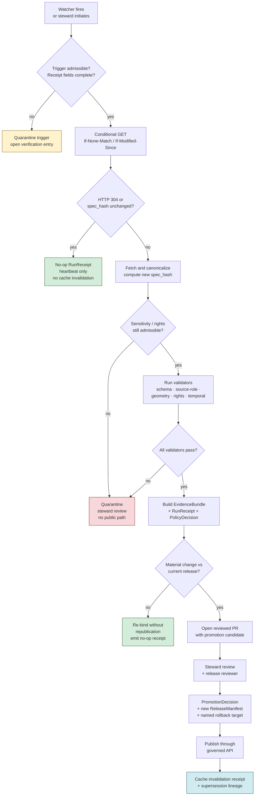

<!-- [KFM_META_BLOCK_V2]
doc_id: kfm://doc/runbook/geology/source-refresh
title: Geology Source Refresh Runbook
type: standard
version: v1
status: draft
owners: <Geology domain steward + Source-watcher steward + Docs steward> <!-- NEEDS VERIFICATION -->
created: 2026-05-12
updated: 2026-05-12
policy_label: public
related:
  - kfm://doc/doctrine/directory-rules
  - kfm://doc/domain/geology
  - kfm://doc/runbook/governed_ai_ROLLBACK
  - kfm://doc/architecture/trust-membrane
tags: [kfm, geology, runbook, source-refresh, watcher, lifecycle, evidence-first]
notes:
  - All routes, workflow paths, validator entry points, and CI job names are PROPOSED until verified against mounted-repo evidence.
  - Cadence and rights status per Geology source family are NEEDS VERIFICATION.
[/KFM_META_BLOCK_V2] -->

# Geology Source Refresh Runbook

> Governed procedure for re-admitting, validating, and (when justified) republishing Geology and Natural Resources sources without bypassing evidence, policy, release, correction, or rollback controls.


<!-- TODO: replace with verified Shields.io endpoints once repo CI is mounted -->

| Field | Value |
|---|---|
| **Owners** | Geology domain steward; Source-watcher steward; Docs steward <!-- NEEDS VERIFICATION --> |
| **Audience** | Domain stewards, source-watcher operators, release reviewers, on-call docs steward |
| **Status** | draft (doctrine CONFIRMED; implementation PROPOSED) |
| **Lifecycle invariant** | `RAW → WORK / QUARANTINE → PROCESSED → CATALOG / TRIPLET → PUBLISHED` |
| **Proposed path** | `docs/runbooks/geology/SOURCE_REFRESH_RUNBOOK.md` <!-- PROPOSED — see §2 in companion notes for alternate `docs/runbooks/geology_SOURCE_REFRESH.md` convention --> |
| **Last reviewed** | 2026-05-12 |

---

## Quick jump

- [1. Scope and intent](#1-scope-and-intent)
- [2. Repo fit and authority basis](#2-repo-fit-and-authority-basis)
- [3. Inputs that trigger this runbook](#3-inputs-that-trigger-this-runbook)
- [4. Exclusions](#4-exclusions)
- [5. Geology source family register](#5-geology-source-family-register)
- [6. Refresh decision flow](#6-refresh-decision-flow)
- [7. Pre-refresh checklist](#7-pre-refresh-checklist)
- [8. Refresh procedure](#8-refresh-procedure)
- [9. No-change path](#9-no-change-path-304--no-op-receipt)
- [10. Material-change path](#10-material-change-path-reviewed-pr-not-direct-publish)
- [11. Sensitivity, rights, and public-safe guardrails](#11-sensitivity-rights-and-public-safe-guardrails-geology-specific)
- [12. Validation gates](#12-validation-gates)
- [13. Rollback and reversal](#13-rollback-and-reversal)
- [14. Stale-state handling](#14-stale-state-handling)
- [15. Failure modes and anti-patterns](#15-failure-modes-and-anti-patterns)
- [16. Related docs](#16-related-docs)
- [17. Appendix](#17-appendix)

---

## 1. Scope and intent

This runbook tells a domain steward or source-watcher operator how to **detect, validate, and act on a possible change to a Geology and Natural Resources source** — Kansas Geological Survey (KGS) data and maps, KGS surficial geology, USGS NGMDB / GeMS, KGS oil and gas wells and production, KCC oil and gas regulatory data, KGS/KDHE WWC5 and water-well program, KGS LAS digital well logs and well tops, USGS MRDS, and 3DEP terrain context — **without bypassing the KFM trust membrane**.

> [!IMPORTANT]
> **CONFIRMED doctrine.** Watchers and refresh procedures **propose** new evidence and **detect material change**; they do **not** publish. A material change opens a reviewed PR or review packet; publication requires the full promotion gate chain (`SourceDescriptor` → schema validation → policy → `EvidenceBundle` closure → `PromotionDecision` → `ReleaseManifest` with a named `rollback target`). [DIRRULES, DOM-GEOL, ENCY]

The runbook applies to Geology specifically because the domain has lane-specific sensitivity, source-role, and rights constraints — particularly around exact borehole, well-log, sample, sensitive resource, and private-well locations, which default to restricted or generalized public geometry. [DOM-GEOL §I]

> [!NOTE]
> Throughout this document, **CONFIRMED** means doctrine grounded in attached project sources; **PROPOSED** means design or path placement not yet verified in a mounted repo; **NEEDS VERIFICATION** means checkable but not yet checked. Memory is not evidence.

[Back to top](#geology-source-refresh-runbook)

---

## 2. Repo fit and authority basis

| Aspect | Where | Status |
|---|---|---|
| **Responsibility root** | `docs/` — human-facing control plane (doctrine, runbooks, registers) | CONFIRMED rule |
| **Domain segment** | `geology/` as a **segment under a responsibility root**, never as a repo-root folder | CONFIRMED rule [DIRRULES §3] |
| **Proposed path** | `docs/runbooks/geology/SOURCE_REFRESH_RUNBOOK.md` | PROPOSED — placement consistent with §3 and §12 of Directory Rules; concrete on-disk presence not verified |
| **Alternate path under existing prefix convention** | `docs/runbooks/geology_SOURCE_REFRESH.md` (mirrors the `ui_LOCAL_DEV.md` / `governed_ai_ROLLBACK.md` form seen in the Whole-UI + Governed AI report) | PROPOSED — pick one and record in PR description, per `directory-rules.md` Step 5 |
| **Companion runbooks** | `docs/runbooks/geology/VALIDATION_RUNBOOK.md`, `docs/runbooks/geology/ROLLBACK_RUNBOOK.md` | PROPOSED — not yet authored |

**Directory Rules basis (cited per §4 Step 5):** Step 1 — primary responsibility is "Explains something to humans" → `docs/`. Step 2 — N/A (not under `data/`). Step 3 — Geology is a **domain segment**, not a root. Step 4 — `docs/runbooks/` already exists in the Whole-UI plan as a sibling of `docs/architecture/`, `docs/adr/`, and `docs/domains/`. Step 5 — cite §3 and §12 of Directory Rules in the PR.

[Back to top](#geology-source-refresh-runbook)

---

## 3. Inputs that trigger this runbook

A Geology source refresh cycle begins from one or more of the following inputs:

- A **dynamic source watcher** signal (conditional GET with `If-None-Match` / `If-Modified-Since`; ArcGIS `editingInfo` change; `ETag` / `Last-Modified` change; checksum or `spec_hash` change) — CONFIRMED watcher doctrine; concrete watcher entry-point paths PROPOSED.
- A **SourceDescriptor cadence expiry** marker recorded in the source register, raising a stale-source badge in the Evidence Drawer for affected Geology layers. [Stale-state markers — CONFIRMED]
- A **steward-initiated re-admission** when rights, sensitivity, source role, or interpretation version changes (e.g., a new KGS surficial geology map vintage, a corrected USGS NGMDB record, a re-vintaged USGS MRDS extract).
- A **CorrectionNotice** that names a Geology `EvidenceBundle` or downstream derivative for re-evaluation.
- A **schema or policy version drift** that requires re-binding existing Geology release candidates to a new schema or policy version.

> [!TIP]
> A watcher detection is **necessary but not sufficient** to start the runbook. If the watcher cannot record a `RunReceipt` with `source_url`, `etag` / `last_modified`, `spec_hash`, `artifacts`, and a signed provider identity, treat the trigger as **inadmissible** and quarantine it. [CONFIRMED — RunReceipt schema fields; SRC-063 evidence]

[Back to top](#geology-source-refresh-runbook)

---

## 4. Exclusions

This runbook **does not** cover:

| Out of scope | Belongs in |
|---|---|
| Initial admission of a never-before-seen Geology source family | `docs/runbooks/geology/SOURCE_ONBOARDING_RUNBOOK.md` (PROPOSED — not yet authored) |
| Schema or contract change for Geology objects (GeologicUnit, Borehole, etc.) | ADR in `docs/adr/`; schema home at `schemas/contracts/v1/domains/geology/` (PROPOSED per ADR-0001) |
| Cross-domain refresh choreography (e.g., when a Geology hydrostratigraphy refresh forces a Hydrology re-bind) | `docs/architecture/cross-lane-relations.md` (PROPOSED) |
| Emergency hazard alerting from extraction sites or fault structures | **Out of scope for KFM** — KFM does not replace official advisories or emergency alerting [DOM-HAZ, ENCY] |
| AI-summary regeneration over refreshed Geology evidence | `docs/runbooks/governed_ai_VALIDATION.md` (PROPOSED) |
| Tile re-baking after a material change | `docs/runbooks/tile_REBUILD_RUNBOOK.md` (PROPOSED) — invoked by §10 of this runbook, but the tile recipe lives there |

[Back to top](#geology-source-refresh-runbook)

---

## 5. Geology source family register

The following source families and their roles, rights, sensitivity, and cadence postures are **CONFIRMED in domain doctrine**; the per-source operational specifics (current endpoint URLs, current terms of use, last admitted vintage) are **NEEDS VERIFICATION** in a mounted source register.

| Source family | Role(s) | Rights / sensitivity | Freshness posture | Watcher class (PROPOSED) |
|---|---|---|---|---|
| Kansas Geological Survey data and maps | authority / observation / context / model — as source role requires | Rights and current terms **NEEDS VERIFICATION**; sensitive joins fail closed | source-vintage or cadence specific | `file` / `api` |
| KGS surficial geology and geologic maps | authority / observation / context / model | Rights and current terms **NEEDS VERIFICATION**; sensitive joins fail closed | source-vintage or cadence specific | `file` |
| USGS NGMDB and GeMS | authority / observation / context / model | Rights and current terms **NEEDS VERIFICATION**; sensitive joins fail closed | source-vintage or cadence specific | `stac` / `file` |
| KGS oil and gas wells and production | authority / observation / context / model | Rights and current terms **NEEDS VERIFICATION**; sensitive joins fail closed; **private well locations restricted by default** | source-vintage or cadence specific | `api` / `file` |
| KCC oil and gas regulatory data | authority / observation / context / model | Rights and current terms **NEEDS VERIFICATION**; sensitive joins fail closed | source-vintage or cadence specific | `api` |
| KGS / KDHE WWC5 and water-well program | authority / observation / context / model | Rights and current terms **NEEDS VERIFICATION**; **exact private water-well locations restricted by default** | source-vintage or cadence specific | `api` / `file` |
| KGS LAS digital well logs and well tops | authority / observation / context / model | Rights and current terms **NEEDS VERIFICATION**; **borehole and well-log details require rights review** | source-vintage or cadence specific | `file` |
| USGS MRDS | authority / observation / context / model | Rights and current terms **NEEDS VERIFICATION**; **exact mineral occurrence locations may require generalization** | source-vintage or cadence specific | `file` |
| USGS 3DEP terrain (context) | context | Public; terrain context only, not a Geology authority | program cadence | `stac` |

Source: [DOM-GEOL §D / kfm_encyclopedia §7.8 / Domains Atlas]. Per-source rights, endpoint, and cadence must be verified against a `data/registry/sources/geology/` entry **before** any refresh produces a public-touching artifact.

[Back to top](#geology-source-refresh-runbook)

---

## 6. Refresh decision flow



> [!NOTE]
> Diagram structure reflects CONFIRMED KFM doctrine (watcher-as-non-publisher, conditional-GET, no-change heartbeat, fail-closed quarantine, EvidenceBundle-before-release, named rollback target). Specific runner names, route paths, and PR-template fields are **PROPOSED** and require mounted-repo verification.

[Back to top](#geology-source-refresh-runbook)

---

## 7. Pre-refresh checklist

Before running any step in §8, the operator confirms:

- [ ] The source has a current `SourceDescriptor` in `data/registry/sources/geology/<source_id>/` (PROPOSED path) with **role**, **rights**, **sensitivity**, **cadence**, and **limitations** fields populated.
- [ ] The source's authority role is one of `authority`, `observation`, `context`, or `model`, and is **not** silently mixed across roles within a single descriptor.
- [ ] The source has a current `WatcherDescriptor` of type `stac`, `gtfs`, `tile`, `file`, or `api`, with a signed registry reference.
- [ ] The current `ReleaseManifest` for any affected Geology layer names a valid `rollback target`.
- [ ] No open `CorrectionNotice` blocks this source family.
- [ ] The Geology domain steward is reachable and has not declared a refresh freeze.

> [!CAUTION]
> If any item above fails, **do not proceed to §8**. Open a verification entry in `docs/registers/VERIFICATION_BACKLOG.md` (PROPOSED) and notify the Geology steward.

[Back to top](#geology-source-refresh-runbook)

---

## 8. Refresh procedure

The procedure below is **PROPOSED** in operational detail and **CONFIRMED** in shape. Concrete commands are illustrative; the canonical entry point lives under `tools/ingest/watchers/` (PROPOSED) once verified.

### 8.1 Step 1 — Conditional fetch

Use a conditional GET against the source endpoint. Store the previous validator(s) in the receipt ledger so the request can be replayed for audit.

```bash
# Illustrative — PROPOSED watcher entry point and arguments
# Replace with verified repo command after mounted-repo inspection.
tools/ingest/watchers/geology_watcher \
  --source-id <kgs|usgs_ngmdb|kgs_oilgas|kcc|wwc5|kgs_las|usgs_mrds> \
  --conditional \
  --emit-receipt
```

Outcomes:
- **HTTP 304 / no-change** → §9.
- **HTTP 200 / new bytes** → §8.2.
- **Network / auth / unknown** → quarantine; record `RunReceipt` with `outcome = ERROR`; do not proceed.

### 8.2 Step 2 — Canonicalize and hash

Canonicalize the response (RFC 8785 / JCS for JSON, deterministic byte hash for binary) and compute the new `spec_hash`.

> CONFIRMED doctrine: `spec_hash` is the canonical identity fingerprint; bundle and ref IDs derive deterministically from it. A mismatched or absent `spec_hash` at any gate is a fail-closed condition.

### 8.3 Step 3 — Quarantine and validate

Normalize schema, geometry, time, identity, evidence, rights, and policy. **Hold failures in quarantine; do not promote.**

| Validator | What it checks | Failure outcome |
|---|---|---|
| Schema validation | `SourceDescriptor`, candidate Geology object schemas under `schemas/contracts/v1/domains/geology/` (PROPOSED) | quarantine |
| Source-role validator | role is one of authority / observation / context / model; no silent mixing | quarantine |
| Rights validator | rights/license status known and admissible | quarantine — fail closed on unknown rights |
| Sensitivity validator | exact borehole, sample, well-log, private well, sensitive resource locations are restricted or generalized | quarantine |
| Geometry validity | CRS declared; geometry valid; public-safe generalization receipt where required | quarantine |
| Temporal logic | `source`, `observed`, `valid`, `retrieval`, `release`, `correction` times remain distinct where material | quarantine |
| Evidence closure | every claim resolves to an `EvidenceBundle`; no orphan refs | quarantine — `ABSTAIN` |
| Resource-class anti-collapse | `MineralOccurrence`, `ResourceDeposit`, `ResourceEstimate`, `ExtractionSite`, `ReclamationRecord` remain semantically distinct | quarantine |

### 8.4 Step 4 — Materiality decision

Compare new `spec_hash` and downstream derivatives against the current `ReleaseManifest`. A **material change** is one or more of:

- new or removed `GeologicUnit` / `SurficialUnit` / `StructureFeature` geometry,
- changed lithology / age / stratigraphic interval semantics,
- changed source role or rights status,
- changed sensitivity class,
- changed interpretation version or uncertainty,
- removed or added `Borehole` / `WellLog` references that affect publishable derivatives.

A **non-material change** (e.g., publisher rebuild with stripped validators, unchanged canonical bytes) → §9.

### 8.5 Step 5 — Build proof bundle

Emit, in this order:

1. `RunReceipt` (source URL, `etag`, `last_modified`, `spec_hash`, artifacts, provider, tool versions, signatures).
2. `EvidenceBundle` updates for affected objects.
3. `ValidationReport` summarizing the gates from §8.3.
4. `PolicyDecision` with explicit outcome (`allow` / `deny` / `abstain` / `error`) and obligations.
5. Candidate `LayerManifest`, `StyleManifest`, `TileArtifactManifest`, and a `MapReleaseManifest` candidate — for any visible layer.

### 8.6 Step 6 — Open a reviewed PR

A material-change refresh **MUST** route through a reviewed PR (or review packet equivalent). Watchers, automation, or AI summaries **MUST NOT** directly publish refreshed artifacts. See §10.

[Back to top](#geology-source-refresh-runbook)

---

## 9. No-change path (304 / no-op receipt)

When the conditional GET returns 304, or when the canonical `spec_hash` is unchanged:

1. Emit a **no-op `RunReceipt`** as a heartbeat with `outcome = no_change`.
2. **Do not** rebuild tiles. Do not invalidate caches. Do not emit new STAC, DCAT, or PROV entities for the unchanged content.
3. Reset the stale-source badge cadence clock for affected Geology layers.

> [!TIP]
> The no-op receipt is part of the audit trail. Auditors should be able to see that the system observed and *elected not to act*. Missing no-op receipts make it impossible to distinguish "watcher fired and saw no change" from "watcher never fired."

[Back to top](#geology-source-refresh-runbook)

---

## 10. Material-change path (reviewed PR, not direct publish)

### 10.1 PR payload minimum

A geology source-refresh PR opens against `main` (or the release branch under review) and **MUST** include:

- the new `RunReceipt(s)`,
- the new or updated `EvidenceBundle(s)`,
- the `ValidationReport`,
- the `PolicyDecision`,
- candidate `LayerManifest` / `StyleManifest` / `TileArtifactManifest` deltas,
- a candidate `MapReleaseManifest` with an explicit **rollback target** naming the prior `release_id`, `artifact_digests`, and `cache_keys`,
- a one-paragraph **materiality narrative** explaining what changed and why it warrants public refresh,
- any required **redaction / generalization receipts** for sensitive geometry.

### 10.2 Reviewers required

- Geology domain steward (semantic and uncertainty review).
- Source-watcher steward (provenance, `spec_hash`, conditional-fetch correctness).
- Release reviewer (separation of duty when maturity justifies it; CONFIRMED doctrine).
- Policy reviewer if rights, sensitivity, or source role changed.

### 10.3 Promotion gate sequence

```mermaid
flowchart LR
    A[PR opened] --> B[Identity gate<br/>spec_hash + source HEAD]
    B --> C[Schema + source-role gate]
    C --> D[Rights + sensitivity gate]
    D --> E[Geometry + temporal gate]
    E --> F[Evidence closure gate]
    F --> G[Catalog closure gate]
    G --> H[PromotionDecision<br/>by release reviewer]
    H --> I[ReleaseManifest<br/>+ rollback target]
    I --> J[Publish via governed API]
```



Any gate failure routes the PR to **deny / abstain** with reasons recorded. No gate may be bypassed by automation or AI commentary. [CONFIRMED — Promotion Gates A–G doctrine; SRC-057 verify-attestation gate evidence]

### 10.4 Cache and lineage

On successful promotion:

- Record a **cache invalidation receipt** naming what was invalidated and why.
- Update **supersession lineage**: the prior `SourceDescriptor`, `EvidenceBundle`, and `ReleaseManifest` are retained with `superseded_by` links — never deleted.
- Rollback by **shifting tile / artifact lineage pointers** to the prior set, not by deleting artifacts. [CONFIRMED — SRC-057 rollback pattern]

[Back to top](#geology-source-refresh-runbook)

---

## 11. Sensitivity, rights, and public-safe guardrails (Geology-specific)

> [!WARNING]
> **CONFIRMED domain doctrine.** Exact borehole, sample, sensitive resource, well-log, and private well locations default to **restricted or generalized** public geometry. `MineralOccurrence`, `ResourceDeposit`, `ResourceEstimate`, `ExtractionSite`, `ReclamationRecord`, permit, production, and reserve claims **MUST remain distinct** and **MUST NOT** be silently collapsed. [DOM-GEOL §I]

The runbook enforces this via fail-closed defaults at the validation gate (§8.3) and at the policy gate (§10.3 step D):

- **Unknown rights** → DENY public release until source terms and redistribution class are recorded.
- **Sensitive geometry** → default to redaction / generalization with an emitted `RedactionReceipt`; never publish exact geometry without a steward decision recorded as evidence.
- **Resource-class collapse attempt** → DENY; surface the conflict to the Geology steward.
- **Stale source past freshness cadence** → mark dependent claims stale; do not refresh silently into release.
- **Rights change detected** → re-evaluate tier; potentially downgrade; emit `CorrectionNotice` if material.

> [!NOTE]
> Geology shares boundaries with **Hydrology** (hydrostratigraphy and aquifer context — relation only, not measurement), **Soil** (parent material and surficial context), **Hazards** (fault / landslide / subsidence context — Geology does not own risk), and **People / Land** (lease, parcel, operator relations cannot prove deposits). Cross-lane relations must preserve ownership, source role, sensitivity, and `EvidenceBundle` support. [DOM-GEOL §F]

[Back to top](#geology-source-refresh-runbook)

---

## 12. Validation gates

| Gate | Required check | Status |
|---|---|---|
| Schema validation | `SourceDescriptor`, candidate Geology object schemas, `LayerManifest`, `EvidenceBundle`, `PolicyDecision`, `PromotionDecision`, `RunReceipt` all validate | PROPOSED — schema homes under `schemas/contracts/v1/...` per ADR-0001 (default) |
| Source ledger completeness | Every public Geology layer `source_id` resolves to a ledgered `SourceDescriptor` with rights, sensitivity, authority role, cadence, limitations | PROPOSED |
| Public-safe geometry | Exact borehole / sample / well-log / private-well / sensitive-resource location fixture fails before any public artifact emit | PROPOSED |
| Resource-class anti-collapse | Negative fixture proving `MineralOccurrence` ≠ `ResourceEstimate` ≠ `ExtractionSite` at admission and at promotion | PROPOSED |
| Borehole / well-log rights | Negative fixture proving rights-unknown borehole cannot publish | PROPOSED |
| No public RAW path | Browser test confirms no `RAW` / `WORK` / `QUARANTINE` / candidate / canonical direct fetch | PROPOSED |
| No unreleased tile load | Map shell refuses tile / style / sprite / glyph artifacts not listed in `MapReleaseManifest` | PROPOSED |
| No-change regression | 304 / no-change response does not create new STAC / DCAT / PROV entities | PROPOSED |
| Sensitive geometry deny | Exact sensitive geometry fixture fails before tile build or public release | PROPOSED |
| Conditional-fetch + canonical-hash + receipt + policy | Receipt before any tile / catalog update | PROPOSED — pattern CONFIRMED (SRC-063) |

[Back to top](#geology-source-refresh-runbook)

---

## 13. Rollback and reversal

Rollback **MUST** be available for every refresh that touches a `PUBLISHED` Geology layer.

| Step | Action | Artifact |
|---|---|---|
| 1 | Identify the affected `release_id` and its prior `release_id` | `ReleaseManifest`, `rollback target` |
| 2 | Verify the prior release's artifacts are still resolvable by digest | `TileArtifactManifest`, `LayerManifest` |
| 3 | Shift lineage / catalog references back to the prior `tile_id` / `checksum` sets — **do not delete** the new artifacts | `rollback target` |
| 4 | Emit a **rollback receipt** and update the supersession chain | `RunReceipt`, supersession entry |
| 5 | Issue a `CorrectionNotice` if the reverted release had public impact | `CorrectionNotice` |
| 6 | Update cache invalidation record with rollback context | cache invalidation receipt |
| 7 | Notify the Geology steward and (if Focus Mode answers depended on the reverted evidence) the AI surface steward | runbook log |

> [!IMPORTANT]
> A rollback drill should be rehearsed against a dry-run release at least once per release window. [CONFIRMED — encyclopedia PR-10 rollback drill]

[Back to top](#geology-source-refresh-runbook)

---

## 14. Stale-state handling

KFM separates **stale** (evidence past its declared tolerance) from **wrong** (substance is incorrect). This runbook handles stale states without silently refreshing them into the public surface.

| Marker | Triggered by | Required action |
|---|---|---|
| Source freshness expired | `SourceDescriptor` cadence passed without a new admission | Re-admit (run this runbook) or supersede; otherwise mark dependent Geology claims stale |
| Schema version drift | Geology object schema upgraded past published claim | Migrate, re-validate, re-release; or mark stale |
| Geography version drift | `GeographyVersion` replaced; published claim still bound to prior version | Rebind to current `GeographyVersion`; re-release; or mark stale |
| Rights status changed | Rights change in `SourceDescriptor` or rights-holder communication | Re-evaluate tier; possibly downgrade; emit `CorrectionNotice` if necessary |
| Policy version changed | Policy referenced by `PolicyDecision` was superseded | Re-run gate; potentially supersede release |

[CONFIRMED — Atlas v1.1 §24.8 stale-state markers]

[Back to top](#geology-source-refresh-runbook)

---

## 15. Failure modes and anti-patterns

> [!CAUTION]
> Each of the following is a known KFM anti-pattern. Do not let urgency, fluency, or automation convenience override these.

| Anti-pattern | Why it's wrong | Counter-rule |
|---|---|---|
| Watcher auto-publishes refreshed artifacts | Collapses generation and approval into one unreviewed path | Watchers open reviewed PRs only; promotion is a governed state transition, not a file move |
| Direct browser fetch of refreshed canonical / RAW Geology data | Bypasses trust membrane | Standard clients read only governed APIs and released artifacts |
| Silent `ResourceEstimate` / `ExtractionSite` / `MineralOccurrence` collapse | Erases evidence boundaries; produces false claims | Resource-class anti-collapse validator must fail closed |
| Exact borehole / well-log / private-well location in a public-touching artifact | Privacy and rights breach | Default to restricted or generalized geometry with a `RedactionReceipt` |
| No-op refresh that still triggers cache invalidation and STAC churn | Wastes review attention; produces false stale-source signals | 304 / no-change path emits heartbeat only |
| AI text generated over unreleased Geology evidence | Generation substitutes for evidence; cite-or-abstain broken | Focus Mode reads only released `EvidenceBundles`; abstain otherwise |
| Rollback by deleting the new artifacts | Loses lineage and audit trail | Rollback shifts lineage pointers; new artifacts retained as superseded |
| Treating an attached PDF or prior plan as proof of current refresh behavior | Confuses planning evidence with implementation evidence | Path / behavior claims are PROPOSED until verified in the mounted repo |

[Back to top](#geology-source-refresh-runbook)

---

## 16. Related docs

- `docs/doctrine/directory-rules.md` — CONFIRMED placement authority.
- `docs/domains/geology/README.md` — Geology domain README (PROPOSED — author or verify).
- `docs/runbooks/geology/VALIDATION_RUNBOOK.md` — companion validation runbook (PROPOSED — not yet authored).
- `docs/runbooks/geology/ROLLBACK_RUNBOOK.md` — companion rollback runbook (PROPOSED — not yet authored).
- `docs/runbooks/governed_ai_VALIDATION.md` — Focus Mode evidence / citation / policy validation (PROPOSED — referenced from the Whole-UI report).
- `docs/runbooks/governed_ai_ROLLBACK.md` — AI adapter rollback and kill switch (PROPOSED — referenced from the Whole-UI report).
- `docs/architecture/trust-membrane.md` — trust-membrane doctrine (PROPOSED — verify exact filename).
- `docs/adr/ADR-0001-schema-home.md` — schema-home decision record (PROPOSED — verify exact filename).
- `docs/registers/DRIFT_REGISTER.md` — drift entries (PROPOSED).
- `docs/registers/VERIFICATION_BACKLOG.md` — open verification items (PROPOSED).

[Back to top](#geology-source-refresh-runbook)

---

## 17. Appendix

<details>
<summary><strong>A. Geology canonical object families (CONFIRMED — DOM-GEOL §C)</strong></summary>

`GeologicUnit`, `Lithology`, `StratigraphicInterval`, `GeologicAge`, `FaultStructure`, `Borehole`, `WellLog`, `CoreSample`, `GeophysicalObservation`, `GeochemistrySample`, `MineralOccurrence`, `ResourceDeposit`, `ExtractionSite`, `ReclamationRecord`, `CrossSection`, `HydrostratigraphicUnit`.

Each carries source role, evidence, time, sensitivity, and release-state constraints. Identity is **PROPOSED** as: `source id + object role + temporal scope + normalized digest`.

</details>

<details>
<summary><strong>B. RunReceipt fields (CONFIRMED shape — schema home PROPOSED)</strong></summary>

```text
RunReceipt
├── run_id
├── source_url
├── source_head
│     ├── etag
│     ├── last_modified
│     └── content_length
├── spec_hash
├── inputs
├── outputs
├── tool_versions
├── actor (provider / runner identity)
├── timestamps
└── signatures
```

Schema home (PROPOSED): `schemas/contracts/v1/proofs/run_receipt.schema.json`.

</details>

<details>
<summary><strong>C. Illustrative no-network dry-run receipt</strong></summary>

> The block below is **illustrative**, not sourced from a verified repo fixture. Do not treat it as a schema specimen.

```json
{
  "kfm_spec_version": "vNext",
  "run_id": "rr-geology-kgs-surficial-2026-05-12-001",
  "policy_id": "geology.source.refresh.v1",
  "source_url": "https://example.org/kgs/surficial.geojson",
  "source_head": {
    "etag": "\"abc123\"",
    "last_modified": "2026-05-08T00:00:00Z",
    "content_length": 1024000
  },
  "spec_hash": "<sha256>",
  "outcome": "no_change",
  "timestamp": "2026-05-12T00:00:00Z",
  "evidence_refs": [],
  "obligations": []
}
```

</details>

<details>
<summary><strong>D. Open verification items</strong></summary>

- **NEEDS VERIFICATION** — current endpoint URLs and terms-of-use for each Geology source family.
- **NEEDS VERIFICATION** — cadence values per `SourceDescriptor` (KGS, USGS NGMDB, KGS oil & gas, KCC, WWC5, KGS LAS, USGS MRDS).
- **NEEDS VERIFICATION** — whether the canonical Geology runbook path is `docs/runbooks/geology/SOURCE_REFRESH_RUNBOOK.md` (subdirectory form) or `docs/runbooks/geology_SOURCE_REFRESH.md` (prefix form). Resolve and record per Directory Rules §4 Step 5.
- **NEEDS VERIFICATION** — exact CI workflow filename for the Geology watcher + promotion path.
- **NEEDS VERIFICATION** — whether `data/registry/sources/geology/` or `data/registry/geology/` is the live convention.
- **PROPOSED** — companion runbooks `VALIDATION_RUNBOOK.md` and `ROLLBACK_RUNBOOK.md` under `docs/runbooks/geology/`.

</details>

---

**Last updated:** 2026-05-12 · **Doctrine basis:** CONFIRMED · **Implementation basis:** PROPOSED · [Back to top](#geology-source-refresh-runbook)
