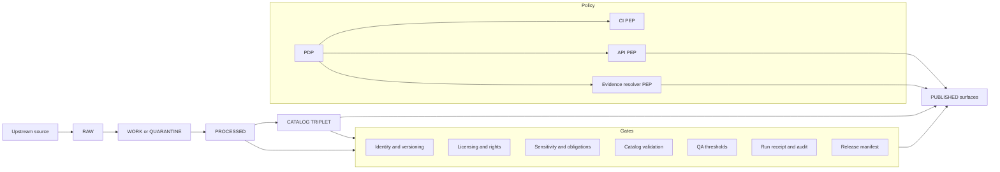

<!-- [KFM_META_BLOCK_V2]
doc_id: kfm://doc/70585ce9-59f9-44ea-bf22-5ce6270ea673
title: Governance Runbooks
type: standard
version: v1
status: draft
owners: KFM Governance Stewards
created: 2026-03-02
updated: 2026-03-02
policy_label: restricted
related:
  - docs/runbooks/README.md
  - docs/runbooks/governance/
tags: [kfm, runbooks, governance]
notes:
  - This directory defines how KFM governance intent becomes enforceable, testable operations.
  - Keep this folder safe to linkcheck (avoid links to non-existent files).
[/KFM_META_BLOCK_V2] -->

<a id="top"></a>

# Governance Runbooks
Operational playbooks that turn KFM governance intent into **repeatable, auditable, fail-closed** actions.


**Owners:** KFM Governance Stewards  
**Where:** `docs/runbooks/governance/`  
**Audience:** stewards/reviewers, operators, contributors who touch data promotion, policy, publishing, or trust surfaces

---

## Navigate
- [Why this directory exists](#why-this-directory-exists)
- [Directory contract](#directory-contract)
- [Runbook registry](#runbook-registry)
- [KFM governance invariants](#kfm-governance-invariants)
- [Standard workflows](#standard-workflows)
- [Templates](#templates)
- [Roles and escalation](#roles-and-escalation)
- [Minimum verification steps](#minimum-verification-steps)
- [Appendix: governance flow diagram](#appendix-governance-flow-diagram)

---

## Why this directory exists
KFM governance is not “documentation about rules.” It is **operational behavior**: what must happen (and what must *not* happen) when we:

- onboard or update data,
- assign policy labels and redaction obligations,
- publish Story Nodes,
- answer via Focus Mode,
- respond to sensitive-data or trust incidents.

> **Non-negotiable posture**
> - **Fail closed** when evidence, policy, licensing, or validation is missing.
> - **Citations are EvidenceRefs**, not pasted URLs: claims must resolve into inspectable EvidenceBundles.
> - **Trust membrane**: UI/clients do not bypass governed APIs/policy boundaries.

[Back to top](#top)

---

## Directory contract

### Purpose
This folder contains **governance runbooks**: step-by-step procedures + checklists + required artifacts for governed events.

### Acceptable inputs
- Runbooks in Markdown describing **when-to-use**, **inputs**, **steps**, **outputs**, **rollback**, and **audit trail**.
- Checklists that map directly to gates and contract requirements.
- Templates (JSON/YAML) for governance artifacts (policy decision records, receipts, manifests).
- Small, linkcheck-safe diagrams (Mermaid preferred).
- “Definition of Done” (DoD) for governance actions.

### Exclusions
- ❌ Secrets, tokens, private keys, or environment credentials
- ❌ Raw datasets / PII / sensitive coordinates / restricted content dumps
- ❌ Ad-hoc notes without an operational “entry point” (use an ADR or ticket system)
- ❌ Policy code itself (that belongs in the policy bundle location; reference it, don’t duplicate it)
- ❌ Links to files that do not exist (assume linkcheck in CI)

[Back to top](#top)

---

## Runbook registry
This is the *index* of governed actions. Add a row when you add a runbook.

> NOTE: Paths below are shown as code (not links) to avoid broken-link failures until the runbooks exist.

| Runbook ID | Trigger / when to use | Primary actor | Outputs (must exist) | Doc path |
|---|---|---|---|---|
| GOV-DATA-PROMOTE | Promote a DatasetVersion to governed runtime | Steward + Operator | promotion manifest, run receipt(s), validated catalogs, policy decision | `docs/runbooks/governance/data_promotion.md` |
| GOV-POLICY-CHANGE | Change policy semantics (allow/deny/obligations) | Steward | policy decision record, fixture tests updated, CI green | `docs/runbooks/governance/policy_change.md` |
| GOV-REDACTION | Create/approve a generalized/public-safe derivative | Steward | redaction plan, PROV entry, obligations, QA report | `docs/runbooks/governance/redaction_generalization.md` |
| GOV-STORY-PUBLISH | Publish Story Node with citations | Reviewer/Steward | review_state, resolvable citations, audit ref | `docs/runbooks/governance/story_publish.md` |
| GOV-FOCUS-RELEASE | Change Focus Mode behavior / prompts / retrieval | Steward + Eng | eval harness results, golden diffs, policy checks | `docs/runbooks/governance/focus_mode_release.md` |
| GOV-INCIDENT-TRUST | Suspected trust break (leak, bypass, broken gates) | Operator + Steward | incident report, containment action, postmortem | `docs/runbooks/governance/trust_incident.md` |
| GOV-EMERGENCY-STOP | Emergency halt on promotions/publishing | Steward | kill-switch activation record, comms log | `docs/runbooks/governance/emergency_stop.md` |

[Back to top](#top)

---

## KFM governance invariants

### Truth path zones
All data and derived products flow through **zones** with distinct rules.

| Zone | What it means | What belongs here (examples) | Mutability |
|---|---|---|---|
| RAW | immutable acquisition copy + checksums | upstream snapshots, fetch logs, license terms snapshot | append-only |
| WORK / QUARANTINE | intermediate transforms + QA + sensitivity review | normalization outputs, QA reports, candidate redactions | rewritable |
| PROCESSED | publishable artifacts w/ stable IDs and digests | GeoParquet, COG, PMTiles, derived layers | immutable per version |
| CATALOG TRIPLET | DCAT + STAC + PROV describing assets and lineage | catalog JSON, PROV bundles, link maps | versioned |
| PUBLISHED | governed runtime surfaces via API/UI | API responses, tiles, stories, Focus answers (with receipts) | governed only |

### Promotion Contract
**Promotion is blocked unless minimum gates are met.** Treat the gates as automatable CI checks plus steward sign-off.

| Gate | What must be present | “Fail closed” example |
|---|---|---|
| A — Identity & versioning | dataset IDs, deterministic spec hash, artifact digests | block if hash drifts or IDs missing |
| B — Licensing & rights | license/rights fields + snapshot of upstream terms | block if license unknown/unclear |
| C — Sensitivity & redaction | policy label + obligations (generalize geometry, remove fields) | block if obligations not applied |
| D — Catalog triplet validation | DCAT/STAC/PROV validate and cross-link | block on broken links or missing IDs |
| E — QA & thresholds | dataset-specific QA checks + thresholds documented | quarantine if thresholds fail |
| F — Run receipt & audit record | receipt captures inputs, tooling, hashes, policy decisions | block if receipt missing/invalid |
| G — Release manifest | promotion recorded as manifest referencing digests | block if manifest mismatches |

### Evidence resolution contract
“Citations” are **EvidenceRefs** that must resolve (policy-allowed) into an **EvidenceBundle** containing enough metadata/artifacts/provenance to inspect and reproduce the claim.

- If citations cannot be verified: **abstain** or **narrow scope**.
- Publishing (Story) and answering (Focus Mode) are governed runs: both must emit/attach audit references.

### Policy-as-code posture
- CI and runtime must share policy semantics (or at minimum: same fixtures and same outcomes).
- UI displays policy badges/notices; **UI never decides policy**.

[Back to top](#top)

---

## Standard workflows
These are *patterns*; each runbook must specify exact repo commands and exact artifact locations.

### 1) Dataset promotion (PR-based)
**Entry:** a DatasetVersion candidate exists in PROCESSED + CATALOG TRIPLET.  
**Exit:** version is promoted to PUBLISHED and discoverable via governed API.

Checklist:
- [ ] Gate A satisfied (IDs, hashes, digests stable)
- [ ] Gate B satisfied (license and terms snapshot present)
- [ ] Gate C satisfied (policy_label assigned; obligations documented and applied)
- [ ] Gate D satisfied (DCAT/STAC/PROV validate; links cross-check)
- [ ] Gate E satisfied (QA report present; thresholds met)
- [ ] Gate F satisfied (run receipt generated; audit record append-only)
- [ ] Gate G satisfied (release/promotion manifest recorded)

Rollback principle:
- Prefer **superseding** with a new version over mutating artifacts.
- If a published version is found unsafe, quarantine and publish a safe replacement (policy may deny access immediately).

### 2) Policy change
**Entry:** change request for allow/deny/obligation behavior.  
**Exit:** policy updated with tests and an explicit decision record.

Checklist:
- [ ] Update policy fixtures (allow/deny + obligations cases)
- [ ] Run policy tests (must block merges if failing)
- [ ] Validate no restricted leakage in public contexts
- [ ] Record a policy decision (who/why/what changed, and risk)

### 3) Story publishing
**Entry:** Story Node draft with citations and map state.  
**Exit:** story is published with review_state and resolvable citations.

Checklist:
- [ ] All citations resolve via evidence resolver
- [ ] Rights for any embedded media are explicit
- [ ] Sensitive locations are not exposed unless explicitly allowed
- [ ] Review state captured; audit ref attached

### 4) Focus Mode release discipline
**Entry:** any change that could alter Focus Mode answers (retrieval rules, citation rules, output schema).  
**Exit:** evaluation harness passes; regressions reviewed; policy gates intact.

Checklist:
- [ ] Golden queries re-run and diffs reviewed
- [ ] “Cite or abstain” behavior unchanged unless explicitly approved
- [ ] Output schema validation enforced (missing citations => deny)

[Back to top](#top)

---

## Templates
These are *starter* structures. Runbooks should point to the canonical schema definitions (not duplicated here).

### Policy decision record (starter)
```yaml
decision_id: kfm://policy/decision/2026-03-02.example
date: 2026-03-02
status: draft|approved|rejected
owners:
  - role: steward
    name: TBD
scope:
  policy_area: licensing|sensitivity|authz|evidence|publishing
  affected_surfaces: [ci, api, evidence_resolver, ui]
decision:
  summary: >
    What changed and why.
  change_type: tighten|loosen|refactor|clarify
  default_posture: deny
risk:
  primary_risks:
    - leakage
    - licensing_violation
    - bypass
verification:
  required_tests:
    - policy_fixtures
    - contract_tests
    - no_restricted_leakage
rollout:
  flags_or_phases: []
audit:
  references: []
```

### Evidence bundle (illustrative shape)
```json
{
  "bundle_id": "sha256:bundle...",
  "dataset_version_id": "YYYY-MM.hash",
  "title": "Evidence card title",
  "policy": {
    "decision": "allow",
    "policy_label": "public",
    "obligations_applied": []
  },
  "license": { "spdx": "CC-BY-4.0", "attribution": "Source org" },
  "provenance": { "run_id": "kfm://run/..." },
  "artifacts": [
    { "href": "processed/path", "digest": "sha256:...", "media_type": "application/..." }
  ],
  "checks": { "catalog_valid": true, "links_ok": true },
  "audit_ref": "kfm://audit/entry/..."
}
```

[Back to top](#top)

---

## Roles and escalation
Adopt a minimal model first; evolve with governance review.

| Role | Can do | Cannot do |
|---|---|---|
| Public user | read public layers/stories | access restricted data; bypass policy |
| Contributor | propose datasets/stories; draft content | publish or promote |
| Reviewer/Steward | approve promotions; approve story publishing; own policy labels/obligations | bypass gates |
| Operator | run pipelines; manage deployments | override policy gates |
| Governance council / community stewards | set rules for culturally sensitive materials; restricted collections | bypass audit and traceability |

Escalation triggers (examples):
- suspected sensitive location leakage,
- rights/licensing uncertainty,
- broken evidence resolution for published claims,
- any path that bypasses the governed API boundary.

[Back to top](#top)

---

## Minimum verification steps
Before asserting “X exists in the repo” or “Y gate is enforced,” capture evidence:

- [ ] repo commit hash (HEAD)
- [ ] root tree (at least depth 3)
- [ ] CI required status checks list
- [ ] confirmation of policy tests + validators in CI
- [ ] one pilot dataset promoted end-to-end with receipts + catalogs
- [ ] UI cannot bypass the PEP (static + runtime checks)

[Back to top](#top)

---

## Appendix: governance flow diagram


[Back to top](#top)
