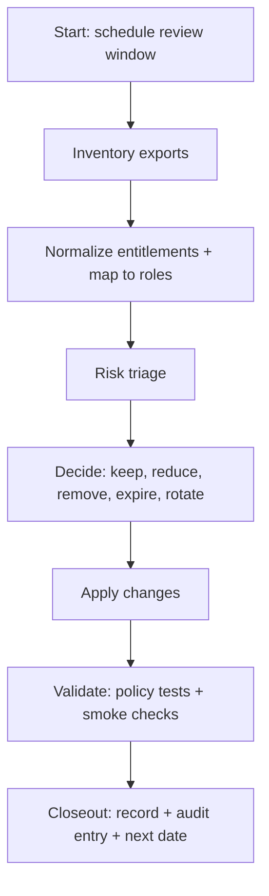

<!-- [KFM_META_BLOCK_V2]
doc_id: kfm://doc/3b9a2c9b-3b9a-4df7-b72c-6a8a3f2b1c2e
title: Runbook - Access Review
type: standard
version: v1
status: draft
owners: [kfm-governance, kfm-ops, "TBD-security-owner"]
created: 2026-03-02
updated: 2026-03-02
policy_label: internal
related:
  - docs/runbooks/governance/README.md
  - docs/policy/
  - docs/runbooks/governance/rb-policy-change.md
tags: [kfm, runbook, governance, access, security]
notes:
  - This runbook defines the minimum access review procedure for KFM. It is designed to be automated over time.
  - Replace TODO placeholders with repo-specific tooling, links, and owners.
[/KFM_META_BLOCK_V2] -->

# Runbook: Access Review
**Purpose:** Periodically verify and tighten access across the KFM trust membrane (data → pipelines → catalogs → governed APIs/UI), ensuring **least privilege**, **default-deny**, and **auditable change control**.  
**Status:** `draft` • **Audience:** Stewards, Operators, Security/Platform owners


> [!WARNING]
> This document contains operational security guidance. Keep it **internal** by default, and only publish externally after a deliberate governance decision.

---

## Quick navigation
- [When to run](#when-to-run)
- [Scope](#scope)
- [Roles and RACI](#roles-and-raci)
- [Inputs and required evidence](#inputs-and-required-evidence)
- [Procedure](#procedure)
- [Access surfaces checklist](#access-surfaces-checklist)
- [Outputs](#outputs)
- [Templates](#templates)
- [Appendix](#appendix)

---

## When to run

### Cadence (minimum)
- **Quarterly** access review (recommended default).
- **Event-driven** review within 5 business days of:
  - a steward/operator leaving or changing roles
  - onboarding a **restricted / sensitive-location** dataset or partner feed
  - adding/changing authentication/authorization (IdP, RBAC, ABAC)
  - a security incident, suspicious activity, or policy leakage finding
  - enabling new runtime surfaces (new API endpoints, tile services, Focus Mode features)

> [!NOTE]
> KFM governance uses a truth-path and a policy enforcement boundary (“trust membrane”). Access review is one of the controls that keeps these invariants real, not aspirational.

---

## Scope

### In scope (minimum)
Review **human** and **non-human** principals (service accounts, CI identities, pipeline runners) for:

1. **Identity & groups** (IdP, org membership, MFA posture)
2. **Code & policy** (repo/org permissions, policy bundle change rights)
3. **CI/CD & runners** (who can deploy; who can change pipelines; who can read secrets)
4. **Secrets** (secrets manager, CI secrets, KMS keys; rotation posture)
5. **Infrastructure & runtime** (cloud IAM, Kubernetes RBAC, DB roles, storage access)
6. **Data lifecycle zones** (RAW/WORK/PROCESSED/CATALOG/PUBLISHED)
7. **Audit & observability** (audit log access, dashboards, traces)
8. **Governed APIs & UI** (admin endpoints, backoffice tools, Focus Mode moderation capabilities)

### Out of scope
- Deep vulnerability scanning, SBOM/SLSA build attestation reviews (covered elsewhere).
- Performance / cost tuning.
- Schema/data-quality checks (handled by promotion gates and QA runbooks).

---

## Roles and RACI

KFM’s minimal governance model commonly uses the following baseline roles:

| Role | What they can do | What they **must not** do |
|---|---|---|
| Public user | Read public layers/stories; Focus Mode limited to public evidence | Any restricted access |
| Contributor | Propose datasets/stories; draft content | Promote to PUBLISHED; bypass gates |
| **Reviewer/Steward** | Approve promotions & story publishing; own policy labels & redaction rules | Operate infrastructure overrides |
| **Operator** | Run pipelines, manage deployments | Override policy gates or steward approvals |
| Governance council / community stewards | Control culturally sensitive materials & restrictions | Day-to-day ops without oversight |

**RACI for access review**

| Step | Responsible | Accountable | Consulted | Informed |
|---|---|---|---|---|
| Inventory exports | Operator | Security owner (TBD) | Steward | Governance council (if relevant) |
| Entitlement review | Steward + Security owner | Steward | Operator | Contributors (if changes impact workflows) |
| Remediation changes | Operator | Security owner | Steward | Affected users |
| Closeout & audit entry | Steward | Steward | Operator | Governance council |

> [!TIP]
> Keep duties separated: the person who can approve policy labels should not also be the only person who can grant themselves infrastructure access.

---

## Inputs and required evidence

### Inputs (minimum)
- Current group membership export from IdP (and whether MFA is enforced).
- Repo/org permissions export (admins, maintainers, outside collaborators).
- CI/CD permission model and list of deploy-capable identities.
- Secrets inventory (where secrets live, owners, rotation timestamps).
- Infrastructure IAM export (cloud, Kubernetes, DB roles, storage ACLs).
- Policy bundle version currently deployed (hash/commit) and who can change it.
- Audit log access list and retention policy pointer.

### Evidence requirements (hard gate)
Every **privileged access** (anything beyond public read of public datasets) MUST have:

1. **Justification** (ticket/issue reference)
2. **Scope** (what systems + what datasets/policy labels)
3. **Approver** (steward or designated owner)
4. **Expiry** (date or review cycle; “never expires” is disallowed by default)
5. **Audit trail** (when granted/changed/removed; by whom)

> [!WARNING]
> If evidence is missing, the default action is **remove or downgrade access** (“fail closed”), then re-grant via documented workflow if needed.

---

## Procedure

### Overview


### 0) Preparation
- Define a **review window** (e.g., 60–90 minutes) and a change-freeze rule for production deploys during remediation.
- Select the review scope:
  - quarterly full-scope, or
  - event-driven scoped (e.g., “policy bundle writers”, “restricted datasets”, “audit log readers”).

### 1) Collect inventories
Collect machine-readable exports and store them in an **access-review evidence folder** (restricted).

Suggested inventory items (adapt to your stack):
- IdP: users, groups, group owners
- Git host: org teams, repo permissions, CODEOWNERS (if used)
- CI/CD: environments, deploy approvals, secrets access
- Secrets manager: secrets list + last rotation + readers
- Cloud IAM: roles, principals, bindings
- Kubernetes: ClusterRoleBindings/RoleBindings + service accounts
- DB: roles/grants (read/write/admin), connection sources
- Storage: bucket/container ACLs, KMS key grants
- Observability: who can read logs, traces, dashboards

### 2) Map entitlements to KFM roles
For each principal, determine their **effective role(s)** and **policy_label reach**.

Minimum mapping rules:
- Public users: can only read `policy_label: public` (and `public_generalized`) surfaces.
- Contributors: cannot access restricted data unless separately approved.
- Stewards: may access restricted datasets if required, but still follow least privilege and expiry.
- Operators: should not hold data-steward approval powers; prioritize operational access.

> [!NOTE]
> If you support partner datasets that require ABAC, include attribute review (e.g., partner membership) in this step.

### 3) Review for least privilege + default deny
Flag any of the following as findings:
- Privileged access with **no ticket**, **no approver**, or **no expiry**
- A user with broad access but no recent activity or no current need
- Shared accounts (disallowed)
- Long-lived tokens with no rotation record
- UI components holding privileged credentials (should not happen)
- Direct storage access that bypasses governed APIs (trust membrane violation)
- Ability to modify policy bundle without review (policy-as-code breach)
- Ability to read audit logs without steward/operator justification

### 4) Remediate
Apply remediations in the smallest safe increments:

**A. Remove**
- Remove accounts for departed users.
- Remove stale external collaborators.
- Remove unused service accounts.

**B. Reduce**
- Replace broad roles with narrower ones.
- Convert permanent access to time-bound access.

**C. Rotate**
- Rotate secrets for:
  - any departing user with access
  - any privileged service account with long-lived creds
  - any suspected exposure
- Record rotation event in audit logs.

**D. Gate**
- Ensure policy tests enforce **default deny** for restricted/sensitive labels.
- Ensure “never leak restricted metadata” posture in 403/404 responses.
- Ensure sensitive location protections (no restricted bbox leakage via tiles/exports).

### 5) Validate
Minimum validation after changes:
- Run policy fixture tests (CI should block regressions).
- Smoke test:
  - public discovery endpoints (should not expose restricted)
  - restricted dataset access by unauthorized role (must deny)
  - steward workflow (promotion/story review) still functions
- Verify audit logging is still capturing access decisions and changes.

### 6) Closeout
- Produce an **Access Review Record (ARR)** (see template).
- Link all change tickets and approvals.
- Record an audit ledger entry (or equivalent) referencing the ARR and inventories.
- Schedule next review.

---

## Access surfaces checklist

Use this as the “minimum viable checklist.” Add rows as your implementation grows.

| Surface | What to review | Pass criteria (minimum) |
|---|---|---|
| Identity provider (OIDC) | Group membership; MFA; deprovisioning | Only active users; MFA enforced for privileged groups |
| Repo & policy bundle | Who can merge to main; who can change `policy/` | Policy changes require review; protected branches enabled |
| CI/CD | Who can deploy; who can edit pipelines | Deploy is gated; secrets not readable by untrusted PRs |
| Secrets manager | Secret readers; rotation dates; ownership | No secrets in repo; rotation recorded; scoped per source |
| Cloud IAM | Role bindings; service principals | Least privilege; no wildcard admin grants |
| Kubernetes RBAC | ClusterRoleBindings; namespace roles | Minimal cluster-admin; service accounts scoped |
| Databases | DB roles; read/write separation | Restricted datasets not readable by public roles |
| Storage (RAW/WORK/…) | ACLs by zone | RAW/WORK restricted; PUBLISHED only via governed APIs |
| Governed API | Admin endpoints; debug endpoints | Protected; audited; no bypass paths |
| UI | Token scope; admin actions | UI never holds privileged tokens beyond session needs |
| Audit logs | Who can read; retention | Append-only; access restricted; PII redaction applied |

---

## Outputs

### Required artifacts
1. **Access Review Record (ARR)**: a single document per review cycle.
2. **Change tickets** (or PRs) for every entitlement change.
3. **Inventory exports** used for the review (stored in restricted evidence storage).
4. **Audit entry** pointing to ARR + inventories (and policy bundle version/hash).

### Storage guidance (proposed)
- Store ARR in-repo under `docs/runbooks/governance/records/access-review/`.
- Store raw exports outside the repo (restricted artifact store), referenced by digest/path from ARR.

> [!NOTE]
> Do not commit raw exports that contain emails, tokens, internal hostnames, or sensitive partner identifiers into the public repository.

---

## Templates

### Template: Access Review Record (ARR)
Copy into a new file like `docs/runbooks/governance/records/access-review/2026-Q1.md` (example path).

```yaml
kfm_access_review_record_version: v1
review_id: "access-review-2026-Q1"
review_date: "2026-03-02"
review_window: "2026-03-02T15:00:00Z/2026-03-02T16:30:00Z"
scope:
  cadence: "quarterly"
  surfaces: ["idp", "repo", "ci", "secrets", "cloud_iam", "k8s", "db", "storage", "api", "ui", "audit"]
policy_bundle:
  ref: "TODO: git sha / bundle digest"
reviewers:
  accountable_steward: "TODO"
  responsible_operator: "TODO"
  security_owner: "TODO"
inventories:
  - name: "idp_groups_export"
    location: "TODO: restricted store path"
    digest: "sha256:TODO"
  - name: "k8s_rbac_export"
    location: "TODO"
    digest: "sha256:TODO"
findings:
  - id: "F-001"
    severity: "high|medium|low"
    description: "TODO"
    affected_principals: ["TODO"]
    remediation:
      action: "remove|reduce|rotate|gate"
      ticket: "TODO"
      completed: false
approvals:
  - role: "steward"
    principal: "TODO"
    approved_at: "TODO"
closeout:
  audit_ref: "kfm://audit/entry/TODO"
  next_review_due: "2026-06-30"
```

### Template: Break-glass access grant (time-bound)
Use only for incident response or urgent operations.

```yaml
kfm_break_glass_grant_version: v1
request_id: "bg-2026-03-02-001"
principal: "TODO"
justification: "TODO (incident/ticket)"
scope:
  surfaces: ["TODO"]
  datasets_policy_labels: ["restricted"]   # be explicit
expires_at: "2026-03-03T00:00:00Z"
approvals:
  - role: "steward"
    principal: "TODO"
  - role: "security_owner"
    principal: "TODO"
audit:
  created_at: "2026-03-02T00:00:00Z"
  audit_ref: "kfm://audit/entry/TODO"
```

---

## Appendix

### A. Policy posture reminders
- Treat sensitive-location and restricted datasets as **default deny**.
- Prefer creating `public_generalized` derivatives rather than weakening restrictions.
- Do not leak restricted dataset existence/metadata in error responses.
- Treat redaction/generalization as a first-class transform recorded in provenance.

### B. Minimum verification steps after every access change
1. Confirm unauthorized users cannot discover or read restricted datasets.
2. Confirm steward workflow (promotion/story publishing) remains available to stewards only.
3. Confirm audit logs record:
   - access decisions (allow/deny + obligations)
   - entitlement changes (who/what/when)
4. Confirm policy tests still pass in CI.

---

_Questions / TODOs to resolve (known gaps):_
- Which IdP (OIDC) and group naming conventions will KFM standardize on?
- Exact RBAC/ABAC mapping for partner datasets.
- Exact storage/zone ACL model and how it is enforced by the trust membrane.
- Where audit ledger lives and how access is granted/revoked.
