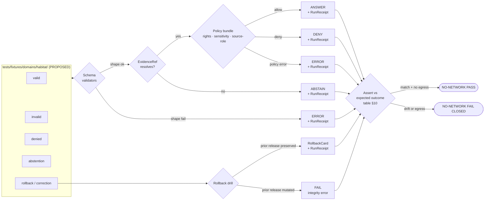

<!-- [KFM_META_BLOCK_V2]
doc_id: kfm://doc/runbook/habitat/no-network-test
title: Habitat — No-Network Test Runbook
type: standard
version: v1
status: draft
owners: Habitat domain steward · Docs steward · Test/CI owner (TODO confirm CODEOWNERS)
created: 2026-05-12
updated: 2026-05-12
policy_label: public
related: [
  docs/domains/habitat/README.md,
  docs/runbooks/README.md,
  docs/doctrine/lifecycle-law.md,
  docs/doctrine/truth-posture.md,
  docs/doctrine/trust-membrane.md,
  docs/doctrine/directory-rules.md,
  schemas/contracts/v1/domains/habitat/,
  policy/domains/habitat/,
  tests/fixtures/domains/habitat/
]
tags: [kfm, runbook, habitat, fixtures, no-network, ci, tests, governance, validators]
notes: [
  "Path PROPOSED — domain segment under docs/runbooks/ follows Directory Rules §12 lane pattern but diverges from existing flat docs/runbooks/<topic>_<purpose>.md convention; confirm choice in ADR or per-root README.",
  "All commands and module names below are PROPOSED — repo not mounted; the actual test/CI surface is UNKNOWN.",
  "Treat all reproduction details as illustrative until tests/, fixtures/, schemas/, and policy/ are inspected."
]
[/KFM_META_BLOCK_V2] -->

# Habitat — No-Network Test Runbook

> Run the Habitat lane's full validator and policy suite against deterministic fixtures, **with the network turned off**, and prove the lane fails closed before any live source is wired in.


**Status:** draft &nbsp;·&nbsp; **Owners:** Habitat domain steward · Docs steward · Test/CI owner (TODO) &nbsp;·&nbsp; **Last updated:** 2026-05-12

---

## Quick jump

- [1. Purpose](#1-purpose)
- [2. Why no-network is the *first* gate](#2-why-no-network-is-the-first-gate)
- [3. Scope](#3-scope)
- [4. Audience and actors](#4-audience-and-actors)
- [5. Doctrine anchors](#5-doctrine-anchors)
- [6. Preflight checklist](#6-preflight-checklist)
- [7. Fixture matrix](#7-fixture-matrix)
- [8. Procedure](#8-procedure)
- [9. No-network test flow](#9-no-network-test-flow)
- [10. Expected outcomes per object family](#10-expected-outcomes-per-object-family)
- [11. Pass / fail criteria](#11-pass--fail-criteria)
- [12. Failure modes and triage](#12-failure-modes-and-triage)
- [13. Cleanup and rollback](#13-cleanup-and-rollback)
- [14. Related docs](#14-related-docs)
- [Appendix A — PROPOSED habitat fixture tree](#appendix-a--proposed-habitat-fixture-tree)
- [Appendix B — Open verification items](#appendix-b--open-verification-items)

---

## 1. Purpose

This runbook is the operational procedure for running Habitat's full **schema → evidence → rights → sensitivity → policy → release** validator chain against deterministic, on-disk fixtures **with no outbound network access**. It is the lane's *first* enforceable gate: it proves that Habitat's contracts, schemas, validators, and policy bundles are internally consistent and **fail closed** before any live connector, source endpoint, or steward decision is wired in.

A passing no-network run is a *necessary* condition for promoting Habitat fixtures or candidate artifacts forward in the KFM lifecycle. It is **not** a sufficient condition for publication. Publication still requires resolved source rights, sensitivity review, EvidenceBundle closure, ReleaseManifest, and a rollback target. CONFIRMED doctrine. [kfm_encyclopedia §K · Tests and validators]

> [!IMPORTANT]
> A no-network run that **passes** without exercising every fixture class in the matrix below has *not* exercised Habitat's deny-by-default posture. Pass requires that invalid, denied, and abstention fixtures produce the correct closed-loop outcomes — not just that valid fixtures parse.

[Back to top](#quick-jump)

---

## 2. Why no-network is the *first* gate

CONFIRMED doctrine. KFM treats no-network fixtures as a standing test class — listed alongside schema validation, policy deny tests, citation validation, release manifest validation, and rollback drill in the encyclopedia's Tests and validators inventory. [kfm_encyclopedia §K]

CONFIRMED doctrine. The implementation roadmap's first reversible PR (**PR-00 no-network fixture**) explicitly creates synthetic fixtures for `SourceDescriptor`, `EvidenceBundle`, `LayerManifest`, and `ReleaseManifest` under `tests/fixtures + schemas`, with the acceptance criterion *"Fixture validation passes; no network access."* [kfm_encyclopedia §14]

CONFIRMED doctrine / NEW evidence. The MapLibre master corpus records the pattern more broadly: *"A dry-run stack emits receipts and validates structure without live ports or network side effects … First implementation can be no-network and deterministic."* [Master MapLibre Components ML-063-057]

For Habitat specifically, this gate matters even more than for a low-sensitivity lane:

| Risk if Habitat is wired to live sources before no-network passes | Mitigation the no-network gate provides |
|---|---|
| Sensitive occurrence joins leak exact geometry before the geoprivacy transform is verified. | Denied fixtures with sensitive joins prove the policy bundle returns `DENY` deterministically. |
| Modeled habitat outputs get treated as critical-habitat regulatory authority. | Source-role mismatch fixtures prove the source-role registry refuses the cross-classification. |
| Released layer manifests reference unresolved `EvidenceRef` values. | Abstention fixtures prove the resolver returns `ABSTAIN` rather than synthesizing a bundle. |
| A network flake in CI masks a validator bug as an environment issue. | Egress denied at the test boundary makes any network attempt itself a failure signal. |

[Back to top](#quick-jump)

---

## 3. Scope

### 3.1 In scope

- Validating Habitat fixtures (valid, invalid, denied, abstention, rollback/correction) against the canonical Habitat schemas under `schemas/contracts/v1/domains/habitat/` (PROPOSED home; see §6).
- Exercising the Habitat policy bundle under `policy/domains/habitat/` (PROPOSED home) including sensitivity, rights, and source-role checks.
- Asserting **finite outcomes** — `ANSWER`, `ABSTAIN`, `DENY`, `ERROR` — for every fixture, mediated by Habitat's `DecisionEnvelope` / `RuntimeResponseEnvelope` contracts.
- Emitting and verifying receipts (`RunReceipt`, `ValidationReport`, redaction receipt where applicable) without publication side effects.
- Confirming no outbound network call was attempted during the test run.

### 3.2 Out of scope

- Live connector activation against NLCD, NatureServe, KDWP, USFWS ECOS, NWI, GAP/LANDFIRE, PAD-US, GBIF, or iNaturalist. Those belong in a separate, connector-scoped runbook **after** no-network passes. CONFIRMED doctrine. [KFM Domains Atlas §D · Key source families]
- Promotion to `data/processed/`, `data/catalog/`, `data/published/`, or `release/manifests/`. Promotion is a governed state transition that requires gates beyond no-network. CONFIRMED doctrine. [Directory Rules §9.1; kfm_encyclopedia §H]
- Browser, MapLibre rendering, and Evidence Drawer integration. Covered separately by `docs/runbooks/ui_VALIDATION.md` (PROPOSED, in Whole-UI report).
- Governed AI / Focus Mode behavior over Habitat bundles. Covered by `docs/runbooks/governed_ai_VALIDATION.md` (PROPOSED).
- Production secrets, identity, or auth tests. Configs must contain no real secrets in any environment — runbook entry on the security incident posture lives in `docs/runbooks/` (general). CONFIRMED doctrine. [Directory Rules §10.3]

[Back to top](#quick-jump)

---

## 4. Audience and actors

| Actor | What they do in this runbook |
|---|---|
| **Habitat lane developer** | Author and update Habitat fixtures, schemas, and validators; run the no-network suite locally before opening a PR. |
| **Habitat domain steward** | Approve the fixture matrix; review sensitivity, source-role, and geoprivacy classes; sign off on the deny-by-default surface. |
| **Test / CI owner** | Maintain the no-network CI job, the egress lockdown, and the receipt-collection job. |
| **Docs steward** | Keep this runbook synchronized with Habitat schemas, policy bundle, and the lifecycle invariant. |
| **Release reviewer (downstream)** | Treat a passing no-network run as a prerequisite signal, not a release decision. |

[Back to top](#quick-jump)

---

## 5. Doctrine anchors

This runbook does not invent governance — it operationalizes existing doctrine. The non-negotiable anchors below apply to every step.

> [!NOTE]
> The lifecycle invariant is governance, not storage organization:
> **RAW → WORK / QUARANTINE → PROCESSED → CATALOG / TRIPLET → PUBLISHED**.
> Promotion is a governed state transition, **not a file move**. [Directory Rules §9.1 · kfm_encyclopedia §H]

| Anchor | What it means here |
|---|---|
| **Cite-or-abstain** | Any Habitat answer claiming evidence must resolve `EvidenceRef → EvidenceBundle`; if it cannot, the answer is `ABSTAIN`. CONFIRMED doctrine. [kfm_encyclopedia · Governed AI] |
| **Deny by default** | Unreviewed exact sensitive Habitat geometry, sensitive occurrence joins, and source-role mismatches deny. CONFIRMED doctrine. [DOM-HAB · L · Feature backlog "DENY by default"] |
| **Finite outcomes** | The runtime/validator/policy surfaces return one of `ANSWER`, `ABSTAIN`, `DENY`, `ERROR` — never a soft "best effort." CONFIRMED doctrine. [Governed AI dossier] |
| **Trust membrane** | Public clients consume governed APIs only; nothing in this runbook publishes to `data/published/` or `release/manifests/`. CONFIRMED doctrine. [Directory Rules §7.1 · §9.2] |
| **Watcher-as-non-publisher** | Validators, watchers, and workers emit receipts and candidate decisions only. They do not rewrite catalog or publish. CONFIRMED doctrine. [Directory Rules §19 · Glossary] |
| **Schema-home rule** | Default machine-schema home is `schemas/contracts/v1/...` per **ADR-0001**. PROPOSED for Habitat: `schemas/contracts/v1/domains/habitat/`. NEEDS VERIFICATION in mounted repo. [Directory Rules §6.4 · §18] |

[Back to top](#quick-jump)

---

## 6. Preflight checklist

Run through this list before executing the procedure. Each item that fails preflight is a stop-and-fix, not a stop-the-runbook.

- [ ] **No mounted-repo overrides.** Read the latest `directory-rules.md`, `docs/adr/ADR-0001-schema-home.md`, and any Habitat ADR. If repo state has drifted from doctrine, open a `docs/registers/DRIFT_REGISTER.md` entry and pause. CONFIRMED process. [Directory Rules §2.5]
- [ ] **Habitat schemas present.** PROPOSED home: `schemas/contracts/v1/domains/habitat/`. Confirms `HabitatPatch`, `LandCoverObservation`, `EcologicalSystem`, `HabitatQualityScore`, `SuitabilityModel`, `ConnectivityEdge`, `Corridor`, `RestorationOpportunity`, `StewardshipZone`, `ModelRunReceipt`, `UncertaintySurface`. NEEDS VERIFICATION. [kfm_encyclopedia §7.4 C · DOM-HAB §E]
- [ ] **Habitat policy bundle present.** PROPOSED home: `policy/domains/habitat/`. NEEDS VERIFICATION.
- [ ] **Habitat fixture suite present** under `tests/fixtures/domains/habitat/` (or `fixtures/domains/habitat/` if the lane has chosen the cross-cutting home — pick one and document it). PROPOSED. [Directory Rules §6.6]
- [ ] **Egress denied.** The test environment denies outbound network. CI: deny-by-default firewall or sandboxed runner with network egress allowlist empty for this job. Local: airplane mode, `/etc/hosts` lockdown, or a no-net container. PROPOSED implementation. [KFM Components Pass 10 · C12-05 sandboxed runners; ML-063-057]
- [ ] **No secrets sourced from env.** `configs/` and the active runtime config contain no real secrets — Habitat tests do not pull credentials. CONFIRMED doctrine. [Directory Rules §10.3]
- [ ] **Receipts directory writable.** PROPOSED home for run output: `data/receipts/validation/habitat/<run_id>/` (test-mode flag set so receipts are tagged as no-network and not promotable). NEEDS VERIFICATION.
- [ ] **Clock is fixed or recorded.** Deterministic runs require the run time to be either pinned or written into every receipt. PROPOSED.

> [!WARNING]
> If the runbook executor cannot verify the egress denial — for example, a CI runner whose network policy is unset — treat the run as **invalid**, not "probably fine." A silent network success is the failure mode this runbook exists to prevent.

[Back to top](#quick-jump)

---

## 7. Fixture matrix

Every major Habitat object family **MUST** be represented by at least the five fixture classes below. PROPOSED rule, drawn from the Unified Build Manual's fixture rule. [BLD-COMP §§20, 30 → KFM Unified Build Manual 5.3]

| Class | Purpose | Expected finite outcome | Habitat example (illustrative) |
|---|---|---|---|
| **Valid** | Schema-clean, evidence-closed, policy-passing fixture. | `ANSWER` | `HabitatPatch` derived from NLCD land cover for a Kansas tile, with resolvable `EvidenceRef` and a public-safe `LayerManifest`. |
| **Invalid** | Required field missing, geometry malformed, version mismatch, or unresolved identifier. | `ERROR` (schema or geometry validator fails closed) | `HabitatPatch` with no `source_id`; `SuitabilityModel` missing `model_run_receipt`; geometry self-intersection. |
| **Denied** | Schema-clean but **policy** refuses release: sensitive occurrence join, source-role mismatch, rights gap, or sensitivity class. | `DENY` | Sensitive fauna occurrence joined to a habitat patch at exact geometry; modeled habitat presented as **critical habitat** authority (source-role mismatch). |
| **Abstention** | Schema-clean but `EvidenceRef` does not resolve, citation chain incomplete, or source descriptor unresolved. | `ABSTAIN` | `HabitatPatch` whose `evidence_ref` points to a `data/proofs/evidence_bundle/` id that is absent from the fixture set. |
| **Rollback / correction** | A previously released candidate is corrected or withdrawn; the prior release is preserved as lineage. | Successful `RollbackCard` emission; superseding release records the correction. | Public generalized habitat tile withdrawn because the redaction receipt under-generalized a sensitive species join. |

> [!TIP]
> The thin-slice example in `kfm_encyclopedia §7.4 N` is: *"One NLCD-derived Kansas habitat patch fixture plus one fauna occurrence association and uncertainty/citation report, public generalized tile only."* That gives the **valid** anchor; the other four classes are mutations of it.

### 7.1 Sensitivity & geoprivacy fixtures (Habitat-specific)

Habitat is a *medium-sensitivity* lane that becomes *high-sensitivity* the moment it joins to Fauna occurrence records, sensitive ecological zones, or stewardship locations. The fixture suite **MUST** include:

- A **sensitive-join denial fixture** — exact occurrence point joined to a habitat patch. Expected outcome: `DENY`, with a written `policy_decision.reason_code` referencing the geoprivacy class. CONFIRMED doctrine. [DOM-FAUNA §§12-13 · DOM-HAB §I]
- A **generalization success fixture** — same join, but with a `geoprivacy_transform` applied (e.g., aggregation to a coarser unit) and a `Redaction Receipt` co-resident. Expected outcome: `ANSWER`, the receipt validates against `schemas/contracts/v1/correction/redaction_receipt.schema.json` (PROPOSED location).
- A **modeled-as-critical denial fixture** — a `SuitabilityModel` output that has been mislabeled as a regulatory critical-habitat source. Expected outcome: `DENY`, source-role registry refuses the cross-classification. CONFIRMED doctrine. [DOM-HAB §K]

[Back to top](#quick-jump)

---

## 8. Procedure

The procedure is grouped into five phases. Each phase ends with a verifiable receipt or report — nothing in this runbook should produce un-receipted state.

### Phase 1 — Lockdown

1. Disable outbound network on the test environment (CI sandbox firewall, local airplane mode, or no-net container).
2. Confirm DNS resolution either fails closed or is restricted to a static, local-only resolver.
3. Record the lockdown configuration into the run metadata that every receipt will reference.

### Phase 2 — Schema validation

1. Run schema validation across the Habitat fixture suite. PROPOSED command shape:

```bash
   # PROPOSED — actual validator command depends on tooling not yet inspected.
   kfm-validate schema \
     --schema-root schemas/contracts/v1/domains/habitat \
     --fixtures   tests/fixtures/domains/habitat \
     --report-out data/receipts/validation/habitat/$RUN_ID/schema.report.json \
     --no-network
```

2. Confirm every **valid** fixture passes and every **invalid** fixture fails — the **negative tests fail closed**. This is the same posture PR-03 establishes for the cross-cutting validator suite (`negative tests fail closed`). CONFIRMED doctrine. [kfm_encyclopedia §14]

### Phase 3 — Evidence, rights, sensitivity, source-role

1. Resolve every `EvidenceRef` declared by a valid or abstention fixture against the on-disk EvidenceBundle store under `data/proofs/evidence_bundle/` (PROPOSED).
2. Apply the rights, sensitivity, and source-role validators.
3. Confirm the abstention fixtures return `ABSTAIN` rather than synthesizing a bundle.
4. Confirm the denial fixtures return `DENY` with a structured `reason_code` and no leaked payload.

> [!CAUTION]
> A validator that *silently* substitutes a default when an `EvidenceRef` is missing is a failure of the cite-or-abstain posture — even if the substituted default is a placeholder. The correct behavior is `ABSTAIN` with the unresolved ref logged in the receipt. CONFIRMED doctrine. [kfm_encyclopedia · Governed AI]

### Phase 4 — Policy bundle and finite outcomes

1. Run the Habitat policy bundle over each fixture; collect a `policy_decision` per fixture.
2. Wrap each result in a `DecisionEnvelope` (Habitat-flavored) and confirm the envelope is exactly one of `ANSWER`, `ABSTAIN`, `DENY`, `ERROR`.
3. Assert the **expected outcome table** in §10 matches the actual outcomes per fixture.

### Phase 5 — Receipts, rollback drill, no-network proof

1. Confirm a `RunReceipt` was emitted for every fixture, including denials and abstentions. CONFIRMED doctrine — receipts attach to all five finite outcomes including QUARANTINE-equivalent paths. [New Ideas 5-8-26 · "Receipts everywhere"]
2. Execute the **rollback / correction fixture**: load a prior release candidate, verify a `RollbackCard` is produced, verify the prior release record is preserved as lineage (not overwritten).
3. Assert the run produced **zero** outbound network attempts (test-side counter, CI egress log, or sandbox audit log).
4. Stamp the run summary as **no-network: pass** or **no-network: fail** and write it next to the receipts.

[Back to top](#quick-jump)

---

## 9. No-network test flow

The diagram below shows the deterministic shape of the run. It is intentionally simple: every fixture passes through the same chain, and every chain ends in either a finite outcome assertion or a fail-closed receipt.



> [!NOTE]
> Diagram shape is doctrine-grounded; the exact validator and policy module names inside the chain are **PROPOSED** until the repo is inspected. NEEDS VERIFICATION.

[Back to top](#quick-jump)

---

## 10. Expected outcomes per object family

This table is the single source of truth for what the assertion step compares against. Update it whenever the fixture suite or schema set changes — and require the matching docs propagation under the Whole-UI update matrix.

| Habitat object family | Valid expected | Invalid expected | Denied expected | Abstention expected | Notes |
|---|---|---|---|---|---|
| `HabitatPatch` | `ANSWER` | `ERROR` (geometry / source_id) | `DENY` (sensitive join) | `ABSTAIN` (unresolved evidence_ref) | Thin-slice anchor object; NLCD-derived. [kfm_encyclopedia §7.4 N] |
| `LandCoverObservation` | `ANSWER` | `ERROR` (missing source_role) | `DENY` (rights unresolved) | `ABSTAIN` (unresolved citation) | Observation source role only — not authority. [DOM-HAB §B] |
| `EcologicalSystem` | `ANSWER` | `ERROR` (schema) | `DENY` (rights gap) | `ABSTAIN` (citation chain incomplete) | NatureServe / GAP / LANDFIRE family. [DOM-HAB §D] |
| `HabitatQualityScore` | `ANSWER` | `ERROR` (missing UncertaintySurface) | `DENY` (over-precise) | `ABSTAIN` (model unsupported) | Score must carry uncertainty + support. [DOM-HAB §D] |
| `SuitabilityModel` | `ANSWER` | `ERROR` (missing ModelRunReceipt) | `DENY` (modeled-as-critical role mismatch) | `ABSTAIN` (unresolved evidence) | Model vs observation label MUST stay visible. [DOM-HAB §D · §K] |
| `ConnectivityEdge` | `ANSWER` | `ERROR` (graph integrity) | `DENY` (sensitive endpoint join) | `ABSTAIN` (one endpoint unresolved) | Edges may reveal sensitive stewardship paths. |
| `Corridor` | `ANSWER` | `ERROR` (geometry) | `DENY` (corridor crosses sensitive zone unredacted) | `ABSTAIN` (provenance unresolved) | Generalization expected by default. |
| `RestorationOpportunity` | `ANSWER` | `ERROR` (schema) | `DENY` (rights gap or steward review required) | `ABSTAIN` (citation gap) | Steward review required before public answer. [DOM-HAB §F] |
| `StewardshipZone` | `ANSWER` | `ERROR` (geometry / rights) | `DENY` (steward-only by default) | `ABSTAIN` (consent record unresolved) | Treat as steward-restricted by default. |
| `ModelRunReceipt` | `ANSWER` | `ERROR` (missing input digest) | `DENY` (forbidden provider) | `ABSTAIN` (input EvidenceBundle unresolved) | First-class input to release/cache invalidation. [ML-063-054] |
| `UncertaintySurface` | `ANSWER` | `ERROR` (alignment) | `DENY` (over-precise on sensitive area) | `ABSTAIN` (parent model unresolved) | Required companion of any modeled product. |

[Back to top](#quick-jump)

---

## 11. Pass / fail criteria

The run is **PASS** if and only if every condition in §11.1 holds. The run is **FAIL CLOSED** if any condition in §11.2 fires — even if everything else passed.

### 11.1 Pass conditions

| # | Condition | Why it matters |
|---|---|---|
| 1 | Every fixture's actual outcome equals its expected outcome in §10. | The validator chain is internally consistent. |
| 2 | Every fixture produced a `RunReceipt`, including denials and abstentions. | Receipts are non-optional, including for closed paths. [New Ideas 5-8-26] |
| 3 | The rollback / correction fixture emitted a `RollbackCard` and preserved the prior release record. | Rollback is auditable, not a hidden file copy. [Unified Build Manual §5.4] |
| 4 | The run summary records **zero** outbound network attempts. | A silent network success is the failure mode this runbook exists to prevent. |
| 5 | No fixture wrote into `data/published/`, `release/manifests/`, `release/promotion_decisions/`, or `data/catalog/`. | Publication is a governed transition outside this runbook. |
| 6 | No secret value appears in any receipt, log, or report. | Configs must not source real secrets. [Directory Rules §10.3] |

### 11.2 Fail-closed triggers

| # | Trigger | Required action |
|---|---|---|
| 1 | Any outbound network attempt detected. | Mark **FAIL**; investigate connector or HTTP client wiring; do not retry until the leak is fixed. |
| 2 | An invalid fixture passed schema. | Mark **FAIL**; schema is too permissive — open a schema bug. |
| 3 | A denied fixture returned `ANSWER` or `ABSTAIN`. | Mark **FAIL**; policy bundle is under-restrictive — open a policy bug; **do not** "fix" the fixture. |
| 4 | An abstention fixture returned `ANSWER` with a synthesized bundle. | Mark **FAIL**; cite-or-abstain is broken — open a resolver bug. |
| 5 | A `RunReceipt` is missing for any outcome. | Mark **FAIL**; receipts are mandatory. |
| 6 | Rollback drill mutated or deleted the prior release record. | Mark **FAIL**; rollback must preserve lineage. |
| 7 | A real secret appears in a receipt or log. | Treat as a **security incident**: rotate, audit, file an incident runbook entry. [Directory Rules §10.3] |

[Back to top](#quick-jump)

---

## 12. Failure modes and triage

<details>
<summary><strong>Common no-network failure modes (click to expand)</strong></summary>

| Symptom | Likely cause | First action |
|---|---|---|
| All fixtures `ERROR`. | Schemas not found at PROPOSED home; lookup path or version mismatch. | Verify `schemas/contracts/v1/domains/habitat/` exists; check schema-home ADR. |
| Valid fixture `ABSTAIN`. | EvidenceBundle absent from `data/proofs/evidence_bundle/`; resolver path mis-set. | Re-inventory the fixture's `EvidenceRef`; do not stub a bundle to make the test green. |
| Denied fixture `ANSWER`. | Policy bundle not loaded for Habitat; sensitivity class missing; source-role registry not consulted. | Inspect policy bundle activation; verify Habitat appears in `policy/domains/`. |
| Network attempt detected. | A connector module imported at validator boot; HTTP client default points at a live host; DNS resolver leak. | Run the static `no_forbidden_browser_calls`-style import boundary test from the Whole-UI plan. [KFM Whole-UI Expansion §20] |
| Receipt missing for a `DENY`. | Receipt emitter wired only on `ANSWER` path. | Treat as critical bug; receipts attach to *every* finite outcome. |
| Rollback drill modified prior release record in place. | Promotion logic doing a file move instead of a governed state transition. | Stop and audit: this is a lifecycle invariant violation. [Directory Rules §9.1] |
| Run is non-deterministic across two consecutive executions. | Time, UUID, or hash function not pinned; uncanonicalized JSON serialization. | Adopt JCS canonicalization for the affected receipts. [ML-063-053] |
| All denials share the same `reason_code`. | Policy bundle returning a generic deny without reason routing. | Reason codes must be structured per gate (rights, sensitivity, source-role, evidence). |

</details>

> [!IMPORTANT]
> When triaging a failure, never adjust a fixture to make a denial disappear. The fixture is the specification of the behavior under test; the bug is somewhere else. If the policy is wrong, fix the policy under ADR and review — do not soften the fixture.

[Back to top](#quick-jump)

---

## 13. Cleanup and rollback

The no-network runbook is, by design, side-effect-light. Cleanup is mostly about preserving evidence and not promoting anything by accident.

1. **Archive the run receipts** under `data/receipts/validation/habitat/<run_id>/`. Mark them `policy_label: internal` and `release_state: none`.
2. **Do not** copy any artifact from this run into `data/processed/`, `data/catalog/`, `data/published/`, or `release/manifests/`. Promotion requires a separate governed flow.
3. **If the run produced a candidate rollback record** (from the rollback drill fixture), keep it under `release/rollback_cards/` with a `mode: drill` flag; otherwise it could be mistaken for a real rollback decision. PROPOSED; verify against `release/` README.
4. **Restore network** at the test environment boundary only after receipts are written and run is closed. A run is not "closed" until its no-network proof is committed.
5. **If a fail-closed trigger fired**, file a follow-up issue with the receipt id, the trigger number from §11.2, and the affected fixture(s). Do not re-run until the root cause is addressed.

> [!TIP]
> A clean no-network pass is itself an artifact. Reference the run id from any downstream Habitat PR that touches schemas, policy, fixtures, or the source registry — it is the lane's standing proof that internal consistency was checked before live wiring.

[Back to top](#quick-jump)

---

## 14. Related docs

The links below are **PROPOSED** until inspected against the mounted repo. Replace `TODO` placeholders with real paths once verified.

- `docs/domains/habitat/README.md` — Habitat domain overview. PROPOSED.
- `docs/runbooks/README.md` — Index of KFM runbooks. PROPOSED.
- `docs/doctrine/lifecycle-law.md` — Lifecycle invariant and promotion law. PROPOSED.
- `docs/doctrine/truth-posture.md` — Cite-or-abstain posture. PROPOSED.
- `docs/doctrine/trust-membrane.md` — Trust membrane and governed API boundary. PROPOSED.
- `docs/doctrine/directory-rules.md` — Directory Rules (this file's placement basis). CONFIRMED present in project doctrine.
- `docs/adr/ADR-0001-schema-home.md` — Schema-home decision. NEEDS VERIFICATION.
- `schemas/contracts/v1/domains/habitat/` — Habitat machine schemas. PROPOSED.
- `policy/domains/habitat/` — Habitat policy bundle. PROPOSED.
- `tests/fixtures/domains/habitat/` — Fixture suite consumed by this runbook. PROPOSED.
- `docs/registers/VERIFICATION_BACKLOG.md` — Place to log open NEEDS VERIFICATION items uncovered while running this. PROPOSED.
- `docs/registers/DRIFT_REGISTER.md` — Place to log doctrine ↔ repo conflicts uncovered while running this. PROPOSED.

[Back to top](#quick-jump)

---

## Appendix A — PROPOSED habitat fixture tree

The tree below is **PROPOSED**; treat it as a scaffolding suggestion, not a repo claim. Use it as the starting structure for the fixture matrix in §7. NEEDS VERIFICATION.

```text
tests/fixtures/domains/habitat/          # PROPOSED home (Directory Rules §6.6)
├── README.md                            # declares fixture class boundaries
├── valid/
│   ├── habitat_patch.nlcd_kansas.json
│   ├── land_cover_observation.json
│   ├── ecological_system.json
│   ├── habitat_quality_score.json
│   ├── suitability_model.json
│   ├── connectivity_edge.json
│   ├── corridor.generalized.json
│   ├── restoration_opportunity.json
│   ├── stewardship_zone.steward_only.json
│   ├── model_run_receipt.json
│   ├── uncertainty_surface.json
│   └── layer_manifest.public_safe.json
├── invalid/
│   ├── habitat_patch.missing_source_id.json
│   ├── habitat_patch.bad_geometry.json
│   ├── suitability_model.missing_model_run_receipt.json
│   └── connectivity_edge.broken_graph.json
├── denied/
│   ├── sensitive_occurrence_join_exact.json    # → DENY (geoprivacy)
│   ├── modeled_as_critical_habitat.json        # → DENY (source-role mismatch)
│   ├── habitat_patch.unresolved_rights.json    # → DENY (rights gap)
│   └── stewardship_zone.public_request.json    # → DENY (steward-only)
├── abstention/
│   ├── habitat_patch.unresolved_evidence_ref.json
│   ├── suitability_model.uncited.json
│   └── corridor.unresolved_provenance.json
└── rollback/
    ├── habitat_release.candidate.json
    ├── habitat_release.rollback_card.json
    └── habitat_release.correction_notice.json
```

Co-located evidence (PROPOSED):

```text
data/proofs/evidence_bundle/test/habitat/<run_id>/
├── eb.habitat_patch.nlcd_kansas.json
├── eb.suitability_model.json
└── eb.restoration_opportunity.json

data/receipts/validation/habitat/<run_id>/
├── schema.report.json
├── policy.decisions.jsonl
├── runs.jsonl
└── no_network_proof.json
```

> [!NOTE]
> Whether the fixture root is `tests/fixtures/domains/habitat/` or `fixtures/domains/habitat/` is a per-lane choice that **MUST** be documented in the affected README and **MUST NOT** be both. CONFIRMED rule. [Directory Rules §6.6]

[Back to top](#quick-jump)

---

## Appendix B — Open verification items

These items are explicitly **not resolved** by this runbook. They should be tracked in `docs/registers/VERIFICATION_BACKLOG.md` and resolved by ADR, per-root README, or repo inspection.

- **NEEDS VERIFICATION** — Whether Habitat schemas live at `schemas/contracts/v1/domains/habitat/` (per ADR-0001 default) or another path in the current mounted repo. [Directory Rules §6.4 · §18]
- **NEEDS VERIFICATION** — Whether the Habitat policy bundle exists under `policy/domains/habitat/` or under the compatibility `policies/` mirror. [Directory Rules §8.1]
- **NEEDS VERIFICATION** — The actual validator command surface (Python, Node, Go, or other) and its CLI flag names. All commands in §8 are PROPOSED.
- **NEEDS VERIFICATION** — The exact CI job and workflow that runs the no-network suite; the egress denial mechanism (firewall, sandboxed runner, network namespace). [ML-063-057]
- **NEEDS VERIFICATION** — The fixture-root choice (`tests/fixtures/domains/habitat/` vs `fixtures/domains/habitat/`) and the README that declares it. [Directory Rules §6.6]
- **NEEDS VERIFICATION** — Whether `release/rollback_cards/` accepts a `mode: drill` flag, or whether drill output should land in a separate sibling under `data/receipts/` or `data/rollback/`. [Directory Rules §18 · OPEN]
- **OPEN** — Path placement of this runbook itself: domain segment `docs/runbooks/habitat/` (used here) vs flat `docs/runbooks/habitat_NO_NETWORK_TEST.md` (matches existing visible runbook naming such as `ui_LOCAL_DEV.md`). Both align with Directory Rules; pick one in a per-root README or ADR.

[Back to top](#quick-jump)

---

**Related docs:** [§14](#14-related-docs) · **Last updated:** 2026-05-12 · [Back to top](#quick-jump)
