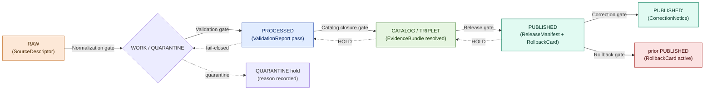
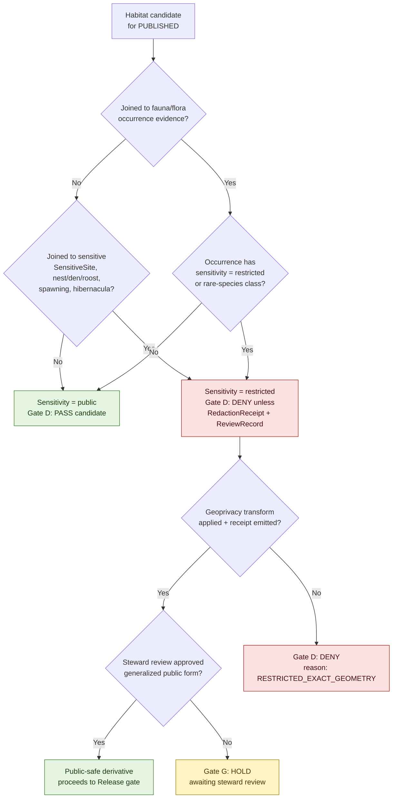

<!-- [KFM_META_BLOCK_V2]
doc_id: kfm://doc/runbook-habitat-promotion-v1
title: Habitat Promotion Runbook
type: standard
version: v1
status: draft
owners: Habitat domain steward + Docs steward + Release manager
created: 2026-05-12
updated: 2026-05-12
policy_label: public
related: [
  docs/doctrine/directory-rules.md,
  docs/doctrine/lifecycle-law.md,
  docs/doctrine/trust-membrane.md,
  docs/domains/habitat/README.md,
  docs/architecture/governed-api.md,
  policy/promotion/README.md,
  data/release/README.md,
  docs/runbooks/README.md
]
tags: [kfm, runbook, habitat, promotion, lifecycle, governance, release]
notes: [
  "All implementation-shaped claims are PROPOSED until verified against mounted-repo evidence.",
  "Directory placement (habitat/ subdir vs habitat_PROMOTION.md flat naming) NEEDS VERIFICATION against current repo convention."
]
[/KFM_META_BLOCK_V2] -->

# 🦎 Habitat Promotion Runbook

> Operational procedure for promoting Habitat-lane artifacts from `RAW` through `PUBLISHED` under KFM's evidence-first, fail-closed governance contract.

<!-- Badges: placeholders until CI, policy bundle, and release pipeline are wired and verifiable. -->


| Field | Value |
|---|---|
| **Status** | `draft` |
| **Owners** | Habitat domain steward · Docs steward · Release manager |
| **Updated** | 2026-05-12 |
| **Doctrine basis** | `CONFIRMED` — Directory Rules, Lifecycle Law, Trust Membrane |
| **Implementation maturity** | `PROPOSED` — no mounted-repo evidence available this session |
| **Path** | `docs/runbooks/habitat/PROMOTION_RUNBOOK.md` (see [§2 Repo fit](#2-repo-fit)) |

---

## 📑 Contents

1. [Purpose & scope](#1-purpose--scope)
2. [Repo fit](#2-repo-fit)
3. [What this runbook covers — and what it does not](#3-what-this-runbook-covers--and-what-it-does-not)
4. [Lifecycle and the promotion contract](#4-lifecycle-and-the-promotion-contract)
5. [Promotion gates A → G](#5-promotion-gates-a--g)
6. [Habitat-specific sensitivity overlays](#6-habitat-specific-sensitivity-overlays)
7. [Step-by-step procedure](#7-step-by-step-procedure)
8. [Finite outcomes & `DecisionEnvelope`](#8-finite-outcomes--decisionenvelope)
9. [Failure modes & reason codes](#9-failure-modes--reason-codes)
10. [Correction path](#10-correction-path)
11. [Rollback path](#11-rollback-path)
12. [Validation, tests, and CI hooks](#12-validation-tests-and-ci-hooks)
13. [Roles & separation of duties](#13-roles--separation-of-duties)
14. [Preflight checklist](#14-preflight-checklist)
15. [Related docs](#15-related-docs)
16. [Appendix](#16-appendix)

---

## 1. Purpose & scope

> [!NOTE]
> **`CONFIRMED` doctrine:** Promotion in KFM is a **governed state transition, not a file move.** A path-level move that bypasses validators, policy gates, evidence-bundle creation, catalog closure, and release-decision recording is a violation of the lifecycle invariant regardless of which directory the bytes end up in.

This runbook tells a Habitat-lane contributor, validator, reviewer, release manager, or operator **how to advance a Habitat artifact through KFM's governed lifecycle** while preserving:

- evidence-first truth posture (`EvidenceRef` → `EvidenceBundle` resolution),
- cite-or-abstain default,
- fail-closed sensitive-context handling for habitat-fauna joins,
- separation of duties between authoring and release authority,
- auditable receipts at every stage,
- a reversible release with a defined `RollbackCard`.

**In scope:** the canonical objects `Habitat` owns — `HabitatPatch`, `LandCoverObservation`, `EcologicalSystem`, `HabitatQualityScore`, `SuitabilityModel`, `ConnectivityEdge`, `Corridor`, `RestorationOpportunity`, `StewardshipZone`, `ModelRunReceipt`, `UncertaintySurface` — and their public-safe derivatives.

**Out of scope:** species occurrence truth (owned by `Fauna`), plant taxonomy (owned by `Flora`), and any direct publication of sensitive occurrence-linked geometry without the habitat-specific overlays in [§6](#6-habitat-specific-sensitivity-overlays).

[⬆ Back to top](#-habitat-promotion-runbook)

---

## 2. Repo fit

```text
docs/
└── runbooks/
    ├── README.md
    └── habitat/                       # PROPOSED home for habitat ops procedures
        ├── PROMOTION_RUNBOOK.md       # ← this file
        ├── ROLLBACK_RUNBOOK.md        # PROPOSED sibling
        └── VALIDATION_RUNBOOK.md      # PROPOSED sibling
```

> [!IMPORTANT]
> **`NEEDS VERIFICATION`:** Two naming conventions exist in KFM planning docs — a flat `<subsystem>_<topic>.md` form (e.g., `ui_VALIDATION.md` in the Whole-UI + Governed AI Expansion Report) and a per-subsystem subdirectory form (consistent with the `docs/domains/<domain>/` layout in Directory Rules §6.1). This runbook currently uses the **per-domain subdirectory form**, which mirrors `docs/domains/habitat/`. If the mounted repo settles a different convention, the path resolves to one of:
>
> - `docs/runbooks/habitat/PROMOTION_RUNBOOK.md` (this file), **or**
> - `docs/runbooks/habitat_PROMOTION.md` (flat form).
>
> Decision belongs in an ADR (see Directory Rules §2.4) — until then, treat the path as `PROPOSED`.

**Upstream of this runbook** (artifacts and doctrine that shape it):

| Upstream | Role | Status |
|---|---|---|
| `docs/doctrine/lifecycle-law.md` | Defines `RAW → WORK/QUARANTINE → PROCESSED → CATALOG/TRIPLET → PUBLISHED` invariant. | `CONFIRMED` doctrine |
| `docs/doctrine/directory-rules.md` | Governs where Habitat artifacts live at each phase. | `CONFIRMED` doctrine |
| `docs/doctrine/trust-membrane.md` | Forbids public clients touching `RAW`/`WORK`/`QUARANTINE`/canonical stores. | `CONFIRMED` doctrine |
| `docs/domains/habitat/README.md` | Habitat scope, ubiquitous language, object families. | `PROPOSED` doc |
| `policy/promotion/` | OPA/Conftest bundle: deny-by-default promotion rules. | `PROPOSED` |
| `schemas/contracts/v1/...` | Shape of `EvidenceBundle`, `DecisionEnvelope`, `ReleaseManifest`, etc. | `PROPOSED` home per ADR-0001 |

**Downstream of this runbook** (what it produces or hands off to):

| Downstream | Receives | Status |
|---|---|---|
| `data/catalog/` | `CatalogMatrix` entry, `EvidenceBundle`, graph/triplet projections. | `PROPOSED` |
| `data/published/` | Public-safe layer payloads, PMTiles, COGs, GeoParquet, layer manifests. | `PROPOSED` |
| `release/` | `ReleaseManifest`, `PromotionReceipt`, signed attestations. | `CONFIRMED` rule / `PROPOSED` presence |
| `data/receipts/` | `RunReceipt`, `ValidationReport`, `PolicyDecision`, `RedactionReceipt`, `ReviewRecord`. | `PROPOSED` |
| `apps/governed-api/` | Reads only **after** `PUBLISHED` state. | `CONFIRMED` doctrine / `PROPOSED` app |

[⬆ Back to top](#-habitat-promotion-runbook)

---

## 3. What this runbook covers — and what it does not

| ✅ Covers | ❌ Does not cover |
|---|---|
| Lifecycle transitions for Habitat-owned objects. | Authoring decisions — what objects belong in Habitat (see `contracts/` and `docs/domains/habitat/`). |
| The seven promotion gates A → G applied to Habitat artifacts. | Gate **implementation** in Rego or CI (see `policy/promotion/`, `.github/workflows/`). |
| Habitat-specific sensitive-context handling for fauna/flora joins. | Fauna or Flora promotion procedures (own runbooks). |
| `ReleaseManifest`, `CorrectionNotice`, `RollbackCard` emission requirements. | Schema field-level shape (see `schemas/contracts/v1/...`). |
| Finite outcomes returned by validators, policy, and the governed API. | Internal store schemas, graph internals, vector index layout. |
| Separation of duties between author, reviewer, and release manager. | Identity provider, SSO, or production auth integration (`UNKNOWN`). |

> [!CAUTION]
> If a step in this runbook conflicts with an accepted **ADR** or with `docs/doctrine/lifecycle-law.md`, **doctrine wins.** Open a `docs/registers/DRIFT_REGISTER.md` entry, do not treat the runbook as superseding authority.

[⬆ Back to top](#-habitat-promotion-runbook)

---

## 4. Lifecycle and the promotion contract

`CONFIRMED` doctrine: every Habitat artifact moves through five lifecycle states. Each state transition is a **gate** — a deterministic check that produces a recorded decision and either advances or fails closed.



### 4.1 Lifecycle gate reference

`CONFIRMED` doctrine source: the universal pipeline gate reference (KFM Domains Atlas v1.1 §24.6.1). Habitat applies this reference as-is.

| Gate (transition) | Pre-condition | Required artifacts (minimum) | Failure-closed outcome |
|---|---|---|---|
| **Admission** (— → `RAW`) | Source identity + rights minimally established; source-role intent set. | `SourceDescriptor`; payload hash. | Candidate logged; awaits steward. |
| **Normalization** (`RAW` → `WORK`/`QUARANTINE`) | Schema, geometry, time, identity, evidence, rights, policy rules runnable. | `TransformReceipt`; working `ValidationReport`; `PolicyDecision`. | `QUARANTINE` with reason; **never silently promotes**. |
| **Validation** (`WORK` → `PROCESSED`) | Validators are deterministic and fixture-tied; required receipts present. | `ValidationReport` pass; `RedactionReceipt` if sensitivity applies; `AggregationReceipt` if applies; `ModelRunReceipt` for `SuitabilityModel`. | Stay in `WORK`; structured `FAIL`. |
| **Catalog closure** (`PROCESSED` → `CATALOG`/`TRIPLET`) | `EvidenceRef`s resolve to `EvidenceBundle`s; digests close. | `CatalogMatrix` entry; `EvidenceBundle`; graph/triplet projections where applicable. | `HOLD` at `PROCESSED`; structured `FAIL`. |
| **Release** (`CATALOG`/`TRIPLET` → `PUBLISHED`) | Review state present where required; release authority distinct from author when materiality applies. | `ReleaseManifest`; `rollback_target`; correction path; `ReviewRecord` (if required); `PromotionReceipt`. | `HOLD` at `CATALOG`; no public surface change. |
| **Correction** (`PUBLISHED` → `PUBLISHED'`) | Detected error or new evidence; downstream derivatives identified. | `CorrectionNotice`; `ReviewRecord`; invalidation list; `ReleaseManifest` update or supersession. | Stale-state announcement; no silent edit. |
| **Rollback** (`PUBLISHED` → prior release) | Failed release or post-publication failure; targeted prior release identified. | `RollbackCard`; `CorrectionNotice`; `ReleaseManifest` reverts; derivative invalidation. | Held at current state until rollback validated. |

### 4.2 Universal closure rule

> [!IMPORTANT]
> A transition is **closed** only when **all** of the following hold:
>
> 1. Required artifacts above exist.
> 2. Every required artifact **resolves** — not merely references — the artifacts it depends on (`EvidenceRef → EvidenceBundle`; `source_id → SourceDescriptor`; `model_id → ModelRunReceipt`).
> 3. The policy gate evaluated and **recorded** its decision as a `PolicyDecision` / `DecisionEnvelope`.
>
> Missing any of these means **the transition fails closed and the prior state is preserved.**

[⬆ Back to top](#-habitat-promotion-runbook)

---

## 5. Promotion gates A → G

`CONFIRMED`: KFM enforces a canonical seven-gate matrix between authoring and publication (KFM Components Pass 10 §6.5, C5-01). Habitat applies the same matrix; the table below maps each gate to Habitat-specific evidence.

| Gate | Name | Machine check | Habitat-specific evidence | Status |
|---|---|---|---|---|
| **A** | Structure & Metadata | `check_structure` — MetaBlock present, zone correctness, file in correct lifecycle root. | Habitat artifact lives under the correct `data/<phase>/habitat/...` path; metadata block resolves. | `CONFIRMED` doctrine / `PROPOSED` impl |
| **B** | Schemas & Contracts | JSON Schema + OpenAPI validation against `schemas/contracts/v1/...`. | `HabitatPatch`, `SuitabilityModel`, `LayerManifest`, `EvidenceBundle` validate against pinned schemas. | `CONFIRMED` doctrine / `PROPOSED` impl |
| **C** | Policy Parity | Conftest/OPA decisions — same Rego bundle in CI and at runtime; pinned by digest. | `policy.promotion.habitat` evaluates `policy_label`, `rights_status`, `sensitivity`, `validation_report.outcome`. | `CONFIRMED` doctrine / `PROPOSED` impl |
| **D** | Security & Sensitivity | Sensitivity and license scans; sensitive-class deny-by-default. | Habitat-fauna joins, rare-species adjacency, exact occurrence-linked geometry → `DENY` unless `RedactionReceipt` + steward review present. See [§6](#6-habitat-specific-sensitivity-overlays). | `CONFIRMED` doctrine / `PROPOSED` impl |
| **E** | Data Quality | DQ profilers and assertions with thresholds; every check status `pass`. | Patch-metric sanity; land-cover-version consistency; suitability model fit metrics; uncertainty surface present where model output is published. | `CONFIRMED` doctrine / `PROPOSED` impl |
| **F** | Provenance & Lineage | Receipt + lineage validation; `OpenLineage` `run_id` discoverable with input/output dataset facets. | `RunReceipt` chain from connector → normalize → validate → catalog; `ModelRunReceipt` for `SuitabilityModel`; PROV fragment links to attestation bundles. | `CONFIRMED` doctrine / `PROPOSED` impl |
| **G** | Reviewability | Two-key approval via `CODEOWNERS` + policy approval. | Release authority on the Habitat layer is **distinct** from the author when material (e.g., model release, sensitive-context join, restoration prioritization). | `CONFIRMED` doctrine / `PROPOSED` impl |

> [!TIP]
> All seven gates must `PASS` for auto-promotion to proceed. **Default-deny:** the absence of evidence blocks promotion. This is the structural bedrock of evidence-first governance (C5-02).

[⬆ Back to top](#-habitat-promotion-runbook)

---

## 6. Habitat-specific sensitivity overlays

`CONFIRMED` doctrine (DOM-HAB · DOM-HF · DOM-FAUNA §§12-13): habitat layers themselves are usually low-sensitivity, but **joins to occurrence records, rare species, or sensitive sites can elevate the public output to a restricted class**. The promotion gate must catch this even when the habitat artifact in isolation looks benign.



### 6.1 Habitat-specific deny rules (`PROPOSED` policy fragments)

The Habitat lane should add **lane-specific deny rules** to the shared `policy.promotion` bundle. Illustrative Rego (drawn from KFM-style promotion gate examples; not verified in repo):

```rego
package policy.promotion.habitat

# Exact occurrence-linked habitat publication is forbidden.
deny[msg] {
  input.kind == "HabitatPatch"
  input.joined_to == "OccurrenceEvidence"
  input.precision_meters < 1000
  msg := "RESTRICTED_EXACT_GEOMETRY: occurrence-linked habitat geometry below generalization threshold"
}

# Model output must carry uncertainty surface.
deny[msg] {
  input.kind == "SuitabilityModel"
  not input.uncertainty_surface_ref
  msg := "MISSING_UNCERTAINTY: SuitabilityModel publication requires UncertaintySurface"
}

# Model vs observation label must be visible on the public layer.
deny[msg] {
  input.kind == "HabitatPatch"
  input.derivation == "modeled"
  input.public_label != "modeled"
  msg := "LABEL_COLLAPSE: modeled habitat must not be labeled as observation"
}
```

> [!WARNING]
> **`CONFIRMED` doctrine:** *Modeled habitat is not observation.* The `SuitabilityModel` and `HabitatPatch` derivations must remain labeled as such on every public surface — the Habitat domain's job is to keep the model-vs-observation boundary visible.

[⬆ Back to top](#-habitat-promotion-runbook)

---

## 7. Step-by-step procedure

Each step states **what** is required, **who** acts, **what artifact** results, and **what failure** looks like. All step implementations are `PROPOSED` until verified against mounted-repo evidence.

### Step 1 — Admit the source

| Field | Value |
|---|---|
| **Actor** | Habitat domain editor or source connector |
| **Required artifact in** | An identified upstream source (e.g., NLCD, NWI, GAP/LANDFIRE, NatureServe, PAD-US, field survey) with rights review begun. |
| **Required artifact out** | `SourceDescriptor` with `role`, `rights`, `sensitivity`, `cadence`, `access`, `release_posture`; payload hash. |
| **Lands in** | `data/raw/habitat/<source_id>/<run_id>/` |
| **Failure-closed** | Source not admitted; logged as candidate awaiting steward. |

> [!NOTE]
> Connectors **must not** publish, mutate canonical truth, or write under `data/processed/`, `data/catalog/`, or `data/published/`. (Directory Rules §7.3.)

### Step 2 — Normalize and quarantine on failure

| Field | Value |
|---|---|
| **Actor** | Habitat normalization worker (background) |
| **Required artifact in** | `RAW` payload + `SourceDescriptor` |
| **Required artifact out** | `TransformReceipt`; working `ValidationReport`; `PolicyDecision`. |
| **Lands in** | `data/work/habitat/<run_id>/` on pass; `data/quarantine/habitat/<reason>/<run_id>/` on fail. |
| **Failure-closed** | `QUARANTINE` with structured reason; **never silently promotes**. |

> [!IMPORTANT]
> **Watcher-as-non-publisher:** workers emit receipts and candidate decisions but **never** publish or rewrite the catalog. (Directory Rules §7.1 app role table.)

### Step 3 — Validate to `PROCESSED`

| Field | Value |
|---|---|
| **Actor** | Validation worker; validators in `tools/validators/` |
| **Required artifact in** | Normalized `WORK` artifact |
| **Required artifact out** | `ValidationReport` (outcome `PASS` or `FAIL`); `RedactionReceipt` if sensitivity applies; `ModelRunReceipt` for `SuitabilityModel`. |
| **Lands in** | `data/processed/habitat/<dataset_id>/<version>/` |
| **Failure-closed** | Stay in `WORK`; structured `FAIL` outcome with reason codes. |

### Step 4 — Close the catalog

| Field | Value |
|---|---|
| **Actor** | Catalog worker; `tools/catalog_builders/` |
| **Required artifact in** | `PROCESSED` artifact + receipts |
| **Required artifact out** | `CatalogMatrix` entry; `EvidenceBundle`; STAC/DCAT/PROV fragments; graph/triplet projections if applicable. |
| **Lands in** | `data/catalog/stac/...`, `data/catalog/dcat/...`, `data/catalog/prov/...`, `data/triplets/...` |
| **Failure-closed** | `HOLD` at `PROCESSED`; structured `FAIL`; **no public edge**. |

### Step 5 — Run the seven gates (A → G)

Execute the gate matrix from [§5](#5-promotion-gates-a--g). All seven must `PASS`. Output is a signed `PromotionReceipt`.

```bash
# Illustrative — PROPOSED CI shape; verify against .github/workflows/promotion.yml before relying on it.
conftest test data/release/habitat/<release_id>/promotion_input.json \
  --policy policy/promotion/

cosign verify-blob \
  --key "$COSIGN_PUB" \
  --signature data/receipts/release/habitat/<release_id>/run_receipt.sig \
  data/receipts/release/habitat/<release_id>/run_receipt.envelope.json
```

### Step 6 — Release decision

| Field | Value |
|---|---|
| **Actor** | Release manager (distinct from author when material — Gate G) |
| **Required artifact in** | `EvidenceBundle`, all gate `PASS` receipts, `ReviewRecord` if required. |
| **Required artifact out** | `ReleaseManifest` (binds artifacts, digests, evidence refs, `rollback_target`, time); `PromotionReceipt`; signed attestation bundle. |
| **Lands in** | `release/habitat/<release_id>/`; published artifacts in `data/published/habitat/...`. |
| **Failure-closed** | `HOLD` at `CATALOG`; no public surface change. |

> [!TIP]
> The `ReleaseManifest` must reference a **valid `rollback_target`** — a prior `PUBLISHED` release that can be restored. A release without a rollback target fails Gate F.

### Step 7 — Publish through governed surfaces only

The Habitat layer enters `data/published/habitat/...` and becomes visible through `apps/governed-api/`. Public clients **never** read `RAW`, `WORK`, `QUARANTINE`, canonical stores, or model runtimes directly. (Trust membrane, `CONFIRMED` doctrine.)

[⬆ Back to top](#-habitat-promotion-runbook)

---

## 8. Finite outcomes & `DecisionEnvelope`

`CONFIRMED` doctrine: every validator, policy gate, and governed API surface returns a finite outcome from a small, well-known set.

| Outcome | Meaning | Required artifacts | Public-surface effect |
|---|---|---|---|
| `ANSWER` | Evidence sufficient; policy permits; release state allows; review (if required) recorded. | `EvidenceBundle` resolved; `PolicyDecision = allow`; `ReleaseManifest` applies. | Substantive answer with Evidence Drawer + citation. |
| `ABSTAIN` | Evidence insufficient or incomplete; AI cannot cite; evidence is stale and no released alternative exists. | `AIReceipt` with reason; no claim emitted. | Non-substantive note with reason; **never invents**. |
| `DENY` | Policy, rights, sensitivity, or release state forbids the answer. Sensitive lanes default here. | `PolicyDecision = deny + reason_code`; `AIReceipt` records denial. | Denial reason returned; offers alternative non-restricted surface where possible. |
| `ERROR` | Governed API cannot evaluate — missing schema, malformed query, contract violation, infrastructure failure. | Error envelope with diagnostic code; no claim leakage. | Finite, actionable error; never silently falls through. |
| `HOLD` | Promotion / release / correction paused pending steward, rights-holder, or policy review. | `ReviewRecord` pending; `PolicyDecision = hold`. | Surface remains in prior state; no silent rollback. |
| `PASS` *(validator class)* | A validator or admission check completed; input is acceptable. | `ValidationReport` pass. | Internal only. |
| `FAIL` *(validator class)* | A validator or admission check completed; input is unacceptable. | `ValidationReport` with failure list. | Promotion blocked; quarantine where appropriate. |

### 8.1 Illustrative `DecisionEnvelope`

```json
{
  "object_type": "DecisionEnvelope",
  "schema_version": "v1",
  "decision_id": "dec-habitat-2026-05-12-001",
  "policy_family": "promotion.habitat",
  "outcome": "DENY",
  "reasons": [
    "RESTRICTED_EXACT_GEOMETRY",
    "MISSING_REDACTION_RECEIPT"
  ],
  "obligations": [
    { "type": "hold", "op": "steward_review" },
    { "type": "transform", "op": "geoprivacy.generalize", "params": { "min_radius_m": 1000 } }
  ],
  "evidence_refs": [
    "data/receipts/release/habitat/<release_id>/run_receipt.json",
    "data/receipts/validation/habitat/<release_id>/validation_report.json"
  ],
  "spec_hash": "b3:abc123...",
  "evaluated_at": "2026-05-12T00:00:00Z"
}
```

> [!NOTE]
> The example above is **illustrative**; the canonical `DecisionEnvelope` shape lives in `schemas/contracts/v1/...` (`PROPOSED` home per ADR-0001). Treat field names and required-property lists as `NEEDS VERIFICATION` against the pinned schema.

[⬆ Back to top](#-habitat-promotion-runbook)

---

## 9. Failure modes & reason codes

`PROPOSED` catalog drawn from the Master Pipeline Gate Reference (§24.6.3). Habitat inherits the universal codes and adds the lane-specific ones marked **habitat**.

<details>
<summary><strong>Click to expand the reason-code catalog</strong></summary>

| Failure family | Reason code | Fires at | Recovery path |
|---|---|---|---|
| Missing required artifact | `MISSING_RECEIPT`, `MISSING_EVIDENCE`, `MISSING_REVIEW` | Normalization / Validation / Catalog / Release | Re-emit missing receipt; re-run review; re-validate. |
| Schema / contract mismatch | `SCHEMA_MISMATCH`, `CONTRACT_DRIFT` | Normalization / Validation | Schema fix and/or ADR; re-run validator. |
| Rights / sensitivity unresolved | `RIGHTS_UNKNOWN`, `SENSITIVITY_UNRESOLVED` | Admission / Validation / Catalog / Release | Steward review; rights resolution; tier reassignment. |
| Source-role collapse risk | `ROLE_COLLAPSE`, `ROLE_DOWNCAST_FORBIDDEN` | Validation / Catalog / Release | Restore source role; refuse upcast. |
| Review state inadequate | `REVIEW_NEEDED`, `REVIEW_INSUFFICIENT`, `REVIEW_REJECTED` | Catalog / Release | Run required review; supply `ReviewRecord`. |
| Release infrastructure | `RELEASE_MANIFEST_INVALID`, `ROLLBACK_TARGET_MISSING` | Release | Manifest fix; supply rollback target. |
| **habitat** — exact geometry exposure | `RESTRICTED_EXACT_GEOMETRY` | Validation (Gate D) | Apply geoprivacy transform; emit `RedactionReceipt`; re-evaluate. |
| **habitat** — missing uncertainty | `MISSING_UNCERTAINTY` | Validation (Gate E) | Attach `UncertaintySurface`; re-run validator. |
| **habitat** — label collapse | `LABEL_COLLAPSE` | Validation / Release (Gate D + E) | Restore `modeled` vs `observed` label on public layer. |
| **habitat** — stale land-cover join | `STALE_LANDCOVER_VERSION` | Validation (Gate E) | Rebuild against current land-cover version; re-validate. |
| **habitat** — model fitness gap | `MODEL_FITNESS_FAIL` | Validation (Gate E) | Improve model or downgrade to `CATALOG`-only release. |

</details>

> [!CAUTION]
> A `DENY` is a **terminal answer**, not an invitation to retry without changes. Re-run a gate only after the remediation in the recovery column has been performed and recorded.

[⬆ Back to top](#-habitat-promotion-runbook)

---

## 10. Correction path

`CONFIRMED` doctrine: correction is a publication requirement, not an afterthought. A correction preserves the original release record, identifies and classifies the defect, emits a `CorrectionNotice`, updates the relevant `EvidenceBundle` and `ReleaseManifest`, and publishes a **superseding release** rather than silently mutating the old one.

| Defect class | Correction posture | Rollback posture |
|---|---|---|
| Evidence gap | `ABSTAIN` or withdraw unsupported claim. | Restore prior evidence-supported release. |
| Source-role error | Re-classify source role; revalidate downstream. | Roll back to last role-correct release. |
| Rights change | Re-evaluate publication tier; redact or withdraw. | Roll back to last rights-clean release. |
| Sensitivity escalation | Apply geoprivacy transform; emit `RedactionReceipt`. | Roll back to last sensitivity-cleared release. |
| Geometry / temporal error | Re-process and re-release. | Roll back to last correct geometry/time. |
| Model defect (`SuitabilityModel`) | Re-train or downgrade; relabel `modeled` outputs. | Roll back to last model release. |
| Policy / validation regression | Re-run gates; supersede. | Roll back to last passing release. |

The `CorrectionNotice` shape (`PROPOSED`, drawn from Atlas §24.2):

```json
{
  "object_type": "CorrectionNotice",
  "claim_ref": "kfm://release/habitat/<release_id>/<artifact_id>",
  "prior_release_ref": "kfm://release/habitat/<prior_release_id>",
  "change_summary": "<concise human-readable summary>",
  "defect_class": "evidence_gap | source_role | rights | sensitivity | geometry | temporal | model | policy | rendering | api | ai_output",
  "invalidates": ["<derivative_ref_1>", "<derivative_ref_2>"],
  "review_ref": "kfm://review/<review_record_id>",
  "time": "<ISO8601>"
}
```

[⬆ Back to top](#-habitat-promotion-runbook)

---

## 11. Rollback path

`CONFIRMED` doctrine: rollback is a **governed publication event**, not a hidden file copy. Every Habitat release must have been published with a valid `RollbackCard` defining the reversible target — a release without a rehearsed rollback is not safely publishable.

### 11.1 Rollback procedure (`PROPOSED` operational shape)

1. **Identify the failing release** — by `release_id` from `release/habitat/<release_id>/ReleaseManifest.json`.
2. **Locate the prior safe release** — the `rollback_target` declared in the failing manifest.
3. **Verify digests and manifests** of the rollback target before touching public surfaces.
4. **Disable or withdraw** the affected public surfaces (governed API responses, layer manifests, PMTiles endpoints).
5. **Mark stale / withdrawn UI state** so consumers see the correction lineage, not silence.
6. **Restore or republish** the rollback target through the **same governed release path** — not by file copy.
7. **Emit a `RollbackCard`** and a paired `CorrectionNotice`; update the audit ledger.
8. **Invalidate downstream derivatives** — search indexes, graph projections, vector indexes, tiles built on top of the failing release.
9. **Open or update a verification backlog entry** if the failure exposed a missing test or fixture.

### 11.2 `RollbackCard` minimum fields

```json
{
  "object_type": "RollbackCard",
  "release_id": "<failing_release_id>",
  "rollback_to": "<prior_release_id>",
  "reason": "<defect_class + short_summary>",
  "invalidates": ["<derivative_ref_1>", "..."],
  "review_ref": "kfm://review/<review_record_id>",
  "time": "<ISO8601>"
}
```

> [!WARNING]
> **Rehearsed rollbacks only.** A `RollbackCard` that has never been drilled in a no-network fixture proof is `PROPOSED`, not operational. Schedule a rollback drill before relying on a `rollback_target` for a live Habitat release.

[⬆ Back to top](#-habitat-promotion-runbook)

---

## 12. Validation, tests, and CI hooks

`PROPOSED` test families that should accompany Habitat promotion. None of these are confirmed to exist in the mounted repo (`NEEDS VERIFICATION`).

| Test family | Why it matters for Habitat |
|---|---|
| Schema validation (`HabitatPatch`, `SuitabilityModel`, `LayerManifest`, `EvidenceBundle`) | Gate B; structural correctness. |
| Source-descriptor validation | Gate A; admission rule. |
| Rights validation | Gate D; license / SPDX allowlist. |
| Sensitivity validation (rare-species adjacency, occurrence joins) | Gate D; **habitat-specific deny rules**. |
| Evidence-closure tests (`EvidenceRef → EvidenceBundle`) | Gate F; provenance. |
| Temporal-logic tests (observed / valid / retrieval / release / correction times distinct) | Gate E; temporal honesty. |
| Geometry-validity tests | Gate E; data quality. |
| Policy deny tests (positive + negative fixtures) | Gate C; policy parity. |
| Citation-validation tests | Gate F; lineage discoverability. |
| `ReleaseManifest` validation | Release gate. |
| Rollback drill | §11; rehearsed reversibility. |
| No-network habitat proof fixture | Gate F; reproducible evidence (one NLCD-derived Kansas habitat patch + one fauna-occurrence association + uncertainty/citation report, public generalized tile only). |
| Non-regression tests | Catalog drift detection. |

### 12.1 Illustrative CI shape

```yaml
# .github/workflows/promotion.yml — PROPOSED shape; verify before relying.
name: promotion-gate
on:
  workflow_dispatch:
  push:
jobs:
  habitat-promotion:
    runs-on: ubuntu-latest
    steps:
      - uses: actions/checkout@v4
      - name: Rego format & lint
        run: |
          opa fmt --fail policy/
          opa check policy/
      - name: Schema validation
        run: tools/validators/schemas/run.sh data/release/habitat/${RELEASE_ID}/
      - name: Policy gate (Conftest)
        run: |
          conftest test data/release/habitat/${RELEASE_ID}/promotion_input.json \
            --policy policy/promotion/
      - name: Verify run receipt signature
        run: |
          cosign verify-blob \
            --key "${COSIGN_PUB}" \
            --signature data/receipts/release/habitat/${RELEASE_ID}/run_receipt.sig \
            data/receipts/release/habitat/${RELEASE_ID}/run_receipt.envelope.json
      - name: Build & publish DecisionEnvelope
        run: cat data/release/habitat/${RELEASE_ID}/decision_envelope.json
```

> [!IMPORTANT]
> **Policy parity (Gate C, `CONFIRMED`):** the **same** Rego bundle (pinned by digest) must run in CI (Conftest) and at runtime (PDP or admission webhook). CI passing while the runtime policy disagrees is a drift event, not a release.

[⬆ Back to top](#-habitat-promotion-runbook)

---

## 13. Roles & separation of duties

| Role | May do | Must not do | Required evidence |
|---|---|---|---|
| **Habitat domain editor** | Create candidate `HabitatPatch`/`SuitabilityModel`; link evidence; propose schema updates; run validations. | Promote own unreviewed work; touch `data/published/`. | Source records, fixtures, `ValidationReport`. |
| **Habitat domain steward** | Restricted review; annotate uncertainty; approve redaction; handle corrections. | Publish without release manager / `ReviewRecord`. | Source record, `PolicyDecision`, `ReviewRecord`. |
| **Reviewer** | Approve / deny source activation, policy result, promotion candidate. | Edit canonical truth without a recorded decision. | Candidate package + validation evidence; separation-of-duties audit. |
| **Policy admin** | Manage policy gates and role classes; review deny reasons. | Bypass audit; grant unlimited access. | Policy register + tests. |
| **Release manager** | Assemble `ReleaseManifest`; promote; rollback; withdrawal. | Release without `ProofPack` / `RollbackCard`. | Proof pack, release candidate, rollback card, signatures/checksums. |
| **Background worker** | Emit receipts and candidate decisions. | Publish; rewrite catalog; mutate canonical truth. | `RunReceipt`. |

> [!IMPORTANT]
> **Gate G (Reviewability):** when a Habitat release is material — e.g., a new `SuitabilityModel`, a sensitive-context join, a restoration prioritization product — **the release authority must be a different person from the author.** Two-key approval, enforced through `CODEOWNERS` + policy.

[⬆ Back to top](#-habitat-promotion-runbook)

---

## 14. Preflight checklist

Run this list before submitting a Habitat release for promotion. Any unchecked box is a **block**, not a discussion point.

- [ ] `SourceDescriptor` exists with `role`, `rights`, `sensitivity`, `cadence`.
- [ ] All `RunReceipt`s in the lineage chain are signed and verifiable.
- [ ] `spec_hash` recomputed matches the receipt's recorded hash.
- [ ] `ValidationReport` outcome is `PASS`; no DQ thresholds breached.
- [ ] `EvidenceRef`s resolve to a complete `EvidenceBundle`.
- [ ] `RedactionReceipt` is present **if** the artifact joins to sensitive fauna/flora context.
- [ ] `UncertaintySurface` is attached **if** publishing a `SuitabilityModel` output.
- [ ] Modeled vs observed labels are visible on every public layer.
- [ ] `policy_label`, `rights_status`, and `sensitivity` are explicitly set — `"unknown"` is **not** acceptable.
- [ ] Policy bundle digest matches between CI and runtime (Gate C parity).
- [ ] `OpenLineage` `run_id` is discoverable; input/output dataset facets present (Gate F).
- [ ] `ReviewRecord` is present where required (Gate G).
- [ ] `ReleaseManifest` declares a valid, rehearsed `rollback_target`.
- [ ] Release manager is distinct from author for material releases (Gate G).
- [ ] `PromotionReceipt` signed and stored under `data/receipts/release/habitat/<release_id>/`.

[⬆ Back to top](#-habitat-promotion-runbook)

---

## 15. Related docs

> Links below are repo-relative. Items marked `TODO` are placeholders pending verification or authoring.

- 📘 `docs/doctrine/lifecycle-law.md` — `RAW → PUBLISHED` invariant. *(TODO link target)*
- 📘 `docs/doctrine/directory-rules.md` — placement authority for Habitat artifacts. *(present in project knowledge)*
- 📘 `docs/doctrine/trust-membrane.md` — public-client access posture. *(TODO link target)*
- 🌿 `docs/domains/habitat/README.md` — Habitat scope, ubiquitous language, object families. *(TODO link target)*
- 🧪 `docs/runbooks/habitat/VALIDATION_RUNBOOK.md` — Habitat-specific validator runs. *(TODO sibling runbook)*
- 🔄 `docs/runbooks/habitat/ROLLBACK_RUNBOOK.md` — Habitat rollback drill procedure. *(TODO sibling runbook)*
- 🔐 `policy/promotion/README.md` — OPA / Conftest bundle for promotion gates. *(TODO link target)*
- 📦 `data/release/README.md` — `ReleaseManifest`, `PromotionReceipt`, attestation conventions. *(TODO link target)*
- 🧾 `data/receipts/README.md` — `RunReceipt`, `ValidationReport`, `PolicyDecision`, `RedactionReceipt`. *(TODO link target)*
- 🛰️ `docs/architecture/governed-api.md` — finite-outcome envelopes; the public trust path. *(TODO link target)*
- 📜 `docs/adr/ADR-0001-schema-home.md` — `schemas/contracts/v1/...` schema-home rule. *(TODO link target)*
- 🗒️ `docs/registers/VERIFICATION_BACKLOG.md` — open verification items for Habitat. *(TODO link target)*

[⬆ Back to top](#-habitat-promotion-runbook)

---

## 16. Appendix

<details>
<summary><strong>A. Habitat ubiquitous language reference</strong></summary>

| Term | Meaning (within Habitat) | Source |
|---|---|---|
| `HabitatPatch` | Polygon or raster patch of ecological habitat with source-role, evidence, time, and release state. | `DOM-HAB` · `DOM-HF` · `ENCY` |
| `LandCoverObservation` | Observed land-cover evidence carrier (e.g., NLCD-derived). | `DOM-HAB` · `ENCY` |
| `EcologicalSystem` | NatureServe-style ecological-system label. | `DOM-HAB` · `ENCY` |
| `HabitatQualityScore` | Score over a patch with definition, support, and uncertainty. | `DOM-HAB` · `ENCY` |
| `SuitabilityModel` | Model output (modeled, not observed) with version, training support, resolution, uncertainty, release time. | `DOM-HAB` · `ENCY` |
| `ConnectivityEdge` | Graph edge between patches representing connectivity relation. | `DOM-HAB` · `ENCY` |
| `Corridor` | Linear / polygon corridor candidate, with support metadata. | `DOM-HAB` · `ENCY` |
| `RestorationOpportunity` | Candidate restoration polygon with rationale and review state. | `DOM-HAB` · `ENCY` |
| `StewardshipZone` | Steward-managed area with access class and policy posture. | `DOM-HAB` · `ENCY` |
| `ModelRunReceipt` | Auditable receipt for a model run (inputs, version, fitness, time). | `ENCY` · `DIRRULES` |
| `UncertaintySurface` | Companion surface to a `SuitabilityModel` carrying uncertainty per cell / region. | `DOM-HAB` · `ENCY` |
| `Geoprivacy transform` | Generalization, buffering, centroid-fuzzing, or suppression applied to sensitive geometry; emits `RedactionReceipt`. | `DOM-HAB` · `DOM-FAUNA` · `ENCY` |
| `Modeled habitat` vs `Regulatory critical habitat` | Distinction that **must** stay visible on public surfaces. | `DOM-HAB` · `ENCY` |

</details>

<details>
<summary><strong>B. Habitat thin-slice proof target</strong></summary>

`PROPOSED` first credible thin slice (`DOM-HF` · `ENCY`):

> One NLCD-derived Kansas habitat patch fixture plus one fauna occurrence association and an uncertainty / citation report, **public generalized tile only**.

This thin slice is the no-network fixture that should drive Gate-A-through-G enforcement before any live sensitive connector is activated.

</details>

<details>
<summary><strong>C. Open verification items for Habitat promotion</strong></summary>

| Item to verify | Evidence that would settle it | Status |
|---|---|---|
| Official critical-habitat source descriptors | Mounted repo files, schemas, registry entries, tests, logs, emitted artifacts, review records, release manifests. | `NEEDS VERIFICATION` |
| Sensitive-occurrence policy + geoprivacy transforms | Same as above. | `NEEDS VERIFICATION` |
| Model-card requirements for suitability products | Same. | `NEEDS VERIFICATION` |
| Habitat MapLibre overlay registry and Focus Mode behavior | Same. | `NEEDS VERIFICATION` |
| `policy.promotion.habitat` Rego bundle present and pinned by digest | `policy/promotion/`, OPA bundle manifest. | `NEEDS VERIFICATION` |
| CI workflow `promotion.yml` enforces all seven gates with named jobs | `.github/workflows/`. | `NEEDS VERIFICATION` |
| `schemas/contracts/v1/habitat/...` schema home | Repo inspection + ADR-0001 confirmation. | `NEEDS VERIFICATION` |
| Runbook path convention (subdir vs flat) | `docs/runbooks/README.md`, existing runbook files. | `NEEDS VERIFICATION` |

</details>

<details>
<summary><strong>D. Doctrinal anchors used to construct this runbook</strong></summary>

- **Directory Rules** (`directory-rules.md`) — responsibility roots, `docs/runbooks/` placement, lifecycle invariant.
- **KFM Encyclopedia** — Habitat domain spine (§7.4): mission, boundary, object families, sources, layers, sensitivity posture.
- **KFM Domains Culmination Atlas v1.1** — Habitat chapter (§6) + Master Pipeline Gate Reference (§24.6) + Decision Outcome Envelope (§24.3) + Receipt-to-lifecycle mapping (§24.2.2).
- **KFM Components Pass 10 — Idea Index / Category Atlas / Expansion Dossier** — Promotion Gate Matrix A → G (C5-01), Default-Deny Promotion (C5-02), Policy Parity (C5-03), Lineage Required (C5-08), Tombstones for Revocation (C5-09).
- **KFM Unified Implementation Architecture Build Manual** — Phase 16 (Signing & Attestation), Phase 17 (Pre-RAW + GitOps + Catalog Closure); milestones M10 (Signing baseline) and M11 (Full trust membrane); Habitat lane scope (§30.3).
- **KFM Whole-UI + Governed-AI Expansion Report** — runbook family conventions; alternate flat-naming pattern.

</details>

---

<sub><strong>Lifecycle reminder.</strong> RAW → WORK / QUARANTINE → PROCESSED → CATALOG / TRIPLET → PUBLISHED. Promotion is a governed state transition, not a file move. When in doubt, **fail closed** and let evidence carry the answer.</sub>

---

**Related:** [`docs/doctrine/directory-rules.md`](../../doctrine/directory-rules.md) · [`docs/domains/habitat/README.md`](../../domains/habitat/README.md) · [`policy/promotion/README.md`](../../../policy/promotion/README.md) · [`docs/runbooks/habitat/ROLLBACK_RUNBOOK.md`](./ROLLBACK_RUNBOOK.md)

**Last updated:** 2026-05-12 · **Status:** draft · [⬆ Back to top](#-habitat-promotion-runbook)
