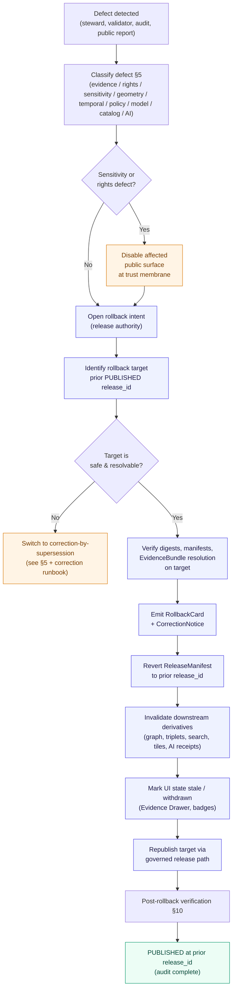

<!-- [KFM_META_BLOCK_V2]
doc_id: kfm://doc/runbook/habitat/rollback
title: Habitat Rollback Runbook
type: standard
version: v1
status: draft
owners: TODO docs steward + habitat lane owner + release authority
created: 2026-05-12
updated: 2026-05-12
policy_label: public
related:
  - docs/domains/habitat/README.md
  - docs/runbooks/habitat/VALIDATION_RUNBOOK.md
  - docs/runbooks/habitat/LOCAL_DEV_RUNBOOK.md
  - docs/runbooks/ui_ROLLBACK.md
  - docs/runbooks/governed_ai_ROLLBACK.md
  - docs/architecture/correction-and-rollback.md
  - docs/doctrine/lifecycle-law.md
  - docs/doctrine/trust-membrane.md
  - directory-rules.md
  - release/README.md
  - schemas/contracts/v1/release/ReleaseManifest.schema.json
  - schemas/contracts/v1/release/RollbackCard.schema.json
  - schemas/contracts/v1/release/CorrectionNotice.schema.json
tags: [kfm, runbook, habitat, rollback, release, governance]
notes:
  - Path placement PROPOSED; see "Placement basis" below.
  - Habitat lane implementation maturity NEEDS VERIFICATION against mounted repo.
[/KFM_META_BLOCK_V2] -->

# Habitat Rollback Runbook

*Operational procedure for reversing a published Habitat release, preserving audit trail, and restoring a governed prior state.*

> **Status:** draft · **Owners:** *TODO — docs steward + habitat lane owner + release authority* · **Last updated:** 2026-05-12

---

## Quick jump

- [1 · Purpose and scope](#1--purpose-and-scope)
- [2 · When to roll back](#2--when-to-roll-back)
- [3 · Authority and pre-flight](#3--authority-and-pre-flight)
- [4 · Rollback flow](#4--rollback-flow)
- [5 · Defect class → rollback posture](#5--defect-class--rollback-posture)
- [6 · Required artifacts](#6--required-artifacts)
- [7 · Sensitive-occurrence rollback](#7--sensitive-occurrence-rollback)
- [8 · Cross-lane impact](#8--cross-lane-impact)
- [9 · Closure rules and reason codes](#9--closure-rules-and-reason-codes)
- [10 · Post-rollback verification](#10--post-rollback-verification)
- [11 · Anti-patterns](#11--anti-patterns)
- [12 · Rehearsal (rollback drill)](#12--rehearsal-rollback-drill)
- [13 · Related docs and appendix](#13--related-docs-and-appendix)

---

## 1 · Purpose and scope

This runbook defines the **governed** procedure for rolling back a published Habitat release — habitat patches, land-cover observations, ecological systems, suitability models, connectivity, corridors, restoration opportunities, stewardship zones, model run receipts, and uncertainty surfaces — when a defect, sensitivity leak, evidence gap, or policy failure is detected after publication.

**Doctrine basis (CONFIRMED):** Habitat publication requires `ReleaseManifest`, `EvidenceBundle`, validation/policy support, review state where required, correction path, stale-state rule, and **rollback target**. A rollback is a **governed state transition**, not a file move; it must not be a hidden file copy.

**Scope (CONFIRMED domain ownership):**

| In scope (Habitat owns) | Out of scope (route to sibling runbook) |
|---|---|
| HabitatPatch, LandCoverObservation, EcologicalSystem | Animal taxa / occurrence → Fauna runbook |
| Habitat Quality Score, SuitabilityModel, UncertaintySurface | Plant taxa / specimens / rare-plant records → Flora runbook |
| ConnectivityEdge, Corridor, Restoration Opportunity | Substrate, wetlands, riparian truth → Soil / Hydrology runbooks |
| StewardshipZone, Model Run Receipt | UI shell / MapLibre adapter rollback → `docs/runbooks/ui_ROLLBACK.md` |
| Habitat layer manifests, Evidence Drawer Habitat panel payloads | AI adapter / Focus Mode rollback → `docs/runbooks/governed_ai_ROLLBACK.md` |

> [!NOTE]
> Habitat is downstream of source-role discipline. Critical habitat (regulatory), modeled habitat (derivative), and occurrence-context habitat (sensitive join) are **distinct source roles**; rolling back one does not necessarily roll back the others. Identify the affected role first.

[↑ Back to top](#habitat-rollback-runbook)

---

## 2 · When to roll back

Trigger a Habitat rollback when one or more of the following is **detected after a release reaches `PUBLISHED`**:

| Trigger | Evidence | Rollback urgency |
|---|---|---|
| **Sensitivity leak** — exact sensitive occurrence geometry or sensitive species context exposed via habitat join | Steward report, automated label/side-channel audit, public report | **Immediate** (disable first, document second) |
| **Rights defect** — source rights revoked, redistribution class changed, license expired | Source ledger update, steward notice | Immediate; quarantine source/artifact |
| **Evidence gap** — published claim lacks resolving `EvidenceBundle`, or `EvidenceRef` no longer resolves | `EvidenceRef` resolution failure, citation validator failure | Withdraw claim; restore prior evidence-supported release |
| **Source-role collapse** — modeled habitat presented as regulatory critical habitat, or aggregate presented as observation | Source-role test failure, steward review | Refuse upcast; restore prior role-correct release |
| **Geometry defect** — geometry invalid, over-precise, or misaligned at release CRS | Geometry validator failure, downstream join breakage | Rebuild derivative; restore prior digest-pinned artifact |
| **Temporal defect** — observed / valid / retrieval / release times confused or shifted | Temporal validator failure | Mark stale until rebuilt |
| **Model defect** — `SuitabilityModel` run inputs, scope, or uncertainty wrong; model-card claims mismatch | Model Run Receipt audit, comparative validation | Restore previous suitability release; mark candidate stale |
| **Policy defect** — policy gate evaluated wrongly; `DENY` should have fired but did not | Policy replay, audit | Disable route/layer if gate failed; re-run gate |
| **Catalog defect** — catalog closure or proof closure passed with orphan artifacts | Closure test failure post-publication | Re-emit catalog closure after proof repair; restore previous catalog state |
| **AI answer defect** — Habitat Focus Mode answer was uncited or escaped policy | Citation validator failure, `AIReceipt` audit | Invalidate `AIReceipt` and response envelope; preserve `EvidenceBundle` |

> [!WARNING]
> Sensitivity leaks and rights defects are **immediate public-disablement** events. Disable the affected layer/route at the trust membrane *before* completing the paperwork. The rollback record is completed after the leak is closed, not before.

[↑ Back to top](#habitat-rollback-runbook)

---

## 3 · Authority and pre-flight

A rollback is a **release-authority** action, not a content-author action. Materiality determines whether the release authority must be **distinct from the original author**.

**Required pre-flight checks (CONFIRMED gate composition):**

- [ ] Affected `release_id` identified and pinned (do not guess from filenames).
- [ ] Prior safe `release_id` identified (the **rollback target**), with intact `ReleaseManifest`, `EvidenceBundle` resolution, and policy/review state.
- [ ] Defect classified per §5 and recorded.
- [ ] Steward review opened if sensitivity, rights, or sovereignty is implicated.
- [ ] Downstream derivatives enumerated (graph/triplet projections, search indexes, Story Node snapshots, Frontier Matrix cells, AI receipts, cached tiles).
- [ ] Release authority identity confirmed; separation-of-duties applied if material.

> [!IMPORTANT]
> If the prior release cannot be resolved as a **safe** rollback target — e.g., it shares the same defect, or its `EvidenceBundle` no longer resolves — this becomes a **correction-by-supersession** event instead. Open a `CorrectionNotice`, prepare a superseding release, and publish forward. Do not roll back to a known-broken state.

[↑ Back to top](#habitat-rollback-runbook)

---

## 4 · Rollback flow

The flow below preserves the lifecycle invariant: rollback is a transition between **PUBLISHED → prior PUBLISHED**, mediated by the same governed release path. It does **not** mutate `data/raw/`, `data/work/`, `data/quarantine/`, `data/processed/`, or `data/catalog/` directly.

> [!NOTE]
> The trust membrane forbids any public client, normal UI surface, or released AI surface from reaching `RAW`, `WORK`, `QUARANTINE`, canonical/internal stores, graph internals, vector indexes, source APIs, or direct model runtimes during a rollback. The `apps/governed-api/` surface is the only path back to `PUBLISHED`.

[↑ Back to top](#habitat-rollback-runbook)

---

## 5 · Defect class → rollback posture

The matrix below is the CONFIRMED doctrine mapping (`KFM_Unified_Implementation_Architecture_Build_Manual` — Correction and rollback model) applied to Habitat. Implementation specifics are PROPOSED until validated against repo evidence.

| Defect class | Correction posture | Rollback posture |
|---|---|---|
| **Evidence gap** | `ABSTAIN` or withdraw unsupported habitat claim | Restore prior evidence-supported habitat release |
| **Rights defect** | `DENY` public use; quarantine source/artifact | Withdraw affected habitat artifacts |
| **Sensitivity leak** (occurrence-linked habitat, sensitive species context) | Redact/generalize and notify stewards | **Immediate** public disablement; rollback after stewards confirm scope |
| **Geometry defect** (over-precision, CRS misalignment, invalid topology) | Rebuild derivative habitat layer and evidence payload | Restore previous digest-pinned habitat artifact |
| **Temporal defect** (observed/valid/retrieval/release time confusion) | Correct time fields; emit corrected `EvidenceBundle` | Mark habitat release stale until rebuilt |
| **Policy defect** (gate evaluated wrongly) | Re-run policy and decision envelope | Disable habitat route/layer if gate failed |
| **AI answer defect** (uncited habitat answer, policy-escape) | Invalidate `AIReceipt` and response envelope | Remove the answer; preserve the `EvidenceBundle` |
| **Catalog defect** (orphan habitat artifact, broken closure) | Re-emit catalog closure after proof repair | Restore previous habitat catalog state |
| **Source-role collapse** (modeled habitat presented as regulatory; aggregate as observation) | Restore source role; refuse upcast; reissue corrected `LayerManifest` | Restore prior role-correct habitat release |

> [!CAUTION]
> **Modeled-as-critical is a habitat-specific failure mode.** Modeled habitat (`SuitabilityModel`) MUST NOT be promoted into the regulatory critical-habitat source role. A release that does this is a rollback trigger, not a labeling fix.

[↑ Back to top](#habitat-rollback-runbook)

---

## 6 · Required artifacts

Every Habitat rollback closes only when the artifacts below exist, **resolve their references** (not merely cite them), and have a recorded policy decision. Missing any of these means the transition fails closed and the prior state is preserved.

| Artifact | Role in rollback | Home (per Directory Rules) | Status |
|---|---|---|---|
| `RollbackCard` | Rollback decision: `release_id`, `rollback_to`, `reason`, `invalidates[]`, `review_ref`, `time` | `release/rollback_cards/` | PROPOSED |
| `CorrectionNotice` | Public notice paired with the rollback: `claim_ref`, `prior_release_ref`, `change_summary`, `invalidates[]`, `review_ref`, `time` | `release/correction_notices/` | PROPOSED |
| `ReleaseManifest` (target) | The reverted manifest: `release_id`, `contents[]`, digests, `evidence_refs[]`, `rollback_target`, `time` | `release/manifests/` | PROPOSED |
| `ReviewRecord` | Required when materiality applies (sensitivity, rights, sovereignty, model defect) | `release/promotion_decisions/` or `release/` review queue | PROPOSED |
| `EvidenceBundle` (target) | Must still resolve for the rollback target | `data/proofs/` | PROPOSED |
| `LayerManifest` (target) | Habitat overlay registry entry for the target release | `data/published/layers/habitat/` | PROPOSED |
| Downstream invalidations | Search index, graph/triplet projection, AI receipts, cached tiles, Story snapshots | Lane-specific | PROPOSED |

> [!IMPORTANT]
> A rollback that lacks a `rollback_target`, fails `EvidenceRef → EvidenceBundle` resolution on that target, or has no recorded policy decision fires the reason code `ROLLBACK_TARGET_MISSING` or `RELEASE_MANIFEST_INVALID`. The transition fails closed; the buggy release remains `PUBLISHED` until the rollback target is repaired or a forward correction is published instead.

[↑ Back to top](#habitat-rollback-runbook)

---

## 7 · Sensitive-occurrence rollback

Habitat layers may reveal sensitive species context **when joined to occurrence records** (DOM-HAB §§1-2; DOM-HF §§1-5; DOM-FAUNA §§12-13). Exact occurrence-linked habitat outputs must be generalized, redacted, reviewed, or denied when they create exposure risk. This is the Habitat-specific high-stakes failure mode and demands extra care during rollback.

**Sensitive-occurrence rollback steps:**

1. **Disable first.** Withdraw the affected habitat layer / Evidence Drawer panel / Focus Mode answer at the governed-API trust membrane. Public surfaces fail closed by default; this step is operating that default, not adding new policy.
2. **Notify stewards.** Open a steward review record before continuing. The release authority does not unilaterally evaluate sensitivity scope; stewards do.
3. **Audit the join.** Identify whether the leak is in the habitat product itself, in the join with Fauna/Flora occurrences, in the renderer (style-based exposure), or in a downstream derivative (AI answer, screenshot, search snippet, graph projection).
4. **Apply the geoprivacy transform retroactively** to the rollback target if needed. Record the transform as a `RedactionReceipt` referenced from the `ReleaseManifest`.
5. **Roll back.** Restore the prior public-safe release. If the prior release shares the leak, switch to correction-by-supersession with a fresh, redacted/generalized public-safe candidate.
6. **Invalidate side channels.** Labels, popups, AI-drafted text, search summaries, and cached tiles can all leak; explicitly invalidate each.
7. **Record the event** in the sensitivity audit register so the failure mode informs future gate hardening.

> [!WARNING]
> **Style-based hiding is not a safety control.** Hiding a sensitive feature behind a style rule does not satisfy the geoprivacy requirement. Exact coordinates for sensitive habitat or occurrence-linked habitat must be **transformed, generalized, delayed, redacted, or denied before release** — and during rollback, the redaction must be present in the artifact itself, not only in the renderer.

[↑ Back to top](#habitat-rollback-runbook)

---

## 8 · Cross-lane impact

Habitat shares boundaries with Fauna, Flora, Soil/Hydrology, and Hazards. A Habitat rollback can implicate downstream lanes; a downstream lane's rollback can implicate Habitat. Cross-lane relations must preserve ownership, source role, sensitivity, and `EvidenceBundle` support.

| Related lane | Relation under rollback | Action to take |
|---|---|---|
| **Fauna** | Habitat assignment + occurrence context, with geoprivacy | Notify Fauna lane owner; invalidate `habitat assignment` records that reference the rolled-back habitat release; preserve geoprivacy posture |
| **Flora** | Vegetation community + rare-plant context, under Flora controls | Notify Flora lane owner; invalidate habitat-association records derived from the rolled-back release |
| **Soil / Hydrology** | Substrate, moisture, wetlands, riparian support | Verify no soil/hydrology-derived layer assumes the withdrawn habitat artifact; coordinate joint correction if needed |
| **Hazards** | Fire, drought, flood, smoke and resilience stress context | Confirm habitat-resilience views are not still pointing at the rolled-back habitat release |

> [!NOTE]
> Habitat does **not** own taxa, plant records, soil/hydrology truth, or hazard truth. A Habitat rollback never silently mutates those lanes. Cross-lane invalidation is a notification + derivative-invalidation step, not a content rewrite.

[↑ Back to top](#habitat-rollback-runbook)

---

## 9 · Closure rules and reason codes

A Habitat rollback transition is **closed** only when **all three** conditions hold (CONFIRMED doctrine):

1. The required artifacts in §6 exist.
2. Every required artifact **resolves** the artifacts it depends on (`EvidenceRef → EvidenceBundle`, `source_id → SourceDescriptor`, `model_id → ModelRunReceipt`).
3. The policy gate evaluated and recorded its decision.

Missing any of these means the transition **fails closed** and the prior state is preserved.

### Gate-failure reason codes (PROPOSED catalog, scoped to rollback)

| Reason code | Fires when | Recovery |
|---|---|---|
| `ROLLBACK_TARGET_MISSING` | No safe prior `release_id` is identified or pinned | Identify a safe target, or switch to correction-by-supersession |
| `RELEASE_MANIFEST_INVALID` | Target manifest is malformed, unsigned, or references unresolvable evidence | Repair the manifest; revalidate; re-run rollback |
| `MISSING_EVIDENCE` | `EvidenceRef` on the target does not resolve to an `EvidenceBundle` | Re-emit the bundle; revalidate target before reverting |
| `MISSING_REVIEW` | Materiality requires a `ReviewRecord` not present on the target | Run required steward review; supply `ReviewRecord` |
| `SENSITIVITY_UNRESOLVED` | Target release has the same sensitivity defect as the rolled-back release | Do not roll back; supersede with a redacted candidate |
| `ROLE_DOWNCAST_FORBIDDEN` | Target presents modeled habitat under a regulatory role | Restore source role; refuse upcast; supersede with role-correct release |
| `REVIEW_INSUFFICIENT` | `ReviewRecord` exists but does not cover the rolled-back scope | Extend review scope; revalidate |

[↑ Back to top](#habitat-rollback-runbook)

---

## 10 · Post-rollback verification

Verification is part of the closure. Without it the rollback is incomplete regardless of whether the bytes were moved.

**PROPOSED Habitat-specific post-rollback checks** (NEEDS VERIFICATION against mounted repo):

- [ ] `ReleaseManifest` at the target `release_id` validates against schema.
- [ ] Every `EvidenceRef` on the target manifest resolves to a current `EvidenceBundle`.
- [ ] `RollbackCard` and `CorrectionNotice` are emitted, linked, and discoverable from the public surface.
- [ ] Habitat `LayerManifest` registry returns the target's layer descriptors and no others for the rolled-back features.
- [ ] Critical-habitat source role and modeled-habitat source role are not collapsed in the rolled-back state (source-role tests).
- [ ] Sensitive occurrence geoprivacy is verifiable on the target (occurrence-geoprivacy tests).
- [ ] Habitat Evidence Drawer payloads for affected features now reference the rolled-back release.
- [ ] Habitat Focus Mode answers covering withdrawn claims now return `ABSTAIN` or `DENY` with citation to the `CorrectionNotice`.
- [ ] Downstream derivatives — graph/triplet projections, search index entries, cached tiles, Story snapshots, Frontier Matrix cells — are invalidated or rebuilt off the rolled-back release.
- [ ] Stale-state UI announcement is visible on affected public surfaces; no silent edit.
- [ ] Rollback drill receipt is recorded for the rehearsal cycle.

> [!TIP]
> Treat the verification list as a **closure checklist**, not a code-review checklist. Each unchecked item is evidence that the rollback transition has not closed; the affected surface should remain disabled until the item is checked.

[↑ Back to top](#habitat-rollback-runbook)

---

## 11 · Anti-patterns

Avoid the failure modes below. Each is a doctrine violation, not a stylistic preference.

| Anti-pattern | Why it fails | Correct posture |
|---|---|---|
| **Hidden file copy** as rollback | Bypasses validators, policy gates, evidence resolution, catalog closure, release recording | Use the governed release path; emit `RollbackCard` + `CorrectionNotice`; revert `ReleaseManifest` |
| **Silent edit** of a published habitat claim | Erases the inspectable claim; corrections must be visible | Open `CorrectionNotice`; supersede or roll back |
| **Style-only hiding** of sensitive habitat geometry | Bytes still ship; renderer is not a safety boundary | Transform/redact at the artifact level; rebuild affected layer |
| **Rollback to a known-broken release** | Restores the same defect | Switch to correction-by-supersession; publish forward |
| **Skipping downstream invalidation** | Search, graph, tiles, AI receipts continue serving the withdrawn claim | Enumerate and invalidate every derivative |
| **Treating modeled habitat as regulatory critical habitat** during rollback | Source-role collapse; legal/operational risk | Restore role-correct release; refuse upcast; supersede if needed |
| **AI-drafted change summary** with no `EvidenceBundle` resolution | Fluent generation standing in for evidence | AI may draft steward-review notes only; `EvidenceBundle` outranks generated language |
| **Untested rollback** | Rollback untested is not reliable | Run a periodic rollback drill (see §12) |

[↑ Back to top](#habitat-rollback-runbook)

---

## 12 · Rehearsal (rollback drill)

CONFIRMED doctrine: rollback is a publication requirement, not an afterthought. Every Habitat release SHOULD have a rehearsed rollback path before it is treated as safely publishable, and the rehearsal cadence should be reported as a governance health indicator (rollback rehearsal rate per release window).

**PROPOSED drill outline:**

1. Pick a non-production release candidate (`release/candidates/habitat/`).
2. Treat it as a notional rollback subject; identify a notional target prior release.
3. Walk §4 end-to-end against synthetic fixtures (`fixtures/domains/habitat/`, `tests/domains/habitat/`).
4. Emit a drill `RollbackCard` (clearly marked as rehearsal) and verify §10 closure.
5. File the drill receipt; record the rehearsal in the release window indicator.
6. Surface any unmet checklist items as defects in the next release-readiness review.

> [!TIP]
> A drill that "passes" without producing a closure-checklist failure is suspicious. Drills exist to surface gate gaps before a real defect does; expect — and document — the gaps you find.

[↑ Back to top](#habitat-rollback-runbook)

---

## 13 · Related docs and appendix

**Related runbooks and architecture:**

- [Habitat domain overview](../../domains/habitat/README.md) — *PROPOSED path*
- [Habitat validation runbook](./VALIDATION_RUNBOOK.md) — *PROPOSED path; sibling*
- [Habitat local-dev runbook](./LOCAL_DEV_RUNBOOK.md) — *PROPOSED path; sibling*
- [UI rollback runbook](../ui_ROLLBACK.md) — *PROPOSED path*
- [Governed AI rollback runbook](../governed_ai_ROLLBACK.md) — *PROPOSED path*
- [Correction and rollback architecture](../../architecture/correction-and-rollback.md) — *PROPOSED path*
- [Lifecycle law doctrine](../../doctrine/lifecycle-law.md) — *PROPOSED path*
- [Trust membrane doctrine](../../doctrine/trust-membrane.md) — *PROPOSED path*
- [Directory Rules](../../../directory-rules.md)
- [ReleaseManifest schema](../../../schemas/contracts/v1/release/ReleaseManifest.schema.json) — *PROPOSED path; per Directory Rules §7*
- [RollbackCard schema](../../../schemas/contracts/v1/release/RollbackCard.schema.json) — *PROPOSED path*
- [CorrectionNotice schema](../../../schemas/contracts/v1/release/CorrectionNotice.schema.json) — *PROPOSED path*

<strong>Appendix A — Doctrine quick reference (CONFIRMED)</strong>

- **Lifecycle invariant:** `RAW → WORK / QUARANTINE → PROCESSED → CATALOG / TRIPLET → PUBLISHED`. Promotion is a governed state transition, not a file move.
- **Rollback is a state transition** between `PUBLISHED → prior PUBLISHED`, mediated by the governed release path.
- **Trust membrane:** public clients and normal UI surfaces use the governed API; no direct access to `RAW`, `WORK`, `QUARANTINE`, canonical/internal stores, graph internals, vector indexes, source APIs, or direct model runtimes.
- **Cite-or-abstain** is the default truth posture; an AI surface MUST `ABSTAIN` on missing evidence and MUST `DENY` where policy, rights, sensitivity, or release state blocks the request.
- **Authority order** for placement disputes during rollback: invariants → ADRs → Directory Rules → per-root READMEs → domain dossiers → repo convention.
- **Source-role discipline:** observation, regulatory, modeled, aggregate, administrative, candidate, and synthetic records are **distinct channels**. Source-role collapse is a rollback trigger.

<strong>Appendix B — Habitat object families (CONFIRMED ownership)</strong>

Habitat owns: `HabitatPatch`; `LandCoverObservation`; `EcologicalSystem`; `Habitat Quality Score`; `SuitabilityModel`; `ConnectivityEdge`; `Corridor`; `Restoration Opportunity`; `StewardshipZone`; `Model Run Receipt`; `UncertaintySurface`.

Habitat does **not** own: animal taxa / occurrence (Fauna); plant taxa / specimens / occurrences / rare plant records (Flora); soil, hydrology, agriculture, hazards, archaeology truth.

<strong>Appendix C — Placement basis for this file</strong>

**Path:** `docs/runbooks/habitat/ROLLBACK_RUNBOOK.md`

**Directory Rules basis:**
- **Responsibility root:** `docs/` — the human-facing control plane is the canonical home for runbooks (Directory Rules §5; *Placement Protocol Step 1*: "Explains something to humans → `docs/`").
- **Domain segment:** `habitat` appears as a segment inside the responsibility root, never as a root itself (Directory Rules §12, Domain Placement Law).
- **Existing precedent:** the Whole-UI + Governed AI Expansion report lists flat `docs/runbooks/<subsystem>_ROLLBACK.md` files (e.g., `ui_ROLLBACK.md`, `governed_ai_ROLLBACK.md`) as **PROPOSED**, where `<subsystem>` is `ui`/`governed_ai`/etc. Those are **subsystem** runbooks, not **domain** runbooks. A `habitat/` subdirectory is a reasonable extension of the §12 lane pattern to runbooks, but it differs from the visible subsystem-flat precedent.
- **Open: flat vs nested.** Whether domain runbooks live as `docs/runbooks/habitat/ROLLBACK_RUNBOOK.md` (nested, this file) or `docs/runbooks/habitat_ROLLBACK.md` (flat, mirroring `ui_ROLLBACK.md`) is **NEEDS VERIFICATION** against current repo convention and an ADR.

<strong>Appendix D — Open verification items</strong>

Inherited from the Habitat domain verification backlog (`KFM_Domains_Culmination_Atlas` §6 / Habitat §N):

- Verify official critical habitat source descriptors. **NEEDS VERIFICATION**
- Verify sensitive occurrence policy and geoprivacy transforms. **NEEDS VERIFICATION**
- Verify model-card requirements for suitability products. **NEEDS VERIFICATION**
- Verify Habitat MapLibre overlay registry and Focus behavior. **NEEDS VERIFICATION**

Runbook-specific:

- Verify `release/rollback_cards/`, `release/correction_notices/`, and `release/manifests/` exist in the mounted repo. **NEEDS VERIFICATION**
- Verify that the governed-API surface for `LayerManifest` rollback is implemented and not a static file move. **NEEDS VERIFICATION**
- Verify rollback drill cadence and receipt format. **NEEDS VERIFICATION**

---

**Related docs:** see §13 above. · **Doctrine:** CONFIRMED. · **Implementation maturity:** PROPOSED / NEEDS VERIFICATION. · **Last updated:** 2026-05-12.

[↑ Back to top](#habitat-rollback-runbook)
