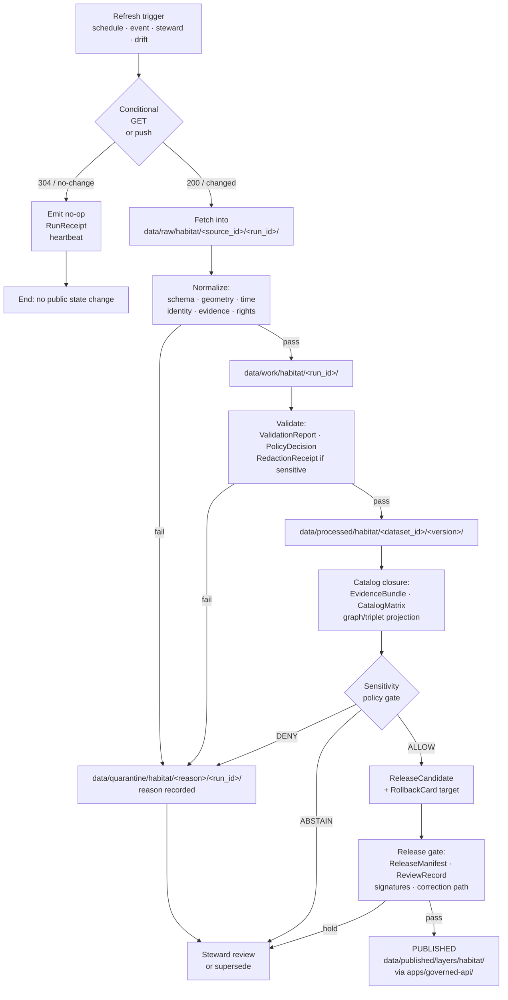

<!-- [KFM_META_BLOCK_V2]
doc_id: kfm://doc/runbook-habitat-source-refresh
title: Habitat Source Refresh Runbook
type: standard
version: v0.1
status: draft
owners: Habitat lane steward + Docs steward (TBD — assign via per-root README)
created: 2026-05-12
updated: 2026-05-12
policy_label: public
related:
  - docs/doctrine/directory-rules.md
  - docs/domains/habitat/README.md
  - docs/sources/SOURCE_DESCRIPTOR_STANDARD.md
  - docs/standards/SMART_SYNC.md
  - docs/standards/RUN_RECEIPT.md
  - docs/runbooks/governed_ai_VALIDATION.md
  - docs/registers/VERIFICATION_BACKLOG.md
tags: [kfm, runbook, habitat, sources, lifecycle, governance]
notes:
  - PROPOSED placement; nested vs flat runbook layout is NEEDS VERIFICATION
  - All source endpoints, cadences, and rights statuses are NEEDS VERIFICATION
  - Implementation maturity (routes, schemas, watcher code) is PROPOSED
[/KFM_META_BLOCK_V2] -->

# Habitat Source Refresh Runbook

> **How the Habitat lane re-admits, re-validates, and re-promotes evidence from upstream ecological sources without bypassing the trust membrane.** Refresh is a *governed state transition*, not a file refresh. No bytes change public state until validators, policy gates, evidence-bundle closure, and release decisions all pass — every time.

<p align="left">
  
  
  
  
  
  
  <!-- TODO: replace with real Shields.io endpoints once CI surface is wired -->
</p>

| Field | Value |
|---|---|
| **Document type** | Runbook (operational procedure) |
| **Status** | `draft` — PROPOSED placement and content |
| **Lane** | Habitat — see `docs/domains/habitat/` (PROPOSED) |
| **Owners** | Habitat lane steward + Docs steward (TBD; **placeholder** — confirm via per-root README) |
| **Last reviewed** | `2026-05-12` (initial draft) |
| **Authority for procedure** | KFM core invariants → Directory Rules → Habitat dossier → this runbook |
| **Authority for *any specific path* quoted here** | **PROPOSED** until verified against the mounted repo |

---

## Quick jump

- [1. Purpose & scope](#1-purpose--scope)
- [2. Authority & invariants](#2-authority--invariants)
- [3. Preconditions](#3-preconditions)
- [4. Habitat source families](#4-habitat-source-families)
- [5. End-to-end refresh flow](#5-end-to-end-refresh-flow)
- [6. Conditional GET & smart sync](#6-conditional-get--smart-sync)
- [7. Watcher-as-non-publisher](#7-watcher-as-non-publisher)
- [8. Stale-state markers & supersession](#8-stale-state-markers--supersession)
- [9. Sensitivity, rights & geoprivacy gates](#9-sensitivity-rights--geoprivacy-gates)
- [10. Validation & policy gates](#10-validation--policy-gates)
- [11. Promotion, correction & rollback](#11-promotion-correction--rollback)
- [12. Operator checklist](#12-operator-checklist)
- [13. Failure modes & responses](#13-failure-modes--responses)
- [14. Verification backlog](#14-verification-backlog)
- [15. Related docs](#15-related-docs)
- [Appendix A — Example artifacts](#appendix-a--example-artifacts)

---

## 1. Purpose & scope

This runbook governs **how Habitat lane sources are refreshed** — re-checked for change, re-fetched when warranted, re-normalized, re-validated, re-bundled, and re-promoted — without bypassing any KFM gate.

It applies whenever any of the following triggers a check against an upstream source for the Habitat lane:

- Scheduled cadence on a registered `SourceDescriptor`.
- Object-store event or push notification (where the upstream is event-capable).
- Steward-initiated re-admission (e.g., after a rights or sensitivity change).
- Schema, geography, model, or policy version drift detected against an already-published claim.

**In scope.** Procedure, gates, receipts, sensitivity posture, stale handling, supersession, rollback, and the artifacts each step must produce.

**Out of scope.**

- Object-family meaning (lives in `contracts/`).
- Field-level schema shape (lives in `schemas/contracts/v1/…`).
- Admissibility logic itself (lives in `policy/`).
- Source identity, rights, sensitivity at registration time (lives in `data/registry/` and the `SourceDescriptor` standard).
- Habitat *modeling* — model-card, suitability, connectivity training/eval. This runbook only governs refresh of *inputs* to such models and supersession when an input changes.

> [!IMPORTANT]
> **Refresh is a governed state transition, not a file move.** A new fetch into `data/raw/habitat/...` does not, by itself, change any public state. Public state changes only when promotion, validation, and policy gates pass with the artifacts named in this runbook.

<sub><a href="#quick-jump">↑ Back to top</a></sub>

---

## 2. Authority & invariants

When this runbook conflicts with other sources, resolve in this order (mirrors Directory Rules §2.1):

1. **KFM core invariants** — lifecycle law, cite-or-abstain, trust membrane, authority ladder, watcher-as-non-publisher.
2. **Accepted ADRs** amending Directory Rules or Habitat schema/policy homes.
3. **Directory Rules** (`docs/doctrine/directory-rules.md`).
4. **Habitat dossier** (`docs/domains/habitat/`) and the Habitat+Fauna thin-slice plan.
5. **This runbook.**
6. **Per-root READMEs** in the affected lane.

### Invariants this runbook preserves

| Invariant | Operational form for Habitat refresh |
|---|---|
| **Lifecycle law** | `RAW → WORK / QUARANTINE → PROCESSED → CATALOG / TRIPLET → PUBLISHED` — no skipping, no silent promotion. |
| **Watcher-as-non-publisher** | Watchers emit `RunReceipt` and candidate decisions only; they **never** write to `data/catalog/`, `data/published/`, or `release/`. |
| **Cite-or-abstain** | A Habitat claim without a resolvable `EvidenceRef → EvidenceBundle` cannot be re-promoted. |
| **Trust membrane** | Public clients consume only released layer manifests; refresh never bypasses `apps/governed-api/`. |
| **Deny-by-default sensitivity** | Regulatory critical habitat, exact rare-species occurrence joins, and unresolved rights remain restricted until proven releasable. |
| **Reversibility** | Every promotion in this flow has a named `RollbackCard` target before it is allowed. |

<sub><a href="#quick-jump">↑ Back to top</a></sub>

---

## 3. Preconditions

Before any operator runs a Habitat refresh, **all** of the following must be true. If any is `false` or `unknown`, stop and route to the Habitat lane steward.

- [ ] The source has a current `SourceDescriptor` in `data/registry/sources/habitat/` *(PROPOSED path; see Directory Rules §12)* with source_id, source_role, authority, rights, sensitivity, and cadence.
- [ ] The `SourceDescriptor` rights status is one of `open | controlled | restricted` — **never** `unknown`. Unknown rights fail closed.
- [ ] The watcher entry (e.g., `tools/ingest/watchers/<habitat>_*.yaml`) is **signed** and registered. *(PROPOSED location.)*
- [ ] A `RollbackCard` template exists for the affected release, or one will be authored before promotion (see §11).
- [ ] Operator has access to required artifact stores and to the policy bundle version pinned by the current release.
- [ ] Adjacent doctrine documents (`docs/sources/SOURCE_DESCRIPTOR_STANDARD.md`, `docs/standards/SMART_SYNC.md`, `docs/standards/RUN_RECEIPT.md`) are read.

> [!CAUTION]
> If a `SourceDescriptor` is missing, this is **not** a "refresh" — it is an **admission**, which is a different governed transition (`— → RAW`) and requires the source-admission runbook *(PROPOSED, NEEDS VERIFICATION)*. Do not improvise.

<sub><a href="#quick-jump">↑ Back to top</a></sub>

---

## 4. Habitat source families

The Habitat lane consumes the following families. **All rights, cadence, and endpoint details are `NEEDS VERIFICATION`** against the current upstream terms-of-service and the live `SourceDescriptor`; treat the table as a checklist, not a contract.

| Source family | Typical source role | Sensitivity posture | Cadence (placeholder — NEEDS VERIFICATION) |
|---|---|---|---|
| **USFWS ECOS / critical habitat services** | `authority` | Public, but joins to sensitive species fail closed | Source-vintage-driven |
| **KDWP state review context** | `authority / observation` | State-controlled; some fields restricted | Steward-cadence |
| **NLCD land cover** | `authority / observation` | Public raster; derivatives PROPOSED public | Periodic, multi-year |
| **NWI wetlands** | `authority / observation` | Public, but joins to listed-species occurrence restricted | Vintage-driven |
| **GAP / LANDFIRE** | `authority / context / model` | Public; model labels MUST stay visible | Periodic |
| **NatureServe + controlled biodiversity** | `authority` (controlled) | Often controlled; rights MUST be honored | License-driven |
| **GBIF / iNaturalist / iDigBio occurrence inputs** | `observation` (often as Habitat context only) | **Geoprivacy-sensitive**; exact location DENY by default | Continuous / API-driven |
| **PAD-US stewardship context** | `authority / context` | Public; sensitivity flags travel through | Periodic |
| **State ecological inventories / restoration projects** | `observation / context` | Mixed; per-source rights | Project-driven |
| **Remote-sensing vegetation indices** | `observation / model as source` | Public products; model labels preserved | Sensor-cadence |
| **Field surveys & steward-reviewed habitat models** | `observation / model as source` | Steward-controlled; review state required | Steward-cadence |

<details>
<summary><strong>Citation:</strong> sources for the table above</summary>

Source basis enumerated in the Habitat dossier (`[DOM-HAB]`) and KFM Encyclopedia §7.4 / Appendix D ("Source families and source roles"). The Habitat lane scope is **CONFIRMED doctrine** — the *implementation*, including which source IDs are admitted in the current repo state, is **PROPOSED / NEEDS VERIFICATION** until the source ledger is inspected.

</details>

> [!NOTE]
> The Habitat lane explicitly **does not own** species occurrence truth, plant taxonomy, or fauna taxonomy. It *joins* to Fauna and Flora through governed relationships. A Habitat refresh that pulls occurrence data is consuming it as *context*, never as authoritative occurrence evidence — those refreshes are governed by the **Fauna** and **Flora** source-refresh runbooks *(PROPOSED, NEEDS VERIFICATION — author parallel runbooks per lane)*.

<sub><a href="#quick-jump">↑ Back to top</a></sub>

---

## 5. End-to-end refresh flow

The diagram below shows the canonical refresh flow. Every transition between phases is a **gate**, not a copy; phases correspond to the lifecycle invariant. The diagram reflects **CONFIRMED doctrine**; specific gate implementations (`gate.A`–`gate.G`, validator scripts, policy bundle IDs) are **PROPOSED / NEEDS VERIFICATION** against the mounted repo.



**Read the diagram as:** the right-hand spine (`A → C → E → G → H → J → K → P`) is the only path to a public state change. The left-hand spine (`B → Bn → Z`) is the most common outcome — **most refreshes change nothing publicly** and that is correct. The `Q` lane (quarantine) is healthy operation, not failure: it is how unresolved evidence stays auditable instead of leaking.

<details>
<summary><strong>Gate-by-gate artifact requirements</strong> (consolidated from KFM Domains Atlas §24.6.1)</summary>

| Gate (transition) | Pre-condition | Required artifacts | Fail-closed outcome |
|---|---|---|---|
| **Admission** (`— → RAW`) | `SourceDescriptor` exists; rights ≠ unknown | `SourceDescriptor`; payload hash or reference | Not admitted; logged as candidate awaiting steward |
| **Normalization** (`RAW → WORK / QUARANTINE`) | Schema, geometry, time, identity, evidence, rights rules runnable | `TransformReceipt`; `ValidationReport` (working); `PolicyDecision`; `QUARANTINE` for failures | Quarantine with reason; never silently promotes |
| **Validation** (`WORK → PROCESSED`) | Validators deterministic and tied to fixtures | `ValidationReport` pass; `RedactionReceipt` if sensitivity applies; `AggregationReceipt` if applies | Stay in WORK; structured FAIL outcome |
| **Catalog closure** (`PROCESSED → CATALOG / TRIPLET`) | `EvidenceRef`s resolve; catalog matrix + digests close | `CatalogMatrix` entry; `EvidenceBundle`; graph/triplet projections | HOLD at PROCESSED; no public edge |
| **Release** (`CATALOG / TRIPLET → PUBLISHED`) | Review state where required; release authority distinct from author when material | `ReleaseManifest`; rollback target; correction path; `ReviewRecord` (if required) | HOLD at CATALOG; no public surface change |
| **Correction** (`PUBLISHED → PUBLISHED′`) | Detected error or new evidence | `CorrectionNotice` + new `ReleaseManifest` + supersession link | Old release retained for audit |

</details>

<sub><a href="#quick-jump">↑ Back to top</a></sub>

---

## 6. Conditional GET & smart sync

**Polling is conditional. Always.** The first network call on every refresh is a validator probe, not a download.

### 6.1 Order of preference

1. **Object-store event subscription** (preferred when available, e.g., partner-granted S3 / GCS notifications): handler receives the event, compares the recorded validator, performs an optional defensive `HEAD`, then fetches.
2. **HTTP conditional GET with `If-None-Match`** (strong ETag preferred; weak ETag is advisory).
3. **`If-Modified-Since`** fallback (Last-Modified-based).
4. **Manifest SHA-256 verification** if the publisher exposes a checksum manifest.
5. **Polite full GET** only when none of the above is available — and in that case the watcher MUST record `validators_absent: true` in the `RunReceipt` so downstream gates can downgrade evidence quality.

### 6.2 What gets recorded on a 304 / no-change

A no-change response is **not** a no-op. It is an audited event.

```json
{
  "spec_hash": "jcs:sha256:<unchanged>",
  "source_head": {
    "etag": "\"<unchanged>\"",
    "last_modified": "<ISO8601>",
    "content_length": 0,
    "source_commit": null
  },
  "source_url": "<provider URI>",
  "decision_log": {
    "decision_id": "<uuid>",
    "policy_id": "gate.A.identity",
    "decision": "no_change",
    "obligations": []
  },
  "target_zone": "RAW",
  "result": "heartbeat",
  "kfm_spec_version": "vNext",
  "timestamp": "<ISO8601 UTC>"
}
```

> [!NOTE]
> A 304 heartbeat **MUST NOT** trigger new STAC items, DCAT distributions, PROV entities, cache invalidation, or layer-manifest churn. The hydrology-domain precedent applies to Habitat: *"Confirmed no-change responses should not create new STAC/DCAT/PROV entities."* Treat any layer-manifest update on a no-change refresh as a regression.

### 6.3 Debounce / coalesce for event-driven sources

For event-driven Habitat inputs (e.g., a partner-granted bucket emitting many small object events), aggregate events into a **delta manifest** over a per-source debounce window. Materialization only happens when the `spec_hash` actually changes.

| Source class (PROPOSED) | Debounce window |
|---|---|
| High-churn sensor (e.g., near-real-time vegetation index updates) | 5–30 s |
| Moderate feed (e.g., partner habitat correction stream) | 30–120 s |
| Heavy batch (NLCD vintage drop, LANDFIRE release) | 120–300 s |

Window starting numbers are **PROPOSED**; calibrate per source and record per-source materialization rates over time.

<sub><a href="#quick-jump">↑ Back to top</a></sub>

---

## 7. Watcher-as-non-publisher

This is the most-violated invariant in source refresh systems and KFM treats it as a **MUST**:

> **A watcher emits receipts and candidate decisions. A watcher does not publish, mutate canonical records, write to `data/catalog/`, write to `data/published/`, write to `release/`, or invalidate caches.**

| Watcher MAY | Watcher MUST NOT |
|---|---|
| Fetch into `data/raw/habitat/<source_id>/<run_id>/` | Write to `data/processed/`, `data/catalog/`, `data/published/`, `release/` |
| Emit `RunReceipt` (signed) | Emit a `ReleaseManifest` |
| Emit a `RunReceipt` with `decision: quarantine` | Bypass the policy gate by setting `target_zone: PUBLISHED` |
| Update its own `validators` checkpoint (ETag, Last-Modified, SHA-256) | Update a public-facing layer cache, CDN, or tile host |
| Mark itself superseded; emit a final receipt | Activate or deactivate layers in the renderer |
| Hand off to a downstream promotion job via a queue or candidate dossier | Sign anything other than its own `RunReceipt` envelope |

> [!WARNING]
> A watcher that writes to `data/catalog/`, `data/published/`, or `release/` is a trust-membrane breach. Treat it as a security incident: rotate credentials if the watcher had write paths it should not have had, audit the affected artifacts, and write a runbook entry in `docs/runbooks/` describing the breach and the remediation.

<sub><a href="#quick-jump">↑ Back to top</a></sub>

---

## 8. Stale-state markers & supersession

KFM distinguishes **stale** (evidence has aged past its declared tolerance) from **wrong** (substance is incorrect). Both have visible markers; both have traceable lifecycles. A source refresh is one of several events that can resolve stale state — or expose it.

| Marker | Trigger | UI signal | Required action |
|---|---|---|---|
| **Source freshness expired** | Cadence in `SourceDescriptor` passed without re-admission | "Stale source" badge in Evidence Drawer | Re-admit via this runbook, or supersede; otherwise mark dependent claims stale |
| **Schema version drift** | Object schema upgraded past the published claim's version | "Schema drift" badge; link to migration ADR | Migrate, re-validate, re-release; or mark stale |
| **Geography version drift** | `GeographyVersion` replaced; claim still bound to prior | "Geography version" banner with prior-version citation | Rebind to current `GeographyVersion`; re-release; or mark stale |
| **Time-scope outside support** | Claim's temporal scope falls outside current support window | "Time out of support" indicator | Mark stale; do not refresh silently |
| **Model version superseded** | `ModelRunReceipt` references an older model than current | "Model version" badge with new model identity | Re-run; supersede; or mark stale |
| **Review aged out** | `ReviewRecord` older than the review-cycle tolerance for the lane | "Review aged" badge | Trigger steward review; potentially downgrade tier |
| **Rights status changed** | Rights change in `SourceDescriptor` | "Rights changed" badge | Re-evaluate tier; potentially downgrade; emit `CorrectionNotice` if necessary |
| **Policy version changed** | Policy referenced by `PolicyDecision` superseded | "Policy version" badge | Re-run gate; potentially supersede release |

### Supersession behavior

When a Habitat refresh produces a *changed* normalized output, the prior published claim is **not** deleted — it is **superseded**:

- The old `SourceDescriptor` is retained with `superseded_by: <new_source_descriptor_id>` and an entry in the source register.
- The old `EvidenceBundle` is retained and linked to a `CorrectionNotice` if the change reflects an error rather than a vintage update.
- The old `ReleaseManifest` becomes the rollback target for the new one.
- `GeographyVersion` and `Schema` supersession both produce ADR entries and version-register crosswalks.

<sub><a href="#quick-jump">↑ Back to top</a></sub>

---

## 9. Sensitivity, rights & geoprivacy gates

Habitat sits next to several sensitive registers. A refresh that flattens that sensitivity is a far worse outcome than a refresh that fails closed.

### 9.1 Deny-by-default register relevant to Habitat

| Class | Default | Required to release | Citation |
|---|---|---|---|
| **Rare-species occurrence** (joined to Habitat as context) | DENY exact location | Geoprivacy transform + `RedactionReceipt` + steward review | `[DOM-FAUNA]` / `[DOM-FLORA]` |
| **Sacred / culturally sensitive places** intersecting Habitat polygons | DENY exact public output | Cultural / steward review + sensitivity transform | `[DOM-ARCH]` |
| **Source-rights-limited records** (e.g., controlled NatureServe data) | DENY public release | Rights resolution; attribution; no public derivative if barred | `[ENCY]` |
| **Exact sensitive locations** (rare patch, last-known-population polygon) | DENY by default | Redaction / generalization + audit | `[DOM-DIR]` |
| **Living-person joins** (private landowner-sensitive context) | DENY exact / public if unclear | Aggregation; permissions; policy review | `[DOM-PEOPLE]` |

### 9.2 Critical habitat vs modeled habitat

The Habitat ubiquitous language is specific here and **must not be flattened**:

- **Regulatory critical habitat** is a designated regulatory category sourced from authoritative agency services (e.g., USFWS ECOS). It carries legal meaning.
- **Modeled habitat** is a KFM- or partner-produced suitability surface. It carries probabilistic meaning.

A refresh **MUST NOT** allow modeled habitat to be presented as regulatory critical habitat at any surface — drawer, layer, focus, export, or downstream graph. The `modeled-as-critical denial` test is one of the lane's named negative fixtures.

### 9.3 Style filters are not protection

Hiding a sensitive layer in the MapLibre style is **not** a sensitivity protection — the bytes can still be inspected. Sensitive geometry MUST be transformed before publication, not styled away. Sensitivity transforms require receipts and `EvidenceBundle` linkage before publication.

> [!CAUTION]
> If a refresh produces output that *requires* a style filter to keep something hidden, it is in the wrong place. Roll it back to `WORK` or `QUARANTINE` and apply the geoprivacy transform there.

<sub><a href="#quick-jump">↑ Back to top</a></sub>

---

## 10. Validation & policy gates

Each gate produces a structured decision; each decision goes in the `RunReceipt` for that run. The shape below is **PROPOSED** until the mounted policy bundle and validator suite are inspected.

| Gate | Family | Purpose | Pass criterion (PROPOSED) | Fail outcome |
|---|---|---|---|---|
| **A — Identity & integrity** | `gate.A.identity` | spec_hash via RFC 8785 JCS + SHA-256; `source_head` validators recorded | `spec_hash` recomputes; validators non-empty (or `validators_absent: true` recorded) | QUARANTINE |
| **B — License & provenance** | `gate.B.license` | SPDX license recorded and on allowlist | `license.spdx_id` ∈ allowlist; provenance link resolves | QUARANTINE (UNKNOWN → fail) |
| **C — Schema & geometry QA** | `gate.C.qa` | Schema validates; geometry repair report attached if repairs occurred | Schema valid; area drift within threshold; topology repaired | QUARANTINE |
| **D — Policy evaluation** | `gate.D.policy` | Rights, sensitivity, source role, release state policy check | `decision == "allow"`; obligations resolvable | DENY / HOLD |
| **E — Evidence closure** | `gate.E.evidence` | `EvidenceRef → EvidenceBundle` resolves | Bundle resolves; required fields present | ABSTAIN |
| **F — Attestation** | `gate.F.attest` | DSSE envelope; cosign signature; optional Rekor index | Signature verifies; (if keyless) Rekor inclusion proof valid | DENY |
| **G — Release** | `gate.G.release` | `ReleaseManifest` + rollback target + review state | All bound; release authority distinct from author when material | HOLD |

### Fail-closed rules before promotion

Any of the following force `target_zone = QUARANTINE` and block promotion:

- Missing or unverifiable signature.
- `spec_hash` mismatch on recompute.
- License verdict `fail` or `UNKNOWN`.
- OPA decision ≠ `allow`.
- Missing required `evidence_refs`.
- `confidence_score < 0.6` (where the source produces a confidence field).
- Sensitivity transform required but receipt absent.

<sub><a href="#quick-jump">↑ Back to top</a></sub>

---

## 11. Promotion, correction & rollback

### 11.1 Promotion is a state transition

Promotion to `PUBLISHED` is the act of binding a `ReleaseManifest`. It is **not** the act of copying bytes to `data/published/`. A pipeline that writes to `data/published/` without a bound `ReleaseManifest` has violated the lifecycle invariant.

`ReleaseManifest` references that MUST be present for a Habitat refresh promotion:

- `EvidenceBundle` reference(s)
- `LayerManifest` reference(s) — public-safe only
- `PolicyDecision` reference (current bundle version)
- `ReviewRecord` reference (where required — e.g., for sensitive joins)
- `RollbackCard` target — pointer to the prior release manifest, artifact digests, and cache-invalidation steps
- Correction path — how a future `CorrectionNotice` would be issued
- Signature artifacts (`release/signatures/…`)

### 11.2 Correction lineage

Corrections **never erase lineage**. The old release is retained; the new release supersedes it; a `CorrectionNotice` documents what changed and why. The published catalog continues to expose both the new release and the supersession link.

### 11.3 Rollback drill

Before a Habitat refresh that materially changes a published surface can promote, a rollback drill MUST be runnable against the candidate release:

1. Identify the current `ReleaseManifest` for the affected layer(s).
2. Author a `RollbackCard` naming: prior manifest digest, artifact digests to restore, cache/CDN invalidation steps, and replay steps.
3. Dry-run the rollback in a non-public environment; produce a rollback receipt.
4. Attach the rollback receipt to the release-candidate dossier.
5. Promotion proceeds **only** after rollback is proven reversible.

> [!IMPORTANT]
> A release without a tested rollback target is not eligible for promotion. This is non-negotiable for Habitat surfaces because Habitat layers anchor downstream Fauna and Flora joins; a wrong publication propagates fast.

<sub><a href="#quick-jump">↑ Back to top</a></sub>

---

## 12. Operator checklist

For a single Habitat source refresh, work top-to-bottom. If any item fails, stop and either remediate or quarantine.

### Pre-flight

- [ ] Confirm `SourceDescriptor` present, current, and `rights ≠ unknown`.
- [ ] Confirm watcher entry is registered and signed.
- [ ] Confirm policy bundle version is current and pinned.
- [ ] Confirm rollback target is identified (even if not yet authored).

### Fetch

- [ ] Conditional probe runs first (`HEAD` / `If-None-Match` / event subscription).
- [ ] On 304 / no-change: emit heartbeat `RunReceipt`. **STOP.** No public state change.
- [ ] On change: fetch into `data/raw/habitat/<source_id>/<run_id>/` with retrieval metadata and checksum.

### Normalize & validate

- [ ] Run schema, geometry, time, identity, evidence, and rights validators.
- [ ] Pass → emit `TransformReceipt` and move to `data/work/habitat/<run_id>/`.
- [ ] Fail → emit `QUARANTINE` receipt with reason; stop the run; route to steward.

### Catalog closure

- [ ] Resolve all `EvidenceRef`s to `EvidenceBundle`s.
- [ ] Emit `CatalogMatrix` entry; emit graph/triplet projection.
- [ ] Run sensitivity policy gate. Apply `RedactionReceipt` / `AggregationReceipt` if needed.

### Promotion

- [ ] Bind `ReleaseManifest` with rollback target.
- [ ] Run release-gate; obtain signatures.
- [ ] Activate via `apps/governed-api/` — never directly.

### Post-flight

- [ ] Verify drawer, layer, and focus surfaces reflect the new release (or that 304 heartbeat surfaces unchanged).
- [ ] File a brief incident entry if any gate failed unexpectedly.
- [ ] Update the Habitat verification backlog if a `NEEDS VERIFICATION` item was resolved.

<sub><a href="#quick-jump">↑ Back to top</a></sub>

---

## 13. Failure modes & responses

| Symptom | Probable cause | Response |
|---|---|---|
| 304 response but a new layer manifest was generated anyway | Watcher emitted a manifest on a no-change tick (regression) | Treat as bug; do not promote; capture as negative fixture |
| Publisher dropped ETag; full GET returned identical bytes | Validator stripping on republish | Compare SHA-256 against prior; emit `validators_absent: true`; downgrade evidence quality label |
| Policy decision `unknown` | Missing license SPDX or unresolved rights | QUARANTINE; route to rights resolution; do **not** promote |
| Modeled suitability surface inadvertently joined to "critical habitat" label | Source-role flattening | DENY; reject candidate; run `modeled-as-critical-denial` test; correct labeling pipeline |
| Sensitive species occurrence reaches `PROCESSED` with exact coordinates | Geoprivacy transform skipped or misconfigured | Roll back to `WORK`; apply geoprivacy transform with receipt; re-run gates |
| `GeographyVersion` changed mid-refresh | Concurrent geography supersession | Pause refresh; rebind to current `GeographyVersion`; restart from validation |
| `ReleaseManifest` bound but rollback drill never ran | Out-of-order promotion | Treat as governance breach; immediately author and run a rollback drill; issue `CorrectionNotice` if a public state changed |
| Watcher wrote to `data/catalog/` or `data/published/` | Trust-membrane breach | Rotate credentials; audit; runbook entry; revert affected artifacts; add static grep test to CI |

<details>
<summary><strong>Incident escalation path</strong> (PROPOSED — NEEDS VERIFICATION against current governance)</summary>

1. Operator records the failure in the run log with `run_id` and `spec_hash`.
2. Habitat lane steward acknowledges; classifies as `stale`, `wrong`, `sensitive`, or `membrane breach`.
3. If `wrong` or `sensitive` reached a public surface: issue `CorrectionNotice`, run rollback, notify Docs steward.
4. If `membrane breach`: treat per security runbook (TBD — see Directory Rules §10 reference to `docs/runbooks/` for secrets/leak incidents).
5. Drift entry recorded in `docs/registers/DRIFT_REGISTER.md` if the failure reveals a doctrine vs. implementation gap.

</details>

<sub><a href="#quick-jump">↑ Back to top</a></sub>

---

## 14. Verification backlog

These items are explicitly **not** resolved in this draft. They should be tracked in `docs/registers/VERIFICATION_BACKLOG.md` and addressed via ADR, per-root README, or a follow-up PR.

- **NEEDS VERIFICATION:** Exact path placement of this runbook. The Whole-UI / Governed-AI expansion plan attests flat naming (e.g., `docs/runbooks/ui_LOCAL_DEV.md`). This file uses nested naming (`docs/runbooks/habitat/SOURCE_REFRESH_RUNBOOK.md`). Resolve via a short per-root README in `docs/runbooks/` or an ADR.
- **NEEDS VERIFICATION:** Whether `data/registry/sources/habitat/` or `data/registry/habitat/` is the live registry home for Habitat `SourceDescriptor`s.
- **NEEDS VERIFICATION:** Official `SourceDescriptor` records for USFWS critical habitat, KDWP, NLCD, NWI, GAP/LANDFIRE, NatureServe, and PAD-US — current rights, cadence, and endpoints.
- **NEEDS VERIFICATION:** Habitat geoprivacy transform implementation and the `Geoprivacy transform` field shape on `SourceDescriptor`.
- **NEEDS VERIFICATION:** Model-card requirements for suitability products under refresh-driven supersession.
- **NEEDS VERIFICATION:** Habitat MapLibre overlay registry and Focus Mode behavior on stale-state badges.
- **NEEDS VERIFICATION:** Watcher implementation paths (`tools/ingest/watchers/`) and signing convention.
- **NEEDS VERIFICATION:** Policy bundle version and Conftest / OPA rule IDs (`gate.A` … `gate.G`).
- **OPEN:** Should this runbook be paired with a `docs/runbooks/habitat/SOURCE_ADMISSION_RUNBOOK.md` (initial `— → RAW`) and `docs/runbooks/habitat/ROLLBACK_DRILL_RUNBOOK.md`? PROPOSED yes; defer to ADR.

<sub><a href="#quick-jump">↑ Back to top</a></sub>

---

## 15. Related docs

- [`docs/doctrine/directory-rules.md`](../../doctrine/directory-rules.md) — placement and lifecycle doctrine
- [`docs/doctrine/lifecycle-law.md`](../../doctrine/lifecycle-law.md) *(PROPOSED)* — `RAW → PUBLISHED` invariants
- [`docs/doctrine/trust-membrane.md`](../../doctrine/trust-membrane.md) *(PROPOSED)* — public-path discipline
- [`docs/domains/habitat/README.md`](../../domains/habitat/README.md) *(PROPOSED)* — Habitat lane overview
- [`docs/sources/SOURCE_DESCRIPTOR_STANDARD.md`](../../sources/SOURCE_DESCRIPTOR_STANDARD.md) *(PROPOSED)* — standard descriptor fields
- [`docs/standards/SMART_SYNC.md`](../../standards/SMART_SYNC.md) *(PROPOSED)* — conditional-GET and event-driven ingest standard
- [`docs/standards/RUN_RECEIPT.md`](../../standards/RUN_RECEIPT.md) *(PROPOSED)* — canonical `RunReceipt` schema
- [`docs/runbooks/ui_VALIDATION.md`](../ui_VALIDATION.md) *(PROPOSED)* — UI-side validation that surfaces refresh outcomes
- [`docs/runbooks/governed_ai_VALIDATION.md`](../governed_ai_VALIDATION.md) *(PROPOSED)* — Focus Mode evidence / citation gates
- [`docs/registers/VERIFICATION_BACKLOG.md`](../../registers/VERIFICATION_BACKLOG.md) *(PROPOSED)* — verification items home
- [`docs/registers/DRIFT_REGISTER.md`](../../registers/DRIFT_REGISTER.md) *(PROPOSED)* — drift entries

> [!NOTE]
> Linked paths follow the canonical responsibility-root layout in Directory Rules. They are **PROPOSED** until verified against the mounted repo; some may currently live in compatibility roots or not yet exist.

<sub><a href="#quick-jump">↑ Back to top</a></sub>

---

## Appendix A — Example artifacts

> [!NOTE]
> The shapes below are **illustrative**. Field names follow the recurring conventions in the Habitat dossier, Encyclopedia, and `New Ideas` `run_receipt` skeleton. They are **PROPOSED** until pinned by a JSON Schema in `schemas/contracts/v1/receipts/` and ratified by ADR.

<details>
<summary><strong>A.1 — Illustrative <code>RunReceipt</code> for a 304 / no-change Habitat refresh</strong></summary>

```json
{
  "spec_hash": "jcs:sha256:<unchanged>",
  "source_head": {
    "etag": "\"unchanged-etag\"",
    "last_modified": "2026-04-01T00:00:00Z",
    "content_length": 0,
    "source_commit": null
  },
  "source_url": "https://example.gov/nlcd/<vintage>",
  "decision_log": {
    "decision_id": "<uuid>",
    "policy_id": "gate.A.identity",
    "decision": "no_change",
    "obligations": []
  },
  "license": {
    "spdx_id": "CC0-1.0",
    "license_text_ref": "<provider terms URL>"
  },
  "evidence_refs": [],
  "runner_id": "<CI run id>",
  "timestamp": "2026-05-12T00:00:00Z",
  "kfm_spec_version": "vNext",
  "target_zone": "RAW",
  "result": "heartbeat"
}
```

</details>

<details>
<summary><strong>A.2 — Illustrative <code>RunReceipt</code> for a successful Habitat catalog candidate</strong></summary>

```json
{
  "spec_hash": "jcs:sha256:<new-hash>",
  "source_head": {
    "etag": "\"new-etag\"",
    "last_modified": "2026-05-10T00:00:00Z",
    "content_length": 123456789,
    "source_commit": "<provider build id>"
  },
  "source_url": "https://example.gov/nlcd/<vintage+1>",
  "decision_log": {
    "decision_id": "<uuid>",
    "policy_id": "gate.D.policy",
    "decision": "allow",
    "obligations": []
  },
  "license": {
    "spdx_id": "CC0-1.0",
    "license_text_ref": "<provider terms URL>"
  },
  "evidence_refs": [
    {"type": "evidenceBundle", "uri": "kfm://bundle/<habitat-patch-bundle>"}
  ],
  "runner_id": "<CI run id>",
  "timestamp": "2026-05-12T00:00:00Z",
  "kfm_spec_version": "vNext",
  "target_zone": "CATALOG"
}
```

</details>

<details>
<summary><strong>A.3 — Illustrative watcher config snippet for an NLCD-style source</strong></summary>

```yaml
# tools/ingest/watchers/habitat/nlcd_landcover.yaml   (PROPOSED path)
id: habitat.nlcd.landcover.v1
type: http
source_id: src.habitat.nlcd
source_role: authority/observation
rights:
  spdx_id: CC0-1.0
  text_ref: <provider terms URL>      # NEEDS VERIFICATION
cadence:
  mode: periodic
  hint: vintage-driven                # actual schedule NEEDS VERIFICATION
validators:
  prefer: ["etag", "last-modified"]
  fallback: "manifest-sha256"
fail_closed_on_missing:
  - license_spdx
  - source_head
  - spec_hash
emit:
  raw_root: data/raw/habitat/${source_id}/${run_id}/
  receipts_root: data/receipts/ingest/habitat/${run_id}/
publish: false   # watcher-as-non-publisher: never true
```

</details>

<sub><a href="#quick-jump">↑ Back to top</a></sub>

---

<sub>**Status:** draft · **Last reviewed:** 2026-05-12 · **Owners:** Habitat lane steward + Docs steward *(TBD)* · **Authority:** PROPOSED until verified against mounted repo</sub>

<sub><a href="#habitat-source-refresh-runbook">↑ Back to top</a></sub>
