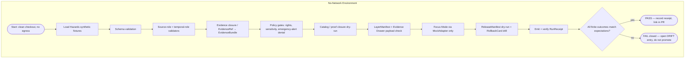

# 🌪️ Hazards — No-Network Test Runbook

> **Run the Hazards domain thin-slice tests against synthetic fixtures with no live source fetches, no network egress, and no public publication path active.** This runbook operationalizes PR-00 (`no-network fixture`) for the Hazards lane: schema validation, source-role anti-collapse, temporal-role validation, emergency-alert denial, operational expiry/freshness, catalog closure, Evidence Drawer disclaimer, and UI no-direct-source — all offline, all evidence-bounded, all reversible.

<!-- [KFM_META_BLOCK_V2]
doc_id: kfm://doc/runbook-hazards-no-network-test
title: Hazards — No-Network Test Runbook
type: standard
version: v1
status: draft
owners: TODO (Hazards lane steward + Docs steward + Validation steward)
created: 2026-05-12
updated: 2026-05-12
policy_label: public
related:
  - docs/doctrine/directory-rules.md
  - docs/doctrine/lifecycle-law.md
  - docs/doctrine/truth-posture.md
  - docs/doctrine/trust-membrane.md
  - docs/domains/hazards/README.md
  - docs/runbooks/README.md
  - docs/runbooks/governed_ai_VALIDATION.md
  - docs/adr/ADR-0001-schema-home.md
tags: [kfm, hazards, runbook, no-network, validation, fixtures, governance]
notes:
  - Repository not mounted in this session; all repo-shaped claims are PROPOSED until verified.
  - This runbook governs the Hazards lane only; cross-domain runs use the runbook root.
[/KFM_META_BLOCK_V2] -->

[](#)
[](#)
[](#)
[](#)
[](#)
[](#)
[](#)

| Field | Value |
|---|---|
| **Status** | `draft` |
| **Authority of the runbook structure** | PROPOSED — derived from KFM doctrine; not yet executed against a mounted repo |
| **Authority of doctrine cited** | CONFIRMED (Directory Rules, lifecycle law, Hazards lane non-emergency posture) |
| **Owners** | TODO — Hazards lane steward · Validation steward · Docs steward |
| **Last updated** | 2026-05-12 |
| **Applies to** | Hazards domain only; cross-domain runs use `docs/runbooks/NO_NETWORK_TEST_RUNBOOK.md` (PROPOSED) |
| **Not for** | Live source fetches · public publication · life-safety alerting · production rollouts |

---

## 🔭 Quick jump

- [1. Purpose](#1-purpose)
- [2. Repo fit and placement basis](#2-repo-fit-and-placement-basis)
- [3. When to use this runbook](#3-when-to-use-this-runbook)
- [4. Scope and non-goals](#4-scope-and-non-goals)
- [5. Preconditions](#5-preconditions)
- [6. Flow at a glance](#6-flow-at-a-glance)
- [7. The runbook](#7-the-runbook)
- [8. Expected finite outcomes](#8-expected-finite-outcomes)
- [9. Hazards source-role posture under no-network](#9-hazards-source-role-posture-under-no-network)
- [10. Failure handling](#10-failure-handling)
- [11. Rollback path](#11-rollback-path)
- [12. Receipts and proof artifacts emitted](#12-receipts-and-proof-artifacts-emitted)
- [13. Anti-patterns this runbook protects against](#13-anti-patterns-this-runbook-protects-against)
- [14. Related docs](#14-related-docs)
- [15. Verification backlog](#15-verification-backlog)
- [16. Appendix — fixture skeletons](#16-appendix--fixture-skeletons)

---

## 1. Purpose

> **CONFIRMED doctrine / PROPOSED procedure.** The Hazards lane must be able to demonstrate its trust spine — source admission, evidence resolution, policy decision, validation, release state, UI trust payload, correction path, and rollback target — for at least one public-safe proof slice **without contacting any live source and without writing to any public surface.**

This runbook is the operational form of that requirement. It executes the Hazards thin slice — *historical flood / severe-weather event fixture plus NFHL flood context plus exposure summary, with warning feeds disabled or contextual-only* — against synthetic fixtures. It treats the **absence of network** as a first-class invariant of the run, not a deployment accident.

The runbook serves three readers: a developer working a Hazards PR locally; a steward rehearsing release/correction/rollback before broad activation; and a CI workflow whose job is to fail closed on any regression in the Hazards trust posture.

> [!IMPORTANT]
> **KFM Hazards is not an emergency alert system and must not provide life-safety instructions.** This runbook explicitly tests the denial path that enforces that boundary. If you are operating Hazards material as if it were an alerting product, stop and read [`docs/domains/hazards/README.md`](../../domains/hazards/README.md) (PROPOSED) first.

---

## 2. Repo fit and placement basis

| Aspect | Decision |
|---|---|
| **Responsibility root** | `docs/` (human-facing control plane) |
| **Sub-area** | `docs/runbooks/` (operational procedures) |
| **Domain segment** | `hazards/` — per Domain Placement Law |
| **Full path** | `docs/runbooks/hazards/NO_NETWORK_TEST_RUNBOOK.md` |
| **Directory Rules basis** | §4 Step 1 (responsibility = explains humans → `docs/`); §4 Step 3 (domain appears as a segment, never as a root); §6.1 (`docs/runbooks/` named as a canonical sub-area); §12 (Domain Placement Law) |
| **Authority of this path** | PROPOSED until verified against mounted-repo evidence |

> [!NOTE]
> Prior PROPOSED runbook examples in the corpus use a flat naming pattern (e.g. `docs/runbooks/ui_LOCAL_DEV.md`). This runbook adopts the **domain-segment** form (`docs/runbooks/hazards/...`) on the basis that Hazards is one of many domains that will need parallel runbooks; segmenting prevents the `runbooks/` directory from becoming a flat dumping ground as lanes multiply. If a mounted-repo ADR settles a different convention, migrate via §14 of Directory Rules and preserve this file as lineage.

**Inputs accepted here:** lane-specific Hazards operational procedures that run against fixtures only.
**Inputs that do NOT belong here:**
- Cross-domain runbooks → `docs/runbooks/` root (no domain segment).
- ADRs about Hazards schema or policy → `docs/adr/`.
- Hazards doctrine, source-family analysis, ubiquitous language → `docs/domains/hazards/`.
- Fixture files themselves → `fixtures/domains/hazards/` (PROPOSED).
- Validator implementations → `tools/validators/` (PROPOSED).
- Test specs → `tests/domains/hazards/` (PROPOSED).

---

## 3. When to use this runbook

Use this runbook when:

- You are opening or reviewing a Hazards PR that touches schemas, policy, fixtures, or the governed API surface, and need a deterministic pre-merge gate.
- You are rehearsing the Hazards thin slice before any live source activation (PR-00 acceptance: *fixture validation passes; no network access*).
- You are practicing a **rollback drill** against a dry-run Hazards release and need a deterministic baseline to roll back to.
- A live source endpoint, credential, or rights determination is unresolved and you need to keep building.
- CI is running on a runner that **must not** have egress (air-gapped or restricted-network environments).

Do **not** use this runbook when:

- You are trying to validate a live source endpoint's current behavior — that is the job of a separate connector acceptance runbook (PROPOSED; not yet authored).
- You are trying to publish a Hazards layer to a public surface. This runbook intentionally lacks any publish path.
- You need to test emergency-alert content. KFM does not author or test such content; redirect to official sources.

---

## 4. Scope and non-goals

**In scope.**
The Hazards lane object families: `HazardEvent`, `HazardObservation`, `WarningContext`, `AdvisoryContext`, `DisasterDeclaration`, `FloodContext`, `WildfireDetection`, `SmokeContext`, `DroughtIndicator`, `EarthquakeEvent`, `HeatColdEvent`, `ExposureSummary`, `ResilienceSummary`, `HazardTimeline`, `ImpactArea`. Their `SourceDescriptor`, `EvidenceRef` → `EvidenceBundle` resolution, `LayerManifest`, `ReleaseManifest`, `CorrectionNotice`, `RollbackCard`, and `RunReceipt` artifacts as exercised by synthetic fixtures.

**Out of scope.**
- Live NOAA Storm Events, NWS API, FEMA OpenFEMA / NFHL, USGS Earthquake Catalog, NASA FIRMS, NOAA HMS, USGS Water, drought monitor, or state emergency-management endpoints.
- Real exact sensitive geometry of any kind.
- Public publication, public tile activation, or any write outside `tests/`, `fixtures/`, `data/work/hazards/`, or local receipt locations.
- Any AI/Focus Mode interaction with a non-mock adapter.

---

## 5. Preconditions

> [!WARNING]
> All commands and paths below are **PROPOSED**. The KFM repository was not mounted in this session, so script names, runner choice, and exact CLI flags have not been verified. Treat the commands as a template; align them with mounted-repo conventions during the first execution, and update this runbook with an ADR-tracked change.

| Precondition | What it means | Verification (PROPOSED) |
|---|---|---|
| Repo cloned at a known SHA | Reproducibility anchor for receipts | `git rev-parse HEAD` recorded into the run receipt |
| Network egress disabled or absent | No live source can leak in | Loopback-only environment or runner with no egress |
| Hazards fixture set present | Synthetic SourceDescriptor / EvidenceBundle / LayerManifest / ReleaseManifest + one HazardEvent | `fixtures/domains/hazards/` populated |
| Validators present | Schema, source-role, temporal, evidence-closure, policy, citation, release-manifest validators | `tools/validators/` (PROPOSED home) |
| Policy engine available offline | Conftest/OPA bundle and obligations resolvable from disk | `policy/domains/hazards/` (PROPOSED) |
| MockAdapter only | No live model provider | `runtime/ai/` adapter pinned to MockAdapter |
| RunReceipt sink writable | Local receipt directory writable; signing in offline / pinned-key mode if used | `data/receipts/hazards/` (PROPOSED) |

> [!TIP]
> If keyless cosign would normally sign receipts and Sigstore is unreachable, use the documented pinned-key fallback for the offline run. Record the signing mode in the run receipt so a verifier can tell offline-signed receipts apart from keyless ones.

---

## 6. Flow at a glance



> [!NOTE]
> The diagram reflects the doctrinal flow. **NEEDS VERIFICATION** against actual validator wiring once the repo is mounted; the order of steps C–J may be reordered by validator dependencies surfaced in `tools/validators/` and `tests/domains/hazards/`.

[⬆ Back to top](#-hazards--no-network-test-runbook)

---

## 7. The runbook

Steps are written in execution order. Each step lists a goal, a representative command template, and a fail-closed expectation. Commands are templates — adapt to the mounted repo's actual runner and script names.

### 7.1 Disable egress and confirm the environment

**Goal.** Make network failure the default. A test that passes by accidentally reaching the internet is not a no-network test.

```bash
# PROPOSED — verify against repo's actual offline-runner setup
unset HTTP_PROXY HTTPS_PROXY ALL_PROXY
export NO_PROXY="*"
# Optional: deny egress at the OS / container level (mounted-repo specific)
```

> [!CAUTION]
> If a step in this runbook ever appears to need network — to fetch a schema, validate a citation, resolve a source endpoint, sign a receipt against a transparency log — **stop**. That step has drifted out of no-network scope and must be either re-pointed at a local mirror, switched to pinned-key/offline mode, or moved to a different runbook.

### 7.2 Load Hazards synthetic fixtures

**Goal.** Bring up the minimum object set the Hazards lane needs to demonstrate a closed trust spine.

Required synthetic objects (one valid + one invalid + one denied + one abstention + one rollback/correction for each — see §16 for skeletons):

- `SourceDescriptor` for each Hazards source family (authority / observation / context / model role variants).
- `HazardEvent` (historical), `FloodContext` (regulatory), `WildfireDetection` (remote-sensing), `WarningContext` (operational, expired), `DisasterDeclaration` (administrative).
- `EvidenceBundle` for at least one HazardEvent feature.
- `LayerManifest` for the public-safe historical event layer.
- `ReleaseManifest` with a release candidate and `rollback_target` pointing to a prior fixture release.
- `CorrectionNotice` and `RollbackCard` skeletons.
- One `sensitive-geometry deny fixture` (public-safe transformed; **never** real exact location).
- One `stale-source fixture` (expired `WarningContext`).

### 7.3 Schema validation

**Goal.** Every object validates against its schema; every invalid fixture fails as expected.

```bash
# PROPOSED — substitute with mounted-repo validator entry point
kfm-validate schemas \
  --root schemas/contracts/v1/domains/hazards \
  --fixtures fixtures/domains/hazards \
  --strict --no-network
```

Expected: all valid fixtures pass; every invalid fixture fails with a deterministic reason code. **NEEDS VERIFICATION** of exact tool name, flags, and exit semantics.

### 7.4 Source-role and temporal-role validators

**Goal.** Prove that a source authorized as `observation` cannot be silently used as `authority`, and that `event time`, `valid time`, `issue/expiry time`, `source time`, `retrieval time`, `release time`, and `correction time` stay distinct where material.

Key denial cases:

- Operational warning used as historical event of record → **DENY**.
- Model output presented as observation → **DENY**.
- Regulatory NFHL flood context represented as observed inundation → **DENY**.

### 7.5 Evidence closure

**Goal.** Every claim in a Hazards `EvidenceDrawerPayload` resolves to an `EvidenceBundle` via its `EvidenceRef`. Claims that cannot resolve cause **ABSTAIN**, not silent omission.

### 7.6 Policy gates

**Goal.** Run the Hazards policy bundle (rights, sensitivity, emergency-alert denial, redaction, freshness, release-state) against fixtures.

Required denials (all **DENY**):

- Unreviewed exact sensitive Hazards locations → public path.
- Unknown rights or unresolved source role → public promotion.
- Operational warning whose `expiry` is past → presented as current.
- Any attempt to phrase Hazards output as life-safety instruction.

### 7.7 Catalog / proof closure dry-run

**Goal.** A release candidate's `CatalogMatrix`, `DatasetVersion`, `ValidationReport`, and `EvidenceBundle` set must form a closed proof — no orphan artifacts, no broken refs.

### 7.8 LayerManifest and Evidence Drawer payload check

**Goal.** The proposed public-safe Hazards layer's `LayerManifest` is well-formed and reads only released manifests. The `EvidenceDrawerPayload` for a clicked feature surfaces source role, rights, sensitivity, freshness, release state, and limitations — including the Hazards **not-for-life-safety** disclaimer.

### 7.9 Focus Mode via MockAdapter only

**Goal.** A Focus Mode question routed to the governed API returns a finite `RuntimeResponseEnvelope` (`ANSWER` / `ABSTAIN` / `DENY` / `ERROR`) with an `AIReceipt` and a `CitationValidationReport`. No live model provider is reachable; the adapter is pinned to MockAdapter.

Required behaviors:

- Question backed by a resolvable `EvidenceBundle` → **ANSWER** with valid citations.
- Question whose evidence is missing → **ABSTAIN**.
- Question that asks for life-safety guidance or sensitive exact geometry → **DENY**.
- Adapter failure → **ERROR** (never a fabricated answer).

### 7.10 ReleaseManifest dry-run and rollback drill

**Goal.** Produce a `ReleaseManifest` *candidate* — never a published release — with a `rollback_target`, `correction_notice` path, and `RollbackCard`. Execute the rollback drill against the dry-run release and verify the receipt.

```bash
# PROPOSED
kfm-release dry-run \
  --domain hazards \
  --candidate <id> \
  --no-public-write
kfm-rollback drill \
  --release <id> \
  --target <prior-release-id>
```

### 7.11 Emit and verify the RunReceipt

**Goal.** A signed `RunReceipt` records inputs (fixture set, git SHA), outputs (validator outcomes, decision envelopes), `spec_hash`, tool versions, actor, timestamps, signing mode, and `source_head` markers (which, in no-network mode, are the fixture digests rather than upstream `ETag`/`Last-Modified`). The receipt is the proof that this run happened, on this code, with these fixtures, and produced these decisions.

[⬆ Back to top](#-hazards--no-network-test-runbook)

---

## 8. Expected finite outcomes

Every Hazards governed surface returns one of four outcomes. The no-network run pins fixtures to make these outcomes deterministic.

| Surface | Outcome under valid fixture | Outcome under invalid / restricted fixture |
|---|---|---|
| Hazards feature/detail resolver | `ANSWER` | `ABSTAIN` (evidence) · `DENY` (rights / sensitivity / emergency) · `ERROR` (malformed) |
| Hazards layer manifest resolver | `ANSWER` | `DENY` (unreleased / sensitive) · `ERROR` |
| Hazards Evidence Drawer payload | `ANSWER` | `ABSTAIN` · `DENY` · `ERROR` |
| Hazards Focus Mode answer (MockAdapter) | `ANSWER` | `ABSTAIN` · `DENY` · `ERROR` |
| ReleaseManifest dry-run | promotion candidate produced | candidate rejected with reasons |
| Rollback drill | `RollbackCard` receipt | drill failure recorded; no public effect |

> [!IMPORTANT]
> A passing run produces **zero** uncited public claims, **zero** life-safety phrasings, and **zero** writes to `data/published/`. If any of those three counters is nonzero, the run has not passed regardless of validator green-checks.

---

## 9. Hazards source-role posture under no-network

| Source family (PROPOSED) | Permitted roles | Forbidden uses in this run |
|---|---|---|
| NOAA Storm Events / NCEI-style records | authority / observation / context (historical) | Used as live warning surface |
| NWS alerts / warnings / advisories / watches | context (operational, dated) | Used as life-safety alert · used past expiry · used as observed event |
| FEMA Disaster Declarations / OpenFEMA | authority (administrative) | Used to imply current emergency |
| FEMA NFHL / MSC flood hazard | context (regulatory) | Used as observed inundation |
| USGS Earthquake Catalog | authority / observation | Used as forecast or warning |
| NOAA HMS Fire and Smoke | observation / context | Used as life-safety instruction |
| NASA FIRMS active fire | observation (detection) | Used as confirmed ground truth without corroboration |
| Kansas / local emergency context | context | Used as primary truth source |

> [!CAUTION]
> Rights and current terms for every source listed above are **NEEDS VERIFICATION**. No-network mode does not absolve the rights determination — it defers the *fetch*, not the *posture*. Sensitive joins remain fail-closed.

---

## 10. Failure handling

When a step fails, prefer **honest incompleteness** over a green build. The procedure below is reversible and audit-friendly.

1. **Capture.** Save the failing output, the run receipt (if emitted), and the affected fixture IDs.
2. **Classify.** Is the failure (a) a validator finding a real defect, (b) a fixture authoring error, (c) a validator bug, (d) drift between schemas and contracts, or (e) drift between Directory Rules and repo structure?
3. **Open a drift or backlog entry.**
   - Real defect → fix in the PR; re-run.
   - Fixture error → fix the fixture; do **not** weaken the validator.
   - Validator bug → open an issue; pin the validator if needed; do not silence it.
   - Schema/contract drift → resolve via ADR; mark affected paths `PROPOSED / CONFLICTED`.
   - Directory-Rules drift → add entry in `docs/registers/DRIFT_REGISTER.md` per Directory Rules §2.5.
4. **Do not promote.** The release candidate stays in `release/candidates/hazards/` until the next clean run.

> [!WARNING]
> Never adjust a Hazards fixture to make a denial test pass. The denial tests *are the product*: they prove the lane cannot be turned into an emergency alert system, cannot publish sensitive geometry, and cannot present stale warnings as current.

---

## 11. Rollback path

For this runbook itself:

- This file is doctrine; reverting the PR that added it restores the prior state. No data is moved by adopting or reverting the runbook.

For a Hazards run executed against this runbook:

| Symptom | Rollback action |
|---|---|
| Dry-run ReleaseManifest accidentally referenced a real (non-fixture) source | Revert the candidate; open a drift entry; verify `no-public-write` invariant restored |
| Rollback drill failed to restore the prior `ReleaseManifest` | Restore the prior `release_id` manually and record the discrepancy in the run receipt |
| RunReceipt signing failed | Re-run with pinned-key fallback; do not promote unsigned receipts |
| MockAdapter silently fell through to a live provider | Disable adapter; treat as a `WARNING`-class governance incident; review `runtime/ai/` config |

---

## 12. Receipts and proof artifacts emitted

| Artifact | Schema (PROPOSED home) | What it proves |
|---|---|---|
| `RunReceipt` | `schemas/contracts/v1/proofs/run_receipt.schema.json` | What ran, on what code, against which fixtures, with which tool versions |
| `ValidationReport` | `schemas/contracts/v1/proofs/validation_report.schema.json` | Schema, source-role, temporal, evidence, and policy outcomes |
| `CitationValidationReport` | `schemas/contracts/v1/evidence/citation_validation_report.schema.json` | Every cited `EvidenceRef` resolved within scope |
| `PolicyDecision` | `schemas/contracts/v1/policy/policy_decision.schema.json` | Allow/deny with finite outcome and obligations |
| `PromotionDecision` | `schemas/contracts/v1/release/promotion_decision.schema.json` | Gate outcomes, reviewer, rollback target |
| `AIReceipt` | `schemas/contracts/v1/ai/ai_receipt.schema.json` | MockAdapter execution audit trail |
| `ReleaseManifest` (candidate) | `schemas/contracts/v1/release/release_manifest.schema.json` | Dry-run release with rollback target |
| `RollbackCard` | `schemas/contracts/v1/release/rollback_card.schema.json` | Rollback drill receipt |
| `CorrectionNotice` (skeleton) | `schemas/contracts/v1/release/correction_notice.schema.json` | Correction path is live, not theoretical |

All schema paths above are **PROPOSED** per Directory Rules §7.4 / ADR-0001; mounted-repo conventions may differ.

---

## 13. Anti-patterns this runbook protects against

| Anti-pattern | What it would look like | What this runbook does about it |
|---|---|---|
| Generation-as-truth | A MockAdapter "answer" presented without an `EvidenceBundle` | `CitationValidationReport` forces **ABSTAIN** |
| Operational warning as historical event | An expired `WarningContext` written into `HazardEvent` | Source-role + temporal-role validators **DENY** |
| Sensitive-geometry leak | Exact location reaching a fixture or a candidate `LayerManifest` | Sensitive-geometry deny fixture **DENY** |
| Direct browser-to-canonical fetch | UI reading `data/processed/` or RAW sources | UI no-direct-source test fails the run |
| Life-safety phrasing | Output drifts toward "evacuate" / "shelter" instructions | Emergency-alert denial test **DENY** |
| Silent promotion | Release written without proof closure | Catalog closure + ReleaseManifest dry-run **REJECT** |
| Irreversible release | No `rollback_target` recorded | Rollback drill **FAIL** before promotion |
| Network "convenience" call | A validator quietly fetches a schema or asset | No-network environment makes the call **ERROR** |

---

## 14. Related docs

- [`docs/doctrine/directory-rules.md`](../../doctrine/directory-rules.md) — placement authority; §4 Step 3 and §12 cited above.
- [`docs/doctrine/lifecycle-law.md`](../../doctrine/lifecycle-law.md) — RAW → WORK / QUARANTINE → PROCESSED → CATALOG / TRIPLET → PUBLISHED.
- [`docs/doctrine/truth-posture.md`](../../doctrine/truth-posture.md) — cite-or-abstain.
- [`docs/doctrine/trust-membrane.md`](../../doctrine/trust-membrane.md) — governed-API boundary.
- [`docs/domains/hazards/README.md`](../../domains/hazards/README.md) — Hazards lane identity, scope, non-ownership, ubiquitous language. **PROPOSED**.
- [`docs/runbooks/README.md`](../README.md) — runbooks root README. **PROPOSED**.
- [`docs/runbooks/governed_ai_VALIDATION.md`](../governed_ai_VALIDATION.md) — Focus Mode validation runbook. **PROPOSED**.
- [`docs/runbooks/ui_VALIDATION.md`](../ui_VALIDATION.md) — UI validation runbook (cross-lane). **PROPOSED**.
- [`docs/adr/ADR-0001-schema-home.md`](../../adr/ADR-0001-schema-home.md) — schema home decision underpinning the schema paths quoted here.

> [!NOTE]
> Every related path is **PROPOSED** until verified against mounted-repo evidence. If a target file is named differently in the actual repo, fix the link rather than the convention, and record the rename via a Directory Rules §14 migration note.

---

## 15. Verification backlog

| Item | What would settle it | Status |
|---|---|---|
| Exact validator entry-point names and flags | Mounted-repo `tools/validators/` and CI workflow files | NEEDS VERIFICATION |
| Hazards fixture directory and file names | Mounted-repo `fixtures/domains/hazards/` | NEEDS VERIFICATION |
| Policy bundle for Hazards (rights, sensitivity, emergency-alert) | Mounted-repo `policy/domains/hazards/` | NEEDS VERIFICATION |
| Schema homes for Hazards object families | Mounted-repo `schemas/contracts/v1/domains/hazards/` | NEEDS VERIFICATION |
| Receipt signing mode (keyless vs. pinned-key fallback) | Mounted-repo signing config + offline policy | NEEDS VERIFICATION |
| Runbook flat-naming vs. domain-segment convention | Accepted ADR or §14 migration note | PROPOSED |
| Cross-domain `NO_NETWORK_TEST_RUNBOOK.md` parent | `docs/runbooks/NO_NETWORK_TEST_RUNBOOK.md` | PROPOSED |
| Live source rights / endpoints for every Hazards source | Source descriptor entries with rights + cadence + steward | NEEDS VERIFICATION |
| Emergency-alert boundary enforcement coverage | Negative tests + policy denials passing on red lane | NEEDS VERIFICATION |
| Release / correction / rollback drill record for Hazards | Drilled `ReleaseManifest` + `RollbackCard` receipts | NEEDS VERIFICATION |

---

## 16. Appendix — fixture skeletons

> [!NOTE]
> These skeletons are **illustrative**. Field names track the corpus's object-family conventions; exact JSON Schema shape is **NEEDS VERIFICATION** against `schemas/contracts/v1/...`.

<details>
<summary><b>Synthetic <code>SourceDescriptor</code> (Hazards observation role)</b></summary>

```json
{
  "source_id": "fixture:hazards:noaa-storm-events:historical",
  "source_family": "NOAA Storm Events",
  "role": "observation",
  "rights_status": "fixture/synthetic",
  "sensitivity": "public",
  "cadence": "historical",
  "freshness_state": "static",
  "limitations": [
    "synthetic fixture; not a real source admission",
    "not for life-safety use under any circumstance"
  ],
  "spec_hash": "sha256:<computed>",
  "fixture_marker": true
}
```

</details>

<details>
<summary><b>Synthetic <code>HazardEvent</code> (historical flood)</b></summary>

```json
{
  "id": "fixture:hazards:hazard-event:hist-flood-1903",
  "object_role": "historical_event_record",
  "kind": "flood",
  "geometry": { "type": "Polygon", "coordinates": [[/* public-safe generalized */]] },
  "time": {
    "event_time": "1903-05-29",
    "valid_time": { "start": "1903-05-29", "end": "1903-06-06" },
    "source_time": "fixture-authoring",
    "retrieval_time": null,
    "release_time": null,
    "correction_time": null
  },
  "source_refs": ["fixture:hazards:noaa-storm-events:historical"],
  "evidence_refs": ["fixture:hazards:evidence-bundle:hist-flood-1903"],
  "fixture_marker": true
}
```

</details>

<details>
<summary><b>Synthetic <code>WarningContext</code> (expired — should ABSTAIN/DENY as current)</b></summary>

```json
{
  "id": "fixture:hazards:warning-context:expired-2024-04-15",
  "object_role": "operational_warning",
  "issued_at": "2024-04-15T18:00:00Z",
  "expires_at": "2024-04-15T22:00:00Z",
  "freshness_state": "expired",
  "source_refs": ["fixture:hazards:nws:context"],
  "expected_outcome_for_current_state_query": "DENY",
  "fixture_marker": true
}
```

</details>

<details>
<summary><b>Sensitive-geometry deny fixture (must never publish)</b></summary>

```json
{
  "id": "fixture:hazards:sensitive-geometry-deny",
  "geometry": { "type": "Point", "coordinates": [/* public-safe transformed */] },
  "sensitivity_label": "restricted_exact_location",
  "attempted_public_artifact": "data/published/layers/hazards/<would-be-layer>",
  "expected_policy_outcome": "DENY",
  "fixture_marker": true
}
```

</details>

<details>
<summary><b>Skeleton <code>RunReceipt</code> for a no-network run</b></summary>

```json
{
  "run_id": "run:hazards:no-network:<utc-timestamp>",
  "inputs": {
    "git_sha": "<commit>",
    "fixture_set": "fixtures/domains/hazards@<sha>",
    "validator_versions": { "<validator>": "<version>" }
  },
  "outputs": {
    "validation_report_ref": "data/proofs/hazards/<id>.json",
    "policy_decisions": ["..."],
    "release_candidate_ref": "release/candidates/hazards/<id>.json"
  },
  "spec_hash": "sha256:<computed>",
  "actor": "<runner-or-user>",
  "signing_mode": "pinned-key-offline | keyless",
  "network_egress": false,
  "source_head": { "note": "no-network — fixture digests substitute for ETag/Last-Modified" },
  "fixture_marker": true
}
```

</details>

[⬆ Back to top](#-hazards--no-network-test-runbook)

---

> _Related: [`docs/doctrine/directory-rules.md`](../../doctrine/directory-rules.md) · [`docs/domains/hazards/README.md`](../../domains/hazards/README.md) · [`docs/runbooks/README.md`](../README.md)_
> _Last updated: 2026-05-12 · Status: `draft` · Authority: PROPOSED until verified against mounted-repo evidence._
> _[⬆ Back to top](#-hazards--no-network-test-runbook)_
