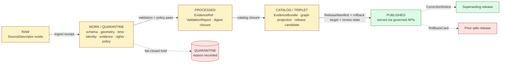
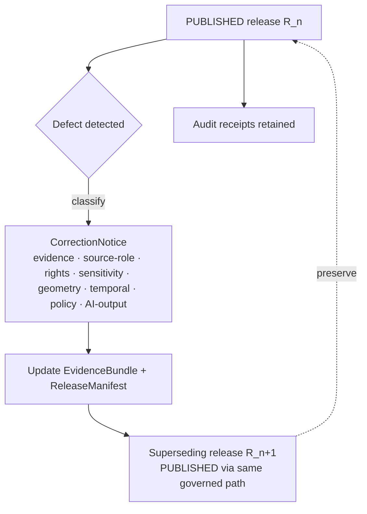

<!-- [KFM_META_BLOCK_V2]
doc_id: kfm://doc/runbook-hazards-promotion
title: Hazards Promotion Runbook
type: standard
version: v1
status: draft
owners: TODO — Hazards domain steward + Release authority
created: 2026-05-12
updated: 2026-05-12
policy_label: public
related:
  - docs/doctrine/directory-rules.md
  - docs/doctrine/lifecycle-law.md
  - docs/doctrine/truth-posture.md
  - docs/doctrine/trust-membrane.md
  - docs/domains/hazards/README.md
  - docs/runbooks/ui_VALIDATION.md
  - docs/runbooks/ui_ROLLBACK.md
  - release/manifests/README.md
tags: [kfm, hazards, runbook, promotion, governance, lifecycle, release]
notes:
  - Procedural counterpart to the Hazards domain README and lifecycle doctrine.
  - All implementation-specific paths, validator names, and CI workflow names are PROPOSED until verified against the mounted repository.
  - Path itself (docs/runbooks/hazards/PROMOTION_RUNBOOK.md) is PROPOSED — see §2 of the companion notes.
[/KFM_META_BLOCK_V2] -->

# Hazards Promotion Runbook

> **Step-by-step, fail-closed procedure for promoting Hazards-domain candidates from `RAW` through `PUBLISHED`. KFM Hazards is not a life-safety alerting system. Promotion is a governed state transition, not a file move.**


<!-- Badge targets are TODO placeholders until CI surface names and ADR coordinates are verified against the mounted repo. -->

| Status | Owners | Reviewers (PROPOSED) | Last updated |
|---|---|---|---|
| `draft` | TODO — Hazards domain steward | Hazards domain steward · Source steward · Sensitivity reviewer · Release authority · Docs steward | 2026-05-12 |

---

## Quick jump

- [1. Purpose](#1-purpose)
- [2. Scope and explicit non-ownership](#2-scope-and-explicit-non-ownership)
- [3. Pipeline at a glance](#3-pipeline-at-a-glance)
- [4. Promotion preconditions](#4-promotion-preconditions)
- [5. Promotion gates (Hazards profile)](#5-promotion-gates-hazards-profile)
- [6. Roles and separation of duties](#6-roles-and-separation-of-duties)
- [7. Step-by-step procedure](#7-step-by-step-procedure)
- [8. Hazards-specific denial conditions](#8-hazards-specific-denial-conditions)
- [9. Validators, tests, and fixtures](#9-validators-tests-and-fixtures)
- [10. Correction and rollback](#10-correction-and-rollback)
- [11. Worked example and negative fixtures](#11-worked-example-and-negative-fixtures)
- [12. FAQ and common decisions](#12-faq-and-common-decisions)
- [13. Related docs](#13-related-docs)
- [14. Verification backlog](#14-verification-backlog)

---

## 1. Purpose

This runbook describes **how a Hazards-domain candidate becomes a publicly released artifact** inside Kansas Frontier Matrix (KFM). It is the operational complement to:

- **`docs/doctrine/lifecycle-law.md`** — the lifecycle invariant (`RAW → WORK / QUARANTINE → PROCESSED → CATALOG / TRIPLET → PUBLISHED`). [CONFIRMED doctrine]
- **`docs/doctrine/trust-membrane.md`** — the rule that public surfaces consume governed APIs, never canonical/internal stores. [CONFIRMED doctrine]
- **`docs/doctrine/truth-posture.md`** — cite-or-abstain. [CONFIRMED doctrine]
- **`docs/domains/hazards/README.md`** — Hazards domain scope, source families, and object families. [PROPOSED path; CONFIRMED content origin]

The runbook is **prescriptive for stewards and reviewers** and **descriptive for everyone else**. It does not invent doctrine; it operationalizes it for one domain.

> [!IMPORTANT]
> **KFM Hazards is not an emergency-alert system.** It governs historical events, regulatory context, modeled derivatives, and operational warning/advisory/watch *context only*. All life-safety routing flows to official sources. Promotion that would let KFM read as a life-safety authority MUST be denied. *[CONFIRMED doctrine — see Domains Culmination Atlas §12.B and Encyclopedia §7.10.A.]*

---

## 2. Scope and explicit non-ownership

### 2.1 In scope (Hazards owns)

CONFIRMED doctrine / PROPOSED field realization. The Hazards domain owns the following object families and promotes them through this runbook:

| Object family | Purpose summary |
|---|---|
| `HazardEvent` | Historical event record (storm, flood, wildfire, etc.). |
| `HazardObservation` | Scientific or remote-sensing observation. |
| `WarningContext` | Operational warning *as context only*, never as life-safety authority. |
| `AdvisoryContext` | Operational advisory as context only. |
| `DisasterDeclaration` | Administrative declaration (FEMA / state). |
| `FloodContext` | Regulatory flood context (NFHL / MSC) — **not** observed inundation. |
| `WildfireDetection` | Remote-sensing detection (e.g., FIRMS) — detection, not ground truth. |
| `SmokeContext` | Smoke product (e.g., NOAA HMS). |
| `DroughtIndicator` | Drought monitor indicator. |
| `EarthquakeEvent` | USGS earthquake catalog record. |
| `HeatColdEvent` | Heat/cold operational or historical event. |
| `ExposureSummary` / `ResilienceSummary` | Derived analytical summaries. |
| `HazardTimeline` / `ImpactArea` | Role-aware timeline and impact-area derivatives. |

*[Object-family list CONFIRMED from Encyclopedia §7.10.C and Domains Culmination Atlas §12.E.]*

### 2.2 Out of scope (Hazards does **not** own)

> [!WARNING]
> A promotion request that crosses these lines MUST be denied at the policy gate, regardless of approval signals elsewhere.

- **Life-safety instructions / emergency-alert authority.** Always redirect to official sources. *[CONFIRMED doctrine.]*
- **Hydrology canonical claims** (HUC, gauges, observed flood evidence) — owned by Hydrology, even when Hazards links to them.
- **Atmosphere/Air canonical claims** (AQI, weather observation, climate normals) — owned by Atmosphere/Air.
- **Settlements / Infrastructure canonical claims** — owned by Settlements/Infrastructure; Hazards may reference exposure but does not own asset identity.
- **Roads / Rail canonical claims** — owned by Roads/Rail; Hazards may reference closure/detour context with role separation.

---

## 3. Pipeline at a glance

The Hazards lane follows the CONFIRMED lifecycle invariant. **Each transition is governed; none is a file copy.**



> [!NOTE]
> *Promotion is a governed state transition, not a file move.* *[CONFIRMED — Directory Rules §0; Lifecycle invariant.]* The diagram is logical; the underlying objects (`SourceDescriptor`, `EvidenceBundle`, `ReleaseManifest`, `RollbackCard`) live in their canonical homes per Directory Rules §6.

---

## 4. Promotion preconditions

A Hazards candidate MUST satisfy **all** of the following before any reviewer is asked to approve PUBLISHED state. Missing any condition is grounds for `HOLD`, `DENY`, or `QUARANTINE`.

| # | Precondition | Artifact / evidence | Status |
|---|---|---|---|
| 1 | Source admission complete | `SourceDescriptor` with role, rights, sensitivity, citation, time, hash | CONFIRMED requirement / PROPOSED schema home |
| 2 | Schema validation green | `ValidationReport` against `schemas/contracts/v1/domains/hazards/…` | PROPOSED schema path |
| 3 | Identity rule applied | Deterministic id: source id + object role + temporal scope + normalized digest | PROPOSED basis |
| 4 | Temporal-role validation green | Source / observed / valid / retrieval / release / correction times remain distinct where material | CONFIRMED doctrine |
| 5 | Source-role anti-collapse green | No upcast of observation→authority, model→observation, etc. | PROPOSED test |
| 6 | Rights resolved | SPDX / terms recorded; ambiguous → `QUARANTINE` | CONFIRMED doctrine |
| 7 | Sensitivity resolved | Tier assigned; sensitive joins fail closed | CONFIRMED doctrine |
| 8 | Evidence closure | `EvidenceRef` resolves to `EvidenceBundle`; bundle digest closed | CONFIRMED doctrine |
| 9 | Catalog closure | `DatasetVersion` + `ValidationReport` present and consistent | CONFIRMED doctrine |
| 10 | `spec_hash` parity | Recorded `spec_hash` equals fresh JCS+SHA-256 recomputation | CONFIRMED pattern *(corpus: New Ideas 5-8-26, C5-04)* |
| 11 | Release review state | `ReviewRecord` with required reviewer signatures | CONFIRMED doctrine / PROPOSED implementation |
| 12 | `ReleaseManifest` valid | Manifest present, schema-valid, points to closed bundle | CONFIRMED doctrine |
| 13 | Rollback target present | `RollbackCard` references a prior safe release | CONFIRMED doctrine |
| 14 | Correction path declared | Public correction route defined for this release | CONFIRMED doctrine |
| 15 | Emergency-alert boundary check | Candidate is **not** framed or routed as a life-safety authority | CONFIRMED doctrine |

> [!CAUTION]
> If **any** of conditions 1–8 are unresolved, the only valid outcomes are `QUARANTINE` (gather evidence), `DENY` (policy violation), or `ABSTAIN` (insufficient evidence). Do not "soft-promote" into `CATALOG / TRIPLET` to make the queue look healthier.

---

## 5. Promotion gates (Hazards profile)

KFM uses a default-deny promotion-gate pattern. The structural gate is CONFIRMED in attached doctrine; the gate **labels** and **CI job names** below are PROPOSED until verified against the mounted repository.

| Gate | What it checks | Hazards specifics | Status |
|---|---|---|---|
| **A — Identity & integrity** | `spec_hash` parity; source HEAD probe (`ETag`, `Last-Modified`) | Stamp source role (`authority` / `observation` / `context` / `model`) on the receipt | CONFIRMED doctrine / PROPOSED gate name |
| **B — Rights & provenance** | SPDX allowlist; `SourceDescriptor` rights confirmed | NOAA / NWS / FEMA / USGS / NASA / Kansas-local terms recorded | CONFIRMED doctrine / PROPOSED allowlist |
| **C — Sensitivity & policy** | Sensitivity tier; redaction obligations satisfied | Sensitive joins fail closed (e.g., infrastructure exposure joined to private parcels) | CONFIRMED doctrine |
| **D — Evidence closure** | `EvidenceRef` → `EvidenceBundle`; bundle digest closed | One Hazard object → one resolvable bundle | CONFIRMED doctrine |
| **E — Temporal & source-role anti-collapse** | Times remain distinct; no role upcast | **Stale operational warning MUST NOT appear as current warning state.** | CONFIRMED doctrine |
| **F — Review state** | `ReviewRecord` present and sufficient | Sensitivity reviewer required for any sensitive-join derivative | CONFIRMED doctrine |
| **G — Release infrastructure** | `ReleaseManifest` valid; rollback target present; correction path declared | Cite-or-abstain UI behavior verified for the candidate layer | CONFIRMED doctrine |

The structural rule, lifted from the attached policy starter, is:

```rego
# PROPOSED — minimal promotion check, illustrative.
# Real policy bundle is pinned by OCI digest in CI; this is a documentation excerpt.
package gates.promotion

import data.common

default allow = false
default reasons = []

allow {
    input.action == "promote"
    input.resource.policy_label != ""
    input.resource.spec_hash != ""
    input.resource.release_review == "approved"
    count(blockers) == 0
}

blockers := [o |
    o := obligations[_]
    o.type == "hold" or o.type == "deny"
]
```

> [!NOTE]
> The snippet above is illustrative and follows the corpus pattern (`New_Ideas_5-8-26.pdf` — Conftest/OPA starter). The actual bundle, fixture paths, and CI workflow names are PROPOSED until verified against the mounted repository.

---

## 6. Roles and separation of duties

KFM separates policy-significant release duties when materiality justifies it. *[CONFIRMED doctrine — Operating-Law Invariant 9.]*

| Role | Owns | Hazards-specific responsibility |
|---|---|---|
| **Source steward** | `SourceDescriptor` lifecycle; admission gate | Confirms NOAA / NWS / FEMA / USGS / FIRMS terms; tags source role |
| **Hazards domain steward** | Object-family meaning; validators | Approves contract changes; reviews domain-internal promotions |
| **Sensitivity reviewer** | Redaction / generalization / withholding | Reviews any exposure summary that joins to sensitive infrastructure or private data |
| **Release authority** | Issues `ReleaseManifest`; authorizes `PUBLISHED` | Distinct from candidate author when the candidate is policy-significant |
| **Correction reviewer** | `CorrectionNotice` / `RollbackCard` | Approves post-publication corrections and rollback decisions |
| **AI surface steward** | Focus Mode templates; AIReceipt audits | Confirms cite-or-abstain on any Hazards-summarizing AI surface |
| **Docs steward** | This runbook; ADR index; drift register | Records placement/path decisions and runbook drift |

> [!IMPORTANT]
> **Author ≠ approver** for any release that touches life-safety-adjacent surfaces, sensitive joins, or first-time source admissions. *[CONFIRMED doctrine.]* The default for routine, low-significance promotions is that the author may also approve; the cases requiring separation are listed in Atlas §24.7.2.

---

## 7. Step-by-step procedure

Each step records its outcome in the standard finite-outcome envelope: `ANSWER` / `ABSTAIN` / `DENY` / `ERROR`. *[CONFIRMED doctrine — Decision Envelope.]*

### Step 1 — Confirm candidate is in `CATALOG / TRIPLET`

The candidate MUST already have passed Stages 1–3 (admission, work/quarantine, processed). If it has not, this runbook is the wrong tool — return to the upstream ingest runbook.

```text
Candidate state:        CATALOG / TRIPLET    (PROPOSED stage label)
Required artifacts:     EvidenceBundle, ValidationReport, DatasetVersion,
                        SourceDescriptor, draft ReleaseManifest, draft RollbackCard
```

### Step 2 — Run the preflight checklist (§4)

All fifteen preconditions must resolve to `present` or `green`. Any `missing`, `quarantine`, or `error` blocks further steps. Record the outcome in the `RunReceipt`.

### Step 3 — Confirm source-role and temporal posture

- The Hazards candidate's source role (`authority` / `observation` / `context` / `model`) is preserved from RAW through PUBLISHED.
- Operational warning / advisory / watch context **carries an explicit expiry** and may not be promoted as current after expiry.
- Historical event records carry observed/valid time distinct from release time.

### Step 4 — Run the Hazards-specific validators

See [§9](#9-validators-tests-and-fixtures). All listed validators MUST be green or the gate fails closed.

### Step 5 — Confirm emergency-alert boundary

This step is non-skippable for any candidate that touches `WarningContext`, `AdvisoryContext`, or `DisasterDeclaration`.

> [!WARNING]
> **The candidate, its layer manifest, its popup copy, its Evidence Drawer disclaimer, and any AI Focus Mode template that reads it MUST NOT present KFM as an authoritative source for life-safety action.** Official-source redirection MUST be visible at every surface. *[CONFIRMED doctrine — Encyclopedia §7.10.A; Atlas §12.B and §20.5.]*

### Step 6 — Policy gate evaluation

Run the promotion bundle (Conftest / OPA) against the candidate's promotion-input JSON. The bundle MUST be pinned by OCI digest or git SHA matching the production PDP. *[CONFIRMED pattern — C5-03 "Policy Parity: CI Equals Runtime."]*

```text
Outcomes:
  allow      → proceed to Step 7
  hold       → return to candidate author with reasons; do not approve
  deny       → record DENY, close candidate, file CorrectionNotice if it was previously released
  quarantine → move artifact set to QUARANTINE with reason recorded
```

### Step 7 — Review state and authorization

- `ReviewRecord` is attached.
- Release authority confirms separation of duties applies and is satisfied.
- For Hazards candidates touching sensitive joins, sensitivity reviewer signature is required.

### Step 8 — Emit `ReleaseManifest` and confirm rollback target

- `ReleaseManifest` is schema-valid and references a closed `EvidenceBundle`.
- `RollbackCard` references a prior safe release (or, for first releases, an explicit "no prior — withdrawal path is unpublish" note).
- Correction path is declared.

### Step 9 — Transition to `PUBLISHED`

- The release authority issues the `PUBLISHED` transition.
- Public surfaces (map shell, Evidence Drawer, governed API, Focus Mode) read **only** the released `LayerManifest` and `EvidenceBundle` projection.
- A run receipt is emitted and attested (e.g., cosign / Rekor) per the attestation pattern. *[CONFIRMED pattern — Master MapLibre ML-057-035..038; PROPOSED implementation.]*

### Step 10 — Post-publication smoke tests

- Released layer click opens the Evidence Drawer.
- Evidence Drawer carries the **not-for-life-safety** disclaimer where applicable.
- AI Focus Mode answers over the released bundle pass citation validation.
- No public surface resolves to `RAW`, `WORK`, or `QUARANTINE`.

---

## 8. Hazards-specific denial conditions

These conditions extend the standard deny matrix and apply specifically to Hazards.

| Condition | Required outcome | Source |
|---|---|---|
| Candidate framed as life-safety authority | **DENY** | Atlas §20.5 deny-by-default register; Encyclopedia §7.10.A |
| Stale operational warning re-released as current | **DENY** | Atlas §12.K (operational expiry/freshness); §12.I |
| Source role unknown or ambiguous | **QUARANTINE** | Atlas §12.K (source-role anti-collapse) |
| NFHL regulatory context relabeled as "observed flood" | **DENY** | Hydrology §4.I and cross-lane constraint with Hazards |
| Wildfire detection (FIRMS) presented as ground-verified perimeter | **DENY** or **ABSTAIN** | Encyclopedia §7.10.B–C (remote_sensing_detection role) |
| Exposure summary joining to sensitive infrastructure precision without review | **DENY** until reviewed | Atlas §20.5 (Infrastructure sensitivity) |
| `EvidenceRef` cannot resolve to `EvidenceBundle` | **ABSTAIN** | Truth-posture doctrine; Atlas §12.L |
| Rights unclear, sensitivity unresolved, or release state absent | **DENY** (block public promotion) | Atlas §12.I; Directory Rules trust-membrane |
| Operational warning lacks valid / issue / expiry triple | **DENY** | Encyclopedia §7.10.D (spatial-temporal model) |

> [!CAUTION]
> A surface that **reads correctly** but **routes incorrectly** is still a violation. The denial conditions apply to every published surface — layer, popup, Evidence Drawer payload, Focus Mode answer, export, story node, dashboard tile — not just the catalog record.

---

## 9. Validators, tests, and fixtures

The validator set below is PROPOSED at the implementation level; the **requirement** that each exists before a Hazards candidate may be promoted is CONFIRMED doctrine. *[Domains Culmination Atlas §12.K.]*

| Validator / test | What it proves | Status |
|---|---|---|
| Source-role anti-collapse | No upcast of `observation`/`context`/`model` → `authority` | PROPOSED |
| Temporal-role validator | Source / observed / valid / retrieval / release / correction times distinct where material | PROPOSED |
| Emergency-alert denial | Any candidate framed as life-safety routes to `DENY` | PROPOSED |
| Operational expiry / freshness | Expired operational context cannot appear as current | PROPOSED |
| Catalog closure | `DatasetVersion` + `ValidationReport` + `EvidenceBundle` consistent | PROPOSED |
| Evidence Drawer disclaimer | Hazards-specific disclaimer visible where required | PROPOSED |
| UI no-direct-source | No public surface bypasses governed APIs to read `RAW` / `WORK` / `QUARANTINE` | PROPOSED |
| `spec_hash` parity | Stored `spec_hash` matches fresh JCS+SHA-256 recomputation | CONFIRMED pattern |
| Negative fixtures | Each gate has a failing fixture proving it actually fails closed | CONFIRMED practice |

### Proposed fixture layout

```text
fixtures/domains/hazards/
├── good_hazard_event.json            # PROPOSED — passes all gates
├── stale_warning.json                # PROPOSED — fails E (operational expiry)
├── role_upcast_observation.json      # PROPOSED — fails E (anti-collapse)
├── nfhl_relabeled_observed.json      # PROPOSED — fails C (policy)
├── missing_evidence_ref.json         # PROPOSED — fails D (evidence closure)
├── life_safety_phrasing.json         # PROPOSED — fails C (emergency-alert boundary)
└── README.md
```

> [!NOTE]
> Paths are PROPOSED per Directory Rules §4 (domain segments live under responsibility roots). Verify against mounted-repo evidence before treating them as canonical. *[Directory Rules basis: `fixtures/domains/<domain>/`.]*

---

## 10. Correction and rollback

### 10.1 Correction flow (PROPOSED operational shape)

Per CONFIRMED doctrine, a correction **preserves the original release record**, classifies the defect, emits a `CorrectionNotice`, updates the relevant `EvidenceBundle` and `ReleaseManifest`, and publishes a **superseding release** rather than silently mutating the old one. *[Unified Build Manual §3.x; Atlas §12.M; Encyclopedia §7.10.]*



### 10.2 Rollback flow

A rollback identifies the affected release, locates the prior safe artifact set, verifies digests and manifests, disables or withdraws affected public surfaces, preserves audit receipts, marks stale or withdrawn UI state, and restores or republishes the rollback target through the same governed release path. *[CONFIRMED doctrine — Build Manual §3.x; Atlas §12.M.]*

| Defect class (Hazards) | Correction posture | Rollback posture |
|---|---|---|
| Stale operational warning published as current | Withdraw; publish `CorrectionNotice` | Restore prior safe release; mark affected layer stale |
| Source-role upcast | Withdraw upcast claim; supersede with role-correct release | Restore prior release; audit receipt of the upcast incident |
| NFHL relabeled as observed flood | Withdraw; publish `CorrectionNotice` clarifying regulatory-only context | Restore prior safe release |
| Sensitive-join exposure leak | Withdraw layer; review sensitivity tier | Restore prior generalized release; sensitivity reviewer audit |
| AI Focus Mode uncited claim over Hazards | Disable AI surface for the affected scope | AI adapter rollback per `governed_ai_ROLLBACK` runbook |

> [!NOTE]
> Rollback is never a hidden file copy. Every rollback emits a rollback attestation and a receipt. *[CONFIRMED pattern — Master MapLibre ML-063-006.]*

---

## 11. Worked example and negative fixtures

<details>
<summary><strong>Worked example — successful Hazards <code>HazardEvent</code> promotion (PROPOSED, illustrative)</strong></summary>

The shape below is illustrative, derived from corpus patterns in `New_Ideas_5-8-26.pdf`. Field set is PROPOSED; final names follow `contracts/` and `schemas/contracts/v1/`.

```json
{
  "actor":  { "id": "steward-haz-01", "roles": ["domain_steward", "release_authority"] },
  "action": "promote",
  "resource": {
    "kind": "EvidenceBundle",
    "domain": "hazards",
    "object_family": "HazardEvent",
    "source_role": "observation",
    "policy_label": "public",
    "sensitivity": "public",
    "spec_hash": "sha256:…",
    "release_review": "approved",
    "evidence_refs": [
      { "type": "evidenceBundle", "uri": "kfm://evidence/hazards/event-…" }
    ],
    "rollback_target": "release/manifests/hazards/…/R_prev.json",
    "correction_path": "release/correction_notices/hazards/…"
  }
}
```

Expected outcome: `allow` with empty `blockers`.

</details>

<details>
<summary><strong>Negative fixture — stale operational warning (PROPOSED, illustrative)</strong></summary>

```json
{
  "actor":  { "id": "steward-haz-02", "roles": ["domain_steward"] },
  "action": "promote",
  "resource": {
    "kind": "EvidenceBundle",
    "domain": "hazards",
    "object_family": "WarningContext",
    "source_role": "context",
    "policy_label": "public",
    "sensitivity": "public",
    "spec_hash": "sha256:…",
    "release_review": "approved",
    "operational": {
      "issued_at":  "2026-03-04T17:12:00Z",
      "expires_at": "2026-03-04T19:00:00Z"
    }
  }
}
```

Expected outcome: **`deny`** at Gate E (operational expiry) because `expires_at` precedes the promotion attempt. The gate produces a deny reason such as `expired_operational_context`; the candidate is moved to `QUARANTINE` with reason recorded.

</details>

<details>
<summary><strong>Negative fixture — source-role upcast (PROPOSED, illustrative)</strong></summary>

```json
{
  "action": "promote",
  "resource": {
    "kind": "EvidenceBundle",
    "domain": "hazards",
    "object_family": "WildfireDetection",
    "source_role_recorded": "remote_sensing_detection",
    "source_role_claimed":  "authority",
    "policy_label": "public",
    "spec_hash": "sha256:…",
    "release_review": "approved"
  }
}
```

Expected outcome: **`deny`** at Gate E (source-role anti-collapse). Remote-sensing detection cannot be promoted as authoritative ground-verified perimeter.

</details>

---

## 12. FAQ and common decisions

<details>
<summary><strong>"The NWS feed is current. Can I publish it as the live warning surface?"</strong></summary>

**No.** KFM Hazards is not a life-safety alerting system. NWS content may be ingested as `WarningContext` (`source_role = context`), but the public surface MUST redirect life-safety action to NWS / official sources. The Evidence Drawer disclaimer is non-optional.

</details>

<details>
<summary><strong>"FEMA NFHL polygons are public. Can the layer popup say 'flooded area'?"</strong></summary>

**No.** NFHL is regulatory flood context, not observed inundation. Relabeling regulatory context as observed evidence is a CONFIRMED denial condition. Use language consistent with `regulatory_context`. *[Encyclopedia §7.10.C; Hydrology §4.B.]*

</details>

<details>
<summary><strong>"FIRMS detected a fire. Can I draw a perimeter?"</strong></summary>

**Not without a ground-source observation joined under a separate role.** Remote-sensing detection is a detection, not a verified perimeter. Promote it under `WildfireDetection` with `source_role = remote_sensing_detection`. A separate authoritative or observed perimeter must come from a different source under the appropriate role.

</details>

<details>
<summary><strong>"The candidate looks clean but has no rollback target. Can I publish?"</strong></summary>

**No.** Rollback target absence is a CONFIRMED denial condition at Gate G. Publication without a rollback target violates the lifecycle invariant. For first releases of a new layer, declare an explicit "withdrawal-as-rollback" path and record it.

</details>

<details>
<summary><strong>"AI Focus Mode summarized a Hazards bundle. Does this need a receipt?"</strong></summary>

**Yes.** Every AI Focus Mode answer over Hazards must carry an `AIReceipt` and pass citation validation. AI is interpretive; it is never root truth. *[CONFIRMED doctrine — Governed AI.]*

</details>

---

## 13. Related docs

- [`docs/doctrine/directory-rules.md`](../../doctrine/directory-rules.md) — placement authority
- [`docs/doctrine/lifecycle-law.md`](../../doctrine/lifecycle-law.md) — `RAW → PUBLISHED` invariant
- [`docs/doctrine/truth-posture.md`](../../doctrine/truth-posture.md) — cite-or-abstain
- [`docs/doctrine/trust-membrane.md`](../../doctrine/trust-membrane.md) — governed-API boundary
- [`docs/domains/hazards/README.md`](../../domains/hazards/README.md) — Hazards domain README *(PROPOSED path)*
- [`docs/architecture/governed-api.md`](../../architecture/governed-api.md) — governed-API contract
- [`docs/runbooks/ui_VALIDATION.md`](../ui_VALIDATION.md) — UI validation runbook
- [`docs/runbooks/ui_ROLLBACK.md`](../ui_ROLLBACK.md) — UI rollback runbook
- [`docs/runbooks/governed_ai_VALIDATION.md`](../governed_ai_VALIDATION.md) — Focus Mode validation runbook
- [`docs/runbooks/governed_ai_ROLLBACK.md`](../governed_ai_ROLLBACK.md) — AI adapter rollback runbook
- [`release/manifests/README.md`](../../../release/manifests/README.md) — release manifest conventions
- [`policy/domains/hazards/README.md`](../../../policy/domains/hazards/README.md) — Hazards policy bundle *(PROPOSED path)*
- [`fixtures/domains/hazards/README.md`](../../../fixtures/domains/hazards/README.md) — Hazards fixtures *(PROPOSED path)*

All relative links are PROPOSED until verified against the mounted repository. If the repo's runbook convention is flat (e.g., `docs/runbooks/hazards_PROMOTION.md`) rather than nested (`docs/runbooks/hazards/PROMOTION_RUNBOOK.md`), this file's anchors hold but its path requires migration. See §14.

---

## 14. Verification backlog

| Item to verify | Evidence that would settle it | Status |
|---|---|---|
| Runbook path convention (`docs/runbooks/<domain>/<RUNBOOK>.md` vs. flat `docs/runbooks/<domain>_<RUNBOOK>.md`) | Mounted repo `docs/runbooks/` listing; ADR; per-root README | NEEDS VERIFICATION |
| Schema home for `schemas/contracts/v1/domains/hazards/...` | ADR-0001 or successor; mounted-repo evidence | NEEDS VERIFICATION |
| Policy bundle home for `policy/domains/hazards/...` | Mounted repo; policy bundle README | NEEDS VERIFICATION |
| Fixture home for `fixtures/domains/hazards/...` | Mounted repo | NEEDS VERIFICATION |
| CI workflow names for promotion gates A–G | `.github/workflows/`; per-job decision logs | NEEDS VERIFICATION |
| `ReleaseManifest` / `RollbackCard` / `CorrectionNotice` schemas | `schemas/contracts/v1/release/...` | NEEDS VERIFICATION |
| Hazards `SourceDescriptor` registry entries (NOAA, NWS, FEMA, USGS, FIRMS, drought monitors, Kansas-local) | `data/registry/sources/hazards/...`; rights/terms records | NEEDS VERIFICATION |
| AI Focus Mode hazards template citation validation | `governed_ai_VALIDATION` runbook; tests | NEEDS VERIFICATION |
| Emergency-alert boundary enforcement in policy bundle | Policy bundle; negative fixture; CI green | NEEDS VERIFICATION |
| Owners, reviewer roster, and badge targets in this file | `CODEOWNERS`; team-charter; Shields.io endpoints | TODO — placeholders |

---

<sub>**Doc home (PROPOSED):** `docs/runbooks/hazards/PROMOTION_RUNBOOK.md` — see §14 for the path-convention verification item.</sub>

---

**Related:** [Directory Rules](../../doctrine/directory-rules.md) · [Lifecycle Law](../../doctrine/lifecycle-law.md) · [Hazards domain README](../../domains/hazards/README.md) *(PROPOSED)* · [UI rollback runbook](../ui_ROLLBACK.md) · [Governed AI rollback runbook](../governed_ai_ROLLBACK.md)

**Last updated:** 2026-05-12 · **Version:** v1 (draft) · [Back to top ↑](#hazards-promotion-runbook)
