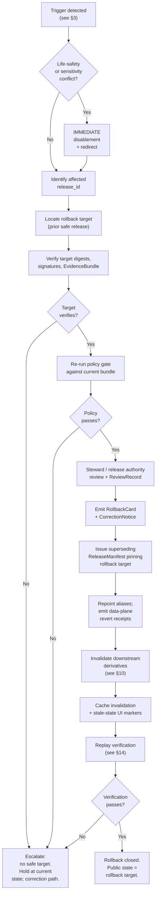
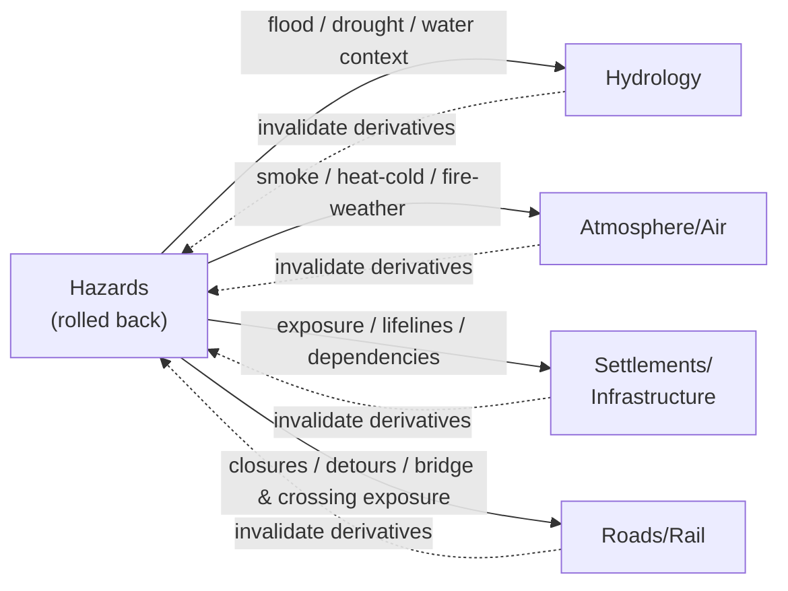

<!-- [KFM_META_BLOCK_V2]
doc_id: kfm://doc/runbook-hazards-rollback
title: Hazards — Rollback Runbook
type: standard
version: v1
status: draft
owners: Docs steward; Hazards domain steward; Release authority
created: 2026-05-12
updated: 2026-05-12
policy_label: public
related: [
  docs/doctrine/directory-rules.md,
  docs/doctrine/lifecycle-law.md,
  docs/doctrine/trust-membrane.md,
  docs/domains/hazards/README.md,
  docs/runbooks/README.md,
  docs/governance/separation-of-duties.md,
  release/rollback_cards/,
  release/manifests/,
  release/correction_notices/,
  schemas/contracts/v1/release/
]
tags: [kfm, runbook, hazards, rollback, release, governance]
notes: [
  "Path placement PROPOSED — see Section 2 on docs/runbooks/<domain>/ vs flat <domain>_ROLLBACK.md convention.",
  "All concrete paths, validator names, CI job names PROPOSED until mounted-repo evidence verifies them."
]
[/KFM_META_BLOCK_V2] -->

# Hazards — Rollback Runbook

> Procedure for reverting a PUBLISHED Hazards release to a prior safe release, with correction lineage, downstream invalidation, and the life-safety boundary preserved.


| Field | Value |
|---|---|
| **Status** | `draft` |
| **Owners** | Docs steward · Hazards domain steward · Release authority |
| **Last updated** | 2026-05-12 |
| **Authority of this procedure** | CONFIRMED doctrine; PROPOSED implementation |
| **Authority of specific paths quoted here** | PROPOSED until verified against mounted-repo evidence |
| **Supersedes** | none |

> [!CAUTION]
> **KFM Hazards is not an emergency alert system.** A rollback in this domain MUST NOT delay, replace, or compete with life-safety guidance from official sources (NWS, NWS API, FEMA, state emergency management, local EM). If a release error has placed life-safety content, expired warnings, or unredirected advisory context in front of users, the first action is **public disablement of the affected surface and a visible redirect to official sources** — the rollback decision and lineage artifacts follow that disablement, they do not gate it.

---

## Quick jump

- [1. Scope and life-safety boundary](#1-scope-and-life-safety-boundary)
- [2. Repo fit](#2-repo-fit)
- [3. Inputs — what triggers a rollback](#3-inputs--what-triggers-a-rollback)
- [4. Exclusions — what this runbook does not cover](#4-exclusions--what-this-runbook-does-not-cover)
- [5. Roles and separation of duties](#5-roles-and-separation-of-duties)
- [6. Preconditions and required artifacts](#6-preconditions-and-required-artifacts)
- [7. The rollback flow](#7-the-rollback-flow)
- [8. Defect-class rollback postures](#8-defect-class-rollback-postures)
- [9. Hazards-specific variants](#9-hazards-specific-variants)
- [10. Cross-lane fanout](#10-cross-lane-fanout)
- [11. Stale vs. wrong](#11-stale-vs-wrong)
- [12. UI and public-surface state during rollback](#12-ui-and-public-surface-state-during-rollback)
- [13. Records emitted by a rollback](#13-records-emitted-by-a-rollback)
- [14. Rollback drill and replay verification](#14-rollback-drill-and-replay-verification)
- [15. Failure modes and reason codes](#15-failure-modes-and-reason-codes)
- [16. Anti-patterns](#16-anti-patterns)
- [17. Open questions and verification backlog](#17-open-questions-and-verification-backlog)
- [18. Related docs](#18-related-docs)
- [Appendix A — RollbackCard fields](#appendix-a--rollbackcard-fields)
- [Appendix B — Worked example: stale NWS warning context release](#appendix-b--worked-example-stale-nws-warning-context-release)

---

## 1. Scope and life-safety boundary

This runbook applies to PUBLISHED Hazards releases — historical hazard events, regulatory hazard areas, scientific observations, remote-sensing detections, modeled derivatives, exposure summaries, resilience summaries, and **contextual** (not live-safety) operational warning/advisory/declaration projections — and to any Hazards-bound layer, catalog record, EvidenceBundle, Evidence Drawer payload, or governed AI answer derived from them.

CONFIRMED doctrine: **correction and rollback are publication requirements, not afterthoughts.** A Hazards claim, layer, catalog record, artifact, or governed AI answer is treated as safely publishable only if it has a visible correction path and a rollback target before release. Rollback is a **governed state transition through the same release path** that produced the original release — never a hidden file copy and never a silent edit.

### What "rollback" means inside Hazards

| Term | Meaning in this runbook |
|---|---|
| **Rollback** | Revert a PUBLISHED Hazards release to a previously released, safe artifact set. Public state held at the prior release until rollback is validated. |
| **Correction** | Emit a `CorrectionNotice` plus a superseding release; the original release record is preserved, not mutated. |
| **Disablement** | Immediately remove a public surface (route, layer, tile bundle, Evidence Drawer payload, AI answer) without a complete rollback — used when sensitivity, rights, or life-safety risk requires speed. Always followed by a rollback or correction within the same governed flow. |
| **Tombstone** | A signed record that an item is retracted; lineage and audit remain explorable, but public views hide the tombstoned item. (PROPOSED reference — see [Related docs](#18-related-docs).) |

[Back to top](#quick-jump)

---

## 2. Repo fit

PROPOSED placement (see Section 2 of Notes for the convention question):

```text
docs/
└── runbooks/
    └── hazards/
        ├── ROLLBACK_RUNBOOK.md        ← this file
        ├── VALIDATION_RUNBOOK.md      (PROPOSED sibling)
        └── LOCAL_DEV_RUNBOOK.md       (PROPOSED sibling)
```

Per the Directory Rules canonical tree, `docs/runbooks/` is the canonical home for "ops procedures, rollback drills, validation runs," and Hazards is a domain **segment** inside that root — not a root-level folder of its own.

**Upstream doctrine** (consult before editing this runbook):

- `docs/doctrine/lifecycle-law.md` — RAW → WORK / QUARANTINE → PROCESSED → CATALOG / TRIPLET → PUBLISHED.
- `docs/doctrine/trust-membrane.md` — no public client touches RAW / WORK / QUARANTINE / canonical / model runtime.
- `docs/doctrine/truth-posture.md` — cite-or-abstain default.
- `docs/doctrine/directory-rules.md` — placement law for release artifacts and runbooks.
- `docs/domains/hazards/README.md` — Hazards domain identity, source families, object families, sensitivity posture.
- `docs/architecture/governed-api.md` — the only public route through which a rolled-back state becomes visible.

**Downstream artifacts** (produced or referenced when this procedure runs):

- `release/manifests/<release_id>.json` — the new `ReleaseManifest` that revert-points to the prior release.
- `release/rollback_cards/<rollback_id>.json` — the `RollbackCard` decision record.
- `release/correction_notices/<correction_id>.json` — paired `CorrectionNotice`.
- `data/rollback/hazards/<alias>/<receipt_id>.json` — data-plane alias-revert receipts.
- `data/published/layers/hazards/...` — restored layer artifacts (digest-pinned).
- `data/proofs/hazards/...` — `EvidenceBundle` references that the rolled-back release continues to satisfy.

[Back to top](#quick-jump)

---

## 3. Inputs — what triggers a rollback

A rollback is initiated when a PUBLISHED Hazards release fails one or more of the conditions below. The trigger list is not exhaustive; any condition that breaks a closure rule of the Release gate (see [§6](#6-preconditions-and-required-artifacts)) is a candidate.

| Trigger | Source of detection (PROPOSED) | Default first action |
|---|---|---|
| Expired operational warning context appearing as current state | Freshness/expiry validator; UI stale-state probe; user correction | **Disable** affected layer/payload; open rollback |
| Source-role collapse (observation rendered as regulatory, model rendered as observed, etc.) | Source-role anti-collapse test; reviewer | Disable; rollback to last release whose source roles validated cleanly |
| Sensitive-location exposure (e.g., archaeological, rare-species, infrastructure precision crossing into a Hazards layer) | Sensitivity reviewer; redaction-receipt audit | **Immediate disablement**; sensitive-lane rollback |
| Rights change / takedown (NOAA, FEMA, NWS, USGS, NASA FIRMS, state EM, rights-holder communication) | Rights register; rights-holder rep | Withdraw affected artifacts; rollback |
| Geometry defect (CRS error, polygon flip, projection drift, NFHL clip wrong) | Geometry validator; visual regression | Rollback to last digest-pinned artifact |
| Temporal defect (event time / valid / issue / expiry / retrieval / release time confused) | Temporal-role validator | Mark stale; rollback if cannot be corrected in place |
| Policy version drift / OPA rebuild | `PolicyDecision` re-run | Re-run gate; supersede if needed; rollback if not recoverable |
| Validation regression after a schema migration | `ValidationReport` failure on a re-run | Rollback to last release validated by the prior schema; coordinate ADR |
| Catalog defect (`EvidenceRef` no longer resolves to `EvidenceBundle`) | Catalog closure check | Rollback to last release whose catalog closure passed |
| API or layer manifest defect (route returns wrong envelope, `LayerManifest` invalid) | Contract tests; runtime monitoring | Disable route; rollback |
| Governed AI answer defect (uncited claim, abstention bypassed, restricted answer leaked) | `AIReceipt` audit; citation validator | Invalidate `AIReceipt`; remove answer; preserve `EvidenceBundle` |
| Release-infrastructure error (`ReleaseManifest` invalid, signature failure, missing rollback target) | Release CI; release authority | Block; fix manifest; re-run release; rollback if already public |
| External life-safety conflict (KFM contextual content visibly conflicts with current official guidance) | UI stale probe; correction queue; partner report | **Immediate disablement** and visible redirect to the official source |

> [!IMPORTANT]
> If two or more triggers fire together, treat the most restrictive (sensitivity, rights, life-safety conflict) as authoritative. The principle is fail-closed: when posture is uncertain, hide the surface and roll back.

[Back to top](#quick-jump)

---

## 4. Exclusions — what this runbook does not cover

This runbook does **not** cover:

- **Live-safety alerting or emergency instructions.** KFM Hazards is not an emergency alert system. Issuing, retracting, amending, or "rolling back" an official NWS warning, FEMA declaration, or any other authoritative emergency notice is owned by the official source, not by KFM.
- **Source admission rollback in RAW.** Withdrawing a raw payload or quarantine entry uses the admission/quarantine procedure, not this runbook. RAW and QUARANTINE never reach a public surface, so there is no PUBLISHED release to revert.
- **Schema migrations as such.** A schema change that requires re-validation lives under the schema ADR + migration procedure. This runbook only describes the **release-side** rollback that may accompany it.
- **Hydrology, Atmosphere/Air, Settlements/Infrastructure, Roads/Rail rollbacks.** Cross-lane derivatives may need to be invalidated by a Hazards rollback (see [§10](#10-cross-lane-fanout)), but each owning lane runs its own rollback procedure.
- **Story / export / atlas snapshot rollback.** `StorySnapshot` and `ExportReceipt` rollbacks are covered by the Story / export runbook(s); this runbook only handles the Hazards layer/catalog/EvidenceBundle/AI surfaces those snapshots depend on.
- **Tile-only rebuilds without an evidence change.** A pure tile rebuild that preserves identical evidence, source roles, and policy still goes through the release path, but is generally a forward fix rather than a rollback.

[Back to top](#quick-jump)

---

## 5. Roles and separation of duties

CONFIRMED doctrine: **author ≠ release authority when materiality applies**, and the correction reviewer is distinct from the original detector for steward-significant corrections. For sensitive lanes (rare-species locations, archaeological coordinates, infrastructure precision, living-person data joins), the rights-holder representative is required.

| Role | Responsibility in a Hazards rollback | Required when |
|---|---|---|
| **Hazards domain steward** | Owns Hazards object families, validators, and the rollback initiation decision. Approves rollback target selection. | Always |
| **Release authority** | Issues the new `ReleaseManifest` that pins the rollback target. Distinct from the original author when materiality applies. | Always for PUBLISHED |
| **Correction reviewer** | Reviews the paired `CorrectionNotice`. May be a different steward than the detector. | Steward-significant correction |
| **Sensitivity reviewer** | Reviews redaction / withholding / tier downgrade decisions tied to the rollback. | Sensitive-content rollback |
| **Rights-holder representative** | Confirms sovereignty / cultural / consent-based decisions. | Rights or cultural-sensitivity rollback |
| **Source steward** | Confirms source rights and source-role posture after the rollback. | Source-rights or source-role rollback |
| **AI surface steward** | Reviews and signs off on Focus Mode answer invalidation; audits `AIReceipt` consequences. | AI-answer rollback |
| **Docs steward** | Updates this runbook, registers, drift entries, ADR linkage. | Any rollback that surfaces a doctrine or path question |

> [!NOTE]
> Separation of duties is **maturity-dependent**. Early-stage releases with low materiality may be authored and approved by the same actor; as the public trust surface expands, separation must be enforced through tooling rather than custom. This runbook assumes the higher-maturity posture by default and notes where lighter-touch separation is acceptable.

[Back to top](#quick-jump)

---

## 6. Preconditions and required artifacts

A Hazards rollback is **closed** only when all of the following exist and resolve. Missing any one means the transition fails closed and the prior public state is preserved.

| Required artifact | Purpose | Default home (PROPOSED) |
|---|---|---|
| `ReleaseManifest` (current, failed) | Identifies the release being rolled back | `release/manifests/<failed_release_id>.json` |
| `ReleaseManifest` (rollback target) | Identifies the prior safe release; its digests and signatures must still verify | `release/manifests/<rollback_target_id>.json` |
| `RollbackCard` | The rollback decision record; names `release_id`, `rollback_to`, reason, invalidates, reviewer, time | `release/rollback_cards/<rollback_id>.json` |
| `CorrectionNotice` | Public-facing notice of what changed and why; paired with the `RollbackCard` | `release/correction_notices/<correction_id>.json` |
| `ReviewRecord` | Records the steward / release authority / sensitivity / rights-holder reviews that approved the rollback | Linked from `RollbackCard.review_ref` |
| `PolicyDecision` (re-run) | Records the policy gate evaluating the rollback target against the current policy bundle | Linked from `RollbackCard` |
| `EvidenceBundle` (still resolving) | Confirms the rollback target's `EvidenceRef`s still resolve | `data/proofs/hazards/...` |
| Alias-revert receipts (data plane) | Records the layer/tile/URL alias pointer change | `data/rollback/hazards/<alias>/<receipt_id>.json` |
| Invalidation list | Names downstream derivatives (catalog records, graph projections, vector index entries, Evidence Drawer payloads, `AIReceipt`s) to invalidate | Embedded in `RollbackCard.invalidates[]` |
| Stale-state UI markers | Visible to users on any surface that depended on the failed release until cache propagation completes | UI state; tracked by cache-invalidation record |

**Universal closure rule** (CONFIRMED doctrine): a transition is closed only when the required artifacts above exist, every required artifact **resolves** the artifacts it depends on (`EvidenceRef → EvidenceBundle`, `source_id → SourceDescriptor`, `model_id → ModelRunReceipt`), and the policy gate has evaluated and recorded its decision.

[Back to top](#quick-jump)

---

## 7. The rollback flow



### Numbered procedure

The steps below correspond to the diagram and are the canonical sequence. Skipping a step is a failure and must be recorded as a `RollbackCard` exception with reason.

1. **Detect and classify.** Record the trigger ([§3](#3-inputs--what-triggers-a-rollback)) and the defect class ([§8](#8-defect-class-rollback-postures)). The defect class determines the **rollback posture**.
2. **Life-safety / sensitivity short-circuit.** If life-safety conflict, sensitive-location exposure, rights takedown, or any other condition demands speed: **disable the affected public surface immediately and post a visible redirect to the official source.** Disablement is fail-closed; the rollback proceeds underneath.
3. **Identify the failed `release_id`.** Pull the current `ReleaseManifest` for the affected Hazards surface(s).
4. **Locate the rollback target.** Walk the `rollback_target` chain on each affected `ReleaseManifest` until a candidate prior release is found whose `EvidenceBundle`s, `PolicyDecision`s, source roles, and digests can still be expected to verify.
5. **Verify the target.** Re-check digests and signatures of the prior release's artifacts. Re-resolve `EvidenceRef → EvidenceBundle`. If any reference fails to resolve, the target is **not** a safe rollback; escalate per Step 12.
6. **Re-run the policy gate** against the **current** policy bundle. A target that passed under an old policy may now fail; if it does, escalate per Step 12. A passing decision yields a new `PolicyDecision` that is referenced from the `RollbackCard`.
7. **Convene the required reviewers** ([§5](#5-roles-and-separation-of-duties)). Record decisions in `ReviewRecord`s. For sensitive lanes, the rights-holder representative is required.
8. **Emit the `RollbackCard`** ([Appendix A](#appendix-a--rollbackcard-fields)) and the paired `CorrectionNotice`. The `RollbackCard.invalidates[]` array enumerates downstream derivatives.
9. **Issue a superseding `ReleaseManifest`** that pins the rollback target as the new public state. The original failed `ReleaseManifest` is **not deleted or mutated** — it is preserved and superseded.
10. **Repoint aliases** (layer URLs, tile bundle pointers, route → manifest bindings) and emit data-plane alias-revert receipts under `data/rollback/hazards/<alias>/`.
11. **Invalidate downstream derivatives.** Walk the invalidation list (see [§10](#10-cross-lane-fanout)): catalog records, graph/triplet projections, vector index entries, Evidence Drawer payloads, `AIReceipt`s that referenced the failed release.
12. **Cache invalidation.** Emit a cache-invalidation record. Mark UI state stale or withdrawn for any view that may still hold the failed release pending cache propagation.
13. **Replay verification** ([§14](#14-rollback-drill-and-replay-verification)). Run the rollback drill fixture: same evidence + same inputs + same pinned tooling MUST produce the same receipt hashes as the rollback target's original release. Failure here means the rollback is **not closed.**
14. **Close the rollback.** Update the release register; update the drift register if the rollback exposed a doctrine question; update this runbook if the procedure itself surfaced a gap.

> [!TIP]
> A rollback is closed only after replay verification passes. Before that point, public state remains held at the rollback target and the `RollbackCard` is in an interim "verifying" state. Releases and corrections downstream of the affected surface should be paused until verification completes.

[Back to top](#quick-jump)

---

## 8. Defect-class rollback postures

CONFIRMED doctrine: every published claim has both a **correction posture** and a **rollback posture** keyed to defect class. The table below restates the general rules for Hazards.

| Defect class | Correction posture | Rollback posture (Hazards default) |
|---|---|---|
| **Evidence gap** | ABSTAIN or withdraw unsupported claim | Restore prior evidence-supported release |
| **Rights defect** | DENY public use; quarantine source/artifact | Withdraw affected artifacts; rollback to last rights-clean release |
| **Sensitivity leak** | Redact / generalize and notify stewards | **Immediate public disablement**, then rollback |
| **Geometry defect** | Rebuild derivative layer and Evidence payload | Restore previous digest-pinned artifact |
| **Temporal defect** (issue/expiry/valid/retrieval/release/correction time confused) | Correct the time fields | Mark stale until rebuilt; rollback if cannot correct in place |
| **Policy defect** | Re-run policy and `DecisionEnvelope` | Disable route/layer if the gate failed; rollback if the policy itself is rolled back |
| **AI answer defect** | Invalidate `AIReceipt` and response envelope | Remove answer; preserve `EvidenceBundle`; new `AIReceipt` is a new record, not a retroactive supersession |
| **Catalog defect** | Re-emit catalog closure after proof repair | Restore previous catalog state |
| **Source-role collapse** (observation → regulatory, model → observed, advisory → warning, etc.) | Restore source role; refuse upcast | Rollback to last release whose source-role anti-collapse tests passed |

### Hazards-specific overlay

- **Operational warning / advisory / watch context** — never act as life-safety. If expired context appears as current, the rollback posture is **immediate disablement of the operational-context layer** followed by a rollback that keeps historical event layers public and demotes the operational layer to a contextual-only state with a visible redirect to the official source.
- **Disaster declaration layers** — these are administrative records, not life-safety instructions. Rollback follows the standard rights / geometry / temporal postures.
- **Regulatory layers (e.g., NFHL flood hazard context)** — vintage-bearing; rollback should preserve the rollback target's vintage and explicitly badge it on the UI rather than silently revert to an older regulatory state without context.
- **Detection layers (NASA FIRMS, NOAA HMS smoke)** — `WildfireDetection` and `SmokeContext` are observations, not warnings; a rollback must not convert a model-as-observed leak into an "observed" rollback target.

[Back to top](#quick-jump)

---

## 9. Hazards-specific variants

The general flow ([§7](#7-the-rollback-flow)) applies uniformly. The variants below highlight where Hazards differs from a generic domain rollback.

### 9.1 Operational warning / advisory / watch context

> [!WARNING]
> Operational context is **contextual only**. A stale, expired, or mis-rendered operational warning is the most life-safety-adjacent failure mode in Hazards. Treat any stale or expired `WarningContext`, `AdvisoryContext`, or implied "current warning" UI state as a sensitivity-leak-equivalent: immediate disablement of the surface, visible redirect to official sources, rollback underneath.

Required additions to the standard flow:

- Confirm the freshness validator and operational-expiry tests pass on the rollback target.
- Confirm the rollback target's Evidence Drawer payloads include the non-life-safety disclaimer.
- The `CorrectionNotice` for an operational-context rollback should explicitly name the official source(s) users were redirected to during disablement.

### 9.2 Regulatory hazard areas (NFHL, KGS, state regulatory polygons)

- Vintage and rights matter more than geometry detail. Preserve the rollback target's source vintage on the UI rather than silently revert.
- If the trigger was a rights change, the rollback may need to **withdraw the entire layer** rather than revert to a prior rights-bearing release. In that case, the new `ReleaseManifest` pins the layer to a withdrawn state with a tombstone-equivalent record.

### 9.3 Scientific observations and remote-sensing detections

- `HazardObservation`, `WildfireDetection`, `SmokeContext`, `EarthquakeEvent` — these are observation source-role artifacts. The rollback must not promote any of them to a regulatory or warning role.
- If a model-as-observed leak triggered the rollback, the rollback target itself must be re-checked for the same defect before it is treated as safe.

### 9.4 Exposure and resilience summaries (modeled derivatives)

- These are `modeled_derivative` source-role artifacts and depend on cross-lane inputs (Settlements/Infrastructure, Hydrology, Atmosphere/Air, Roads/Rail).
- A Hazards rollback that invalidates a cross-lane input MUST trigger a cross-lane review ([§10](#10-cross-lane-fanout)) before the modeled derivative is re-published from the rollback target.

### 9.5 Governed AI answers about Hazards

- An AI answer is a new record; rolling back the underlying release does not retroactively change a previously emitted `AIReceipt`. Instead:
  1. Invalidate the affected `AIReceipt`s on the published surface (hide from public views).
  2. Preserve them in audit (no silent deletion).
  3. Emit new `AIReceipt`s only when a user re-asks against the rolled-back evidence.
- Focus Mode must ABSTAIN where the rolled-back evidence no longer supports a prior answer and DENY where rights / sensitivity / release state now blocks it.

[Back to top](#quick-jump)

---

## 10. Cross-lane fanout

Hazards has CONFIRMED / PROPOSED cross-lane relations to **Hydrology**, **Atmosphere/Air**, **Settlements/Infrastructure**, and **Roads/Rail**. A Hazards rollback must walk these relations and invalidate or notify the dependent surfaces.



**Required cross-lane actions on a Hazards rollback:**

| Cross-lane dependency | Action on rollback | Owner |
|---|---|---|
| Hydrology — flood / drought event context | Invalidate joined records; notify Hydrology steward; flag for re-publication after Hazards rollback is closed | Hazards + Hydrology stewards |
| Atmosphere/Air — `SmokeContext`, heat-cold context, AQI joins | Invalidate cross-cited records; notify Atmosphere/Air steward | Hazards + Atmosphere/Air stewards |
| Settlements/Infrastructure — `ExposureSummary`, lifeline dependencies | Invalidate exposure summaries that referenced the failed release; downstream review required | Hazards + Settlements/Infrastructure stewards |
| Roads/Rail — closures, detours, bridge/crossing exposure | Invalidate transient `RestrictionEvent` / `StatusEvent` joins; coordinate with Roads/Rail steward | Hazards + Roads/Rail stewards |
| Story / export / atlas snapshots that included the failed release | Tombstone-equivalent: hide affected snapshots from public; preserve in audit; re-publish from rollback target if appropriate | Story / export steward |

> [!IMPORTANT]
> Cross-lane invalidation is a **notification + invalidation** action, not a transitive rollback. Each owning lane runs its own rollback procedure for its own published artifacts. The Hazards `RollbackCard.invalidates[]` array enumerates the cross-lane derivatives that must be touched.

[Back to top](#quick-jump)

---

## 11. Stale vs. wrong

CONFIRMED doctrine: **stale ≠ wrong**. A stale claim's evidence, source freshness, dependent data, or context has aged past its declared tolerance; a wrong claim's substance is incorrect. Both states have visible markers and traceable lifecycles, but they trigger different responses.

| Marker | Triggered by | Required action — Hazards |
|---|---|---|
| Source freshness expired | `SourceDescriptor` cadence passed without re-admission | Re-admit or supersede; otherwise mark dependent Hazards claims stale and surface the stale-source badge in the Evidence Drawer |
| Schema version drift | Object schema upgraded past the published claim's version | Migrate, re-validate, re-release — or mark stale until migration completes |
| Geography version drift | `GeographyVersion` replaced; published claim still bound to prior version | Rebind to current `GeographyVersion`; re-release; or mark stale |
| Time-scope outside support | Claim's temporal scope outside current data support window | Mark stale; **do not refresh silently** |
| Model version superseded | `ModelRunReceipt` references an older model | Re-run; supersede; or mark stale |
| Review aged out | `ReviewRecord` older than the review-cycle tolerance for the sensitive lane | Trigger steward review; potentially downgrade tier |
| Rights status changed | Rights change in `SourceDescriptor` or rights-holder communication | Re-evaluate tier; potentially downgrade; emit `CorrectionNotice` if necessary |
| Policy version changed | Policy referenced by `PolicyDecision` was superseded | Re-run gate; potentially supersede release |

**Rule of thumb for this runbook**: *stale* is handled by visible markers and a re-release; *wrong* is handled by rollback. When in doubt — particularly for operational warning context — treat as wrong, not stale.

[Back to top](#quick-jump)

---

## 12. UI and public-surface state during rollback

The trust membrane forbids any public client, normal UI surface, or released AI surface from reaching RAW, WORK, QUARANTINE, canonical/internal stores, graph internals, vector indexes, source APIs, or direct model runtimes. **A rollback in progress does not relax this rule.** The public path remains the governed API; the rollback target becomes the new state that the governed API serves.

| Phase | Recommended UI state |
|---|---|
| Trigger detected, awaiting disablement | No UI change yet; reviewers notified |
| Immediate disablement (sensitive / life-safety conflict) | Affected layer/payload hidden; visible non-life-safety disclaimer and redirect to official sources; trust badge set to *withdrawn* |
| Rollback target located, target verifying | Hazards layer set to *stale / verifying* on the affected surfaces; Evidence Drawer shows the prior release ID and "rollback in progress" state |
| `RollbackCard` + `CorrectionNotice` emitted, new `ReleaseManifest` issued | UI begins switching to the rollback target as cache propagation completes; trust badge transitions to *superseded* on the failed release and *current* on the rollback target |
| Replay verification in progress | UI shows the rollback target as current; an audit-facing badge surfaces "verifying" until verification passes |
| Verification complete, rollback closed | Stale badges cleared on the rolled-back surfaces; `CorrectionNotice` accessible from the Evidence Drawer |
| Verification failed | Hold at the rollback target's predecessor or escalate to a manual hold; affected surfaces remain disabled |

**Required UI guarantees** during any rollback phase:

- No public surface reads from RAW / WORK / QUARANTINE / canonical / internal.
- No direct model traffic to a public client.
- No uncited authoritative claim is rendered as current state.
- The non-life-safety disclaimer remains visible on any Hazards operational-context surface that is publicly reachable.
- The Evidence Drawer can show, for the affected surfaces, the failed release ID, the rollback target ID, and the linked `RollbackCard` and `CorrectionNotice` (audit visibility per policy label).

[Back to top](#quick-jump)

---

## 13. Records emitted by a rollback

Every rollback produces a small, well-known set of records. **None of them is optional.** Missing one means the transition fails closed and the prior public state is preserved.

| Record | Phase | Default home (PROPOSED) | Lifetime |
|---|---|---|---|
| `RollbackCard` | Decision | `release/rollback_cards/<rollback_id>.json` | Permanent; never silently deleted |
| `CorrectionNotice` | Decision | `release/correction_notices/<correction_id>.json` | Permanent |
| `ReleaseManifest` (superseding) | Decision | `release/manifests/<new_release_id>.json` | Permanent; preserves rollback chain |
| `ReleaseManifest` (failed; preserved) | Lineage | `release/manifests/<failed_release_id>.json` | Permanent; marked superseded |
| `PolicyDecision` (re-run against rollback target) | Validation | Linked from `RollbackCard` | Permanent |
| `ReviewRecord`(s) | Validation | Linked from `RollbackCard.review_ref` | Permanent |
| `ValidationReport` (replay verification) | Validation | Linked from `RollbackCard` | Permanent |
| Alias-revert receipts (data plane) | Data plane | `data/rollback/hazards/<alias>/<receipt_id>.json` | Permanent |
| Cache-invalidation record | Data plane | Cache invalidation log | Permanent |
| Tombstone records for downstream derivatives | Lineage | Per lane | Permanent |

> [!NOTE]
> *Permanent* means *append-only* — superseded, withdrawn, and tombstoned records remain queryable for audit and lineage. They are hidden from public views but never deleted. Right-to-be-forgotten obligations for personal data are handled by a distinct erasure procedure with its own log; that procedure is outside the scope of this runbook.

[Back to top](#quick-jump)

---

## 14. Rollback drill and replay verification

A rollback is closed only when **replay verification** passes. Replay verification is a deterministic re-derivation: same evidence + same inputs + same pinned tooling MUST produce the same receipt hashes as the rollback target's original release. The Hazards rollback drill is the routine exercise of this verification.

### Replay verification invariant

```text
same EvidenceBundle + same pipeline_spec + same pinned tooling
  -> same TransformReceipt, ValidationReport, and ReleaseManifest digests
  -> same RollbackCard outcome
```

### Rollback drill cadence (PROPOSED)

| Cadence | Scope |
|---|---|
| Per-release | Every Hazards release MUST have a verifiable rollback target. Replay verification runs as part of the release gate, before PUBLISHED, **not only** when a rollback fires. |
| Quarterly | Hazards domain steward initiates a full rollback drill against a representative published surface: pick a release, simulate a defect of each class in [§8](#8-defect-class-rollback-postures), execute the rollback flow against a non-production target, and record the outcomes. |
| Post-incident | After any real rollback, the drill is replayed against a fixture to capture the lessons learned and to update this runbook. |

### Drill fixture requirements (PROPOSED)

- A small, public-safe Hazards fixture: one historical flood / severe weather event, NFHL flood context, and one exposure summary — with warning feeds disabled or contextual-only (this matches the Hazards thin-slice plan).
- A pinned tool-version manifest.
- A `pipeline_spec` snapshot that produced the original release.
- A `replay_check` CI job (PROPOSED name) that emits a pass/fail receipt.

> [!TIP]
> If replay verification fails, the rollback target is **not** a safe rollback. The most common causes are non-deterministic tooling, drifted external dependencies, and policy bundle changes that change the gate outcome. Investigate, pin, and re-run; do not paper over a verification failure.

[Back to top](#quick-jump)

---

## 15. Failure modes and reason codes

PROPOSED reason codes (consistent with the universal gate-failure catalog). Every rollback that does not close emits one or more of these codes on its `RollbackCard`.

| Reason code (PROPOSED) | Meaning | Recovery path |
|---|---|---|
| `ROLLBACK_TARGET_MISSING` | No rollback target named on the failed `ReleaseManifest`, or named target cannot be located | Manually supply a rollback target; escalate to release authority |
| `ROLLBACK_TARGET_UNVERIFIED` | Rollback target's digests, signatures, or `EvidenceBundle` references do not resolve | Investigate; do not roll back to an unverified target |
| `RELEASE_MANIFEST_INVALID` | Superseding `ReleaseManifest` fails schema or contract validation | Manifest fix; re-run release |
| `MISSING_RECEIPT` | Required `TransformReceipt` / `RedactionReceipt` / `AggregationReceipt` for the rollback target cannot be located | Re-emit missing receipt or pick a different target |
| `MISSING_EVIDENCE` | `EvidenceRef` no longer resolves to an `EvidenceBundle` | Repair evidence resolution; pick a different target if irrecoverable |
| `MISSING_REVIEW` | Required `ReviewRecord` absent | Convene the required reviewer; record the decision |
| `REVIEW_REJECTED` | Reviewer denied the rollback | Re-scope; escalate; consider an alternative target or a correction-only path |
| `ROLE_COLLAPSE` | Source-role collapse risk on the rollback target | Restore source role; refuse upcast; pick a different target |
| `RIGHTS_UNKNOWN` / `SENSITIVITY_UNRESOLVED` | Rights or sensitivity status unresolved on the rollback target | Steward review; rights resolution; tier reassignment |
| `SCHEMA_MISMATCH` / `CONTRACT_DRIFT` | Rollback target validates against an older schema/contract that no longer matches the active one | Schema fix and/or ADR; re-run validator |
| `POLICY_REJECT` | Rollback target fails the **current** policy bundle | Re-run; consider correction-only path; do not bypass the gate |
| `REPLAY_FAIL` | Replay verification did not reproduce the rollback target's receipts | Investigate non-determinism; pin tooling; re-run |
| `CORRECTION_DERIVATIVES_UNRESOLVED` | Downstream derivatives could not be invalidated | Walk the invalidation list; engage cross-lane stewards |
| `CACHE_INVALIDATION_FAILED` | Cache invalidation record could not be emitted or honored | Force-invalidate; if cache cannot be invalidated, hold disablement until cache TTL expires |

[Back to top](#quick-jump)

---

## 16. Anti-patterns

These are explicit non-actions. Reviewers should flag any rollback PR that exhibits them.

> [!WARNING]
> **Do not** silently mutate a previously released `ReleaseManifest`. The failed release is preserved and superseded; it is never edited in place.

> [!WARNING]
> **Do not** rebuild a tile / layer / catalog record from raw inputs and call it "the rollback target." A rollback target is a *prior released artifact*, not a re-derivation. (A re-derivation is a forward fix and goes through the release path; it may be a correction, not a rollback.)

> [!WARNING]
> **Do not** copy files around in the file system to "restore" a prior state. Rollback is a governed state transition through the same release path that produced the original release.

> [!WARNING]
> **Do not** treat a rollback as a way to bypass the policy gate. The rollback target is re-evaluated against the **current** policy bundle; a target that passed under an old policy may not pass now.

> [!WARNING]
> **Do not** use a rollback to retroactively change a `AIReceipt`. An AI answer is a new record; retroactive supersession of an `AIReceipt` is forbidden.

> [!WARNING]
> **Do not** allow a rollback to publish operational warning / advisory / watch context as life-safety. The non-life-safety disclaimer and the official-source redirect remain mandatory on every surface that touches operational context, including the rollback target.

[Back to top](#quick-jump)

---

## 17. Open questions and verification backlog

These are tracked here in addition to `docs/registers/VERIFICATION_BACKLOG.md`. NEEDS VERIFICATION items become PROPOSED until they are settled by mounted-repo or ADR evidence.

| Item | Default posture | Verification step |
|---|---|---|
| Path placement: `docs/runbooks/<domain>/<RUNBOOK>.md` (this file) vs. flat `docs/runbooks/<domain>_<TYPE>.md` (per UI / Governed AI plan) | PROPOSED — convention question | Resolve with a docs steward decision or short ADR |
| Schema home for `RollbackCard`, `CorrectionNotice`, `ReleaseManifest` | NEEDS VERIFICATION — defaults to `schemas/contracts/v1/release/` per ADR-0001 | Inspect mounted repo; confirm or ADR |
| Policy engine binding for the release-gate policy re-run | NEEDS VERIFICATION — likely OPA / Conftest | Inspect `policy/` and CI workflow |
| Replay-verification CI job name and fixture path | UNKNOWN | Inspect CI workflows and `fixtures/domains/hazards/` |
| Cross-lane invalidation tooling (graph, vector index, catalog) | UNKNOWN | Inspect `packages/catalog/`, `packages/evidence-resolver/`, graph projection package |
| Cache invalidation surface (CDN / edge / proxy) | UNKNOWN | Inspect `infra/` and `apps/governed-api/` |
| Tombstone schema and visibility rules for Hazards | NEEDS VERIFICATION | Confirm tombstone register and UI visibility tests |
| Rollback-card signing (cosign / DSSE) for Hazards releases | NEEDS VERIFICATION | Inspect signing pipeline and signing-key handling |
| Hazards source rights and current terms (NOAA / NWS / FEMA / USGS / NASA / state EM) | NEEDS VERIFICATION | Source-steward review; per-source admissibility records |
| Whether `data/rollback/hazards/` and `release/rollback_cards/` co-exist with the documented split | NEEDS VERIFICATION | Confirm or merge via ADR per Directory Rules open question |

[Back to top](#quick-jump)

---

## 18. Related docs

> [!NOTE]
> Links below are repo-relative under the canonical tree defined by `docs/doctrine/directory-rules.md`. Specific file presence is PROPOSED until verified.

- [`docs/runbooks/README.md`](../README.md) — runbook index *(PROPOSED)*
- [`docs/runbooks/hazards/VALIDATION_RUNBOOK.md`](./VALIDATION_RUNBOOK.md) — Hazards validation runbook *(PROPOSED sibling)*
- [`docs/runbooks/hazards/LOCAL_DEV_RUNBOOK.md`](./LOCAL_DEV_RUNBOOK.md) — Hazards local dev runbook *(PROPOSED sibling)*
- [`docs/doctrine/lifecycle-law.md`](../../doctrine/lifecycle-law.md) — lifecycle invariant
- [`docs/doctrine/trust-membrane.md`](../../doctrine/trust-membrane.md) — trust-membrane rules
- [`docs/doctrine/truth-posture.md`](../../doctrine/truth-posture.md) — cite-or-abstain
- [`docs/doctrine/directory-rules.md`](../../doctrine/directory-rules.md) — placement law
- [`docs/domains/hazards/README.md`](../../domains/hazards/README.md) — Hazards domain identity, source families, sensitivity posture
- [`docs/architecture/governed-api.md`](../../architecture/governed-api.md) — governed API surface
- [`docs/governance/separation-of-duties.md`](../../governance/separation-of-duties.md) — release authority, correction reviewer *(PROPOSED)*
- [`docs/registers/VERIFICATION_BACKLOG.md`](../../registers/VERIFICATION_BACKLOG.md) — open verification items
- [`docs/registers/DRIFT_REGISTER.md`](../../registers/DRIFT_REGISTER.md) — recorded conflicts between docs and repo state

[Back to top](#quick-jump)

---

## Appendix A — RollbackCard fields

Reference for authors of `RollbackCard` records produced by this runbook. CONFIRMED doctrine on purpose; PROPOSED on exact field shape; canonical schema lives in `schemas/contracts/v1/release/RollbackCard.schema.json` *(home PROPOSED per ADR-0001)*.

<details>
<summary><strong>Expand: PROPOSED field shape</strong></summary>

| Field | Type | Purpose |
|---|---|---|
| `release_id` | string (release identifier) | The PUBLISHED release being rolled back |
| `rollback_to` | string (release identifier) | The prior release the public state is reverting to |
| `reason` | string + structured `defect_class` enum | Plain-text reason and machine-readable defect class (§8) |
| `defect_class` | enum | One of: `evidence_gap`, `rights_defect`, `sensitivity_leak`, `geometry_defect`, `temporal_defect`, `policy_defect`, `ai_answer_defect`, `catalog_defect`, `source_role_collapse`, `release_infrastructure`, `other` |
| `triggered_by` | string + ref | Detection source (validator, reviewer, user correction, monitoring) |
| `invalidates[]` | array of refs | Catalog records, graph projections, vector index entries, Evidence Drawer payloads, `AIReceipt`s to invalidate |
| `cross_lane_notifications[]` | array of refs | Cross-lane lanes notified (Hydrology, Atmosphere/Air, Settlements/Infrastructure, Roads/Rail, Story/export) |
| `review_ref[]` | array of `ReviewRecord` refs | All required reviewers' decisions |
| `policy_decision_ref` | `PolicyDecision` ref | Re-run against the current policy bundle |
| `validation_report_ref` | `ValidationReport` ref | Replay verification report |
| `correction_notice_ref` | `CorrectionNotice` ref | The paired notice |
| `superseding_release_id` | string | The new `ReleaseManifest` that pins the rollback target |
| `time` | ISO-8601 timestamp | Decision time |
| `actor` | identity | Domain steward / release authority who issued the card |
| `signature` | DSSE / cosign envelope | Signed envelope; verification required before public-state change |
| `status` | enum | `proposed`, `verifying`, `closed`, `failed`, `held` |

</details>

[Back to top](#quick-jump)

---

## Appendix B — Worked example: stale NWS warning context release

Illustrative only. Identifiers, file paths, and tool names are placeholders. The walk-through is meant to make the flow concrete, not to claim implementation.

<details>
<summary><strong>Expand: worked example</strong></summary>

**Scenario.** A Hazards release `hazards-rel-2026-05-10-04` published a layer that renders the NWS `WarningContext` from the morning's retrieval. The freshness validator on the afternoon CI run reports that the `WarningContext` polygon for one Kansas county is past its declared expiry but still rendering as current on the affected layer's tile bundle. No life-safety instructions are emitted by KFM, but a stale warning context is visibly current on the public UI.

**Defect class.** `temporal_defect` with a secondary `source_role_collapse_risk` posture (operational context being rendered without the non-life-safety disclaimer adequately surfaced).

**Step-by-step.**

1. **Detect.** Freshness validator emits `STALE_OPERATIONAL_CONTEXT` for the affected polygon.
2. **Short-circuit disablement.** Operational-context layer is disabled on the affected tile bundle; the UI replaces the layer with the non-life-safety disclaimer plus a redirect to the NWS official URL for the affected county. Trust badge: *withdrawn*.
3. **Identify failed `release_id`.** `hazards-rel-2026-05-10-04`.
4. **Locate rollback target.** Walk the `rollback_target` chain on the failed `ReleaseManifest`. Candidate: `hazards-rel-2026-05-10-02`, which preceded the morning operational refresh.
5. **Verify target.** Digests and signatures on `hazards-rel-2026-05-10-02` artifacts verify. `EvidenceRef → EvidenceBundle` resolves. Source-role anti-collapse tests pass.
6. **Re-run policy gate.** `PolicyDecision` against the current policy bundle returns ALLOW for the rollback target's content (which contains no operational context for the affected county at that time).
7. **Reviewers.** Hazards domain steward + release authority + AI surface steward sign `ReviewRecord`s. Sensitivity reviewer not required (no sensitive-content posture).
8. **Emit `RollbackCard` + `CorrectionNotice`.** `RollbackCard` lists `invalidates[]`: the catalog record for the failed release, the Evidence Drawer payload that referenced the stale `WarningContext`, and one `AIReceipt` that had answered a user question using the stale context.
9. **Issue superseding `ReleaseManifest`.** `hazards-rel-2026-05-10-05` pins `rollback_to: hazards-rel-2026-05-10-02`.
10. **Repoint aliases.** Layer URL aliases repointed; alias-revert receipt emitted under `data/rollback/hazards/<alias>/`.
11. **Invalidate downstream.** Catalog record marked superseded; Evidence Drawer payload hidden from public; `AIReceipt` marked invalidated for public visibility (preserved in audit).
12. **Cache invalidation.** CDN tile cache invalidated; UI shows *superseded* on the failed release and *current* on the rollback target.
13. **Replay verification.** Drill fixture re-derives `hazards-rel-2026-05-10-02` receipts; hashes match.
14. **Close.** Verification report attached to the `RollbackCard`. Status moves from `verifying` to `closed`.

**Records produced.**

```text
release/manifests/hazards-rel-2026-05-10-05.json     # superseding release pinning rollback target
release/manifests/hazards-rel-2026-05-10-04.json     # preserved; marked superseded
release/rollback_cards/hazards-rb-2026-05-10-01.json # RollbackCard
release/correction_notices/hazards-cn-2026-05-10-01.json
data/rollback/hazards/operational-context-layer/<receipt_id>.json
```

</details>

[Back to top](#quick-jump)

---

## Footer

| Field | Value |
|---|---|
| **Doc type** | Standard runbook |
| **Owners** | Docs steward · Hazards domain steward · Release authority |
| **Last updated** | 2026-05-12 |
| **Authority** | CONFIRMED doctrine; PROPOSED implementation; PROPOSED specific paths |

**Related docs:** [`docs/runbooks/README.md`](../README.md) · [`docs/domains/hazards/README.md`](../../domains/hazards/README.md) · [`docs/doctrine/lifecycle-law.md`](../../doctrine/lifecycle-law.md) · [`docs/doctrine/trust-membrane.md`](../../doctrine/trust-membrane.md) · [`docs/architecture/governed-api.md`](../../architecture/governed-api.md)

[Back to top](#quick-jump)
