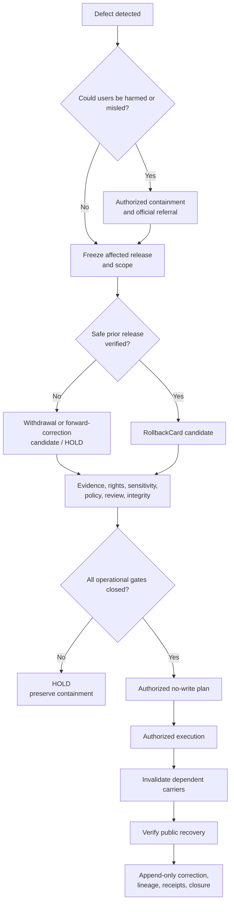

<!-- [KFM_META_BLOCK_V2]
doc_id: kfm://doc/runbook-hazards-rollback
title: Hazards Rollback Runbook
type: operational-runbook
version: v2.0.0
status: DRAFT_REPOSITORY_GROUNDED; OPERATIONAL_ROLLBACK_HOLD; BOUNDED_SYNTHETIC_MECHANICS_IMPLEMENTED; NOT_FOR_LIFE_SAFETY; NON_RELEASE; NON_PUBLICATION
owners: "@bartytime4life — verified CODEOWNERS route; accountable Hazards, correction, rollback, safety, policy, and release stewardship NEEDS VERIFICATION"
created: 2026-05-12
updated: 2026-08-27
policy_label: repository-facing; hazards; rollback; correction-aware; synthetic-proof-bounded; fail-closed; not-for-life-safety; non-publisher
owning_root: docs/
path_authority: same-path modernization under accepted ADR-0029 and Directory Rules v2
authority_effect: none
source_activation_effect: none
release_effect: none
deployment_effect: none
promotion_effect: none
publication_effect: none
evidence_snapshot:
  repository: bartytime4life/Kansas-Frontier-Matrix
  base_ref: main
  base_commit: ca8a81a9f7728347ce19843b7a681d5c9fe19ba0
  target_path: docs/runbooks/hazards/ROLLBACK_RUNBOOK.md
  target_prior_blob: 89183e9a619028006921832b5513e811274f2920
  directory_rules_blob: fd49a0b83e55cef52c1124281f093e263526898d
  directory_rules_adoption_adr_blob: a4de0d7a96b78da59cfc499d1025e1508afd8dd9
  codeowners_blob: dd2a84aa514d8ecd9208bc347f90f9a2ed37dd61
  rollback_workflow_blob: 2d0c39fc6ff8e44bd9cf753ce546475079e8ffd5
  rollback_tool_blob: a8f6bff350e79b453f425ebce9a9ded6801f8944
  generic_rehearsal_test_blob: b644ca6c4185b3f81bc339c077eae85299833261
  hazards_rehearsal_test_blob: 76d8c6c36df5bcb53d913c9451cecaf230bdf717
  hazards_fixture_readme_blob: 4b2d23a437a999c6beb249adb0dd7b02037bd34a
  rollback_card_contract_blob: c6d3c35c56b064e04c3a2532f4709d938d7b0c1a
  rollback_card_schema_blob: e0a9edf02dd5d6997eda60a054a5bf19636c3dd4
  rollback_card_validator_blob: 9e9ed5a92851935b41a36698e4bead13ef4edf57
  production_rollback_pipeline_blob: 2afd3a3d859318e05dcb3e1b2763e4e375b790b6
  published_alias_auditor_blob: f3749474a32761b6671952e815180b4764d0df83
  open_pull_requests_touching_target: 0
source_lineage:
  - title: KFM_Greenfield_Commissioning_Plan_v2_FULL.pdf
    source_class: PLANNING_REFERENCE
    use: correction cascade, commissioning gates, and smallest-complete-circle framing only
  - title: KFM Alignment Register — 2026-08-23
    source_class: COORDINATION_ONLY
    use: keep implementation, review, rollback, release, deployment, promotion, and publication states separate
  - title: KFM Markdown Update & Modernization Agent v1.0
    source_class: CURRENT_TASK_GUIDANCE
    use: same-path repository-grounded documentation modernization and draft-PR delivery method
related:
  - ../../adr/ADR-0029-adopt-directory-governance-standard-v2.md
  - ../../doctrine/directory-rules.md
  - ../README.md
  - ../rollback-rehearsal.md
  - ROLLBACK_DRILL.md
  - PROMOTION_RUNBOOK.md
  - NO_NETWORK_TEST_RUNBOOK.md
  - NOT_FOR_LIFE_SAFETY_AUDIT_RUNBOOK.md
  - SOURCE_REFRESH_RUNBOOK.md
  - ../../domains/hazards/README.md
  - ../../../.github/workflows/rollback-drill.yml
  - ../../../contracts/release/rollback_card.md
  - ../../../schemas/contracts/v1/release/rollback_card.schema.json
  - ../../../fixtures/release/rollback_card/
  - ../../../fixtures/domains/hazards/synthetic_rollback_rehearsal/
  - ../../../tools/validators/release/validate_rollback_card.py
  - ../../../tools/release/rollback_apply.py
  - ../../../tests/release/test_synthetic_rollback_rehearsal.py
  - ../../../tests/domains/hazards/test_synthetic_rollback_rehearsal.py
  - ../../../pipelines/rollback/main.py
  - ../../../scripts/maintenance/audit_published_aliases.py
notes:
  - The repository has a deterministic, marker-protected synthetic rollback and withdrawal rehearsal. It is not a production rollback executor.
  - The release RollbackCard contract, closed schema, fixtures, validator, and tests establish candidate shape and local consistency only.
  - The production rollback pipeline and published-alias auditor remain one-line greenfield placeholders at the pinned base.
  - No operational target selection, authenticated review, policy execution, signing, external invalidation, alias mutation, release, deployment, promotion, publication, or public recovery is established by this runbook.
[/KFM_META_BLOCK_V2] -->

<a id="top"></a>

# Hazards Rollback Runbook

> **One-line purpose.** Contain a defective Hazards public surface, decide whether rollback, withdrawal, or forward correction is justified, and preserve evidence, review, correction, invalidation, and recovery boundaries without treating KFM as a life-safety authority or the current synthetic rehearsal as production machinery.

[](#current-disposition)
[](#bounded-synthetic-rehearsal)
[](#rollbackcard-and-required-records)
[](#not-for-life-safety-boundary)
[](#authority-and-terminal-boundary)

<a id="not-for-life-safety-boundary"></a>

> [!CAUTION]
> **KFM Hazards is not an emergency-alerting system, incident-command system, regulatory authority, or substitute for official instructions.** Do not use this runbook to issue, replace, delay, retract, summarize as actionable, or interpret a current warning, evacuation order, shelter instruction, medical direction, all-clear, or other life-safety message. Direct urgent needs to the appropriate official authority. A KFM defect that could mislead users must be contained through a separately authorized incident/public-surface control; this document does not create that authority.

<a id="current-disposition"></a>

> [!IMPORTANT]
> **Current disposition: `BOUNDED_SYNTHETIC_ROLLBACK_PROOF / OPERATIONAL_ROLLBACK_HOLD`.** The repository implements a deterministic no-network helper for marker-protected synthetic workspaces, eight generic tests, one non-locating Hazards fixture, four Hazards-focused tests, and a read-only workflow that asserts all twelve tests are non-vacuous. The production rollback pipeline and published-alias auditor remain placeholders. The current RollbackCard profile validates proposed candidate shape and local consistency while requiring all authority and execution flags to remain false.

<a id="quick-jump"></a>

**Quick navigation:** [Goal](#goal-and-scope) · [Authority](#authority-and-terminal-boundary) · [Current evidence](#current-repository-evidence) · [Decision model](#rollback-decision-model) · [Containment](#immediate-containment-and-referral) · [Roles](#roles-and-separation-of-duties) · [Preconditions](#operational-preconditions) · [Procedure](#governed-rollback-procedure) · [Synthetic drill](#bounded-synthetic-rehearsal) · [Records](#rollbackcard-and-required-records) · [Failures](#failure-handling-and-finite-outcomes) · [Public state](#public-surface-and-cross-lane-recovery) · [Graduation](#operational-graduation-gate) · [Validation](#documentation-and-review-handoff) · [Maintenance](#maintenance-correction-and-rollback) · [Related](#related-repository-surfaces)

---

<a id="1-scope-and-life-safety-boundary"></a>
<a id="goal-and-scope"></a>

## Goal and scope

Use this runbook when a released or release-facing Hazards carrier may be defective and the team must decide, without erasing history, whether to:

- contain the affected surface;
- propose restoration of a distinct prior release;
- withdraw the current release when no safe target exists;
- issue a forward correction through the normal governed release path; or
- hold because evidence, rights, sensitivity, policy, review, target identity, or execution capability is insufficient.

The intended operational circle is:

```text
detected defect
  -> fail-closed containment and official referral where needed
  -> exact affected-release and scope freeze
  -> rollback / withdrawal / forward-correction decision
  -> evidence, policy, review, rights, sensitivity, and target verification
  -> authorized non-production plan
  -> authorized execution through accepted rollback machinery
  -> invalidation and public recovery verification
  -> append-only correction, lineage, receipts, and closure
```

Only the first four responsibilities are fully useful as a decision and handoff procedure today. Operational planning, authorization, execution, external invalidation, alias mutation, and public recovery remain `HOLD` until the [graduation gate](#operational-graduation-gate) is satisfied.

<a id="4-exclusions--what-this-runbook-does-not-cover"></a>

### Out of scope

This runbook does not:

- retract, amend, or interpret an official warning, watch, advisory, declaration, or emergency instruction;
- authorize direct edits to `data/published/`, a public alias, a cache, a CDN, a map layer, an API route, or a deployed system;
- turn a schema-valid `RollbackCard`, green workflow, pull request, merge, receipt, signature, or synthetic report into rollback authority;
- withdraw RAW, WORK, or QUARANTINE inputs; those are not public releases;
- execute database recovery, infrastructure failover, repository revert, source deactivation, or secret rotation;
- resolve another domain's release automatically; dependent domains own their own governed recovery decisions; or
- claim release, deployment, promotion, publication, or operational readiness.

[Back to top](#top)

---

<a id="2-repo-fit"></a>
<a id="authority-and-terminal-boundary"></a>

## Authority and terminal boundary

Accepted [ADR-0029](../../adr/ADR-0029-adopt-directory-governance-standard-v2.md) and the adopted [Directory Rules v2](../../doctrine/directory-rules.md) place human runbooks under `docs/runbooks/`, executable helpers under `tools/`, behavioral evidence under `tests/`, candidate shape under `contracts/` and `schemas/`, policy under `policy/`, release decisions under `release/`, and public-safe carriers under governed published-data lanes.

This is a same-path modernization of an established file. It creates no new responsibility root, contract home, schema home, policy home, release home, receipt home, proof home, or publication path.

The canonical data lifecycle remains:

```text
RAW -> WORK / QUARANTINE -> PROCESSED -> CATALOG / TRIPLET -> PUBLISHED
```

Rollback changes governed release state and downstream carriers; it does not rewrite RAW evidence or move lifecycle files backward to simulate recovery.

| Responsibility | Owning surface | This runbook's role |
|---|---|---|
| Human Hazards rollback procedure | `docs/runbooks/hazards/ROLLBACK_RUNBOOK.md` | Explain decisions, prerequisites, stop conditions, current capability, and review handoff |
| Synthetic rehearsal procedure | [`ROLLBACK_DRILL.md`](ROLLBACK_DRILL.md) | Supply the exact bounded operator/test procedure |
| Synthetic mechanics | [`tools/release/rollback_apply.py`](../../../tools/release/rollback_apply.py) | Plan or mutate only a marker-protected synthetic workspace |
| Candidate semantics | [`contracts/release/rollback_card.md`](../../../contracts/release/rollback_card.md) | Define `RollbackCard` meaning and non-authority boundary |
| Candidate machine shape | [`schemas/contracts/v1/release/rollback_card.schema.json`](../../../schemas/contracts/v1/release/rollback_card.schema.json) | Validate closed fixture-first candidate structure |
| Candidate local consistency | [`tools/validators/release/validate_rollback_card.py`](../../../tools/validators/release/validate_rollback_card.py) | Validate shape and bounded cross-field rules without executing rollback |
| CI readiness inspection | [`.github/workflows/rollback-drill.yml`](../../../.github/workflows/rollback-drill.yml) | Run bounded checks and retain explicit production holds |
| Production rollback pipeline | [`pipelines/rollback/main.py`](../../../pipelines/rollback/main.py) | **Placeholder; no accepted operational implementation** |
| Published-alias audit | [`scripts/maintenance/audit_published_aliases.py`](../../../scripts/maintenance/audit_published_aliases.py) | **Placeholder; no accepted live alias audit or mutation** |
| Release decisions and records | [`release/`](../../../release/) | Remain separate, append-only governed records |
| Public carriers and runtime state | Governed published-data and runtime surfaces | Must never be mutated by this Markdown file or the synthetic helper |

The highest result this runbook can establish from current executable evidence is:

```text
SYNTHETIC_REHEARSAL_PASS
```

It cannot establish `REVIEWED`, `APPROVED`, `ROLLBACK_AUTHORIZED`, `RECOVERED`, `RELEASED`, `DEPLOYED`, `PROMOTED`, or `PUBLISHED`.

[Back to top](#top)

---

<a id="current-repository-evidence"></a>

## Current repository evidence

The observations below are pinned to `main@ca8a81a9f7728347ce19843b7a681d5c9fe19ba0`. Re-read the exact surfaces when the base, helper, workflow, contract, schema, validator, fixture, tests, pipeline, or alias tooling changes.

| Surface | CONFIRMED repository evidence | Bounded conclusion |
|---|---|---|
| Generic helper | `tools/release/rollback_apply.py` verifies a synthetic marker, exact scenario fields, safe paths, current alias identity, manifest/artifact digests, rollback target identity, and the complete declared invalidation vocabulary | Deterministic `PLAN` and marker-protected synthetic `APPLY` exist; no real public state is touched |
| Generic tests | Eight unit tests cover deterministic no-write plan, rollback apply, withdrawal apply, and five fail-closed cases | The generic synthetic contract is executable |
| Hazards fixture | `fixtures/domains/hazards/synthetic_rollback_rehearsal/` contains non-locating, unreleased, unpublished, planning-only stale-context carriers | The fixture contains no current alert or real sensitive location |
| Hazards tests | Four tests cover bounded carrier semantics, deterministic no-write plan, stale-context apply with history preservation, tamper denial, and non-synthetic denial | The exact Hazards fixture is executable; it is not operational recovery evidence |
| Workflow | `rollback-drill` runs the release candidate validator plus the generic and Hazards rehearsal modules and requires `Ran 12 tests` with `OK` | CI proves the declared bounded profile when it passes at an exact revision |
| RollbackCard profile | The contract, closed `1.0.0` schema, validator, three valid fixtures, six invalid fixtures, and expected-findings manifest exist | A passing candidate proves shape and local consistency only |
| RollbackCard governance flags | Candidate validation requires authority, policy evaluation, completed review, rollback execution, and public mutation to remain false, with no release reference | The profile deliberately cannot represent an executed or authorized rollback |
| Production pipeline | `pipelines/rollback/main.py` is a one-line greenfield placeholder | No accepted production rollback engine exists |
| Published alias auditor | `scripts/maintenance/audit_published_aliases.py` is a one-line greenfield placeholder | No accepted live alias inventory, audit, or mutation is established |
| External invalidation | The synthetic report records nine invalidation classes but calls no cache, CDN, tile, catalog, triplet, search, vector, AI, or downstream consumer | Declared invalidation completeness is testable; operational invalidation is not |
| Accountable review and release authority | CODEOWNERS routes review to `@bartytime4life`; no authenticated Hazards rollback authority or enforced separation of duties is established by the inspected surfaces | Review routing is not approval or transition authority |
| Deployment and public recovery | No deployment target, runtime log, public endpoint, recovery timing result, or residual-access check is established here | Operational recovery remains `UNKNOWN / HOLD` |

The Drive commissioning plan remains planning lineage and the Notion alignment register remains coordination memory. Neither outranks the current repository or creates operational authority.

[Back to top](#top)

---

<a id="3-inputs--what-triggers-a-rollback"></a>
<a id="8-defect-class-rollback-postures"></a>
<a id="rollback-decision-model"></a>

## Rollback decision model

Start with the consequence and available safe state, not with the word “rollback.”

| Condition | Candidate disposition | Required posture |
|---|---|---|
| A distinct prior release is identified, digest-verifiable, evidence-supported, rights/sensitivity-clean, policy-eligible, and reviewable | `ROLLBACK_CANDIDATE` | Build and validate a candidate card; do not execute until every operational gate closes |
| No safe prior release exists, the source is withdrawn, or rights/sensitivity/security requires removal | `WITHDRAWAL_CANDIDATE` | Keep the surface fail-closed and prepare governed withdrawal/correction records |
| Evidence, target identity, rights, sensitivity, policy, review, signing, invalidation, or execution capability is incomplete | `HOLD` | Preserve containment; do not improvise an operational command |
| Candidate input or evaluation is invalid | `ERROR` | Preserve prior state, record the bounded error, and correct the candidate |
| The defect should be repaired by a new release rather than restoration of an old one | Forward correction outside the RollbackCard disposition set | Use normal validation, review, release, correction, and rollback gates; do not relabel a rebuild as rollback |
| Investigation shows no release-facing defect | No transition | Record the determination in the appropriate review/incident surface; do not mutate public state |

### Defect posture

| Defect class | First concern | Default recovery candidate |
|---|---|---|
| Life-safety-adjacent or misleading operational context | Prevent KFM from competing with official guidance | Authorized containment and official referral; then withdrawal or rollback review |
| Rights change, source withdrawal, sovereignty, or consent issue | Stop unpermitted exposure | Withdrawal unless a prior rights-clean release is verified |
| Sensitivity or harmful-precision exposure | Stop disclosure and preserve audit | Authorized containment; withdrawal or generalized forward correction |
| Evidence contradiction or unsupported claim | Restore cite-or-abstain | Prior evidence-supported release or withdrawal |
| Source-role or time-role collapse | Prevent observation/model/advisory/regulatory substitution | Prior release that passes role checks or a forward correction |
| Geometry, transform, catalog, tile, API, or presentation defect | Determine whether the prior carrier is safer than a rebuild | Rollback only to an already released verified target; otherwise forward correction |
| Policy or security failure | Re-evaluate under current controls | `HOLD` or withdrawal until a current decision exists |
| Operational failure | Preserve service safety and audit | Use separately authorized incident/recovery controls; do not use the synthetic helper |

### Stale is not automatically wrong

<a id="11-stale-vs-wrong"></a>

A stale carrier may still be historically accurate but outside its supported freshness window. A wrong carrier is materially incorrect. Both require visible, traceable handling, but rollback is not automatic for every stale record. For current-warning-like presentation, rights, sensitivity, or unsupported authoritative appearance, fail closed and treat the consequence as high until an accountable review narrows it.

[Back to top](#top)

---

<a id="immediate-containment-and-referral"></a>

## Immediate containment and referral

Containment protects users while the rollback decision is assembled. It is not the rollback itself.

1. **Recognize the boundary.** KFM does not issue or amend official emergency instructions.
2. **Record the exact affected surface.** Capture the release reference, route/layer/view identifier, observed behavior, detection time, and safe public description without copying protected content into logs.
3. **Refer urgent users to the appropriate official authority.** Do not paraphrase current life-safety instructions as KFM guidance.
4. **Invoke only a separately authorized containment mechanism.** The repository does not currently expose an accepted production disablement, alias, or cache command through this runbook.
5. **Return `HOLD` when containment authority or mechanism is not verified.** Escalate through the verified repository review route and the accountable incident/release route once identified.
6. **Preserve evidence and history.** Do not delete the affected release, rewrite its manifest, or destroy audit material to make the surface disappear.

> [!WARNING]
> Never point `tools/release/rollback_apply.py` at the repository root, `release/`, `data/`, a deployment checkout, mounted public storage, or any real system. Its marker and `synthetic: true` checks are safety boundaries, not an invitation to manufacture a marker around production data.

[Back to top](#top)

---

<a id="5-roles-and-separation-of-duties"></a>
<a id="roles-and-separation-of-duties"></a>

## Roles and separation of duties

The exact accountable identities remain `NEEDS VERIFICATION`. CODEOWNERS currently routes repository review to `@bartytime4life`, but that routing is not a `ReviewRecord`, policy decision, release approval, or proof of independent review.

| Role | Required responsibility | Current status |
|---|---|---|
| Detector / incident reporter | Record the bounded defect and affected surface without deciding the release outcome by implication | Function is understandable; identity varies by incident |
| Hazards domain steward | Confirm domain semantics, source role, time role, and affected Hazards scope | Accountable assignment `NEEDS VERIFICATION` |
| Evidence/source steward | Confirm `EvidenceRef` resolution, source authority, rights, freshness, and limitations | Accountable assignment `NEEDS VERIFICATION` |
| Safety/sensitivity/rights reviewer | Decide harmful precision, rights, sovereignty, consent, security, and not-for-life-safety posture | Required when material; assignment `NEEDS VERIFICATION` |
| Policy evaluator/reviewer | Evaluate the candidate under the current accepted policy bundle and record reasons/obligations | Operational evaluator and authority `NEEDS VERIFICATION` |
| Correction/rollback reviewer | Review the target, correction linkage, invalidation plan, and recovery evidence | Accountable assignment `NEEDS VERIFICATION` |
| Release authority | Authorize a release-state mutation through the accepted mechanism | Not established by current repository evidence |
| Operator and independent observer | Execute the accepted plan and independently verify resulting state | Operational mechanism and assignment absent |

For material public consequences, the detector, candidate author, executor, and release approver should not collapse into one unreviewed action. A bootstrap single-owner repository route may prepare a draft, but it must not be represented as independent operational approval.

[Back to top](#top)

---

<a id="6-preconditions-and-required-artifacts"></a>
<a id="operational-preconditions"></a>

## Operational preconditions

An operational rollback remains `HOLD` unless every applicable condition below is verified for one named scope.

- [ ] The affected release and every affected public carrier have stable identifiers.
- [ ] A distinct prior release target exists, or the candidate explicitly chooses withdrawal.
- [ ] Manifests and artifact bytes for the affected and target releases are immutable and digest-verifiable.
- [ ] Required `EvidenceRef` values resolve to admissible `EvidenceBundle` support.
- [ ] Source roles and material time roles remain explicit and do not collapse.
- [ ] Rights, sensitivity, sovereignty, consent, security, and harmful-precision posture are resolved.
- [ ] The candidate is evaluated under the current accepted policy bundle with reasons and obligations.
- [ ] Accountable reviews and the required separation of duties are recorded.
- [ ] Required signatures or integrity envelopes are verified by an accepted profile.
- [ ] The production mechanism supports deterministic no-write planning before mutation.
- [ ] Alias mutation and every real invalidation consumer are implemented, test-covered, and receipt-emitting.
- [ ] Correction/withdrawal notice, rollback decision, release lineage, and execution records have accepted homes and contracts.
- [ ] The public UI/API can expose stale, withdrawn, superseded, unavailable, and correction states without bypassing the trust membrane.
- [ ] Recovery verification checks caches, public routes, map layers, Evidence Drawer payloads, AI caches, and residual access.
- [ ] A reversal path exists for a failed rollback attempt.
- [ ] Incident containment, release, deployment, promotion, and publication authority are independently established where applicable.

A schema-valid candidate, synthetic pass, green readiness workflow, or merged pull request cannot compensate for a failed prerequisite.

[Back to top](#top)

---

<a id="7-the-rollback-flow"></a>
<a id="governed-rollback-procedure"></a>

## Governed rollback procedure


```mermaid
flowchart TD
  A["Defect detected"] --> B{"Could users be harmed or misled?"}
  B -- "Yes" --> C["Authorized containment<br/>and official referral"]
  B -- "No" --> D["Freeze affected release<br/>and scope"]
  C --> D
  D --> E{"Safe prior release<br/>verified?"}
  E -- "No" --> F["Withdrawal or forward-correction<br/>candidate / HOLD"]
  E -- "Yes" --> G["RollbackCard candidate"]
  F --> H["Evidence, rights, sensitivity,<br/>policy, review, integrity"]
  G --> H
  H --> I{"All operational gates closed?"}
  I -- "No" --> J["HOLD<br/>preserve containment"]
  I -- "Yes" --> K["Authorized no-write plan"]
  K --> L["Authorized execution"]
  L --> M["Invalidate dependent carriers"]
  M --> N["Verify public recovery"]
  N --> O["Append-only correction,<br/>lineage, receipts, closure"]
```

### 1. Detect, classify, and freeze

Record:

- the exact repository/runtime observation time;
- affected release and carrier identifiers;
- defect class and public consequence;
- source, evidence, policy, review, and release references already known;
- current containment state; and
- any uncertainty that changes the safe outcome.

Do not copy secrets, precise protected locations, private review text, or current emergency content into a public issue or log.

### 2. Contain and refer

Apply [immediate containment](#immediate-containment-and-referral) through an independently authorized mechanism. Keep official-source referral visible where KFM content could be mistaken for current guidance.

### 3. Identify the recovery mode

Choose one bounded candidate:

- a distinct prior release;
- withdrawal without a prior target;
- `HOLD`;
- `ERROR`; or
- forward correction through the normal release path.

Do not rebuild bytes from RAW and call them a prior release. A rebuilt carrier is a new candidate and must follow forward validation and release.

### 4. Build and validate the candidate card

Use the repository-owned [`RollbackCard` contract](../../../contracts/release/rollback_card.md), [schema](../../../schemas/contracts/v1/release/rollback_card.schema.json), and validator.

```bash
python tools/validators/release/validate_rollback_card.py <candidate.json>
```

A pass establishes candidate shape and local consistency only. It does not resolve references, authenticate actors, evaluate policy, verify signatures, approve the target, execute invalidation, mutate public state, or release anything.

### 5. Resolve support and authorize

Before an operational plan:

- resolve evidence, policy, review, correction, and release references;
- verify target bytes and integrity;
- confirm current policy eligibility;
- record rights/sensitivity decisions;
- obtain accountable release authorization; and
- verify the operator and independent observer.

At the pinned base, this operational authority path is not implemented. The truthful result is `HOLD`.

### 6. Produce an authorized no-write plan

The production mechanism must show the exact proposed alias/state change, target identities, invalidations, correction lineage, preconditions, receipts to be emitted, and reversal path without mutating public state.

The current synthetic helper demonstrates this property only inside a marker-protected toy workspace. It must not be substituted for a production planner.

### 7. Execute through accepted machinery

Execution is permitted only after the accepted plan, target, policy, reviews, integrity, and authority match the exact execution input. The current `pipelines/rollback/main.py` does not implement this step.

### 8. Invalidate dependents

Invalidate only the consumers named by current release/catalog/runtime evidence. The current candidate vocabulary includes:

- `API_CACHE`;
- `CDN`;
- `TILES`;
- `CATALOG`;
- `TRIPLETS`;
- `SEARCH_INDEX`;
- `VECTOR_INDEX`;
- `AI_CACHE`; and
- `DOWNSTREAM_DERIVATIVES`.

The synthetic rehearsal records this list but invokes none of those consumers. Operational closure requires per-consumer results or receipts and a fail-closed response to partial invalidation.

### 9. Verify public recovery

An independent observer must confirm:

- the affected carrier is no longer served where prohibited;
- the intended prior release or withdrawn state is visible;
- caches and alternate routes do not expose the affected carrier;
- map, API, Evidence Drawer, export, and AI surfaces agree on release/correction state;
- the not-for-life-safety boundary remains visible;
- no public client reaches RAW, WORK, QUARANTINE, canonical/internal stores, or direct model output; and
- monitoring remains stable for the declared observation window.

### 10. Close without erasing history

Preserve the affected release and append the correction, withdrawal/rollback decision, execution evidence, invalidation results, release lineage, public notice, and recovery verification. A failed or partially completed rollback remains visible and does not silently become `closed`.

[Back to top](#top)

---

<a id="14-rollback-drill-and-replay-verification"></a>
<a id="bounded-synthetic-rehearsal"></a>

## Bounded synthetic rehearsal

Use [`ROLLBACK_DRILL.md`](ROLLBACK_DRILL.md) for the complete operator procedure. The focused current command is:

```bash
export KFM_NO_NETWORK=1
export PYTHONHASHSEED=0
export PYTHONDONTWRITEBYTECODE=1
export PYTHONUNBUFFERED=1
export TZ=UTC

python -m unittest -q \
  tests.release.test_synthetic_rollback_rehearsal \
  tests.domains.hazards.test_synthetic_rollback_rehearsal
```

The expected bounded result is twelve tests with `OK`.

The rehearsal proves only that:

- identical synthetic plans are deterministic and do not mutate the workspace;
- marker-protected synthetic apply can restore a prior toy release or withdraw a toy alias;
- affected toy release bytes remain unchanged;
- a synthetic correction and complete declared invalidation record are written;
- the Hazards fixture moves stale-mislabeled planning context to a withheld stale carrier; and
- tampered, incomplete, unmarked, unsafe, missing-target, or non-synthetic inputs fail closed.

It does not prove source admission, real release identity, evidence resolution, active policy evaluation, authenticated review, signing, production alias mutation, actual invalidation, cache propagation, public recovery, release, deployment, promotion, or publication.

> [!NOTE]
> The helper's generated `corrections/` and `invalidations/` files exist only inside the temporary synthetic workspace. They are rehearsal output, not canonical KFM `CorrectionNotice`, `RollbackCard`, receipt, proof, or release records.

[Back to top](#top)

---

<a id="13-records-emitted-by-a-rollback"></a>
<a id="appendix-a--rollbackcard-fields"></a>
<a id="rollbackcard-and-required-records"></a>

## RollbackCard and required records

### Current candidate profile

The current `RollbackCard` profile is deliberately non-executing:

| Surface | Current maturity | What it proves |
|---|---|---|
| Semantic contract | Draft, repository-grounded, schema-paired | Meaning, field responsibilities, finite vocabularies, and non-authority boundary |
| JSON Schema `1.0.0` | Closed fixture-first profile | Machine shape |
| Validator | Implemented, no-network | Schema conformance and bounded local cross-field consistency |
| Fixtures | Three valid, six invalid, expected-findings manifest | Positive/negative polarity for the candidate profile |
| Candidate governance fields | Required false; `release_ref` null | The profile cannot claim authority, policy completion, review completion, execution, or public mutation |
| Root rollback-card JSON inventory | Readiness workflow classifies the two root JSON files as nonconforming documentation placeholders | They are not operational cards |

A candidate contains identity, disposition, trigger, affected release, target, evidence/policy/review references, correction linkage, invalidations, restoration, timing, lineage, and explicit governance non-effects. The contract is the source for exact field semantics; this runbook does not duplicate the schema.

### Operational closure packet

An operational implementation will need accepted, resolvable, and append-only records for the responsibilities below. Their exact accepted profiles and executor bindings remain `NEEDS VERIFICATION`.

| Responsibility | Required evidence before closure |
|---|---|
| Affected and target release identity | Immutable release references, manifests, artifacts, and verified digests/signatures |
| Evidence support | Resolved `EvidenceRef -> EvidenceBundle` closure and limitations |
| Policy | Current policy evaluation with reasons and obligations |
| Review and authority | Authenticated review records and accountable release authorization |
| Correction/withdrawal | Public-safe explanation and lineage without erasing the affected release |
| Rollback decision | Accepted decision record distinct from a proposed candidate |
| Execution | Receipt proving the exact authorized plan was applied |
| Invalidation | Per-consumer completion or explicit failure for every required dependent surface |
| Release lineage | Supersession/withdrawal relationship and current-state binding |
| Public recovery | Independent verification that affected state is unavailable and intended state is consistent |
| Failure/reversal | Record of any partial failure plus the safe state and reversal target |

Do not infer the existence or acceptance of those operational profiles from similarly named directories.

[Back to top](#top)

---

<a id="15-failure-modes-and-reason-codes"></a>
<a id="failure-handling-and-finite-outcomes"></a>

## Failure handling and finite outcomes

### Synthetic helper outcomes

| Outcome / reason | Meaning | Safe response |
|---|---|---|
| `PASS / SYNTHETIC_REHEARSAL_PLANNED` | Synthetic plan verified without workspace mutation | Record bounded evidence only |
| `PASS / SYNTHETIC_REHEARSAL_APPLIED` | Synthetic alias/correction/invalidation mutation completed inside the marked workspace | Record bounded evidence only |
| `HOLD / NON_SYNTHETIC_INPUT_DENIED` | Scenario did not declare literal synthetic input | Do not weaken the guard |
| `HOLD / SYNTHETIC_MARKER_MISSING` or `SYNTHETIC_MARKER_INVALID` | Workspace protection is absent or malformed | Use a dedicated temporary fixture copy |
| `HOLD / INVALIDATION_SET_INCOMPLETE` | Declared synthetic invalidations are incomplete | Repair the synthetic scenario; do not delete required classes |
| `HOLD / ARTIFACT_DIGEST_MISMATCH` | Artifact bytes differ from the manifest | Preserve state and investigate |
| `HOLD / REQUIRED_FILE_MISSING` | Required synthetic release/manifest/artifact is absent | Repair the fixture or target identity |
| `HOLD / UNSAFE_PATH` or `UNSAFE_SYMLINK` | A selected path escapes or crosses a symlink | Stop; do not bypass path safety |
| Unexpected exception/non-contract output | Helper contract failed | Classify `ERROR`; preserve logs; do not apply |

### RollbackCard validator findings

The validator may report findings such as:

- `TARGET_RELEASE_REQUIRED`;
- `EVIDENCE_REQUIRED`;
- `POLICY_DECISION_REQUIRED`;
- `ROLLBACK_TARGET_NOT_PRIOR`;
- `RESTORATION_TARGET_MISMATCH`;
- `CORRECTION_NOTICE_REQUIRED`;
- `DECISION_BEFORE_DETECTION`;
- `EFFECTIVE_BEFORE_DECISION`;
- `REFS_NOT_CANONICAL`; or
- `GOVERNANCE_BOUNDARY_VIOLATION`.

Fixing a candidate finding does not close the operational prerequisites. It only makes the candidate locally consistent.

### Operational procedure outcome

Until production target selection, policy, review, signing, execution, invalidation, alias, and recovery surfaces are accepted and verified, the only truthful operational result is:

```text
HOLD
```

Do not translate `SKIPPED`, `PENDING`, `NO_RUN_FOUND`, a green readiness hold, or lack of evidence into `PASS`.

[Back to top](#top)

---

<a id="9-hazards-specific-variants"></a>
<a id="10-cross-lane-fanout"></a>
<a id="12-ui-and-public-surface-state-during-rollback"></a>
<a id="public-surface-and-cross-lane-recovery"></a>

## Public-surface and cross-lane recovery

### Public trust membrane

During containment and recovery:

- public clients continue to use governed interfaces and released public-safe carriers;
- no fallback may expose RAW, WORK, QUARANTINE, canonical/internal stores, unreleased candidates, source credentials, or direct model output;
- maps, tiles, indexes, summaries, graph projections, and AI answers remain downstream carriers rather than truth or rollback authority;
- current release, stale/withdrawn state, correction lineage, and evidence limitations should remain visible at the consequence-appropriate level; and
- Focus Mode or other AI surfaces must abstain or deny when the surviving released evidence no longer supports an answer.

### Cross-lane dependents

Do not hard-code a broad domain list from this runbook. Enumerate actual dependents from the affected release manifest, catalog, graph/triplet projections, layer registry, runtime configuration, and observed consumers at the exact incident revision.

The operational invalidation plan must identify:

- each dependent object or surface;
- its owning lane and reviewer;
- why it depends on the affected release;
- whether it is invalidated, held, rebuilt, or unaffected;
- the completion evidence; and
- the safe response if one dependent cannot be updated.

A Hazards rollback may notify another lane, but it does not authorize a transitive rollback of that lane's release.

### Public-state expectations

The UI/API should eventually support unambiguous states such as stale, withdrawn, superseded, unavailable, and corrected, but those state contracts and parity checks must be verified from current implementation before operational use. Where the implementation cannot expose a safe truthful state, keep the affected surface fail-closed.

[Back to top](#top)

---

<a id="operational-graduation-gate"></a>

## Operational graduation gate

Do not replace `OPERATIONAL_ROLLBACK_HOLD` until one named Hazards scope demonstrates all of the following:

- [ ] accepted affected-release and prior-release identity contracts;
- [ ] a production-safe no-write planner that cannot act on synthetic authorization alone;
- [ ] an accepted executor whose input is cryptographically or deterministically bound to the approved plan;
- [ ] reference resolution for evidence, policy, review, correction, and release objects;
- [ ] current rights, sensitivity, sovereignty, consent, security, and precision review;
- [ ] authenticated accountable reviewers and required separation of duties;
- [ ] accepted signature/integrity verification;
- [ ] real alias/current-state inspection and mutation with a reversal path;
- [ ] real invalidation adapters and receipts for every required consumer;
- [ ] public map/API/Evidence Drawer/AI parity checks;
- [ ] residual-access and cache-propagation verification;
- [ ] repeated non-production recovery exercises with timing and failure evidence;
- [ ] incident containment and official-referral procedures;
- [ ] correction, withdrawal, supersession, and public notice closure;
- [ ] independent authorization for any production exercise; and
- [ ] a reviewed update to this runbook grounded in the exact implemented commands.

A partial implementation may narrow specific unknowns, but it must not silently upgrade the whole procedure.

[Back to top](#top)

---

<a id="16-anti-patterns"></a>

## Anti-patterns

- Do not mutate or delete the failed release to make history look clean.
- Do not copy files into a prior path and call the result rollback.
- Do not rebuild from RAW and label the new bytes a prior release.
- Do not use style filters, client-side hiding, or an AI disclaimer as the sole containment control for sensitive or misleading data.
- Do not treat a digest or signature as proof of source authority, evidence truth, policy approval, review, or release.
- Do not let the rollback candidate approve or execute itself.
- Do not run the synthetic helper against real data or create a marker around a production directory.
- Do not weaken negative tests, required invalidation classes, target identity, safe-path checks, or governance flags to obtain a green result.
- Do not claim operational recovery from a fixture, workflow summary, pull request, merge, or documentation update.
- Do not let a Hazards rollback become an instruction about current emergency conditions.

[Back to top](#top)

---

<a id="documentation-and-review-handoff"></a>

## Documentation and review handoff

### Focused repository checks

Run from the repository root:

```bash
python tools/validators/docs/link-check/check_links.py \
  --repo-root . \
  --format text \
  docs/runbooks/hazards/ROLLBACK_RUNBOOK.md
```

Validate the current RollbackCard fixture profile:

```bash
python tools/validators/release/validate_rollback_card.py --fixtures
```

Run the bounded rollback rehearsal:

```bash
KFM_NO_NETWORK=1 PYTHONHASHSEED=0 PYTHONDONTWRITEBYTECODE=1 TZ=UTC \
  python -m unittest -q \
  tests.release.test_synthetic_rollback_rehearsal \
  tests.domains.hazards.test_synthetic_rollback_rehearsal
```

### Review handoff

Record:

- exact base and head SHAs;
- changed paths;
- local command outputs or explicit `NOT_RUN`;
- hosted workflow run identities and conclusions;
- whether a human reviewer was requested and whether a review was submitted;
- every remaining operational hold;
- confirmation that no source was admitted and no release, deployment, promotion, publication, alias, cache, or public state was changed; and
- the documentation rollback path.

A draft pull request with pending hosted checks is a valid delivery state. It is not ready-for-review, approved, merged, released, deployed, promoted, or published by implication.

[Back to top](#top)

---

<a id="17-open-questions-and-verification-backlog"></a>
<a id="maintenance-correction-and-rollback"></a>

## Maintenance, correction, and rollback

### Verification backlog

- Accountable Hazards, evidence, safety, policy, rollback, correction, and release stewardship.
- Accepted production rollback plan and execution contracts.
- Current policy evaluator and bundle identity.
- Signature/integrity profile and custody.
- Real published-alias inventory and mutation interface.
- Real invalidation adapters, receipts, retry semantics, and partial-failure behavior.
- Public UI/API recovery states and parity tests.
- Correction, withdrawal, release-lineage, and public-notice profiles used by an operational rollback.
- Exact recovery timing, residual-access checks, monitoring, and reversal behavior.
- Hosted exact-head checks and required-check coupling for the eventual operational profile.

### When to update this runbook

Update the file when:

- the helper, workflow, contract, schema, validator, fixtures, or focused tests change;
- production rollback or alias tooling stops being a placeholder;
- an accountable reviewer/authority model is accepted;
- policy, signing, invalidation, correction, release, or public recovery surfaces become executable;
- a real incident or non-production recovery exercise exposes a gap; or
- a related path is migrated under Directory Rules.

### Rollback path for this documentation change

Before merge, close the draft pull request and delete the task branch through normal repository controls. After an authorized merge, revert the focused documentation commit. Reverting this Markdown file does not alter the helper, tests, fixtures, candidate schema, policy, release records, aliases, public data, deployment, or publication state.

[Back to top](#top)

---

<a id="18-related-docs"></a>
<a id="related-repository-surfaces"></a>

## Related repository surfaces

### Governing and domain documentation

- [ADR-0029 — Adopt Directory Governance Standard v2](../../adr/ADR-0029-adopt-directory-governance-standard-v2.md)
- [Directory Rules v2](../../doctrine/directory-rules.md)
- [Runbook inventory](../README.md)
- [Hazards domain README](../../domains/hazards/README.md)
- [Hazards not-for-life-safety audit](NOT_FOR_LIFE_SAFETY_AUDIT_RUNBOOK.md)
- [Hazards no-network validation](NO_NETWORK_TEST_RUNBOOK.md)
- [Hazards promotion runbook](PROMOTION_RUNBOOK.md)
- [Hazards rollback drill](ROLLBACK_DRILL.md)
- [Hazards source refresh runbook](SOURCE_REFRESH_RUNBOOK.md)
- [General synthetic rollback rehearsal](../rollback-rehearsal.md)

### Contracts, validation, fixtures, and CI

- [RollbackCard contract](../../../contracts/release/rollback_card.md)
- [RollbackCard schema](../../../schemas/contracts/v1/release/rollback_card.schema.json)
- [RollbackCard fixtures](../../../fixtures/release/rollback_card/)
- [RollbackCard validator](../../../tools/validators/release/validate_rollback_card.py)
- [Synthetic rollback helper](../../../tools/release/rollback_apply.py)
- [Generic rehearsal tests](../../../tests/release/test_synthetic_rollback_rehearsal.py)
- [Hazards rehearsal fixture](../../../fixtures/domains/hazards/synthetic_rollback_rehearsal/)
- [Hazards rehearsal tests](../../../tests/domains/hazards/test_synthetic_rollback_rehearsal.py)
- [Rollback readiness workflow](../../../.github/workflows/rollback-drill.yml)
- [Production rollback placeholder](../../../pipelines/rollback/main.py)
- [Published-alias auditor placeholder](../../../scripts/maintenance/audit_published_aliases.py)
- [Release governance root](../../../release/)
- [Rollback-card lane](../../../release/rollback_cards/)

[Back to top](#top)
