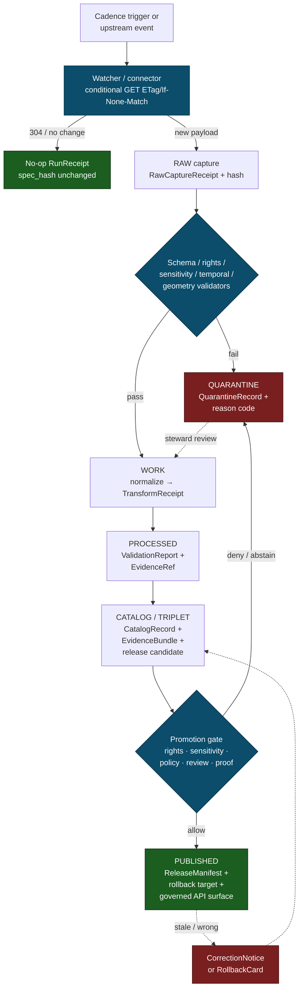

<!-- [KFM_META_BLOCK_V2]
doc_id: kfm://doc/runbook-hazards-source-refresh
title: Hazards Source Refresh Runbook
type: standard
version: v0.1
status: draft
owners: TODO — Hazards lane steward + Docs steward (NEEDS VERIFICATION)
created: 2026-05-12
updated: 2026-05-12
policy_label: public
related:
  - docs/doctrine/directory-rules.md
  - docs/doctrine/lifecycle-law.md
  - docs/doctrine/trust-membrane.md
  - docs/domains/hazards/README.md
  - docs/sources/SOURCE_DESCRIPTOR_STANDARD.md
  - docs/runbooks/governed_ai_VALIDATION.md
  - docs/adr/ADR-0001-schema-home.md
tags: [kfm, hazards, runbook, source-refresh, lifecycle, governance]
notes:
  - Path under docs/runbooks/hazards/ is PROPOSED until verified against mounted-repo convention or an ADR amending Directory Rules.
  - All path, schema, validator, route, and workflow names are PROPOSED unless tagged otherwise.
  - Doctrine (lifecycle, trust membrane, not-for-life-safety boundary, stale-state markers, supersession) is CONFIRMED from project corpus.
[/KFM_META_BLOCK_V2] -->

<a id="top"></a>

# Hazards Source Refresh Runbook

> Operational procedure for refreshing **Hazards** sources (NOAA, NWS, FEMA, USGS, NASA FIRMS, drought monitors, state emergency management) through the governed `RAW → WORK / QUARANTINE → PROCESSED → CATALOG / TRIPLET → PUBLISHED` lifecycle — without letting operational warning context become a life-safety alerting surface.


| Field | Value |
|---|---|
| **Status** | Draft |
| **Owners** | `TODO` — Hazards lane steward + Docs steward (NEEDS VERIFICATION against `CODEOWNERS`) |
| **Last updated** | 2026-05-12 |
| **Lifecycle invariant** | RAW → WORK / QUARANTINE → PROCESSED → CATALOG / TRIPLET → PUBLISHED — promotion is a **governed state transition, not a file move** |
| **Trust posture** | Cite-or-abstain; deny-by-default for sensitive / life-safety surfaces |
| **Domain boundary** | Hazards governs historical, regulatory, modeled, and operational-**context** data; it **MUST NOT** act as a life-safety alerting system |

---

## Contents

1. [Purpose & scope](#1-purpose--scope)
2. [Doctrinal preflight](#2-doctrinal-preflight)
3. [Hazards source families & source roles](#3-hazards-source-families--source-roles)
4. [Refresh flow (RAW → PUBLISHED)](#4-refresh-flow-raw--published)
5. [Per-stage procedure](#5-per-stage-procedure)
6. [Stale-state handling](#6-stale-state-handling)
7. [Quarantine handling](#7-quarantine-handling)
8. [Receipts, evidence, and audit trail](#8-receipts-evidence-and-audit-trail)
9. [Validation gates](#9-validation-gates)
10. [Promotion to PUBLISHED](#10-promotion-to-published)
11. [Correction & rollback](#11-correction--rollback)
12. [Failure modes & anti-patterns](#12-failure-modes--anti-patterns)
13. [Verification backlog](#13-verification-backlog)
14. [Related docs](#14-related-docs)
15. [Appendix A — Worked example: NWS alerts refresh](#appendix-a--worked-example-nws-alerts-refresh)

---

## 1. Purpose & scope

This runbook tells a **Hazards lane operator** (steward, on-call engineer, or release reviewer) how to drive a routine or ad-hoc refresh of a Hazards source through the KFM governed lifecycle, what proof to emit at each step, and how to decide between **publish**, **quarantine**, **stale-mark**, **abstain**, or **deny**.

**In scope.**

- Cadence-driven refresh of Hazards `SourceDescriptor`-registered sources.
- Ad-hoc re-admission after an upstream change (URL, schema, rights, terms, cadence).
- Stale-state declaration on a Hazards layer or claim when freshness expires.
- Quarantine intake, disposition, and recovery for Hazards inputs.
- Triggering correction or rollback when a refresh exposes a published-claim defect.

**Out of scope.**

- Live, operator-facing emergency alerting. KFM is **not** a life-safety system; this runbook **MUST NOT** be used to drive operational warning dispatch.
- One-time source onboarding (initial admission). That lives in `SOURCE_DESCRIPTOR_STANDARD.md` (PROPOSED) and source-intake doctrine.
- Schema, contract, or policy authoring. Those live under `contracts/`, `schemas/`, and `policy/` per Directory Rules.

> [!IMPORTANT]
> **Hazards is not a life-safety alerting system.** Operational warnings, advisories, and watches from NWS or state emergency management enter KFM as **WarningContext** / **AdvisoryContext** with strict issue/expiry handling — never as actionable instructions. The doctrinal boundary is `DOM-HAZ`: *historical, regulatory, modeled, and operational-context hazard information for analysis and resilience, while refusing to act as a life-safety alerting system.* (CONFIRMED doctrine; PROPOSED implementation.)

[⬆ Back to top](#top)

---

## 2. Doctrinal preflight

Run this checklist **before** initiating any Hazards source refresh. Stop and escalate if any item fails.

| # | Check | Where it lives | Status |
|---|---|---|---|
| 1 | A current `SourceDescriptor` exists for the source, with role, rights, sensitivity, cadence, and citation. | `data/registry/sources/hazards/` (PROPOSED) | CONFIRMED doctrine |
| 2 | Source role is recorded as one of: `authority`, `observation`, `context`, `modeled`, `synthetic`, `candidate`. Source role is **fixed at admission** and **never upgraded** by a refresh. | `SourceDescriptor` field `source_role` | CONFIRMED doctrine; PROPOSED field shape |
| 3 | Rights and terms are current; redistribution class is recorded. Unknown rights **fail closed**. | `SourceDescriptor.rights` + `policy/domains/hazards/` | CONFIRMED doctrine |
| 4 | Sensitivity tier and any locality / cultural / sovereignty constraints are recorded. | `SourceDescriptor.sensitivity` | CONFIRMED doctrine |
| 5 | Cadence (`expected_refresh_interval`) is recorded and the current request falls within or beyond it. | `SourceDescriptor.cadence` | CONFIRMED doctrine; field name PROPOSED |
| 6 | The watcher / connector is **signed** and registered; admin shortcuts are not the normal path. | `connectors/` + control-plane register | CONFIRMED doctrine |
| 7 | Public clients reach this data only through the **governed API** (`apps/governed-api/`). Browsers, MapLibre, and Focus Mode do **not** read RAW/WORK/QUARANTINE. | Trust membrane (Directory Rules §7.1) | CONFIRMED doctrine |

> [!CAUTION]
> If any preflight item is **UNKNOWN** or **NEEDS VERIFICATION**, the refresh **MUST NOT** proceed to PROCESSED. Hold in RAW / QUARANTINE, open a `docs/registers/VERIFICATION_BACKLOG.md` entry, and notify the Hazards lane steward.

[⬆ Back to top](#top)

---

## 3. Hazards source families & source roles

CONFIRMED doctrine from the Encyclopedia (§7.10) and Domains Atlas (Hazards Lane, §D): a source's *family* is its provenance origin; its *role* is its evidentiary stance inside KFM. Role determines which assertions a refresh may carry.

| Source family | Typical role(s) | Rights / sensitivity | Freshness profile |
|---|---|---|---|
| NOAA Storm Events / NCEI-style records | `observation` (historical) | Public; sensitive joins fail closed | Source-vintage; episodic refresh |
| NWS API (alerts, warnings, advisories, watches) | `context` only — **not** life-safety authority for KFM | Public; **issue/expiry mandatory** | Operational cadence; expired context **MUST NOT** appear as current |
| FEMA Disaster Declarations / OpenFEMA | `authority` (legal declaration record) | Public; NEEDS VERIFICATION of redistribution terms | Event-driven |
| FEMA NFHL / MSC flood hazard | `authority` (regulatory baseline) — **not** observed inundation or forecast | Public; NEEDS VERIFICATION | Localized, event-driven version updates (`VERSION_ID`, `EFFECTIVE_DATE`) |
| USGS Earthquake Catalog | `observation` / `authority` | Public | Near-real-time to historical |
| NOAA HMS Fire and Smoke | `observation` / `context` | Public | Daily cadence (PROPOSED) |
| NASA FIRMS active fire | `observation` | Public; geoprivacy considerations | Sub-daily cadence (PROPOSED) |
| Drought monitors | `context` / `modeled` | Public | Weekly cadence (PROPOSED) |
| State / local emergency management & resilience plans | `context` / `authority` (jurisdictional) | NEEDS VERIFICATION per source | Variable |

> [!NOTE]
> **Source-role anti-collapse rule** (CONFIRMED doctrine, `DOM-HAZ`). A refresh **MUST NOT** silently change a source's role — e.g., a `modeled` source MUST NOT be re-admitted as `observation`, even if the upstream rebrands. Role drift requires a new `SourceDescriptor` with a `superseded_by` link, not an in-place update.

[⬆ Back to top](#top)

---

## 4. Refresh flow (RAW → PUBLISHED)

PROPOSED diagram of the governed refresh path. Concrete tool names, queue topology, and worker boundaries are **NEEDS VERIFICATION** against the mounted repo; doctrine is CONFIRMED.



> [!NOTE]
> **PROPOSED diagram.** The branches, gate names, and receipt names reflect CONFIRMED doctrine from `DOM-HAZ`, the Encyclopedia Appendix E feature index, and the Domains Atlas v1.1. Specific queue, worker, validator, and route names remain **NEEDS VERIFICATION** until inspected in a mounted repo.

[⬆ Back to top](#top)

---

## 5. Per-stage procedure

Each subsection states **what the stage does**, **what it emits**, and **what blocks the next stage**. Receipt names are CONFIRMED doctrine; their schema homes are PROPOSED under `schemas/contracts/v1/receipts/` (NEEDS VERIFICATION; see ADR-0001).

### 5.1 Trigger

A refresh starts in one of three ways:

1. **Cadence trigger.** Scheduler fires per the `SourceDescriptor.cadence`.
2. **Upstream event.** Object-store event, webhook, or feed change advertised by the upstream.
3. **Operator-initiated.** Hazards lane steward re-runs a refresh manually (e.g., after a rights-status change). All operator-initiated refreshes **MUST** record actor and reason.

### 5.2 Watcher / connector fetch

The watcher performs a **conditional GET** (HTTP `ETag` / `If-None-Match`, or upstream equivalent) and records the response in a `RunReceipt`. On `304 Not Modified`, emit a **no-op `RunReceipt`** and stop — do not create new STAC / catalog entities for unchanged sources.

> [!TIP]
> The no-op receipt is doctrinally important: it proves the system *looked* and *elected not to act*. Auditors and stale-state detectors rely on it.

### 5.3 RAW capture

Store the source-native payload (or a stable byte-addressed reference) immutably, with:

- `source_id`
- `source_role` (copied from `SourceDescriptor`; never re-derived here)
- `content_hash` (e.g., SHA-256 over the byte payload)
- `retrieval_time`
- citation pointer
- `rights` and `sensitivity` snapshots

Emit a **`RawCaptureReceipt`**. **No public client may read RAW.** Egress from `data/raw/hazards/` is denied by trust-membrane policy.

### 5.4 WORK / QUARANTINE — normalize and validate

Run normalization (schema, geometry, time, identity, evidence, rights, policy). Each transform emits a **`TransformReceipt`** with `input_geom_hash`, `output_geom_hash`, parameters, and actor. Failures route to `data/quarantine/hazards/` with a **`QuarantineRecord`** that names the reason code (see §7).

### 5.5 PROCESSED

Emit validated, normalized objects (one of: `HazardEvent`, `HazardObservation`, `WarningContext`, `AdvisoryContext`, `DisasterDeclaration`, `FloodContext`, `WildfireDetection`, `SmokeContext`, `DroughtIndicator`, `EarthquakeEvent`, `HeatColdEvent`, `ExposureSummary`, `ResilienceSummary`, `HazardTimeline`, `ImpactArea`). Each object carries:

- a resolvable **`EvidenceRef`** that points at an **`EvidenceBundle`** (resolution is required before publication);
- a **`ValidationReport`** with finite outcomes;
- distinct **temporal fields** for `observed_time`, `valid_time`, `issue_time`, `expiry_time`, `source_time`, `retrieval_time`, `release_time`, and `correction_time` where material.

### 5.6 CATALOG / TRIPLET

Emit a **`CatalogRecord`** with source, schema, validation, policy, and release metadata, plus a graph / triplet projection if applicable. The catalog closure test rejects orphan artifacts (no `EvidenceBundle`, no `ValidationReport`, no `SourceDescriptor`).

### 5.7 PUBLISHED

Promotion is **governed**, not a file move. See §10.

[⬆ Back to top](#top)

---

## 6. Stale-state handling

CONFIRMED doctrine (Domains Atlas v1.1 §24.8.1): KFM separates **stale** from **wrong**. A stale claim is one whose evidence, source freshness, dependent data, or context has aged past its declared tolerance; a wrong claim is incorrect in substance. Both states have visible markers and traceable lifecycles. The stale-state markers below apply to Hazards refreshes.

| Marker | Trigger | UI signal | Required action |
|---|---|---|---|
| **Source freshness expired** | Cadence in `SourceDescriptor` passed without a new admission | Stale source badge in Evidence Drawer | Re-admit or supersede; otherwise mark dependent claims stale |
| **Schema version drift** | Object schema upgraded past the published claim's schema version | Schema-drift badge; show migration ADR | Migrate, re-validate, re-release; or mark stale |
| **Geography version drift** | `GeographyVersion` replaced; published claim still bound to the prior version | Geography-version banner with prior-version cite | Rebind to current `GeographyVersion`; re-release; or mark stale |
| **Time-scope outside support** | Claim's temporal scope falls outside current data support window | Time-out-of-support indicator | Mark stale; **do not refresh silently** |
| **Model version superseded** | `ModelRunReceipt` references an older model than current | Model-version badge with new model identity | Re-run; supersede; or mark stale |
| **Review aged out** | `ReviewRecord` older than the review-cycle tolerance for the sensitive lane | Review-aged badge | Trigger steward review; potentially downgrade tier |
| **Rights status changed** | Rights change in `SourceDescriptor` or rights-holder communication | Rights-changed badge | Re-evaluate tier; potentially downgrade; emit `CorrectionNotice` if necessary |
| **Policy version changed** | Policy referenced by `PolicyDecision` was superseded | Policy-version badge | Re-run gate; potentially supersede release |

> [!WARNING]
> **Operational-warning expiry is doctrinally absolute.** For Hazards, `WarningContext` and `AdvisoryContext` carry mandatory `issue_time` / `expiry_time` fields. An expired warning **MUST NOT** appear as a current warning state in any released layer, popup, or Evidence Drawer payload. (`DOM-HAZ`, CONFIRMED.)

[⬆ Back to top](#top)

---

## 7. Quarantine handling

CONFIRMED doctrine: **quarantine is not a publishable staging area.** A `QuarantineRecord` holds failed, sensitive, rights-unknown, or malformed inputs until disposition.

Typical Hazards quarantine reasons (PROPOSED reason-code list; align with `policy/domains/hazards/` once mounted):

- `schema_invalid` — payload fails the shape contract.
- `rights_unknown` — license, redistribution class, or attribution missing.
- `source_role_ambiguous` — upstream rebranding or unclear evidentiary stance.
- `sensitive_geometry` — locality, cultural, or sovereignty constraint triggered.
- `expired_operational_context` — warning/advisory past `expiry_time` at retrieval.
- `temporal_role_collapse` — observed/issued/valid/retrieved times collapsed in upstream.
- `geometry_invalid` — topology, CRS, or coordinate-range failure.
- `evidence_unresolved` — `EvidenceRef` cannot resolve to an `EvidenceBundle`.
- `policy_deny` — admissibility gate denied the input.

**Recovery path.** A quarantined input may re-enter WORK only after:

1. The blocking condition is documented and resolved (rights letter, schema migration, redaction receipt, etc.).
2. A steward records a `ReviewRecord` authorizing re-entry.
3. The original `QuarantineRecord` is retained for audit; a forward link records the disposition.

[⬆ Back to top](#top)

---

## 8. Receipts, evidence, and audit trail

CONFIRMED doctrine: a refresh's audit trail is the union of its receipts. If no receipt exists, the operation did not happen in the governed sense.

<details>
<summary><strong>Hazards-refresh receipt families (CONFIRMED doctrine; PROPOSED schema home under <code>schemas/contracts/v1/receipts/</code>)</strong></summary>

| Receipt | Purpose | Triggered by |
|---|---|---|
| `SourceDescriptor` | Anchors source identity, rights, role, sensitivity, cadence at admission | Source admission (one per source; superseded on change) |
| `RawCaptureReceipt` | Records the immutable RAW capture (payload reference + hash + time) | Watcher fetch with new payload |
| `TransformReceipt` | Records a spatial / attribute transform (reprojection, generalization, snap, simplification) | Normalization steps |
| `ValidationReport` | Records the finite outcome of schema / geometry / temporal / rights / sensitivity / evidence checks | WORK and PROCESSED gates |
| `RunReceipt` | Records pipeline run, inputs, outputs, `spec_hash`, timestamp, operator, result | Every governed run, including no-op |
| `RedactionReceipt` | Records a public-safe transformation (mask, fuzz, withhold) for sensitivity or rights | Sensitive-lane publication |
| `QuarantineRecord` | Records reason and disposition for held inputs | Validator / policy denial |
| `EvidenceRef` → `EvidenceBundle` | Stable reference from a claim to its evidence; bundle returns sources, excerpts, provenance, policy / review / release state | Every published claim |
| `PolicyDecision` | ALLOW / DENY / RESTRICT / ABSTAIN / ERROR with rule IDs and reasons | Every gate |
| `PromotionDecision` | Gate results, materiality, review state, attestations, release / rollback targets | Promotion gate |
| `ReleaseManifest` | Binds the published artifact set with rollback target and cache-invalidation record | Promotion → PUBLISHED |
| `CorrectionNotice` | Records a substantive correction to a published claim and lists invalidated derivatives | Wrong-state path |
| `RollbackCard` | Records a reversal anchor: prior manifest, artifact digests, cache invalidation, replay steps | Pre-publication or post-publication rollback |
| `ReviewRecord` | Steward / reviewer disposition; required for sensitive lanes | Review queue |
| `AIReceipt` | Provider, model, context, config, prompt class, evidence refs, output digest, citation report — **never** chain-of-thought | Any AI-assisted summarization over Hazards EvidenceBundles |

</details>

> [!NOTE]
> **Conditional-GET receipts matter.** Every conditional fetch — including `304 Not Modified` outcomes — **MUST** emit a `RunReceipt`. Silent no-ops break audit chains and confuse stale-state detection.

[⬆ Back to top](#top)

---

## 9. Validation gates

PROPOSED test families derived from `DOM-HAZ` validator list and the Encyclopedia §K. Specific validator names, file paths, and CI job IDs are **NEEDS VERIFICATION** in a mounted repo.

| Gate | What it proves | Default on failure |
|---|---|---|
| Schema validation | `SourceDescriptor`, normalized object, `LayerManifest`, `EvidenceBundle`, and receipt families all match `schemas/contracts/v1/...` shapes | DENY before promotion |
| Source-role anti-collapse | Role at PROCESSED matches role at admission; no upgrade through promotion | DENY |
| Rights & terms | Current redistribution class and attribution are recorded; unknown rights fail closed | DENY public; allow restricted with `ReviewRecord` |
| Sensitivity / geoprivacy | Locality, cultural, sovereignty constraints honored; sensitive geometry generalized or denied before public tile production | DENY public; emit `RedactionReceipt` for restricted release |
| Temporal-role | `observed`, `issued`, `valid`, `source`, `retrieval`, `release`, and `correction` times stay distinct where material | DENY |
| Operational expiry / freshness | `WarningContext` / `AdvisoryContext` `expiry_time` not passed at release time | DENY public; mark stale |
| Geometry validity | Topology, CRS, coordinate range pass | Quarantine; emit `GeometryRepairReport` if a repair is attempted |
| Evidence closure | Every claim's `EvidenceRef` resolves to an `EvidenceBundle` | ABSTAIN on the claim; do not publish |
| Citation validation | Evidence Drawer payloads carry resolvable citations; Focus Mode answers are cited or abstain | ABSTAIN |
| Emergency-alert denial | KFM is not invoked as an emergency-alerting authority | DENY |
| Catalog closure | Published dataset / layer has source, schema, validation, policy, release metadata | DENY promotion |
| UI no-direct-source | Public clients route through `apps/governed-api/`, never to `data/raw|work|quarantine` or upstream APIs | DENY route at trust-membrane test |

[⬆ Back to top](#top)

---

## 10. Promotion to PUBLISHED

Promotion is a **governed state transition**, not a file move. A Hazards release candidate becomes PUBLISHED only when:

1. **Catalog closure passes.** Every published dataset / layer has its source, schema, validation, policy, and release metadata.
2. **EvidenceRef → EvidenceBundle resolves** for every claim a public surface might expose.
3. **Policy gate ALLOWs.** No outstanding DENY or unresolved ABSTAIN on rights, sensitivity, operational expiry, or review state.
4. **Review state is current.** For sensitive lanes, separation of duties applies: the release authority **MUST** be distinct from the author / promoter.
5. **`ReleaseManifest` is signed**, carries a **rollback target**, and is bound to a **cache-invalidation record**.
6. **Trust-membrane tests pass.** No public client can reach RAW, WORK, QUARANTINE, canonical stores, vector indexes, or upstream APIs.

> [!IMPORTANT]
> **Watcher-as-non-publisher invariant** (CONFIRMED doctrine, Directory Rules §13.5). Workers and connectors emit **receipts and candidate decisions only.** They do **not** write to `data/catalog/` or `data/published/`. The publication boundary is a separate governed step.

[⬆ Back to top](#top)

---

## 11. Correction & rollback

When a refresh exposes a defect in a previously-published Hazards claim:

1. **Decide stale vs wrong.** A *stale* claim is aged-out evidence; a *wrong* claim is substantively incorrect. (Atlas v1.1 §24.8.) Stale-marking is not a correction.
2. **Emit a `CorrectionNotice`** for wrong claims. The notice **MUST** list invalidated derivatives (tiles, exports, Story Nodes, AI summaries) so downstream caches and `EvidenceBundles` can be re-resolved.
3. **Emit a `RollbackCard`** if the wrong claim must be withdrawn rather than replaced. The card pins the prior `ReleaseManifest`, artifact digests, cache state, and replay steps.
4. **Run the rollback drill.** A rollback receipt confirms the prior manifest is restored and caches are invalidated.
5. **AIReceipts are never superseded retroactively.** An updated answer is a **new** `AIReceipt` with a cross-reference to the old one.

[⬆ Back to top](#top)

---

## 12. Failure modes & anti-patterns

CONFIRMED anti-patterns from Domains Atlas v1.1 §24.9.2 and Directory Rules §13.5, narrowed to Hazards-refresh contexts.

| Anti-pattern | Why it fails | DENY surface |
|---|---|---|
| KFM cited as an emergency-alert authority | Out-of-scope use of governed evidence as life-safety guidance | Hazards governed API; Evidence Drawer disclaimer |
| Expired warning surfaced as current warning state | `expiry_time` ignored; operational-context boundary violated | `WarningContext` validator |
| Public route reads `data/raw` or `data/quarantine` directly | Trust membrane bypassed; promotion gates skipped | Governed API; layer-manifest resolver |
| Watcher writes to `data/published/` | Watcher-as-non-publisher invariant violated | Promotion gate |
| Source role upgraded by refresh (e.g., `modeled` → `observation`) | Source-role anti-collapse rule broken | Source-role validator |
| Quarantine treated as staging area | Quarantine is not publishable; review must clear it first | Promotion gate |
| Sensitive geometry hidden only by style filter on the renderer | Renderer is not a governance surface | Tile build; sensitivity validator |
| Refresh skips a lifecycle phase (e.g., RAW → PUBLISHED directly) | Lifecycle invariant violated | Catalog closure |
| AI answer published without resolvable citations | Cite-or-abstain rule broken; AI becomes its own truth source | Citation validator; Focus Mode |
| Promotion auto-approved by the author | Separation of duties violated on a sensitive lane | Promotion gate |

[⬆ Back to top](#top)

---

## 13. Verification backlog

Items to verify against a mounted repo before this runbook can move from `draft` to `published`. Each is **NEEDS VERIFICATION** in this session.

- Path of this runbook (`docs/runbooks/hazards/` subfolder vs flat `docs/runbooks/hazards_SOURCE_REFRESH.md`). Existing PROPOSED examples in the Whole-UI Expansion Report use flat subsystem-prefixed naming (`docs/runbooks/ui_LOCAL_DEV.md`), while Domain Placement Law (Directory Rules §12) supports domain-segmented subfolders inside responsibility roots. **An ADR or a mounted-repo convention should settle this.**
- Owner names in the meta block and the Status table.
- Whether `connectors/hazards/` exists and the exact watcher schema fields used.
- Whether `data/registry/sources/hazards/` is the canonical source-descriptor home (alt: `data/registry/sources/` flat).
- Whether `schemas/contracts/v1/receipts/` is the canonical receipt-schema home, or whether ADR-S-03 (Atlas v1.1 §24.12) has been accepted to split receipts under `schemas/contracts/v1/<domain>/receipts/`.
- Concrete validator file names, CI job names, and OPA / policy-engine identifiers for each gate in §9.
- The release / promotion app or workflow that executes §10 (e.g., `apps/cli/`, `apps/workers/`, GitHub Actions name).
- Cadence values per source (NOAA Storm Events, NWS API, FEMA, USGS, NASA FIRMS, drought monitors).
- The rollback-drill schedule for Hazards releases.
- The mounted-repo `docs/runbooks/` README, if any, governing runbook structure.

> [!TIP]
> Open backlog items in `docs/registers/VERIFICATION_BACKLOG.md` rather than smoothing them over in this runbook.

[⬆ Back to top](#top)

---

## 14. Related docs

| Doc | Role | Status |
|---|---|---|
| `docs/doctrine/directory-rules.md` | Placement law for every file referenced here | CONFIRMED (this session) |
| `docs/doctrine/lifecycle-law.md` | RAW → PUBLISHED invariant | PROPOSED home; doctrine CONFIRMED |
| `docs/doctrine/trust-membrane.md` | Public-client boundaries; deny-by-default | PROPOSED home; doctrine CONFIRMED |
| `docs/domains/hazards/README.md` | Hazards domain README (mission, boundaries, source families) | PROPOSED |
| `docs/sources/SOURCE_DESCRIPTOR_STANDARD.md` | One-time source onboarding and descriptor shape | PROPOSED |
| `docs/runbooks/governed_ai_VALIDATION.md` | Focus Mode evidence / citation / policy validation runbook | PROPOSED |
| `docs/runbooks/ui_ROLLBACK.md` | UI rollback, feature flag, schema deprecation | PROPOSED |
| `docs/adr/ADR-0001-schema-home.md` | Schema-home convention (`schemas/contracts/v1/...`) | PROPOSED home; convention CONFIRMED |
| `docs/registers/DRIFT_REGISTER.md` | Where to record repo-vs-doctrine conflicts | PROPOSED home |
| `docs/registers/VERIFICATION_BACKLOG.md` | Where to log items from §13 | PROPOSED home |
| `control_plane/source_authority_register.yaml` | Machine-readable source authority register | PROPOSED |

[⬆ Back to top](#top)

---

## Appendix A — Worked example: NWS alerts refresh

PROPOSED illustrative example. Treat values as placeholders; real values are NEEDS VERIFICATION against a mounted source registry and connector implementation.

<details>
<summary><strong>Step-by-step: refreshing an <code>NWS alerts</code> feed into <code>WarningContext</code></strong></summary>

**Source.** `EXT-NWS` — NWS API, official forecast / alert / observation context. Role: `context` (KFM is **not** a forecasting or emergency-alerting authority).

**Cadence.** Sub-hourly (PROPOSED). Operator-initiated refresh is allowed on a documented reason.

**1. Preflight.**

- `SourceDescriptor` for `EXT-NWS` is current, signed, and registered in the source authority register.
- Source role is `context`. Rights are public (NEEDS VERIFICATION of current terms).
- Sensitivity tier is the Hazards lane default; locality constraints do not apply.

**2. Watcher fetch.**

```text
GET /alerts/active?area=KS
If-None-Match: "<prior_etag>"
```

- `304 Not Modified` → emit `RunReceipt{spec_hash=unchanged, outcome=no-op}` and stop.
- `200 OK` → proceed to RAW capture with new payload.

**3. RAW capture.**

```text
data/raw/hazards/nws/alerts/active/<retrieval_ts>.json   (PROPOSED path)
RawCaptureReceipt{
  source_id: "EXT-NWS",
  source_role: "context",
  content_hash: "sha256:<...>",
  retrieval_time: "<iso8601>",
  rights_snapshot: "<...>",
  citation: "<...>"
}
```

**4. Normalize + validate.**

- Schema-shape the alert envelope to `WarningContext` and `AdvisoryContext` objects.
- Enforce **issue/expiry**: any alert past `expiry_time` at retrieval routes to QUARANTINE with reason `expired_operational_context`. (CONFIRMED doctrine, `DOM-HAZ`.)
- Run temporal-role checks: `issued`, `valid_from`, `valid_to`, `source_time`, `retrieval_time` must stay distinct.
- Run geometry validators.
- Emit `TransformReceipt` and `ValidationReport`.

**5. PROCESSED.**

Emit one `WarningContext` or `AdvisoryContext` object per active alert with a resolvable `EvidenceRef`, a `ValidationReport`, and a `not-for-life-safety` disclaimer flag set.

**6. CATALOG / TRIPLET.**

Add a `CatalogRecord`; project relevant triples into the graph (e.g., `WarningContext --affects--> County`).

**7. Promotion.**

- Policy gate: ALLOW only if all alerts have non-expired `expiry_time` at release time *or* are explicitly marked historical-context.
- `ReleaseManifest` is signed and carries the prior manifest as `rollback_target`.
- Cache invalidation record names the affected layers.

**8. Stale handling at runtime.**

- The Evidence Drawer shows the stale-source badge when the `SourceDescriptor` cadence elapses without a new admission.
- The not-for-life-safety disclaimer is **never suppressed**, even on a fresh refresh.

</details>

[⬆ Back to top](#top)

---

## Footer

> This runbook is governed by the KFM lifecycle law (`RAW → WORK / QUARANTINE → PROCESSED → CATALOG / TRIPLET → PUBLISHED`) and the trust-membrane rule (public clients use `apps/governed-api/` only). It is **doctrine-grounded** but **implementation-PROPOSED**. Mounted-repo evidence is required to convert the PROPOSED elements (paths, validator names, schema homes, owners, cadences) into CONFIRMED ones.

**Related docs:** [Directory Rules](../../doctrine/directory-rules.md) · [Lifecycle Law](../../doctrine/lifecycle-law.md) · [Trust Membrane](../../doctrine/trust-membrane.md) · [Hazards domain README](../../domains/hazards/README.md) · [Governed-AI Validation](../governed_ai_VALIDATION.md)

**Last updated:** 2026-05-12 · **Status:** draft · **Owners:** TODO (NEEDS VERIFICATION) · [⬆ Back to top](#top)
