# 🌊 Hydrology · No-Network Test Runbook

> **Operating procedure for executing KFM's deterministic, offline test pyramid for the Hydrology lane — no live USGS / WBD / NHDPlus / NFHL endpoints, no network egress, fail-closed by design.**

[](#) [](#) [](#) [](#) [](#) [](#)

| Field | Value |
|---|---|
| **Status** | `draft` |
| **Owners** | Hydrology lane steward · QA steward · Docs steward _(placeholder until repo `CODEOWNERS` is verified)_ |
| **Doc type** | Operations runbook (no-network test execution) |
| **Last updated** | `YYYY-MM-DD` — set on merge |
| **Audience** | Lane stewards, QA, validator authors, CI maintainers, reviewers |
| **Proposed path** | `docs/runbooks/hydrology/NO_NETWORK_TEST_RUNBOOK.md` _(PROPOSED — see §13 for path convention note)_ |

<!-- [KFM_META_BLOCK_V2]
doc_id: kfm://doc/runbook/hydrology/no-network-test
title: Hydrology · No-Network Test Runbook
type: standard
version: v1
status: draft
owners: hydrology-lane-steward, qa-steward, docs-steward
created: 2026-05-12
updated: 2026-05-12
policy_label: public
related:
  - kfm://doctrine/directory-rules
  - kfm://doctrine/lifecycle-law
  - kfm://doctrine/truth-posture
  - kfm://domain/hydrology
  - kfm://runbook/ui_validation
  - kfm://runbook/governed_ai_validation
  - kfm://adr/ADR-0001-schema-home
tags: [kfm, hydrology, runbook, testing, no-network, fixtures, proof-lane]
notes:
  - "Runbook lives under docs/runbooks/. Subdirectory `hydrology/` is PROPOSED; flat-named alternative `docs/runbooks/hydrology_NO_NETWORK_TEST.md` is also consistent with prior runbook drafts."
  - "All command paths and CI references are PROPOSED until a mounted repo confirms them."
[/KFM_META_BLOCK_V2] -->

---

## 🧭 Quick Jump

- [1 · Purpose & Scope](#1--purpose--scope)
- [2 · Doctrinal Basis](#2--doctrinal-basis)
- [3 · Test-Surface Overview](#3--test-surface-overview)
- [4 · Preconditions](#4--preconditions)
- [5 · Fixture Inventory](#5--fixture-inventory)
- [6 · The No-Network Test Pyramid](#6--the-no-network-test-pyramid)
- [7 · Execution Procedure](#7--execution-procedure)
- [8 · Expected Outcomes & Decision Envelope](#8--expected-outcomes--decision-envelope)
- [9 · Negative-Test Catalog](#9--negative-test-catalog)
- [10 · CI Integration](#10--ci-integration)
- [11 · Failure Handling & Rollback](#11--failure-handling--rollback)
- [12 · Verification Backlog](#12--verification-backlog)
- [13 · Related Docs](#13--related-docs)
- [14 · Appendix · Reference Commands](#14--appendix--reference-commands)

---

## 1 · Purpose & Scope

This runbook governs **how to execute, interpret, and gate KFM's no-network test pyramid for the Hydrology lane**. It exists because Hydrology is the **CONFIRMED early proof lane** for KFM — the first domain where the trust spine (source descriptor → evidence resolution → policy decision → release manifest → rollback target) must run end-to-end without invoking a single live external endpoint.

**In scope**

- Deterministic, offline execution of the hydrology fixture suite.
- Fixture inventory and outcome expectations for the Kansas HUC12 thin slice.
- Pyramid ordering (schemas → contracts → validators → policy negative tests → evidence resolution → finite envelopes).
- Failure handling, ABSTAIN/DENY semantics, and rollback posture.
- Local-run and CI-run procedure.

**Out of scope**

- Live USGS / WBD / NHDPlus HR / NFHL / 3DEP fetches. _(Those belong to source-activated, opt-in jobs governed by `SourceActivationDecision`.)_
- Emergency-alert behavior. **Hydrology is not a life-safety surface.** NFHL is regulatory context; it is **never** observed inundation. _CONFIRMED doctrine._
- UI rendering of layers in `apps/explorer-web` _(see the UI validation runbook)._
- Governed-AI Focus Mode validation _(see the governed-AI validation runbook)._

> [!IMPORTANT]
> **No-network means no network.** If a test reaches DNS, an external API, an IP address, an unverified registry, or any non-fixture I/O, the suite has failed its first invariant — regardless of any green check downstream. CI must enforce egress denial; local runs should set `KFM_NO_NETWORK=1` and verify egress is blocked before relying on a passing result.

[↑ Back to top](#-hydrology--no-network-test-runbook)

---

## 2 · Doctrinal Basis

The no-network proof lane is not a stylistic choice. It is a direct consequence of KFM's lifecycle law, truth posture, and trust-membrane doctrine.

| Doctrine | What it requires here | Status |
|---|---|---|
| **Lifecycle invariant** — `RAW → WORK / QUARANTINE → PROCESSED → CATALOG / TRIPLET → PUBLISHED` | Fixtures simulate **every** stage offline. Promotion remains a governed state transition, not a file move. | CONFIRMED doctrine / PROPOSED implementation |
| **Trust membrane** — public clients consume governed APIs and released artifacts only | No test may bind a public surface to `data/raw`, `data/work`, `data/quarantine`, internal stores, or live model clients. | CONFIRMED doctrine |
| **Cite-or-abstain** | Any test asserting a hydrology answer must either resolve an `EvidenceBundle` or assert `ABSTAIN`. | CONFIRMED doctrine |
| **Hydrology as early proof lane** | Hydrology is the safest first proof-bearing slice: public-suitable when released, but with non-trivial source-role separation (USGS observations vs NFHL regulatory vs forecasts vs alerts). | CONFIRMED doctrine |
| **First implementation package is fixture-first and no-network** | HUC/WBD fixture, identity crosswalk fixture, observation normalization fixture, EvidenceBundle closure, catalog/proof closure, public-safe layer output — all offline. | CONFIRMED doctrine / PROPOSED implementation |
| **Deterministic identity via `spec_hash`** | Bundle and reference IDs derive from canonical JSON (sorted keys, no whitespace variance) hashed with SHA-256. Same evidence ⇒ same `spec_hash` across environments. | PROPOSED (v1 draft per project notes) |
| **Deny-by-default emergency posture** | KFM never publishes itself as life-safety authority. NFHL is regulatory context only. | CONFIRMED doctrine |

> [!NOTE]
> Project doctrine ranks Hydrology, Soil + Habitat/Fauna, and MapLibre UI as the typical first three proof phases. This runbook addresses **Phase 1: Hydrology proof lane**. Adjacent runbooks for soil/fauna and the UI shell will follow the same pyramid.

[↑ Back to top](#-hydrology--no-network-test-runbook)

---

## 3 · Test-Surface Overview

The no-network suite walks a controlled record from intake through release-candidate state without touching the publication path. The diagram below shows responsibility boundaries, not file paths.

```mermaid
flowchart LR
  subgraph FIX["Fixtures (no network)"]
    RAWFIX["RAW fixture<br/>SourceDescriptor + payload ref"]
    WBDFIX["WBD/HUC12 fixture"]
    NHDFIX["NHDPlus crosswalk fixture"]
    GAUGEFIX["USGS gauge fixture"]
    NFHLFIX["NFHL regulatory fixture"]
  end

  subgraph VAL["Validators"]
    SCHEMA["Schema validators"]
    GEOM["Geometry / topology"]
    ROLE["Source-role separation"]
    ID["Identity / spec_hash"]
    EVD["Evidence closure"]
  end

  subgraph GATE["Policy gates"]
    RIGHTS["Rights gate"]
    SENS["Sensitivity gate"]
    REL["Release gate"]
  end

  subgraph OUT["Governed envelopes"]
    ENV["RuntimeResponseEnvelope<br/>ANSWER / ABSTAIN / DENY / ERROR"]
    REC["RunReceipt / AIReceipt"]
    RM["ReleaseManifest (dry-run)"]
    RB["RollbackCard"]
  end

  FIX --> VAL --> GATE --> OUT
  classDef forbid fill:#fdd,stroke:#900,color:#900;
  classDef ok fill:#dfd,stroke:#080,color:#060;
  class FIX,VAL,GATE,OUT ok
```



> [!CAUTION]
> The diagram is a **responsibility map**. It does not assert that these modules, files, or routes exist in the current repo. All path-shaped claims in this runbook are marked **PROPOSED** until verified against a mounted checkout.

[↑ Back to top](#-hydrology--no-network-test-runbook)

---

## 4 · Preconditions

Before running the suite locally or in CI:

1. **Repository checkout** of a known commit / branch. Record the SHA in the run notes.
2. **Toolchain installed** at pinned versions. Pin set is **PROPOSED** until lockfiles are inspected — see §12.
3. **No network egress** for the runner. Locally, set `KFM_NO_NETWORK=1` and confirm with the egress probe in §14. In CI, the workflow must run with network disabled or behind a deny-all egress policy.
4. **No secrets required.** The no-network suite must not require API keys, signing keys, or credentials of any kind. If a test asks for one, it is the wrong layer — promote it to the source-activated suite.
5. **Fixtures present and read-only.** The suite never mutates fixtures; any test that does so is broken.
6. **Time deterministic.** Tests requiring timestamps use fixture-provided `observed_time`, `valid_time`, `source_time`, `retrieval_time`, `release_time`, `correction_time` — never `now()`.

> [!TIP]
> If a developer is unsure whether their change touches network behavior, run with `KFM_NO_NETWORK=1` **first**. A test that depends on live data will fail noisily and clearly — which is the desired outcome.

[↑ Back to top](#-hydrology--no-network-test-runbook)

---

## 5 · Fixture Inventory

The Hydrology lane's thin-slice plan (per `kfm_encyclopedia.pdf` §5 and §7.2) is:

> **Kansas HUC12 + one USGS gauge fixture + one NHDPlus identity crosswalk + NFHL contextual overlay + hydrograph panel + EvidenceBundle closure + ABSTAIN on ambiguous reach identity.** _CONFIRMED doctrine._

The fixture inventory implements that plan. All paths below are **PROPOSED** until verified against a mounted repo.

| Fixture family | Purpose | Variants needed | Proposed home |
|---|---|---|---|
| `SourceDescriptor` | Identity, role, rights, sensitivity, cadence per source. | `valid`, `invalid_missing_rights`, `invalid_role_misuse`, `denied_unactivated` | `fixtures/domains/hydrology/source/` |
| `HUC12 (WBD)` | One Kansas HUC12 polygon with metadata + geometry fingerprint. | `valid`, `invalid_topology`, `stale_snapshot` | `fixtures/domains/hydrology/huc12/` |
| `NHDPlus identity crosswalk` | One COMID ↔ HUC12 row with `decision_reason` and `alignment_score`. | `valid_official`, `valid_overlay`, `invalid_low_alignment`, `ambiguous_multi_huc` | `fixtures/domains/hydrology/crosswalk/` |
| `GaugeSite + FlowObservation` | One USGS gauge with one flow record. | `valid_provisional`, `valid_final`, `invalid_unit`, `invalid_qualifier` | `fixtures/domains/hydrology/gauge/` |
| `NFHL contextual overlay` | One NFHLZone polygon, regulatory-only. | `valid_regulatory`, `denied_as_observed_flood` | `fixtures/domains/hydrology/nfhl/` |
| `EvidenceBundle` | Closure object resolving the above. | `valid_closed`, `invalid_missing_bundle`, `invalid_hash_mismatch` | `fixtures/domains/hydrology/evidence/` |
| `PolicyDecision` | Rights / sensitivity / release outcomes. | `allow`, `deny_rights_unknown`, `deny_emergency_misuse`, `hold_pending_review` | `fixtures/domains/hydrology/policy/` |
| `RuntimeResponseEnvelope` | Finite-outcome wrapper for governed API. | `answer`, `abstain_ambiguous_reach`, `deny_emergency`, `error_malformed` | `fixtures/domains/hydrology/runtime/` |
| `ReleaseManifest` (dry-run) | Public-safe release candidate. | `valid_dry_run`, `invalid_missing_rollback`, `invalid_missing_correction_path` | `fixtures/domains/hydrology/release/` |
| `RollbackCard` | Pointer to prior release for revert. | `valid` | `fixtures/domains/hydrology/release/` |

<details>
<summary><strong>Fixture authoring rules (click to expand)</strong></summary>

The KFM unified manual states: _every major object family should have at least one valid fixture, one invalid fixture, one denied fixture, one abstention fixture, and one rollback or correction fixture._ Apply that rule to each row above; the variants listed are the minimum, not the maximum.

Additional rules:

- **Public-safe only.** No real exact gauge coordinates for sensitive sites; no living-person data; no critical-infrastructure exposure detail. Use Kansas public hydrography where rights are unambiguous.
- **Canonical JSON.** Sorted keys, UTF-8, compact separators, normalized floats. This is what makes `spec_hash` stable across machines.
- **Time fields distinct.** `observed_time`, `valid_time`, `source_time`, `retrieval_time`, `release_time`, `correction_time` are never collapsed even when they happen to coincide.
- **Source-role explicit.** A USGS observation is not an NFHL regulatory record. A regulatory record is not observed inundation. A forecast is not an alert. Each fixture states its role in the `SourceDescriptor`.
- **No silent reuse.** If two fixtures share a `spec_hash`, they share an identity. Reuse is allowed; silent reuse with diverging meaning is not.

</details>

[↑ Back to top](#-hydrology--no-network-test-runbook)

---

## 6 · The No-Network Test Pyramid

The KFM testing strategy specifies an explicit ordering: _start with deterministic no-network fixture tests, then schema and contract tests, validator unit tests, policy negative tests, evidence-resolution tests, lifecycle-state tests, receipt/proof tests, release-manifest tests, governed API envelope tests, UI trust-state tests, and only later live-source or runtime tests._ _CONFIRMED doctrine._

| # | Layer | What it proves | Default outcome on failure |
|---|---|---|---|
| 1 | **Path / drift scan** | Files live in the responsibility roots Directory Rules requires. | Fail CI; no merge. |
| 2 | **Schema validators** | Required fields, versions, enums match `schemas/contracts/v1/...`. | Fail; surface field list. |
| 3 | **Contract tests** | Object _meaning_ matches the vocabulary in `contracts/`. | Fail; surface contract id. |
| 4 | **Geometry / topology** | Geometry is valid; fingerprints are stable; polygon rings close. | Fail; surface offending feature id. |
| 5 | **Source-role separation** | NFHL ≠ observed flood; forecast ≠ alert; community-science ≠ regulatory authority. | DENY in policy layer. |
| 6 | **Identity / `spec_hash`** | Canonical JSON, deterministic hashing, ID derivation parity. | ERROR with `NormalizationError`. |
| 7 | **Evidence closure** | `EvidenceRef.spec_hash` → catalog lookup → `EvidenceBundle.spec_hash` match → recomputed `bundle_id` equals stored id. | ABSTAIN on miss; DENY on mismatch. |
| 8 | **Policy negative suite** | Unknown rights, unclear sensitivity, unactivated source, emergency misuse — all DENY with explicit reason codes. | DENY; reason code required. |
| 9 | **Finite-envelope tests** | `RuntimeResponseEnvelope` returns one of `ANSWER / ABSTAIN / DENY / ERROR` — never silently `null`, never an unstructured 200. | ERROR with diagnostic. |
| 10 | **Release-manifest dry-run** | Manifest carries proof refs, correction path, rollback target. | HOLD or DENY; never auto-publish. |
| 11 | **Rollback drill** | RollbackCard resolves to a prior release; revert is reachable from fixtures alone. | Fail; surface unreachable rollback. |

> [!NOTE]
> Layers 1–11 run **in order**. Earlier layers gate later ones: a schema-broken fixture should never be evaluated by the policy suite — fix the schema first. CI should respect this so failures are localized and readable.

[↑ Back to top](#-hydrology--no-network-test-runbook)

---

## 7 · Execution Procedure

The following procedure assumes a clean checkout and the preconditions in §4. All commands are **PROPOSED** — adapt to the actual tooling once verified against a mounted repo.

### 7.1 Local run

```bash
# 1. Confirm no-network posture (egress should be blocked or absent).
export KFM_NO_NETWORK=1

# 2. (PROPOSED) Install pinned toolchain. Replace with verified package manager.
#    e.g., poetry install --no-interaction
#         pnpm install --frozen-lockfile
#         pip install -r requirements.txt

# 3. (PROPOSED) Run the path / drift scan.
#    e.g., python tools/checks/path_role_scan.py --root .

# 4. (PROPOSED) Run schema + contract suites.
#    e.g., pytest tests/contracts tests/schemas -k hydrology

# 5. (PROPOSED) Run validators (geometry, role, identity, evidence closure).
#    e.g., pytest tests/validators -k hydrology

# 6. (PROPOSED) Run policy negative suite.
#    e.g., conftest test -p policy/domains/hydrology fixtures/domains/hydrology

# 7. (PROPOSED) Run finite-envelope suite.
#    e.g., pytest tests/runtime_proof -k hydrology

# 8. (PROPOSED) Run release dry-run + rollback drill.
#    e.g., pytest tests/release -k hydrology
```

> [!WARNING]
> The exact command names, package manager, test commands, schema home, and policy engine all remain **UNKNOWN / NEEDS VERIFICATION** until the repo is mounted. The commands above show shape and order, not verified syntax. Adapt before pasting.

### 7.2 Step-by-step interpretation

1. **Path / drift scan.** If a hydrology file lives outside its responsibility root (e.g., a schema under `jsonschema/` instead of `schemas/contracts/v1/`), this layer flags it. Open a drift entry in `docs/registers/DRIFT_REGISTER.md` per Directory Rules §2.5; do not silently move the file.
2. **Schema + contract.** A failure here usually means a fixture was edited without rebuilding its `spec_hash` or a contract field was renamed without a migration note. Fix the fixture or the contract, not the test.
3. **Validators.** Geometry topology, source-role separation, and identity (`spec_hash`) faults appear here. Geometry fixes belong to fixture authors; role faults usually mean a `SourceDescriptor` claims an authority it does not have.
4. **Policy negative suite.** Every DENY must carry a reason code. A passing-when-it-should-deny case is a doctrine violation, not a test bug — treat it as a P0.
5. **Evidence closure.** Missing bundle → `ABSTAIN`. Hash mismatch → `DENY`. Inconsistent serialization → `ERROR`. These are not interchangeable; the wrong outcome on the wrong condition is itself a failure.
6. **Finite-envelope tests.** Any envelope that escapes the four-outcome contract is a bug. Silent `null`, unstructured 200, untyped 500 — all forbidden.
7. **Release dry-run + rollback.** Release-manifest fixtures must reference a `RollbackCard`. If the drill cannot revert from fixtures alone, the lane is not ready for any public-facing slice.

[↑ Back to top](#-hydrology--no-network-test-runbook)

---

## 8 · Expected Outcomes & Decision Envelope

Every governed surface in KFM returns a finite outcome. The hydrology no-network suite asserts the right outcome for the right input. _CONFIRMED doctrine; PROPOSED route surfaces._

| Test input | Expected outcome | Required artifact | Notes |
|---|---|---|---|
| Valid Kansas HUC12 + matched NHDPlus + matched gauge + closed EvidenceBundle | `ANSWER` | `EvidenceBundle` resolved; `PolicyDecision = allow`; dry-run `ReleaseManifest` applies. | The happy path. |
| Ambiguous reach identity (multiple candidate COMIDs / HUC12s) | `ABSTAIN` | `AIReceipt` with reason; no hydrology claim emitted. | Per thin-slice doctrine: _ABSTAIN on ambiguous reach identity._ |
| Missing `EvidenceBundle` for a referenced `EvidenceRef` | `ABSTAIN` (validator) → `DENY` (policy at publication) | `ResolutionError.missing_bundle`. | Two-stage: validator abstains; policy denies promotion. |
| `EvidenceRef.spec_hash` ≠ `EvidenceBundle.spec_hash` | `DENY` | `ResolutionError.hash_mismatch`. | Identity drift is never silently reconciled. |
| Source role misuse: NFHL fixture asserted as **observed inundation** | `DENY` | `PolicyDecision = deny` with role-misuse reason code. | NFHL is regulatory context. Always. |
| Request for KFM-as-emergency-authority | `DENY` | `PolicyDecision = deny` with `emergency_misuse` reason. | KFM is not a life-safety surface. |
| Unknown rights status on a SourceDescriptor | `DENY` | `PolicyDecision = deny` with `rights_unknown`. | Deny-by-default. |
| Stale source snapshot beyond freshness budget | `ABSTAIN` (or `HOLD` if review pending) | Stale-state record; no `ANSWER` on stale-only evidence. | Freshness is a first-class signal. |
| Malformed query / contract violation | `ERROR` | Diagnostic envelope, no claim leakage. | Errors never fall through to a different lane. |

> [!IMPORTANT]
> The four outcomes (`ANSWER`, `ABSTAIN`, `DENY`, `ERROR`), plus the validator-class outcomes (`PASS`, `FAIL`) and the promotion-class outcome (`HOLD`), are not stylistic labels — they are governance commitments. Tests that accept a "close enough" envelope are misaligned with KFM doctrine.

[↑ Back to top](#-hydrology--no-network-test-runbook)

---

## 9 · Negative-Test Catalog

A passing positive suite is necessary but not sufficient. The negative suite is where the trust spine is actually proven. Every line below should be a runnable, named test.

| # | Negative case | Layer | Expected outcome |
|---|---|---|---|
| N-01 | Invalid HUC12 length (not 12 digits) | Schema | `FAIL_INVALID_HUC12` |
| N-02 | Duplicate `(comid, huc12)` rows without rationale | Schema / Validator | `FAIL_DUPLICATE_CROSSWALK` |
| N-03 | Missing provenance / `source_head` on crosswalk | Validator | `FAIL_MISSING_PROVENANCE` |
| N-04 | `alignment_score < 0.75` with heuristic `decision_reason` | Validator | `FAIL_LOW_ALIGNMENT` |
| N-05 | Invalid geometry topology (self-intersection, unclosed ring) | Validator | `FAIL_INVALID_GEOMETRY` |
| N-06 | Missing `spec_hash` on `EvidenceBundle` | Validator | `FAIL_MISSING_SPEC_HASH` |
| N-07 | `EvidenceRef.spec_hash` ≠ `EvidenceBundle.spec_hash` | Evidence | `DENY` + `ResolutionError.hash_mismatch` |
| N-08 | Reference resolves to no bundle | Evidence | `ABSTAIN` (validator) → `DENY` (policy at promotion) |
| N-09 | Non-deterministic serialization (same logical spec, different bytes) | Identity | `ERROR` + `NormalizationError.nondeterministic_serialization` |
| N-10 | Non-SHA-256 hash algorithm tag | Identity | `DENY` + `HashAlgoUnsupported` |
| N-11 | NFHL fixture submitted as observed flood evidence | Source-role | `DENY` (role misuse) |
| N-12 | USGS forecast fixture submitted as alert authority | Source-role | `DENY` (emergency misuse) |
| N-13 | Unknown rights status on `SourceDescriptor` | Policy | `DENY` (`rights_unknown`) |
| N-14 | Sensitive infrastructure / private-property hydrology detail | Policy | `DENY` (sensitivity) |
| N-15 | Direct public bind to `data/raw/`, `data/work/`, or `data/quarantine/` | Trust membrane | `DENY` (forbidden boundary crossing) |
| N-16 | `ReleaseManifest` missing rollback target | Release | `HOLD` or `DENY`; never auto-publish |
| N-17 | `ReleaseManifest` missing correction path | Release | `HOLD` or `DENY` |
| N-18 | Stale source snapshot beyond freshness budget | Freshness | `ABSTAIN` or `HOLD` |
| N-19 | Empty / null `RuntimeResponseEnvelope` outcome | Finite envelope | `ERROR` (the wrapper itself violates the contract) |
| N-20 | Network egress attempt during a no-network test | Egress | Suite fails; surface egress probe diagnostic |

> [!WARNING]
> N-15 and N-20 are **invariant violations**, not ordinary failures. If either passes silently, the suite is providing false assurance — escalate immediately and freeze releases until corrected.

<details>
<summary><strong>Why this catalog is exhaustive-by-design (click to expand)</strong></summary>

The KFM fixture rule requires _every major object family_ to have at least one valid, one invalid, one denied, one abstention, and one rollback or correction fixture. The negative catalog above pairs each rule (schema, contract, role, identity, evidence, policy, release, freshness, trust membrane, egress) with a representative failure. Adding new fixtures is encouraged; subtracting any of N-01 through N-20 is a doctrine regression and requires an ADR.

</details>

[↑ Back to top](#-hydrology--no-network-test-runbook)

---

## 10 · CI Integration

The KFM doctrinal CI sequence — no-network by default, path-role checks, schema/fixture, validators, policy, evidence resolution, finite envelopes, promotion dry-run, release-deny, catalog closure, rollback reference — applies here. _CONFIRMED doctrine; UNKNOWN current implementation._

Current CI state for this repo is **UNKNOWN / NEEDS VERIFICATION**. The supplied corpus does not verify workflow files, runners, signing implementation, or branch protections. The integration sketch below is **PROPOSED**.

```yaml
# PROPOSED — adapt to actual workflow root once verified.
# .github/workflows/hydrology-no-network.yml
name: hydrology-no-network

on:
  pull_request:
    paths:
      - "schemas/contracts/v1/domains/hydrology/**"
      - "contracts/**/hydrology/**"
      - "policy/domains/hydrology/**"
      - "tests/domains/hydrology/**"
      - "fixtures/domains/hydrology/**"
      - "tools/validators/hydro/**"
      - "docs/runbooks/hydrology/**"
  push:

permissions:
  contents: read

jobs:
  no-network-suite:
    runs-on: ubuntu-latest
    env:
      KFM_NO_NETWORK: "1"
    steps:
      - uses: actions/checkout@v4

      - name: Block egress (illustrative; replace with project pattern)
        run: |
          # PROPOSED — actual egress denial mechanism NEEDS VERIFICATION.
          echo "Egress should be denied in this job. Verify in network policy."

      - name: Path & drift scan
        run: echo "PROPOSED: python tools/checks/path_role_scan.py --lane hydrology"

      - name: Schema & contract
        run: echo "PROPOSED: pytest tests/contracts tests/schemas -k hydrology"

      - name: Validators
        run: echo "PROPOSED: pytest tests/validators -k hydrology"

      - name: Policy negative suite
        run: echo "PROPOSED: conftest test -p policy/domains/hydrology fixtures/domains/hydrology"

      - name: Finite-envelope suite
        run: echo "PROPOSED: pytest tests/runtime_proof -k hydrology"

      - name: Release dry-run + rollback drill
        run: echo "PROPOSED: pytest tests/release -k hydrology"
```

> [!NOTE]
> Live-source jobs (USGS / WBD / NHDPlus / NFHL fetches) **MUST** be a **separate, opt-in, source-activated workflow** with its own `SourceActivationDecision`, secrets, and rate-limit posture. They never share a job with the no-network suite.

[↑ Back to top](#-hydrology--no-network-test-runbook)

---

## 11 · Failure Handling & Rollback

### 11.1 When a no-network test fails locally

1. **Read the failure layer first.** A schema failure is not a policy failure; do not "fix" the policy because schema output looked odd.
2. **Confirm the fixture is the issue, not the validator** — re-run a known-good fixture to isolate.
3. **If the fixture was correctly edited but `spec_hash` shifted unexpectedly**, the canonical serializer may be drifting. Stop and verify normalization rules before touching anything else.
4. **Open a draft PR** with the smallest reversible change. Reference the failing test by id and include the failing diagnostic in the PR body.
5. **Do not loosen a test** to make a failure go away. If a test enforces doctrine, weakening it is a doctrine regression.

### 11.2 When a no-network test fails in CI

| Severity | Trigger | Action |
|---|---|---|
| **P0 — invariant break** | N-15 trust-membrane breach; N-20 egress; silent `null` envelope; `DENY` slipped to `ANSWER` | Freeze merges to the hydrology lane. Open an incident. Roll back the most recent merge if needed. |
| **P1 — gate regression** | A previously-deny case now passes; release-manifest dry-run no longer references rollback | Revert the offending PR; do not patch forward. |
| **P2 — fixture or schema drift** | Schema or contract change without migration; `spec_hash` rotated unexpectedly | Land a correction PR with an updated fixture or migration note; record in `DRIFT_REGISTER`. |
| **P3 — flaky or environmental** | Non-determinism, locale issues, ordering instability | Treat as P1 until proven environmental; flaky no-network tests should not exist. |

### 11.3 Rollback posture

- Every release-candidate fixture references a `RollbackCard`. The rollback drill is part of the no-network suite, **not** an external operation.
- A failing rollback drill blocks all hydrology release activity until resolved.
- Corrections follow the documented correction path; they never overwrite history.

> [!CAUTION]
> The point of running rollback drills offline is to prove the path **before** the lane is ever public. A rollback path that has never been exercised is not a rollback path.

[↑ Back to top](#-hydrology--no-network-test-runbook)

---

## 12 · Verification Backlog

Items in this backlog are **UNKNOWN** or **NEEDS VERIFICATION** until inspected against a mounted repo. They are listed so reviewers can resolve them rather than letting them harden into assumed truth.

| Item | Evidence that would settle it | Status |
|---|---|---|
| Actual schema home (`schemas/contracts/v1/...` vs other) for hydrology DTOs | Mounted repo + ADR-0001 or equivalent | NEEDS VERIFICATION |
| Package manager, test runner, and version pins | Lockfiles, `pyproject.toml` / `package.json`, workflow files | UNKNOWN |
| Policy engine (OPA / Conftest / alternative) and version | Repo + CI workflow | NEEDS VERIFICATION |
| Validator entrypoints under `tools/validators/hydro/` | Repo source tree | NEEDS VERIFICATION |
| CI workflow filename and trigger conventions | `.github/workflows/` (or equivalent) | NEEDS VERIFICATION |
| Whether runbooks use flat names (`hydrology_NO_NETWORK_TEST.md`) or subdirectories (`hydrology/NO_NETWORK_TEST_RUNBOOK.md`) | Existing files under `docs/runbooks/` | PROPOSED (subdirectory used here; flat-name alternative documented) |
| Fixture root convention (`fixtures/domains/hydrology/` vs `tests/fixtures/domains/hydrology/`) | Repo + `tests/README.md` or `fixtures/README.md` | NEEDS VERIFICATION |
| Egress-denial mechanism in CI | Workflow file + runner config | NEEDS VERIFICATION |
| `spec_hash` normalization rule location | `schemas/evidence/spec_normalization.md` or equivalent | NEEDS VERIFICATION |
| Whether USGS/WBD/NHDPlus/NFHL `SourceActivationDecision` records exist | `data/registry/` or `control_plane/source_authority_register.yaml` | NEEDS VERIFICATION |

[↑ Back to top](#-hydrology--no-network-test-runbook)

---

## 13 · Related Docs

> Links below are repo-relative and reflect the proposed structure in Directory Rules and the KFM expansion report. Any unverified target is a **TODO** and should be replaced when the corresponding file is created.

- [`docs/doctrine/directory-rules.md`](../../doctrine/directory-rules.md) — file placement authority _(canonical home per Directory Rules §6.1; **PROPOSED** until verified)_
- [`docs/doctrine/lifecycle-law.md`](../../doctrine/lifecycle-law.md) — `RAW → PUBLISHED` invariant _(TODO if not yet present)_
- [`docs/doctrine/truth-posture.md`](../../doctrine/truth-posture.md) — cite-or-abstain _(TODO)_
- [`docs/doctrine/trust-membrane.md`](../../doctrine/trust-membrane.md) — governed-API public surface rule _(TODO)_
- [`docs/domains/hydrology/README.md`](../../domains/hydrology/README.md) — Hydrology lane overview _(TODO)_
- [`docs/runbooks/ui_VALIDATION.md`](../ui_VALIDATION.md) — UI validation runbook _(PROPOSED, per expansion report)_
- [`docs/runbooks/governed_ai_VALIDATION.md`](../governed_ai_VALIDATION.md) — Focus Mode validation runbook _(PROPOSED)_
- [`docs/adr/ADR-0001-schema-home.md`](../../adr/ADR-0001-schema-home.md) — schema home decision _(PROPOSED)_
- [`docs/registers/DRIFT_REGISTER.md`](../../registers/DRIFT_REGISTER.md) — for placement / convention conflicts _(TODO)_
- [`docs/registers/VERIFICATION_BACKLOG.md`](../../registers/VERIFICATION_BACKLOG.md) — for unresolved items in §12 _(TODO)_

> [!NOTE]
> **Path convention.** This runbook is placed under `docs/runbooks/hydrology/` (subdirectory by lane). The Whole-UI + Governed AI Expansion Report uses flat names like `docs/runbooks/ui_VALIDATION.md` for subsystem runbooks. Both shapes are consistent with Directory Rules §6.1, which fixes the canonical root (`docs/runbooks/`) but does not legislate the internal layout. Once a mounted repo establishes a convention, this file should either remain in place (if subdirectories are accepted) or be renamed to `docs/runbooks/hydrology_NO_NETWORK_TEST.md` (if flat naming wins). Record the resolution as an ADR or `DRIFT_REGISTER` entry.

[↑ Back to top](#-hydrology--no-network-test-runbook)

---

## 14 · Appendix · Reference Commands

<details>
<summary><strong>Egress probe (illustrative; click to expand)</strong></summary>

Use this kind of probe locally to confirm the runner cannot reach the network. The exact form should match the project's preferred tooling once verified. _All commands here are illustrative._

```bash
# PROPOSED illustrative probe — adapt as needed.
# Expect connection failure when no-network is enforced.
( timeout 3 curl -sS https://example.com >/dev/null ) \
  && echo "EGRESS REACHED — no-network posture is BROKEN" \
  || echo "EGRESS DENIED — no-network posture OK"
```

</details>

<details>
<summary><strong>Canonical JSON + `spec_hash` (illustrative; click to expand)</strong></summary>

Per the KFM v1 identity proposal, `spec_hash` is computed over canonical JSON (sorted keys, UTF-8, compact separators) using SHA-256. This is the algorithm fixtures should use until a published validator supersedes this snippet.

```python
# PROPOSED illustrative; production implementation lives in the validator package.
import hashlib
import json

def spec_hash(obj: dict) -> str:
    canonical = json.dumps(obj, sort_keys=True, separators=(",", ":"), ensure_ascii=False)
    return "sha256:" + hashlib.sha256(canonical.encode("utf-8")).hexdigest()
```

</details>

<details>
<summary><strong>Minimal validator CLI contract (illustrative; click to expand)</strong></summary>

The hydrology crosswalk validator (PROPOSED) follows a finite-exit-code contract aligned with KFM's runtime envelope outcomes:

| Exit code | Meaning | KFM mapping |
|---|---|---|
| `0` | PASS | (validator-class) `PASS` |
| `1` | FAIL | (validator-class) `FAIL` |
| `2` | ERROR / runtime | `ERROR` |
| `3` | ABSTAIN / unresolved | `ABSTAIN` |

```bash
# PROPOSED CLI shape; final command path NEEDS VERIFICATION.
python tools/validators/hydro/check_crosswalk.py \
  --input fixtures/domains/hydrology/crosswalk/valid_official.json \
  --schema schemas/contracts/v1/domains/hydrology/comid_huc12_crosswalk.schema.json \
  --fail-on-warning
```

JSON-mode output (PROPOSED):

```json
{
  "outcome": "ANSWER",
  "valid": true,
  "errors": [],
  "warnings": [],
  "spec_hash": "sha256:…"
}
```

</details>

<details>
<summary><strong>Finite outcome reference (CONFIRMED doctrine; click to expand)</strong></summary>

| Outcome | When | Required artifact |
|---|---|---|
| `ANSWER` | Evidence sufficient, policy permits, release state allows, review (if required) recorded. | `EvidenceBundle` resolved; `PolicyDecision = allow`; `ReleaseManifest` applies. |
| `ABSTAIN` | Evidence insufficient; cannot cite; stale with no released alternative. | `AIReceipt` with reason; no claim. |
| `DENY` | Policy, rights, sensitivity, or release state forbids. Sensitive lanes default here. | `PolicyDecision = deny` + reason code. |
| `ERROR` | Cannot evaluate — missing schema, malformed query, contract violation, infra failure. | Error envelope with diagnostic; no claim leakage. |
| `HOLD` | Promotion / release / correction paused pending review. | `ReviewRecord = pending`; surface remains in prior state. |
| `PASS` / `FAIL` | Validator-class outcomes only; not directly emitted as a public answer. | `ValidationReport`. |

</details>

[↑ Back to top](#-hydrology--no-network-test-runbook)

---

### Footer

> **Related docs:** [Directory Rules](../../doctrine/directory-rules.md) · [Hydrology Lane](../../domains/hydrology/README.md) _(TODO)_ · [UI Validation Runbook](../ui_VALIDATION.md) _(PROPOSED)_ · [Governed-AI Validation Runbook](../governed_ai_VALIDATION.md) _(PROPOSED)_

**Last updated:** `YYYY-MM-DD` _(set on merge)_ · **Version:** `v1 draft` · **Status:** `draft` · [↑ Back to top](#-hydrology--no-network-test-runbook)
