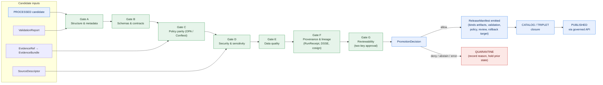

<!-- [KFM_META_BLOCK_V2]
doc_id: kfm://doc/runbook-hydrology-promotion
title: Hydrology Promotion Runbook
type: standard
version: v0.1
status: draft
owners: Hydrology domain steward, Release authority, Docs steward
created: 2026-05-12
updated: 2026-05-12
policy_label: public
related:
  - docs/doctrine/directory-rules.md
  - docs/doctrine/lifecycle-law.md
  - docs/doctrine/truth-posture.md
  - docs/doctrine/trust-membrane.md
  - docs/domains/hydrology/README.md
  - docs/runbooks/hydrology/ROLLBACK_RUNBOOK.md
  - docs/runbooks/hydrology/VALIDATION_RUNBOOK.md
  - docs/adr/ADR-0001-schema-home.md
tags: [kfm, runbook, hydrology, promotion, governance]
notes:
  - Path is PROPOSED until verified against mounted repo (Directory Rules §0).
  - Flat vs subdirectory naming for domain runbooks is unresolved; see open questions §11.
[/KFM_META_BLOCK_V2] -->

# Hydrology Promotion Runbook

> Governed state transition from PROCESSED through CATALOG / TRIPLET into PUBLISHED for Kansas Frontier Matrix Hydrology artifacts — evidence-bound, fail-closed, reversible.

<p align="left">
  
  
  
  
  
  
  
</p>

| Field | Value |
|---|---|
| **Document type** | Operational runbook (standard doc) |
| **Status** | `draft` |
| **Owners** | Hydrology domain steward · Release authority · Docs steward |
| **Last updated** | 2026-05-12 |
| **Authority** | CONFIRMED for doctrine; PROPOSED for any specific path, route, schema, validator, or CI workflow named below until verified against the mounted repo |
| **Lifecycle invariant** | `RAW → WORK / QUARANTINE → PROCESSED → CATALOG / TRIPLET → PUBLISHED` (promotion is a governed state transition, **not** a file move) |
| **Default decision** | **DENY** absent EvidenceBundle, validation, policy, review, release manifest, and rollback target |

---

## Table of contents

1. [Purpose and scope](#1-purpose-and-scope)
2. [Truth posture and labels used in this runbook](#2-truth-posture-and-labels-used-in-this-runbook)
3. [Preconditions (must hold before any gate runs)](#3-preconditions-must-hold-before-any-gate-runs)
4. [Promotion flow at a glance](#4-promotion-flow-at-a-glance)
5. [Gate matrix A–G](#5-gate-matrix-ag)
6. [Stage-by-stage procedure](#6-stage-by-stage-procedure)
7. [Hydrology-specific concerns](#7-hydrology-specific-concerns)
8. [Receipt and artifact checklist](#8-receipt-and-artifact-checklist)
9. [Failure handling and quarantine](#9-failure-handling-and-quarantine)
10. [Rollback and correction (cross-links)](#10-rollback-and-correction-cross-links)
11. [Open questions and verification backlog](#11-open-questions-and-verification-backlog)
12. [Related docs](#12-related-docs)
13. [Appendix](#13-appendix)

---

## 1. Purpose and scope

This runbook is the operational procedure a Hydrology release engineer or domain steward follows to take a Hydrology candidate — a watershed layer, a HUC12 release, a gauge time-series snapshot, an NHDPlus identity crosswalk, an NFHL contextual overlay, a hydrograph artifact — from PROCESSED state into a public-safe PUBLISHED release through the KFM governed-API path.

It is **not**:

- A general system architecture document. See `docs/architecture/` and `docs/domains/hydrology/README.md`.
- A validation deep dive. See `docs/runbooks/hydrology/VALIDATION_RUNBOOK.md` *(PROPOSED — see §11)*.
- A rollback drill. See `docs/runbooks/hydrology/ROLLBACK_RUNBOOK.md` *(PROPOSED — see §11)*.
- A schema or contract reference. See `schemas/contracts/v1/` and `contracts/`.

> [!IMPORTANT]
> Promotion is a **governed state transition, not a file move.** Copying a file into `data/published/` without a closed gate chain is a trust-membrane violation; see Directory Rules §3 and §13 anti-patterns.

[Back to top ↑](#table-of-contents)

---

## 2. Truth posture and labels used in this runbook

| Label | Meaning in this document |
|---|---|
| **CONFIRMED** | Verified this session from attached KFM doctrine (Directory Rules, Domains Atlas v1.1, Encyclopedia, Unified Manual, Components Pass-10). |
| **PROPOSED** | Design, path, route, or recommendation not yet verified in implementation against a mounted repo. |
| **NEEDS VERIFICATION** | Checkable, but not yet checked strongly enough to act as fact. |
| **UNKNOWN** | Not resolvable without more evidence. |

**Authoritative posture (CONFIRMED doctrine):**

- **Cite-or-abstain.** Released claims resolve to an EvidenceBundle. Missing support returns ABSTAIN; uncited claims are not permitted on public surfaces.
- **Fail-closed.** Default decision is DENY when any required artifact, signature, evidence resolution, policy decision, or review state is missing.
- **Trust membrane.** Public clients, the map shell, and Focus Mode reach hydrology data **only** through the governed API; never directly from RAW / WORK / QUARANTINE / canonical stores / graph internals / vector indexes / model runtimes.
- **AI is interpretive, not the root truth source.** EvidenceBundle outranks any AI-drafted language.

[Back to top ↑](#table-of-contents)

---

## 3. Preconditions (must hold before any gate runs)

> [!NOTE]
> Each precondition is doctrinally required (CONFIRMED). Specific paths, schema names, and validator commands below are PROPOSED until verified against the mounted repo.

| # | Precondition | Evidence required | Authority |
|---|---|---|---|
| P1 | Source identity and role recorded | `SourceDescriptor` exists per source family (WBD/HUC12, NHDPlus HR, NWIS/Water Data API, FEMA NFHL, 3DEP, water quality, groundwater, historical flood) | Hydrology source families (CONFIRMED), Directory Rules §6.5 |
| P2 | Rights and sensitivity classification resolved | Rights status set (`public` / `open` / `controlled` / `restricted` / `unknown`); sensitivity class set | NEEDS VERIFICATION on a per-source basis |
| P3 | Object identity is deterministic | Identity rule: `source_id + object_role + temporal_scope + normalized_digest` | PROPOSED basis (Domains Atlas §E) |
| P4 | Temporal fields kept distinct | `source_time`, `observed_time`, `valid_time`, `retrieval_time`, `release_time`, `correction_time` not collapsed | CONFIRMED |
| P5 | Source role not collapsed | NFHL regulatory zones, observed flood events, forecasts, and warnings are **distinct** classes; no upcast | CONFIRMED (Hydrology boundary clause) |
| P6 | EvidenceRef resolvable | Every claim's `EvidenceRef` resolves to an admissible `EvidenceBundle` | CONFIRMED |
| P7 | Candidate is in `PROCESSED` state | `ValidationReport` and digest closure exist; emitted from WORK with no quarantine reasons | CONFIRMED (Hydrology pipeline stages) |
| P8 | Reviewer and release authority distinct from author | Where materiality applies, the release author and the release approver are separate identities | CONFIRMED (separation of duties) |

If any of P1–P8 fails, **stop here.** Open a quarantine reason and route through the validation runbook before re-entering the promotion path.

[Back to top ↑](#table-of-contents)

---

## 4. Promotion flow at a glance



> [!NOTE]
> The A–G labeling follows the KFM Components Pass-10 gate matrix (CONFIRMED). The specific Hydrology workflow that wires these gates in CI is **PROPOSED** until verified against the mounted repo.

[Back to top ↑](#table-of-contents)

---

## 5. Gate matrix A–G

CONFIRMED gate intents; PROPOSED implementations (validator filenames, OPA bundle paths, workflow names) until verified.

| Gate | Intent | Required evidence (Hydrology) | Default failure |
|---|---|---|---|
| **A — Structure & metadata** | MetaBlock present; lane/zone correctness; file under correct responsibility root per Directory Rules | KFM Meta Block v2 on candidate doc; placement matches `data/processed/hydrology/...` or equivalent | `ERROR / quarantine` |
| **B — Schemas & contracts** | Machine shape conforms to schema; semantic meaning conforms to contract | `schemas/contracts/v1/domains/hydrology/*.schema.json` validation; `contracts/domains/hydrology/` semantic conformance | `ERROR / quarantine` |
| **C — Policy parity** | Same OPA bundle (pinned digest) evaluates the same decision in CI (Conftest) as at runtime (PDP) | `PolicyDecision` recorded; bundle digest matches runtime bundle | `DENY` |
| **D — Security & sensitivity** | Rights status, license posture, sensitivity class, geoprivacy transforms recorded; NFHL role separation enforced | Sensitivity class; SPDX in allowlist; redaction receipts where required; source role intact | `DENY` |
| **E — Data quality** | Domain DQ checks pass: HUC12 fingerprint, NHDPlus HR identity ambiguity, USGS parameter/unit/qualifier/no-data, NFHL role-separation, EvidenceBundle closure | `ValidationReport` with pass status for each named hydrology validator | `ERROR / abstain` |
| **F — Provenance & lineage** | RunReceipt exists; DSSE envelope; cosign signature verifies; `spec_hash` recompute matches; OpenLineage event(s) emitted | Signed `RunReceipt`; valid DSSE; `spec_hash` parity; evidence refs resolve | `DENY` |
| **G — Reviewability (two-key)** | CODEOWNERS-enforced human review **plus** policy approval; release authority distinct from original author when material | `ReviewRecord` (where required); release authority signature distinct from author | `DENY` |

> [!IMPORTANT]
> **Default-deny is structural, not advisory.** The absence of evidence blocks promotion. Promotion only fires when **all seven** gates pass; any failure holds the candidate at its prior lifecycle state.

[Back to top ↑](#table-of-contents)

---

## 6. Stage-by-stage procedure

The four governed transitions below run in order. Each transition is closed only when (i) every required artifact exists, (ii) every required artifact **resolves** (`EvidenceRef → EvidenceBundle`, `source_id → SourceDescriptor`, `model_id → ModelRunReceipt`) — not merely references — and (iii) a `PolicyDecision` evaluated and recorded its outcome.

### 6.1 PROCESSED → CATALOG / TRIPLET (catalog closure)

**Goal.** Emit `CatalogRecord`, `EvidenceBundle`, optional graph/triplet projection, and release candidate.

| Step | Action | Required artifact | Status |
|---|---|---|---|
| 6.1.1 | Confirm `ValidationReport` is closed and references hydrology validators (HUC12, NHDPlus identity, USGS parameters, NFHL role separation, EvidenceBundle closure) | `ValidationReport` | CONFIRMED required / PROPOSED validators |
| 6.1.2 | Resolve `EvidenceRef` → `EvidenceBundle` for every claim attached to the candidate | `EvidenceBundle` per claim | CONFIRMED |
| 6.1.3 | Project to graph/triplet form if applicable; treat triples as **derived**, not sovereign | `Triplet`, `GraphDelta` | PROPOSED |
| 6.1.4 | Run catalog-closure validation — no orphan artifact, every dataset/layer has source, schema, validation, policy, release metadata | `CatalogRecord`, `CatalogMatrix` | CONFIRMED rule / PROPOSED check |
| 6.1.5 | Record `PolicyDecision` for catalog admission | `PolicyDecision` | CONFIRMED |

**Failure mode.** Hold at PROCESSED. Open a quarantine reason with a structured FAIL outcome. No public edge.

### 6.2 CATALOG / TRIPLET → PUBLISHED (release closure)

**Goal.** Issue a public-safe `ReleaseManifest` and activate the artifact behind the governed API.

| Step | Action | Required artifact | Status |
|---|---|---|---|
| 6.2.1 | Confirm review state where required; release authority is **distinct** from original author when material | `ReviewRecord` | CONFIRMED |
| 6.2.2 | Build `RunReceipt` pinning artifact digests, `spec_hash`, source heads, tool versions, OIDC builder identity | `RunReceipt` | CONFIRMED doctrine / PROPOSED template |
| 6.2.3 | Wrap in DSSE envelope; sign with cosign; (recommended) record Rekor UUID back into the manifest | DSSE-signed receipt | PROPOSED |
| 6.2.4 | Recompute `spec_hash` — must match signed payload (mismatch → `QUARANTINE`) | `spec_hash` parity proof | CONFIRMED rule (Gate F) |
| 6.2.5 | Emit `ReleaseManifest` binding artifacts, validation, policy, review, checksums, and **rollback target** | `ReleaseManifest`, `RollbackCard` | CONFIRMED |
| 6.2.6 | Verify governed-API exposure: hydrology resolvers serve only released, evidence-backed payloads with finite outcomes (`ANSWER` / `ABSTAIN` / `DENY` / `ERROR`) | Hydrology `DecisionEnvelope`, `LayerManifest` | PROPOSED routes/DTOs |

> [!WARNING]
> A `ReleaseManifest` without a **rollback target** is invalid. "Rollback untested is not reliable." A release shall not transition to PUBLISHED until the prior safe release is locatable and its digests verifiable.

### 6.3 PUBLISHED → PUBLISHED' (correction)

**Goal.** Record an error or new evidence and emit a superseding release; never silently mutate.

| Step | Action | Required artifact |
|---|---|---|
| 6.3.1 | Identify the defect; classify by class (see §9 table) | Internal triage note |
| 6.3.2 | Emit `CorrectionNotice` referencing the original `release_id` and listing invalidated derivatives | `CorrectionNotice` |
| 6.3.3 | Update the affected `EvidenceBundle` and emit a superseding `ReleaseManifest` (do not edit the prior one) | `ReleaseManifest` (new) |
| 6.3.4 | Surface stale-state announcement on the public claim; never a silent edit | UI stale-state badge / drawer surface |

### 6.4 PUBLISHED → prior release (rollback)

See `docs/runbooks/hydrology/ROLLBACK_RUNBOOK.md` *(PROPOSED — §11)*. In summary: identify affected release, locate prior safe artifact set, verify digests and manifest, disable or withdraw affected public surfaces, preserve audit receipts, mark UI as stale or withdrawn, restore via the same governed release path. Rollback is **not** a hidden file copy.

[Back to top ↑](#table-of-contents)

---

## 7. Hydrology-specific concerns

These concerns are CONFIRMED doctrine for the Hydrology domain (Domains Atlas v1.1 §4.I; Encyclopedia §7.2). Specific implementation hooks (validator names, fixture paths) are PROPOSED.

### 7.1 Source-role separation

| Source family | Permitted role(s) | Forbidden conflation |
|---|---|---|
| USGS WBD / HUC12 | authority, observation, context | Treating WBD polygons as observed flood extents |
| NHDPlus HR / 3DHP | authority, observation, context, model | Treating modeled flow attributes as direct observation |
| USGS Water Data / NWIS | observation | Treating provisional observations as final without status field |
| **FEMA NFHL / MSC** | **regulatory** | **Claiming NFHL zones as observed flood inundation** |
| 3DEP terrain | authority, context | Treating derived hydro layers as authoritative observation |
| Water quality / groundwater | observation, context | Cross-source averaging that erases parameter/unit/qualifier |
| Historical flood evidence | observation, context | Upcast to regulatory or forecast |

> [!CAUTION]
> **NFHL-as-observed-flood is a denied claim.** Regulatory flood zones, observed inundation, forecasts, and emergency warnings are four distinct truth classes. Gate D enforces this; Gate E provides the NFHL role-separation negative fixture (PROPOSED).

### 7.2 Sensitivity, rights, and publication posture

- **DENY** when rights are unclear, source role is unresolved, evidence is missing, sensitivity is unresolved, or release state is absent.
- Infrastructure exposure (bridges, dams, utilities) and private-property implications require **review** before public release.
- Precise sensitive geometry (e.g., individual well coordinates linked to identifiable parties) must be redacted, generalized, staged, or denied. Record transforms and reasons.

### 7.3 Hydrology validators (PROPOSED)

These validators are named in the Domains Atlas v1.1 §4.K backlog. Their canonical home follows Directory Rules: `tools/validators/` and `tests/domains/hydrology/`, with fixtures in `tests/fixtures/` or root `fixtures/domains/hydrology/`.

| Validator | Purpose | Status |
|---|---|---|
| HUC12 fingerprint | Verify HUC12 polygon identity stability across snapshots | PROPOSED |
| NHDPlus HR identity ambiguity | `ABSTAIN` on ambiguous reach identity; preserve permanent IDs and pour-point references | PROPOSED |
| USGS parameter / unit / qualifier / no-data | Block silent unit collapse and unflagged provisional data | PROPOSED |
| NFHL role-separation | Negative fixture proving regulatory zones cannot upcast to observed flood | PROPOSED |
| `EvidenceBundle` closure | Every released claim's `EvidenceRef` resolves; no dangling references | PROPOSED |
| No-network hydrology proof fixture | Promotion proof runs offline against pinned fixtures | PROPOSED |

### 7.4 Cross-lane care

| Adjacent lane | Hydrology relation | Constraint |
|---|---|---|
| Hazards | Flood, drought, warning, declaration, resilience context | Preserve ownership; do not let Hazards consume Hydrology as a synthetic observation feed |
| Soil | Soil moisture, hydrologic group, infiltration, runoff | Preserve scale and source-role; no false precision in joins |
| Agriculture | Irrigation, drought stress, crop-water context | Joins must carry uncertainty; `EvidenceBundle` per side |
| Settlements / Infrastructure | Floodplain, bridges, dams, utilities, exposure context | Sensitivity review required before public exposure |

[Back to top ↑](#table-of-contents)

---

## 8. Receipt and artifact checklist

CONFIRMED receipt families per phase. A blank cell means the receipt is not normally emitted at that phase; previously emitted receipts remain *referenced* via `EvidenceRef`, not duplicated.

| Receipt | RAW | WORK / QUARANTINE | PROCESSED | CATALOG / TRIPLET | PUBLISHED |
|---|:---:|:---:|:---:|:---:|:---:|
| `SourceDescriptor` | • | • | • | • | • |
| `TransformReceipt` |  | • | • | • |  |
| `RedactionReceipt` |  | • | • | • | • |
| `AggregationReceipt` |  | • | • | • | • |
| `ModelRunReceipt` |  | • | • | • | • |
| `RepresentationReceipt` |  |  | • | • | • |
| `AIReceipt` |  |  |  |  | • *(Focus Mode only)* |
| `ReviewRecord` |  | • | • | • | • |
| `PolicyDecision` | • | • | • | • | • |
| `ValidationReport` |  | • | • | • |  |
| `ReleaseManifest` |  |  |  | • | • |
| `CorrectionNotice` |  |  |  | • | • |
| `RollbackCard` |  |  |  | • | • |
| `RealityBoundaryNote` |  |  | • | • | • |

> [!TIP]
> When in doubt about whether to emit a new receipt or reference an existing one: **reference, do not duplicate.** Duplication invites drift; references make supersession explicit.

[Back to top ↑](#table-of-contents)

---

## 9. Failure handling and quarantine

A transition fails closed and preserves the prior state when any required artifact is missing or any required artifact does not resolve. Common failure families and their reason codes:

| Failure family | Reason code (PROPOSED) | Gate(s) where it fires | Recovery path |
|---|---|---|---|
| Missing required artifact | `MISSING_RECEIPT`, `MISSING_EVIDENCE`, `MISSING_REVIEW` | B / E / F / G | Re-emit receipt; re-run review; re-validate |
| Schema / contract mismatch | `SCHEMA_MISMATCH`, `CONTRACT_DRIFT` | B | Schema fix and/or ADR; re-run validator |
| Rights / sensitivity unresolved | `RIGHTS_UNKNOWN`, `SENSITIVITY_UNRESOLVED` | D | Steward review; rights resolution; tier reassignment |
| Source-role collapse risk | `ROLE_COLLAPSE`, `ROLE_DOWNCAST_FORBIDDEN` | D / E | Restore source role; refuse upcast (especially NFHL) |
| Review state inadequate | `REVIEW_NEEDED`, `REVIEW_INSUFFICIENT`, `REVIEW_REJECTED` | G | Run required review; supply `ReviewRecord` |
| Release infrastructure error | `RELEASE_MANIFEST_INVALID`, `ROLLBACK_TARGET_MISSING` | F | Manifest fix; supply rollback target |
| Hash / signature drift | `INVALID_SPEC_HASH`, `UNSIGNED_RELEASE_MANIFEST` | F | Recompute `spec_hash`; re-sign; verify cosign chain |

**Defect classification for downstream correction posture** (CONFIRMED):

| Defect class | Correction posture | Rollback posture |
|---|---|---|
| Evidence gap | `ABSTAIN` or withdraw unsupported claim | Restore prior evidence-supported release |
| Source-role error | `CorrectionNotice` + supersede | Restore prior release; preserve audit trail |
| Rights / sensitivity error | Redact + supersede | Withdraw public surface immediately |
| Geometry / temporal error | `CorrectionNotice` + supersede | Restore prior release |
| Policy regression | Fix policy bundle + re-evaluate | Pin prior policy bundle digest |
| Rendering / UI error | UI fix; no canonical truth change | Disable affected layer; preserve canonical |

[Back to top ↑](#table-of-contents)

---

## 10. Rollback and correction (cross-links)

This runbook **stops** at promotion. Recovery procedures live in dedicated runbooks:

- **Rollback drill:** `docs/runbooks/hydrology/ROLLBACK_RUNBOOK.md` *(PROPOSED)* — identifies the rollback target, verifies digests, withdraws affected surfaces, restores prior release through the same governed path.
- **Correction emission:** `docs/runbooks/hydrology/CORRECTION_RUNBOOK.md` *(PROPOSED)* — preserves the original release record, classifies the defect, emits `CorrectionNotice`, supersedes via a new `ReleaseManifest`.

Universal closure rule (CONFIRMED): **the trust membrane forbids any public client, normal UI surface, or released AI surface from reaching RAW, WORK, QUARANTINE, canonical stores, graph internals, vector indexes, source APIs, or direct model runtimes.** The gates above are the only routes by which Hydrology content reaches PUBLISHED.

[Back to top ↑](#table-of-contents)

---

## 11. Open questions and verification backlog

| # | Question | Status | Where to resolve |
|---|---|---|---|
| Q1 | Is this runbook's path `docs/runbooks/hydrology/PROMOTION_RUNBOOK.md` (domain subdirectory) or `docs/runbooks/hydrology_PROMOTION.md` (flat-naming, matching `ui_LOCAL_DEV.md` / `governed_ai_VALIDATION.md`)? | **PROPOSED / OPEN** | Per-root README for `docs/runbooks/`, or short ADR |
| Q2 | Exact governed-API route names for Hydrology resolvers (feature/detail, layer manifest, Evidence Drawer, Focus Mode) | **UNKNOWN** | `apps/governed-api/` mounted-repo inspection |
| Q3 | Canonical schema filenames under `schemas/contracts/v1/domains/hydrology/` | **NEEDS VERIFICATION** | ADR-0001 plus repo inspection |
| Q4 | Existence of the named hydrology validators (HUC12, NHDPlus identity, USGS parameters, NFHL role-separation, EvidenceBundle closure, no-network proof) | **PROPOSED** | `tools/validators/` and `tests/domains/hydrology/` |
| Q5 | Hydrology promotion CI workflow name (e.g., `hydrology-promotion.yml`) and required-checks branch protection | **UNKNOWN** | `.github/workflows/` inspection |
| Q6 | OPA / Conftest policy bundle path for hydrology promotion gates | **PROPOSED** | `policy/promotion/` and `policy/domains/hydrology/` (Directory Rules §6.5) |
| Q7 | SPDX allowlist for hydrology source licenses | **OPEN** | Cross-link to Components Pass-10 C5-02; author allowlist |
| Q8 | Whether `data/manifests/` or `release/manifests/` is the canonical home for hydrology `ReleaseManifest` | **OPEN** | Directory Rules §18 already flags this |

These questions are healthy. They are the kinds of questions ADRs resolve. They are **not** blockers for the doctrinal procedure above.

[Back to top ↑](#table-of-contents)

---

## 12. Related docs

- `docs/doctrine/directory-rules.md` — placement law (§4 placement protocol; §6.1 `docs/runbooks/` canonical home)
- `docs/doctrine/lifecycle-law.md` — RAW → PUBLISHED invariant *(PROPOSED home)*
- `docs/doctrine/truth-posture.md` — cite-or-abstain *(PROPOSED home)*
- `docs/doctrine/trust-membrane.md` — governed-API boundary *(PROPOSED home)*
- `docs/domains/hydrology/README.md` — Hydrology mission, boundary, object families
- `docs/runbooks/hydrology/VALIDATION_RUNBOOK.md` *(PROPOSED — §11/Q1)*
- `docs/runbooks/hydrology/ROLLBACK_RUNBOOK.md` *(PROPOSED — §11/Q1)*
- `docs/adr/ADR-0001-schema-home.md` — schema home convention
- `contracts/release/` and `contracts/correction/` — meaning of release/correction objects
- `schemas/contracts/v1/release/` — `ReleaseManifest`, `PromotionDecision`, `RollbackCard` shape *(PROPOSED filenames)*

[Back to top ↑](#table-of-contents)

---

## 13. Appendix

<details>
<summary><b>A. Hydrology source families and their roles (reference)</b></summary>

| Source family | Role | Rights / sensitivity | Freshness |
|---|---|---|---|
| USGS WBD / HUC12 | authority, observation, context | NEEDS VERIFICATION; sensitive joins fail closed | source-vintage / cadence specific |
| NHDPlus HR / 3DHP-oriented hydrography | authority, observation, context, model | NEEDS VERIFICATION; sensitive joins fail closed | source-vintage / cadence specific |
| USGS Water Data / NWIS | observation | NEEDS VERIFICATION; sensitive joins fail closed | source-vintage / cadence specific |
| FEMA NFHL / MSC | regulatory | NEEDS VERIFICATION; sensitive joins fail closed | source-vintage / cadence specific |
| 3DEP terrain | authority, context, model | NEEDS VERIFICATION; sensitive joins fail closed | source-vintage / cadence specific |
| Water quality / groundwater | observation, context | NEEDS VERIFICATION; sensitive joins fail closed | source-vintage / cadence specific |
| Historical observed flood evidence | observation, context | NEEDS VERIFICATION; sensitive joins fail closed | source-vintage / cadence specific |

Source: Domains Atlas v1.1 §4.D (CONFIRMED terms / NEEDS VERIFICATION rights per source).

</details>

<details>
<summary><b>B. Hydrology object families (reference)</b></summary>

`Watershed`, `HUCUnit`, `HydroFeature`, `ReachIdentity`, `GaugeSite`, `FlowObservation`, `WaterLevelObservation`, `WaterQualityObservation`, `GroundwaterWell`, `AquiferObservation`, `NFHLZone`, `Hydrograph`, `UpstreamTrace`, `WaterUseLink`, `DroughtLink`, `IrrigationLink`.

Common identity rule (PROPOSED): `source_id + object_role + temporal_scope + normalized_digest`.
Common temporal rule (CONFIRMED): `source_time`, `observed_time`, `valid_time`, `retrieval_time`, `release_time`, `correction_time` remain distinct where material.

Source: Domains Atlas v1.1 §4.E.

</details>

<details>
<summary><b>C. PROPOSED directory placement of Hydrology promotion artifacts</b></summary>

```text
docs/runbooks/hydrology/
├── PROMOTION_RUNBOOK.md          # this file (PROPOSED path)
├── VALIDATION_RUNBOOK.md         # PROPOSED
├── ROLLBACK_RUNBOOK.md           # PROPOSED
└── CORRECTION_RUNBOOK.md         # PROPOSED

schemas/contracts/v1/domains/hydrology/         # PROPOSED schema home
schemas/contracts/v1/release/                   # ReleaseManifest, PromotionDecision, RollbackCard
contracts/domains/hydrology/                    # object meaning (Markdown)

policy/promotion/                               # promotion gate policy (OPA bundle)
policy/domains/hydrology/                       # hydrology-specific policy lanes
policy/sensitivity/                             # sensitivity classes, redaction rules

tools/validators/                               # repo-wide validators
tests/domains/hydrology/                        # hydrology test suite
tests/fixtures/ OR fixtures/domains/hydrology/  # golden / valid / invalid fixtures

data/processed/hydrology/<source_id>/<run_id>/  # PROCESSED candidates
data/catalog/domain/hydrology/                  # catalog records
data/published/layers/hydrology/                # published artifacts

release/manifests/                              # ReleaseManifest decisions
release/rollback_cards/                         # RollbackCard decisions
release/correction_notices/                     # CorrectionNotice decisions

.github/workflows/hydrology-promotion.yml       # PROPOSED workflow name; UNKNOWN until verified
```

> All paths above are **PROPOSED** per Directory Rules §0 ("authority of any specific path quoted here is PROPOSED until verified against mounted-repo evidence").

</details>

<details>
<summary><b>D. Cross-references to KFM doctrine</b></summary>

- Directory Rules — §4 placement protocol; §6.1 `docs/runbooks/`; §6.4 schema home; §6.5 `policy/`; §13 anti-patterns.
- Domains Atlas v1.1 — §4 Hydrology (A–N), §24.6 universal closure rules.
- Encyclopedia — §7.2 Hydrology (A–N), capability catalog (release manifest, correction notice, rollback card).
- Unified Implementation Manual — §3 Directory Rules summary; §5.1 validators and policy gates; correction and rollback model.
- Components Pass-10 — §6.5 Policy-as-Code and Promotion Gates (Gate Matrix A–G, default-deny doctrine).

</details>

[Back to top ↑](#table-of-contents)

---

**Last updated:** 2026-05-12 · **Status:** `draft` · **Owners:** Hydrology domain steward · Release authority · Docs steward

[↑ Back to top](#hydrology-promotion-runbook)
