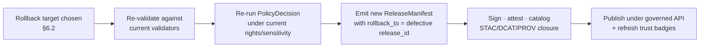

<!-- [KFM_META_BLOCK_V2]
doc_id: kfm://doc/runbook-hydrology-rollback
title: Hydrology Rollback Runbook
type: runbook
version: v0.1
status: draft
owners: <TODO: hydrology lane steward + release authority — assign before review>
created: 2026-05-12
updated: 2026-05-12
policy_label: public
related:
  - docs/doctrine/directory-rules.md
  - docs/doctrine/lifecycle-law.md
  - docs/domains/hydrology/README.md
  - docs/runbooks/ui_ROLLBACK.md
  - docs/runbooks/governed_ai_ROLLBACK.md
  - contracts/release/rollback_card.md
  - release/rollback_cards/
tags: [kfm, runbook, hydrology, rollback, release, correction]
notes:
  - All path-bearing claims are PROPOSED until verified against mounted-repo evidence.
  - Drill cadence and severity thresholds are PROPOSED defaults; tune in review.
[/KFM_META_BLOCK_V2] -->

# 🌊 Hydrology Rollback Runbook

> **Governed, reversible withdrawal and supersession of a published Hydrology release — including HUC/WBD layers, gauge observations, reach identities, and NFHL regulatory overlays — through KFM's release path, not around it.**


| Field | Value |
|---|---|
| **Status** | Draft — awaiting hydrology-lane and release-authority review |
| **Owners** | `<TODO: hydrology lane steward>` · `<TODO: release authority>` |
| **Last updated** | 2026-05-12 |
| **Applies to** | Released Hydrology artifacts under `data/published/layers/hydrology/` and any governed-API surface that resolves Hydrology `EvidenceBundle` projections |
| **Authority** | KFM Directory Rules, lifecycle law, correction-and-rollback model |
| **Repo evidence** | UNMOUNTED in this session — every quoted path is **PROPOSED** until verified |

---

## Contents

1. [Purpose & scope](#1-purpose--scope)
2. [Doctrine basis](#2-doctrine-basis)
3. [When to use this runbook](#3-when-to-use-this-runbook)
4. [Defect → rollback posture matrix](#4-defect--rollback-posture-matrix)
5. [Preconditions](#5-preconditions)
6. [Rollback procedure](#6-rollback-procedure)
7. [Hydrology-specific considerations](#7-hydrology-specific-considerations)
8. [Validation & rollback drill](#8-validation--rollback-drill)
9. [Failure modes & anti-patterns](#9-failure-modes--anti-patterns)
10. [Related docs & ADRs](#10-related-docs--adrs)
11. [Verification backlog](#11-verification-backlog)
12. [Appendix A — RollbackCard field reference](#appendix-a--rollbackcard-field-reference)
13. [Appendix B — Source-role separation cheat-sheet](#appendix-b--source-role-separation-cheat-sheet)

---

## 1. Purpose & scope

This runbook operationalizes a **governed rollback** of a Hydrology release in the Kansas Frontier Matrix. Hydrology is treated across KFM doctrine as the **preferred early proof lane** — the safest first slice through which the trust spine (`SourceDescriptor → EvidenceBundle → PolicyDecision → ReleaseManifest`) is exercised end-to-end — so the integrity of its rollback path matters disproportionately.

> [!IMPORTANT]
> **Rollback is a governed state transition, not a file copy.** A rollback that bypasses validators, policy gates, evidence-bundle re-resolution, catalog closure, and release-decision recording is a violation of the lifecycle invariant **regardless of which directory the bytes land in**. (CONFIRMED doctrine.)

**In scope.** Withdrawal or supersession of any published Hydrology artifact: HUC12 / watershed layers, NHDPlus-derived reach / flowline identities, stream networks, gauge observations (USGS NWIS-derived), water-level / flow / water-quality time series, groundwater context, NFHL regulatory overlays, terrain-derived hydrology context, and any Evidence Drawer or Focus Mode answer scoped to released Hydrology evidence.

**Out of scope.** Non-Hydrology domain rollbacks (see sibling runbooks in `docs/runbooks/`); pre-release candidate discard (handled by promotion-gate failure paths under `release/candidates/`); admission-edge `event_envelope` retraction before RAW; secrets / credentials incidents (security IR, not domain rollback).

---

## 2. Doctrine basis

Cited inline so reviewers can trace every step back to KFM doctrine rather than this runbook's prose. Path references are doctrinal targets and remain **PROPOSED** until mounted-repo evidence verifies them.

| Doctrine point | What this runbook inherits | Status |
|---|---|---|
| Correction and rollback are publication requirements, not afterthoughts. | A released Hydrology claim, layer, catalog record, or AI answer has no admissible publication state without a visible correction path and rollback target. | **CONFIRMED doctrine** |
| Rollback flow shape. | Identify affected release → locate prior safe artifact set → verify digests and manifests → disable / withdraw public surfaces → preserve audit receipts → mark stale or withdrawn UI state → restore or republish through the same governed release path. | **PROPOSED** flow / CONFIRMED shape |
| `ReleaseManifest` + `RollbackCard` + rollback drill are required for every release. | This runbook is one half of that contract; the other half is the **drill** under §8. | **CONFIRMED doctrine** |
| NFHL must not be collapsed with observed inundation, forecast, or emergency warning. | Rollback that erases NFHL role separation is itself a defect class; see §7. | **CONFIRMED doctrine** |
| Cite-or-abstain. | When rollback removes the evidence under a public claim, downstream Focus Mode answers must **ABSTAIN**, not silently degrade to plausibility. | **CONFIRMED doctrine** |

> [!NOTE]
> If the mounted repo eventually shows a rollback flow that disagrees with this runbook, **do not silently conform**. Open a `docs/registers/DRIFT_REGISTER.md` entry, mark the affected paths `PROPOSED / CONFLICTED`, and propose an ADR. (Directory Rules §2.5.)

---

## 3. When to use this runbook

This runbook is invoked when a **released** Hydrology artifact is found defective and a governed correction is required. The triggering signal is usually one of these:

- A reviewer, steward, downstream consumer, or automated check **detects a defect** in a published Hydrology artifact (see §4 for defect classes).
- A `CitationValidationReport` or `EvidenceRef` resolution failure points back to a Hydrology `EvidenceBundle`.
- A policy gate decision flips from `ALLOW` to `DENY` after a rights, sensitivity, or freshness change in an upstream `SourceDescriptor`.
- A scheduled **rollback drill** (governance health indicator: rollback rehearsal rate is required to be non-zero and periodic).
- An incident in a sibling domain (e.g., Hazards, Settlements/Infrastructure) invalidates a hydrology join used by a public surface.

It is **not** invoked for:

- Pre-publication candidate discard (use `release/candidates/hydrology/` discard flow; no `RollbackCard` is emitted).
- Cosmetic corrections that do not touch evidence, policy, sensitivity, geometry, time, identity, source role, or release state.
- Renames / file moves that change *location* without changing *meaning* (Directory Rules placement protocol, not this runbook).

```mermaid
flowchart LR
    A["Defect detected<br/>in PUBLISHED hydrology artifact"] --> B{"Defect class?<br/>(see §4)"}
    B -->|Evidence / source-role / geometry / temporal / policy / catalog / AI| C["Classify · §4<br/>Open ReviewRecord"]
    C --> D["§6.1 Identify affected release"]
    D --> E["§6.2 Locate prior safe<br/>release & artifact set"]
    E --> F["§6.3 Verify digests<br/>& manifests"]
    F --> G["§6.4 Disable / withdraw<br/>public surfaces"]
    G --> H["§6.5 Preserve receipts<br/>(do not delete prior meaning)"]
    H --> I["§6.6 Mark stale /<br/>withdrawn UI state"]
    I --> J["§6.7 Restore or republish<br/>through governed release path"]
    J --> K["§6.8 Emit RollbackCard +<br/>CorrectionNotice"]
    K --> L["Drill receipt & post-rollback<br/>validation · §8"]
```



> **PROPOSED diagram — NEEDS VERIFICATION** against the rollback-flow contract once `release/rollback_cards/` and the rollback action under §6 are mounted.

---

## 4. Defect → rollback posture matrix

The matrix below is the KFM correction-and-rollback model applied to the Hydrology lane. The first two columns are **CONFIRMED doctrine**; the third column ("Hydrology specifics") is **PROPOSED** and should be tuned during the first hydrology rollback drill.

| Defect class | Correction posture | Rollback posture | Hydrology specifics (PROPOSED) |
|---|---|---|---|
| **Evidence gap** | `ABSTAIN` or withdraw the unsupported claim. | Restore the prior evidence-supported release. | Most common path for gauge / NHDPlus identity ambiguity (`ReachIdentity` resolution failure). |
| **Rights defect** | `DENY` public use; quarantine the source / artifact. | Withdraw affected artifacts. | NFHL or NWIS terms changed; redistribution class no longer supported. |
| **Sensitivity leak** | Redact / generalize and notify stewards. | **Immediate** public disablement. | Rare for hydrology; consider if joined with archaeology, infrastructure, or private-property surfaces. |
| **Geometry defect** | Rebuild the derivative layer and evidence payload. | Restore the previous **digest-pinned** artifact. | HUC12 / WBD vintage drift, coastal/braided overlay instability, COMID-HUC12 alignment-score regression. |
| **Temporal defect** | Correct `valid_time` / `source_time` / `retrieval_time` / `release_time`. | **Mark stale** until rebuilt. | Provisional gauge data treated as final; NFHL `EFFECTIVE_DATE` / `VERSION_ID` mismatch. |
| **Policy defect** | Re-run the policy gate and `DecisionEnvelope`. | Disable the route or layer if the gate failed. | Source-role collapse (e.g., NFHL surfaced as observed inundation); flood-role misuse. |
| **AI answer defect** | Invalidate the `AIReceipt` and response envelope. | Remove the answer; **preserve the `EvidenceBundle`**. | Focus Mode summary made a flood claim NFHL does not support. |
| **Catalog defect** | Re-emit catalog closure after proof repair. | Restore the previous catalog state. | STAC/DCAT/PROV `EvidenceBundle` link broken; `CatalogMatrix` orphan. |

> [!CAUTION]
> **Never** smooth a defect by upgrading an `ABSTAIN` to an `ANSWER` through prose. If the rollback path removes the evidence under a Hydrology claim, the downstream Focus Mode answer **MUST** flip to `ABSTAIN`. Silent degradation is the worst class of governed-AI failure.

---

## 5. Preconditions

Before executing any step in §6, all of the following must hold. Treat the list as a **fail-closed checklist**: a missing item is a stop, not a workaround.

- [ ] **Release identity is known.** The affected `release_id` is named and pulled from `release/manifests/` (PROPOSED path).
- [ ] **Prior safe release exists.** A predecessor `ReleaseManifest` is available, with verifiable digests, and was itself emitted through the governed path. If no prior safe release exists, the correct action is **withdrawal**, not rollback.
- [ ] **Defect class is classified per §4.** Multi-class defects are recorded as the strictest applicable class.
- [ ] **`ReviewRecord` is opened.** Steward action is auditable. Reviewer identity is distinct from the original release author when materiality applies (separation of duties).
- [ ] **Kill-switch is honored.** If a global or domain kill-switch is set, no new publication is attempted as part of this rollback until the switch is cleared.
- [ ] **Public surfaces inventory is current.** The set of governed-API routes, layer registry entries, Evidence Drawer payloads, and Focus Mode answers backed by the affected release is enumerated. Anything missed becomes a stale leak.
- [ ] **No live secret rotation is mixed in.** Secret incidents follow `SECURITY.md`, not this runbook.

---

## 6. Rollback procedure

This is the **PROPOSED** governed-rollback flow for Hydrology. Each step's *intent* is **CONFIRMED doctrine**; the *commands, file names, route names, and CI targets* are **PROPOSED** until verified against mounted-repo evidence.

> [!TIP]
> Run every step from a fresh clone with no uncommitted local state. The rollback path **MUST** be reproducible from `main` + the release tag — a half-applied local patch defeats the audit trail.

### 6.1 Identify the affected release

```bash
# PROPOSED — verify command shape against actual release tooling once repo is mounted.
kfm release inspect \
  --domain hydrology \
  --release-id <release_id> \
  --show contents,evidence_refs,policy_state,review_state,signatures
```

Capture, at minimum: `release_id`, contained artifact digests, `EvidenceBundle` refs, declared `rollback_target`, signatures, and review state. If any of these are missing, the release was promoted in violation of the gate matrix and the incident is **larger than this rollback**.

### 6.2 Locate the prior safe artifact set

The prior safe release is the most recent **PUBLISHED** release whose `EvidenceBundle` refs still resolve, whose policy decision still holds, and whose `ReleaseManifest` is digest-verifiable. Walk backward through `release/manifests/` (PROPOSED) until those three predicates hold.

| Check | What to verify | Failure means |
|---|---|---|
| Manifest integrity | `ReleaseManifest` digest matches the recorded `release_id`. | Manifest tamper or storage drift; escalate. |
| Evidence resolution | Every `EvidenceRef` in the manifest resolves to an `EvidenceBundle`. | Choose an earlier release. |
| Policy currency | The original `PolicyDecision` still holds under current rights / sensitivity / freshness. | Choose an earlier release. |
| Source-role intent | NFHL is still regulatory context; NWIS is still observation; modeled context is still modeled. | **Stop.** Source-role drift since the prior release is itself a defect class. |

### 6.3 Verify digests and manifests

```bash
# PROPOSED — adapt to the verifier exposed by the release toolchain.
kfm release verify \
  --manifest release/manifests/<prior_release_id>.json \
  --check digests,signatures,evidence_closure,catalog_closure
```

A verification failure here is **terminal**: do not proceed by removing checks. Open a `docs/registers/DRIFT_REGISTER.md` entry and escalate.

### 6.4 Disable or withdraw affected public surfaces

The goal is to make sure no public consumer can read the defective artifact via any surface while the rollback is in flight. **Order matters** — start at the outermost surface and work inward.

1. **Layer registry** — remove or mark `stale` the affected `LayerManifest` entries scoped to Hydrology.
2. **Governed API routes** — flip the affected Hydrology endpoints to return the appropriate finite outcome (`ABSTAIN`, `DENY`, or `ERROR` per §4).
3. **Tile / PMTiles / GeoParquet** — invalidate caches; emit a cache-invalidation record.
4. **Evidence Drawer payloads** — fall back to `ABSTAIN` for any feature whose `EvidenceBundle` is being withdrawn.
5. **Focus Mode answers** — invalidate any `AIReceipt` whose evidence set intersects the withdrawn bundle.
6. **Search / index** — re-index against the prior release's catalog so search does not surface the defective claim.

### 6.5 Preserve audit receipts

> [!IMPORTANT]
> **Rollback never deletes prior meaning.** Receipts, prior `ReleaseManifest`, the defective `EvidenceBundle`, `ValidationReport`, `PolicyDecision`, and `ReviewRecord` are retained. The lifecycle invariant requires that the *defect itself* be inspectable after the fact.

What is preserved:

- The defective `ReleaseManifest` (marked superseded, not removed).
- All `RunReceipt`, `TransformReceipt`, `ValidationReport`, `PolicyDecision`, `AIReceipt`, and `ReviewRecord` artifacts associated with the defective release.
- The `EvidenceBundle` snapshot at the time of the defective release, retained for inspection.
- Any `RedactionReceipt` or `AggregationReceipt` emitted along the path.

### 6.6 Mark stale or withdrawn UI state

Public surfaces must visibly reflect that the prior published state is no longer in force.

- Time-aware layers show **stale** badges until republication closes the loop.
- Evidence Drawer surfaces show the `CorrectionNotice` reference for the affected claims.
- Focus Mode answers carrying the withdrawn evidence return `ABSTAIN` with a citation to the `CorrectionNotice`.

### 6.7 Restore or republish through the governed release path

The rollback target is restored or republished **through the same gates** that admit any release: source activation → evidence closure → source-role distinction → freshness marking → validation → policy decision → release manifest → correction path → rollback target. A shortcut here is a governance violation, even if the bytes are byte-identical to the prior safe release.



> **PROPOSED diagram — NEEDS VERIFICATION** against the actual promotion gates once mounted.

### 6.8 Emit `RollbackCard` and `CorrectionNotice`

The rollback closes by emitting two governance objects:

- **`RollbackCard`** — `release_id`, `rollback_to`, `reason`, `invalidates[]`, `review_ref`, `time`. Stored under `release/rollback_cards/` (PROPOSED).
- **`CorrectionNotice`** — `claim_ref`, `prior_release_ref`, `change_summary`, `invalidates[]`, `review_ref`, `time`. Stored under `release/correction_notices/` (PROPOSED). Visible on the public claim until superseded.

Without both, the rollback is not durable; consumers cannot see *that* a correction happened.

---

## 7. Hydrology-specific considerations

Generic rollback doctrine is necessary but not sufficient for Hydrology. The lane has two structural risks that this section names explicitly.

### 7.1 NFHL source-role separation

> [!WARNING]
> **FEMA NFHL is regulatory baseline, not observed inundation, hydraulic-model output, or forecast.** Any rollback that resurrects an artifact in which NFHL has been published *as* observed flooding, or *as* a forecast, **must** quarantine that artifact rather than restore it. Source-role collapse is its own publication defect, distinct from the geometry, time, or policy defect that triggered the rollback.

Practical implication: when evaluating the **prior safe release** in §6.2, treat source-role intent as a hard predicate. If the prior release predates KFM's NFHL role-separation tests, it is **not** a safe rollback target — withdraw rather than restore, and rebuild from the source descriptor.

### 7.2 Temporal hygiene across hydrology vintages

Hydrology data has several distinct, **non-interchangeable** time fields, all of which must remain distinct across a rollback:

| Time field | Meaning | Common confusion |
|---|---|---|
| `observed_time` | When the phenomenon occurred (e.g., gauge reading). | Conflated with publish time, masking lag. |
| `valid_time` | The window over which a claim is asserted to hold. | Confused with vintage of the source dataset. |
| `source_time` | When the upstream source last refreshed. | Confused with retrieval. |
| `retrieval_time` | When KFM fetched / admitted the source. | Confused with release. |
| `release_time` | When KFM published the derivative. | Confused with the correction time. |
| `correction_time` | When the present rollback / correction is emitted. | Conflated with `release_time`. |

A rollback that collapses any of these into another is itself a temporal defect (§4). Mark the affected layer **stale** until the time fields are rebuilt cleanly.

### 7.3 Identity ambiguity (COMID ↔ HUC12, NHDPlus vintages)

NHDPlus version drift — silently mixing **NHDPlus v2.1**, **NHDPlus HR**, and **WBD snapshot vintages** — is a recurrent failure mode upstream of release. If the defect being rolled back has an identity ambiguity at its root, the rollback target must carry an explicit `nhdplus_version` and `wbd_snapshot` declaration; otherwise the same defect will re-publish on the next promotion.

### 7.4 Non-CONUS and coastal/braided systems

The official USGS COMID↔HUC12 crosswalk is not universally authoritative outside CONUS, and area-weighted overlays can produce unstable assignments on coastal and braided systems. If the rollback target was emitted with `coverage_scope` that *does not* clear these constraints, prefer withdrawal over republication and route a remediation PR into `data/raw/hydrology/` followed by a re-promotion under §6.7.

### 7.5 Cross-lane consequences

A Hydrology rollback often invalidates downstream joins. The runbook owner is responsible for naming the affected sibling lanes, **even when remediation is owned by those lane stewards**. Typical implicated lanes:

| Sibling lane | Common dependency | Action |
|---|---|---|
| Hazards | Flood, drought, warning context that referenced the withdrawn hydrology evidence. | Notify hazard steward; mark joined artifacts stale until reviewed. |
| Soil | Soil-moisture / hydrologic-group joins. | Re-evaluate joined `LayerManifest` entries. |
| Agriculture | Irrigation, drought-stress, crop-water context. | Notify agriculture steward. |
| Settlements / Infrastructure | Floodplain, bridge, dam, utility exposure context. | High-care: implicates infrastructure sensitivity. |

---

## 8. Validation & rollback drill

A rollback runbook with no drill is, per KFM governance health indicators, **not** a rollback. The drill is non-optional.

> [!NOTE]
> **PROPOSED drill cadence:** at least one rehearsed Hydrology rollback per release window, plus an unplanned drill per quarter. Tune in review.

### 8.1 Drill scope (PROPOSED)

The drill walks the full §6 flow against a **synthetic** Hydrology release whose evidence is a no-network fixture (e.g., one Kansas HUC12 + one USGS gauge fixture + one NHDPlus identity crosswalk + an NFHL contextual overlay), not live data. The drill emits a `RollbackCard` against the synthetic release and verifies that every public surface (layer, API, drawer, Focus Mode) reflects the rolled-back state.

### 8.2 Post-rollback validation checklist

- [ ] Prior `ReleaseManifest` digest re-verifies.
- [ ] `EvidenceRef` resolution rate on the affected surfaces is ≥ 99.9% on the rolled-back state.
- [ ] No Focus Mode answer cites the withdrawn `EvidenceBundle` without an `ABSTAIN` + `CorrectionNotice` reference.
- [ ] Layer registry, governed-API responses, Evidence Drawer payloads, and cache invalidation records all reflect the rolled-back release.
- [ ] `RollbackCard` and `CorrectionNotice` are emitted, signed, and discoverable from the public claim.
- [ ] Cross-lane stewards (Hazards, Soil, Agriculture, Settlements / Infrastructure) have been notified where joins were implicated.
- [ ] The drill receipt is filed under `data/receipts/release/` (PROPOSED).

### 8.3 Governance health indicators touched by this runbook

| Indicator | Healthy posture | This runbook's contribution |
|---|---|---|
| Release-with-rollback-target rate | 100% | Enforced by §5 precondition and §6.8 emission. |
| Correction lead time (median) | Visibly tracked; trend not regressing. | §6.8 timestamps. |
| Derivative-invalidation coverage | Approaches 100% as coverage matures. | §6.4 + §7.5. |
| Rollback rehearsal rate | Non-zero; periodic, scheduled. | §8.1 drill cadence. |
| Supersession lineage gap | Zero. | `RollbackCard.rollback_to` + `CorrectionNotice.prior_release_ref`. |

---

## 9. Failure modes & anti-patterns

> [!CAUTION]
> Every failure mode below has been observed often enough across KFM doctrine to be named. Treat them as **review stoplights**, not gentle suggestions.

- **Silent file copy.** Restoring artifacts by copying bytes from a prior release path without re-running gates. **Doctrinal violation** — Rollback must not be a hidden file copy.
- **Receipt deletion.** Deleting the defective `ReleaseManifest`, `EvidenceBundle`, or `ReviewRecord` "to clean up." The defect itself must remain inspectable.
- **Smoothed degradation.** Quietly downgrading a Focus Mode answer from `ANSWER` to a softer prose `ANSWER` instead of `ABSTAIN` when its evidence was withdrawn.
- **Source-role collapse on restore.** Republishing an NFHL artifact in a surface that presents it as observed inundation or forecast.
- **Vintage mix.** Restoring a release whose NHDPlus v2.1 / NHDPlus HR / WBD snapshot vintages were silently mixed.
- **Cross-lane silence.** Rolling back hydrology without notifying Hazards, Soil, Agriculture, or Settlements/Infrastructure stewards whose joined artifacts depend on the withdrawn evidence.
- **Drillless rollback.** Treating this runbook as theoretical because no drill has ever been run — see §8.
- **Kill-switch bypass.** Promoting the rollback target while a kill-switch is set.
- **Schema-home drift.** Reading rollback-card shape from an out-of-canon location instead of `schemas/contracts/v1/release/` (PROPOSED per ADR-0001).

---

## 10. Related docs & ADRs

> Links below are **PROPOSED** doctrinal targets. Verify each path against mounted-repo evidence before treating any as canonical.

- `docs/doctrine/directory-rules.md` — placement authority for runbooks, release artifacts, and rollback cards.
- `docs/doctrine/lifecycle-law.md` — the RAW → WORK / QUARANTINE → PROCESSED → CATALOG / TRIPLET → PUBLISHED invariant.
- `docs/doctrine/truth-posture.md` — cite-or-abstain; the basis for §6.4 and §6.6.
- `docs/domains/hydrology/README.md` — Hydrology lane scope, object families, source-role posture.
- `docs/runbooks/ui_ROLLBACK.md` *(PROPOSED, sibling)* — UI rollback, feature-flag, and schema-deprecation steps.
- `docs/runbooks/governed_ai_ROLLBACK.md` *(PROPOSED, sibling)* — AI adapter rollback and kill-switch steps.
- `contracts/release/rollback_card.md` *(PROPOSED)* — semantic meaning of `RollbackCard`.
- `schemas/contracts/v1/release/rollback_card.schema.json` *(PROPOSED per ADR-0001)* — machine shape.
- `policy/release/` *(PROPOSED)* — release-gate policy bundle.
- `docs/adr/ADR-0001-schema-home.md` *(PROPOSED)* — schema-home rule the rollback card schema follows.
- `release/rollback_cards/` *(PROPOSED)* — emitted `RollbackCard` artifacts.
- `data/receipts/release/` *(PROPOSED)* — release receipts including drill receipts.

---

## 11. Verification backlog

Open items this runbook depends on. Each is **UNKNOWN** or **NEEDS VERIFICATION** until mounted-repo evidence resolves it.

| Item | Status | Next action |
|---|---|---|
| Exact paths for `release/`, `release/rollback_cards/`, `release/correction_notices/`. | **PROPOSED** | Verify against mounted repo; open `DRIFT_REGISTER.md` entry if mismatched. |
| Schema home of `RollbackCard` / `CorrectionNotice` (`schemas/contracts/v1/release/` vs. legacy). | **NEEDS VERIFICATION** | Confirm against ADR-0001; migrate any divergent definition. |
| Concrete `kfm release inspect` / `kfm release verify` command names. | **PROPOSED** | Replace placeholders with the toolchain's actual entrypoints. |
| Hydrology governed-API route names invalidated on rollback. | **UNKNOWN** | Resolve once the API surface is mounted. |
| NFHL service freshness handling (localized, event-driven `EFFECTIVE_DATE` / `VERSION_ID`). | **NEEDS VERIFICATION** | Probe service metadata and version-change behavior. |
| Cross-lane notification mechanism (manual ping vs. automated `CorrectionNotice` fanout). | **PROPOSED** | Decide in review; reflect under §7.5. |
| Drill cadence numbers (releases / quarter). | **PROPOSED** | Tune after first real drill. |
| Naming convention: `docs/runbooks/<subsystem>_<TYPE>.md` flat vs. `docs/runbooks/<domain>/<TYPE>_RUNBOOK.md` nested. | **NEEDS VERIFICATION** | Normalize in a small ADR; existing PROPOSED siblings use the flat form. |

---

## Appendix A — `RollbackCard` field reference

Doctrinal field set for the `RollbackCard` object family, applied to Hydrology. The field names below are **CONFIRMED** in KFM doctrine; their JSON shape is **PROPOSED** until `schemas/contracts/v1/release/rollback_card.schema.json` is verified.

<details>
<summary><strong>Show illustrative <code>RollbackCard</code> payload</strong> (PROPOSED — for orientation, not authority)</summary>

```json
{
  "object_type": "RollbackCard",
  "schema_version": "v1",
  "release_id": "hydrology/2026-05-08-r1",
  "rollback_to": "hydrology/2026-04-22-r3",
  "reason": "Geometry defect: HUC12 boundaries mixed v2.1 / WBD 2024-10-01 snapshot.",
  "defect_class": "geometry",
  "invalidates": [
    "kfm://layer/hydrology/huc12/2026-05-08",
    "kfm://evidence/hydrology/huc12-comid-crosswalk/2026-05-08",
    "kfm://focus-answer/hydrology/2026-05-09T14:22Z"
  ],
  "preserved_for_audit": [
    "kfm://manifest/hydrology/2026-05-08-r1",
    "kfm://review/hydrology/2026-05-09-rr1"
  ],
  "review_ref": "kfm://review/hydrology/2026-05-09-rr1",
  "correction_notice_ref": "kfm://correction/hydrology/2026-05-09-cn1",
  "kill_switch_state": "cleared",
  "time": "2026-05-09T18:00:00Z"
}
```

This payload is **illustrative**, not normative. Field names follow KFM doctrinal naming; types, required-ness, and namespace shapes resolve against the (PROPOSED) JSON Schema.

</details>

---

## Appendix B — Source-role separation cheat-sheet

Reference card for §7.1. Source role is a **publication defect class** when collapsed, not a labeling preference.

| Source family | Source role | Public surface intent |
|---|---|---|
| USGS WBD / HUC12 | Authority / observation | Watershed identity & boundaries; not flood prediction. |
| NHDPlus HR / 3DHP-oriented hydrography | Authority / observation | Stream network & reach identity; not regulatory flood. |
| USGS Water Data / NWIS | Observation | Gauge readings; provisional vs. final status preserved. |
| FEMA NFHL / MSC | Regulatory context | **Regulatory baseline only.** Never observed inundation, never forecast, never emergency warning. |
| 3DEP terrain | Authority / context | Terrain-derived hydrology context; not hydraulic-model output. |
| Water-quality / groundwater sources | Observation | Discrete observations; rights and freshness vary. |
| Historical observed flood evidence | Observation (historical) | Time-bounded; never re-surfaced as current condition. |

---

> **Last updated:** 2026-05-12 · **Status:** draft · **Owners:** `<TODO>` · **Doctrine:** CONFIRMED · **Implementation:** PROPOSED
>
> 🔗 Related: [Directory Rules](../../doctrine/directory-rules.md) · [Lifecycle Law](../../doctrine/lifecycle-law.md) · [Hydrology Lane README](../../domains/hydrology/README.md) · [UI Rollback Runbook](../ui_ROLLBACK.md) · [Governed AI Rollback Runbook](../governed_ai_ROLLBACK.md)
>
> ⬆ [Back to top](#-hydrology-rollback-runbook)
