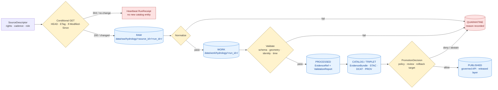

<!-- [KFM_META_BLOCK_V2]
doc_id: kfm://doc/runbook-hydrology-source-refresh-v1
title: Hydrology — Source Refresh Runbook
type: standard
version: v1
status: draft
owners: Hydrology domain steward + Source connector owner + Release manager (on-call)
created: 2026-05-12
updated: 2026-05-12
policy_label: public
related:
  - docs/doctrine/directory-rules.md
  - docs/doctrine/lifecycle-law.md
  - docs/doctrine/truth-posture.md
  - docs/domains/hydrology/README.md
  - docs/standards/SMART_SYNC.md
  - docs/sources/SOURCE_DESCRIPTOR_STANDARD.md
  - docs/runbooks/hydrology/VALIDATION.md
  - docs/runbooks/hydrology/ROLLBACK.md
tags: [kfm, runbook, hydrology, source-refresh, watcher, conditional-get]
notes:
  - All path claims are PROPOSED until verified against mounted repo state.
  - Treat as doctrine-grounded operational guide, not as evidence of installed tooling.
[/KFM_META_BLOCK_V2] -->

# Hydrology — Source Refresh Runbook

> Operational procedure for refreshing Kansas Frontier Matrix hydrology source data through the governed lifecycle `RAW → WORK / QUARANTINE → PROCESSED → CATALOG / TRIPLET → PUBLISHED`, with conditional-GET economy, evidence closure, and a visible correction and rollback path.

<!-- Badges row — placeholders until CI endpoints are verified -->


| Field | Value |
|---|---|
| **Status** | `draft` |
| **Owners** | Hydrology domain steward · Source connector owner · Release manager (on-call) |
| **Last updated** | 2026-05-12 |
| **Authority of this runbook** | CONFIRMED — operationalizes attached KFM doctrine for Hydrology refresh |
| **Authority of specific paths/commands quoted here** | PROPOSED until verified against mounted-repo evidence |
| **Cadence** | Per source family (continuous gauges → frequent; NFHL/3DEP → infrequent). See [§5 Source families and refresh cadence](#5-source-families-and-refresh-cadence). |

---

## Quick jump

- [1. Purpose and scope](#1-purpose-and-scope)
- [2. When to run this](#2-when-to-run-this)
- [3. Invariants this runbook must preserve](#3-invariants-this-runbook-must-preserve)
- [4. The refresh flow at a glance](#4-the-refresh-flow-at-a-glance)
- [5. Source families and refresh cadence](#5-source-families-and-refresh-cadence)
- [6. Pre-flight checklist](#6-pre-flight-checklist)
- [7. Step-by-step procedure](#7-step-by-step-procedure)
- [8. Lifecycle stage gates](#8-lifecycle-stage-gates)
- [9. No-change, stale, and drift handling](#9-no-change-stale-and-drift-handling)
- [10. RunReceipt and evidence closure](#10-runreceipt-and-evidence-closure)
- [11. Failure modes and triage](#11-failure-modes-and-triage)
- [12. Rollback pointers](#12-rollback-pointers)
- [13. Validation and proof](#13-validation-and-proof)
- [14. PROPOSED lane paths (Directory-Rules basis)](#14-proposed-lane-paths-directory-rules-basis)
- [15. Related docs](#15-related-docs)
- [Appendix A — Refresh receipt skeleton](#appendix-a--refresh-receipt-skeleton)
- [Appendix B — Glossary pointers](#appendix-b--glossary-pointers)

---

## 1. Purpose and scope

**Purpose.** This runbook describes how a hydrology source is refreshed in KFM without bypassing the trust membrane. It applies whenever a connector or watcher pulls fresh content from an upstream hydrology publisher — for example, gauge observations, watershed boundary updates, or regulatory floodplain shifts — and seeks to admit that content into the governed lifecycle.

**In scope.** Conditional fetch, RAW capture, normalization into WORK or QUARANTINE, validation into PROCESSED, evidence and catalog closure into CATALOG / TRIPLET, and the release gate that admits public-safe artifacts into PUBLISHED. Every step emits a receipt; promotion is a governed state transition, not a file move.

**Out of scope.** Source onboarding (handled by the `SourceDescriptor` standard), schema design (handled under `contracts/` and `schemas/`), policy authoring (handled under `policy/`), public client behavior (handled by the governed API), and emergency flood warning. Hydrology is **not** an emergency flood-warning system; NFHL regulatory zones, observed inundation, and forecasts are kept as distinct truth classes.

> [!IMPORTANT]
> **Cite-or-abstain is the default truth posture.** A refresh that cannot produce or resolve an `EvidenceBundle` for a released claim does not promote. It quarantines, abstains, or denies — and records why.

[Back to top](#hydrology--source-refresh-runbook)

---

## 2. When to run this

A refresh runs in one of four shapes. The chosen shape is recorded in the `RunReceipt`.

| Trigger | Typical operator | Cadence shape | Notes |
|---|---|---|---|
| **Scheduled poll** | Watcher (CI/cron) | Per source family (see [§5](#5-source-families-and-refresh-cadence)) | Default. Conditional-GET first. |
| **Source-driven event** | Push from publisher (rare for hydrology) | Event | Verify the source descriptor allows push admission. |
| **Manual refresh** | Domain steward / connector owner | Ad-hoc | Requires an issue or PR reference in `RunReceipt.actor` field. |
| **Drift recovery** | Domain steward + release manager | Out-of-band | Triggered by a `DRIFT_REGISTER` entry. Treat as a corrective refresh. |

> [!NOTE]
> An *unconditional* refresh — bypassing ETag / Last-Modified / manifest checksum — is permitted only as a drift-recovery action and MUST be justified inline in the `RunReceipt`.

[Back to top](#hydrology--source-refresh-runbook)

---

## 3. Invariants this runbook must preserve

The refresh procedure exists to keep these invariants visible at every step. If a step bends one, mark the trade-off explicitly in the `RunReceipt` and route through review.

- **Lifecycle invariant.** `RAW → WORK / QUARANTINE → PROCESSED → CATALOG / TRIPLET → PUBLISHED`. Promotion is a governed state transition, not a file move.
- **Trust membrane.** Public clients and normal UI surfaces consume governed APIs and released artifacts only. Connectors and watchers write to `data/raw/` or `data/quarantine/`; they do not publish.
- **Cite-or-abstain.** No release without resolvable `EvidenceRef` → `EvidenceBundle` closure.
- **Source-role separation.** NFHL regulatory zones, observed flood evidence, hydrology forecasts, and emergency warnings remain distinct truth classes; the refresh MUST NOT merge them.
- **Deterministic identity where practical.** Hydrology station and series IDs derive from the authoritative provider identifiers (e.g., USGS site ID, NWIS series identifier) so that downstream click-resolution and `promoteId` remain stable.
- **No-change economy.** Confirmed no-change responses do not emit new STAC / DCAT / PROV entities; they emit a heartbeat receipt only.
- **Rights and sensitivity first.** If license, rights, or sensitivity is unclear, the artifact quarantines; release fails closed.

[Back to top](#hydrology--source-refresh-runbook)

---

## 4. The refresh flow at a glance



> [!NOTE]
> **PROPOSED diagram structure.** The flow reflects KFM hydrology doctrine (intake separates monitoring locations, time series definitions, raw pulls, normalized artifacts, and catalog entries) and the lifecycle law. Exact tool wiring, route names, and queue topology are PROPOSED until verified against mounted-repo evidence.

[Back to top](#hydrology--source-refresh-runbook)

---

## 5. Source families and refresh cadence

Source families and roles are governed by per-source `SourceDescriptor` entries under `data/registry/sources/hydrology/` (PROPOSED path; see [§14](#14-proposed-lane-paths-directory-rules-basis)). The cadence column below is **shape**, not a contractual SLO — the descriptor is the source of truth.

| Source family | Typical role(s) | Rights / sensitivity | Refresh cadence shape | Status |
|---|---|---|---|---|
| **USGS Water Data API** (continuous values, daily values, monitoring locations) | observation / authority | NEEDS VERIFICATION; legacy WaterServices is being phased out (2026/2027), use `api.waterdata.usgs.gov` | High — gauges and time series | CONFIRMED source-family role / PROPOSED endpoint binding |
| **USGS WBD / HUC12** | authority (watershed identity) | NEEDS VERIFICATION | Low — vintage-tagged | CONFIRMED role |
| **NHDPlus HR / 3DHP-oriented hydrography** | authority / context | NEEDS VERIFICATION | Low to medium | CONFIRMED role |
| **FEMA NFHL / MSC** | authority (regulatory) | NEEDS VERIFICATION; **never treat NFHL as observed flood** | Low — episodic | CONFIRMED role |
| **3DEP terrain** | model / context | NEEDS VERIFICATION | Low | CONFIRMED role |
| **Water-quality and groundwater programs** (incl. WIZARD, WIMAS/WRIS, WWC5) | observation / context | NEEDS VERIFICATION; some Kansas-program rights are descriptor-specific | Weekly to monthly (e.g., WIMAS/WRIS) | CONFIRMED role |
| **Historical observed flood evidence** | observation | NEEDS VERIFICATION | Episodic | CONFIRMED role |

> [!CAUTION]
> **NFHL is regulatory, not observed.** Refreshing NFHL must not collapse regulatory floodplain into observed inundation, forecast, or warning. Source-role separation is enforced before catalog closure; an NFHL-as-observed-flood claim must be denied.

[Back to top](#hydrology--source-refresh-runbook)

---

## 6. Pre-flight checklist

Run this checklist before any refresh. A failed item halts the refresh; it does not "soft-warn."

- [ ] **SourceDescriptor present and current** for the source being refreshed, with rights, sensitivity, role, cadence, and endpoint pinned.
- [ ] **Rights and license verified.** Unknown rights ⇒ refresh runs in **quarantine-only** mode; no contentful delta emitted.
- [ ] **Conditional-GET validators available.** Local ETag / Last-Modified / manifest checksum sidecar exists, or the descriptor flags this source as no-validator (then C3-02 manifest checksum path is used).
- [ ] **Spec hash recomputable.** `kfm:spec_hash` for the refresh config is derivable from the current config commit.
- [ ] **Connector identity and credentials** loaded from environment-scoped secret store. No real secrets in `configs/`.
- [ ] **Lane directories exist** for `data/raw/hydrology/<source_id>/`, `data/work/hydrology/`, `data/quarantine/hydrology/`, `data/receipts/`, `data/proofs/`, `data/catalog/`.
- [ ] **Rollback target** for the currently published hydrology release is locatable. (See [§12](#12-rollback-pointers).)
- [ ] **Cite-or-abstain posture acknowledged.** If you cannot resolve evidence at this run, you will abstain and emit a receipt — not silently drop the refresh.

> [!TIP]
> If any descriptor field is missing or stale, fix the descriptor first. The refresh inherits its trust posture from the descriptor; an incomplete descriptor produces an incomplete `EvidenceBundle`.

[Back to top](#hydrology--source-refresh-runbook)

---

## 7. Step-by-step procedure

Each step records its own receipt. Receipts accumulate into the run-level `RunReceipt`. None of the commands below are repo-verified; they are PROPOSED entry points consistent with KFM doctrine and the lane-pattern.

### 7.1 Conditional fetch

Send the conditional request first. Strong ETags (no `W/` prefix) are preferred; weak ETags are advisory; fall back to `Last-Modified` with `If-Modified-Since`; fall back again to manifest SHA-256 when neither header is available.

```bash
# PROPOSED — entry point unverified
kfm hydrology refresh fetch \
  --source-id <source_id> \
  --run-id <run_id> \
  --use-validators etag,last-modified,manifest-sha256
```

Outcomes:

| Response | Action | Receipt |
|---|---|---|
| `304 Not Modified` | Skip download. Increment heartbeat. | Heartbeat `RunReceipt`; no new STAC / DCAT / PROV entity. |
| `200 OK` with unchanged content (validator drift) | Compare manifest SHA-256; if unchanged, treat as 304. | Heartbeat with a `validator_drift` note. |
| `200 OK` with changed content | Proceed to RAW capture. | `RawCaptureReceipt`. |
| `429 / 5xx` | Backoff per descriptor; record `throttled` or `transient_error`. | Receipt with retry intent. |
| `4xx` (rights / auth) | Stop. Open an issue against the descriptor. | Receipt with `rights_unknown` or `auth_failed`. |

### 7.2 RAW capture

Persist the raw payload immutably with provenance under the lane pattern.

- Path (PROPOSED): `data/raw/hydrology/<source_id>/<run_id>/`
- Sidecar (PROPOSED): `data/receipts/ingest/<run_id>.json` carrying source URL, `etag`, `last_modified`, `kfm:spec_hash`, payload digest, license/contact, retrieval time, and operator identity.

### 7.3 Normalize → WORK or QUARANTINE

Normalize schema, geometry, time, and identity. Hydrology intake separates **monitoring locations**, **time series definitions**, **raw pulls**, **normalized artifacts**, and **catalog entries**. Failures route to QUARANTINE with a recorded reason.

- Identity rules — hydrology station and series identifiers derive from the authoritative provider IDs (e.g., USGS site ID, NWIS series identifier). Do not invent local synthetic IDs for click resolution.
- Temporal rules — keep `source_time`, `observed_time`, `valid_time`, `retrieval_time`, `release_time`, and `correction_time` distinct. Mark provisional vs. final per parameter.

### 7.4 Validate → PROCESSED

Validation must produce a `ValidationReport`, resolve an `EvidenceRef`, and pass digest closure before emitting to PROCESSED.

| Check | Failing here means… |
|---|---|
| Schema (per source family) | Refresh fails fast; do not promote to WORK. |
| Geometry validity and CRS | Refresh quarantines until repaired or descriptor amended. |
| Identity ambiguity (NHDPlus HR, HUC12 fingerprint) | Quarantine; raise a domain-steward review. |
| Parameter / unit / qualifier / no-data (USGS) | Quarantine on missing or unknown units. |
| NFHL role-separation | Hard deny if an NFHL record claims observed-flood role. |
| EvidenceBundle closure | Refresh stays in PROCESSED until closure resolves; no catalog emission. |

### 7.5 Catalog and triplet emission

On validation pass, emit STAC, DCAT, and PROV records, the `EvidenceBundle`, and any graph/triplet projection candidates. A refresh that did not change content does **not** emit new catalog entities.

### 7.6 PromotionDecision

The release manager (or a governed automated gate, where available) issues a `PromotionDecision` linking the candidate to:

- The proof pack (validation report, citation validation report, run receipts).
- The policy decision (rights, sensitivity, public/restricted tier).
- The rollback target (prior release manifest, prior artifact digests, cache keys).
- The review state, where the source family or sensitivity tier requires separation of duties.

A passing decision promotes the candidate; a failing decision abstains or denies, with reasons attached.

### 7.7 Publish and confirm

Published artifacts are served via the governed API. Confirm:

- The map shell can resolve `EvidenceBundle` for clicked features.
- The released LayerManifest references the refreshed `TileArtifactManifest` and source digests.
- Cache invalidation receipts were emitted where applicable.

[Back to top](#hydrology--source-refresh-runbook)

---

## 8. Lifecycle stage gates

The lifecycle is governance, not storage organization. A stage is **entered** only when the prior gate passes; a stage is **exited** only by a recorded state transition.

| Stage | Handling | Gate (must pass before exit) | Status |
|---|---|---|---|
| **RAW** | Capture immutable source payload or reference with source role, rights, sensitivity, citation, time, and hash. | `SourceDescriptor` exists and is current. | CONFIRMED doctrine / PROPOSED implementation |
| **WORK / QUARANTINE** | Normalize schema, geometry, time, identity, evidence, rights, and policy; hold failures. | Validation and policy gate pass, or quarantine reason is recorded. | CONFIRMED doctrine / PROPOSED implementation |
| **PROCESSED** | Emit validated normalized objects, receipts, and public-safe candidates. | `EvidenceRef`, `ValidationReport`, and digest closure exist. | CONFIRMED doctrine / PROPOSED implementation |
| **CATALOG / TRIPLET** | Emit catalog records, `EvidenceBundle`s, graph/triplet projections, and release candidates. | Catalog and proof closure pass. | CONFIRMED doctrine / PROPOSED implementation |
| **PUBLISHED** | Serve released public-safe artifacts through governed APIs and manifests. | `ReleaseManifest`, correction path, rollback target, and review/policy state exist. | CONFIRMED doctrine / PROPOSED implementation |

> [!WARNING]
> A lifecycle skip — for example, writing directly to `data/published/layers/hydrology/` from a connector — is a Directory Rules anti-pattern (§13). Watcher-as-non-publisher applies: connectors and watchers emit receipts and candidate decisions only.

[Back to top](#hydrology--source-refresh-runbook)

---

## 9. No-change, stale, and drift handling

Hydrology refreshes can run frequently. Cheap, correct no-change handling protects downstream churn and cache health.

| Condition | What the refresh does | What the UI shows |
|---|---|---|
| **304 No-change** | Heartbeat `RunReceipt`. No new STAC / DCAT / PROV entity. No tile rebuild. No cache invalidation. | Released state unchanged; `last_seen` advances on the source ledger entry. |
| **Validator drift, content unchanged** (manifest SHA-256 confirms) | Heartbeat with `validator_drift` note. | Same as 304. |
| **Cadence missed** (expected interval exceeded) | Refresh marks the source `stale`. | Stale badge surfaces; map remains released-state correct. |
| **Drift exceeds severity threshold** | Refresh routes to domain-steward review; may block release. | Stale + warning; or `abstain` for derived layers. |
| **Rights / license becomes unclear mid-refresh** | Refresh quarantines and emits a deny receipt. | Affected layers fall back per `PolicyDecision`; never silently published. |

> [!NOTE]
> Stale state is **not** the same as denied release. UI must show stale or degraded source state separately from policy denial.

[Back to top](#hydrology--source-refresh-runbook)

---

## 10. RunReceipt and evidence closure

Every refresh produces at least one `RunReceipt`. Every released artifact carries a chain of receipts that an auditor can replay.

A hydrology refresh `RunReceipt` is expected to record (PROPOSED field set — verify against `schemas/contracts/v1/proofs/run_receipt.schema.json` when mounted):

- `run_id`, `source_id`, `source_url`, retrieval time, operator identity.
- HTTP validators: `etag`, `last_modified`, manifest SHA-256.
- `kfm:spec_hash` of the refresh config.
- Tool versions used at each stage.
- Outputs: RAW path digest, normalized artifact digest, validation report digest, catalog item ids.
- Decision outcomes per stage: ANSWER / ABSTAIN / DENY / ERROR, with reasons.
- Signatures (where signing is wired) and attestation references.

Receipts emitted alongside a hydrology refresh:

| Receipt | When emitted | Home (PROPOSED) |
|---|---|---|
| `RawCaptureReceipt` | After successful RAW write | `data/receipts/ingest/` |
| `ValidationReport` | After schema/identity/geometry checks | `data/receipts/validation/` |
| `RunReceipt` (run-level) | At end of refresh, success or fail | `data/receipts/pipeline/` |
| `EvidenceBundle` | At CATALOG closure for each released claim | `data/proofs/evidence_bundle/` |
| `CitationValidationReport` | Before any exported or AI-surfaced answer cites this refresh | `data/proofs/citation_validation/` |
| `PromotionDecision` | At release gate | `release/decisions/` |
| `RollbackTarget` reference | Captured at release gate, pointed at prior manifest | `release/rollback/` |

[Back to top](#hydrology--source-refresh-runbook)

---

## 11. Failure modes and triage

The table below is operational guidance. Each row maps to an expected receipt outcome and a defect class for the correction model.

| Failure | Receipt outcome | Defect class | Triage |
|---|---|---|---|
| Upstream `429` or 5xx | `transient_error` | Source availability | Backoff per descriptor; retry; surface as stale if persistent. |
| Validator drift with unchanged content | `validator_drift` + heartbeat | Source operational | Log; no promotion; consider descriptor note. |
| Schema fail at normalize | `quarantine` with `schema_fail` | Schema | Open issue against `schemas/contracts/v1/domains/hydrology/`. |
| Identity ambiguity (NHDPlus HR / HUC12) | `quarantine` with `identity_ambiguous` | Identity | Steward review; possibly amend `SourceDescriptor`. |
| USGS parameter / unit / qualifier unknown | `quarantine` with `unit_unknown` | Unit / parameter | Update parameter dictionary; do not guess units. |
| NFHL record claims observed-flood role | `deny` with `role_collapse` | Source role | Hard deny; correction notice; never published. |
| Rights or license unclear | `deny` with `rights_unknown` | Rights | Refresh runs in quarantine-only; clear rights before re-attempt. |
| Sensitivity tier raised mid-refresh | `deny` with `sensitivity_raised` | Sensitivity | Apply transform/generalization per `PolicyDecision`. |
| Citation does not resolve `EvidenceBundle` | `abstain` with `evidence_gap` | Evidence | Hold release; fix evidence chain. |
| Cache invalidation receipt missing | `deny` at publish | Release operational | Re-run release step with cache step wired. |

> [!CAUTION]
> Do not "soft-promote" a hydrology refresh after a failure to avoid the receipt. A silent skip is worse than a recorded abstain; a recorded abstain preserves auditability and the correction path.

[Back to top](#hydrology--source-refresh-runbook)

---

## 12. Rollback pointers

This runbook does not perform rollback; the [Hydrology Rollback Runbook](../hydrology/ROLLBACK.md) (PROPOSED) is the operational source. Two notes apply here:

1. **Every promotion captures a rollback target.** A refresh that publishes without a verifiable rollback target violates the publication contract and must be reverted.
2. **Rollback shifts pointers, not bytes.** Prior artifact digests, manifests, and cache keys remain available; rollback restores them through the same governed release path.

Defect-class postures (from the correction and rollback model):

| Defect class | Correction posture | Rollback posture |
|---|---|---|
| Evidence gap | ABSTAIN or withdraw unsupported claim | Restore prior evidence-supported release |
| Source-role | Issue correction notice; deny re-publication | Restore prior release that preserved role separation |
| Rights / sensitivity | Quarantine; re-tier | Restore prior public-safe release |
| Geometry / identity | Repair receipt; supersede | Restore prior identity-stable release |
| Temporal | Issue correction notice with corrected time fields | Restore prior temporally accurate release |
| Validation / policy | Re-run gates; supersede | Restore prior passing release |

[Back to top](#hydrology--source-refresh-runbook)

---

## 13. Validation and proof

The refresh is "done" only when the proof chain closes. The validation expectations below are doctrinal; specific test names are PROPOSED until verified.

- **Schema validation** for `SourceDescriptor`, `LayerManifest`, `TileArtifactManifest`, `MapReleaseManifest`, `RunReceipt`, `EvidenceDrawerPayload`, and any hydrology-specific descriptor.
- **HUC12 fingerprint validation** — confirms HUC identity stability across refreshes.
- **NHDPlus HR identity ambiguity tests** — guards against silent reach-identity drift.
- **USGS parameter / unit / qualifier / no-data tests** — ensures provisional vs. final and unit handling.
- **NFHL role-separation tests** — denies role collapse.
- **EvidenceBundle closure tests** — released claims resolve evidence.
- **No-network hydrology proof fixture** — deterministic offline replay of a refresh + promotion.
- **304 / no-change regression** — confirms heartbeat-only behavior; no catalog churn.
- **Station/series schema tests and stale/late telemetry cases** — confirms time-series intake rules.
- **Stale-source fixture** — proves stale badge / abstain behavior.

[Back to top](#hydrology--source-refresh-runbook)

---

## 14. PROPOSED lane paths (Directory-Rules basis)

These paths follow the Domain Placement Law (domain-as-segment inside a responsibility root). All paths are **PROPOSED** and require mounted-repo verification. They do not assert that anything exists today.

```text
docs/runbooks/hydrology/
├── SOURCE_REFRESH_RUNBOOK.md       ← this file
├── VALIDATION.md                   ← PROPOSED sibling
└── ROLLBACK.md                     ← PROPOSED sibling

docs/domains/hydrology/             ← domain doctrine (CONFIRMED placement rule)
contracts/domains/hydrology/        ← object meaning
schemas/contracts/v1/domains/hydrology/   ← machine shape (per ADR-0001)
policy/domains/hydrology/           ← admissibility decisions
tests/domains/hydrology/            ← enforceability proofs
fixtures/domains/hydrology/         ← golden / invalid samples
connectors/usgs/                    ← USGS Water Data API connector home
connectors/fema/                    ← FEMA NFHL connector home
pipelines/domains/hydrology/        ← executable refresh + normalize + catalog
pipeline_specs/hydrology/           ← declarative refresh configs
data/raw/hydrology/<source_id>/<run_id>/
data/work/hydrology/<run_id>/
data/quarantine/hydrology/<reason>/<run_id>/
data/processed/hydrology/<dataset_id>/<version>/
data/catalog/domain/hydrology/
data/published/layers/hydrology/
data/registry/sources/hydrology/
data/receipts/ingest/  validation/  pipeline/
data/proofs/evidence_bundle/  validation_report/  citation_validation/
release/candidates/hydrology/
release/decisions/                  ← PromotionDecision home
release/rollback/                   ← rollback target home
```

> [!NOTE]
> **Directory Rules basis.** Hydrology must not appear as a root folder. The lane pattern keeps the repo root stable while the domain grows. Any deviation from this pattern requires an ADR (Directory Rules §2.4).

[Back to top](#hydrology--source-refresh-runbook)

---

## 15. Related docs

- [`docs/doctrine/directory-rules.md`](../../doctrine/directory-rules.md) — placement law and lifecycle invariant.
- [`docs/doctrine/lifecycle-law.md`](../../doctrine/lifecycle-law.md) — promotion is a governed state transition.
- [`docs/doctrine/truth-posture.md`](../../doctrine/truth-posture.md) — cite-or-abstain default.
- [`docs/domains/hydrology/README.md`](../../domains/hydrology/README.md) — domain identity, source families, object families.
- [`docs/sources/SOURCE_DESCRIPTOR_STANDARD.md`](../../sources/SOURCE_DESCRIPTOR_STANDARD.md) — required descriptor fields.
- [`docs/standards/SMART_SYNC.md`](../../standards/SMART_SYNC.md) — conditional-GET + manifest-checksum playbook (PROPOSED).
- [`docs/runbooks/hydrology/VALIDATION.md`](./VALIDATION.md) — hydrology validation runbook (PROPOSED).
- [`docs/runbooks/hydrology/ROLLBACK.md`](./ROLLBACK.md) — hydrology rollback runbook (PROPOSED).
- [`docs/registers/DRIFT_REGISTER.md`](../../registers/DRIFT_REGISTER.md) — drift entries that may trigger corrective refreshes.

[Back to top](#hydrology--source-refresh-runbook)

---

## Appendix A — Refresh receipt skeleton

PROPOSED skeleton; field names are illustrative and must match `schemas/contracts/v1/proofs/run_receipt.schema.json` when mounted.

<details>
<summary><strong>Example <code>RunReceipt</code> (hydrology refresh — no-change heartbeat)</strong></summary>

```json
{
  "object_type": "RunReceipt",
  "run_id": "run-2026-05-12T14:03:11Z-usgs-water-001",
  "domain": "hydrology",
  "source_id": "usgs-water-continuous",
  "source_url": "https://api.waterdata.usgs.gov/...",
  "kfm:spec_hash": "<sha256>",
  "validators": {
    "etag": "\"abc123\"",
    "last_modified": "Mon, 12 May 2026 13:55:00 GMT",
    "manifest_sha256": null
  },
  "outcome": "no-change",
  "heartbeat": true,
  "stac_emitted": false,
  "actor": "watcher@kfm-ci",
  "tool_versions": { "kfm.cli": "PROPOSED", "kfm.connector.usgs": "PROPOSED" },
  "timestamps": {
    "retrieval_time": "2026-05-12T14:03:11Z",
    "release_time": null
  },
  "signature": "PROPOSED"
}
```

</details>

<details>
<summary><strong>Example <code>RunReceipt</code> (hydrology refresh — promotion to PUBLISHED)</strong></summary>

```json
{
  "object_type": "RunReceipt",
  "run_id": "run-2026-05-12T14:09:42Z-usgs-water-002",
  "domain": "hydrology",
  "source_id": "usgs-water-continuous",
  "kfm:spec_hash": "<sha256>",
  "validators": {
    "etag": "\"def456\"",
    "last_modified": "Mon, 12 May 2026 14:07:00 GMT"
  },
  "stages": {
    "raw": { "digest": "<sha256>", "path": "data/raw/hydrology/usgs-water-continuous/<run_id>/" },
    "work": { "digest": "<sha256>", "validation_report": "<ref>" },
    "processed": { "dataset_id": "<id>", "version": "<v>", "evidence_ref": "<ref>" },
    "catalog": { "stac_item": "<id>", "evidence_bundle": "<ref>" },
    "release": {
      "promotion_decision": "<ref>",
      "release_manifest": "<ref>",
      "rollback_target": "<ref>"
    }
  },
  "policy_decision": { "outcome": "allow", "reasons": [] },
  "outcome": "promoted",
  "actor": "release-manager@kfm",
  "signature": "PROPOSED"
}
```

</details>

[Back to top](#hydrology--source-refresh-runbook)

---

## Appendix B — Glossary pointers

Hydrology preserves KFM-specific terminology. Pointers, not definitions; canonical meanings live under `contracts/` and `docs/domains/hydrology/`.

| Term | Notes |
|---|---|
| `EvidenceRef` / `EvidenceBundle` | Reference resolves to admissible evidence; bundle outranks UI projection. |
| `SourceDescriptor` | Per-source identity, rights, sensitivity, role, cadence, endpoints. |
| `RunReceipt` | Process memory: inputs, outputs, validators, hashes, actor, time. |
| `PromotionDecision` | Governed state transition into release. |
| `LayerManifest` / `TileArtifactManifest` / `MapReleaseManifest` | Released layer, tile artifact, and release bundle metadata. |
| `EvidenceDrawerPayload` | UI projection of `EvidenceBundle`, citations, policy/review/release state. |
| `RollbackTarget` | Pointer to a prior safe release, used to revert without byte moves. |
| `Stale-source fixture` | Negative fixture proving stale headers trigger badge / abstain / deny. |
| `Sensitive-geometry deny fixture` | Negative fixture proving exact sensitive geometry cannot publish. |

[Back to top](#hydrology--source-refresh-runbook)

---

**Related docs:** see [§15](#15-related-docs).
**Last updated:** 2026-05-12.
[Back to top](#hydrology--source-refresh-runbook)
