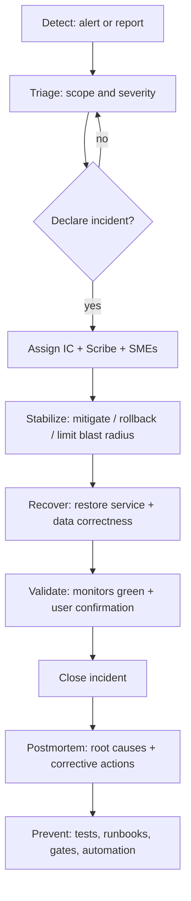

<!-- [KFM_META_BLOCK_V2]
doc_id: kfm://doc/d9b1d3c3-1e95-4d67-a2f1-83fa1a7e30a9
title: Incident Runbooks
type: standard
version: v1
status: draft
owners: KFM Ops (TODO), Platform Eng (TODO)
created: 2026-03-02
updated: 2026-03-02
policy_label: restricted
related:
  - ../README.md
  - ../../README.md
tags: [kfm, runbook, incident, ops, governance]
notes:
  - This is the index + operating standard for incident response runbooks under docs/runbooks/incidents/.
  - Replace TODO placeholders (paging, comms channels, owners) before marking as published.
[/KFM_META_BLOCK_V2] -->

# Incident Runbooks


Standard operating procedures for detecting, triaging, mitigating, and learning from incidents affecting the Kansas Frontier Matrix (KFM).

---

## Navigate
- [What belongs here](#what-belongs-here)
- [Quick start](#quick-start-first-15-minutes)
- [Incident lifecycle](#incident-lifecycle)
- [Severity model](#severity-model)
- [Roles](#roles)
- [Communication](#communication)
- [Evidence, audit, and redaction](#evidence-audit-and-redaction)
- [Triage matrix](#triage-matrix-by-subsystem)
- [Mitigation patterns](#mitigation-patterns)
- [Closeout definition of done](#closeout-definition-of-done)
- [Templates](#templates)
- [Directory layout](#recommended-directory-layout)
- [Contributing](#contributing)
- [Glossary](#glossary)

---

## What belongs here
This directory is the **incident response** part of `docs/runbooks/`.

### Purpose
Provide **repeatable, testable** steps to:
- stop the bleeding (mitigate),
- preserve evidence,
- restore service safely,
- prevent recurrence via corrective actions.

### Where it fits
KFM is built as a governed, evidence-first platform with a strict “truth path” lifecycle and a policy-enforcing “trust membrane.” These runbooks exist to keep incident response aligned with those invariants. *(See repo governance guide.)*

### Acceptable inputs
- **Runbooks** for specific incident classes (API outage, pipeline failures, policy/authorization issues, indexing issues, etc.)
- **Templates** for incident logs, postmortems, status updates
- **Checklists** and “first X minutes” procedures
- **Links** to dashboards, alerts, and operational commands **without embedding secrets**

### Exclusions
- ❌ secrets (API keys, tokens, private URLs, credentials)
- ❌ sensitive site coordinates or “how to target” content
- ❌ ad-hoc tribal knowledge that isn’t reproducible (convert into a runbook or delete)
- ❌ implementation details that bypass governance boundaries (e.g., “hit the database directly from the UI”)

[Back to top](#incident-runbooks)

---

## Quick start: first 15 minutes
> **Goal:** establish control, reduce harm, preserve evidence, and set a predictable cadence.

### 0–5 minutes: stabilize and declare
- [ ] **Confirm impact** (who/what is broken, blast radius, when it started)
- [ ] **Declare an incident** (don’t wait for perfect certainty)
- [ ] Assign roles (minimum):
  - [ ] **IC** (Incident Commander)
  - [ ] **Scribe**
- [ ] Start an incident log using the [Incident Log Template](#templates)
- [ ] Create incident comms channel (TODO: define your platform naming convention)
- [ ] Freeze risky change streams if needed (deploys, promotions) *(prefer reversible pauses over invasive hotfixes)*

### 5–15 minutes: triage + first mitigation
- [ ] Identify likely subsystem(s) using the [Triage Matrix](#triage-matrix-by-subsystem)
- [ ] Collect initial evidence:
  - [ ] alert IDs
  - [ ] logs (bounded time window)
  - [ ] dashboard snapshots/links
  - [ ] recent deploys/promotions/config changes
- [ ] Choose **one** mitigation path:
  - [ ] rollback / revert
  - [ ] feature-flag / kill-switch
  - [ ] capacity / rate-limits
  - [ ] quarantine data artifact(s)
- [ ] Post first status update (even if “investigating”) per [Communication](#communication)

⚠️ **Do not “fix by bypassing governance.”** If a mitigation requires bypassing policy boundaries, treat that as a high-risk action and record explicit authorization + rationale in the incident log.

[Back to top](#incident-runbooks)

---

## Incident lifecycle


[Back to top](#incident-runbooks)

---

## Severity model
**PROPOSED default.** Align with org-wide incident policy if you already have one.

| Sev | User impact | Typical triggers | Target response | Update cadence |
|---:|---|---|---|---|
| SEV-0 | Safety / security catastrophe; uncontrolled data exposure; critical infrastructure compromise | credential leak, mass policy bypass | immediate | 15 min |
| SEV-1 | Major outage or data integrity risk; broad user impact | API down, auth broken, promotion gates failing | immediate | 30 min |
| SEV-2 | Partial outage / degraded service; limited blast radius | tiles stale, slow queries, a pipeline stuck for key dataset | < 30 min | 60 min |
| SEV-3 | Minor degradation; workaround exists | non-critical job failures | next business day | daily |
| SEV-4 | Informational / near-miss | alert noise, transient blip | as needed | as needed |

✅ **Rule:** If you’re debating between two severities, choose the higher until proven otherwise.

[Back to top](#incident-runbooks)

---

## Roles
Minimum viable incident team (scale up as needed):

| Role | Responsibilities | Notes |
|---|---|---|
| Incident Commander (IC) | owns decisions, priorities, coordination, escalation | should avoid hands-on debugging once team scales |
| Scribe | captures timeline, decisions, hypotheses, mitigations, evidence links | log quality determines postmortem quality |
| Tech Lead / Primary Responder | drives technical investigation and mitigation | can delegate to SMEs |
| SME(s) | subsystem expertise (ingest, policy, API, UI, infra, data) | pull in early for SEV-1+ |
| Comms Lead | internal/external updates, stakeholder sync | optional for SEV-2+ |
| Liaison (Gov/Policy) | ensures actions respect policy labels & redaction obligations | required when data sensitivity is in play |

[Back to top](#incident-runbooks)

---

## Communication
### Channels
**TODO: customize.** Document the “blessed” tooling here (Slack/Teams, PagerDuty, Statuspage, etc.).

- Incident channel naming (example): `#kfm-inc-YYYYMMDD-short-slug`
- Bridge (example): “KFM Incident Bridge” (link / dial-in in your internal system)

### Update content standard
Every update should include:
- **What we know:** symptoms + scope
- **What we’re doing:** top 1–2 actions in progress
- **What’s next:** next checkpoint time
- **Risk:** customer/data risk callout
- **ETA:** only if confident; otherwise “next update at <time>”

### Stakeholders
**TODO:** add a stakeholder matrix (who must be notified by severity).

[Back to top](#incident-runbooks)

---

## Evidence, audit, and redaction
KFM is **evidence-first** and **policy-governed**. Treat incident handling as a governed activity.

### What to capture (minimum)
- Incident log (timeline + decisions + mitigations)
- Alert IDs, dashboards, and raw logs (bounded time range)
- Change history:
  - deploy IDs / commits
  - config changes
  - data promotions / pipeline runs
- Impact summary: who/what, time window, data products affected
- Recovery verification: what checks proved “fixed”

### Redaction rules of thumb
- If content is **restricted** or **sensitive**, prefer:
  - coarse geography (county/region) over exact coordinates,
  - aggregated counts over record-level detail,
  - “describe the class of issue” over “here is the exploit path.”

### Evidence linking
When possible, link evidence as **immutable artifacts** (logs, receipts, snapshots) rather than copying/pasting volatile text into chat.

> TIP: If your repo supports EvidenceRefs / EvidenceBundles, link them directly from the incident log so every claim in the postmortem stays traceable.

[Back to top](#incident-runbooks)

---

## Triage matrix by subsystem
Use this to decide **where to look first**. Replace TODO tool references with real dashboards/commands.

| Subsystem | Common symptoms | First checks | Safe first mitigations |
|---|---|---|---|
| **apps/api** (governed API / PEP) | 5xx, auth failures, high latency | gateway metrics, recent deploys, policy decision logs | rollback, rate-limit, disable expensive endpoints |
| **packages/policy** (OPA/Rego integration) | “deny all” / “allow all”, obligation failures | policy bundle version, regression tests, audit logs | rollback policy bundle, fail-closed defaults, isolate risky routes |
| **packages/ingest** (pipelines/connectors) | upstream fetch failures, queues backing up | scheduler status, connector logs, upstream health | pause promotions, rerun with safe config, quarantine outputs |
| **packages/catalog** (DCAT/STAC/PROV builds) | missing items, broken catalogs | catalog build logs, validation reports | rebuild catalog from last known good PROCESSED |
| **packages/indexers** (search/tiles) | stale tiles, missing search results | indexer job status, tile cache metrics | rebuild index, purge specific cache keys (targeted) |
| **apps/ui** (Map/Story/Focus UI) | blank map, broken UI flows | frontend error logs, API dependency checks | feature-flag off new UI, serve degraded mode |
| **data zones** (RAW/WORK/PROCESSED/PUBLISHED) | integrity mismatch, wrong version served | dataset version metadata, promotion receipts | quarantine bad version, roll back pointers to prior version |
| **infra** (K8s/compute/storage) | node pressure, pod crashloops | cluster status, events, resource saturation | scale, restart safely, rollback infra changes |

⚠️ If the incident involves **data correctness**, prioritize **preventing further promotion/publishing** until you can prove integrity.

[Back to top](#incident-runbooks)

---

## Mitigation patterns
Prefer mitigations that are:
1) reversible, 2) targeted, 3) policy-compliant, 4) evidenced in the incident log.

### Common options
- **Rollback** to last known good deploy
- **Feature flags / kill switches** for risky paths
- **Rate limiting** to reduce cascading failure
- **Quarantine** suspicious data artifacts (keep for analysis; stop serving)
- **Rebuild** derived artifacts (catalogs, indexes, tiles) from stable sources
- **Freeze promotions** when gates are unclear or failing

[Back to top](#incident-runbooks)

---

## Closeout definition of done
Before closing:
- [ ] Customer/user impact is resolved (or documented workaround accepted)
- [ ] Monitoring shows stability for an agreed window (TODO: define)
- [ ] Known-bad changes are rolled back or replaced with a reviewed fix
- [ ] Data integrity verified (if applicable) with explicit checks listed
- [ ] Incident log is complete and stored in the agreed location
- [ ] Postmortem scheduled (SEV-0/1 required; SEV-2 recommended)
- [ ] Action items created with owners + due dates
- [ ] Runbooks/tests updated if gaps were discovered

[Back to top](#incident-runbooks)

---

## Templates
### Incident log template
```md
# Incident Log — <INCIDENT_TITLE>
- Incident ID: <ID/TICKET>
- Severity: <SEV-X>
- Status: Investigating | Mitigating | Monitoring | Resolved
- Start time (local): <YYYY-MM-DD HH:MM TZ>
- End time (local): <YYYY-MM-DD HH:MM TZ>
- IC: <name>
- Scribe: <name>
- Primary responder: <name>
- Stakeholders notified: <list>

## Impact
- Who is impacted:
- What is impacted:
- Symptoms:
- First observed:
- Business/customer risk:

## Timeline (append-only)
- <time> — Declared incident. Initial symptoms: ...
- <time> — Hypothesis: ...
- <time> — Action: rollback <ref>. Result: ...
- <time> — Evidence: <links to dashboards/logs/receipts>

## Current hypotheses (ranked)
1. ...
2. ...

## Mitigations attempted
- Mitigation:
  - Why:
  - How:
  - Result:
  - Evidence link:

## Recovery validation
- Checks performed:
- Monitors:
- User confirmation:

## Notes / decisions
- Decision:
- Rationale:
- Risk:
```

### Postmortem template
```md
# Postmortem — <INCIDENT_TITLE>
- Incident ID:
- Severity:
- Date:
- Authors:
- Reviewed by:
- Status: Draft | In Review | Published
- Policy label: <public|restricted|...>

## Executive summary
What happened, impact, and resolution in 5–10 sentences.

## Customer/user impact
- Impact window:
- Who/what:
- Severity justification:
- Detection method:

## Root causes
List root causes with evidence links.

## Contributing factors
What made it worse or harder to detect/resolve.

## What went well
- ...

## What didn’t go well
- ...

## Timeline (condensed)
- ...

## Corrective and preventive actions (CAPA)
| Action | Type (prevent/detect/mitigate) | Owner | Due date | Status | Evidence of completion |
|---|---|---|---|---|---|

## Evidence bundle
Links to logs, receipts, dashboards, commits, and any redacted artifacts.
```

[Back to top](#incident-runbooks)

---

## Recommended directory layout
**PROPOSED** structure (add files as you mature the incident program):

```text
docs/runbooks/incidents/                                 # Incident runbooks (triage, severity, comms, subsystem playbooks)
├─ README.md                                             # This file: index + standards + “how to use during an incident”
├─ triage.md                                             # TODO: general triage steps (detect → scope → mitigate → verify → document)
├─ severity.md                                           # TODO: org-aligned severity policy (definitions, escalation, time targets)
├─ communication.md                                      # TODO: comms templates + cadence (internal/external, update intervals)
│
├─ templates/                                            # Copy/paste templates used during/after incidents
│  ├─ incident-log.template.md                           # Incident log template (timeline, actions, decisions, evidence links)
│  └─ postmortem.template.md                             # Postmortem template (root cause, contributing factors, follow-ups)
│
├─ subsystems/                                           # Subsystem-specific incident playbooks (what to check + how to mitigate)
│  ├─ api.md                                             # TODO: governed API outages (health, dependencies, rollback, safe errors)
│  ├─ policy.md                                          # TODO: OPA/policy incidents (parity, bundle deploys, deny-all posture)
│  ├─ ingest.md                                          # TODO: pipeline incidents (stuck runs, retries, backfills, receipts)
│  ├─ catalog.md                                         # TODO: catalog build/validation incidents (triplet integrity, linkcheck, regen)
│  ├─ indexers.md                                        # TODO: search/tiles index incidents (drift, rebuilds, freshness checks)
│  ├─ ui.md                                              # TODO: UI incidents (deploy regressions, caching, feature flags)
│  └─ data-integrity.md                                  # TODO: correctness/promotion incidents (bad publish, quarantine, rollback/supersede)
│
└─ checklists/                                           # Short checklists to keep response consistent under pressure
   ├─ first-15-minutes.md                                # TODO: quick-start breakdown (stabilize, assess, escalate, start log)
   └─ closeout-dod.md                                    # TODO: closeout DoD (verification, comms, receipts, postmortem scheduling)
```

[Back to top](#incident-runbooks)

---

## Contributing
### Quality bar (minimum)
- **Reproducible:** steps work from a clean checkout with declared prerequisites
- **Fail-closed:** if uncertain, instructions must default to safer outcomes
- **Evidence-aware:** include what evidence to capture at each step
- **Policy-compliant:** no secrets; no sensitive location disclosure
- **Testable:** where possible, add a verification step (“expected result”)

### PR checklist
- [ ] Runbook includes scope + “when to use”
- [ ] Uses consistent severity and role language
- [ ] Includes at least one “verification” step
- [ ] Includes redaction guidance if handling sensitive data
- [ ] Links to follow-up issues for automation opportunities

[Back to top](#incident-runbooks)

---

## Glossary
- **IC:** Incident Commander
- **SEV:** severity level
- **Trust membrane:** governed access boundary; clients use APIs, not storage
- **Truth path:** lifecycle from upstream ingestion through publishable artifacts
- **Promotion gates / contract:** checks required before publishing data
- **Evidence bundle:** immutable references to logs, receipts, and artifacts supporting claims

[Back to top](#incident-runbooks)
