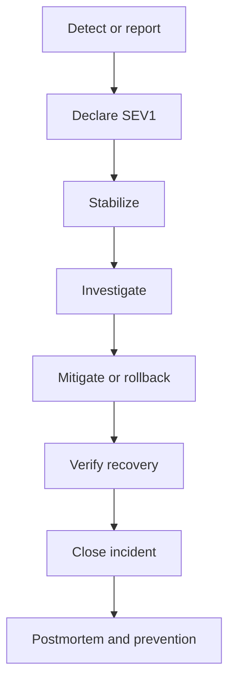

<!-- [KFM_META_BLOCK_V2]
doc_id: kfm://doc/75a4ca3d-ac94-49d3-8d62-d655103754b3
title: Incident Runbook — SEV1
type: standard
version: v1
status: draft
owners: Platform/SRE (TBD)
created: 2026-03-02
updated: 2026-03-02
policy_label: restricted
related:
  - docs/runbooks/incidents/rb-incident-sev2.md
  - docs/runbooks/incidents/rb-incident-comms.md
  - docs/runbooks/incidents/rb-incident-postmortem.md
  - docs/ops/watchers/registry.yml
  - docs/governance/safety_checks.md
tags: [kfm, runbook, incident, sev1, operations]
notes:
  - This runbook treats incident response as a governed workflow: evidence captured, decisions logged, and policy respected.
[/KFM_META_BLOCK_V2] -->

# 🚨 Incident Runbook — SEV1 (Critical)


**Purpose:** Provide a repeatable, policy-aware procedure to restore service and protect the trust membrane during a **SEV1** incident.

> [!WARNING]
> **Life safety / emergency:** if this incident involves immediate danger to people or property, follow your organization’s emergency procedures first (e.g., call 911 in the US), then continue with this runbook.

---

## Quick navigation

- [Definition](#definition)
- [KFM invariants](#kfm-invariants)
- [Declare & staff the incident](#declare--staff-the-incident)
- [First 15 minutes checklist](#first-15-minutes-checklist)
- [Evidence capture requirements](#evidence-capture-requirements)
- [Stabilization playbooks](#stabilization-playbooks)
- [Recovery verification](#recovery-verification)
- [Closeout & post-incident](#closeout--post-incident)
- [Appendix: templates](#appendix-templates)
- [Minimum verification steps](#minimum-verification-steps)

---

## Definition

### What is a SEV1?

A **SEV1** is an incident that is **actively harming** one or more of these:

- **Availability:** KFM’s governed APIs, catalog, or critical pipelines are down or unusably degraded for most users.
- **Integrity:** published artifacts, catalogs, receipts, or projections (e.g., PostGIS/search) are corrupted or demonstrably wrong in a way that can mislead users.
- **Governance / policy:** the trust membrane is bypassed, policy enforcement is failing open, or sensitive material may be exposed.
- **Blast radius:** impact is widespread (multiple datasets, multiple core services, or public-facing UI).

> [!NOTE]
> This severity rubric is **PROPOSED** unless your repo defines an official SEV model. Tune to your org’s SLOs and legal/compliance requirements.

### Incident lifecycle



---

## KFM invariants

These are non-negotiable “trust membrane” constraints that should guide incident decisions.

### Confirmed (from KFM design docs)

- **Serving is governed:** UI/clients must not bypass policy; data access is mediated by the backend API boundary.
- **Canonical flow:** data follows a truth path (e.g., RAW → WORK → PROCESSED → CATALOG/PROV → DATABASE/PROJECTIONS → API → UI).
- **Only eligible artifacts are served:** runtime should serve only **processed + cataloged** artifacts.
- **Integrity is digest-based:** artifacts have digests and appear in a manifest/checksum record.
- **Projections are rebuildable:** PostGIS/search/tiles are projections; do not “fix data in place” if source-of-truth artifacts are intact.

### Practical implications during SEV1

- Prefer **rollback / rebuild** over manual edits.
- If policy is uncertain: **fail closed** (deny/unavailable) rather than risk leakage.
- Preserve evidence so post-incident analysis can be reproduced from receipts + catalogs.

---

## Declare & staff the incident

### Declare early

Declaration is a coordination primitive. Be explicit.

**Declaration format (copy/paste):**
```text
DECLARING SEV1 INCIDENT
Summary: <one sentence>
User impact: <who/what is broken>
Start time (UTC): <YYYY-MM-DD HH:MM>
IC: <name/handle>
Ops Lead: <name/handle>
Comms Lead: <name/handle or "TBD">
Scribe: <name/handle or "TBD">
Bridge: <link or meeting ID>
Primary channel: <#channel or thread link>
```

### Minimal roles (ICS-style)

Fill these immediately; one person may hold multiple roles in a small response.

| Role | Primary job | Must do |
|---|---|---|
| **Incident Commander (IC)** | Owns outcomes and pace | Declare incident; set goals; manage scope |
| **Ops Lead (OL)** | Owns technical execution | Drive investigation & mitigation; coordinate SMEs |
| **Comms Lead (CL)** | Owns messaging | Status updates; stakeholder alignment; reduce rumor risk |
| **Scribe** | Owns the timeline | Decision log; timestamps; action tracker; links |

> [!TIP]
> When in doubt: **assign a scribe**. Your future self (and postmortem) depend on it.

---

## First 15 minutes checklist

### Minute 0–5 (contain chaos)

- [ ] **Declare SEV1** and assign IC/OL/CL/Scribe.
- [ ] **Freeze blast radius:** pause risky deploys and promotions until IC explicitly re-enables.
- [ ] Establish the **single source of truth**: the incident channel + a shared doc for timeline.
- [ ] Confirm whether incident is **security/sensitivity related**. If yes:
  - [ ] Move details to a restricted channel (policy_label: restricted).
  - [ ] Pull in Security/Privacy lead immediately.

### Minute 5–15 (stop the bleeding)

- [ ] State **current hypothesis** in one sentence.
- [ ] State the **primary objective**: “restore safe serving” vs “stop data corruption” vs “re-establish policy enforcement”.
- [ ] Identify **top 1–2 levers** (rollback, restart, disable feature, revert dataset version, rebuild projection).
- [ ] Start **evidence capture** (links, logs, receipts) before systems roll or logs rotate.

---

## Evidence capture requirements

KFM is evidence-first: incident response should preserve the trust membrane and produce artifacts that can be audited.

### Required artifacts (minimum)

Create an incident folder in your incident system and collect:

- **Timeline** with precise timestamps (**UTC preferred**; include America/Chicago if needed).
- **Symptom evidence:** alerts, graphs, request IDs, error examples, user reports.
- **Change evidence:** deploy SHAs, pipeline run IDs, config diffs, feature flag changes.
- **Data integrity evidence (if applicable):** affected dataset_version_id(s), artifact digests, catalog links.
- **Decision log:** what we did, why, who approved.

> [!IMPORTANT]
> If you can’t produce evidence for a claim (“X is broken because Y”), label it as **Hypothesis** and keep searching.

### KFM-specific evidence to capture (when relevant)

- Pipeline **receipts / PROV records** (immutable run records).
- **Catalog artifacts** (STAC/DCAT/PROV) and their validation outputs.
- **Attestation/signing evidence** (e.g., cosign-style records) if checks fail.
- The **truth path** locations for affected datasets (processed artifacts, manifests, checksums).

---

## Stabilization playbooks

Pick the **smallest** action that reduces harm quickly and is reversible.

### A) Governed API outage / severe degradation

**Goal:** Restore safe serving for core endpoints, even if degraded.

Checklist:

- [ ] Confirm scope: all endpoints vs specific routes (search vs STAC vs dataset list).
- [ ] If policy enforcement is suspect: **fail closed** (prefer returning “denied/unavailable” over leaking).
- [ ] Roll back the last deploy if correlated with onset (IC approval).
- [ ] Verify dependencies (DB/search) are healthy **as projections** (rebuildable).
- [ ] Validate a known-good endpoint path end-to-end (API → evidence resolution → response).

### B) Pipeline/connector failure blocks ingest or processing

**Goal:** Resume safe ingest/processing without mutating existing artifacts.

Checklist:

- [ ] Identify the failing connector/job and capture its logs and inputs.
- [ ] If this blocks publication: pause downstream promotions/publishing.
- [ ] Re-run the ingestion/processing path using the repo’s rebuild tooling (example referenced: `scripts/rebuild`) *(verify path exists)*.
- [ ] Confirm that transforms do **not** mutate inputs; new outputs should be new artifacts with new digests.
- [ ] Re-run validations and attach outputs to the incident record.

### C) Catalog generation failure (CatGen / STAC/DCAT/PROV invalid)

**Goal:** Prevent publishing broken catalogs; restore catalog integrity.

Checklist:

- [ ] Stop any pipeline step that would publish invalid catalogs.
- [ ] Recover by re-running catalog generation (CatGen) after fixing the root cause.
- [ ] Run catalog validators in CI / locally and keep the output in the incident folder.
- [ ] If publication already happened: **revert** to the last known-good dataset version + catalog set.

### D) Receipt / attestation verification failures (supply chain / integrity gate)

**Goal:** Determine if this is a real integrity failure vs a verification/config regression.

Checklist:

- [ ] Identify which step’s receipt/attestation failed (fetch, transform, publish, rebuild).
- [ ] Capture failing verification output verbatim (do not paraphrase).
- [ ] Check for artifact digest mismatch (checksums/manifests vs referenced artifacts).
- [ ] Consult signing/verification records (e.g., cosign logs/records) to locate mismatch or missing attestation.
- [ ] If you cannot restore verification quickly: **halt promotions** and serve only previously verified artifacts.

### E) Projection corruption (PostGIS/search/tiles) causing wrong answers

**Goal:** Restore projections by rebuilding from catalogs + processed artifacts (do not “fix data in place”).

Checklist:

- [ ] Confirm that the **source of truth** (processed artifacts + catalogs + receipts) is intact.
- [ ] Rebuild the broken projection(s) from catalog + digests.
- [ ] Validate counts/extents match catalog metadata.
- [ ] Record a rebuild receipt / audit entry for the rebuild run.

#### Rebuild algorithm (high level)

```text
1) Read catalogs for a dataset_version_id
2) Locate processed artifacts by digest/path
3) Load into projections (PostGIS, search, graph, tile caches)
4) Validate counts and extents against catalog metadata
5) Record a rebuild receipt in the audit ledger
```

### F) Data integrity incident (published dataset wrong / misleading)

**Goal:** Stop serving misleading outputs; restore to a verified dataset version.

Checklist:

- [ ] Identify affected dataset_version_id(s) and what *claim* is wrong.
- [ ] Confirm whether the problem is:
  - [ ] upstream data quality
  - [ ] ingestion/normalization bug
  - [ ] QA gate regression (thresholds too lax)
  - [ ] projection bug (source data is fine; projection is wrong)
- [ ] If harm is plausible: **rollback publication** to the last known-good version.
- [ ] Preserve evidence: sample records, diffs, QA summaries, receipts.
- [ ] Create follow-up to add/strengthen QA gates so this fails closed next time.

### G) Policy / sensitivity incident (possible exposure or fail-open)

**Goal:** Contain exposure, re-establish fail-closed policy, and preserve forensic evidence.

Checklist:

- [ ] Treat details as **restricted**; limit dissemination.
- [ ] Engage Security/Privacy lead and follow legal/compliance processes.
- [ ] Disable affected endpoints/features or force deny until policy is correct.
- [ ] Preserve logs and access trails (who accessed what, when).
- [ ] After containment: rotate credentials/keys as required by your security policy.

---

## Recovery verification

### “We are recovered” definition (SEV1 exit criteria)

All must be true:

- [ ] User impact resolved or reduced to an agreed degraded mode.
- [ ] Policy enforcement is confirmed **fail-closed** for restricted resources.
- [ ] For affected datasets: serving path resolves from **catalog + processed artifacts** to API responses without inconsistencies.
- [ ] Monitoring shows stability for a sustained window (define window per SLOs).
- [ ] Incident timeline and key evidence links are complete enough to write a postmortem.

---

## Closeout & post-incident

### Close the incident

- [ ] IC announces **incident resolved** with timestamp (UTC).
- [ ] CL sends final status update + next steps (postmortem owner, ETA).
- [ ] Scribe ensures the incident doc has:
  - [ ] start/end times
  - [ ] root cause (or “pending”)
  - [ ] mitigations applied
  - [ ] links to receipts / diffs / dashboards

### Post-incident deliverables (within 3–5 business days)

- [ ] Postmortem written and reviewed (blameless; evidence-based).
- [ ] Action items filed, prioritized, and assigned owners.
- [ ] Update runbooks and add regression tests/guards:
  - [ ] policy tests (fail closed)
  - [ ] catalog validators
  - [ ] QA thresholds
  - [ ] rebuild pipeline checks

---

## Appendix: templates

### A1) IC meeting agenda (kickoff)

```text
1) Assign a scribe.
2) Introductions (name, team, role).
3) Rules of engagement:
   - confidentiality / operational security constraints
   - who makes decisions
   - how to signal task switches
4) Current status: what problem are we solving?
5) Discuss and converge on next actions.
6) Summarize actions + owners.
7) Ask: more resources needed? other groups? roadblocks?
8) Set next sync time and required vs optional attendees.
```

### A2) Status update template (internal)

```text
[SEV1] <short incident name> — Update <#>

Time (UTC): <YYYY-MM-DD HH:MM>
Status: Investigating | Mitigating | Monitoring | Resolved
Impact: <who/what/how big>
Current hypothesis: <1 sentence>
What we did since last update: <bullets>
Next steps (with owners): <bullets>
Risks/unknowns: <bullets>
Next update: <time>
```

### A3) Postmortem skeleton (blameless)

```text
Title:
Date:
Incident Start (UTC):
Incident End (UTC):
SEV:

Customer/User impact:
Root cause:
Trigger:
Detection:
Resolution:

Timeline (UTC):
- ...

What went well:
What went poorly:
Where we got lucky:

Action items:
- [ ] <action> (Owner: <name>, Due: <date>, Priority: <P0/P1/...>)
```

---

## Minimum verification steps

This runbook includes a few repo-specific identifiers referenced in design documents (e.g., `scripts/rebuild`, `CatGen`, receipt/attestation tooling). Before relying on them in production:

- [ ] Confirm the **actual** rebuild/re-ingest command(s) and path(s) in the repo.
- [ ] Confirm where receipts/PROV records live and what IDs to use to find them.
- [ ] Confirm how to pause/resume promotions/publishing (CI gate, workflow toggle, etc.).
- [ ] Confirm who owns Security/Privacy escalation and what channel/process is required.
- [ ] Confirm the preferred incident comms channel(s) and stakeholder list.

---

## Sources and rationale (internal)

- **Runbook coverage expectations** (restart failed ETL jobs, reissue receipts, rollback bad dataset, recover catalog by re-running CatGen; rebuild via scripts/rebuild; consult cosign records).  
- **Incident command fundamentals** (declare, assign IC/ops lead, strong comms, scribe, meeting agendas).  
- **KFM governance invariants** (trust membrane; “projections are rebuildable”; do not fix data in place; rebuild from catalogs and digests; record rebuild receipts).
