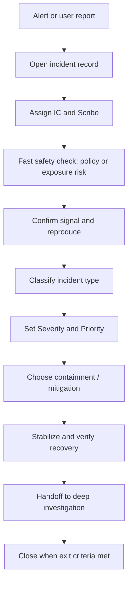

<!-- [KFM_META_BLOCK_V2]
doc_id: kfm://doc/7ce9b1de-8c1c-4a68-acde-9df4a9f1b0d3
title: Incident Triage Runbook
type: standard
version: v1
status: draft
owners: Platform Ops, Data Stewardship, Policy Stewardship
created: 2026-03-02
updated: 2026-03-02
policy_label: restricted
related:
  - docs/runbooks/incidents/
tags: [kfm, runbook, incidents, triage]
notes:
  - This runbook is KFM-specific: prioritize trust membrane + promotion contract + cite-or-abstain safety.
  - Commands/paths are placeholders unless verified in-repo; keep this doc additive and reversible.
[/KFM_META_BLOCK_V2] -->

# Incident Triage Runbook (rb-incident-triage)

**Purpose:** Rapidly intake, classify, and stabilize incidents affecting **KFM’s governed data pipeline and user-facing surfaces** (Map / Story / Focus Mode) *without breaking governance invariants*.

   

---

## Quick navigation

- [When to use this runbook](#when-to-use-this-runbook)
- [Non-negotiable KFM invariants](#non-negotiable-kfm-invariants)
- [Roles](#roles)
- [Severity and priority](#severity-and-priority)
- [Triage workflow](#triage-workflow)
- [First 15 minutes checklist](#first-15-minutes-checklist)
- [Symptom guide](#symptom-guide)
- [Communications](#communications)
- [Evidence, audit, and artifacts](#evidence-audit-and-artifacts)
- [Containment and mitigation patterns](#containment-and-mitigation-patterns)
- [Exit criteria and handoff](#exit-criteria-and-handoff)
- [Appendix: templates](#appendix-templates)

---

## When to use this runbook

Use this runbook for any unplanned event where **KFM is not behaving as designed** in one of these ways:

- **Availability:** API/UI/tiles/search/catalog endpoints are down or degraded.
- **Integrity:** A digest/signature mismatch, missing artifacts, broken catalog cross-links, or evidence resolver failures.
- **Governance/policy:** Suspected leakage of restricted data, missing redactions/generalizations, or bypass of governed APIs.
- **Data correctness:** Wrong dataset version served, stale projections, incorrect time windows/bboxes, or failed QA thresholds.
- **Focus Mode safety:** Answers produced without verifiable citations, or citation resolution/verification is failing.

> **NOTE:** This is **triage** (rapid assessment + stabilization). Deep root-cause analysis happens *after* stabilization.

[Back to top](#incident-triage-runbook-rb-incident-triage)

---

## Non-negotiable KFM invariants

These are the rules you **do not waive during an incident**. If you must choose between “restore service fast” and “preserve trust,” **preserve trust**.

### Truth path lifecycle and promotion gates

KFM uses a lifecycle of zones (Upstream → RAW → WORK/Quarantine → PROCESSED → CATALOG/TRIPLET → PUBLISHED). Promotion gates apply at transitions; runtime services and UI surfaces should only serve **promoted** artifacts.

### Trust membrane

KFM’s trust membrane means:

- clients (frontend/external) **do not** access databases/object stores directly
- all access goes through the governed API boundary where policy + logging are applied consistently
- core backend logic uses repository interfaces instead of bypassing storage

### Evidence-first UX and cite-or-abstain

- Evidence resolution is central: **EvidenceRefs must resolve to EvidenceBundles**, and policy is applied before returning bundles.
- Focus Mode must **cite or abstain**, with **hard citation verification** before returning an answer.

> **WARNING:** If a bug/regression could cause *policy leakage*, treat it as a **security incident** and **fail closed**.

[Back to top](#incident-triage-runbook-rb-incident-triage)

---

## Roles

Minimum roles for most incidents:

- **IC (Incident Commander):** owns coordination, decisions, escalation, and tempo.
- **Scribe:** maintains timeline + action log (single source of truth).
- **Ops Lead:** executes mitigations (deploy/rollback/restart), coordinates with platform/SRE.
- **Data Steward:** validates dataset-level impacts (versions, artifacts, QA, catalogs).
- **Policy Steward / Security Liaison:** assesses policy labels/obligations, exposure risk, and disclosure requirements.
- **Comms Lead:** provides status updates to stakeholders (internal/external as appropriate).

> **TIP:** If you can’t staff every role, always staff **IC + Scribe** first.

[Back to top](#incident-triage-runbook-rb-incident-triage)

---

## Severity and priority

Use **both**:
- **Severity** = *impact* (what is harmed)
- **Priority** = *tempo* (how fast we must respond)

### Severity scale (suggested)

| Severity | Meaning (KFM-specific) | Examples |
|---:|---|---|
| **S0** | Critical impact or high-risk exposure | Restricted data exposure, trust membrane bypass, widespread outage |
| **S1** | Major impact | Map/Story/Focus Mode broadly unusable; catalogs/evidence not resolving for most users |
| **S2** | Moderate impact | Single major capability impaired; one region/dataset family broken |
| **S3** | Minor impact | Localized issues; degraded performance; partial staleness |
| **S4** | Low / informational | False positive; cosmetic; non-production |

### Priority scale (suggested)

| Priority | Tempo | Working expectation |
|---:|---|---|
| **P0** | Immediate | Drop other work; active response now |
| **P1** | Urgent | Same day; sustained attention |
| **P2** | High | Next business day; tracked fix |
| **P3** | Normal | Queue; schedule into sprint |
| **P4** | Low | Backlog / observation |

> **NOTE:** Severity often stays stable; priority can change as the situation stabilizes (e.g., after a safe mitigation is deployed).

[Back to top](#incident-triage-runbook-rb-incident-triage)

---

## Triage workflow



[Back to top](#incident-triage-runbook-rb-incident-triage)

---

## First 15 minutes checklist

### 0. Start the incident record (Scribe)

- [ ] Create an incident ticket / issue (or designated system record).
- [ ] Create an incident chat channel (or bridge) and add responders.
- [ ] Record **timestamps**:
  - [ ] detection time
  - [ ] first known bad time (estimate)
  - [ ] last known good time (estimate)
- [ ] Record **who reported** + contact route.

### 1. Staff the response (IC)

- [ ] Assign IC + Scribe (required).
- [ ] Assign Ops Lead and (if relevant) Data + Policy stewards.
- [ ] Set check-in cadence (e.g., every 15–30 min for P0/P1).

### 2. Do the fast safety check (IC + Policy Steward)

Ask:

- [ ] Could restricted/sensitive data be exposed?
- [ ] Could any client be bypassing the governed API (trust membrane breach)?
- [ ] Are we seeing missing redactions/generalizations?
- [ ] Are there indications of compromise (credentials, signing, policy tampering)?

If **yes / unsure**:
- [ ] **Fail closed** (disable endpoint/layer, restrict access, remove from catalog listing).
- [ ] Escalate to security + policy owners immediately.

### 3. Confirm the signal (Ops Lead)

- [ ] Confirm *scope*: prod vs staging? single region/dataset vs global?
- [ ] Capture the “minimum reproducible failure” (MRF):
  - [ ] request + parameters (bbox/time/layer)
  - [ ] user role/context (policy label outcomes matter)
  - [ ] exact error message + correlation IDs
- [ ] Snapshot the current deploy versions and config (commit SHA, image tags) **if available**.

### 4. Classify the incident (IC)

Pick one primary classification (you can add secondaries):

- **Availability**
- **Data pipeline / promotion**
- **Catalog / evidence resolution**
- **Policy / security**
- **Data correctness**
- **Focus Mode safety**

### 5. Decide next action (IC)

- [ ] Choose the safest containment that restores trustworthy behavior.
- [ ] Communicate intent + owner + ETA *only if you can support it* (otherwise communicate next update time).

[Back to top](#incident-triage-runbook-rb-incident-triage)

---

## Symptom guide

> **IMPORTANT:** The exact commands/dashboards vary by deployment. Treat command snippets as **placeholders** until verified in-repo.

### A) UI/Map is blank or layers fail to load

**Common first checks**
- Is the governed API reachable and returning policy-allowed responses?
- Is tile delivery returning errors (404/403/5xx)?
- Are catalogs discoverable (dataset listing + STAC collections/items)?

**Safe mitigations**
- Temporarily hide the affected layer(s) from public UI by policy/config.
- Roll back UI deploy if this correlates with a recent release.
- If tiles/projections are stale, rebuild projections from promoted artifacts (do not mutate canonical artifacts).

### B) Evidence drawer / Evidence resolver errors

**Common first checks**
- Can EvidenceRefs resolve to bundles?
- Are catalog cross-links valid (dataset_version_id + STAC/DCAT/PROV linkage)?
- Are policy decisions denying due to a recent policy change?

**Safe mitigations**
- Fail closed: if evidence is unresolvable, do not serve “best guess” content.
- If a specific dataset version is broken, remove it from PUBLISHED surfaces and roll back to the last known good promoted version.

### C) Focus Mode produces answers without citations, or citations fail

**Common first checks**
- Is citation verification running and enforcing a hard gate?
- Are retrieval results mapping back to EvidenceRefs that resolve?
- Are we handling prompt-injection attempts correctly (documents may contain malicious instructions)?

**Safe mitigations**
- Force Focus Mode to **abstain** (or reduce scope) if citations cannot be verified.
- Disable Focus Mode temporarily for public users if verification is compromised.

### D) Pipeline/promotion failures (catalog generation, QA gates, receipts)

**Common first checks**
- Which Promotion Contract gate failed? (identity/versioning, license, sensitivity, triplet validation, QA thresholds, receipts, release manifest)
- Did a specific dataset get quarantined (license/sensitivity uncertainty)?

**Safe mitigations**
- Keep failures in WORK/QUARANTINE; do not promote.
- Re-run the catalog generator and validators on the candidate dataset version.
- Roll back a bad promotion by reverting to a previous promoted dataset version and rebuilding projections.

### E) Suspected policy leakage / sensitive exposure

**Immediate actions**
- **Fail closed** (disable affected endpoints/layers; block dataset discovery if necessary).
- Preserve evidence: capture logs, requests, policy decision outputs, and the exact served payload (securely).
- Escalate to security + governance owners for disclosure and containment.

[Back to top](#incident-triage-runbook-rb-incident-triage)

---

## Communications

### Who needs updates?

- **Responders:** detailed, live updates.
- **Leadership:** concise updates: impact, progress, roadblocks, next update time.
- **Broader org:** only what’s necessary; avoid speculation and over-sharing.

### Update cadence

Suggested (adjust for your org):
- **P0:** every 15–30 minutes
- **P1:** hourly or at major milestones
- **P2+:** daily or per agreed schedule

### Status update template (copy/paste)

```
[INCIDENT] <title> — S? / P? — <date/time TZ>

Impact:
- Who/what is affected:
- User-visible symptoms:
- Scope (regions/datasets/features):

Current status:
- What we believe is happening:
- What we do NOT know yet:

Actions taken:
- <action> (owner) (time)
- <action> (owner) (time)

Next steps (next 30–60 min):
- <step> (owner)

Next update at: <time TZ>
```

[Back to top](#incident-triage-runbook-rb-incident-triage)

---

## Evidence, audit, and artifacts

### What to collect (minimum)

- Incident timeline (Scribe)
- Alert source + raw alert payload
- Reproduction steps (request params, user role/context)
- Logs with correlation IDs
- Policy decision traces (allow/deny + obligations applied)
- Affected dataset_version_id(s) and release identifiers
- EvidenceRefs/EvidenceBundles involved (bundle digests, audit_ref)

### Why this matters in KFM

KFM’s credibility depends on:
- reproducible run receipts / audit records
- resolvable evidence bundles
- policy decisions that can be reviewed

> **WARNING:** Do not “hotfix” by bypassing policy checks or serving uncited data. That breaks the trust membrane and creates an incident-within-an-incident.

[Back to top](#incident-triage-runbook-rb-incident-triage)

---

## Containment and mitigation patterns

### 1) Fail closed (preferred default)

Use when:
- policy correctness is uncertain
- evidence resolution is failing
- there is any suspicion of sensitive leakage

Mechanisms (examples; verify in your deployment):
- disable an endpoint
- remove a dataset version from discovery
- restrict a layer to privileged roles
- block a promotion to PUBLISHED

### 2) Roll back to last known good version

Use when:
- a recent deploy correlates with failure
- a promoted dataset version is broken

Principle:
- prefer rollback by selecting **a previously promoted dataset version** and rebuilding projections, rather than mutating canonical artifacts.

### 3) Rebuild projections safely

If DB/search/tiles are stale or corrupted:
- rebuild from canonical artifacts (object store + catalogs + provenance)
- keep the audit trail of the rebuild action

### 4) Re-run pipeline steps (stabilize)
If a connector/ETL job fails:
- restart the failed job
- reissue receipts if required
- regenerate catalogs and validate cross-links

[Back to top](#incident-triage-runbook-rb-incident-triage)

---

## Exit criteria and handoff

You can hand off triage to investigation (or close) when:

- [ ] User impact is stopped or bounded (safe degradation is acceptable).
- [ ] No evidence of ongoing policy leakage (or security has accepted residual risk with mitigations).
- [ ] A clear owner and plan exists for root-cause analysis + permanent fix.
- [ ] Incident record includes: timeline, actions, and references to artifacts/logs.
- [ ] Follow-up tasks are created (and prioritized).

[Back to top](#incident-triage-runbook-rb-incident-triage)

---

## Appendix: templates

### Incident kickoff agenda (15 minutes)

1. IC assigns a note taker (scribe).
2. Attendees introduce themselves (name, team, role).
3. Rules of engagement:
   - confidentiality / operational security constraints
   - who owns decisions; who must be involved
4. IC states current status: what problem are we solving?
5. Group discussion; IC summarizes actions + owners.
6. Decide next sync meeting time + who is required vs optional.

### In-progress sync agenda (10 minutes)

1. IC or Ops Lead summarizes current status.
2. Updates from each owner / thread of work.
3. Assign next steps; each owner repeats their understanding.
4. Set next meeting time(s); update action tracker.

### Investigation notes template (scribe)

```
Timeline:
- T-?  Last known good:
- T0   Detection:
- T+?  Mitigation deployed:
- T+?  Recovery verified:

Hypotheses:
- H1:
- H2:

Facts (evidence-backed):
- F1:
- F2:

Open questions:
- Q1:
- Q2:

Actions and owners:
- <action> — <owner> — <due>
```

[Back to top](#incident-triage-runbook-rb-incident-triage)
