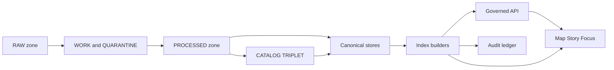

<!-- [KFM_META_BLOCK_V2]
doc_id: kfm://doc/8e1cc7cf-0c86-4d9d-a7f7-8e40d3b5a8ea
title: Index Backfill Runbook
type: standard
version: v1
status: draft
owners: TODO: Platform/Data Ops
created: 2026-03-02
updated: 2026-03-02
policy_label: restricted
related:
  - docs/runbooks/indexing/README.md
  - docs/runbooks/catalog/rb-catalog-rebuild.md
  - docs/runbooks/promotion/rb-promotion-contract.md
  - docs/policy/README.md
tags: [kfm, runbook, indexing, backfill, reindex, ops]
notes:
  - This runbook is written to align with KFM "canonical vs rebuildable stores" and "promotion contract" invariants.
  - Replace TODO placeholders with repo-verified commands, paths, and on-call escalation routes.
[/KFM_META_BLOCK_V2] -->

# rb-index-backfill — Index Backfill Runbook
**Purpose:** Rebuild (backfill) *rebuildable* indexing projections (PostGIS/search/graph/tiles) from **promoted canonical artifacts** in a controlled, auditable, fail-closed way.


> ⚠️ **Operator warning (trust membrane):**
> Indexes are projections. They can be dropped and rebuilt, but they must **never** become a shadow source of truth.
> If licensing/sensitivity/policy is unclear for any dataset version, **do not index it** (treat as quarantine / deny-by-default).

---

## Navigation
- [What this runbook covers](#what-this-runbook-covers)
- [Concept model](#concept-model)
- [Backfill triggers](#backfill-triggers)
- [Pre-flight checklist](#pre-flight-checklist)
- [Backfill plan](#backfill-plan)
- [Procedure](#procedure)
- [Validation](#validation)
- [Rollback](#rollback)
- [Troubleshooting](#troubleshooting)
- [Audit and run receipts](#audit-and-run-receipts)
- [Minimum verification steps](#minimum-verification-steps)
- [Appendix](#appendix)

---

## What this runbook covers
### In scope
Backfilling **rebuildable projections**, typically:
- **PostGIS projection tables** (derived from processed GeoParquet or equivalent)
- **Search index** (e.g., Elastic or other search store built from processed metadata/text)
- **Graph projection** (edges derived from catalogs + entity resolution outputs)
- **Tile bundles** (e.g., PMTiles derived from processed features)

### Out of scope
- Acquiring source data into RAW
- Promoting datasets through the Promotion Contract gates
- Rebuilding/repairing the canonical object storage itself
- Changing policy rules (OPA/Conftest), schemas, or contracts

> ✅ If your issue is “dataset isn’t visible / searchable”, do **not** start here.
> First confirm the dataset version is **promoted** and present in **Catalog/Triplet** (DCAT/STAC/PROV) with run receipts.

[Back to top](#navigation)

---

## Concept model



### Key invariants this runbook assumes
- **Only promoted dataset versions** should flow into runtime surfaces.
- Index builders are **rebuildable** and should rebuild from canonical artifacts.
- Deterministic, reproducible runs: inputs/outputs by digest; stable build steps (especially tiles).

[Back to top](#navigation)

---

## Backfill triggers

| Trigger | Typical symptoms | Backfill type |
|---|---|---|
| New dataset versions promoted | New layers appear but aren’t searchable / tile missing | Incremental (by dataset_version_id) |
| Index schema change | Search results wrong / mapping mismatch / API errors | Full rebuild (blue/green recommended) |
| Index store loss/corruption | 500s on search/tiles; missing tables | Full rebuild |
| Drift detected | Counts mismatch vs catalogs; stale tile pointers | Targeted rebuild (dataset or shard) |

[Back to top](#navigation)

---

## Pre-flight checklist

### 1) Governance and policy (fail closed)
- [ ] Confirm target dataset versions are **promoted** (not quarantined)
- [ ] Confirm each dataset version has:
  - [ ] processed artifacts
  - [ ] validated catalogs (DCAT/STAC/PROV)
  - [ ] run receipts and checksums
  - [ ] policy label assignment
- [ ] Confirm your run will not violate policy obligations (e.g., generalization/redaction)

### 2) Change safety
- [ ] Decide maintenance mode / traffic controls (if needed)
- [ ] Ensure you have an **atomic cutover** plan (aliases/renames/pointers)
- [ ] Ensure rollback is possible within your operational window

### 3) Determinism and reproducibility
- [ ] Confirm index builder image/version is pinned (digest preferred)
- [ ] Confirm backfill spec is fully specified (no “latest”, no clock-dependent outputs)
- [ ] Confirm tile generation uses stable inputs and stable floating point handling (where applicable)

### 4) Operational readiness
- [ ] Confirm capacity (CPU/RAM/disk/IO) and quotas
- [ ] Confirm locks/leases to prevent concurrent backfills
- [ ] Confirm audit logging destination and retention

[Back to top](#navigation)

---

## Backfill plan

### Define scope
Pick one:
- **Dataset-scoped:** one dataset_version_id (or a small set)
- **Time-scoped:** valid/event time window (only if supported by your index builder)
- **Full:** all promoted dataset versions

### Define targets
Pick one or more:
- `postgis`
- `search`
- `graph`
- `tiles`

### Choose cutover strategy (recommended default: blue/green)
| Strategy | Best for | How it works | Risk |
|---|---|---|---|
| Blue/green | Search index, tiles, graph | Build new, validate, then swap alias/pointer | Needs extra storage |
| In-place rebuild | Small tables, dev environments | Rebuild the existing index | Higher blast radius |
| Incremental append | Frequent small promotions | Index only “new versions” | Drift risk if history is wrong |

[Back to top](#navigation)

---

## Procedure

> **NOTE:** Command names below are **placeholders**. Replace with repo-verified equivalents.
> The core requirement is: **build projections from canonical promoted artifacts** and record a run receipt.

### Step 0 — Capture a run header (for the audit trail)
Record (at minimum):
- `run_id` (UUID)
- operator identity (who triggered)
- `spec_hash` (hash of backfill spec)
- target(s)
- dataset_version_id set (or selection query)
- builder image digest / version
- intended cutover method

### Step 1 — Enumerate eligible dataset versions (promoted-only)
**Goal:** produce a deterministic list of dataset_version_ids to index.

Example placeholders:
```bash
# TODO: replace with real command or query
kfmctl catalog list-promoted --format json > promoted_versions.json

# TODO: if doing a subset:
kfmctl catalog list-promoted --dataset <dataset_id> --format json > promoted_versions.json
```

### Step 2 — Build a plan / dry-run (no writes)
**Goal:** confirm what will be built, where, and expected outputs.

```bash
# TODO: replace with real command
kfmctl index backfill plan \
  --targets postgis,search,graph,tiles \
  --input promoted_versions.json \
  --out plan.json
```

**Plan must include:**
- canonical inputs by digest (processed artifacts + catalogs)
- output locations/identifiers (new schema/index name, tile bundle path, etc.)
- estimated size and runtime hints
- validation steps to run after build

### Step 3 — Execute build into *staging* (no user-facing cutover yet)

#### 3A) PostGIS projection (staging schema)
Recommended pattern:
1) Create `staging_schema`
2) Load from processed GeoParquet (or standardized processed artifacts)
3) Create spatial + attribute indexes
4) Run `ANALYZE`/stats
5) Validate counts/bounds

```bash
# TODO: replace with real command
kfmctl index backfill run --target postgis --mode bluegreen \
  --input promoted_versions.json \
  --staging postgis_schema_staging \
  --out postgis_receipt.json
```

#### 3B) Search index (staging index + alias swap)
Recommended pattern:
1) Create new index name (e.g., `kfm-search-<run_id>`)
2) Bulk ingest from processed metadata/text
3) Validate queries
4) Swap alias

```bash
# TODO: replace with real command
kfmctl index backfill run --target search --mode bluegreen \
  --input promoted_versions.json \
  --staging search_index_staging \
  --out search_receipt.json
```

#### 3C) Graph projection (staging graph namespace)
```bash
# TODO: replace with real command
kfmctl index backfill run --target graph --mode bluegreen \
  --input promoted_versions.json \
  --staging graph_namespace_staging \
  --out graph_receipt.json
```

#### 3D) Tile bundles (PMTiles recommended)
Recommended pattern:
1) Build PMTiles from processed features
2) Validate tile integrity and sample renders
3) Publish pointer keyed by dataset_version_id (or layer registry)

```bash
# TODO: replace with real command
kfmctl index backfill run --target tiles --mode bluegreen \
  --input promoted_versions.json \
  --staging tiles_staging_bucket_or_prefix \
  --out tiles_receipt.json
```

### Step 4 — Validate staging outputs (block on failure)
Do **not** cut over anything until validation passes.

See [Validation](#validation).

### Step 5 — Cutover (atomic)
Perform an atomic cutover per target (choose the mechanism your infra supports):
- PostGIS: schema swap, view swap, or rename with minimal downtime
- Search: alias swap
- Graph: pointer swap or namespace switch
- Tiles: pointer/manifest update (immutable content by digest preferred)

```bash
# TODO: replace with real command
kfmctl index backfill cutover --targets postgis,search,graph,tiles --plan plan.json
```

### Step 6 — Post-cutover monitor
- Monitor error rates (API + UI)
- Monitor latency for search/tiles
- Run smoke tests on common queries
- Keep old (blue) resources until rollback window expires

[Back to top](#navigation)

---

## Validation

### Minimum validation gates (recommended)
#### Gate V1 — Coverage
- [ ] For each dataset_version_id, confirm it is present in each targeted projection (or intentionally excluded)
- [ ] Counts are within tolerance (exact match preferred; explain any deltas)

#### Gate V2 — Correctness (spot checks)
- [ ] 10+ representative queries succeed (bbox queries, text search, layer discovery)
- [ ] Map tile loads for representative layers + zooms

#### Gate V3 — Policy posture
- [ ] Restricted datasets remain restricted at the API boundary (no accidental exposure)
- [ ] Obligations (generalization/redaction) are applied where required (if applicable)

#### Gate V4 — Determinism smoke test (tiles especially)
- [ ] Rebuilding the same inputs produces identical digests (or explain and record acceptable nondeterminism)

> If any validation gate fails: **do not cutover**. Treat as failed run and emit the run receipt with failure + reason code.

[Back to top](#navigation)

---

## Rollback

### When to rollback
- Post-cutover error rates spike
- Users report missing layers or incorrect results
- Policy breach suspected (treat as incident)

### Rollback approach (blue/green)
- **Search:** swap alias back to previous index
- **PostGIS:** switch views/aliases back (or rename schemas back)
- **Tiles:** revert manifest/pointer to previous tile bundle digest/path
- **Graph:** revert pointer/namespace

```bash
# TODO: replace with real command
kfmctl index backfill rollback --targets postgis,search,graph,tiles --to previous
```

### After rollback
- Preserve failed artifacts for debugging (but restrict access)
- File an incident report / ticket with receipts attached
- Do not delete “green” until root cause is understood

[Back to top](#navigation)

---

## Troubleshooting

### Symptom: “New datasets visible in catalog but not searchable”
Likely causes:
- Search backfill didn’t include the new dataset_version_id
- Cutover didn’t occur (alias not swapped)
- Validation gate blocked indexing

Actions:
- Re-run plan to confirm eligible versions
- Compare catalog list vs search coverage list
- Backfill incrementally for that dataset_version_id only

### Symptom: “Tiles load intermittently / mismatched rendering”
Likely causes:
- Cache pointer mismatch (stale manifest)
- Nondeterministic tile generation (unstable float ordering)
- Partial uploads

Actions:
- Validate tile bundle integrity (size, hash)
- Rebuild tiles from the same processed inputs
- Confirm caching keys include dataset_version_id

### Symptom: “Policy incident suspected”
Actions:
- Immediately rollback
- Preserve receipts and logs
- Escalate to governance/security owners
- Treat audit ledger as governed dataset (apply redactions if needed)

[Back to top](#navigation)

---

## Audit and run receipts

### What must be recorded (recommended minimum)
Every backfill run should emit a run receipt containing:
- inputs (by digest and/or upstream versions)
- outputs (artifact digests / index identifiers)
- environment (container image digest, parameters)
- validation results
- policy decisions (or policy pack version reference)

Example placeholder:
```json
{
  "run_id": "UUID",
  "kind": "index_backfill",
  "targets": ["postgis","search","graph","tiles"],
  "spec_hash": "sha256:...",
  "inputs": {
    "catalog_triplet_digests": ["sha256:..."],
    "processed_artifact_digests": ["sha256:..."]
  },
  "outputs": {
    "postgis_schema": "kfm_staging_...",
    "search_index": "kfm-search-...",
    "graph_namespace": "kfm-graph-...",
    "tile_bundle_digests": ["sha256:..."]
  },
  "environment": {
    "image_digest": "sha256:...",
    "params": {}
  },
  "validation": {
    "status": "pass",
    "checks": []
  },
  "policy": {
    "policy_pack_version": "TODO",
    "decisions": []
  }
}
```

[Back to top](#navigation)

---

## Minimum verification steps

This runbook intentionally avoids inventing repo-specific commands. Before treating it as “production-ready”, do these smallest checks:

1) **Find the real index backfill entrypoints**
- [ ] Locate the index builder CLI/module (e.g., `indexers/`, `ops/`, `scripts/`) and update command blocks

2) **Confirm canonical inputs**
- [ ] Confirm where promoted PROCESSED artifacts live
- [ ] Confirm where DCAT/STAC/PROV catalogs live
- [ ] Confirm how to enumerate “promoted” dataset versions

3) **Confirm cutover primitives**
- [ ] Search store: alias support? index naming convention?
- [ ] PostGIS: schema swap vs view swap?
- [ ] Tiles: PMTiles registry/manifest location?

4) **Confirm receipts/audit wiring**
- [ ] Identify run receipt schema + storage location
- [ ] Confirm how to link receipts to dataset_version_ids + digests

5) **Add an automated smoke test**
- [ ] A single command that:
  - enumerates promoted dataset versions
  - runs a representative API query and tile request
  - fails CI/CD if results mismatch

[Back to top](#navigation)

---

## Appendix

<details>
<summary><strong>A. Index targets matrix (operator reference)</strong></summary>

| Target | Built from | Typical output | Cutover | Rollback |
|---|---|---|---|---|
| PostGIS | processed GeoParquet/features | schema/tables | schema/view swap | revert swap |
| Search | processed metadata/text | index + alias | alias swap | alias swap back |
| Graph | catalogs + entity resolution | graph namespace | pointer swap | pointer swap back |
| Tiles | processed features | PMTiles bundle | manifest pointer | revert pointer |

</details>

<details>
<summary><strong>B. Pre-flight “stop the line” conditions</strong></summary>

Stop immediately if any of the following are true:
- Licensing is unclear for any included dataset version
- Sensitivity classification is unclear
- Required catalogs or receipts are missing
- You cannot perform an atomic cutover
- You cannot roll back

</details>
