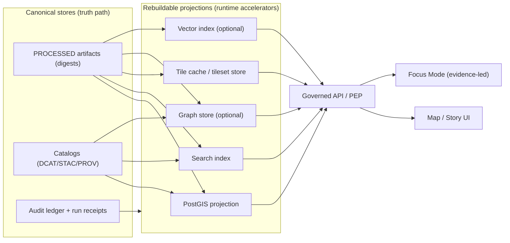

<!-- [KFM_META_BLOCK_V2]
doc_id: kfm://doc/76f6a0f3-9e29-4a9e-9d41-1b0fdbf30a2f
title: Index Rebuild Runbook
type: standard
version: v1
status: draft
owners: Platform Ops / Data Platform
created: 2026-03-02
updated: 2026-03-02
policy_label: restricted
related:
  - docs/runbooks/README.md
  - docs/runbooks/catalog/rb-catalog-rebuild.md
  - docs/runbooks/promotion/rb-promotion-contract.md
tags: [kfm, runbook, indexing, postgis, search, tiles, audit]
notes:
  - Treat all indexes as rebuildable projections; never “fix data in place” without a new DatasetVersion + receipts.
  - This runbook is environment-agnostic; bind concrete commands in the “Environment bindings” section.
[/KFM_META_BLOCK_V2] -->

<a id="top"></a>

# Index Rebuild Runbook
Rebuild rebuildable projections (PostGIS, search, tiles, optional graph/vector) from canonical KFM artifacts **without breaking the trust membrane**.


---

## Quick navigation
- [Intent](#intent)
- [Scope and non-goals](#scope-and-non-goals)
- [Principles](#principles)
- [Architecture](#architecture)
- [Inputs](#inputs)
- [Procedure](#procedure)
- [Validation gates](#validation-gates)
- [Rollback](#rollback)
- [Troubleshooting](#troubleshooting)
- [Environment bindings](#environment-bindings)
- [Run receipt template](#run-receipt-template)

---

## Intent
Restore correctness and performance of KFM query surfaces by rebuilding **rebuildable** indexes/projections from the **canonical truth path** artifacts (PROCESSED + CATALOG + AUDIT).

### Typical triggers
- Corrupted / stale index (search results missing or wrong)
- PostGIS migration or schema drift
- New tile style or tiler bug fix
- Disaster recovery (canonical stores restored; projections must be replayed)
- Large backfill of data where incremental indexing is unsafe

> [!WARNING]
> Index rebuilds can cause **downtime**, **policy regressions**, or **unverifiable search results** if not done through the governed rebuild pipeline. Treat this as a controlled operational change.

---

## Scope and non-goals

### In scope
Rebuild of any of the following **projections**:
- PostGIS projection schema (spatial query tables, indexes)
- Search index (dataset discovery, story search, document/OCR search)
- Tile caches (vector tiles / raster pyramids / PMTiles, depending on the stack)
- Optional graph model (lineage/entity graph)
- Optional vector search (embeddings) — only if it returns EvidenceRefs, never raw text

### Out of scope (handled by other runbooks)
- Re-running ingestion from upstream sources (RAW/WORK failures)
- Rebuilding DCAT/STAC/PROV catalogs (CatGen)
- Promoting datasets between zones (Promotion Contract)
- Changing policy rules or obligations (Policy release)

---

## Principles

### P0 — Canonical artifacts are the source of truth
- Only **processed + catalog** artifacts are eligible for serving to runtime.
- Every artifact must have a **digest** and be represented in checksums/manifests.
- Keep manifests/receipts close to artifacts so the truth path is navigable without a DB.

### P1 — Projections are rebuildable, not authoritative
PostGIS/search/tiles/graph are **projections**. If they diverge from catalogs, the projections are wrong.

### P2 — Search must not become a shadow source
Search results must map to **EvidenceRefs** that resolve; otherwise the search index becomes an unverifiable shadow source.

### P3 — No “fix data in place”
If the underlying data is wrong, produce a new DatasetVersion and receipts. Do not mutate a published DatasetVersion in place.

> [!NOTE]
> This runbook is written to “fail closed”: if you cannot prove a step is safe (policy, provenance, parity), stop and escalate.

---

## Architecture



**Key idea:** projections are rebuilt by reading catalogs + processed artifacts, then writing a rebuild receipt to the audit ledger.

---

## Inputs

### Required
- **Environment**: `dev | stage | prod`
- **Target scope**: `dataset_version_id` (preferred) or explicit dataset list
- **Projection targets**: one or more of `{postgis, search, tiles, graph, vector}`
- **Change context**: incident ID or change ticket (for auditability)

### Optional (use to reduce blast radius)
- Spatial bounding box (bbox) for partial rebuild
- Temporal window
- Partition filters (if your projection is partitioned by dataset_version_id)

---

## Procedure

### 0) Safety preflight
1. Confirm you have **operator permission** for the target environment.
2. Confirm that the canonical stores you will rebuild from are healthy:
   - Catalog validators pass (DCAT/STAC/PROV)
   - Processed artifacts referenced by catalogs exist and match digests
3. Confirm policy posture:
   - Tiles and search must remain policy-safe and evidence-resolvable.
4. Decide the blast radius:
   - Prefer **per-dataset_version_id** rebuild over global rebuild.

> [!WARNING]
> If catalogs are missing or invalid, do **not** rebuild projections. Fix catalogs first (CatGen recovery runbook).

---

### 1) Freeze writes (environment-dependent)
Goal: avoid rebuilding against a moving target.

Options (choose what applies):
- Pause ingestion/ETL jobs that write new PROCESSED data
- Pause catalog generation jobs
- Pause index writers / background refresh
- If necessary, place API in “read-only” mode for admin endpoints

Record what you paused in the run receipt.

---

### 2) Snapshot / rollback point
Before destructive operations:
- Take a snapshot of search index (or ensure blue/green alias swap is available)
- Take a DB snapshot or logical backup of PostGIS projection schema
- Capture current tileset version pointers (or copy tileset manifests)

If your stack does not support snapshots, document the limitation and use alias-based swaps wherever possible.

---

### 3) Execute the KFM rebuild algorithm (canonical sequence)
This is the **required** logical pipeline, regardless of tooling:

1. **Read catalogs** for a `dataset_version_id`
2. **Locate processed artifacts** by digest/path
3. **Load into projections** (PostGIS, search, graph, tile caches)
4. **Validate counts and extents** against catalog metadata
5. **Record a rebuild receipt** in the audit ledger

---

### 4) Target-specific execution notes

#### 4A) PostGIS projection rebuild
Use PostGIS as a projection:
- Ensure tables include `dataset_version_id` and `evidence_ref` (minimum)
- Rebuild spatial indexes after bulk load
- Prefer partitioning by dataset_version_id when available

**Recommended approach**
- Create new schema or temporary tables (blue/green)
- Bulk load from processed artifacts
- Build indexes
- Swap schema/aliases (minimize downtime)

**Validation**
- Row counts per dataset_version_id match catalog expectations
- Spatial extents and time extents align with catalog metadata
- Spot-check evidence_ref resolvability through governed API

---

#### 4B) Search index rebuild
Search is required for:
- dataset discovery
- story search
- document/OCR search

Index fields SHOULD include:
- dataset_version_id
- artifact digest
- evidence_ref
- policy_label
- spatial/temporal extents
- text fields (OCR/metadata/narrative) **only if allowed by policy**

**Recommended approach**
- Build a new index version (blue/green)
- Backfill from catalogs + allowed text sources
- Validate evidence_ref resolution
- Swap alias to the new index

**Critical validation**
- Every search hit must map to an EvidenceRef that resolves to an EvidenceBundle under policy.
- No restricted content leaks through indexing pipelines.

---

#### 4C) Tile rebuild
Tiles are a projection and must remain policy-safe:
- Tiles should be served via governed API endpoints
- Cache variance MUST respect policy/auth context (do not share restricted tiles into public caches)

**Recommended approach**
- Rebuild tileset into a new versioned location
- Validate representative tile samples
- Swap tileset pointers / manifests
- Warm cache safely (auth-aware warmup)

---

#### 4D) Optional graph rebuild
Use when you need:
- relationship traversal (places → events → documents)
- entity resolution / aliasing
- narrative linking

Rebuild from catalogs + processed structured link artifacts.

---

#### 4E) Optional vector search rebuild
If used:
- Store embeddings as a projection keyed by artifact digest + chunk id
- Store chunk text only if allowed by policy
- Retrieval returns EvidenceRefs, not raw text

---

## Validation gates

### Gate V1 — Catalog parity
- All rebuilt projections correspond to the same dataset_version_id(s) and catalog version(s).
- Counts match catalog metadata (or within explicitly documented tolerance).

### Gate V2 — Evidence resolvability
- Random sample of results (search hits, feature queries, tiles layer lookup) resolves to EvidenceBundles.
- Any non-resolving EvidenceRef is treated as a release blocker for the rebuild.

### Gate V3 — Policy safety
- Verify “restricted” content does not appear in public contexts.
- Verify tile caches do not cross-contaminate between auth contexts.

### Gate V4 — Runtime health
- API health checks green
- Query latency within SLO
- Map UI layer loads for representative datasets

> [!TIP]
> Maintain a small “canary” checklist: 3 datasets × 3 queries × 3 time windows, repeated after every rebuild.

---

## Rollback

### Rollback triggers
- Evidence resolvability fails (unresolvable hits)
- Policy leak detected
- Major parity mismatch vs catalogs
- Severe performance regression

### Rollback strategy (prefer non-destructive swaps)
- Search: swap alias back to previous index snapshot/version
- PostGIS: swap schema back (or restore snapshot)
- Tiles: revert tileset pointer/manifests to previous version

Record rollback actions in the audit ledger as a rollback receipt.

---

## Troubleshooting

| Symptom | Likely cause | Immediate action | Follow-up |
|---|---|---|---|
| Search returns hits that cannot resolve | Index missing evidence_ref or stale refs | Fail closed: remove/rollback index | Fix index pipeline to only emit resolvable EvidenceRefs |
| PostGIS count mismatch vs catalog | Wrong dataset_version_id filter, missing artifacts | Stop rebuild; verify catalogs + artifact digests | Add per-version partitioning + stronger parity checks |
| Tiles show restricted features publicly | Cache variance not keyed by policy/auth | Purge public caches; rollback tileset | Implement auth-aware cache keys + policies |
| Rebuild runs forever / OOM | Bulk load too large, no chunking | Abort; rebuild per dataset_version_id | Add chunking + job resource sizing |

---

## Environment bindings

> [!NOTE]
> Bind these to real values for your deployment. Keep this section updated as infra evolves.

- Search engine:
  - [ ] Elastic
  - [ ] OpenSearch
  - [ ] Postgres FTS
  - [ ] Other: __________
- Tile stack:
  - [ ] PostGIS vector tiles
  - [ ] Tippecanoe/PMTiles pipeline
  - [ ] Tegola/TileServer
  - [ ] Other: __________
- Job runner:
  - [ ] `apps/cli`
  - [ ] `packages/indexers`
  - [ ] `scripts/*`
  - [ ] Kubernetes Job / CronJob
- Audit ledger location:
  - [ ] Postgres table
  - [ ] Append-only object store log
  - [ ] Other: __________

---

## Run receipt template

```json
{
  "run_id": "kfm://run/REPLACE",
  "type": "index_rebuild",
  "environment": "prod",
  "requested_by": "REPLACE",
  "change_ticket": "REPLACE",
  "started_at": "REPLACE",
  "ended_at": "REPLACE",
  "inputs": {
    "dataset_version_ids": ["REPLACE"],
    "catalog_refs": ["REPLACE"],
    "artifact_digests": ["sha256:..."]
  },
  "targets": ["postgis", "search", "tiles"],
  "actions": [
    {"step": "freeze_writes", "status": "ok"},
    {"step": "snapshot", "status": "ok"},
    {"step": "rebuild", "status": "ok"},
    {"step": "validate", "status": "ok"},
    {"step": "unfreeze_writes", "status": "ok"}
  ],
  "validation": {
    "catalog_parity": true,
    "evidence_resolvable": true,
    "policy_checks": "pass",
    "counts": {"expected": 0, "actual": 0, "tolerance": 0}
  },
  "outputs": {
    "postgis_projection_version": "REPLACE",
    "search_index_version": "REPLACE",
    "tileset_version": "REPLACE"
  },
  "notes": "REPLACE"
}
```

---

## Appendix: Operator checklist (copy/paste)

- [ ] Ticket/incident created and linked
- [ ] Scope identified (dataset_version_id(s), targets)
- [ ] Catalogs validated and artifacts present
- [ ] Writes frozen (as applicable)
- [ ] Snapshots taken / rollback point recorded
- [ ] Rebuild executed via canonical sequence
- [ ] Parity + evidence + policy validation passed
- [ ] Runtime health verified (API/UI)
- [ ] Writes unfrozen
- [ ] Receipt written to audit ledger
- [ ] Postmortem notes captured (if incident)

---

<a href="#top">Back to top</a>
