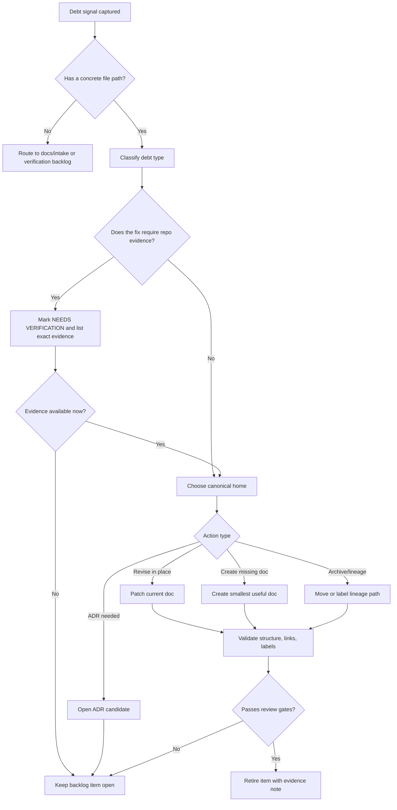

<!-- [KFM_META_BLOCK_V2]
doc_id: kfm://doc/NEEDS-VERIFICATION
title: Markdown Debt Backlog
type: standard
version: v1
status: draft
owners: TODO-NEEDS-VERIFICATION
created: 2026-04-27
updated: 2026-04-27
policy_label: TODO-NEEDS-VERIFICATION
related: [docs/README.md, docs/registers/AUTHORITY_LADDER.md, docs/registers/CANONICAL_LINEAGE_EXPLORATORY.md, docs/registers/DRIFT_REGISTER.md, docs/registers/VERIFICATION_BACKLOG.md, docs/standards/KFM_MARKDOWN_WORK_PROTOCOL.md, tools/docs/README.md]
tags: [kfm, documentation, markdown, debt, runbook, backlog, governance]
notes: [Initial draft created from attached KFM documentation architecture and pipeline corpus. Current target repo was not mounted during drafting; owners, policy label, doc_id, adjacent paths, and validation commands need direct repo verification before merge.]
[/KFM_META_BLOCK_V2] -->

<a id="top"></a>

# Markdown Debt Backlog

A governed backlog and triage runbook for retiring KFM Markdown debt without weakening truth posture, source authority, or repo-native evidence boundaries.

> [!IMPORTANT]
> **Status:** `draft`  
> **Path:** `docs/runbooks/markdown-debt-backlog.md`  
> **Owners:** `TODO-NEEDS-VERIFICATION`  
> **Truth posture:** `CONFIRMED` doctrine + `PROPOSED` backlog model + `NEEDS VERIFICATION` repo integration  
> **Initial evidence boundary:** attached KFM corpus and current-session workspace scan; no mounted target checkout was available during this draft.

## Quick jumps

- [Purpose](#purpose)
- [Repo fit](#repo-fit)
- [Scope](#scope)
- [Accepted inputs](#accepted-inputs)
- [Exclusions](#exclusions)
- [Debt classes](#debt-classes)
- [Triage workflow](#triage-workflow)
- [Seed backlog](#seed-backlog)
- [Validation](#validation)
- [Definition of done](#definition-of-done)
- [Rollback](#rollback)
- [Open verification items](#open-verification-items)
- [Appendix: debt record template](#appendix-debt-record-template)

---

## Purpose

Markdown debt in KFM is not just stale prose. It is any documentation condition that makes a maintainer, reviewer, steward, or contributor less able to tell:

- what is **canonical** versus lineage, exploratory, proposed, generated, or deprecated
- whether a claim is supported by current repo evidence, attached doctrine, emitted artifacts, tests, workflows, or only design intent
- which file owns a concept, object family, policy rule, runbook, or release-facing procedure
- whether a public-facing statement is safe, cited, reviewable, and reversible

This runbook gives maintainers a single place to capture, classify, prioritize, fix, validate, and retire Markdown debt while preserving KFM’s core invariants:

```text
RAW -> WORK/QUARANTINE -> PROCESSED -> CATALOG/TRIPLET -> PUBLISHED
```

Documentation does not bypass that trust path. It explains, preserves, tests, and audits it.

[Back to top](#top)

---

## Repo fit

| Field | Value |
|---|---|
| Target file | `docs/runbooks/markdown-debt-backlog.md` |
| Document role | Cross-cutting runbook for documentation debt intake, triage, remediation, and retirement |
| Upstream doctrine | `docs/README.md`, authority ladder, canonical/lineage/exploratory register, Markdown work protocol |
| Downstream consumers | documentation PRs, README revisions, runbook updates, standards docs, contracts/schemas/policy READMEs, verification backlog |
| Adjacent surfaces | `docs/registers/DRIFT_REGISTER.md`, `docs/registers/VERIFICATION_BACKLOG.md`, `tools/docs/README.md`, `tests/docs/` |
| Current repo evidence | `NEEDS VERIFICATION` — target checkout was not available during this draft |
| Change posture | Small, reversible, reviewable; do not bulk-convert or rewrite doctrine without an authority decision |

> [!NOTE]
> Paths in this table are expected KFM documentation-control homes. Verify them in the mounted repository before converting them into hard links or CI-enforced assumptions.

[Back to top](#top)

---

## Scope

Use this backlog when Markdown work affects governance, source authority, documentation structure, trust posture, contributor orientation, or reviewability.

Strong fits include:

- missing or incomplete `KFM_META_BLOCK_V2`
- unsupported implementation claims
- unclear `CONFIRMED` / `INFERRED` / `PROPOSED` / `UNKNOWN` / `NEEDS VERIFICATION` labeling
- README-like docs missing status, owners, repo fit, accepted inputs, or exclusions
- broken or unverifiable relative links
- unresolved citation tokens, stale generated citations, or source references that cannot be traced
- duplicated doctrine across several docs with no canonical owner
- long PDF-derived content copied into Markdown without authority classification
- runbooks that describe commands, workflows, APIs, validators, receipts, or proof objects that have not been verified in the repo
- Markdown that makes KFM look generic, flat, or visually dead while handling trust-critical topics

[Back to top](#top)

---

## Accepted inputs

A backlog item may enter from any of these sources:

| Input | Accept when | Required capture |
|---|---|---|
| Reviewer comment | A PR review identifies unclear, unsupported, stale, or structurally weak Markdown | PR link, file path, quoted issue, requested outcome |
| Repo scan | A checker finds missing meta blocks, broken links, duplicate H1s, or placeholder leakage | command, output, affected path |
| Corpus migration | A PDF or lineage document contains doctrine that should become repo-native | source title, section/page if available, proposed canonical destination |
| Drift register | Two docs disagree or compete for authority | both paths, conflict summary, proposed owner |
| Verification backlog | A doc claim depends on actual workflows, tests, schemas, dashboards, or emitted artifacts | exact evidence needed |
| Security/policy review | Markdown exposes sensitive location, rights, living-person, DNA, archaeology, critical infrastructure, or source terms risk | risk class, policy reviewer, proposed mitigation |
| Accessibility/readability pass | The doc is correct but hard to scan, overly dense, or not GitHub-readable | target section, readability issue, proposed structure |

[Back to top](#top)

---

## Exclusions

Do **not** use this backlog for:

| Excluded item | Put it here instead |
|---|---|
| New doctrine proposal with architectural consequences | `docs/intake/` or ADR candidate queue |
| New machine-readable contract/schema | `contracts/` and/or `schemas/`, after schema-home verification |
| Policy rule or gate logic | `policy/` plus tests/fixtures |
| Live source connector activation | source registry + source admission workflow |
| Runtime bug unrelated to documentation | issue tracker or implementation backlog |
| Generated receipts, manifests, proof packs, or release objects | `data/receipts/`, `data/proofs/`, `data/manifests/`, or release artifact store |
| Bulk PDF-to-Markdown migration | documentation architecture roadmap, not this debt file |
| Styling-only cleanup that changes no readability, trust, or navigation outcome | local opportunistic cleanup, unless it blocks review |

[Back to top](#top)

---

## Debt classes

| Class | Symptom | Why it matters | Default priority |
|---|---|---|---|
| Authority debt | Two or more docs appear to own the same rule | Creates canon collision | P0 |
| Evidence debt | A doc says “the repo does X” without implementation proof | Converts speculation into fact | P0 |
| Metadata debt | Missing or stale `KFM_META_BLOCK_V2`, owners, policy label, related docs, or notes | Breaks review attribution | P0/P1 |
| Truth-label debt | Claims need `CONFIRMED`, `INFERRED`, `PROPOSED`, `UNKNOWN`, or `NEEDS VERIFICATION` | Prevents uncertainty laundering | P0/P1 |
| README-fit debt | README-like doc lacks purpose, repo fit, inputs, or exclusions | Weakens orientation | P1 |
| Navigation debt | Long doc lacks quick jumps, stable structure, or readable pacing | Reviewers miss critical parts | P1 |
| Link/anchor debt | Relative links are broken, unverifiable, or point to stale paths | Breaks traceability | P1 |
| Citation debt | Source references are missing, stale, unresolved, or tool-token artifacts | Weakens evidence posture | P1 |
| Presentation debt | Dense walls of text, giant tables, or unscannable generated prose | Good doctrine becomes unused | P2 |
| Validation debt | Runbook lists commands/checks that are not grounded in repo evidence | Implies CI maturity that may not exist | P0/P1 |
| Sensitivity debt | Markdown exposes or normalizes risky release behavior | Can leak protected data or rights-sensitive claims | P0 |
| Archive debt | Lineage or exploratory material sits beside canonical docs without label | Lets history masquerade as current law | P1 |

[Back to top](#top)

---

## Priority model

| Priority | Use when | Review posture |
|---|---|---|
| `P0` | The debt can mislead readers about authority, implementation status, release safety, policy posture, or sensitive publication | Fix before depending on the doc |
| `P1` | The debt blocks orientation, validation, review, or future automation | Fix in the next documentation-control PR |
| `P2` | The debt reduces readability or maintainability but does not alter trust posture | Batch with adjacent doc improvements |
| `P3` | Cosmetic polish or optional clarity improvement | Opportunistic only |
| `HOLD` | Requires repo checkout, owner decision, legal/policy review, or source evidence not yet available | Keep visible; do not silently close |

[Back to top](#top)

---

## Triage workflow



### Step-by-step

1. **Capture the signal.** Record the file path, section, issue, and evidence source.
2. **Name the debt class.** Use the table above; avoid vague labels like “cleanup.”
3. **Assign a truth label.** Use the narrowest truthful label.
4. **Select the canonical home.** Do not create a parallel doc when an existing doc owns the topic.
5. **Choose the smallest reversible fix.** Prefer in-place revision, short register entries, and focused runbooks over broad rewrites.
6. **Run validation.** Use repo-native doc checks when available; otherwise mark validation as `NEEDS VERIFICATION`.
7. **Review for authority drift.** Confirm the patch does not upgrade proposal to implementation fact.
8. **Retire the item.** Close only when the fix, evidence, and rollback path are visible.

[Back to top](#top)

---

## Seed backlog

This seed backlog is source-grounded at the doctrine level and intentionally conservative at the implementation level. It is a starting list, not proof that each condition exists in the current repository.

| ID | Item | Debt class | Status | Priority | Evidence needed to close | Suggested next action |
|---|---|---|---|---|---|---|
| MDB-001 | Verify this file’s owner, policy label, and permanent `doc_id` | Metadata debt | `NEEDS VERIFICATION` | P0 | CODEOWNERS, repo policy-label convention, doc registry | Assign owner and update meta block |
| MDB-002 | Confirm whether `docs/runbooks/` has a local README or runbook map | Navigation debt | `NEEDS VERIFICATION` | P1 | `docs/runbooks/**` inventory | Link or create a runbook index only if absent |
| MDB-003 | Verify documentation-control register homes | Authority debt | `NEEDS VERIFICATION` | P0 | `docs/registers/**` inventory | Cross-link authority, drift, and verification registers |
| MDB-004 | Inventory Markdown files missing `KFM_META_BLOCK_V2` | Metadata debt | `PROPOSED` | P1 | repo-wide Markdown scan | Create summary report before mass edits |
| MDB-005 | Identify Markdown files with implementation claims but no repo evidence | Evidence debt | `PROPOSED` | P0 | grep/search results plus source review | Downgrade claims to `PROPOSED` / `UNKNOWN` or attach proof |
| MDB-006 | Find unresolved citation tokens or stale generated source markers | Citation debt | `PROPOSED` | P1 | repo-wide search for `filecite`, `turn`, unresolved citation syntax | Replace with repo-native source references or remove |
| MDB-007 | Audit README-like docs for purpose, status, owners, repo fit, inputs, and exclusions | README-fit debt | `PROPOSED` | P1 | README inventory and checklist report | Fix highest-trust surfaces first |
| MDB-008 | Verify doc tooling commands and CI workflow names before runbooks claim them | Validation debt | `NEEDS VERIFICATION` | P0 | `tools/docs/**`, `tests/docs/**`, `.github/workflows/**` | Update this runbook’s validation section after inventory |
| MDB-009 | Confirm contract/schema/policy/test fixture separation is documented in repo-native READMEs | Authority debt | `NEEDS VERIFICATION` | P1 | `contracts/README.md`, `schemas/README.md`, `policy/README.md`, `tests/fixtures/README.md` | Add or revise split table |
| MDB-010 | Add a drift register entry when two docs compete for canonical authority | Authority debt | `PROPOSED` | P1 | concrete conflicting docs | Record conflict before rewriting either file |
| MDB-011 | Add evidence notes to PDF-derived Markdown conversions | Evidence debt | `PROPOSED` | P1 | converted doc list and source basis | Label source family, authority tier, and limits |
| MDB-012 | Improve visual scanability of long governance docs | Presentation debt | `PROPOSED` | P2 | affected path and section list | Add quick jumps, tables, callouts, and collapsible appendices |
| MDB-013 | Prevent sensitive-domain Markdown from implying public release by default | Sensitivity debt | `PROPOSED` | P0 | archaeology, rare species, people/DNA/land, critical infrastructure docs | Add fail-closed sensitivity notes and release prerequisites |
| MDB-014 | Confirm branch protection and CODEOWNERS before docs claim review enforcement | Validation debt | `NEEDS VERIFICATION` | P0 | repo settings, CODEOWNERS, rulesets | Replace enforcement claims with verified wording |
| MDB-015 | Create or verify a documentation debt report generated by tooling | Validation debt | `PROPOSED` | P2 | doc checker output | Emit `docs/reports/markdown-debt-summary.md` only if tooling exists |

[Back to top](#top)

---

## Fix patterns

### 1. Downgrade unsupported implementation claims

Use this when a doc describes a route, schema, workflow, fixture, CI gate, receipt, proof object, or runtime behavior that has not been verified.

| Before | After |
|---|---|
| “The promotion gate validates release manifests.” | “`PROPOSED`: Promotion-gate docs expect release-manifest validation; current validator entry point is `NEEDS VERIFICATION`.” |
| “Focus Mode returns `ANSWER`, `ABSTAIN`, `DENY`, and `ERROR`.” | “`CONFIRMED doctrine / UNKNOWN implementation`: Focus Mode should use finite outcomes; sample runtime envelopes are needed to confirm current behavior.” |
| “This README is owned by X.” | “`owners: TODO-NEEDS-VERIFICATION` until CODEOWNERS or documented team ownership is inspected.” |

### 2. Preserve strong content without creating canon collision

When a lineage PDF, old pass, or exploratory packet contains useful material:

1. Keep the source intact.
2. Classify it as `canonical`, `lineage`, `exploratory`, `reference`, or `implementation evidence`.
3. Extract only the stable consequence.
4. Route the extracted consequence to one canonical destination.
5. Link back to the source register instead of copying everything.

### 3. Make README-like docs reviewable

A README-like doc should not be a shapeless landing page. It should include, at minimum:

- title
- one-line purpose directly below the title
- status and owners
- quick jumps
- repo fit
- accepted inputs
- exclusions
- directory tree if it is a directory README
- Mermaid diagram when a meaningful, evidence-grounded diagram exists
- task list or gates when the directory has operational responsibility

### 4. Keep generated objects out of normative docs

Generated receipts, manifests, proof packs, reports, and release artifacts can be linked or summarized, but they should not become the canonical contract definition.

| Normative surface | Generated/emitted surface |
|---|---|
| `contracts/` | `data/proofs/` |
| `schemas/` | `data/receipts/` |
| `policy/` | `data/manifests/` |
| `docs/runbooks/` | CI artifacts / release bundles |

[Back to top](#top)

---

## Validation

> [!WARNING]
> The commands below are a validation menu, not a confirmed current toolchain. Replace them with repo-native commands after mounting the repository and inspecting `tools/`, `tests/`, and `.github/workflows/`.

### Minimum manual checks

- [ ] The file has exactly one H1.
- [ ] The meta block exists and uses the exact `KFM_META_BLOCK_V2` wrapper.
- [ ] Unknown owners, policy labels, dates, paths, and doc IDs are marked as placeholders instead of guessed.
- [ ] All material implementation claims have a truth label or supporting evidence.
- [ ] Relative links are verified or left as plain code paths with `NEEDS VERIFICATION`.
- [ ] README-like docs include purpose, status, owners, repo fit, accepted inputs, and exclusions.
- [ ] Long docs include quick jumps and meaningful section rhythm.
- [ ] No public-facing language bypasses evidence, policy, review, or promotion state.

### Candidate command checks

```bash
# Confirm you are in the real KFM checkout.
git status --short
git branch --show-current

# Inspect docs and runbook surfaces.
find docs -maxdepth 3 -type f -name "*.md" | sort
find docs/runbooks -maxdepth 2 -type f -name "*.md" | sort

# Search for common Markdown debt markers.
grep -RInE "TODO|NEEDS VERIFICATION|UNKNOWN|filecite|turn[0-9]+|PLACEHOLDER|REVIEW_REQUIRED" docs .github contracts schemas policy tools tests 2>/dev/null || true

# NEEDS VERIFICATION: run only if these repo-native helpers exist.
python tools/docs/check_doc_structure.py docs/runbooks/markdown-debt-backlog.md
node tools/docs/check-kfm-meta-blocks.mjs
node tools/docs/examples/run-governance-doc-structure.mjs
```

### Validation result language

Use one of these phrases in PR notes:

| Result | Meaning |
|---|---|
| `CONFIRMED: doc structure checks passed` | Repo-native checks were run and passed |
| `CONFIRMED: manual review passed; tooling absent` | No checker exists, but manual checklist passed |
| `NEEDS VERIFICATION: checker path unknown` | Tooling could not be verified |
| `FAILED: debt item remains open` | Validation found unresolved issues |

[Back to top](#top)

---

## Definition of done

A Markdown debt item is done only when:

- [ ] the affected file path is known
- [ ] the debt class is named
- [ ] the fix is the smallest reversible change
- [ ] truth labels are narrowed, not inflated
- [ ] source authority is visible
- [ ] implementation claims are supported or downgraded
- [ ] meta block values are confirmed or visibly marked for review
- [ ] links and anchors are verified or intentionally left as plain paths
- [ ] adjacent docs are updated when behavior or navigation changes
- [ ] validation was run or the missing validation path is documented
- [ ] rollback is obvious
- [ ] the backlog item records what evidence closed it

[Back to top](#top)

---

## Rollback

For this runbook itself:

1. Revert the file addition or last patch.
2. Restore any previous runbook index links.
3. Re-open any backlog items that were closed because of the reverted content.
4. If a meta block ID was registered, mark it superseded or withdrawn in the document registry.

For Markdown debt fixes generally:

| Change type | Rollback |
|---|---|
| In-place wording correction | Revert patch; keep debt item open if issue remains |
| New doc | Remove doc and any inbound links; record why creation was premature |
| Metadata update | Restore previous meta block; record which field could not be verified |
| Link rewrite | Restore prior links or convert to plain path if target is uncertain |
| Archive/lineage move | Move file back or add redirect note if anchors changed |
| CI/doc-check change | Disable the new check before deleting diagnostics; preserve report if useful |
| Sensitive release-language correction | Do not roll back without policy/steward review |

[Back to top](#top)

---

## Open verification items

| Item | Why it matters | Evidence needed |
|---|---|---|
| Owner for this runbook | Required for review and accountability | CODEOWNERS or team ownership doc |
| Policy label | Required by meta block and public/restricted posture | Repo policy-label convention |
| Permanent doc ID | Required for registry stability | Document registry or UUID issuance rule |
| Existing runbook index | Prevents orphan docs | `docs/runbooks/README.md` or equivalent |
| Existing Markdown work protocol | Avoids duplicate standards | `docs/standards/**` inventory |
| Existing doc tooling | Grounds validation commands | `tools/docs/**`, `tests/docs/**`, workflow YAML |
| Existing authority registers | Prevents parallel canon systems | `docs/registers/**` inventory |
| Branch protection and review gates | Prevents false enforcement claims | repo settings, CODEOWNERS, rulesets |
| Current Markdown debt report, if any | Prevents duplicate reports | `docs/reports/**` inventory |
| Existing archive/lineage layout | Prevents moving historical material into the wrong place | `docs/archive/**`, lineage register |

[Back to top](#top)

---

## Appendix: debt record template

<details>
<summary>Copyable Markdown debt record</summary>

```markdown
### MDB-000 — <short title>

| Field | Value |
|---|---|
| Path | `<repo-relative path>` |
| Debt class | `authority debt | evidence debt | metadata debt | ...` |
| Priority | `P0 | P1 | P2 | P3 | HOLD` |
| Truth label | `CONFIRMED | INFERRED | PROPOSED | UNKNOWN | NEEDS VERIFICATION` |
| Source / signal | `<PR, review note, scan output, source doc, direct observation>` |
| Problem | `<what is wrong and why it matters>` |
| Smallest safe fix | `<one focused action>` |
| Evidence needed | `<exact repo file, command output, workflow, artifact, owner, policy, etc.>` |
| Validation | `<manual checklist or command>` |
| Rollback | `<how to undo safely>` |
| Status | `captured | triaged | in progress | blocked | fixed | archived` |
```

</details>

[Back to top](#top)
