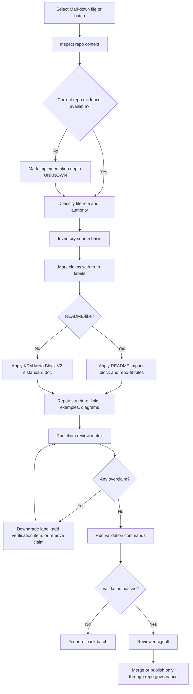

<!-- [KFM_META_BLOCK_V2]
doc_id: kfm://doc/TODO-UUID-NEEDS-VERIFICATION
title: Markdown Remediation Plan
type: standard
version: v1
status: draft
owners: TODO-owner-NEEDS-VERIFICATION
created: TODO-created-date-NEEDS-VERIFICATION
updated: 2026-04-27
policy_label: TODO-policy-label-NEEDS-VERIFICATION
related: [docs/runbooks/README.md (NEEDS VERIFICATION), docs/registers/AUTHORITY_LADDER.md (NEEDS VERIFICATION), docs/registers/CANONICAL_LINEAGE_EXPLORATORY.md (NEEDS VERIFICATION), docs/intake/IDEA_INTAKE.md (NEEDS VERIFICATION), docs/archive/lineage/README.md (NEEDS VERIFICATION)]
tags: [kfm, markdown, docs, runbook, remediation]
notes: [Repo-ready draft generated from attached KFM doctrine; target repo contents, owners, related links, and policy label require mounted-repo verification before publication]
[/KFM_META_BLOCK_V2] -->

# Markdown Remediation Plan

A governed runbook for improving KFM Markdown without flattening evidence, source authority, uncertainty, or implementation boundaries.

> [!IMPORTANT]
> This runbook is for **documentation remediation**, not broad rewriting. It exists to make Markdown more accurate, navigable, source-aware, and repo-native while preserving KFM’s doctrine: inspectable claims, governed truth paths, policy-aware publication, bounded AI, and reversible change.

| Field | Value |
|---|---|
| **Path** | `docs/runbooks/markdown-remediation-plan.md` |
| **Status** | `draft` / `NEEDS VERIFICATION` in mounted repo |
| **Runbook type** | Documentation quality, authority, and evidence-boundary remediation |
| **Primary users** | Documentation maintainers, architecture stewards, domain stewards, reviewers, implementation agents |
| **Default posture** | Cite, label, verify, or abstain |
| **Current limitation** | This file is repo-ready draft text; actual neighboring files, owners, CI, branch rules, and link targets require verification in the real checkout |

## Quick jumps

- [Scope](#scope)
- [Repo fit](#repo-fit)
- [Accepted inputs](#accepted-inputs)
- [Exclusions](#exclusions)
- [Operating law](#operating-law)
- [Remediation flow](#remediation-flow)
- [Step-by-step procedure](#step-by-step-procedure)
- [Claim review matrix](#claim-review-matrix)
- [Validation commands](#validation-commands)
- [Definition of done](#definition-of-done)
- [Rollback and correction](#rollback-and-correction)
- [Open verification backlog](#open-verification-backlog)

---

## Scope

Use this runbook when a Markdown file needs to become more faithful to KFM’s actual doctrine, evidence posture, architecture, source hierarchy, implementation state, and repo conventions.

This includes:

- adding or repairing KFM metadata blocks;
- separating `CONFIRMED`, `INFERRED`, `PROPOSED`, `UNKNOWN`, and `NEEDS VERIFICATION` claims;
- preserving canon, lineage, exploratory, reference, and superseded materials without letting them compete as peers;
- improving GitHub readability without adding decorative filler;
- replacing generic prose with KFM-specific terms and reviewable claims;
- repairing links, headings, tables, diagrams, runbook steps, and definitions of done;
- moving or cross-linking material only when repo evidence and review support it.

This runbook is especially relevant for Markdown under:

| Surface | Typical remediation need |
|---|---|
| `README.md` | Identity, quick navigation, repo fit, accepted inputs, exclusions, evidence boundary |
| `docs/` | Doctrine, architecture, domains, sources, runbooks, registers, intake, archive |
| `contracts/` | Human semantic object definitions and lifecycle invariants |
| `schemas/` | Machine-checkable shapes, enums, fragments, and executable constraints |
| `policy/` | Rights, sensitivity, admissibility, deny/allow/abstain, publication gates |
| `tests/fixtures/` | Valid/invalid exemplars and regression pressure |
| `data/manifests/`, `data/receipts/`, `data/proofs/` | Emitted instances, not normative definitions |

[Back to top](#markdown-remediation-plan)

## Repo fit

This runbook belongs in `docs/runbooks/` because it describes an operator/reviewer procedure: how to inspect, classify, edit, validate, review, and roll back Markdown remediation work.

### Upstream surfaces

These upstream references should be verified in the real checkout before linking from this document:

| Surface | Expected role | Status |
|---|---|---|
| `docs/README.md` | Docs landing and navigation spine | `NEEDS VERIFICATION` |
| `docs/registers/AUTHORITY_LADDER.md` | Source hierarchy and authority rules | `NEEDS VERIFICATION` |
| `docs/registers/CANONICAL_LINEAGE_EXPLORATORY.md` | Canon/lineage/exploratory classification | `NEEDS VERIFICATION` |
| `docs/intake/IDEA_INTAKE.md` | New Ideas intake and promotion rules | `NEEDS VERIFICATION` |
| `docs/archive/lineage/README.md` | Preserved historical/source lineage | `NEEDS VERIFICATION` |

### Downstream outputs

A remediation batch may produce or update:

- remediated Markdown files;
- link-check reports;
- source classification notes;
- open verification backlog entries;
- correction notes for overclaimed docs;
- reviewer notes or PR comments;
- optional remediation receipt records if the repo has a receipt convention.

> [!NOTE]
> Do not invent downstream artifact names. Use repo-native receipt, proof, review, and CI conventions once verified.

[Back to top](#markdown-remediation-plan)

## Accepted inputs

The remediation process may use:

- mounted repo files and adjacent documentation;
- attached KFM doctrine and architecture documents;
- contracts, schemas, policy files, validators, fixtures, tests, workflows, manifests, generated artifacts, receipts, proofs, dashboards, and logs when directly visible;
- official external sources only for current, version-sensitive, security-sensitive, standards-sensitive, or source-system-sensitive facts;
- maintainer review notes and issue/PR context when available.

For each input, record its status:

| Input class | Default status | How to use it |
|---|---|---|
| Current repo file | `CONFIRMED` only after direct inspection | May support current repo-state claims |
| Attached KFM doctrine | `CONFIRMED` as doctrine, not implementation proof | May govern terminology and architecture posture |
| Prior PDF-only blueprint | `LINEAGE` / `PROPOSED` | May preserve intent, not prove files exist |
| New Ideas packet | `EXPLORATORY` | Intake pressure only until promoted |
| External standard/source | `NEEDS VERIFICATION` unless freshly checked | Use for current facts, not KFM doctrine |
| Memory or assumption | Not evidence | Do not use as proof |

## Exclusions

Do **not** use this runbook to:

- rewrite strong KFM doctrine into generic software documentation;
- convert exploratory packet material into canon without intake and review;
- claim schemas, workflows, validators, routes, dashboards, branch rules, or runtime behavior exist without direct evidence;
- move files broadly without a reversible plan;
- publish source-sensitive, rights-unclear, culturally sensitive, living-person, DNA, rare-species, archaeology, or critical-infrastructure details;
- treat rendered maps, tiles, graphs, summaries, AI answers, scenes, or search/vector outputs as sovereign truth;
- replace contract, schema, policy, fixture, or emitted-artifact boundaries with one blended explanation.

[Back to top](#markdown-remediation-plan)

---

## Operating law

### KFM documentation doctrine

Every Markdown remediation should preserve these rules:

1. **The public unit of value is the inspectable claim.**
2. **EvidenceBundle outranks generated language.**
3. **Publication is a governed state transition, not a file move.**
4. **Public clients and ordinary UI surfaces use governed interfaces, released artifacts, and trust-visible payloads.**
5. **Derived layers do not silently replace canonical truth.**
6. **Exploratory material is valuable, but it is not current implementation proof.**
7. **Uncertainty is a feature when it prevents false authority.**
8. **Small, reversible changes are preferred over broad rewrites.**

### Truth labels

Use the narrowest truthful label.

| Label | Use when |
|---|---|
| `CONFIRMED` | Directly verified from visible repo files, attached doctrine, tests, logs, generated artifacts, or current authoritative sources |
| `INFERRED` | Strongly implied by combined evidence but not directly proven |
| `PROPOSED` | Recommended design or implementation guidance not verified as present |
| `UNKNOWN` | Not verified strongly enough to state |
| `NEEDS VERIFICATION` | A concrete evidence check can retire the uncertainty |
| `CONFLICTED` | Evidence layers disagree or authority is unresolved |
| `LINEAGE` | Historically important and still explanatory, but not current canon |
| `EXPLORATORY` | Intake/design pressure, not current authority |
| `SUPERSEDED` | Replaced by stronger doctrine or repo evidence but preserved for history |

### Canon classes

| Class | Meaning | Treatment |
|---|---|---|
| Canonical | Current material maintainers should start from | Keep short, stable, linked, reviewable |
| Supporting | Current subsystem or lane material that sharpens canon | Link to canon; avoid outranking whole-system doctrine |
| Lineage | Explains how the current state evolved | Preserve with successor links |
| Exploratory | Future design pressure | Keep under intake/archive until promoted |
| Reference | Useful external or disciplinary context | Cite as support, not KFM law |
| Superseded | Replaced, but historically useful | Archive with explicit replacement pointer |

[Back to top](#markdown-remediation-plan)

---

## Remediation flow



> [!TIP]
> The goal is not to make every page longer. The goal is to make every claim easier to verify, challenge, correct, and reuse.

[Back to top](#markdown-remediation-plan)

---

## Step-by-step procedure

## 1. Start a remediation batch

Choose the smallest useful batch.

Good batches:

- one high-value file;
- one directory README family;
- one authority class, such as lineage labeling;
- one runbook set;
- one contract/schema/policy cross-linking pass.

Poor batches:

- “rewrite all docs”;
- “clean up everything under `docs/`”;
- “convert all PDFs to Markdown”;
- “make the docs sound more modern”;
- “remove uncertainty markers.”

Suggested batch ID format:

```text
docs-remediation-YYYYMMDD-<short-scope>
```

Examples:

```text
docs-remediation-20260427-runbooks
docs-remediation-20260427-authority-labels
docs-remediation-20260427-schema-crosslinks
```

## 2. Inspect the current repo boundary

Run these from the repo root after the real checkout is mounted.

```bash
pwd
git rev-parse --show-toplevel
git status --short
git branch --show-current

find . -maxdepth 2 -type f \
  \( -name "README.md" -o -name "*.md" \) \
  | sort \
  | sed -n '1,200p'
```

If the repo is not mounted or the commands fail, do **not** claim current repo state. Mark implementation depth `UNKNOWN` and keep remediation guidance `PROPOSED`.

## 3. Locate neighboring docs

Inspect the target file’s local documentation neighborhood.

```bash
target="docs/runbooks/markdown-remediation-plan.md"

dirname "$target"
find "$(dirname "$target")" -maxdepth 2 -type f | sort
find docs -maxdepth 3 -type f \
  \( -name "README.md" -o -name "*.md" \) \
  | sort \
  | sed -n '1,250p'
```

Record what is actually visible:

| Check | Result |
|---|---|
| Target file exists | `CONFIRMED` / `UNKNOWN` |
| Adjacent README exists | `CONFIRMED` / `UNKNOWN` |
| Local naming convention visible | `CONFIRMED` / `UNKNOWN` |
| Stable anchors to preserve | List or `UNKNOWN` |
| Existing metadata block | `CONFIRMED` / `UNKNOWN` |
| Existing owners | `CONFIRMED` / `UNKNOWN` |
| Existing status/policy label | `CONFIRMED` / `UNKNOWN` |

## 4. Classify the file before editing

Every file gets one primary role.

| Role | Use when | Required remediation posture |
|---|---|---|
| Standard doc | Explains a policy, runbook, architecture, doctrine, or standard | Add/repair KFM Meta Block V2 |
| README-like doc | Orients readers inside a root, directory, package, or landing page | Add README impact block, repo fit, accepted inputs, exclusions |
| Contract doc | Defines object meaning, fields, lifecycle, invariants | Link schema, fixtures, validators, policies, emitted instances |
| Schema README | Explains machine-checkable shape and validation | Do not become semantic canon alone |
| Policy doc | Defines admissibility, rights, sensitivity, deny/allow/abstain | Link fixtures/tests and affected runbooks |
| Runbook | Gives operator/reviewer steps | Include trigger, prerequisites, procedure, outputs, validation, rollback |
| Lineage/archive doc | Preserves history | Add successor/current-status pointer |
| Intake doc | Classifies exploratory material | Add status taxonomy and promotion rules |

## 5. Inventory the source basis

Before rewriting, create a compact evidence table in notes, an issue, or the PR description.

| Source | Status | What it supports | What it cannot prove |
|---|---|---|---|
| `README.md` | `CONFIRMED` if inspected | Root identity and links | Runtime maturity |
| Adjacent `README.md` | `CONFIRMED` if inspected | Local conventions | Whole-repo doctrine |
| Attached KFM doctrine | `CONFIRMED doctrine` | Terms, invariants, source hierarchy | Current file existence |
| Prior blueprint/PDF | `LINEAGE` / `PROPOSED` | Intent and file-family pressure | Current implementation |
| Workflow YAML | `CONFIRMED` if inspected | CI existence | Branch protection unless checked |
| Test output/log | `CONFIRMED` if current | Validation result | Future behavior |
| External standard | `NEEDS VERIFICATION` unless current | Version/source fact | KFM doctrine |

## 6. Repair the top of file

### Standard docs

Standard docs should begin with `KFM_META_BLOCK_V2`.

Use placeholders only when evidence is missing. Do not invent owners, UUIDs, dates, labels, or related links.

```html
<!-- [KFM_META_BLOCK_V2]
doc_id: kfm://doc/TODO-UUID-NEEDS-VERIFICATION
title: <Visible Title>
type: standard
version: v1
status: draft
owners: TODO-owner-NEEDS-VERIFICATION
created: TODO-created-date-NEEDS-VERIFICATION
updated: YYYY-MM-DD
policy_label: TODO-policy-label-NEEDS-VERIFICATION
related: [TODO-related-paths-NEEDS-VERIFICATION]
tags: [kfm]
notes: [TODO-review-notes]
[/KFM_META_BLOCK_V2] -->
```

### README-like docs

README-like docs require:

- title;
- one-line purpose directly below title;
- status;
- owners;
- compact badges when repo badge targets are verified or clearly marked TODO;
- quick jumps;
- repo fit;
- accepted inputs;
- exclusions.

> [!WARNING]
> Do not add Shields.io badges that imply CI, release, security, or coverage status unless the target workflow or badge source is verified. Placeholder badges are allowed only when clearly marked TODO.

## 7. Repair the body without flattening KFM meaning

Use the following remediation ladder.

| Priority | Repair | Why |
|---:|---|---|
| 1 | Remove or downgrade overclaims | Prevents false authority |
| 2 | Preserve KFM terms | Avoids silent doctrinal drift |
| 3 | Add source/authority classification | Keeps canon, lineage, and exploratory material distinct |
| 4 | Add repo fit and exclusions | Prevents misplaced content |
| 5 | Link related contracts/schemas/policy/tests | Makes docs operational |
| 6 | Add diagrams/tables only where grounded | Improves scanability without invention |
| 7 | Add verification and rollback | Makes change reversible |
| 8 | Improve rhythm and readability | Makes docs maintainable |

## 8. Cross-link the right surfaces

A strong KFM doc should make its neighbors inspectable.

| From | Link to |
|---|---|
| Runbook | Related runbooks, policy gates, validators, receipts/proofs, rollback references |
| Contract | Schema, fixtures, validator, policy, emitted examples |
| Schema README | Contract semantic doc, valid/invalid fixtures, validator command |
| Policy doc | Reason codes, tests, runbooks, affected object families |
| Domain doc | Source descriptors, sensitivity rules, layer manifests, Evidence Drawer payloads |
| UI/shell doc | Layer manifests, drawer payload contracts, runtime envelopes, Focus Mode policy |
| Intake doc | Authority ladder, canon register, archive, verification backlog |
| Lineage doc | Current successor, preserved source, supersession note |

## 9. Validate before asking for review

Run repo-native checks first. If repo-native commands are unknown, document that as `NEEDS VERIFICATION` and use no-network checks only.

```bash
# Markdown file inventory
find docs contracts schemas policy tests -type f -name "*.md" 2>/dev/null | sort

# Search for risky implementation claims that may need proof.
grep -RInE \
  "(already|currently|deployed|enforced|published|production|workflow|route|DTO|schema exists|validator exists|dashboard|runtime)" \
  docs contracts schemas policy tests 2>/dev/null || true

# Link check command is repo-specific.
# Replace with repo-native command after inspection.
# Examples only:
# npx markdown-link-check docs/runbooks/markdown-remediation-plan.md
# lychee docs/runbooks/markdown-remediation-plan.md
# markdownlint-cli2 "docs/**/*.md"
```

> [!CAUTION]
> Do not turn example commands into claimed CI gates. A check is only `CONFIRMED` when the actual command, workflow, or log is inspected.

[Back to top](#markdown-remediation-plan)

---

## Claim review matrix

Use this matrix before every Markdown remediation PR.

| Claim type | Safe evidence | Unsafe shortcut | Correct label without proof |
|---|---|---|---|
| “This file exists” | Direct repo inspection | Prior PDF path proposal | `UNKNOWN` / `PROPOSED` |
| “This workflow blocks merges” | Workflow YAML plus branch/ruleset evidence | `.github/README.md` mention | `NEEDS VERIFICATION` |
| “This schema is canonical” | Schema file, schema README, ADR/authority doc | Repeated object name in doctrine | `PROPOSED` |
| “This validator enforces policy” | Validator code plus passing/failing tests | Validator named in plan | `NEEDS VERIFICATION` |
| “This route returns X” | Route code, contract, fixture, runtime trace | API described in blueprint | `UNKNOWN` |
| “This source may be public” | Rights/sensitivity review and policy decision | Public URL exists | `NEEDS VERIFICATION` |
| “This AI answer is supported” | EvidenceBundle, citations, policy result, runtime envelope | Fluent model output | `ABSTAIN` / `DENY` / `ERROR` |
| “This map layer is authoritative” | Released artifact plus evidence and policy closure | Tile renders | `UNKNOWN` |
| “This doc is canon” | Canon register or maintainer decision | Recent date or polished tone | `PROPOSED` |
| “This old doc can be removed” | Supersession link, migration note, rollback path | Duplicate title | `NEEDS VERIFICATION` |

[Back to top](#markdown-remediation-plan)

---

## Remediation rules by surface

### `docs/doctrine/`

Do:

- keep current KFM operating law short and stable;
- record doctrine deltas;
- link authority ladder and canon register.

Do not:

- place long lineage PDFs as active canon;
- hide uncertainty;
- make implementation claims.

### `docs/architecture/`

Do:

- explain system boundaries, trust membrane, renderer/API/AI roles, data lifecycle, packaging, and publication flow;
- mark `PROPOSED` route names, DTOs, package names, and file homes until verified.

Do not:

- turn architecture diagrams into proof of implementation.

### `docs/runbooks/`

Do:

- include trigger, prerequisites, steps, emitted objects, validation, rollback, and correction;
- prefer operator/reviewer language;
- keep destructive operations clearly marked.

Do not:

- mix core doctrine with procedural recipes.

### `contracts/`

Do:

- define semantic meaning, field intent, lifecycle, invariants, and “not this object” boundaries;
- link schemas, fixtures, policies, validators, and emitted examples.

Do not:

- let executable schemas become the only source of meaning.

### `schemas/`

Do:

- define machine-checkable shape;
- provide valid/invalid fixtures and validation commands.

Do not:

- claim canonical semantic authority without contract and ADR context.

### `policy/`

Do:

- express admissibility, rights, sensitivity, deny/allow/abstain, obligations, and publication rules;
- link tests and runbooks.

Do not:

- redefine object semantics generically.

### `tests/fixtures/`

Do:

- hold valid/invalid exemplars and golden objects;
- link to contracts, schemas, and policy expectations.

Do not:

- become production doctrine or tutorial-only examples.

### `data/manifests/`, `data/receipts/`, `data/proofs/`

Do:

- store emitted object instances if repo policy allows;
- keep manifests, receipts, proofs, release artifacts, rollback references, and corrections distinct.

Do not:

- define contracts from emitted instances alone.

[Back to top](#markdown-remediation-plan)

---

## Common anti-patterns

| Anti-pattern | Why it harms KFM | Safer remediation |
|---|---|---|
| Generic rewrite | Erases project-specific trust law | Preserve terms; improve structure |
| Authority smoothing | Makes canon, lineage, and exploratory docs look equal | Add status and successor links |
| Implementation inflation | Converts proposals into false repo facts | Downgrade to `PROPOSED` / `UNKNOWN` |
| Beautiful but ungrounded diagrams | Adds confidence without evidence | Use diagrams only for verified or clearly proposed flows |
| Route/DTO invention | Creates false API surface | Use placeholders or omit |
| Badge theater | Implies CI/security/release state | Verify badge targets or mark TODO |
| AI-as-authority wording | Violates evidence-subordinate AI doctrine | Require EvidenceBundle and cite-or-abstain |
| Map-as-truth wording | Confuses rendering with evidence | Say “released layer,” “derived view,” or “public-safe representation” |
| Full-corpus flattening | Makes all PDFs look current | Classify canon/support/lineage/exploratory/reference |

---

## Review gates

| Gate | Reviewer burden | Pass condition |
|---|---|---|
| Authority gate | Documentation/canon steward | Source classes and truth labels are visible |
| Architecture gate | Architecture steward | KFM invariants and boundaries are preserved |
| Contract/schema gate | Contract/schema owner when affected | Object meaning and executable shape remain distinct |
| Policy gate | Policy-aware reviewer when affected | Rights, sensitivity, release, and deny/abstain rules are not weakened |
| Domain gate | Domain steward when affected | Lane-specific burden is not flattened |
| UI/shell gate | Shell/UI reviewer when affected | Evidence Drawer, Focus Mode, and trust-visible states remain bounded |
| Accessibility/readability gate | Maintainer/reviewer | GitHub rendering is clear and scannable |
| Rollback gate | PR author and reviewer | Revert path is explicit and low-risk |

[Back to top](#markdown-remediation-plan)

---

## Validation commands

> [!NOTE]
> These commands are a starter set. Replace them with repo-native commands after inspecting package manager, CI conventions, and existing validators.

### Markdown inventory

```bash
find . -type f -name "*.md" \
  ! -path "./.git/*" \
  | sort
```

### Metadata block presence

```bash
grep -RIL "\[KFM_META_BLOCK_V2\]" docs contracts schemas policy tests 2>/dev/null \
  | sed -n '1,200p'
```

Use this only as a triage signal. README-like docs may have a documented exception or different top block.

### Risky claim scan

```bash
grep -RInE \
  "(production|deployed|published|enforced|current route|active workflow|blocks merge|runtime|dashboard|branch protection|CODEOWNERS|schema exists|validator exists)" \
  docs contracts schemas policy tests 2>/dev/null \
  | sed -n '1,200p'
```

### Link check

```bash
# Replace with repo-native tooling when confirmed.
# Examples:
# markdownlint-cli2 "docs/**/*.md" "contracts/**/*.md" "schemas/**/*.md" "policy/**/*.md"
# lychee --no-progress docs contracts schemas policy
# npx markdown-link-check docs/runbooks/markdown-remediation-plan.md
```

### Mermaid smoke check

```bash
grep -RIn "```mermaid" docs 2>/dev/null || true
```

### Source-classification scan

```bash
grep -RInE \
  "(CANONICAL|LINEAGE|EXPLORATORY|PROPOSED|UNKNOWN|NEEDS VERIFICATION|CONFIRMED)" \
  docs contracts schemas policy tests 2>/dev/null \
  | sed -n '1,200p'
```

[Back to top](#markdown-remediation-plan)

---

## Definition of done

A Markdown remediation PR is done when the following are true.

| Check | Required result |
|---|---|
| Scope | Batch is small and reviewable |
| Metadata | Standard docs have KFM Meta Block V2 or a documented exception |
| README rules | README-like docs include purpose, status, owners/TODO owners, quick jumps, repo fit, accepted inputs, and exclusions |
| Truth labels | Material uncertainty is labeled with the narrowest truthful label |
| Authority class | Canon, support, lineage, exploratory, reference, and superseded material are not blurred |
| KFM terms | Stable project terms are preserved |
| Links | Relative links are valid or marked `NEEDS VERIFICATION` |
| Diagrams | Diagrams are meaningful and grounded |
| Tables | Tables clarify mappings, registries, gates, or matrices |
| Commands | Code fences are language-tagged and non-destructive unless clearly marked |
| Overclaims | Runtime, route, schema, workflow, deployment, policy, and publication claims have proof or are downgraded |
| Sensitive content | Rights, sovereignty, cultural sensitivity, exact locations, living-person, DNA, and critical-infrastructure risks are not exposed |
| Validation | Repo-native or documented fallback checks were run |
| Rollback | Revert path is explicit |
| Review | Required reviewer burden is clear |
| Follow-up | Open verification items are added to backlog |

---

## Rollback and correction

### Rollback path

Most Markdown remediation should be easy to revert.

Use this order:

1. Revert the remediation commit or PR.
2. Restore the previous file if anchors or links broke.
3. Restore any renamed headings that were used as stable anchors.
4. Re-open any verification backlog items closed by mistake.
5. Add a correction note if the remediation introduced a false claim.

### Correction note template

```text
Correction note:
- File:
- Commit/PR:
- Incorrect claim:
- Corrected label:
- Evidence used:
- Links restored:
- Backlog item opened:
- Reviewer:
```

### When to stop and escalate

Stop remediation and request architecture or policy review when:

- a source appears to require restricted treatment;
- a doc contains exact sensitive location information;
- a Markdown change would alter doctrine, contract meaning, schema authority, policy obligations, or release posture;
- a file move would break stable public links;
- existing docs conflict and there is no clear authority ladder;
- the remediation requires claiming runtime behavior that has not been verified.

[Back to top](#markdown-remediation-plan)

---

## Remediation receipt

Use this lightweight receipt in a PR description, issue, or repo-native receipt system if one exists.

```yaml
remediation_id: docs-remediation-YYYYMMDD-scope
target_files:
  - docs/runbooks/example.md
source_basis:
  - source: docs/README.md
    status: CONFIRMED
    supports: local docs convention
  - source: attached KFM doctrine
    status: CONFIRMED_DOCTRINE
    supports: operating law and truth labels
claim_changes:
  - claim: "workflow blocks merge"
    before: unlabeled
    after: NEEDS_VERIFICATION
validation:
  markdown_lint: TODO
  link_check: TODO
  risky_claim_scan: TODO
review:
  required_reviewers:
    - documentation/canon steward
rollback:
  strategy: revert PR
open_items:
  - verify owner
  - verify related links
```

> [!IMPORTANT]
> A remediation receipt is process memory. It is not a proof object unless the repo’s proof-object policy explicitly says so.

---

## Open verification backlog

These items must be resolved in the mounted repo before this runbook can be promoted from draft to published.

| Item | Evidence needed | Why it matters | Blocking level |
|---|---|---|---|
| Target file existence | `git` checkout and `docs/runbooks/markdown-remediation-plan.md` path check | Determines create vs revise posture | High |
| Owners | CODEOWNERS, docs README, governance doc, or maintainer decision | Required for metadata and review routing | High |
| Policy label | Repo policy docs or data classification guidance | Avoids false public/restricted status | High |
| Related links | Actual docs/registers/intake/archive paths | Prevents broken links and fabricated references | High |
| Runbook naming convention | Neighboring `docs/runbooks/*.md` files | Keeps repo-native style | Medium |
| KFM Meta Block convention | Existing docs with current metadata blocks | Confirms exact local metadata format | Medium |
| README-like exception rules | Local documentation law or README template | Prevents applying wrong block type | Medium |
| Markdown tooling | package files, CI workflows, or Makefile | Enables real validation commands | Medium |
| Link checker | CI/tool config or workflow logs | Confirms link validation path | Medium |
| Branch protections | platform settings or exported rules | Determines required review gates | Medium |
| Receipt/proof convention | `data/receipts/`, `data/proofs/`, contracts, schemas | Determines whether remediation receipts should be formal artifacts | Medium |

[Back to top](#markdown-remediation-plan)

---

<details>
<summary>Appendix A — Minimal remediation checklist for quick PRs</summary>

Use this when remediating a single Markdown file.

- [ ] Identify file role.
- [ ] Inspect neighboring docs.
- [ ] Preserve stable anchors where practical.
- [ ] Add or repair metadata block.
- [ ] Add title and one-line purpose if missing.
- [ ] Add repo fit when useful.
- [ ] Add accepted inputs and exclusions for README-like docs.
- [ ] Mark uncertain claims.
- [ ] Remove or downgrade implementation overclaims.
- [ ] Replace generic terms with KFM terms where supported.
- [ ] Link related contracts, schemas, policies, fixtures, runbooks, and artifact homes where verified.
- [ ] Add a meaningful diagram only if grounded.
- [ ] Use tables for mappings and gates.
- [ ] Run markdown/link/risky-claim checks.
- [ ] Record rollback path.
- [ ] Update verification backlog.

</details>

<details>
<summary>Appendix B — Risky phrases that usually need evidence</summary>

These phrases are not forbidden, but they often require proof.

| Phrase pattern | Safer posture |
|---|---|
| “the repo contains” | Verify file path first |
| “the workflow enforces” | Inspect workflow and branch settings |
| “published” | Require release state/proof |
| “validated” | Name test/validator/log |
| “current implementation” | Direct repo/runtime evidence only |
| “the API returns” | Contract/code/fixture/runtime trace |
| “the UI shows” | Component/story/test/screenshot evidence |
| “the model answers” | Runtime envelope and citation validation |
| “the source is authoritative” | Source role registry and steward/rights review |
| “safe to expose” | Policy decision and sensitivity review |

</details>

<details>
<summary>Appendix C — Markdown style notes</summary>

Prefer:

- short paragraphs;
- informative headings;
- tables for mappings and gates;
- diagrams for flow or boundaries;
- callouts only when they change behavior;
- relative links;
- language-tagged code fences;
- explicit `NEEDS VERIFICATION` placeholders over invented specificity.

Avoid:

- dense walls of prose;
- generic textbook explanations;
- decorative diagrams;
- repeated doctrine pasted without context;
- invented paths;
- raw URLs when relative links or source records should be used;
- hidden uncertainty.

</details>
