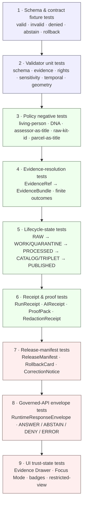

<!-- [KFM_META_BLOCK_V2]
doc_id: kfm://doc/runbook-people-dna-land-no-network-test
title: People/DNA/Land — No-Network Test Runbook
type: standard
version: v0.1-draft
status: draft
owners: Docs steward; People/DNA/Land domain steward; QA owner (PLACEHOLDER — verify against governance register)
created: 2026-05-12
updated: 2026-05-12
policy_label: internal-doc
related:
  - docs/doctrine/directory-rules.md
  - docs/domains/people-dna-land/README.md            # PROPOSED
  - docs/runbooks/governed_ai_VALIDATION.md           # PROPOSED
  - docs/runbooks/ui_VALIDATION.md                    # PROPOSED
  - tests/fixtures/domains/people-dna-land/README.md  # PROPOSED
  - policy/domains/people-dna-land/README.md          # PROPOSED
  - policy/sensitivity/people-dna-land/               # PROPOSED
  - policy/consent/people-dna-land/                   # PROPOSED
  - docs/registers/VERIFICATION_BACKLOG.md            # PROPOSED
tags: [kfm, runbook, people-dna-land, testing, no-network, deterministic, fixtures, governance, sensitivity]
notes:
  - Path is PROPOSED per Domain Placement Law (Directory Rules §12) and pending repo-mounted verification.
  - All tool identities and command lines are PROPOSED until repo evidence confirms package manager, framework, and runners.
  - This runbook prescribes procedure; it does not claim any of the prescribed tests, validators, or fixtures currently exist in the repository.
[/KFM_META_BLOCK_V2] -->

# People/DNA/Land — No-Network Test Runbook

> A deterministic, fixture-driven proof routine for the People, Genealogy, DNA, and Land domain — exercising the KFM trust spine end-to-end without crossing any live source, model runtime, network endpoint, or canonical store boundary.

[](#)
[](#)
[](#)
[](#)
[](#)
[](#)

**Status:** draft &nbsp;·&nbsp; **Owners:** Docs steward · People/DNA/Land domain steward · QA owner *(placeholders — verify against governance register)* &nbsp;·&nbsp; **Last updated:** 2026-05-12

---

## Contents

- [1. Purpose and scope](#1-purpose-and-scope)
- [2. Doctrinal anchors](#2-doctrinal-anchors)
- [3. What "no-network" means here](#3-what-no-network-means-here)
- [4. Test pyramid for People/DNA/Land](#4-test-pyramid-for-peopledna-land)
- [5. Required fixtures and mock markers](#5-required-fixtures-and-mock-markers)
- [6. Execution flow](#6-execution-flow)
- [7. Command families (PROPOSED)](#7-command-families-proposed)
- [8. Pass criteria and finite outcomes](#8-pass-criteria-and-finite-outcomes)
- [9. Sensitivity guardrails specific to this domain](#9-sensitivity-guardrails-specific-to-this-domain)
- [10. Failure modes and triage](#10-failure-modes-and-triage)
- [11. Reversibility and rollback posture](#11-reversibility-and-rollback-posture)
- [12. Verification backlog](#12-verification-backlog)
- [13. Directory Rules basis for this path](#13-directory-rules-basis-for-this-path)
- [14. Related docs](#14-related-docs)
- [Appendix A — Object-family fixture matrix](#appendix-a--object-family-fixture-matrix)
- [Appendix B — Doctrine citations](#appendix-b--doctrine-citations)

---

## 1. Purpose and scope

This runbook prescribes a **deterministic, no-network test pass** for the People, Genealogy, DNA, and Land domain (lane: `people-dna-land`). It is the first proof layer that any change touching domain schemas, contracts, validators, policies, fixtures, evidence-resolution code, governed API surfaces, or UI trust-state rendering for this lane MUST satisfy before any live-source or runtime-bound test is even considered. **CONFIRMED doctrine:** the first KFM implementation package is "no-network and fixture-driven" and the test pyramid begins with deterministic no-network fixture tests, schema/contract tests, validator units, policy negatives, evidence-resolution, lifecycle, receipt/proof, release-manifest, governed-API envelope, and UI trust-state tests — *only later* live-source or runtime tests.

**In scope.** The fixture-only proof that the trust spine — source admission → lifecycle state → validation → evidence resolution → policy decision → catalog/proof closure → release decision → governed API / UI payload → correction → rollback — operates for People/DNA/Land objects without crossing any forbidden boundary.

**Out of scope.** Live source connectors (GEDCOM ingest, DNA vendor APIs, county recorder fetchers); live model providers (Ollama, hosted LLMs); production release; production auth/SSO; database, graph, or vector-index migrations; cross-domain joins to Settlements, Roads/Rail, Archaeology, Agriculture. Each of these is covered by a separate runbook or is intentionally deferred.

> [!NOTE]
> This runbook **prescribes** procedure. It does **not** claim that any of the listed tests, validators, fixtures, or CI jobs currently exist in the repository. Implementation status is **UNKNOWN** until verified against a mounted repo.

[Back to top](#contents)

---

## 2. Doctrinal anchors

The behaviors below are non-negotiable for this runbook. They predate this file and are inherited from KFM core doctrine.

| Anchor | What it forces | Truth |
|---|---|---|
| **Cite-or-abstain** | Every claim that depends on evidence resolves to an `EvidenceBundle`; missing evidence → `ABSTAIN`, not invention. | CONFIRMED doctrine |
| **Lifecycle invariant** | `RAW → WORK / QUARANTINE → PROCESSED → CATALOG / TRIPLET → PUBLISHED`. Promotion is a **governed state transition, not a file move.** | CONFIRMED doctrine |
| **Trust membrane** | Public clients and normal UI surfaces consume governed APIs and released payloads only; they never read `RAW`, `WORK`, `QUARANTINE`, canonical stores, model runtimes, vector indexes, or internal handles directly. | CONFIRMED doctrine |
| **Finite outcomes** | Governed-API and AI surfaces return `ANSWER` / `ABSTAIN` / `DENY` / `ERROR` — never freeform text outside that envelope. | CONFIRMED doctrine |
| **Fail-closed sensitivity** | For People/DNA/Land: living-person output and DNA-derived output are **denied or restricted by default**; raw kit/vendor IDs and DNA segments are not public; assessor/tax records are not title truth; parcel geometry is not title-boundary proof. | CONFIRMED doctrine |
| **Fixture rule** | Every major object family has *at least one* valid, one invalid, one denied, one abstention, and one rollback or correction fixture. Sensitive lanes use public-safe transformed fixtures — never real living-person data, real DNA material, or real restricted geometry. | CONFIRMED doctrine |
| **Watcher-as-non-publisher** | Workers, watchers, and connectors emit receipts and candidate decisions; they MUST NOT publish or rewrite catalog. | CONFIRMED doctrine |
| **AI is interpretive** | `MockAdapter` is the default in this runbook; the AI surface MUST NOT answer without admissible evidence, MUST cite, and MUST abstain on missing evidence. | CONFIRMED doctrine |

[Back to top](#contents)

---

## 3. What "no-network" means here

"No-network" in this runbook is **stronger than "offline."** It is a posture, enforced by fixtures, harnesses, and boundary tests.

**A no-network test pass MUST hold all of these simultaneously:**

1. **No outbound HTTP, gRPC, DNS, or socket traffic** from any test process, validator, evidence resolver, policy engine, governed-API adapter, or UI test runner. Outbound traffic is a runner-level failure regardless of test assertions.
2. **No live model providers.** Only the `MockAdapter` (per the governed-AI doctrine) is engaged. The MockAdapter answers only over fixture-resident `EvidenceBundle` projections and emits an `AIReceipt` for every call.
3. **No live source fetches.** Connector code is exercised through pre-recorded fixture payloads under `data/raw/people-dna-land/<source_id>/<run_id>/` *(PROPOSED layout per Directory Rules §9.1)* with explicit fixture markers — never against live GEDCOM, DNA vendor, county recorder, assessor, or PLSS endpoints.
4. **No canonical-store reads from the public path.** Any code path that simulates the `apps/explorer-web/` surface reads only released, public-safe payloads — never `data/raw|work|quarantine|processed`.
5. **No real living-person, DNA, or restricted-geometry content.** Fixtures use synthetic identities, synthetic kit tokens, generalized geometry, and obvious mock markers.
6. **Deterministic.** Same fixtures + same code → byte-identical receipts, envelope payloads, and policy decisions. Non-determinism (random IDs, wall-clock timestamps not pinned, unseeded RNG) is a runbook failure.

> [!WARNING]
> **No real DNA material, no real living-person records, no real-precision parcel geometry, no real kit/vendor IDs may enter fixtures under any circumstance.** This rule has no exceptions — not for "convenience," not for "more realism," not for "just this one steward review." Real material moves through the governed intake path (`data/raw/` → quarantine → review), not through the test corpus.

[Back to top](#contents)

---

## 4. Test pyramid for People/DNA/Land

The pyramid runs **bottom-up**: a layer is meaningful only if every layer below it is green. A red layer halts the run; later layers are not attempted.



> [!NOTE]
> The pyramid above reflects KFM-wide CONFIRMED doctrine on test ordering, **specialized** for the People/DNA/Land lane in the policy-negatives layer (F3) and the receipt layer (F6, where `RedactionReceipt` is critical for this domain). The exact runner names, file layout, and module identities remain PROPOSED until verified.

[Back to top](#contents)

---

## 5. Required fixtures and mock markers

Each People/DNA/Land object family requires the standard five-fixture set. Synthetic, mock-marked, public-safe.

| Object family | valid | invalid | denied | abstain | rollback / correction |
|---|---|---|---|---|---|
| `PersonAssertion` | ✅ | ✅ | living-person → deny | missing evidence → abstain | correction notice on identity merge |
| `PersonCanonical` | ✅ | ✅ | living-person → deny | unresolved identity → abstain | rollback on bad merge |
| `NameAssertion` | ✅ | ✅ | n/a | conflicting names → abstain | correction notice |
| `RelationshipAssertion` | ✅ | ✅ | living-relationship inference → deny | unresolved → abstain | hypothesis revoked |
| `GenealogyRelationship` | ✅ | ✅ | living-link → deny | unresolved → abstain | rollback on bad link |
| `FamilyGroup` | ✅ | ✅ | living-member → deny | partial → abstain | correction notice |
| `LifeEvent` | ✅ | ✅ | living-person → deny | unsourced → abstain | correction notice |
| `ResidenceEvent` | ✅ | ✅ | living-residence → deny | unsourced → abstain | correction notice |
| `MigrationEvent` | ✅ | ✅ | living-trajectory → deny | unresolved → abstain | correction notice |
| `DNAMatchEvidence` | ✅ | ✅ | **default deny (restricted)** | missing consent → abstain | revocation receipt |
| `DNASegment` | ✅ | ✅ | **default deny (restricted)** | missing consent → abstain | revocation receipt |
| `DNAKitToken` | ✅ | ✅ | raw kit/vendor ID exposure → deny | missing consent → abstain | revocation receipt |
| `ConsentGrant` | ✅ | ✅ | expired/revoked → deny | unresolved scope → abstain | revocation cascade |
| `RevocationReceipt` | ✅ | ✅ | n/a | n/a | revocation closure |
| `LandInstrument` (patent, deed, mortgage, lien, easement, lease, mineral, water, access, probate) | ✅ | ✅ | unclear rights → deny | gap in chain → abstain | correction notice |
| `DeedInstrument` / `TitleInstrument` | ✅ | ✅ | assessor-as-title → deny | gap → abstain | correction notice |
| `LegalDescription` | ✅ | ✅ | ambiguous metes → deny | gap → abstain | correction notice |
| `LandOwnershipAssertion` / `OwnershipInterval` | ✅ | ✅ | assessor-as-title → deny | gap → abstain | correction notice |
| `ParcelVersion` / `LandParcel` | ✅ | ✅ | parcel-as-title-boundary → deny | unsourced geometry → abstain | rollback on geometry error |
| `AssessorRecord` / `TaxRecord` | ✅ | ✅ | used as title → deny | partial → abstain | correction notice |

**Mock-marker rules.** Every fixture file MUST include an obvious mock marker in a top-level field (e.g., `"$mock": true`, `"$kfm_fixture": "people-dna-land/<family>/<scenario>"`) so that no fixture can be confused with released evidence even if it leaks out of the test tree. Fixtures are **not** publication artifacts and MUST NOT carry signatures, release manifests, or release IDs that match production form.

> [!IMPORTANT]
> Sensitive-lane fixtures use **public-safe transformations** in place of real material: synthetic personal identifiers, synthetic kit tokens, generalized or fabricated geometry, fabricated centimorgan profiles, and fabricated source-document references. The fixture authoring discipline mirrors the Archaeology and Fauna sensitivity posture and inherits the same redaction/transform receipts.

[Back to top](#contents)

---

## 6. Execution flow

The pass is conceptually one pipeline, even if implemented as several test commands. A passing run produces a deterministic set of receipts and a green rollup.


**Pre-flight, every run:**

1. Clean working tree; record `git rev-parse HEAD` in the run receipt header. *(PROPOSED — depends on repo presence.)*
2. Pin wall-clock and any RNG seed. Determinism is mandatory.
3. Assert network isolation. Outbound traffic is a runner-level abort.
4. Engage `MockAdapter` only. No provider adapter (Ollama, hosted LLM) is permitted in this pass.

**Post-run, every run:**

1. Emit `RunReceipt` per fixture set with `spec_hash` matching the canonical JCS digest of the input.
2. Emit a rollup summarizing per-layer pass/fail counts.
3. Emit a boundary-scan report: no forbidden imports, no canonical-store reads, no outbound calls observed.
4. Diff receipts against the previous green baseline; any non-determinism is a failure.

[Back to top](#contents)

---

## 7. Command families (PROPOSED)

> [!NOTE]
> **Every command line below is PROPOSED.** The actual tool identities (package manager, schema validator, policy engine, test runner) are **UNKNOWN** at the time of writing because the repository is not mounted in this session. The intent is that the runbook *prescribes* the family of operations; the exact invocation lands as a follow-up once repo evidence resolves the toolchain (see §12 Verification backlog).

| # | Layer | Command family (PROPOSED) | Expected result | Status |
|---|---|---|---|---|
| 1 | Schema & contract fixtures | `<schema-validator> validate schemas/contracts/v1/domains/people-dna-land/**/*.schema.json fixtures/domains/people-dna-land/**/*.json` | All `valid/` fixtures pass; all `invalid/` fail with the documented error class. | PROPOSED |
| 2 | Validator units | `<test-runner> run tests/domains/people-dna-land/validators/` | Every rights / sensitivity / temporal / geometry validator passes its positive and negative cases. | PROPOSED |
| 3 | Policy negatives | `<policy-engine> test policy/domains/people-dna-land/ -d fixtures/domains/people-dna-land/` | Deny on living-person, DNA-exposure, assessor-as-title, parcel-as-title-boundary, missing-consent, revoked-consent. | PROPOSED |
| 4 | Evidence resolution | `<test-runner> run tests/domains/people-dna-land/evidence/` | `EvidenceRef` resolves to `EvidenceBundle`; missing → `ABSTAIN`; restricted → `DENY`. | PROPOSED |
| 5 | Lifecycle state | `<test-runner> run tests/domains/people-dna-land/lifecycle/` | Promotion is a state transition, not a file move; no public write occurs in dry-run. | PROPOSED |
| 6 | Receipts & proofs | `<test-runner> run tests/domains/people-dna-land/receipts/` | `RunReceipt`, `AIReceipt`, `RedactionReceipt` schemas valid; `spec_hash` matches input JCS digest. | PROPOSED |
| 7 | Release manifest | `<test-runner> run tests/domains/people-dna-land/release/` | `ReleaseManifest` closes proof; `RollbackCard` is reachable; `CorrectionNotice` is reachable. | PROPOSED |
| 8 | Governed-API envelope | `<test-runner> run tests/domains/people-dna-land/api/` | All responses are `RuntimeResponseEnvelope`s with finite outcome; `MockAdapter` is the only adapter loaded. | PROPOSED |
| 9 | UI trust state | `<test-runner> run tests/domains/people-dna-land/ui/` | Evidence Drawer renders source role, rights, sensitivity, review state, freshness, release state; restricted view never leaks raw kit IDs / segments / exact geometry. | PROPOSED |
| 10 | Boundary scan | `<static-grep-or-import-boundary-tool> scan` | No browser-side raw store, vector DB, object store, model runtime, or internal DB call; no outbound network call during test run. | PROPOSED |

**Convention for documenting the actual runner.** When the toolchain is verified against a mounted repo, the runner team updates this table in a single ADR-noted PR rather than editing values piecemeal. The PR description references the relevant ADR (e.g., `ADR-people-dna-land-runner-toolchain.md`, PROPOSED).

[Back to top](#contents)

---

## 8. Pass criteria and finite outcomes

A run is **green** only when every condition below holds simultaneously. A single failure halts the pyramid and the rollup reports the first failing layer.

| Criterion | Requirement |
|---|---|
| Determinism | Two consecutive clean runs over identical fixtures produce byte-identical receipts and identical rollups. |
| Network isolation | Zero outbound network calls observed by the runner sandbox. |
| Provider isolation | Only `MockAdapter` is loaded; no provider adapter is reachable. |
| Schema closure | Every fixture validates against `schemas/contracts/v1/domains/people-dna-land/` *(PROPOSED home per ADR-0001)*; every `invalid/` fixture fails for its documented reason. |
| Validator parity | Each validator passes its positive AND negative cases; coverage of rights / sensitivity / temporal / geometry / consent is complete. |
| Policy negatives | Every documented deny case in §9 produces a `DENY` decision with a recorded reason. |
| Evidence finite outcomes | Every `EvidenceRef` lookup returns one of: resolved bundle, abstain (missing), deny (restricted), error (malformed). No silent fallback. |
| Lifecycle integrity | No public write originates from `RAW` / `WORK` / `QUARANTINE`. Promotion is recorded as a state transition with receipt. |
| Receipt closure | `RunReceipt`, `AIReceipt`, `RedactionReceipt` are present where required; `spec_hash` matches input JCS canonical digest. |
| Release closure | `ReleaseManifest` references `EvidenceBundle`, `ValidationReport`, `RollbackCard`, and a correction path. |
| Envelope discipline | Every governed-API response is `ANSWER` / `ABSTAIN` / `DENY` / `ERROR`. No free-form fallback. |
| UI trust state | Evidence Drawer renders the trust badges; restricted-view fixtures show redacted state, not raw values. |
| Mock markers | Every fixture file carries an obvious mock marker; no fixture file impersonates a released artifact. |

**Finite-outcome legend.**

| Outcome | Meaning in this runbook |
|---|---|
| `ANSWER` | The requested object is releasable and supported by an `EvidenceBundle`. |
| `ABSTAIN` | Evidence is missing, partial, stale, or under review. AI MUST NOT compensate. |
| `DENY` | Policy refused the request (living-person, DNA exposure, raw kit ID, assessor-as-title, parcel-as-title, missing/revoked consent, sovereignty, unresolved rights). |
| `ERROR` | Schema, validator, or runner failure. Operator action required. |

[Back to top](#contents)

---

## 9. Sensitivity guardrails specific to this domain

People/DNA/Land carries the strongest default-deny posture in KFM after Archaeology sovereignty. Each guardrail below MUST be exercised by at least one negative fixture and one policy test.

| Concern | Rule | Fixture treatment | Negative test class |
|---|---|---|---|
| **Living persons** | Denied or restricted by default; living-flag must be set; public release requires explicit authorization recorded in `ReviewRecord`. | All "living" fixtures use synthetic identities with the living-flag set; `ConsentGrant` references are synthetic. | `policy/domains/people-dna-land/living_person.rego` *(PROPOSED)* |
| **DNA match / segment data** | Default deny; raw kit IDs and segment data never public; aggregate or context-only derivatives may release under explicit consent + sensitivity policy. | Synthetic centimorgan profiles; synthetic kit tokens; no real vendor identifiers. | `policy/domains/people-dna-land/dna_restriction.rego` *(PROPOSED)* |
| **Raw kit / vendor ID exposure** | Deny in any payload that would reach a non-steward surface. | Fixture kit tokens are obviously synthetic (e.g., `KIT-MOCK-…`). | `dna_raw_id_no_log.rego` *(PROPOSED)* |
| **Consent / revocation** | Revocation cascades through all derived projections; a revoked match MUST disappear from drawers, focus answers, graphs, and tile layers. | `RevocationReceipt` fixtures exercise the cascade; pre/post-revocation snapshots compared. | `consent_revocation_cleanup.rego` *(PROPOSED)* |
| **Assessor / tax records as title** | Deny equating assessor or tax records with title truth. | Mixed fixtures where assessor and title disagree force the deny path. | `assessor_as_title_deny.rego` *(PROPOSED)* |
| **Parcel geometry as title-boundary** | Deny parcel geometry standing as title-boundary proof without supporting `LandInstrument` + source role. | Geometry-only fixtures must `ABSTAIN` or `DENY`, never `ANSWER`. | `parcel_geometry_not_title.rego` *(PROPOSED)* |
| **Chain-of-title gaps** | Gaps must be visible; AI must not "smooth" a gap by inferring continuity. | Fixtures with documented gaps; pass requires `ABSTAIN` on the gap span. | `chain_of_title_gap.rego` *(PROPOSED)* |
| **Graph projections leaking sensitive joins** | Sensitive joins (DNA × living-person, kit × vendor, parcel × living-owner) MUST NOT appear in published graph projections. | Fixtures attempt the join; pass requires policy deny. | `graph_projection_safety.rego` *(PROPOSED)* |
| **AI hypothesizing identity / relationship** | AI may compare evidence and explain limitations; it MUST NOT manufacture identity or relationship claims without admissible bundles. | Fixture asks for an unsupported merge; pass requires `ABSTAIN`. | `ai_no_identity_invention.rego` *(PROPOSED)* |

> [!CAUTION]
> A **single missing negative test** in this section is grounds to mark the affected component PROPOSED and block public release of the lane, even if every positive case passes. The asymmetry is deliberate: in this domain, harm from a false `ANSWER` outweighs benefit from one more positive surface.

[Back to top](#contents)

---

## 10. Failure modes and triage

| Symptom | Likely cause | First triage step |
|---|---|---|
| Outbound network call detected | Test or validator unintentionally calls a live source/model. | Identify the call site; replace with fixture or `MockAdapter`; add a boundary-scan rule to prevent recurrence. |
| Non-deterministic receipt | Unpinned clock, unseeded RNG, or unordered iteration. | Pin clock and seed; sort keys via JCS canonicalization; rerun. |
| `ANSWER` returned on a deny case | Policy bundle drift, fixture mislabel, or validator regression. | Diff policy bundle against last green; verify fixture mock marker and scenario tag; run the policy negative in isolation. |
| `ABSTAIN` on a case that should `ANSWER` | Missing `EvidenceRef` → `EvidenceBundle` link; new schema field not yet wired. | Inspect the resolver output; check schema version and `spec_hash`; verify catalog closure. |
| Schema valid but contract test fails | Object passes shape but violates meaning (e.g., assessor used as title). | Re-read the contract Markdown for the object family; tighten the validator or policy. |
| Revocation cascade incomplete | A derived projection (graph, drawer payload, layer) retained a reference past revocation. | Trace the projection path; add a revocation-cascade test for that projection. |
| `RedactionReceipt` missing on a transformed fixture | Transform applied without recording the transform. | Require redaction receipt emission at every public-safe transform site. |
| Mock fixture appears outside the test tree | Fixture path or build copied a fixture into a release surface. | Treat as a near-miss release incident; remove, audit, document in `docs/registers/DRIFT_REGISTER.md` *(PROPOSED)*. |

[Back to top](#contents)

---

## 11. Reversibility and rollback posture

This runbook is **fixture-only and test-only**. It writes no public artifacts. Its rollback posture is correspondingly small but explicit.

- **Test artifacts.** Receipts, rollups, and boundary-scan reports for this runbook live under an ephemeral test-output path *(PROPOSED: `data/receipts/test/people-dna-land/<run_id>/` or repo-equivalent ephemeral location — verify against Directory Rules §9.1 once mounted)*. They are not promotion candidates and MUST NOT be referenced by a `ReleaseManifest`.
- **Fixture changes.** A fixture change is a content change. It rides on a PR with a CODEOWNERS review by the People/DNA/Land steward and a docs note. Reverting the PR is the rollback.
- **Schema changes touched by this runbook.** A schema change is governed by ADR-0001 (`schemas/contracts/v1/...`); rollback is the schema-version revert plus old-fixture parity tests, per Directory Rules §14.3.
- **Policy changes touched by this runbook.** A policy change reverts the policy bundle and **fails closed** while ambiguous, per the broader policy-rollback posture.
- **Documentation.** This file's revisions are tracked in git; revisions that materially change procedure SHOULD reference the relevant ADR or `DRIFT_REGISTER` entry.

> [!NOTE]
> The runbook **never** writes to `data/published/`, `release/`, or any catalog surface. If a run appears to have done so, treat it as a near-miss release incident, not a test failure.

[Back to top](#contents)

---

## 12. Verification backlog

Items below are open. Each one is `NEEDS VERIFICATION` until checked against a mounted repository. None of them should be claimed as fact in a downstream doc until resolved.

| # | Item | What would settle it | Status |
|---|---|---|---|
| V1 | Repository mount and current branch state | `git status --short`; `git branch --show-current`; repo tree scan | NEEDS VERIFICATION |
| V2 | Schema validator identity and version | Repo lockfile; `tools/validators/` README; CI workflow | NEEDS VERIFICATION |
| V3 | Policy engine identity and version (OPA / Conftest / Rego version) | `policy/README.md`; CI workflow; tool lockfile | NEEDS VERIFICATION |
| V4 | Test runner identity (pytest / vitest / jest / etc.) and package manager | `package.json` / `pyproject.toml` / `Cargo.toml` / repo equivalent | NEEDS VERIFICATION |
| V5 | Existence and shape of `schemas/contracts/v1/domains/people-dna-land/` | Repo file inspection | NEEDS VERIFICATION |
| V6 | Existence and shape of `policy/domains/people-dna-land/` and `policy/sensitivity/people-dna-land/` and `policy/consent/people-dna-land/` | Repo file inspection | NEEDS VERIFICATION |
| V7 | Existence and shape of `tests/domains/people-dna-land/` and `fixtures/domains/people-dna-land/` (or `tests/fixtures/...` per local convention) | Repo file inspection; fixture-home rule in `tests/README.md` | NEEDS VERIFICATION |
| V8 | MockAdapter location (`runtime/mock/` per Directory Rules §10.1 vs. `apps/governed-api/src/ai/MockAdapter.ts` per prior plan) | Repo inspection; ADR-focus-model-adapter-boundary | NEEDS VERIFICATION |
| V9 | Living-person policy enforcement | Mounted repo: schemas, policies, tests, fixtures, receipts | NEEDS VERIFICATION |
| V10 | DNA consent / revocation enforcement | Mounted repo: schemas, policies, tests, fixtures, receipts | NEEDS VERIFICATION |
| V11 | Land instrument chain logic | Mounted repo: schemas, policies, tests, fixtures, receipts | NEEDS VERIFICATION |
| V12 | Geometry-role boundary logic (parcel ≠ title boundary) | Mounted repo: schemas, policies, tests, fixtures, receipts | NEEDS VERIFICATION |
| V13 | UI / API restricted-field no-leak behavior | Mounted repo: governed-API tests, UI snapshot or e2e tests | NEEDS VERIFICATION |
| V14 | Receipt home for ephemeral test runs | Directory Rules §9.1 cross-check; `data/receipts/README.md` | NEEDS VERIFICATION |
| V15 | Boundary-scan tool identity (static grep, import-boundary linter, sandbox network deny) | CI workflow inspection | NEEDS VERIFICATION |

[Back to top](#contents)

---

## 13. Directory Rules basis for this path

The path `docs/runbooks/people-dna-land/NO_NETWORK_TEST_RUNBOOK.md` is **PROPOSED**. Its basis in Directory Rules:

- **Responsibility root: `docs/`.** A runbook *explains a procedure to humans*; under Directory Rules §5 and §6.1, that responsibility belongs to `docs/`. Specifically, `docs/runbooks/` is listed as the canonical home for "ops procedures, rollback drills, validation runs."
- **Domain segment, not domain root.** Per Domain Placement Law (§12), the domain `people-dna-land` MUST appear as a **segment** inside a responsibility root, never as a root folder. `docs/runbooks/people-dna-land/` follows the lane pattern that is uniformly applied across hydrology, soil, fauna, flora, habitat, geology, atmosphere, roads-rail-trade, settlements-infrastructure, archaeology, hazards, agriculture, and people-dna-land.
- **Lane name consistency.** `people-dna-land` is the lane segment used by `policy/domains/people-dna-land/` (Directory Rules §6.5) and by the v1.1 Atlas crosswalk (row 16). This runbook uses the same segment to keep authority-surface discovery consistent across docs, policy, schemas, tests, and fixtures.
- **Filename convention.** A flat `docs/runbooks/people-dna-land_NO_NETWORK_TEST.md` would also be defensible and matches the prior naming style of `ui_LOCAL_DEV.md`, `governed_ai_VALIDATION.md`. The lane-segmented form is preferred here for two reasons: (1) Domain Placement Law favors a lane segment over a topic-flat name when the lane has more than one runbook expected; (2) it keeps the per-lane runbook set co-locatable in a single folder as the lane grows (validation, rollback, intake, sensitivity drill, revocation drill). If the project commits to flat naming by ADR, this file moves to `docs/runbooks/people-dna-land_NO_NETWORK_TEST.md` under a routine §14.1 migration with `git mv`.

> [!NOTE]
> No new canonical root, compatibility root, or sibling under `data/` is created by this file. No ADR is required for this placement.

[Back to top](#contents)

---

## 14. Related docs

The list below is partly placeholder. Each entry is marked CONFIRMED if it is present in the project knowledge consulted for this runbook, or PROPOSED if it is a doctrinally expected sibling that has not been verified against a mounted repo.

| Doc | Role | Status |
|---|---|---|
| `docs/doctrine/directory-rules.md` | Placement and lifecycle doctrine; cited throughout this runbook. | CONFIRMED |
| `docs/domains/people-dna-land/README.md` | Domain README, ubiquitous language, scope, non-ownership. | PROPOSED |
| `docs/sources/SOURCE_DESCRIPTOR_STANDARD.md` | Source descriptor and rights/sensitivity intake. | PROPOSED |
| `docs/runbooks/governed_ai_LOCAL_DEV.md` | MockAdapter and provider-adapter local dev. | PROPOSED |
| `docs/runbooks/governed_ai_VALIDATION.md` | Focus Mode evidence / citation / policy validation. | PROPOSED |
| `docs/runbooks/governed_ai_ROLLBACK.md` | AI adapter rollback and kill switch. | PROPOSED |
| `docs/runbooks/ui_VALIDATION.md` | UI validation, accessibility, contract, e2e smoke. | PROPOSED |
| `docs/runbooks/ui_ROLLBACK.md` | UI rollback, feature flag, schema deprecation. | PROPOSED |
| `docs/adr/ADR-0001-schema-home.md` | Schema-home convention (`schemas/contracts/v1/...`). | PROPOSED |
| `policy/domains/people-dna-land/README.md` | Domain policy bundle index. | PROPOSED |
| `tests/fixtures/domains/people-dna-land/README.md` (or `fixtures/domains/...`) | Fixture rules and mock markers for this lane. | PROPOSED |
| `docs/registers/VERIFICATION_BACKLOG.md` | Tracks the items in §12. | PROPOSED |
| `docs/registers/DRIFT_REGISTER.md` | Tracks any near-miss release or fixture-leak incidents. | PROPOSED |

[Back to top](#contents)

---

## Appendix A — Object-family fixture matrix

<details>
<summary>Expand: per-object-family fixture filenames (PROPOSED layout)</summary>

The structure below is a **proposed** layout that follows Domain Placement Law. The actual fixture-home convention (root `fixtures/` vs. `tests/fixtures/`) MUST be verified against the local `tests/README.md` per Directory Rules §6.6 before any of these paths are created.

```text
fixtures/domains/people-dna-land/
├── README.md                               # mock-marker rule; sensitivity rule; index
├── person_assertion/
│   ├── valid/                              # synthetic identity, fully sourced
│   ├── invalid/                            # schema-violating
│   ├── denied/                             # living-person trigger
│   ├── abstain/                            # missing evidence
│   └── rollback/                           # identity-merge undo
├── person_canonical/
├── name_assertion/
├── relationship_assertion/
├── genealogy_relationship/
├── family_group/
├── life_event/
├── residence_event/
├── migration_event/
├── dna_match_evidence/                     # default-deny scenarios dominate
├── dna_segment/
├── dna_kit_token/                          # synthetic tokens only
├── consent_grant/
├── revocation_receipt/
├── land_instrument/                        # patent, deed, mortgage, lien, etc.
├── deed_instrument/
├── title_instrument/
├── legal_description/
├── land_ownership_assertion/
├── ownership_interval/
├── parcel_version/
├── land_parcel/
├── assessor_record/
├── tax_record/
└── _cross/                                 # cross-object scenarios (chain-of-title, revocation cascade, graph projection)
```

Every leaf folder contains the five-fixture standard set (valid, invalid, denied, abstain, rollback/correction) per the rule recorded in §5 and CONFIRMED by the project knowledge consulted.

</details>

## Appendix B — Doctrine citations

<details>
<summary>Expand: short-name citations grounding this runbook</summary>

| Short name | Document | Use in this runbook |
|---|---|---|
| `[DIRRULES]` | Directory Rules (`docs/doctrine/directory-rules.md`) | Path placement, Domain Placement Law, lifecycle invariant |
| `[DOM-PEOPLE]` | People / DNA / Land domain dossier | Object families, sensitivity posture, ubiquitous language |
| `[ENCY]` | KFM Domain and Capability Encyclopedia | Domain mission, source families, pipeline shape |
| `[UNIFIED]` | KFM Unified Implementation Architecture Build Manual | Test pyramid; first-package no-network rule; test classes |
| `[UIAI]` | Whole-UI + Governed AI Expansion Report | MockAdapter posture; runbook target paths; fixture/CI plan |
| `[MAP-MASTER]` | Master MapLibre Components / Functions / Features | No-network watcher dry-run receipts; spec_hash and JCS |
| `[GAI]` | Governed AI dossier | AI interpretive role; ANSWER/ABSTAIN/DENY/ERROR envelope |

</details>

---

**Related:** [Directory Rules](../../doctrine/directory-rules.md) · [People/DNA/Land domain README](../../domains/people-dna-land/README.md) *(PROPOSED)* · [Governed AI validation runbook](../governed_ai_VALIDATION.md) *(PROPOSED)* · [UI validation runbook](../ui_VALIDATION.md) *(PROPOSED)*

**Last updated:** 2026-05-12 &nbsp;·&nbsp; **Status:** draft &nbsp;·&nbsp; **Truth posture:** procedure is prescriptive; implementation status is `NEEDS VERIFICATION`

[Back to top](#contents)
