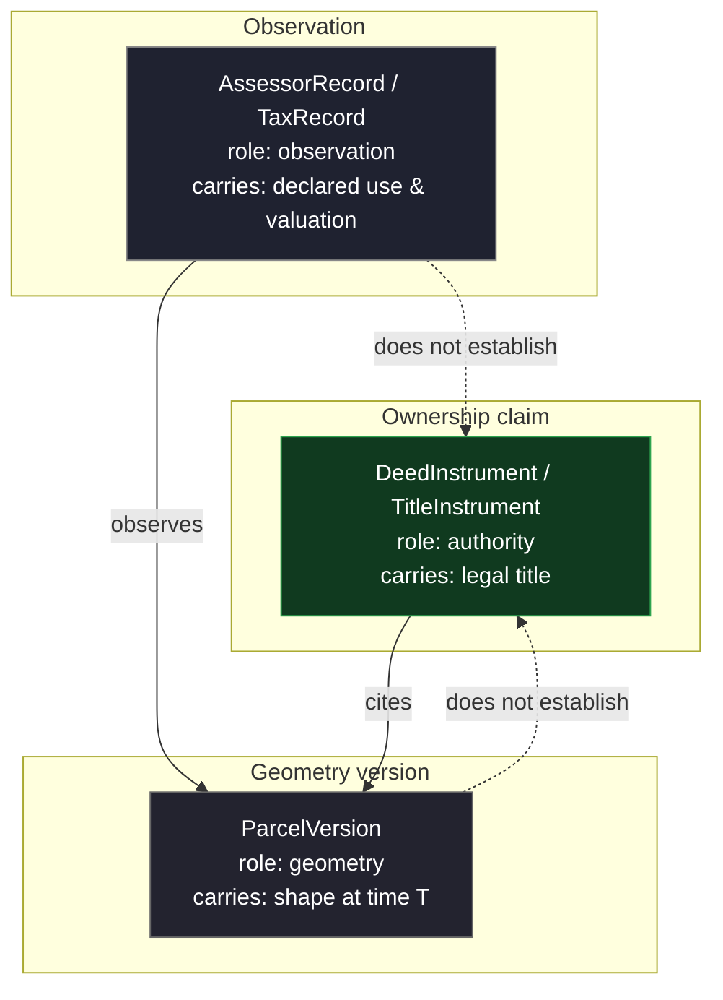

<!-- [KFM_META_BLOCK_V2]
doc_id: kfm://doc/runbook/people-dna-land/promotion
title: People, Genealogy, DNA, and Land Ownership — Promotion Runbook
type: standard
version: v0.1
status: draft
owners: <docs steward + people-dna-land subsystem owner>
created: 2026-05-12
updated: 2026-05-12
policy_label: public
related:
  - docs/doctrine/directory-rules.md
  - docs/doctrine/lifecycle-law.md
  - docs/doctrine/trust-membrane.md
  - docs/domains/people-dna-land/README.md
  - docs/runbooks/people-dna-land/ROLLBACK_RUNBOOK.md
  - docs/runbooks/people-dna-land/VALIDATION_RUNBOOK.md
  - docs/adr/ADR-0001-schema-home.md
tags: [kfm, runbook, people-dna-land, promotion, governance, sensitivity, dna, living-person]
notes:
  - Status is draft until owners, ADR references, and paths are verified against mounted-repo evidence.
  - All paths quoted in this runbook are PROPOSED per Directory Rules §0 unless explicitly marked CONFIRMED.
[/KFM_META_BLOCK_V2] -->

# People, Genealogy, DNA, and Land Ownership — Promotion Runbook

Operational procedure for promoting `people-dna-land` objects through `RAW → WORK / QUARANTINE → PROCESSED → CATALOG / TRIPLET → PUBLISHED`, with living-person, DNA, and title/parcel safeguards built into every gate.


| Field | Value |
|---|---|
| **Status** | `draft` |
| **Owners** | `<docs steward + people-dna-land subsystem owner>` *(placeholder — verify against `CODEOWNERS`)* |
| **Last updated** | 2026-05-12 |
| **Doctrine class** | CONFIRMED for lifecycle invariant, gates, tier scheme, separation-of-duties; PROPOSED for paths, schemas, CI wiring, exact reason codes |
| **Promotion authority** | Domain steward + sensitivity reviewer + release authority + rights-holder representative (where applicable) |
| **Trust posture** | Deny-by-default for living-person, DNA, and private person-parcel joins |

> [!IMPORTANT]
> **Promotion is a governed state transition, not a file move.** A path-level move that bypasses validators, policy gates, evidence-bundle creation, catalog closure, and release-decision recording is a violation of the lifecycle invariant regardless of where the bytes land. *(CONFIRMED — `directory-rules.md` §9.1; [ENCY] [DIRRULES])*

---

## Contents

- [1. Scope](#1-scope)
- [2. Repo fit](#2-repo-fit)
- [3. Inputs accepted](#3-inputs-accepted)
- [4. Exclusions — what this runbook does not cover](#4-exclusions--what-this-runbook-does-not-cover)
- [5. The lifecycle, at a glance](#5-the-lifecycle-at-a-glance)
- [6. Domain non-negotiables before any promotion](#6-domain-non-negotiables-before-any-promotion)
- [7. Lifecycle gates — required artifacts and outcomes](#7-lifecycle-gates--required-artifacts-and-outcomes)
- [8. Promotion Gates A–G — checklist](#8-promotion-gates-ag--checklist)
- [9. Sensitivity tier matrix for People/DNA/Land](#9-sensitivity-tier-matrix-for-peopledn aland)
- [10. Source-role discipline — title vs. assessor vs. parcel-geometry](#10-source-role-discipline--title-vs-assessor-vs-parcel-geometry)
- [11. Separation of duties](#11-separation-of-duties)
- [12. Receipts emitted at each stage](#12-receipts-emitted-at-each-stage)
- [13. Failure-closed reason codes (this domain)](#13-failure-closed-reason-codes-this-domain)
- [14. Correction and rollback paths](#14-correction-and-rollback-paths)
- [15. Cross-lane considerations](#15-cross-lane-considerations)
- [16. Verification backlog](#16-verification-backlog)
- [17. Related docs](#17-related-docs)
- [Appendix A — Worked promotion examples](#appendix-a--worked-promotion-examples)
- [Appendix B — Glossary (placement-relevant)](#appendix-b--glossary-placement-relevant)

---

## 1. Scope

This runbook governs the **promotion procedure** for objects owned by the People, Genealogy, DNA, and Land Ownership domain (hereafter `people-dna-land`). It names the gates, the required artifacts at each gate, the reviewer separation, and the fail-closed outcome when a gate cannot close.

The domain owns *(CONFIRMED doctrine / PROPOSED implementation; [DOM-PEOPLE] [ENCY])*:

`PersonAssertion`, `PersonIdentityCandidate`, `GenealogyRelationship`, `FamilyGroup`, `LifeEvent`, `ResidenceEvent`, `MigrationEvent`, `LandOwnershipAssertion`, `DeedInstrument`, `TitleInstrument`, `AssessorRecord`, `TaxRecord`, `ParcelVersion`, `OwnershipInterval`, `DNAMatchEvidence`, `RelationshipHypothesis`, `ReviewRecord`.

The domain **does not own** settlements, roads/rail, archaeology, hydrology, agriculture, hazards, or spatial foundation. Those lanes provide context but **do not weaken living-person, DNA, title, or parcel-boundary controls** *(CONFIRMED — [DOM-PEOPLE] [ENCY])*.

[Back to top](#contents)

---

## 2. Repo fit

| Surface | PROPOSED path | Class |
|---|---|---|
| This runbook | `docs/runbooks/people-dna-land/PROMOTION_RUNBOOK.md` | Operational doctrine |
| Domain README (upstream) | `docs/domains/people-dna-land/README.md` | Domain doctrine |
| Validation runbook (sibling) | `docs/runbooks/people-dna-land/VALIDATION_RUNBOOK.md` | Operational doctrine |
| Rollback runbook (sibling) | `docs/runbooks/people-dna-land/ROLLBACK_RUNBOOK.md` | Operational doctrine |
| Contracts (downstream) | `contracts/domains/people-dna-land/` *(PROPOSED)* | Object meaning |
| Schemas (downstream) | `schemas/contracts/v1/domains/people-dna-land/` *(PROPOSED — per ADR-0001)* | Object shape |
| Policy (downstream) | `policy/domains/people-dna-land/` *(PROPOSED)* | Admissibility / release |
| Tests (downstream) | `tests/domains/people-dna-land/` *(PROPOSED)* | Enforcement proof |
| Fixtures (downstream) | `fixtures/domains/people-dna-land/` or `tests/fixtures/people-dna-land/` *(PROPOSED — pick one home)* | Golden / negative inputs |
| Pipelines (downstream) | `pipelines/domains/people-dna-land/` *(PROPOSED)* | Execution |

> [!NOTE]
> The existing `docs/runbooks/` examples in prior expansion reports use a **flat** convention (`ui_LOCAL_DEV.md`, `governed_ai_ROLLBACK.md`). This runbook adopts a **per-domain subdirectory** (`docs/runbooks/people-dna-land/`). Both are consistent with **Directory Rules §11** (*domain appears as a segment inside the responsibility root, never as a root itself*). The choice between conventions **NEEDS VERIFICATION** against a mounted repo and should be settled by short ADR if both shapes co-exist.

[Back to top](#contents)

---

## 3. Inputs accepted

Material this runbook governs the promotion of:

- Public historical records (census, vital records where public/legal), directory and probate records, court files.
- GEDCOM / GEDZip / tree overlays as **hypotheses**, not authoritative claims.
- Land patents, deeds, mortgages, liens, easements, leases, mineral/water/access instruments, probate instruments.
- Assessor and tax-roll records (treated as **observation**, not title truth).
- Plat / survey / metes-and-bounds / PLSS / subdivision / derived parcel geometry (treated as **geometry version**, not title-boundary proof).
- DNA vendor match CSV / segment / triangulation data — **restricted intake only**, default T4.

*(CONFIRMED scope / PROPOSED field realization; [DOM-PEOPLE] [ENCY])*

[Back to top](#contents)

---

## 4. Exclusions — what this runbook does not cover

This runbook **does not** cover:

- Settlement, road/rail, archaeology, hydrology, agriculture, hazards, or spatial-foundation promotions — those have their own per-domain runbooks.
- Source admission policy authorship — see `docs/sources/SOURCE_DESCRIPTOR_STANDARD.md` *(PROPOSED)*.
- Schema-home decisions — see `docs/adr/ADR-0001-schema-home.md`.
- Reviewer enrollment and identity provisioning — see `docs/governance/` *(PROPOSED)*.
- Atlas / supplement publication — see `docs/doctrine/` and the docs-steward runbook *(PROPOSED)*.
- Erasure vs. tombstone policy under right-to-be-forgotten obligations — **NEEDS VERIFICATION**; this is a deliberate open question deferred to `docs/runbooks/revocation.md` *(PROPOSED)*.

[Back to top](#contents)

---

## 5. The lifecycle, at a glance

The KFM lifecycle invariant applies to this domain without exception *(CONFIRMED — [DIRRULES] [DOM-PEOPLE] [ENCY])*:

```mermaid
flowchart LR
    SRC([Source<br/>candidate]) -->|SourceDescriptor| RAW[RAW]
    RAW -->|TransformReceipt<br/>ValidationReport<br/>PolicyDecision| WORK[WORK]
    RAW -->|defect detected| QUAR[QUARANTINE]
    WORK -->|ValidationReport pass<br/>+ RedactionReceipt / AggregationReceipt<br/>where sensitivity applies| PROC[PROCESSED]
    QUAR -.->|remediation| WORK
    PROC -->|CatalogMatrix entry<br/>EvidenceBundle close<br/>graph / triplet projections| CAT[CATALOG / TRIPLET]
    CAT -->|ReleaseManifest<br/>+ ReviewRecord<br/>+ rollback target<br/>+ correction path| PUB((PUBLISHED))
    PUB -.->|CorrectionNotice<br/>+ ReviewRecord| PUB
    PUB -.->|RollbackCard| CAT

    classDef public fill:#103a1f,stroke:#2ea44f,color:#fff
    classDef internal fill:#1f2230,stroke:#999,color:#fff
    classDef hold fill:#3a2310,stroke:#cc7a00,color:#fff
    class PUB public
    class RAW,WORK,PROC,CAT internal
    class QUAR hold
```



> [!CAUTION]
> **PUBLISHED is the only state from which the governed API may emit an `ANSWER`.** Public clients, the normal UI, and Focus Mode **must not** reach `RAW`, `WORK`, `QUARANTINE`, canonical/internal stores, graph internals, vector indexes, source APIs, or direct model runtimes. *(CONFIRMED — [ENCY] §24.6.2; [GAI]; [MAP-MASTER])*

[Back to top](#contents)

---

## 6. Domain non-negotiables before any promotion

These hold at **every** gate. A `ValidationReport`, `PolicyDecision`, or `ReviewRecord` that fails to enforce any of these must fail closed.

| # | Rule | Source |
|---|---|---|
| 1 | **Living-person fields are denied or restricted by default.** Aggregation by tract or county with an `AggregationReceipt` may release to T1; per-record exact exposure remains T4. | CONFIRMED — [DOM-PEOPLE]; [ENCY] §24.5.2 |
| 2 | **Raw DNA segment data is T4 default.** No transform releases it to a public tier. T3 only under explicit named consent / research agreement, with `PolicyDecision + ReviewRecord` and rights-holder rep on file. | CONFIRMED — [DOM-PEOPLE]; [ENCY] §24.5.2 |
| 3 | **Relationship hypotheses remain hypotheses.** Genealogy relations are assertions with evidence and confidence; promotion must not silently upgrade a hypothesis to a sourced finding. | CONFIRMED — [DOM-PEOPLE] §D |
| 4 | **Assessor / tax records are not title truth.** Treat as `AssessorRecord` / `TaxRecord` with source role `observation`; never collapse into `TitleInstrument`. | CONFIRMED — [DOM-PEOPLE] §A; [ENCY] |
| 5 | **Parcel geometry is not title-boundary proof.** `ParcelVersion` is a geometry version; legal title is carried by `DeedInstrument` / `TitleInstrument` evidence, not by `ParcelVersion` shape. | CONFIRMED — [DOM-PEOPLE] §A; [ENCY] |
| 6 | **Private person-parcel joins default T4.** Generalized parcel + de-identified person may release to T2 only, with `RedactionReceipt + ReviewRecord`. | CONFIRMED — [DOM-PEOPLE]; [ENCY] §24.5.2 |
| 7 | **Source-role downcast is forbidden.** A `model`-origin claim must not be promoted by relabeling it `authority`. Reason code: `ROLE_DOWNCAST_FORBIDDEN`. | CONFIRMED — [ENCY] §24.6.3 |
| 8 | **EvidenceRef must resolve to an EvidenceBundle** before catalog closure. Unresolved references fail closed; AI emits `ABSTAIN`. | CONFIRMED — [ENCY] §24.6.2; [GAI] |

[Back to top](#contents)

---

## 7. Lifecycle gates — required artifacts and outcomes

Each row reflects the master lifecycle gate reference *(CONFIRMED — [ENCY] §24.6.1; [DIRRULES])* applied to this domain. The **status** of artifact homes is PROPOSED until mounted-repo evidence verifies the schema/policy/test paths.

| Transition | Pre-condition | Required artifacts (minimum) | Domain additions for `people-dna-land` | Failure-closed outcome |
|---|---|---|---|---|
| **— → RAW** *(Admission)* | Source identity, rights, role intent established at discovery. | `SourceDescriptor` (role, authority, rights, sensitivity, cadence); payload hash or reference. | DNA/vendor sources: explicit consent / research-agreement reference; living-person source-class flag. | Source not admitted; logged as candidate awaiting steward. |
| **RAW → WORK / QUARANTINE** *(Normalization)* | Schema, geometry, time, identity, evidence, rights, and policy rules runnable. | `TransformReceipt`; `ValidationReport` (working set); `PolicyDecision`; **QUARANTINE** for failures. | Living-person screening; DNA restriction enforcement; title vs. assessor vs. geometry role tagging; temporal-validity range check. | Quarantine with reason — never silently promotes. |
| **WORK → PROCESSED** *(Validation)* | Deterministic validators tied to fixtures; required receipts present. | `ValidationReport` pass; `RedactionReceipt` if sensitivity applies; `AggregationReceipt` if applies. | Person-fields redaction; parcel-geometry generalization where rights/sensitivity require; chain-of-title temporal-overlap check. | Stay in `WORK`; structured `FAIL` outcome. |
| **PROCESSED → CATALOG / TRIPLET** *(Catalog closure)* | `EvidenceRef`s resolve; catalog matrix and digests close. | `CatalogMatrix` entry; `EvidenceBundle`; graph / triplet projections if applicable. | Graph-projection safety test for living-person / DNA leakage; relationship-hypothesis confidence carried explicitly. | `HOLD` at `PROCESSED`; no public edge. |
| **CATALOG / TRIPLET → PUBLISHED** *(Release)* | Review state recorded where required; release authority distinct from original author when materiality applies. | `ReleaseManifest`; rollback target; correction path; `ReviewRecord` (where required). | **Always required for sensitive lanes:** sensitivity reviewer + release authority + rights-holder rep (where applicable). | `HOLD` at `CATALOG`; no public surface change. |
| **PUBLISHED → PUBLISHED′** *(Correction)* | Detected error or new evidence; downstream derivatives identified. | `CorrectionNotice`; `ReviewRecord`; invalidation list; `ReleaseManifest` update or supersession. | Cascading derivative invalidation across cross-lane consumers (Settlements, Frontier Matrix, Agriculture). | Stale-state announcement; no silent edit. |
| **PUBLISHED → prior release** *(Rollback)* | Failed release or post-publication failure; targeted prior release identified. | `RollbackCard`; `CorrectionNotice`; `ReleaseManifest` reverts to prior release; downstream derivative invalidation. | UI stale/withdrawn-state propagation; AI surface re-validation against prior `EvidenceBundle`. | Held at current state until rollback validated. |

> [!NOTE]
> A transition is closed **only when** (i) every required artifact above exists, (ii) every required artifact *resolves* — not just references — the artifacts it depends on (`EvidenceRef → EvidenceBundle`, `source_id → SourceDescriptor`, `model_id → ModelRunReceipt`), and (iii) the policy gate has evaluated and recorded its decision. Missing any of these → **fail closed**, prior state preserved. *(CONFIRMED — [ENCY] §24.6.2)*

[Back to top](#contents)

---

## 8. Promotion Gates A–G — checklist

The canonical seven gates *(CONFIRMED — [KFM Pass 10 C5-01]; consolidated as `PromotionReceipt` enumerable per Build Manual §32)* mapped to operational steps for this domain. The CI workflow path is **PROPOSED**; verify against mounted repo before binding required-checks.

### Gate A — Structure and Metadata

- [ ] Object carries a valid `MetaBlock` (header zone present and well-formed).
- [ ] Domain segment `people-dna-land` resolves to a known lane in `docs/domains/`, `schemas/contracts/v1/domains/`, `policy/domains/`, and `tests/domains/`. *(PROPOSED paths)*
- [ ] No root-folder violation (the domain MUST NOT appear as a repo-root folder — Directory Rules §12).

**Machine check (PROPOSED):** `check_structure` — MetaBlock presence and zone correctness.
**Required evidence:** structured metadata pass record attached to the candidate.

### Gate B — Schemas and Contracts

- [ ] Each object validates against `schemas/contracts/v1/domains/people-dna-land/<object>.schema.json`. *(PROPOSED paths)*
- [ ] Source-role enum value is one of the canonical vocabulary entries; no silent introduction of new roles. *(NEEDS VERIFICATION — ADR-S-04)*
- [ ] DTO contracts in `contracts/domains/people-dna-land/` declare the object family and field meaning. *(PROPOSED)*

**Machine check (PROPOSED):** schema and OpenAPI validation in CI.
**Required evidence:** `ValidationReport` with passing schema rows.

### Gate C — Policy Parity (CI = runtime)

- [ ] Policy bundle pinned by digest in `policy/domains/people-dna-land/` runs identically in CI (Conftest) and at runtime (PDP). *(PROPOSED)*
- [ ] Negative-path fixtures cover: `missing_rights`, `unresolved_source`, `living_person_exact_exposure`, `dna_raw_public_request`, `private_parcel_join_exact`, `assessor_as_title`.
- [ ] Outcome is one of `ANSWER` / `ABSTAIN` / `DENY` / `ERROR` / `HOLD`; never silent allow.

**Machine check (CONFIRMED behavior, PROPOSED home):** Conftest/OPA decision with finite-outcome envelope.
**Required evidence:** `PolicyDecision` with `decision_id`, `policy_id`, `result`.

### Gate D — Security and Sensitivity

- [ ] Sensitivity tier resolved per §9 below; tier persisted on the candidate.
- [ ] Living-person screening pass: no exact-record exposure proposed for T0 / T1 without `AggregationReceipt`.
- [ ] DNA segment data confirmed T4 unless `T4 → T3` artifacts (`PolicyDecision + ReviewRecord + agreement`) are present.
- [ ] License / rights scan pass on every source file underlying the EvidenceBundle.

**Machine check (PROPOSED):** sensitivity-policy and license scans.
**Required evidence:** `RedactionReceipt` or `AggregationReceipt` for any tier downgrade; `PolicyDecision` for restricted tiers.

### Gate E — Data Quality

- [ ] Temporal-validity ranges close (`valid_from < valid_to`; no overlap conflicts on a single `OwnershipInterval`).
- [ ] Chain-of-title joins resolve without breaking ownership intervals for cited deeds/titles.
- [ ] Parcel-version reference is dated, not a generic "current parcel" pointer.
- [ ] Relationship-hypothesis confidence is recorded; no upgrade to "fact" without source-supported `LifeEvent` / `ResidenceEvent` evidence.

**Machine check (PROPOSED):** DQ profilers / assertions with thresholds.
**Required evidence:** `ValidationReport` with DQ rows in status `pass`.

### Gate F — Provenance and Lineage

- [ ] Every `EvidenceRef` resolves to an `EvidenceBundle` that itself resolves source descriptors.
- [ ] `spec_hash` is recomputable (canonical JSON, JCS, SHA-256) and matches the recorded hash.
- [ ] `RunReceipt` chain covers every transform from RAW; cosign signature is verifiable; OpenLineage events recorded where present. *(NEEDS VERIFICATION — signing baseline / phase M10)*

**Machine check (PROPOSED):** receipt and lineage validation; spec-hash recomputation.
**Required evidence:** signed `RunReceipt`; `EvidenceBundle` digest closure.

### Gate G — Reviewability (two-key approval)

- [ ] **Author ≠ release authority** for any PUBLISHED transition where materiality applies.
- [ ] Sensitive-lane release also requires sensitivity reviewer **and** rights-holder representative (where applicable). See §11.
- [ ] `ReviewRecord` is attached, with reviewer id, decision, reason, and timestamp.
- [ ] Auto-merge fires only when **all** of A–G pass.

**Machine check (PROPOSED):** CODEOWNERS-enforced human plus policy approval.
**Required evidence:** `ReviewRecord` and `PromotionReceipt` enumerating gates A–G outcomes.

> [!TIP]
> When in doubt at Gate G, prefer `HOLD`. Promotion that proceeds without the right reviewers is harder to unwind than promotion that waits.

[Back to top](#contents)

---

## 9. Sensitivity tier matrix for People/DNA/Land

The tier scheme is **CONFIRMED doctrine** *(scheme: [ENCY] §24.5.1; per-domain rows: [ENCY] §24.5.2; [DOM-PEOPLE])*. Default tiers and allowed transforms below apply specifically to this domain.

| Object class | Default tier | Allowed transforms | Required gates |
|---|---|---|---|
| Living-person fields (any exact identifier or living individual) | **T4** | Aggregation by tract or county + `AggregationReceipt` → T1. | Consent or aggregation gate + `ReviewRecord`. |
| Raw DNA segment / match / triangulation data | **T4** | **No transform releases this to a public tier.** T3 only under explicit named research agreement. | Named consent + `ReviewRecord` + `PolicyDecision`. |
| Private person-parcel join (exact) | **T4** | Generalized parcel + de-identified person → **T2 only**. | `RedactionReceipt` + `ReviewRecord`. |
| `PersonAssertion` / `NameAssertion` for **deceased** historical persons | T1 / T2; aggregate may be T0 | Public-safe family/history surfaces; redaction where descendants are still living. | `ReviewRecord` for sensitive descent lines. |
| `LandParcel` / `ParcelVersion` (aggregate, historical) | **T0 aggregate**; T2 / T4 for private joins | Aggregate historic parcel rendering; ownership-interval views from `DeedInstrument` evidence. | Standard release gates. |
| `DeedInstrument` / `TitleInstrument` (public record, historical) | **T0** | Public document rendering with citation; exact private-citizen identifiers redacted where required. | Standard release gates. |
| `AssessorRecord` / `TaxRecord` | T0 / T1 depending on jurisdiction and freshness | Rendered as **observation**, never collapsed into title. | Standard release gates + source-role guard. |

### Allowed tier motion (CONFIRMED doctrine)

| From → To | Required artifact | Required reviewer | Reversibility |
|---|---|---|---|
| T4 → T3 | `PolicyDecision` + `ReviewRecord` + agreement | Steward + rights-holder where applicable | Reversible — agreement revocation returns to T4 with `CorrectionNotice`. |
| T4 → T2 | `PolicyDecision` + `ReviewRecord` | Steward | Reversible — review revocation returns to T4. |
| T4 → T1 | `RedactionReceipt` + `ReviewRecord` | Steward | Reversible — redaction may be re-evaluated; correction may demote a published T1 to T4. |
| T3 → T2 | `PolicyDecision` + `ReviewRecord` | Steward | Reversible. |
| T2 → T1 | `RedactionReceipt` + `ReviewRecord` | Steward | Reversible. |
| T1 → T0 | `ReleaseManifest` + `ReviewRecord` | Steward + release authority | Reversible — rollback supported via `RollbackCard`. |
| **Any tier → T4** (downgrade) | `CorrectionNotice` + `ReviewRecord` | Steward + rights-holder where applicable | Always permitted; precedes derivative invalidation. |

> [!IMPORTANT]
> **Tier upgrade** (toward more public) always needs both a transform receipt and a review record. **Tier downgrade** (toward less public) never needs both — `CorrectionNotice` alone is sufficient to remove or restrict. *(CONFIRMED — [ENCY] §24.5.3)*

[Back to top](#contents)

---

## 10. Source-role discipline — title vs. assessor vs. parcel-geometry

This is the most common source-role-collapse failure mode in the domain. Reason code on collapse: `ROLE_COLLAPSE` or `ROLE_DOWNCAST_FORBIDDEN`.



| Source-role pitfall | What it looks like | Correct posture |
|---|---|---|
| Assessor → Title collapse | Treating an `AssessorRecord` as proof of who owns the parcel. | Assessor is **observation**; title is carried by `DeedInstrument` / `TitleInstrument` evidence. Reject the candidate at Gate B / Gate E. |
| Parcel geometry → Title boundary | Treating a `ParcelVersion` shape as a legal boundary. | `ParcelVersion` is a geometry version at a moment in time; legal boundaries flow from instrument evidence + survey, not from rendered shape. |
| Tree overlay → Authoritative relation | Promoting a GEDCOM hypothesis to a `RelationshipHypothesis` with confidence `high` absent supporting `LifeEvent` evidence. | Tree overlays are **hypotheses**. Promote only when supported by named source-role evidence. |

[Back to top](#contents)

---

## 11. Separation of duties

CONFIRMED separation-of-duties matrix *(- [ENCY] §24.7.2; [DIRRULES])* applied to this domain:

| Action | May the author also approve? | Required separation |
|---|---|---|
| Source admission (— → RAW) | Routine yes; **no** when source has unresolved rights / sovereignty / consent. | Source steward + rights-holder rep where applicable. |
| Normalization receipts (RAW → WORK) | Routine yes; **no** when transforms are sensitivity-relevant (any living-person / DNA / private-join data). | Domain steward + sensitivity reviewer. |
| Validator authorship & run | Yes (validators are deterministic). | Domain steward; periodic audit by docs steward. |
| Promotion to PROCESSED / CATALOG | Routine yes for non-sensitive; **no** for sensitive lanes (living-person, DNA, private person-parcel). | Domain steward + sensitivity reviewer. |
| Release to PUBLISHED | **No** when materiality applies. | Author ≠ release authority; rights-holder rep where applicable. |
| **Sensitive-lane release** | **No.** | Author + sensitivity reviewer + release authority + rights-holder rep. |
| Correction / rollback | **No** when correction is steward-significant. | Author / detector + correction reviewer + release authority. |

> [!NOTE]
> Separation-of-duties enforcement is maturity-dependent. Early-stage authoring may have a single actor when materiality is low. As the public trust surface expands, **enforcement must move from custom to tooling.** This runbook does not assert that the tooling exists yet — that is **NEEDS VERIFICATION** until CI / `CODEOWNERS` / branch protection are inspected in a mounted repo. *(CONFIRMED — [DIRRULES] §2; [ENCY] §24.7.2)*

[Back to top](#contents)

---

## 12. Receipts emitted at each stage

Receipt ↔ lifecycle phase mapping for this domain *(CONFIRMED doctrine — [ENCY] §24.2.2; PROPOSED schema homes)*:

| Receipt | RAW | WORK / QUARANTINE | PROCESSED | CATALOG / TRIPLET | PUBLISHED |
|---|:-:|:-:|:-:|:-:|:-:|
| `SourceDescriptor` | • | • | • | • | • |
| `TransformReceipt` |   | • | • | • |   |
| `RedactionReceipt` |   | • | • | • |   |
| `AggregationReceipt` |   | • | • | • |   |
| `ModelRunReceipt` *(rare — relationship-scoring models only)* |   | • | • | • |   |
| `RepresentationReceipt` |   |   | • | • |   |
| `AIReceipt` *(Focus Mode summaries only)* |   |   |   | • | • |
| `ReviewRecord` |   | • | • | • | • |
| `PolicyDecision` | • | • | • | • | • |
| `ValidationReport` |   | • | • | • |   |
| `ReleaseManifest` |   |   |   | • | • |
| `CorrectionNotice` |   |   |   |   | • |
| `RollbackCard` |   |   |   |   | • |
| `RealityBoundaryNote` *(if synthetic genealogy reconstructions appear)* |   |   | • | • | • |
| `PromotionReceipt` |   | • | • | • | • |

> [!NOTE]
> A dot means the receipt is **normally emitted, amended, or referenced** at that phase. Receipts created earlier are **referenced** (not duplicated) at later phases via `EvidenceRef`. *(CONFIRMED — [ENCY] §24.2.2)*

[Back to top](#contents)

---

## 13. Failure-closed reason codes (this domain)

A non-exhaustive PROPOSED catalog scoped to People/DNA/Land *(family taxonomy CONFIRMED — [ENCY] §24.6.3; codes PROPOSED unless otherwise noted)*.

| Failure family | Reason code | Gate(s) | Recovery |
|---|---|---|---|
| Missing required artifact | `MISSING_RECEIPT`, `MISSING_EVIDENCE`, `MISSING_REVIEW` | Normalization / Validation / Catalog / Release | Re-emit missing receipt; re-run review; re-validate. |
| Schema / contract mismatch | `SCHEMA_MISMATCH`, `CONTRACT_DRIFT` | Normalization / Validation | Schema fix and/or ADR; re-run validator. |
| Rights / sensitivity unresolved | `RIGHTS_UNKNOWN`, `SENSITIVITY_UNRESOLVED` | Admission / Validation / Catalog / Release | Steward review; rights resolution; tier reassignment. |
| Source-role collapse | `ROLE_COLLAPSE`, `ROLE_DOWNCAST_FORBIDDEN` | Validation / Catalog / Release | Restore source role; refuse upcast; quarantine where appropriate. |
| **Living-person exact exposure** *(PROPOSED domain code)* | `LIVING_PERSON_EXACT_DENIED` | Validation / Catalog / Release | Aggregate by tract or county; re-run with `AggregationReceipt`. |
| **DNA raw public path** *(PROPOSED domain code)* | `DNA_PUBLIC_PATH_DENIED` | Admission / Validation / Catalog / Release | Hold at restricted store; require agreement for T3; otherwise T4. |
| **Private parcel join** *(PROPOSED domain code)* | `PRIVATE_PARCEL_JOIN_DENIED` | Validation / Catalog / Release | Generalize parcel; de-identify person; release to T2 only with `RedactionReceipt`. |
| Review state inadequate | `REVIEW_NEEDED`, `REVIEW_INSUFFICIENT`, `REVIEW_REJECTED` | Catalog / Release | Run required review; supply `ReviewRecord`. |
| Release infrastructure error | `RELEASE_MANIFEST_INVALID`, `ROLLBACK_TARGET_MISSING` | Release | Manifest fix; supply rollback target. |
| Correction lineage broken | `CORRECTION_DERIVATIVES_UNRESOLVED`, `CORRECTION_PRIOR_RELEASE_MISSING` | Correction | Resolve derivatives; supersession entry. |

[Back to top](#contents)

---

## 14. Correction and rollback paths

Both are **publication requirements**, not afterthoughts *(CONFIRMED — Build Manual correction/rollback model)*.

### 14.1 Correction (`PUBLISHED → PUBLISHED′`)

1. Identify the defect class: evidence gap, source-role collapse, rights / consent change, sensitivity reclassification, geometry error, temporal error, policy change, validation regression, rendering bug, API/contract change, or AI-output error.
2. Locate the original `ReleaseManifest` and its `EvidenceBundle`.
3. Emit `CorrectionNotice` describing the defect, the corrected claim, and the **list of invalidated downstream derivatives** (cross-lane consumers: Settlements, Frontier Matrix, Agriculture; AI summaries; story exports).
4. Update the `EvidenceBundle`; emit a **superseding** `ReleaseManifest` rather than mutating the old one.
5. Announce stale-state visibly in the UI Evidence Drawer; do not silently edit.

> [!TIP]
> A correction that downgrades tier (e.g., T1 → T4) requires only `CorrectionNotice + ReviewRecord`. A correction that re-publishes a corrected claim at the **same** tier requires the full release cycle for the corrected artifact.

### 14.2 Rollback (`PUBLISHED → prior release`)

See the sibling `docs/runbooks/people-dna-land/ROLLBACK_RUNBOOK.md` *(PROPOSED)*. Summary of preconditions:

- `RollbackCard` identifies the prior safe release.
- Digests and manifests on the prior release verify.
- Public surfaces and AI surfaces are disabled or withdrawn while the rollback runs.
- Stale-state markers propagate to UI and Focus Mode.
- The rollback target is republished through the **same governed release path**, not as a hidden file copy.

[Back to top](#contents)

---

## 15. Cross-lane considerations

Edges this domain owns *(CONFIRMED — [ENCY] §24.4.14)*. Each edge **must preserve ownership, source role, sensitivity, and EvidenceBundle support** before promotion can close.

| Consumes from owner | Relation | Promotion implication |
|---|---|---|
| **Settlements** | Residence events anchor settlement membership. | Living-person fields fail closed regardless of the consuming lane's tier. Settlement publication does not "wash" sensitivity. |
| **Frontier Matrix** | Aggregated population observations feed matrix cells. | Per-record exposure is denied; only aggregates promoted. Matrix cell receipts carry the aggregation lineage. |
| **Archaeology / Cultural Heritage** | Indigenous community context. | Steward-reviewed and rights-bounded; sovereignty review applies before any release motion. |
| **Agriculture** | `LandParcel` context may bound field-candidate joins. | **Private person-parcel joins denied by default.** Only generalized aggregates may cross the lane boundary. |
| **Roads / Rail** | Migration paths, access. | Public-safe migration routes only; precision suppressed where descendants still living. |

[Back to top](#contents)

---

## 16. Verification backlog

These items remain `NEEDS VERIFICATION` until inspected against a mounted repo, schemas, tests, workflows, dashboards, or emitted artifacts *(carried forward from [DOM-PEOPLE] §N and Build Manual §People/DNA/Land)*.

- [ ] Living-person policy enforcement (CI + runtime parity, negative fixtures).
- [ ] DNA consent / revocation enforcement (named-agreement lifecycle).
- [ ] Land instrument chain logic (deed → title → parcel-version overlap rules).
- [ ] Geometry-role boundary logic (`ParcelVersion` vs. `TitleInstrument` separation in storage and API).
- [ ] UI / API restricted-field no-leak behavior.
- [ ] Whether subdirectory (`docs/runbooks/people-dna-land/`) or flat-prefix (`people_dna_land_PROMOTION.md`) is the chosen runbook convention.
- [ ] `CODEOWNERS` entries for sensitive-lane review.
- [ ] Signing baseline / `PromotionReceipt` emission (Build Manual phase M10 / 16).
- [ ] Rollback drill: targeted prior release verified end-to-end.
- [ ] Erasure vs. tombstone boundary for personal data (right-to-be-forgotten obligations).

[Back to top](#contents)

---

## 17. Related docs

- `docs/doctrine/directory-rules.md` — placement law (CONFIRMED authority surface).
- `docs/doctrine/lifecycle-law.md` — RAW → PUBLISHED invariant *(PROPOSED home)*.
- `docs/doctrine/trust-membrane.md` — public surfaces consume governed APIs only *(PROPOSED home)*.
- `docs/domains/people-dna-land/README.md` — domain identity, scope, ubiquitous language *(PROPOSED home)*.
- `docs/runbooks/people-dna-land/VALIDATION_RUNBOOK.md` — validator inventory, fixtures, deterministic runs *(PROPOSED)*.
- `docs/runbooks/people-dna-land/ROLLBACK_RUNBOOK.md` — rollback drill and stale-state propagation *(PROPOSED)*.
- `docs/adr/ADR-0001-schema-home.md` — schema-home convention.
- `docs/adr/ADR-S-04-source-role-vocabulary.md` — source-role enum *(PROPOSED ADR)*.
- `docs/adr/ADR-S-05-sensitivity-tier-scheme.md` — tier scheme adoption *(PROPOSED ADR)*.

[Back to top](#contents)

---

## Appendix A — Worked promotion examples

<details>
<summary><strong>A.1 — Historical deceased-person family/land story slice (T0 / T1)</strong></summary>

**Goal:** publish a public-safe family/history story map for a deceased historical person, with cited residence and land-ownership assertions.

| Stage | Required artifacts | Notes |
|---|---|---|
| RAW | `SourceDescriptor` for census, vital records, deeds, land patents. | All sources public-record class; rights resolved at admission. |
| WORK | `TransformReceipt` (normalization); `ValidationReport` (schema, temporal); `PolicyDecision` (T0 / T1 acceptable). | Living-descendant screening still applies even when subject is deceased. |
| PROCESSED | `ValidationReport` pass; `RedactionReceipt` where a living descendant identifier appears in source text. | Relationship hypotheses carry confidence; not upgraded silently. |
| CATALOG / TRIPLET | `EvidenceBundle` resolves all `EvidenceRef`s; graph projection passes leakage test. | Cross-lane edges to Settlements, Frontier Matrix recorded. |
| PUBLISHED | `ReleaseManifest`; `ReviewRecord` from domain steward + release authority; rollback target set. | Story snapshot may emit `StorySnapshot` receipt. |

**Outcome:** `ANSWER` via governed API; Evidence Drawer cites every assertion; correction path active.

</details>

<details>
<summary><strong>A.2 — DNA match data submitted by researcher (T4 → T3 motion)</strong></summary>

**Goal:** admit DNA match CSV under named research agreement.

| Stage | Required artifacts | Notes |
|---|---|---|
| Admission | `SourceDescriptor` includes named consent / research agreement reference; rights-holder rep on file. | If agreement reference is absent: `RIGHTS_UNKNOWN` → quarantine. |
| RAW → WORK | `TransformReceipt`; `PolicyDecision` confirms restricted store; no public-path emission permitted. | Default outcome `DENY` for any public-surface query. |
| WORK → PROCESSED | `ValidationReport`; `RedactionReceipt` for any incidentally captured living-person fields. | DNA segment data remains at T4 unless explicitly motioned to T3. |
| T4 → T3 motion | `PolicyDecision` + `ReviewRecord` + named agreement. | Reviewer: steward + rights-holder rep. |
| Release | Restricted-only release manifest; **no T0 / T1 motion permitted** without separate aggregation pipeline + `AggregationReceipt`. | UI surfaces named-party only. |

**Outcome:** `ANSWER` only for named parties; `DENY` for the public surface; `ABSTAIN` from AI in absence of `EvidenceBundle`.

</details>

<details>
<summary><strong>A.3 — Failure case: assessor record promoted as title (rejected)</strong></summary>

**Goal:** demonstrate the source-role collapse failure mode.

```text
Candidate: LandOwnershipAssertion
  source_ref:  AssessorRecord/JEFFERSON-1898-001
  source_role: authority           ← INCORRECT (assessor is observation)
  asserts:     ownership-by:       "J. Smith, 1898–1902"

Gate B  (Schemas/Contracts):     PASS — schema valid
Gate E  (Data Quality):          PASS — temporal range closes
Gate F  (Provenance/Lineage):    FAIL — ROLE_COLLAPSE
                                 reason: AssessorRecord source-role is
                                 observation, not authority. Title evidence
                                 (DeedInstrument / TitleInstrument) absent.

Decision: DENY
Action:   Hold at WORK; require DeedInstrument or TitleInstrument evidence
          to substantiate ownership-by claim; AssessorRecord may remain as
          observation in EvidenceBundle.
```

**Outcome:** structured `FAIL` outcome; candidate stays in WORK; correction is to supply title evidence, not to relabel the role.

</details>

[Back to top](#contents)

---

## Appendix B — Glossary (placement-relevant)

| Term | Short definition |
|---|---|
| **Promotion** | A governed state transition between lifecycle phases. **Not** a file move. *(CONFIRMED — Directory Rules §19)* |
| **PromotionReceipt** | Governed state-transition record enumerating Promotion Gates A–G as auditable promotion memory. *(CONFIRMED — Build Manual §32.1)* |
| **Trust membrane** | Boundary ensuring public/UI/AI surfaces consume governed APIs and released artifacts, not raw or internal stores. *(CONFIRMED)* |
| **EvidenceBundle** | Resolved support package for a claim; lives in `data/proofs/`. References resolve via `packages/evidence-resolver/`. *(PROPOSED paths)* |
| **ReleaseManifest** | The release decision artifact; lives in `release/manifests/`. *(PROPOSED path)* |
| **CorrectionNotice** | Public notice of a corrected claim; lives in `release/correction_notices/`. *(PROPOSED path)* |
| **RollbackCard** | Rollback decision artifact; lives in `release/rollback_cards/`. *(PROPOSED path)* |
| **Tier (T0–T4)** | Sensitivity scheme. T0 open; T1 generalized public; T2 reviewer-only; T3 restricted under named agreement; T4 denied. *(CONFIRMED — [ENCY] §24.5.1)* |
| **Source role** | `authority` / `observation` / `context` / `model`. Downcast forbidden; collapse prohibited. *(CONFIRMED)* |

[Back to top](#contents)

---

> Last updated: **2026-05-12**.
> Related: `docs/doctrine/directory-rules.md` · `docs/domains/people-dna-land/README.md` · `docs/runbooks/people-dna-land/VALIDATION_RUNBOOK.md` · `docs/runbooks/people-dna-land/ROLLBACK_RUNBOOK.md`
> [Back to top](#contents)
