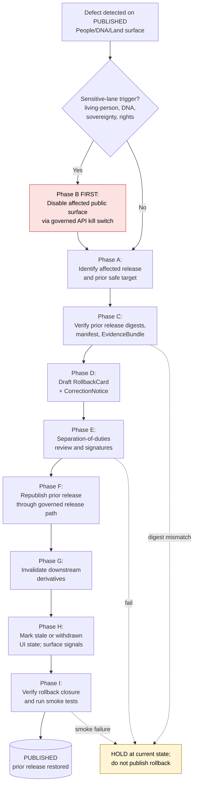

<!-- [KFM_META_BLOCK_V2]
doc_id: kfm://doc/runbook-people-dna-land-rollback
title: People · DNA · Land — Rollback Runbook
type: standard
version: v1
status: draft
owners: TODO — release authority + sensitivity reviewer + rights-holder representative + domain steward (People/DNA/Land)
created: 2026-05-12
updated: 2026-05-12
policy_label: internal-operational
related:
  - kfm://doctrine/lifecycle-law
  - kfm://doctrine/trust-membrane
  - kfm://doctrine/truth-posture
  - kfm://domain/people-dna-land
  - TODO docs/runbooks/people-dna-land/CORRECTION_RUNBOOK.md
  - TODO docs/runbooks/people-dna-land/PROMOTION_RUNBOOK.md
  - TODO docs/runbooks/governed_ai_ROLLBACK.md
  - TODO docs/adr/ADR-people-dna-land-rollback-targets.md
tags: [kfm, runbook, rollback, people, dna, land, governance, sensitive-lane]
notes:
  - PROPOSED placement; path conforms to Directory Rules §12 (domain as lane segment).
  - Prior dossiers list runbooks with flat naming (e.g. ui_ROLLBACK.md); a docs steward + subsystem owner sign-off is required if reconciling.
[/KFM_META_BLOCK_V2] -->

# People · DNA · Land — Rollback Runbook

> Governed reversal of a People/DNA/Land **PUBLISHED** release to a prior safe target, with audit preservation, derivative invalidation, and visible stale/withdrawn UI state. **Rollback is a governed state transition, not a file copy.**

<!-- Badges -->


| Field | Value |
|---|---|
| **Status** | `draft` (PROPOSED — content reflects KFM doctrine; runtime implementation is UNKNOWN) |
| **Owners** | TODO — release authority **+** sensitivity reviewer **+** rights-holder representative **+** People/DNA/Land domain steward |
| **Last reviewed** | 2026-05-12 |
| **Authority root** | `docs/` (human-facing control plane) — Directory Rules §6.1 |
| **Domain segment** | `people-dna-land/` — Directory Rules §12 (Domain Placement Law) |
| **Truth posture** | CONFIRMED doctrine / PROPOSED implementation |

> [!IMPORTANT]
> This runbook governs the **most sensitive domain** in KFM. Living-person fields, DNA-derived outputs, sovereignty-touched material, and title/parcel claims have **deny-by-default** publication posture. Any rollback that touches those classes **must** retain the sensitivity reviewer and (where applicable) the rights-holder representative as co-signers. See §6 and §10.

---

## Quick jump

- [1. Scope](#1-scope)
- [2. When to trigger this runbook](#2-when-to-trigger-this-runbook)
- [3. Roles and separation of duties](#3-roles-and-separation-of-duties)
- [4. Inputs and exclusions](#4-inputs-and-exclusions)
- [5. Rollback flow at a glance](#5-rollback-flow-at-a-glance)
- [6. Defect classification matrix (People/DNA/Land)](#6-defect-classification-matrix-peopledna land)
- [7. Step-by-step procedure](#7-step-by-step-procedure)
- [8. The `RollbackCard` — required fields and shape](#8-the-rollbackcard--required-fields-and-shape)
- [9. Reason codes and recovery paths](#9-reason-codes-and-recovery-paths)
- [10. Sensitive-lane specifics: living-person, DNA, sovereignty, land](#10-sensitive-lane-specifics-living-person-dna-sovereignty-land)
- [11. Derivative invalidation](#11-derivative-invalidation)
- [12. Verification, smoke tests, and closure](#12-verification-smoke-tests-and-closure)
- [13. Stale-state, supersession, and UI signals](#13-stale-state-supersession-and-ui-signals)
- [14. Rollback drill (rehearsal procedure)](#14-rollback-drill-rehearsal-procedure)
- [15. Common pitfalls and anti-patterns](#15-common-pitfalls-and-anti-patterns)
- [16. Open questions and NEEDS VERIFICATION](#16-open-questions-and-needs-verification)
- [17. Related docs](#17-related-docs)
- [Appendix A — Object families touched by this runbook](#appendix-a--object-families-touched-by-this-runbook)
- [Appendix B — Example `RollbackCard` skeleton](#appendix-b--example-rollbackcard-skeleton)

---

## 1. Scope

**CONFIRMED doctrine / PROPOSED implementation.** This runbook covers operational rollback of any **PUBLISHED** People/DNA/Land artifact, layer, catalog record, governed-API payload, Evidence Drawer payload, or Focus Mode answer back to a previously released safe state. It applies whenever a defect in a released People/DNA/Land surface meets the trigger criteria in §2 and the affected surface cannot be safely corrected in place.

This runbook **belongs to** the operational governance plane (`docs/runbooks/`). It is paired with — but does not duplicate — the People/DNA/Land **Correction Runbook** (forward fix without state reversal), the **Promotion Runbook** (forward governed state transitions), and the cross-cutting **Governed AI Rollback Runbook** (AI surface kill switches).

> [!NOTE]
> **Rollback ≠ deletion.** Rollback restores a *prior safe release* through the same governed path that produced the original release. The withdrawn release record, its receipts, its `EvidenceBundle`, its `ReviewRecord`, and any signed attestations are **preserved for audit** and surfaced as withdrawn/stale via UI signals. Hard-deleting a release without a `RollbackCard` violates the lifecycle invariant.

[Back to top ↑](#quick-jump)

---

## 2. When to trigger this runbook

Trigger **immediately** when any of the following applies to a PUBLISHED People/DNA/Land surface:

| Trigger | Severity | Time to first action (PROPOSED) |
|---|---|---|
| Living-person data leaked to a public surface | CRITICAL | Minutes — disable surface first, file `RollbackCard` second |
| DNA-segment, raw kit ID, vendor ID, or genomic inference exposed | CRITICAL | Minutes — disable surface first |
| Sovereignty / rights-holder objection to a published claim | CRITICAL | Hours — coordinate with rights-holder rep before action |
| Sensitivity policy mis-evaluation (DENY should have fired and did not) | HIGH | Hours |
| Released assessor / tax / parcel record presented as title proof | HIGH | Hours |
| Geometry defect that conflates parcel boundary with title boundary | HIGH | Hours |
| Released claim whose `EvidenceRef` no longer resolves to an `EvidenceBundle` | HIGH | Hours |
| Source-role collapse (e.g. observation upcast to authority without evidence) | HIGH | Hours |
| Schema / contract drift detected post-release (validator now fails) | MEDIUM | Day |
| Stale-source threshold passed with no refresh and the released claim is still served | MEDIUM | Day |
| AI surface emitted an unsupported People/DNA/Land claim with an AIReceipt | MEDIUM | Day — also trigger Governed AI rollback |

> [!WARNING]
> For the first **three** triggers (living-person leak, DNA/genomic exposure, rights-holder objection), the **disablement step (§7, Phase B) happens first**; the `RollbackCard` follows. The trust membrane explicitly forbids leaving sensitive content visible while paperwork is drafted.

If unsure whether the situation qualifies, **default to disablement** and escalate to the release authority and sensitivity reviewer. Over-rollback is reversible; an extra hour of sensitive exposure is not.

[Back to top ↑](#quick-jump)

---

## 3. Roles and separation of duties

CONFIRMED doctrine: separation of duties applies to People/DNA/Land rollback because release materiality is high. The author/detector of the defect **MUST NOT** also be the sole approver of the rollback.

| Role | Required signature on `RollbackCard`? | Notes |
|---|:---:|---|
| **Domain steward (People/DNA/Land)** | ✅ | Owns contracts, validators, and object-family semantics for this lane. |
| **Release authority** | ✅ | Issues the rollback decision; MUST be distinct from the original release author when materiality applies. |
| **Sensitivity reviewer** | ✅ for living-person / DNA / sovereignty / cultural triggers | Reviews redaction, generalization, withholding, and tier decisions. |
| **Rights-holder representative** | ✅ when sovereignty, consent, or cultural-heritage matters touch the release | Confirms sovereignty, cultural-heritage, or consent-based reversal. |
| **Correction reviewer** | ✅ | Reviews `RollbackCard` against doctrine before it amends the PUBLISHED claim. |
| **Source steward** | ✅ where the defect is source-rooted (rights, role, cadence) | Owns admission lifecycle for the affected source family. |
| **Docs steward** | ✅ (post-action) | Confirms doc updates, drift register, and any ADR linkage. |
| **AI surface steward** | ✅ if the defect involves a Focus Mode answer or `AIReceipt` | Coordinates with the Governed AI Rollback Runbook. |
| **Detector** | sign-off as detector only | MAY NOT also approve as release authority for the same rollback. |

> [!CAUTION]
> Author-only approval of a sensitive-lane rollback is a **doctrine violation**. The required separation is enforced socially today and SHOULD migrate to tool-enforcement as KFM matures. Until tool-enforcement exists, the `RollbackCard` MUST list distinct human signers in `signed_by[]`.

[Back to top ↑](#quick-jump)

---

## 4. Inputs and exclusions

**What this runbook needs as input** (all PROPOSED until repo evidence verifies their canonical homes):

- The `release_id` of the affected release (from `ReleaseManifest`).
- The candidate **rollback target** `release_id` (a prior PUBLISHED release that is currently considered safe).
- The detection record: receipt, AIReceipt, validator report, sensitivity audit hit, user-submitted correction, rights-holder objection, or steward observation.
- The downstream **derivative inventory**: catalog records, layer manifests, graph projections, Evidence Drawer payloads, Focus Mode templates, and any external integrations that referenced the affected release.

**What this runbook explicitly does NOT cover:**

- **Forward correction without state reversal.** Use the **Correction Runbook** when a defect can be safely fixed by a *superseding* release rather than by reverting to a prior one.
- **Source admission failures or quarantine intake.** Those are handled by source admission and quarantine runbooks (pre-PUBLISHED).
- **Hard deletion of personal data (right-to-erasure).** Tombstoning preserves explainability but does not satisfy erasure. Erasure obligations are handled by a separate, ADR-governed erasure procedure; this runbook does not substitute for it.
- **Schema or contract evolution.** Schema-home and contract changes are ADR-class per Directory Rules §2.4.
- **Adapter-internal AI rollback** (e.g. switching model adapters, killing a provider). That is the **Governed AI Rollback Runbook**.

[Back to top ↑](#quick-jump)

---

## 5. Rollback flow at a glance



> [!NOTE]
> The diagram is **doctrinal**, not runtime. `NEEDS VERIFICATION` against any specific deployed orchestration: routes, queue names, kill-switch wiring, and dashboard hooks are UNKNOWN at this session's evidence level.

[Back to top ↑](#quick-jump)

---

## 6. Defect classification matrix (People/DNA/Land)

Classify the defect **before** picking a posture. The classification determines whether correction or rollback is the right tool, and whether immediate public disablement is required.

| Defect class | Typical People/DNA/Land triggers | Correction posture (PROPOSED) | Rollback posture (PROPOSED) | Disable surface first? |
|---|---|---|---|:---:|
| **Evidence gap** | `EvidenceRef` no longer resolves; `EvidenceBundle` revoked | ABSTAIN or withdraw unsupported claim | Restore prior evidence-supported release | No (unless sensitive) |
| **Rights defect** | Source rights revoked; license expired; consent withdrawn | DENY public use; quarantine source/artifact | Withdraw affected artifacts | **Yes** |
| **Sensitivity leak** | Living-person identifier exposed; DNA segment leaked; raw kit ID logged | Redact/generalize; notify stewards | Immediate public disablement, then prior release | **Yes (minutes)** |
| **Sovereignty / cultural** | Rights-holder objection; cultural-heritage rule breach | Hold pending rights-holder review | Withdraw until rights-holder approves restoration | **Yes** |
| **Geometry defect** | Parcel boundary presented as title boundary; bad CRS; bad legal description | Rebuild derivative layer and `EvidenceBundle` | Restore previous digest-pinned artifact | No |
| **Temporal defect** | Wrong valid time on residence; deed instrument dated wrong | Correct valid/source/retrieval/release time | Mark stale until rebuilt | No |
| **Source-role collapse** | Assessor record upcast to "title authority"; tree assertion treated as authority | Restore source role; refuse upcast | Restore prior release with correct role | No |
| **Policy defect** | Sensitive-lane DENY did not fire when it should have | Re-run policy and `DecisionEnvelope` | Disable route/layer if gate failed | **Yes** |
| **AI answer defect** | Focus Mode answered with uncited or unsupported People/DNA/Land claim | Invalidate `AIReceipt` and response envelope | Remove answer; preserve `EvidenceBundle`; coordinate with Governed AI rollback | **Yes** for unsupported claim |
| **Catalog defect** | `EvidenceRef` → `EvidenceBundle` chain breaks; orphan catalog entry | Re-emit catalog closure after proof repair | Restore previous catalog state | No |
| **Release infrastructure** | `ReleaseManifest` invalid; rollback target missing; signatures broken | Manifest fix and re-issue | Restore manifest from prior release | No |

> [!TIP]
> A single defect often has **multiple classes** (e.g. a DNA-segment leak is both *sensitivity leak* and *rights defect*). When in doubt, take the union of all required postures, including all "Disable surface first?" instances marked Yes.

[Back to top ↑](#quick-jump)

---

## 7. Step-by-step procedure

### Phase A — Identify affected release and rollback target

1. Resolve `release_id` of the affected release from the public surface back through `ReleaseManifest`. The chain is: public surface → `LayerManifest` / governed-API payload → `EvidenceRef` → `EvidenceBundle` → `ReleaseManifest`.
2. Enumerate every PUBLISHED artifact in that release's `contents[]`: layer manifests, tile sets, GeoParquet, COG, catalog records, graph projections, Evidence Drawer payloads, and any AI templates that cite the release.
3. Identify the **rollback target**: the most recent prior PUBLISHED release that is currently considered safe under today's rights, sensitivity, evidence, and policy posture. The candidate is named in the affected release's `rollback_target` field, but it MUST be **re-verified** — a prior release may itself have aged out, lost rights, or been superseded since publication.
4. If no safe prior release exists, do **not** publish a rollback. Hold the surface in disabled/withdrawn state and escalate to release authority + sensitivity reviewer for a forward-correction or quarantine decision.

### Phase B — Disable affected public surface (sensitive-lane first action)

> [!CAUTION]
> If §2 lists the trigger as CRITICAL or as "sensitive-lane," **execute this phase first** — before any drafting, signature collection, or downstream coordination. The trust membrane forbids leaving sensitive content visible while paperwork is in flight.

Disablement applies, where applicable, to:

- The governed-API route that returns the affected `LayerManifest`, feature, Evidence Drawer payload, or Focus Mode answer.
- The MapLibre layer descriptor for any tile or vector layer in the affected release.
- The graph/triplet projection that exposes affected `PersonAssertion`, `GenealogyRelationship`, `LandOwnershipAssertion`, `OwnershipInterval`, or `DNAMatchEvidence` records.
- Any cached Evidence Drawer payloads keyed to the affected `EvidenceBundle`.
- Any AI Focus Mode template bound to the affected release; coordinate with the **Governed AI Rollback Runbook**.

The disablement mechanism MUST emit a receipt (PROPOSED: `SurfaceDisableReceipt` or equivalent) recording who, when, why, and which surfaces were disabled. Hidden file copies, silent route 404s, or unaudited config flips are doctrine violations.

### Phase C — Verify the rollback target

Before the rollback is published, the prior release must be re-verified:

- **Digests.** Every artifact digest in the target `ReleaseManifest.contents[]` resolves and matches.
- **`EvidenceRef` resolution.** Every `EvidenceRef` in the target release resolves to a current `EvidenceBundle`. If an evidence bundle has been retracted since the target was first published, the target is no longer safe.
- **Rights & sensitivity.** The target release's source rights and sensitivity posture remain valid under today's policy. A previously-fine release can become unfit if rights were revoked or sensitivity rules tightened.
- **`ReviewRecord`.** The target's review state remains adequate. If the original reviewers' authority has been withdrawn, escalate.
- **Schema & contract.** The target's payload still validates against the **current** governed-API schema, or a documented compatibility shim exists. Schema-home changes are ADR-class per Directory Rules §2.4.

If any of the above fails, **do not roll back to that target.** Either select an earlier safe release, or hold disabled and pursue a forward correction.

### Phase D — Draft `RollbackCard` and `CorrectionNotice`

The `RollbackCard` is the rollback **decision** artifact. The `CorrectionNotice` is the public-facing record that a previously published claim has been corrected, withdrawn, or superseded. Both are emitted **together** — neither alone is sufficient.

See [§8](#8-the-rollbackcard--required-fields-and-shape) for the `RollbackCard` shape and [Appendix B](#appendix-b--example-rollbackcard-skeleton) for an illustrative skeleton.

### Phase E — Separation-of-duties review and signatures

Collect signatures per [§3](#3-roles-and-separation-of-duties). The detector MAY NOT sign as release authority. For sensitive-lane triggers, the sensitivity reviewer AND (where applicable) the rights-holder representative MUST sign.

### Phase F — Republish prior release through the governed release path

The rollback target is **republished** as the current PUBLISHED release. Republication MUST flow through the same release path as a normal promotion:

- A new `ReleaseManifest` is issued that pins the rollback-target contents, digests, evidence refs, and a *new* `rollback_target` (typically the release prior to the one being rolled back from).
- The new manifest carries a forward link to the `RollbackCard` and the matching `CorrectionNotice`.
- The withdrawn release record is **preserved** with a forward link to its supersession. Hard-deleting it is forbidden.

### Phase G — Invalidate downstream derivatives

See [§11](#11-derivative-invalidation). A rollback that does not invalidate caches, search indexes, graph projections, story snapshots, AI templates, and external integrations is incomplete.

### Phase H — Mark stale or withdrawn UI state

See [§13](#13-stale-state-supersession-and-ui-signals). The Evidence Drawer, trust badges, and any visible release-state surface MUST announce the withdrawal/supersession. Silent UI restoration is a doctrine violation.

### Phase I — Verify rollback closure

Run the smoke tests in [§12](#12-verification-smoke-tests-and-closure). The rollback is **closed** only when every required artifact exists, every `EvidenceRef` resolves, the policy gate has recorded its decision, and the smoke battery passes.

[Back to top ↑](#quick-jump)

---

## 8. The `RollbackCard` — required fields and shape

CONFIRMED doctrine (object-family definition): `RollbackCard` records a rollback decision and the targeted prior release. PROPOSED implementation: schema home is `schemas/contracts/v1/release/` per Directory Rules §6 and ADR-0001 (schema home); exact path is NEEDS VERIFICATION against current repo evidence.

| Field | Required | Description |
|---|:---:|---|
| `release_id` | ✅ | The `release_id` of the **affected** release being rolled back from. |
| `rollback_to` | ✅ | The `release_id` of the prior safe release being restored. |
| `reason` | ✅ | One of the reason codes in [§9](#9-reason-codes-and-recovery-paths), plus a short prose description. |
| `defect_class` | ✅ | One or more of the classes in [§6](#6-defect-classification-matrix-peopledna-land). |
| `invalidates[]` | ✅ | List of downstream derivatives invalidated by this rollback (see [§11](#11-derivative-invalidation)). |
| `review_ref` | ✅ | Reference to the `ReviewRecord` that approved the rollback. |
| `correction_notice_ref` | ✅ | Reference to the paired `CorrectionNotice`. |
| `signed_by[]` | ✅ | Distinct human signers per [§3](#3-roles-and-separation-of-duties); detector MAY NOT also sign as release authority. |
| `surface_disable_refs[]` | conditional | Receipts emitted by Phase B disablement, required when the trigger is sensitive-lane. |
| `evidence_state` | ✅ | Statement that every `EvidenceRef` in the rollback target was re-verified at rollback time. |
| `time` | ✅ | ISO-8601 timestamp of the rollback decision. |
| `prior_release_ref` | ✅ | Forward link from the withdrawn release to this card. |

> [!NOTE]
> Field names above are PROPOSED and align with the encyclopedia / Atlas summary of `RollbackCard` (`release_id`, `rollback_to`, `reason`, `invalidates[]`, `review_ref`, `time`). Any divergence from a future canonical schema must be resolved via ADR; do not invent parallel fields.

[Back to top ↑](#quick-jump)

---

## 9. Reason codes and recovery paths

PROPOSED reason-code catalog. Codes are drawn from the Atlas master gate-failure catalog and the Build Manual's defect-class table; the catalog is intentionally finite so dashboards can aggregate without free-text drift.

| Reason code | Typical defect class | Recovery path |
|---|---|---|
| `RIGHTS_UNKNOWN` | Rights defect | Steward review; rights resolution; tier reassignment. |
| `RIGHTS_REVOKED` | Rights defect | Withdraw affected artifacts; quarantine source/artifact. |
| `SENSITIVITY_UNRESOLVED` | Sensitivity leak | Sensitivity reviewer disposition; redaction / generalization. |
| `LIVING_PERSON_LEAK` | Sensitivity leak | Immediate disablement; redact; notify stewards. |
| `DNA_EXPOSURE` | Sensitivity leak | Immediate disablement; restricted-store reassessment. |
| `SOVEREIGNTY_OBJECTION` | Sovereignty / cultural | Hold pending rights-holder rep; restoration only with explicit approval. |
| `MISSING_EVIDENCE` | Evidence gap | Re-emit / restore `EvidenceBundle` chain; ABSTAIN until resolved. |
| `MISSING_REVIEW` | Review state inadequate | Run required review; supply `ReviewRecord`. |
| `ROLE_COLLAPSE` | Source-role collapse | Restore source role; refuse upcast. |
| `ROLE_DOWNCAST_FORBIDDEN` | Source-role collapse | Re-validate source role; correct downstream consumers. |
| `SCHEMA_MISMATCH` | Release infrastructure | Schema fix and/or ADR; re-run validator. |
| `CONTRACT_DRIFT` | Release infrastructure | Contract change ADR; re-validate prior release against current contract. |
| `RELEASE_MANIFEST_INVALID` | Release infrastructure | Manifest fix; re-issue from rollback target. |
| `ROLLBACK_TARGET_MISSING` | Release infrastructure | Select earlier safe target; if none, hold disabled and escalate. |
| `CORRECTION_PRIOR_RELEASE_MISSING` | Correction lineage broken | Recover prior release record; resolve supersession lineage. |
| `CORRECTION_DERIVATIVES_UNRESOLVED` | Correction lineage broken | Resolve derivative inventory; emit supersession entries. |
| `AI_ANSWER_UNSUPPORTED` | AI answer defect | Invalidate `AIReceipt`; coordinate Governed AI rollback. |
| `STALE_PAST_TOLERANCE` | Temporal defect | Mark stale; refresh source or supersede. |

[Back to top ↑](#quick-jump)

---

## 10. Sensitive-lane specifics: living-person, DNA, sovereignty, land

### 10.1 Living-person data

CONFIRMED doctrine: **living-person fields fail closed.** A PUBLISHED claim that names, geolocates, or otherwise identifies a living person is presumed unfit for public surfaces unless legal basis, consent/review, and release state are explicitly proven.

A rollback caused by a living-person leak MUST:

- Disable every public surface (governed API, MapLibre layer, Evidence Drawer, Focus Mode template) referencing the affected `PersonAssertion`, `PersonCanonical`, `NameAssertion`, or `ResidenceEvent` *first*, before drafting any record.
- Quarantine the source artifact's path through the lifecycle (RAW/WORK/QUARANTINE/PROCESSED) for re-review. Do not silently re-promote.
- Co-sign by sensitivity reviewer and release authority. Author-only approval is forbidden.
- Record a side-channel audit hit if the leak surfaced via legend, popup, Evidence Drawer label, or AI-rendered prose — those are the historically-failure-prone surfaces and MUST be hardened in follow-up.

### 10.2 DNA and genomic data

CONFIRMED doctrine: **DNA matches, genomic inferences, and living-person relatives derived from DNA are DENY by default.** Raw kit IDs, vendor IDs, and DNA segments are not public artifacts. The restricted store is the only authorized location for these objects, and AI must not perform public inference over them.

A rollback caused by `DNA_EXPOSURE` MUST:

- Disable any public surface that exposed `DNAMatchEvidence`, `DNASegment`, `RelationshipHypothesis`, or any derivative carrying segment-level or kit-level identity.
- Audit the restricted-store boundary: a leak to a public surface indicates a boundary failure that requires a security review, not just a rollback.
- Treat consent-revocation triggers as a **revocation cleanup** path, not just a rollback. Revocation cleanup tests are part of the PROPOSED test surface for this domain.
- Co-sign by sensitivity reviewer, release authority, and (where consent is the trigger) the consent-holder representative.

### 10.3 Sovereignty and cultural sensitivity

CONFIRMED doctrine: cultural affiliations cited within People/DNA/Land carry rights, sovereignty, and steward-review obligations from the Archaeology / Cultural Heritage domain. A rights-holder objection trumps a release record.

A rollback caused by `SOVEREIGNTY_OBJECTION` MUST:

- Pause action until the rights-holder representative is on the call.
- Treat restoration as **not automatic** — the prior release is not safer just because it is older. Restoration requires explicit rights-holder approval, recorded in the `RollbackCard`'s `signed_by[]`.
- Carry the supersession lineage forward so future reviewers can see what happened and why.

### 10.4 Land, parcel, title

CONFIRMED doctrine: **assessor/tax records are not title truth; parcel geometry is not title-boundary proof.** The most common land-side defect is conflation of these — a UI that presents an assessor record as if it answered a title question, or a parcel polygon used as if it were a surveyed boundary.

A rollback caused by such a defect MUST:

- Distinguish the **geometry defect** (the polygon is wrong) from the **source-role collapse** (the polygon is fine, but the surface labeled it as title proof). The remediation differs.
- Replace, do not patch, any layer or `LayerManifest` that lost the source-role distinction. A patched layer with a corrected label still carries the cached confusion in any client that hit it.
- Surface the corrected source role in legend, Evidence Drawer, and any AI Focus Mode template that touched the layer.

[Back to top ↑](#quick-jump)

---

## 11. Derivative invalidation

CONFIRMED doctrine: a correction or rollback that does not name its downstream derivatives is **incomplete**. The `RollbackCard.invalidates[]` field is not optional, and "covers approximately 100%" is the healthy posture for derivative-invalidation coverage.

Downstream derivatives that may need invalidation when a People/DNA/Land release is rolled back:

- **Catalog records** keyed to the affected `release_id` — both `CatalogMatrix` entries and per-domain catalog entries under `data/catalog/domain/people-dna-land/` (PROPOSED path).
- **Graph projections / triplets** that referenced `PersonAssertion`, `GenealogyRelationship`, `LandOwnershipAssertion`, `DeedInstrument`, `TitleInstrument`, `AssessorRecord`, `ParcelVersion`, `OwnershipInterval`, `LifeEvent`, `ResidenceEvent`, `MigrationEvent`, `FamilyGroup`, `DNAMatchEvidence`, `RelationshipHypothesis`, `DNASegment`, or `PersonCanonical`.
- **Layer manifests** and their published artifacts (PMTiles, GeoParquet, COG, GeoJSON) under `data/published/layers/people-dna-land/` (PROPOSED path).
- **Story snapshots** and any export receipts that captured the affected release.
- **AI Focus Mode templates** bound to the affected `EvidenceBundle`; any cached `AIReceipt` referencing the withdrawn release MUST be invalidated.
- **Search indexes** that included the released catalog/evidence/feature summaries.
- **External integrations** or downstream consumers if KFM has notified them of the release.

> [!TIP]
> Derivative invalidation reads as bureaucratic in calm times and as exactly-right in incident times. The healthy posture is a **machine-generated derivative inventory** for each release, so rollback day is a tick-through, not a hunt. PROPOSED follow-up: a derivative-inventory generator that the `RollbackCard` can cite by reference rather than enumerate by hand.

[Back to top ↑](#quick-jump)

---

## 12. Verification, smoke tests, and closure

A rollback is **closed** only when all of the following hold. Until then, the affected surfaces remain disabled.

### 12.1 Doctrinal closure checks (CONFIRMED doctrine)

- [ ] Every required artifact in [§8](#8-the-rollbackcard--required-fields-and-shape) exists.
- [ ] Every required `EvidenceRef` resolves to an `EvidenceBundle`.
- [ ] The policy gate has evaluated and recorded its decision (ALLOW / RESTRICT / DENY / ABSTAIN / ERROR).
- [ ] The new `ReleaseManifest` names a valid `rollback_target`.
- [ ] The withdrawn release record is preserved with a forward link to the `CorrectionNotice` and `RollbackCard`.
- [ ] Separation of duties is satisfied per [§3](#3-roles-and-separation-of-duties).

### 12.2 Smoke tests (PROPOSED battery for this domain)

PROPOSED test homes live under `tests/domains/people-dna-land/` (NEEDS VERIFICATION against mounted repo). Suggested tests:

- Person assertion **evidence test**: every public-surfaced `PersonAssertion` resolves to a current `EvidenceBundle`.
- GEDCOM import **rights / living-flag test**: living-flagged records remain DENY on public surfaces.
- DNA **consent and raw-ID no-log test**: no DNA segment, raw kit ID, or vendor ID appears in any log emitted on the rollback path.
- **Revocation cleanup test**: a previously-revoked record stays revoked after rollback; rollback does not re-expose retracted content.
- **Legal-description and chain-of-title gap test**: gaps remain visible and ABSTAIN-flagged after rollback; rollback does not paper over uncertainty.
- **Assessor-as-title denial test**: assessor and tax records remain labeled as such; rollback does not restore a source-role collapse.
- **Graph projection safety test**: the rollback-target graph projection contains no living-person or DNA-derived edges that today's policy would forbid.

### 12.3 Side-channel audit (CONFIRMED healthy posture)

The healthy posture is periodic automated checks for label / popup / AI-text leaks. After rollback, run those checks once before re-enabling public surfaces. A sensitive-content leak via legend or AI prose is harder to detect than a primary-payload leak and has historically been the most common failure surface for sensitive lanes.

[Back to top ↑](#quick-jump)

---

## 13. Stale-state, supersession, and UI signals

CONFIRMED doctrine: KFM separates **stale** from **wrong**. Both states have visible markers and traceable lifecycles. A rollback typically produces both — the withdrawn release becomes *withdrawn/superseded*, while any derivative that has not yet rebuilt becomes *stale*.

| Marker | When triggered | UI signal | Required action |
|---|---|---|---|
| **Withdrawn** | Release rolled back; `CorrectionNotice` issued | Withdrawn badge in Evidence Drawer; visible "Superseded by …" link | Surface the rollback record; do not silently restore prior content |
| **Superseded** | A later release replaces an earlier one (forward) | Superseded badge with forward link | Forward link MUST exist; gap is a defect (`Supersession lineage gap` = 0 is the healthy posture) |
| **Stale** | A derivative has not yet rebuilt to match the new PUBLISHED release | Stale badge with last-rebuilt timestamp | Schedule derivative rebuild; do not hide the badge |
| **Quarantined** | The source / artifact was returned to QUARANTINE during rollback | Withholding notice in Evidence Drawer | Steward disposition before any re-promotion |

> [!IMPORTANT]
> Silent restoration — where a rolled-back surface comes back online without a withdrawn/superseded badge — defeats the durable-public-claim property of KFM. Users who relied on the withdrawn release have **no way to learn** their reference is stale without the badge.

[Back to top ↑](#quick-jump)

---

## 14. Rollback drill (rehearsal procedure)

CONFIRMED doctrine: *rollback untested is not reliable.* The healthy posture is a **non-zero, periodic, scheduled rollback rehearsal rate** per release window.

The drill is run against a non-production fixture release (PROPOSED home: `fixtures/domains/people-dna-land/rollback_drill/`) and exercises the full procedure end-to-end without affecting any production public surface.

**Suggested drill cadence (PROPOSED):**

- After every materially significant change to the People/DNA/Land release path.
- Quarterly minimum for the sensitive-lane scenarios (living-person leak, DNA exposure, sovereignty objection).
- Whenever a new role (sensitivity reviewer, rights-holder rep, release authority) onboards.

**What the drill exercises:**

1. The detector path: a synthetic defect is "found" via the same channel as a real defect (validator hit, audit fire, steward observation).
2. Phase B disablement: the kill switch fires on a fixture surface; the receipt is emitted.
3. Phase C target verification: digests, evidence, rights, sensitivity, review, schema all re-verified against today's policy.
4. Phase E signature collection: distinct human signers exercise their roles.
5. Phase F republication: a new `ReleaseManifest` is issued through the same governed path.
6. Phase G derivative invalidation: catalog, graph, layers, AI templates all named in `invalidates[]`.
7. Phase H UI signals: withdrawn / superseded / stale badges appear correctly in a fixture client.
8. Phase I smoke tests: the §12 battery passes.

A drill that exits without exercising all of the above has trained the team in a shortcut. PROPOSED: each drill emits a `DrillReceipt` that captures coverage, gaps, and rehearsal time.

[Back to top ↑](#quick-jump)

---

## 15. Common pitfalls and anti-patterns

<details>
<summary>📋 Click to expand — anti-patterns observed or anticipated for this domain</summary>

> [!WARNING]
> The items below describe **patterns to avoid**. They are doctrine-grounded (CONFIRMED) even where the specific failure has not yet been observed in this repo (PROPOSED / NEEDS VERIFICATION).

- **Hidden file copy.** Treating rollback as "swap the published file." Rollback MUST flow through the governed release path; the file change is a *consequence* of the state transition, not the transition itself.
- **Author-only approval.** The author or detector also signing as release authority. Forbidden for sensitive-lane releases and for any release with materiality.
- **Paperwork-before-disablement on a sensitive trigger.** Drafting a `RollbackCard` while a living-person identifier or DNA segment is still on a public surface. Phase B (disablement) happens first.
- **Stale derivatives left enabled.** Rolling back the primary release but leaving a graph projection, search index, or AI template still serving the withdrawn content.
- **Silent re-promotion.** Restoring a previously-rolled-back release without a fresh `ReviewRecord` because "we already approved it once." Rights, sensitivity, and evidence posture may have changed.
- **Title / parcel re-conflation.** Patching a labeling defect on a layer that conflated assessor records with title proof, instead of replacing the layer. Cached clients keep the old confusion.
- **Selecting a prior release as rollback target without re-verifying its evidence chain.** Yesterday-safe is not today-safe; the target MUST be re-verified against current rights, sensitivity, and evidence posture.
- **Tombstone treated as erasure.** Tombstoning preserves explainability for revocation but does not satisfy right-to-erasure obligations. Erasure is a separate, ADR-governed procedure.
- **AI surface left bound to the withdrawn release.** A Focus Mode template citing the withdrawn `EvidenceBundle` will continue to generate uncited or stale prose unless the template's binding is updated and the `AIReceipt` cache invalidated.
- **No drill, no readiness.** Treating §14 as optional. A team that has not rehearsed a sensitive-lane rollback should assume it cannot perform one safely under pressure.

</details>

[Back to top ↑](#quick-jump)

---

## 16. Open questions and NEEDS VERIFICATION

The items below cannot be settled by attached doctrine alone. They are tracked here so reviewers can route them to the right register (`docs/registers/VERIFICATION_BACKLOG.md`) or ADR.

| Item | Evidence that would settle it | Status |
|---|---|---|
| Canonical schema home for `RollbackCard` (default: `schemas/contracts/v1/release/`) | Mounted repo + ADR-0001 ratification | NEEDS VERIFICATION |
| Exact governed-API kill-switch route for disabling a People/DNA/Land layer | Mounted repo, `apps/governed-api/`, route table | UNKNOWN |
| Whether `release/rollback_cards/` is the canonical home for `RollbackCard` artifacts (Directory Rules §18 lists this as OPEN) | ADR resolving `data/rollback/` vs. `release/rollback_cards/` | NEEDS VERIFICATION |
| Whether tombstone-based revocation satisfies KFM's correction-vs-erasure boundary for personal data | ADR aligning tombstone scope with GDPR / applicable Tribal data policies | NEEDS VERIFICATION |
| Living-person policy enforcement in current code paths | Mounted repo files, schemas, registry entries, tests, logs, emitted artifacts, review records, or release manifests | NEEDS VERIFICATION |
| DNA consent and revocation enforcement in current code paths | Same evidence basis as above | NEEDS VERIFICATION |
| Land instrument chain logic in current code paths | Same evidence basis as above | NEEDS VERIFICATION |
| Geometry-role boundary logic (parcel ≠ title boundary) in current code paths | Same evidence basis as above | NEEDS VERIFICATION |
| UI / API restricted-field no-leak behavior in current code paths | Same evidence basis as above | NEEDS VERIFICATION |
| Whether the runbook tree uses `docs/runbooks/<domain>/<TOPIC>_RUNBOOK.md` (this doc's pattern, conforms to Directory Rules §12) or `docs/runbooks/<subsystem>_<TOPIC>.md` (flat naming used in prior UI/AI report) | Repo convention + docs steward sign-off | PROPOSED |

[Back to top ↑](#quick-jump)

---

## 17. Related docs

> Links are PROPOSED until each target exists. Where the target is not yet authored, the entry is marked `TODO`.

- TODO — `docs/runbooks/people-dna-land/CORRECTION_RUNBOOK.md` — forward correction without state reversal.
- TODO — `docs/runbooks/people-dna-land/PROMOTION_RUNBOOK.md` — governed promotion through the lifecycle.
- TODO — `docs/runbooks/people-dna-land/REVOCATION_CLEANUP_RUNBOOK.md` — DNA / consent-driven cleanup paths.
- TODO — `docs/runbooks/governed_ai_ROLLBACK.md` — AI surface kill switches and adapter rollback (cross-cutting).
- TODO — `docs/runbooks/release/RELEASE_AUTHORITY.md` — release authority responsibilities.
- TODO — `docs/domains/people-dna-land/README.md` — domain identity, scope, and source families.
- TODO — `docs/doctrine/lifecycle-law.md` — RAW → WORK / QUARANTINE → PROCESSED → CATALOG / TRIPLET → PUBLISHED.
- TODO — `docs/doctrine/trust-membrane.md` — public-client boundary.
- TODO — `docs/doctrine/truth-posture.md` — cite-or-abstain.
- `docs/doctrine/directory-rules.md` — placement authority (CONFIRMED rules / PROPOSED presence).
- TODO — `docs/adr/ADR-people-dna-land-rollback-targets.md` — open ADR placeholder for any decisions this runbook surfaces.

[Back to top ↑](#quick-jump)

---

## Appendix A — Object families touched by this runbook

> CONFIRMED doctrine: these object families are owned by People/DNA/Land per the Encyclopedia and the Domains Culmination Atlas. Inclusion here means a rollback **may** invalidate instances of the family; not every rollback touches every family.

- `PersonAssertion`
- `PersonCanonical`
- `NameAssertion`
- `PersonIdentityCandidate`
- `GenealogyRelationship`
- `FamilyGroup`
- `LifeEvent`
- `ResidenceEvent`
- `MigrationEvent`
- `LandOwnershipAssertion`
- `DeedInstrument`
- `TitleInstrument`
- `AssessorRecord`
- `TaxRecord`
- `ParcelVersion`
- `OwnershipInterval`
- `DNAMatchEvidence`
- `DNASegment`
- `RelationshipHypothesis`
- `ReviewRecord`
- `LegalDescription`
- `LandInstrument`

Cross-cutting object families also touched: `SourceDescriptor`, `EvidenceRef`, `EvidenceBundle`, `ValidationReport`, `PolicyDecision`, `DecisionEnvelope`, `LayerManifest`, `ReleaseManifest`, `CorrectionNotice`, `RollbackCard`, `AIReceipt`, `RuntimeResponseEnvelope`.

[Back to top ↑](#quick-jump)

---

## Appendix B — Example `RollbackCard` skeleton

<details>
<summary>📄 Click to expand — illustrative skeleton (PROPOSED shape; not a schema)</summary>

> [!NOTE]
> The block below is **illustrative**. Field names align with the encyclopedia / Atlas summary of `RollbackCard`. Any canonical schema lives in `schemas/contracts/v1/release/` (PROPOSED, per ADR-0001) and supersedes this skeleton on any divergence. Do not use this skeleton as a substitute for a validated schema.

```json
{
  "object_type": "RollbackCard",
  "schema_version": "v1",
  "card_id": "kfm://rollback/people-dna-land/2026-05-12-0001",
  "release_id": "kfm://release/people-dna-land/2026-05-09-0007",
  "rollback_to": "kfm://release/people-dna-land/2026-05-02-0006",
  "reason": "LIVING_PERSON_LEAK",
  "reason_detail": "Public Evidence Drawer payload exposed a NameAssertion for a flagged living-person record via a graph projection edge that should have been redacted.",
  "defect_class": ["sensitivity_leak", "policy_defect"],
  "invalidates": [
    "kfm://catalog/people-dna-land/2026-05-09-0007",
    "kfm://layer/people-dna-land/residences/v3",
    "kfm://graph/people-dna-land/projection/2026-05-09",
    "kfm://ai/focus-template/people-dna-land/residence-summary",
    "kfm://search-index/people-dna-land/2026-05-09"
  ],
  "surface_disable_refs": [
    "kfm://receipt/surface-disable/2026-05-12-0001"
  ],
  "correction_notice_ref": "kfm://correction/people-dna-land/2026-05-12-0001",
  "review_ref": "kfm://review/release-correction/2026-05-12-0001",
  "evidence_state": "All EvidenceRefs in the rollback target re-verified at 2026-05-12T14:03:00Z. No bundle retractions since target release.",
  "prior_release_ref": "kfm://release/people-dna-land/2026-05-09-0007",
  "signed_by": [
    { "role": "domain_steward",         "actor": "TODO" },
    { "role": "release_authority",      "actor": "TODO (distinct from detector)" },
    { "role": "sensitivity_reviewer",   "actor": "TODO" },
    { "role": "rights_holder_rep",      "actor": "n/a — not a sovereignty trigger" },
    { "role": "correction_reviewer",    "actor": "TODO" }
  ],
  "time": "2026-05-12T14:05:00Z"
}
```

</details>

[Back to top ↑](#quick-jump)

---

## Footer

**Related docs:** see [§17](#17-related-docs).
**Open questions:** see [§16](#16-open-questions-and-needs-verification).
**Last reviewed:** 2026-05-12 — `draft`; PROPOSED placement under `docs/runbooks/people-dna-land/` per Directory Rules §12. Reconciliation with prior flat-naming convention (`docs/runbooks/<subsystem>_ROLLBACK.md`) requires docs steward + subsystem owner sign-off and SHOULD be recorded against `docs/registers/DRIFT_REGISTER.md` if the project keeps both styles.

[Back to top ↑](#quick-jump)
