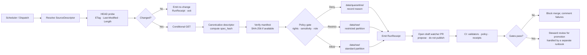

<!-- [KFM_META_BLOCK_V2]
doc_id: kfm://doc/runbook/people-dna-land/source-refresh
title: People · Genealogy · DNA · Land — Source Refresh Runbook
type: standard
version: v0.1
status: draft
owners: People/DNA/Land domain steward · Source intake steward · Privacy/sensitivity reviewer
created: 2026-05-12
updated: 2026-05-12
policy_label: public (procedure) · restricted-aware (operates on restricted sources)
related:
  - docs/doctrine/directory-rules.md
  - docs/doctrine/lifecycle-law.md
  - docs/doctrine/trust-membrane.md
  - docs/domains/people-dna-land/README.md
  - docs/sources/SOURCE_DESCRIPTOR_STANDARD.md
  - docs/standards/SMART_SYNC.md
  - docs/runbooks/people-dna-land/VALIDATION_RUNBOOK.md
  - docs/runbooks/people-dna-land/ROLLBACK_RUNBOOK.md
  - data/registry/sources/people-dna-land/
  - policy/domains/people-dna-land/
tags: [kfm, runbook, people-dna-land, source-refresh, intake, governance]
notes:
  - Operates on the most sensitivity-laden KFM domain; default-deny applies to living-person and DNA-derived material.
  - Specific paths quoted herein are PROPOSED until verified against mounted-repo evidence.
[/KFM_META_BLOCK_V2] -->

# People · Genealogy · DNA · Land — Source Refresh Runbook

Governed procedure for refreshing People / Genealogy / DNA / Land source material from upstream publishers, detecting material delta, holding sensitive content closed by default, and emitting auditable receipts before any catalog or publication change.


**Status:** draft &middot; **Owners:** People/DNA/Land steward · Source intake steward · Privacy reviewer &middot; **Last updated:** 2026-05-12

> [!IMPORTANT]
> This runbook governs intake refresh for the most sensitivity-laden domain in KFM. **Living-person data and DNA-derived material are denied or restricted by default.** Assessor records are **not** title truth. Parcel geometry is **not** title-boundary proof. Refresh procedures that do not preserve these distinctions fail closed at the policy gate.

---

## Quick Links

- [1. Purpose & Scope](#1-purpose--scope)
- [2. Inputs & Outputs](#2-inputs--outputs)
- [3. Source Families in Scope](#3-source-families-in-scope)
- [4. Refresh Flow](#4-refresh-flow)
- [5. Step-by-Step Procedure](#5-step-by-step-procedure)
- [6. Sensitivity & Source-Role Boundaries](#6-sensitivity--source-role-boundaries)
- [7. Receipts, Manifests, and Lifecycle Gates](#7-receipts-manifests-and-lifecycle-gates)
- [8. Failure Modes and Fail-Closed Behavior](#8-failure-modes-and-fail-closed-behavior)
- [9. Dry-Run / No-Network CI](#9-dry-run--no-network-ci)
- [10. Rollback & Correction Path](#10-rollback--correction-path)
- [11. Operator Checklist](#11-operator-checklist)
- [12. Open Verification Items](#12-open-verification-items)
- [13. Related Docs](#13-related-docs)
- [14. Appendix](#14-appendix)

---

## 1. Purpose & Scope

**Scope.** This runbook covers periodic and event-driven refresh of source material owned by the **People, Genealogy, DNA, and Land Ownership** domain. It addresses how to:

- Probe upstream publishers using HTTP validators and / or manifest checksums.
- Canonicalize source descriptors and compute a stable `spec_hash`.
- Detect material change without re-downloading unchanged bytes.
- Hold sensitive deltas in `data/quarantine/` until steward review.
- Emit a `RunReceipt` that records the refresh decision, validators, and digests.
- Open a watcher pull request that **proposes** — but does not publish — a catalog change.

**Out of scope.** This runbook does **not** decide release. Release is governed by `ReleaseManifest`, review state, and the publication gate in `release/`. It does not decide rights, sensitivity tiers, or correction logic; those decisions live in `policy/`, `data/registry/`, and a separate correction runbook.

**Truth posture of this document.**

| Layer | Status |
|---|---|
| Doctrine (lifecycle invariant, default-deny for living-person and DNA, source-role anti-collapse) | CONFIRMED |
| Procedure shape (HEAD probe · canonical hash · receipt · policy gate · draft PR) | CONFIRMED at the doctrinal level |
| Specific repo paths, tool names, command flags, schema homes, fixture trees | PROPOSED until verified against mounted-repo evidence |
| Current presence or enforcement state of the cited validators, watchers, and policies in the live repo | NEEDS VERIFICATION |

[Back to top](#quick-links)

---

## 2. Inputs & Outputs

**Inputs.**

- A `SourceDescriptor` under `data/registry/sources/people-dna-land/<source_id>/` (PROPOSED path).
- A watcher trigger (cron schedule, dispatch event, or manual run).
- The upstream publisher endpoint (HTTP, S3, OAI-PMH, file drop, or API).
- The previous `RunReceipt` for delta comparison, if any.
- Source rights and sensitivity tier from `data/registry/rights/` and `policy/sensitivity/` (PROPOSED).

**Outputs.**

- A canonicalized `source_descriptor.json` and recomputed `spec_hash`.
- A `RunReceipt` recording URL, fetched-at time, ETag / Last-Modified, `spec_hash`, artifact digests, provider, and the linked `PolicyDecision`.
- New artifacts placed under either `data/raw/people-dna-land/<source_id>/<run_id>/` or `data/quarantine/people-dna-land/<reason>/<run_id>/`, depending on policy outcome.
- A **draft** pull request (the watcher PR) that proposes catalog / provenance updates *after* validation and policy gates pass — never a direct commit to a canonical branch.

[Back to top](#quick-links)

---

## 3. Source Families in Scope

Each family carries a source-role intent (authority / observation / context / model) that **must** be preserved through refresh. Rights and sensitivity vary; sensitive joins fail closed.

| Family | Role posture | Sensitivity floor | Refresh signal | Status |
|---|---|---|---|---|
| Vital records · census · cemetery · obituary · church · school · military · court · probate | authority / observation | public when source permits; **living-person fields fail closed** | publisher cadence; manifest | CONFIRMED doctrine / PROPOSED implementation |
| GEDCOM / GEDZip / tree overlays | observation / context (hypotheses) | restricted while living individuals present | user submission or batch refresh | CONFIRMED doctrine / PROPOSED implementation |
| DNA vendor match CSV / segment / triangulation | restricted observation | **DNA-derived — denied unless consent record present** | manual; consent-bound | CONFIRMED doctrine / PROPOSED implementation |
| Patent · deed · mortgage · lien · easement · lease · mineral · water · access · probate instruments | authority | public per source terms | publisher cadence | CONFIRMED doctrine / PROPOSED implementation |
| Assessor and tax roll records | observation (**not title**) | public per jurisdiction | publisher cadence | CONFIRMED doctrine / PROPOSED implementation |
| Plat · survey · metes & bounds · PLSS · subdivision · derived geometry | observation / context (**not title boundary**) | public per source terms | publisher cadence | CONFIRMED doctrine / PROPOSED implementation |

> [!CAUTION]
> Assessor records and tax rolls record **what the assessor believes**, not who legally holds title. PLSS, plat, and survey geometry record **survey assertions and parcel polygons**, not legal title boundaries. Refresh runs must preserve these source-role distinctions, or fail closed.

[Back to top](#quick-links)

---

## 4. Refresh Flow



The diagram reflects the conditional-fetch + canonical-hash + receipt + policy-gate pattern that the wider KFM source-refresh doctrine recommends. The **shape** of these steps is CONFIRMED at the doctrinal level; the **specific component names and paths** remain PROPOSED until verified against mounted-repo evidence.

[Back to top](#quick-links)

---

## 5. Step-by-Step Procedure

> [!NOTE]
> The commands below are **illustrative**. Tool names and flags labelled `PROPOSED` must be replaced with the actual verified tooling in the mounted repo before operational use. Treat the structure as authoritative; treat the literals as placeholders.

### 5.1 Resolve the `SourceDescriptor`

```bash
# PROPOSED tool name — verify against repo
kfm-source resolve \
  --domain people-dna-land \
  --source-id "$SOURCE_ID" \
  --out source_descriptor.json
```

What this captures: source identity, source role (authority / observation / context / model), rights status, sensitivity tier, publisher endpoint, expected cadence, and prior `spec_hash`.

### 5.2 HEAD probe for validators

```bash
SRC_URL="$(jq -r '.endpoint.url' source_descriptor.json)"

curl -sI \
  -H "If-None-Match: $(jq -r '.last_etag // empty' source_descriptor.json)" \
  "$SRC_URL" \
  > head_response.txt
```

Capture `ETag`, `Last-Modified`, and `Content-Length`. A `304 Not Modified` response short-circuits to a no-change `RunReceipt`.

> [!NOTE]
> Some publishers strip or weakly version ETags. Treat weak ETags (`W/...`) as advisory and fall through to manifest verification before promotion.

### 5.3 Conditional fetch (only on change)

```bash
curl -sS -L \
  --etag-compare etag.cache \
  --etag-save etag.cache.new \
  -o "raw_payload.bin" \
  "$SRC_URL"
```

Skip this step entirely on `304`. On `200`, place the payload under `data/raw/people-dna-land/<source_id>/<run_id>/` (PROPOSED path).

### 5.4 Canonicalize and hash

```bash
# Canonical JSON (JCS / RFC 8785) → stable digest for the descriptor
jq -cS '.' source_descriptor.json \
  | sha256sum | cut -d' ' -f1 \
  > spec_hash.txt
```

`spec_hash` is the source descriptor's deterministic fingerprint. Equal evidence → equal hash; any field drift produces a new hash and is therefore an auditable delta.

### 5.5 Verify the upstream manifest (if available)

If the publisher exposes a checksums manifest (for example `SHA256SUMS`, or a `manifest.json` with per-file digests), fetch it and run:

```bash
sha256sum -c upstream_checksums.txt
```

Fail closed on any mismatch. Record `manifest_verified: true|false` in the `RunReceipt`.

### 5.6 Policy gate — rights, sensitivity, source role

Run the policy bundle. The decision must be one of `allow`, `restrict`, `quarantine`, or `deny`.

```bash
# PROPOSED policy entrypoint — verify against repo
conftest test \
  --policy policy/domains/people-dna-land/ \
  --data data/registry/rights/people-dna-land.yaml \
  source_descriptor.json
```

The gate **must** check, at minimum:

- Rights status of the source family for this candidate refresh.
- Sensitivity tier — living-person presence, DNA-derived material, restricted joins.
- Source-role intent vs. how the data is described downstream (assessor ≠ title; parcel geometry ≠ title boundary).
- Required temporal validity fields (source time, observed time, retrieval time).
- Whether a steward consent record is required — **mandatory for DNA-derived material**.

### 5.7 Emit the `RunReceipt`

```bash
# PROPOSED tool — verify against repo
kfm-attest make-run-receipt \
  --spec source_descriptor.json \
  --decision policy_decision.json \
  --target-zone RAW \
  --source-url "$SRC_URL" \
  --source-etag        "$(awk '/^ETag:/{print $2}' head_response.txt)" \
  --source-last-modified "$(awk '/^Last-Modified:/{$1=""; print $0}' head_response.txt)" \
  --source-content-length "$(awk '/^Content-Length:/{print $2}' head_response.txt)" \
  --out data/receipts/ingest/people-dna-land/run-receipt.json
```

The receipt must carry: source URL, fetched-at, ETag, Last-Modified, `spec_hash`, artifact digests, provider / runner identity, the linked `PolicyDecision`, and an outcome from the finite envelope (`ANSWER`, `ABSTAIN`, `DENY`, `ERROR`).

### 5.8 Open a draft watcher PR (propose, do not publish)

The watcher **MUST NOT** commit to canonical catalog branches directly. It opens a **draft pull request** that includes the `RunReceipt`, the new or updated `SourceDescriptor`, and any candidate catalog / provenance updates. CI runs validators, policy parity checks, and receipt verification. Merge requires steward approval — and for any change that touches living-person or DNA-derived material, an additional privacy / sensitivity reviewer.

[Back to top](#quick-links)

---

## 6. Sensitivity & Source-Role Boundaries

> [!WARNING]
> **The default-deny rules for this domain are doctrinal, not optional.** A refresh that surfaces living-person or DNA-derived material to a public catalog path without an explicit, recorded consent and review trail is a publication-discipline failure regardless of intent.

| Boundary | Default posture | What a refresh must do |
|---|---|---|
| Living-person fields | DENY public exposure | Hold record in `data/quarantine/people-dna-land/living_person/<run_id>/`; require steward review before any non-restricted placement. |
| DNA / genomic material | RESTRICT or DENY | Place in restricted partition only; refuse public catalog emission; require a referenced consent record. |
| Genealogy relationships involving living individuals | RESTRICT | Mark hypothesis status; never publish as confirmed fact. |
| Assessor / tax records described as title | DENY (the description, not necessarily the record) | The record family is `observation`, never `authority for title`. Refuse the title framing. |
| Parcel geometry described as legal boundary | DENY (the description, not necessarily the record) | Record family is `observation`; geometry version ≠ legal boundary. Refuse the boundary framing. |
| Source rights unclear or stale | QUARANTINE | Hold pending source-rights review and steward decision. |

When in doubt, the safe state is **quarantine, deny, or restrict** until source rights, source role, access conditions, cadence, and release class are recorded.

[Back to top](#quick-links)

---

## 7. Receipts, Manifests, and Lifecycle Gates

A refresh participates in the lifecycle invariant. It does **not** transit lifecycle states by itself; promotion is a separate governed decision.

```text
RAW  →  WORK / QUARANTINE  →  PROCESSED  →  CATALOG / TRIPLET  →  PUBLISHED
 ▲           ▲
 │           │
 this runbook ends here (RAW or QUARANTINE placement);
 promotion is governed by a separate validation + release path.
```

### 7.1 Required receipts at refresh time

| Receipt | When emitted in this runbook | Required fields (PROPOSED minimum) |
|---|---|---|
| `SourceDescriptor` (updated) | On any descriptor field change | source id, role, rights, sensitivity, cadence, payload reference, hash |
| `RunReceipt` | Every refresh run — change or no-change | URL, fetched-at, ETag, Last-Modified, `spec_hash`, artifact digests, provider, policy decision id, outcome |
| `PolicyDecision` | Whenever the policy gate runs | decision (`allow` / `restrict` / `quarantine` / `deny`), reason codes, evidence refs |
| `TransformReceipt` | Only if normalization runs in WORK as part of the refresh PR | inputs, outputs, transforms applied, validator outcomes |
| `RedactionReceipt` | Only if generalization / redaction runs (uncommon at refresh) | scope, method, evidence refs |

Receipts created earlier in the lifecycle remain referenced (not duplicated) at later phases through `EvidenceRef`.

### 7.2 Gate posture at refresh

| Gate | This runbook's responsibility | Fail-closed behavior |
|---|---|---|
| Admission ( → RAW) | Yes | Reject if `SourceDescriptor` or `RunReceipt` cannot close. |
| Normalization (RAW → WORK / QUARANTINE) | Partial — only if a delta requires an immediate transform | Quarantine with recorded reason. |
| Validation (WORK → PROCESSED) | No — runs in a separate validation runbook | Hold at WORK. |
| Catalog closure (PROCESSED → CATALOG / TRIPLET) | No | Hold at PROCESSED. |
| Release (CATALOG / TRIPLET → PUBLISHED) | No — runs via the release pipeline | Hold at CATALOG. |

[Back to top](#quick-links)

---

## 8. Failure Modes and Fail-Closed Behavior

| Symptom | Cause | Action |
|---|---|---|
| `spec_hash` cannot be computed | Descriptor missing required fields, or canonicalization tool unavailable | Halt; treat run as `ERROR`; emit `RunReceipt` with `outcome: ERROR` and **no** payload placement. |
| HEAD probe returns no validator and no manifest | Publisher exposes neither ETag, Last-Modified, nor a checksums file | Fall back to full `GET` + content digest; record `validator_strength: weak` in receipt. Promotion gates may require additional support. |
| Manifest checksum mismatch | Bytes do not match publisher claims | Fail closed; do not place in RAW; record `manifest_verified: false` and quarantine the candidate. |
| Source rights stale / unknown | Rights record older than cadence, or marked `NEEDS VERIFICATION` | Quarantine; open a `data/registry/rights/` review entry. |
| Living-person field detected on a route claiming public scope | Policy gate caught it; or a downstream describer mismatched the source role | `DENY`; quarantine; alert privacy reviewer. |
| DNA-derived field present without a consent record | Policy gate caught it | `DENY`; quarantine; alert privacy reviewer. |
| Assessor record described as title | Source-role anti-collapse violation | `DENY` the **description**; the record itself may still be admitted as `observation`. |
| Parcel geometry described as legal boundary | Source-role anti-collapse violation | `DENY` the **description**; the geometry may still be admitted as `observation`. |
| Watcher attempts to commit to a canonical branch | Watcher-as-publisher anti-pattern | CI rejects; the watcher must use the draft-PR pattern instead. |
| Compromised runner or credential rotation | Token / key leak or rotation event | Mark affected `RunReceipt` set as untrusted; reissue under new identity. |

[Back to top](#quick-links)

---

## 9. Dry-Run / No-Network CI

The first run of any new refresher or source family **should** be a no-network, deterministic fixture run that emits receipts and validates structure without contacting the publisher. This protects the trust membrane during onboarding and catches schema and policy drift before live traffic hits the gate.

Suggested fixtures (PROPOSED paths):

```text
fixtures/domains/people-dna-land/source-refresh/
├── descriptor.valid.json
├── descriptor.invalid.missing_rights.json
├── descriptor.invalid.dna_no_consent.json
├── descriptor.invalid.assessor_as_title.json
├── head_response.changed.txt
├── head_response.unchanged_304.txt
├── manifest.matching.txt
├── manifest.mismatch.txt
└── expected/
    ├── run_receipt.no_change.json
    ├── run_receipt.changed.json
    ├── policy_decision.deny.dna_no_consent.json
    └── policy_decision.deny.assessor_as_title.json
```

CI invocation:

```bash
# PROPOSED entrypoint — verify against repo
kfm-refresh dry-run \
  --domain people-dna-land \
  --fixture-dir fixtures/domains/people-dna-land/source-refresh \
  --expected-dir fixtures/domains/people-dna-land/source-refresh/expected
```

> [!TIP]
> A no-network fixture suite is also the most reliable surface for catching schema or policy drift, because it exercises the deny and quarantine paths in addition to the happy path. Negative fixtures matter at least as much as positive ones for this domain.

[Back to top](#quick-links)

---

## 10. Rollback & Correction Path

Refresh itself is **reversible by construction** because it stops at RAW or QUARANTINE — no public surface changes during refresh. Rollback at this layer is therefore narrow but specific.

| Defect class | Correction posture | Rollback posture |
|---|---|---|
| Wrong source description (rights, role) | Update `SourceDescriptor`; reissue refresh; emit `CorrectionNotice` if downstream is already PUBLISHED. | Restore prior `SourceDescriptor`; reissue affected `RunReceipt`. |
| Wrong policy decision (false `allow`) | Re-run policy; quarantine affected records; emit `CorrectionNotice`. | Restore prior `PolicyDecision`; move records to the quarantine partition; consult privacy reviewer. |
| Wrong manifest verification (false pass) | Re-fetch; recompute digests; quarantine. | Move RAW placement to QUARANTINE with reason. |
| Compromised credentials or runner identity | Rotate; re-run with the new identity. | Mark affected `RunReceipt` set as untrusted; reissue. |
| Living-person or DNA leakage to a non-restricted path | Quarantine immediately; emit `CorrectionNotice`; alert privacy reviewer. | Disable affected route; restore prior release manifest via the rollback runbook; preserve audit receipts. |

If downstream lifecycle phases have already consumed the bad refresh, follow `docs/runbooks/people-dna-land/ROLLBACK_RUNBOOK.md` (PROPOSED) for the broader correction-and-rollback procedure, which preserves the original release record and publishes a superseding release rather than silently mutating the old one.

[Back to top](#quick-links)

---

## 11. Operator Checklist

Use this checklist before merging a watcher PR generated by this runbook.

- [ ] `SourceDescriptor` is current and includes source role, rights, sensitivity, and cadence.
- [ ] HEAD probe captured ETag and / or Last-Modified; or a manifest checksum was captured.
- [ ] `spec_hash` recomputes deterministically from the canonicalized descriptor.
- [ ] No-change runs short-circuit and emit a `RunReceipt` without re-downloading bytes.
- [ ] Changed runs verified the upstream manifest where one is available.
- [ ] The policy gate ran and produced an `allow` / `restrict` / `quarantine` / `deny` decision with reasons.
- [ ] Living-person, DNA-derived, and restricted-join checks fired and recorded outcomes.
- [ ] Assessor and parcel-geometry records carry `observation` role; no record is described as title or title boundary.
- [ ] `RunReceipt` is present, signed (or attested per repo policy), and references the `PolicyDecision`.
- [ ] No commit to a canonical catalog branch from the watcher; only a draft PR.
- [ ] No public surface changed as a result of refresh alone.
- [ ] Verification-backlog entries (§12) were updated if new gaps surfaced.

[Back to top](#quick-links)

---

## 12. Open Verification Items

These items remain `NEEDS VERIFICATION` against mounted-repo evidence. Each should be settled by inspecting actual files, schemas, registry entries, tests, logs, emitted artifacts, review records, or release manifests.

| Item | What would settle it | Status |
|---|---|---|
| Living-person policy enforcement in `policy/domains/people-dna-land/` | Mounted policy bundle + negative tests | NEEDS VERIFICATION |
| DNA consent / revocation enforcement and schema | Consent record schema; revocation receipt; deny fixtures | NEEDS VERIFICATION |
| Land instrument chain logic (deed → title) | Chain-of-title contract; transition tests | NEEDS VERIFICATION |
| Geometry-role boundary enforcement (PLSS / plat / parcel) | Schema role enums; fixtures rejecting a `title_boundary` framing | NEEDS VERIFICATION |
| UI / API restricted-field no-leak behavior | API integration tests; redaction receipts; sensitive field masking | NEEDS VERIFICATION |
| Canonical watcher tool name and path | Mounted `tools/ingest/watchers/` or equivalent | NEEDS VERIFICATION |
| Canonical attestation tool (`kfm-attest`, `cosign`, or other) | Mounted toolchain + tool-versions pin | NEEDS VERIFICATION |
| Canonical receipt-schema home (`schemas/contracts/v1/receipts/` vs. domain-scoped) | ADR + present-day repo evidence | NEEDS VERIFICATION |
| Sensitivity tier scheme (T0–T4) adoption status | Mounted `policy/sensitivity/`; ADR | NEEDS VERIFICATION |
| Runbook naming convention (flat `people_dna_land_*.md` vs. per-domain subdir) | Per-root README in `docs/runbooks/`; ADR; mounted convention | NEEDS VERIFICATION |
| Drift register entry format for refresh-related conflicts | Mounted `docs/registers/DRIFT_REGISTER.md` | NEEDS VERIFICATION |

[Back to top](#quick-links)

---

## 13. Related Docs

- [`docs/doctrine/directory-rules.md`](../../doctrine/directory-rules.md) — placement authority for this file and the artifacts it touches.
- [`docs/doctrine/lifecycle-law.md`](../../doctrine/lifecycle-law.md) — the RAW → PUBLISHED invariant.
- [`docs/doctrine/trust-membrane.md`](../../doctrine/trust-membrane.md) — why watchers propose rather than publish.
- [`docs/domains/people-dna-land/README.md`](../../domains/people-dna-land/README.md) — domain charter and boundaries (PROPOSED neighbor).
- [`docs/sources/SOURCE_DESCRIPTOR_STANDARD.md`](../../sources/SOURCE_DESCRIPTOR_STANDARD.md) — source descriptor field standard (PROPOSED).
- [`docs/standards/SMART_SYNC.md`](../../standards/SMART_SYNC.md) — HTTP-validator + manifest pattern (PROPOSED).
- [`docs/runbooks/people-dna-land/VALIDATION_RUNBOOK.md`](./VALIDATION_RUNBOOK.md) — validation runbook (PROPOSED neighbor).
- [`docs/runbooks/people-dna-land/ROLLBACK_RUNBOOK.md`](./ROLLBACK_RUNBOOK.md) — rollback runbook (PROPOSED neighbor).
- [`docs/registers/VERIFICATION_BACKLOG.md`](../../registers/VERIFICATION_BACKLOG.md) — where §12 items file.

[Back to top](#quick-links)

---

## 14. Appendix

<details>
<summary><strong>A. Reference — fields a refresh <code>RunReceipt</code> should carry</strong></summary>

```json
{
  "schema_version": "v1",
  "object_type": "RunReceipt",
  "domain": "people-dna-land",
  "source_id": "<source_id>",
  "source_url": "<endpoint>",
  "fetched_at": "2026-05-12T00:00:00Z",
  "validators": {
    "etag": "<strong-or-weak-etag-or-null>",
    "last_modified": "<rfc1123-or-null>",
    "content_length": 0,
    "manifest_verified": true
  },
  "spec_hash": "sha256:...",
  "artifacts": [
    {
      "uri": "data/raw/people-dna-land/<source_id>/<run_id>/payload.ext",
      "sha256": "..."
    }
  ],
  "provider": {
    "runner": "<runner-id>",
    "tool_versions_ref": "<digest>"
  },
  "policy_decision_ref": "<uri-or-id>",
  "outcome": "ANSWER | ABSTAIN | DENY | ERROR",
  "evidence_refs": [],
  "previous_run_receipt_ref": "<uri-or-null>"
}
```

</details>

<details>
<summary><strong>B. Reference — example denial reasons specific to this domain</strong></summary>

| Reason code (PROPOSED) | Trigger |
|---|---|
| `living_person_field_in_public_route` | A field whose presence implies a living individual reached a public-targeted refresh path. |
| `dna_material_without_consent_record` | DNA / genomic data encountered without a referenced, valid consent record. |
| `assessor_described_as_title` | A descriptor or downstream label declared assessor data as legal title. |
| `parcel_geometry_described_as_title_boundary` | A descriptor or downstream label declared parcel polygons as legal boundaries. |
| `rights_stale_or_unknown` | The rights record for this source is older than its cadence, or is marked `NEEDS VERIFICATION`. |
| `manifest_checksum_mismatch` | Upstream manifest digest did not match observed bytes. |
| `weak_validators_only` | Publisher exposed only weak ETag and no manifest; promotion gates may require additional support. |

</details>

<details>
<summary><strong>C. Why "assessor ≠ title" and "parcel geometry ≠ title boundary" are doctrine, not pedantry</strong></summary>

Assessor and tax-roll data record the taxing authority's working belief about ownership at a moment in time, for taxation purposes. Title is a legal status established by recorded instruments (patent, deed, mortgage discharge, court order) interpreted by examiners and courts. The two correlate but are not the same surface; treating them as equivalent has practical consequences for people whose records were mis-entered, contested, or never updated after a transfer.

Parcel polygons, similarly, are survey assertions and administrative shapes — useful, but not legal boundaries. The legal boundary is a description in an instrument; the polygon is one observation of that description.

These distinctions are first-class to this domain. A refresh that loses them — even briefly, even in a label — is a publication-discipline failure waiting to happen.

</details>

<details>
<summary><strong>D. Directory Rules basis for this file's path</strong></summary>

- **Responsibility root:** `docs/` (human-facing control plane). Runbooks are explicitly enumerated as docs/runbooks/ content.
- **Domain segment:** `people-dna-land/` appears as a segment inside `docs/runbooks/`, not as a root folder. This follows Directory Rules §4 Step 3 — a domain MUST NOT become a root folder, but it MAY appear as a segment under a responsibility root.
- **File name:** `SOURCE_REFRESH_RUNBOOK.md` describes the operation, not the topic alone, consistent with the runbook naming patterns seen in prior reports (e.g., `*_LOCAL_DEV.md`, `*_VALIDATION.md`, `*_ROLLBACK.md`).
- **Convention caveat:** Prior reports show **flat** runbook names directly under `docs/runbooks/` (for example `ui_VALIDATION.md`). This file uses a **per-domain subdirectory**. Both forms are PROPOSED; an ADR or `docs/runbooks/README.md` should freeze the convention. Until then, this placement is marked NEEDS VERIFICATION for convention-fit.

</details>

---

**Related docs:** see §13 &middot; **Last updated:** 2026-05-12 &middot; [Back to top](#quick-links)
