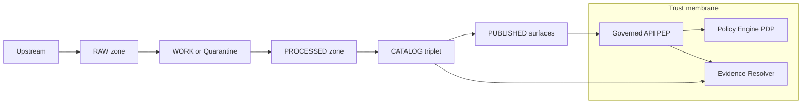

<!-- [KFM_META_BLOCK_V2]
doc_id: kfm://doc/5f2c1f5c-92c8-4d8a-a4c9-42d2d6f9a9a1
title: Pipelines Runbooks
type: standard
version: v1
status: draft
owners: KFM Platform (TBD)
created: 2026-03-02
updated: 2026-03-02
policy_label: public
related:
  - docs/runbooks/README.md
  - docs/architecture/README.md
tags: [kfm, runbook, pipelines, governance, promotion-contract]
notes:
  - This is an index + operating contract for pipeline runbooks (not the pipelines themselves).
  - Repo-specific commands are intentionally placeholders until verified in-repo.
[/KFM_META_BLOCK_V2] -->

# Pipelines Runbooks
Operational runbooks for **KFM data pipelines** (ingestion → QA → processing → catalog/lineage → publish), implemented under the **Truth Path + Promotion Contract + Trust Membrane** invariants.


<!-- TODO: Replace with repo-real CI badges once workflow paths are confirmed. -->

---

## Navigate
- [Purpose](#purpose)
- [Where this fits](#where-this-fits)
- [Truth path model](#truth-path-model)
- [Promotion Contract gates](#promotion-contract-gates)
- [Key pipeline artifacts](#key-pipeline-artifacts)
- [Runbook index](#runbook-index)
- [Incident triage quickstart](#incident-triage-quickstart)
- [Runbook template](#runbook-template)
- [Verification checklist](#verification-checklist)
- [Appendix](#appendix)

---

## Purpose

This directory contains **operator-facing runbooks** that answer:

- **How do we run** a pipeline lane (scheduled, manual, backfill)?
- **What must be produced** (artifacts + catalogs + receipts) to pass gates?
- **How do we troubleshoot** failures and recover safely?
- **How do we prove** a published surface is governed (policy + provenance + evidence)?

### Acceptable inputs (what belongs here)
- Runbooks per lane/dataset/domain: triggers, steps, rollback, and validation gates
- “How to interpret a failure” playbooks (per gate / per stage)
- Run receipt / release manifest conventions and examples
- Checklists (promotion checklist, backfill checklist, incident checklist)
- Links to authoritative contracts (schemas, policies, validators)

### Exclusions (what must NOT go here)
- **Secrets**, credentials, access tokens, private URLs
- **Raw data** or processed artifacts (those live in lifecycle zones)
- One-off “tribal knowledge” instructions with no reproducibility plan
- Commands that bypass the policy boundary / trust membrane (e.g., “query DB directly from UI”)

> **WARNING**
> If a runbook step can leak sensitive locations/attributes, it must default to **generalize/redact or quarantine** and require steward approval before any publish action.

[Back to top](#pipelines-runbooks)

---

## Where this fits

KFM is an evidence-first platform. Pipelines exist to move datasets through lifecycle zones and to generate **catalog + lineage + receipts** required for governed runtime surfaces.

**Runbooks** are the operational layer that makes this repeatable and auditable.



**Interpretation:**
- RAW is immutable; new acquisitions supersede old ones.
- WORK/Quarantine is where transforms, QA, and redaction candidates live.
- PROCESSED holds publishable artifacts in standard formats.
- CATALOG/TRIPLET is DCAT + STAC + PROV (cross-linked) plus receipts.
- PUBLISHED is served only via the governed API/UI (policy enforced).

[Back to top](#pipelines-runbooks)

---

## Truth path model

Use this vocabulary consistently in runbooks:

- ✅ **Confirmed invariants**
  - Lifecycle zones exist conceptually and must be gate-enforced.
  - Promotion to PUBLISHED is blocked unless minimum gates are met.
  - Catalog triplet must cross-link IDs so EvidenceRefs resolve deterministically.
  - Run receipts and audit records are required per run and are append-only artifacts.

- ❓ **Unknown until verified in repo**
  - Exact folder paths for zones and manifests
  - Exact CLI entrypoints and workflow names
  - Exact validation tooling versions

> **NOTE**
> If repo reality differs from this directory’s conventions, update the runbook to reflect *observed* reality and attach the verification artifact (tree, commit hash, workflow list).

[Back to top](#pipelines-runbooks)

---

## Promotion Contract gates

Every runbook MUST specify which gates it satisfies and how failures are handled. Minimum credible gates:

| Gate | What it asserts | Typical failure action |
|---|---|---|
| A — Identity & versioning | `dataset_id`, `dataset_version_id`, deterministic `spec_hash`, artifact digests | Fail closed; fix IDs/spec; rerun |
| B — Licensing & rights | License/rights present + upstream terms snapshot | Quarantine if unclear |
| C — Sensitivity + redaction plan | `policy_label` + obligations (generalize/remove fields) | Default deny; produce `public_generalized` if applicable |
| D — Catalog triplet validation | DCAT/STAC/PROV validate + cross-link; EvidenceRefs resolve | Fix catalogs/link map; rerun validators |
| E — QA thresholds | Dataset-specific checks and thresholds documented and met | Quarantine on failure |
| F — Run receipt & audit record | Receipt captures inputs/outputs/env/validations/policy decisions | Fail closed; do not promote |
| G — Release manifest | Promotion recorded in a manifest referencing digests | Block publish until manifest exists |

[Back to top](#pipelines-runbooks)

---

## Key pipeline artifacts

Runbooks must reference these artifacts (and how to locate them in your deployment):

1. **Run receipt (run_record)**  
   A structured record for every pipeline run containing:
   - inputs (by digest / upstream version)
   - outputs (artifact digests)
   - environment (git commit, container image digest, parameters)
   - validation results
   - policy decisions

2. **Audit ledger (append-only)**  
   The audit ledger is itself a governed dataset; apply redactions as needed.

3. **Release manifest**  
   A promotion-oriented rollup referencing digests and the promoted dataset version.

4. **Catalog triplet**
   - DCAT: dataset-level metadata
   - STAC: asset-level metadata
   - PROV: lineage (activities, entities, agents)

5. **Watchers registry (automation allow-list)** *(if automated ingestion is enabled)*  
   Typed, signed allow-list of fetchers/watchers; CI must verify signature/spec_hash before enabling automation.

[Back to top](#pipelines-runbooks)

---

## Runbook index

> This is an **index of expected runbooks**. If a file doesn’t exist yet, create it using the template below.

### Core pipeline operations
- `00-overview.md` — Pipeline lifecycle + gates (operator quickstart)
- `10-ingestion.md` — Snapshotting upstream into RAW (immutable)
- `20-work-quarantine.md` — QA, transforms, redaction/generalization candidates
- `30-processed-artifacts.md` — Produce standard formats (GeoParquet/COG/PMTiles/etc.)
- `40-catalog-triplet.md` — Build + validate DCAT/STAC/PROV cross-links
- `50-index-rebuild.md` — Rebuild projections (search, tiles, spatial indexes)
- `60-promotion.md` — Promotion PR / steward approval / release manifest
- `70-rollback.md` — How to roll back safely (no deleting RAW; revert pointers/manifests)

### Gate failure playbooks
- `gates/gate-a-identity.md`
- `gates/gate-b-licensing.md`
- `gates/gate-c-sensitivity.md`
- `gates/gate-d-catalog.md`
- `gates/gate-e-qa.md`
- `gates/gate-f-receipts.md`
- `gates/gate-g-release-manifest.md`

### Domain/dataset lanes (examples)
- `lanes/<domain>/<dataset>.md` — one runbook per lane

[Back to top](#pipelines-runbooks)

---

## Incident triage quickstart

When a pipeline fails, do **not** start by re-running blindly. Start with evidence.

### 1) Identify where it failed
- RAW acquisition failure?
- WORK/QA failure (schema, geometry validity, completeness)?
- PROCESSED artifact validation failure?
- CATALOG link validation failure?
- Policy/obligation failure?
- Receipt/manifest missing?

### 2) Find the run receipt (or prove it’s missing)
- If missing → treat as a **Gate F failure** and block promotion.

### 3) Decide recovery action (fail-closed)
- If licensing unclear → **Quarantine**
- If sensitivity unclear → **Default deny** + steward review
- If catalogs don’t cross-link → **Do not publish**
- If artifacts differ from expected digests → **Stop** and investigate integrity drift

[Back to top](#pipelines-runbooks)

---

## Runbook template

Copy/paste for each lane runbook:

```markdown
<!-- [KFM_META_BLOCK_V2]
doc_id: kfm://doc/<uuid>
title: <Lane> Pipeline Runbook
type: standard
version: v1
status: draft
owners: <team>
created: YYYY-MM-DD
updated: YYYY-MM-DD
policy_label: restricted|public
related:
  - kfm://dataset/<dataset_id>
tags: [kfm, runbook, pipelines, <lane>]
notes:
  - Link to receipts/manifests for recent runs.
[/KFM_META_BLOCK_V2] -->

# <Lane> Pipeline Runbook

## Scope
- Dataset(s):
- Environments:
- Cadence:

## Preconditions
- Access requirements:
- Approvals needed:
- Data classification/policy_label:

## Inputs
- Upstream endpoints / snapshots:
- Required schemas/specs:

## Outputs
- RAW artifacts + checksums
- WORK outputs + QA reports
- PROCESSED artifacts + digests
- CATALOG (DCAT/STAC/PROV) + link validation
- Run receipt + audit record
- Release manifest (if promoting)

## Gates
- Gate A:
- Gate B:
- Gate C:
- Gate D:
- Gate E:
- Gate F:
- Gate G:

## Procedure
1) Acquire → RAW
2) Normalize/QA → WORK (or QUARANTINE)
3) Publishable artifacts → PROCESSED
4) Catalog/lineage → CATALOG/TRIPLET
5) Promote → PUBLISHED (governed)

## Observability
- Logs:
- Metrics:
- Receipt location:

## Rollback
- What “rollback” means for this lane:
- How to revert publication pointers/manifests:
- What cannot be rolled back (RAW immutability):

## Known failure modes
- <symptom> → <likely gate> → <fix>

## References
- Policy pack:
- Schemas:
- Prior receipts:
```

[Back to top](#pipelines-runbooks)

---

## Example lane pattern (reference)

A documented end-to-end runbook pattern (example) is:

1) Snapshot raw sources → RAW + manifest + checksums  
2) Geometry fix + CRS sanity  
3) Key normalization  
4) Attribute QC report  
5) Delivery formats (GeoParquet/COG/PMTiles) + validators  
6) Catalogs + lineage (STAC/DCAT/PROV) + signatures  
7) Promotion proposal (signed PR + rollback tag)

> Use this as a structure template; substitute your dataset’s QA/format validators and policy obligations.

[Back to top](#pipelines-runbooks)

---

## Verification checklist

Because some repo/module details may be unverified, every operator should be able to answer these with artifacts:

- [ ] Record **commit hash** and **repo tree** for the run’s code version
- [ ] Confirm which pipeline modules exist (ingest/catalog/indexers/policy/evidence)
- [ ] Extract the **CI gate list** (blocking checks)
- [ ] Promote one MVP dataset end-to-end through all gates with receipts + catalogs
- [ ] Verify UI cannot bypass the API policy boundary (trust membrane)
- [ ] For Focus Mode: run evaluation harness and store golden outputs + diffs (if applicable)

[Back to top](#pipelines-runbooks)

---

## Appendix

<details>
<summary><strong>Policy test example (receipt policy)</strong></summary>

```bash
# Example (verify paths in-repo):
conftest test run_receipt.json -p policy/opa
```

</details>

<details>
<summary><strong>Run receipt skeleton (illustrative)</strong></summary>

```json
{
  "$schema": "https://kfm.dev/schemas/run_receipt_v1.json",
  "kfm_run_id": "string",
  "dataset": "string",
  "subject": "sha256:<digest>",
  "spec_hash": "sha256:<64-hex>",
  "pipeline": "raw->processed->catalog->prov",
  "inputs": ["uri://..."],
  "outputs": ["..."],
  "environment": {
    "git_commit": "<commit>",
    "container_image": "sha256:<image_digest>",
    "runtime": "kubernetes",
    "parameters": {}
  }
}
```

</details>
