<!-- [KFM_META_BLOCK_V2]
doc_id: kfm://doc/938eba63-140c-46c9-8d14-7360d67ccbbe
title: Pipeline Backfill Runbook
type: standard
version: v1
status: draft
owners: kfm/platform
created: 2026-03-02
updated: 2026-03-02
policy_label: restricted
related:
  - docs/runbooks/pipelines/
  - docs/governance/
  - docs/architecture/
tags: [kfm, runbook, pipelines, backfill, promotion-contract, receipts]
notes:
  - This runbook is intentionally contract-first and avoids assuming specific CLI names until verified in-repo.
  - Replace all TODO markers once the live repo paths/commands are confirmed.
[/KFM_META_BLOCK_V2] -->

<a id="top"></a>

[](#)
[](#)
[](#)
[](#)
[](#)

# Pipeline Backfill Runbook
Backfill missing historical data **without violating the trust membrane**: immutable RAW, quarantined failures, validated catalogs, and **fail-closed** promotion.

**Status:** draft  
**Owners:** `kfm/platform` (TODO: confirm CODEOWNERS / on-call rotation)  
**Audience:** pipeline maintainers, data stewards, release managers

## Navigation
- [Intent](#intent)
- [When to use](#when-to-use)
- [Non-negotiable invariants](#non-negotiable-invariants)
- [Inputs and artifacts](#inputs-and-artifacts)
- [Procedure](#procedure)
- [Validation and promotion gates](#validation-and-promotion-gates)
- [Rollback](#rollback)
- [Troubleshooting](#troubleshooting)
- [Appendix: Templates](#appendix-templates)
- [Minimum verification steps](#minimum-verification-steps)

---

## Intent
A **backfill** re-runs ingestion/processing for historical time ranges to fill gaps, correct processing bugs, or regenerate publishable artifacts—**while preserving evidence and governance**.

This runbook focuses on **pipeline backfills** (RAW→…→PUBLISHED).  
If you only need to regenerate projections (tiles/search/DB indexes) from already-promoted artifacts, see a dedicated **reindex** runbook instead (TODO: link).

[Back to top](#top)

---

## When to use

Use this runbook when:
- Historical intervals are missing (upstream outage, failed runs, partial loads).
- A processing defect requires regenerating PROCESSED artifacts and catalogs.
- Policy/obligations require new generalized outputs (e.g., geometry generalization) prior to publication.

Do **not** use this runbook when:
- Only rebuildable projections are stale (PostGIS/search/tiles/graph) and **canonical artifacts** are fine.
- Licensing/sensitivity is unclear and cannot be resolved → this should route to **QUARANTINE**.

> [!WARNING]
> Backfills are **releases**, not “jobs”. Treat every backfill as a governed change that must produce receipts and pass promotion gates.

[Back to top](#top)

---

## Non-negotiable invariants

### Confirmed invariants (must hold)
- **RAW is append-only** (no edits). If upstream changed, you create a new acquisition superseding the old.  
- **WORK/QUARANTINE isolates failures**; quarantined items are not promoted.  
- **PROCESSED contains publishable artifacts** with stable IDs and checksums/digests.  
- **CATALOG/TRIPLET (DCAT + STAC + PROV)** must validate and cross-link to represent evidence and lineage.  
- **PUBLISHED serves only promoted dataset versions** that have processed artifacts, validated catalogs, run receipts, and policy labels.  
- Promotion is **blocked** unless the minimum gates are met (fail-closed).  

### Operational stance
- Correctness > speed
- Default-deny on policy uncertainties
- Chunk backfills to keep rollback cheap and receipts readable

[Back to top](#top)

---

## Conceptual flow (truth path)

```mermaid
flowchart LR
  U[Upstream sources] --> C[Connectors fetch snapshot]
  C --> R[RAW zone immutable artifacts]
  R --> W[WORK or QUARANTINE normalize QA redaction]
  W --> P[PROCESSED publishable artifacts]
  P --> T[CATALOG triplet DCAT STAC PROV receipts]
  T --> I[Index builders]
  I --> A[Governed API policy evidence]
  A --> UI[UI surfaces Map Story Focus]
```



[Back to top](#top)

---

## Inputs and artifacts

### Required inputs (fail closed if missing)
- **Backfill scope**:
  - dataset identifier(s) (e.g., `dataset_slug` / `dataset_id`)  
  - time range(s) and the **time axis** used for slicing (event vs transaction vs valid time; see Definitions)
- **Dataset contract artifacts**:
  - dataset spec (defines schema, QA thresholds, cadence, and promotion requirements)
  - pipeline config (e.g., `pipeline.yaml`) and its schema validation
- **Governance artifacts**:
  - license/rights snapshot for the upstream data used in the backfill window
  - policy label assignment and any obligations (generalize geometry, remove attributes, etc.)
- **Execution artifacts**:
  - run receipts (per run/chunk)
  - promotion manifest (per released dataset_version)

### Recommended artifacts (make review cheap)
- A PR that includes:
  - the backfill plan (see template below)
  - references to prior incidents / missing intervals
  - expected outputs (paths/digests policy-safe)
  - a rollback plan

[Back to top](#top)

---

## Definitions

| Term | Meaning | Notes |
|---|---|---|
| `dataset_id` / `dataset_slug` | Logical dataset identity | Must remain stable across versions |
| `dataset_version_id` | Immutable release/version identifier | Prefer deterministic derivation from spec + inputs (see Appendix) |
| `spec_hash` | Digest of the dataset spec/config | Used to ensure deterministic promotion |
| `run_id` | Unique run identifier | Used in receipts and provenance |
| **event time** | When the real-world event happened | Used for historical slicing |
| **valid time** | When a statement is considered true | Useful for boundaries/administrative history |
| **transaction time** | When KFM recorded/published the data | Useful for auditability |

> [!NOTE]
> If your backfill window is ambiguous, **explicitly choose the time axis** and record it in the Backfill Plan.

[Back to top](#top)

---

## Procedure

### 0) Decide: backfill vs reindex
**Backfill** if you must change RAW/WORK/PROCESSED/CATALOG artifacts.  
**Reindex** if only rebuildable projections are stale.

Checklist:
- [ ] Are PROCESSED artifacts missing or incorrect? → backfill  
- [ ] Are catalogs invalid/missing? → backfill  
- [ ] Are only tiles/search/DB projections stale? → reindex  

---

### 1) Write the Backfill Plan (required)
Create a plan artifact (commit/PR) using the template below.

```yaml
# docs/runbooks/pipelines/_plans/<dataset_slug>/backfill-YYYYMMDD.yml  (SUGGESTED; TODO verify repo conventions)
runbook: docs/runbooks/pipelines/rb-pipeline-backfill.md
dataset_slug: example_dataset
reason: "Gap fill after upstream outage"
requested_by: "<principal>"
reviewers: ["<steward>", "<eng>"]

time_axis: event_time
window:
  start: "2023-01-01T00:00:00Z"
  end: "2023-04-01T00:00:00Z"
chunking:
  mode: monthly
  max_parallelism: 2

governance:
  upstream_terms_snapshot: "<uri-or-path>"
  policy_label: public
  obligations: []  # or include generalize_geometry/remove_attributes

execution:
  runner: "<ci-job-or-cli>"  # TODO confirm
  dry_run_first: true
  receipts_required: true

promotion:
  expected_dataset_version_id: "<to-be-computed>"
  release_manifest_required: true

rollback:
  strategy: "repoint published to prior dataset_version_id"
  prior_dataset_version_id: "<id>"
```

Checklist:
- [ ] Window is explicit and timezone is explicit
- [ ] Chunking strategy defined (size, parallelism)
- [ ] Governance section completed (license snapshot + policy label)
- [ ] Rollback is feasible and written down

---

### 2) Freeze execution context (recommended)
Backfills should be reproducible.

Checklist:
- [ ] Pin container image digest (or build artifact digest)
- [ ] Pin git commit
- [ ] Record params digest (inputs, toggles, chunk window)
- [ ] Ensure deterministic seeds (if any)

> [!WARNING]
> Do not “hotfix-run” a backfill from an uncommitted working tree. If it can’t be reproduced, it can’t be promoted.

---

### 3) Acquire / snapshot into RAW
Goal: create an immutable acquisition record for the backfill window.

Checklist:
- [ ] Fetch upstream payloads for the window
- [ ] Store **license/terms snapshot**
- [ ] Produce checksums/digests for every raw artifact
- [ ] Emit acquisition manifest (what, where, when, under what terms)

Example (placeholder; NOT CONFIRMED IN REPO):
```bash
# TODO: replace with real runner/CLI
kfm pipeline run <pipeline_name> \
  --mode acquire \
  --dataset example_dataset \
  --window-start 2023-01-01 \
  --window-end 2023-02-01 \
  --emit-receipt
```

---

### 4) Normalize + QA into WORK (or route failures to QUARANTINE)
Goal: intermediate transforms + validation.

Checklist:
- [ ] Schema validation
- [ ] Spatial/temporal sanity checks
- [ ] Completeness checks
- [ ] Apply obligations (generalize geometry, remove attributes) if required
- [ ] If license/policy is unclear → QUARANTINE (do not promote)

---

### 5) Materialize PROCESSED artifacts
Goal: publishable artifacts in KFM-approved formats + checksums.

Checklist:
- [ ] Produce stable output artifacts (e.g., GeoParquet/COG/PMTiles as applicable)
- [ ] Compute digests for each processed artifact
- [ ] Derive runtime metadata (bbox, temporal extents, counts) if required
- [ ] Do not overwrite prior PROCESSED artifacts; produce a new versioned set

---

### 6) Generate CATALOG/TRIPLET + run receipts
Goal: DCAT/STAC/PROV validate and cross-link; every run emits a receipt.

Checklist:
- [ ] DCAT validates (dataset-level metadata)
- [ ] STAC validates (asset-level metadata)
- [ ] PROV validates (lineage: activities, entities, agents)
- [ ] All cross-links resolve
- [ ] Evidence references resolve without guessing
- [ ] Run receipt(s) emitted and stored in append-only audit ledger

---

### 7) Build/rebuild projections (rebuildable)
Goal: refresh indexes derived from canonical artifacts.

Checklist:
- [ ] PostGIS tables/materializations rebuilt from PROCESSED
- [ ] Search index rebuilt
- [ ] Graph edges rebuilt (if applicable)
- [ ] Tile bundles rebuilt (if applicable)

> [!NOTE]
> Projection rebuilds should be safe to repeat. If they are not repeatable, treat them as canonical artifacts and move them into PROCESSED with receipts.

---

### 8) Promote to PUBLISHED (release)
Goal: record promotion with a promotion manifest and steward approvals if required.

Checklist:
- [ ] All minimum promotion gates pass (see next section)
- [ ] Steward sign-off recorded (if required by policy label)
- [ ] Promotion manifest written (references artifacts + digests)
- [ ] Published surfaces point to the new dataset_version_id

---

### 9) Post-run closeout
Checklist:
- [ ] Publish a short backfill report (what changed, window, version ids)
- [ ] Link run receipts + promotion manifest in PR
- [ ] Confirm UI/API surfaces render correctly for the backfilled intervals
- [ ] If there’s a watcher/scheduler, confirm future cadence is not broken

[Back to top](#top)

---

## Validation and promotion gates

Promotion is **fail-closed**: do not “partially promote”.

Minimum gates checklist (map to CI where possible):
- [ ] **A — Identity & versioning:** dataset_id + dataset_version_id present; deterministic spec_hash; content digests
- [ ] **B — Licensing:** license/rights metadata + upstream terms snapshot
- [ ] **C — Sensitivity/policy:** policy_label assigned; obligations applied; default-deny tests pass
- [ ] **D — Catalog triplet:** DCAT/STAC/PROV validate and cross-link; EvidenceRefs resolve
- [ ] **E — QA thresholds:** QA report exists; thresholds met (else quarantine)
- [ ] **F — Run receipt & audit:** receipt emitted; audit ledger append
- [ ] **G — Release manifest:** promotion recorded referencing artifacts + digests

> [!TIP]
> When a backfill is large, gate **per chunk** (monthly/daily) and then do a final “roll-up” release manifest if your catalog model supports it.

[Back to top](#top)

---

## Rollback

Rollback should not require deleting RAW/WORK/PROCESSED artifacts.

### Primary rollback strategy
Repoint PUBLISHED surfaces back to the prior `dataset_version_id`.

Checklist:
- [ ] Identify the last-good `dataset_version_id`
- [ ] Repoint release pointer / published alias (mechanism TBD)
- [ ] Keep the failed backfill artifacts for auditability; quarantine if needed
- [ ] File an incident note with links to receipts and the failing gate

> [!WARNING]
> Never “rollback” by mutating or deleting RAW. Immutable acquisition is part of the trust membrane.

[Back to top](#top)

---

## Troubleshooting

| Symptom | Likely cause | Fix | Where to look |
|---|---|---|---|
| Catalog validation fails | Missing required fields or broken cross-links | Fix catalog generator/mapping; regenerate triplet | Catalog validator output; linkcheck report |
| Policy denies promotion | Wrong policy_label, missing obligations, or sensitive fields present | Apply obligations (generalize/remove); re-run WORK→PROCESSED | Policy decision + receipt |
| QA fails threshold | Upstream quality issues or transform bug | Quarantine, adjust transforms, or update spec thresholds via review | QA report artifact |
| Checksums mismatch on replay | Upstream data changed | New acquisition manifest; document change; consider version bump | RAW acquisition manifest |
| Index rebuild diverges | Non-deterministic projection build | Make projection build deterministic or treat as canonical artifact | Indexer logs + receipts |

[Back to top](#top)

---

## Appendix: Templates

<details>
<summary><strong>Run receipt template (reference)</strong></summary>

```json
{
  "run_id": "kfm://run/<timestamp>.<suffix>",
  "actor": { "principal": "svc:pipeline", "role": "pipeline" },
  "operation": "ingest+publish",
  "dataset_version_id": "<dataset_version_id>",
  "inputs": [
    { "uri": "raw/<artifact>", "digest": "sha256:<...>" }
  ],
  "outputs": [
    { "uri": "processed/<artifact>", "digest": "sha256:<...>" }
  ],
  "environment": {
    "container_digest": "sha256:<image...>",
    "git_commit": "<commit>",
    "params_digest": "sha256:<...>"
  },
  "validation": { "status": "pass|fail", "report_digest": "sha256:<...>" },
  "policy": { "decision_id": "kfm://policy_decision/<id>" },
  "created_at": "<timestamp>"
}
```

</details>

<details>
<summary><strong>Promotion manifest template (reference)</strong></summary>

```json
{
  "kfm_promotion_manifest_version": "v1",
  "dataset_slug": "<dataset_slug>",
  "dataset_version_id": "<dataset_version_id>",
  "spec_hash": "sha256:<spec_hash>",
  "released_at": "<timestamp>",
  "artifacts": [
    { "path": "<artifact>", "digest": "sha256:<...>", "media_type": "<mime>" }
  ],
  "catalogs": [
    { "path": "dcat.jsonld", "digest": "sha256:<...>" },
    { "path": "stac/collection.json", "digest": "sha256:<...>" }
  ],
  "qa": { "status": "pass|fail", "report_digest": "sha256:<...>" },
  "policy": { "policy_label": "<label>", "decision_id": "kfm://policy_decision/<id>" },
  "approvals": [
    { "role": "steward", "principal": "<id>", "approved_at": "<timestamp>" }
  ]
}
```

</details>

[Back to top](#top)

---

## Minimum verification steps

This runbook contains **placeholders** where live-repo details must be verified. Before operational use, confirm:

1) **Pipeline runner entrypoint (Confirmed intent; Unknown implementation)**
- Locate the actual runner/CLI and its flags for:
  - time windows
  - dry-run
  - chunking/parallelism
  - receipt emission

2) **Canonical paths for zones**
- Confirm where RAW/WORK/PROCESSED/CATALOG live (filesystem/object storage layout).

3) **Validators + gates**
- Identify the exact CI jobs or scripts that implement:
  - schema validation
  - catalog triplet validation + link checking
  - policy tests (default-deny)
  - QA thresholds

4) **Promotion mechanism**
- Confirm where the promotion manifest is stored and how PUBLISHED pointers/aliases are updated.

5) **Audit ledger storage**
- Confirm the append-only audit log location and any redaction policy for receipts.

> [!TIP]
> Until these steps are completed, treat this runbook as **draft guidance** and do not use it as an operational authority.

[Back to top](#top)
