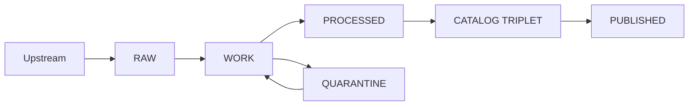
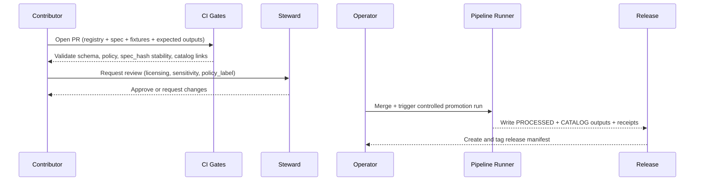

<!-- [KFM_META_BLOCK_V2]
doc_id: kfm://doc/f5e89b7f-4e93-4f8b-88b0-9a6b9c4e20fd
title: rb-pipeline-promote-zone
type: standard
version: v1
status: draft
owners: TBD
created: 2026-03-02
updated: 2026-03-02
policy_label: internal
related:
  - docs/runbooks/pipelines/
  - docs/runbooks/pipelines/rb-pipeline-promote-zone.md
tags: [kfm, runbook, pipelines, promotion, governance, truth-path]
notes:
  - This runbook is evidence-first: promotion is blocked unless Promotion Contract gates pass.
  - Any file paths or CLI commands in this doc are examples until verified in-repo.
[/KFM_META_BLOCK_V2] -->

# rb-pipeline-promote-zone
**Purpose:** Governed, fail-closed procedure for promoting a dataset version across KFM lifecycle zones (RAW → WORK/QUARANTINE → PROCESSED → CATALOG/TRIPLET → PUBLISHED).


> [!WARNING]
> **Promotion is a governed event.** If any required gate fails, **do not promote**. Move the dataset version to **QUARANTINE** and resolve the issue with explicit steward review.

---

## Quick navigation
- [Scope](#scope)
- [Core invariants](#core-invariants)
- [Definitions](#definitions)
- [Zones](#zones)
- [Promotion Contract v1 gates](#promotion-contract-v1-minimum-gates)
- [Procedure](#procedure-pr-based-promotion)
- [Validation checklists](#validation-checklists-by-transition)
- [Rollback and withdrawal](#rollback-and-withdrawal)
- [Troubleshooting](#troubleshooting)
- [Appendix](#appendix)

---

## Scope

### This runbook covers
- Promoting a **single dataset version** from **WORK** (or candidate outputs in WORK) into:
  - **PROCESSED** (publishable artifacts)  
  - **CATALOG/TRIPLET** (DCAT + STAC + PROV cross-linked)
  - **PUBLISHED** (governed runtime surfaces via API/UI)

### This runbook does NOT cover
- Designing a new dataset onboarding spec from scratch (see dataset onboarding docs; TODO link).
- Running the governed API / UI production deployments (see ops runbooks; TODO link).
- Editing RAW artifacts (explicitly prohibited; RAW is append-only).

---

## Core invariants

1. **Truth path zones are real lifecycle stages, not a metaphor.** Promotion moves versioned artifacts forward only when gates pass.
2. **Fail closed:** unclear license, broken evidence links, or missing receipts ⇒ QUARANTINE.
3. **RAW is append-only:** you supersede with a new acquisition; you do not edit prior RAW.
4. **Catalog triplet is a contract surface:** identifiers must cross-link so EvidenceRefs resolve deterministically.
5. **Trust membrane:** published clients do not talk to storage directly; governance is enforced through the policy boundary (PEP/API) and evidence resolver.

---

## Definitions

| Term | Meaning |
|---|---|
| **Dataset** | A logical source (e.g., `noaa_ncei_storm_events`) with a stable `dataset_id`. |
| **Dataset version** | An immutable version identified by `dataset_version_id`, derived from a stable `spec_hash`. |
| **Promotion** | Moving a dataset version forward across lifecycle zones into publishable + governed surfaces. |
| **Artifact** | A produced file/object (e.g., GeoParquet, COG, PMTiles) with a checksum/digest. |
| **Run receipt** | A structured record of inputs, outputs, tooling, and policy decisions for a producing run. |
| **Release manifest** | A record that “binds” a promotion to specific artifact digests + catalog digests + receipts. |
| **QUARANTINE** | A safety stop: failed validation, unclear licensing, sensitivity concerns, or unreproducible upstream. |

---

## Zones

KFM lifecycle zones (conceptual) follow:



### RAW (immutable acquisition)
**Contains:** acquisition manifest, raw artifacts, checksums, minimal metadata including license/terms snapshot.  
**Rule:** append-only; no edits.

### WORK (intermediate transforms)
**Contains:** normalization outputs, QA reports, candidate redactions/generalizations, provisional entity resolution.

### QUARANTINE (block promotion)
Used when validation fails, licensing is unclear, sensitivity risks exist, or upstream is unstable/unreproducible.

### PROCESSED (publishable)
**Contains:** publishable artifacts in KFM-approved formats (e.g., GeoParquet, PMTiles, COG, text corpora), checksums, derived runtime metadata.

### CATALOG/TRIPLET (DCAT + STAC + PROV)
The interoperability + evidence surface:
- **DCAT:** dataset-level metadata (license, publisher, themes, distributions)
- **STAC:** asset-level metadata (collections/items/assets)
- **PROV:** lineage (activities/agents/entities)

### PUBLISHED (governed runtime)
Published surfaces (API + UI) may only serve promoted dataset versions with:
- processed artifacts
- validated catalogs
- run receipts
- policy label assignment

---

## Promotion Contract v1 minimum gates

> [!NOTE]
> These are the **minimum credible gates**. A dataset version promotion **MUST** be blocked unless all required artifacts exist and validate.

### Gate matrix (what to check, what blocks promotion)

| Gate | What must be true | “Fail closed” behavior |
|---|---|---|
| **A — Identity & versioning** | `dataset_id` stable; `dataset_version_id` immutable; `spec_hash` deterministic; content digests computed | Block promotion; require spec/hash stabilization |
| **B — Licensing & rights** | License explicit; rights holder + attribution captured; upstream terms snapshotted | If unclear/missing ⇒ QUARANTINE |
| **C — Sensitivity & redaction plan** | `policy_label` assigned; obligations/redaction plan exists when needed and recorded in PROV | If sensitive + no plan ⇒ QUARANTINE |
| **D — Catalog triplet validation** | DCAT/STAC/PROV validate; cross-links present; EvidenceRefs resolve | If links broken ⇒ Block promotion |
| **E — Run receipt & checksums** | Run receipts exist; inputs/outputs enumerated w checksums; environment recorded (image digest, params) | If missing ⇒ Block promotion |
| **F — Policy tests & contract tests** | OPA policy tests pass; evidence resolver resolves at least one EvidenceRef in CI; API/contracts validate | If failing ⇒ Block promotion |
| **G — Optional but recommended** | SBOM + build provenance; perf smoke checks; accessibility smoke checks | If missing: allowed in v1, but record risk |

---

## Procedure (PR-based promotion)

This workflow makes promotion **social + technical**, not ad hoc.



### Step 0 — Pre-flight (do before opening a PR)
- Identify dataset slug and upstream source(s).
- Decide whether the dataset is:
  - safe public,
  - public_generalized (derived),
  - restricted,
  - restricted_sensitive_location,
  - internal,
  - embargoed,
  - quarantine (not promotable yet).
- Confirm you can snapshot upstream terms (license/ToS) and store as an artifact.

### Step 1 — Open the promotion PR (Contributor)
PR should include (minimum):
- Source registry entry (dataset identity + upstream + rights + proposed `policy_label`)
- Dataset onboarding spec that will be hashed deterministically into `spec_hash`
- Small fixture data sample + expected outputs (for CI comparators)
- Any catalog seed files/templates if applicable

> [!TIP]
> Treat the PR as a **promotion request**. It should be reviewable end-to-end: “What is this?”, “Is it legal?”, “Is it safe?”, “Can we reproduce it?”, “Can we cite it?”

### Step 2 — CI gates (automated)
CI should run checks that (at minimum) cover:
- Registry/spec schema validation
- Policy tests (OPA/Rego) with fixtures
- `spec_hash` stability test (same spec ⇒ same hash across platforms)
- Catalog link checks (if catalogs are present/updated)
- Evidence resolver “smoke” (can it resolve at least one EvidenceRef)

If any check fails:
- Fix the PR until green, or
- Move dataset to QUARANTINE with explicit rationale (and a governance ticket reference).

### Step 3 — Steward review (required sign-off)
Steward review must cover:
- Gate B (licensing/rights) completeness and compatibility
- Gate C (sensitivity classification + obligations)
- Explicit approval of `policy_label` (and generalization approach if needed)

### Step 4 — Merge + controlled promotion run (Operator)
Operator merges the PR **only after**:
- CI gates are green
- Steward approvals recorded

Then trigger the controlled run (implementation-specific).
Outputs **must** include:
- PROCESSED artifacts + checksums
- Triplet catalogs (DCAT + STAC + PROV) that cross-link IDs
- Run receipts capturing:
  - inputs and outputs
  - checksums/digests
  - environment (container image digest, parameters)
  - policy decisions/obligations applied

### Step 5 — Produce a release manifest (Operator/Release Manager)
Create a release manifest that references:
- `dataset_id`, `dataset_version_id`, `spec_hash`
- artifact digests for PROCESSED outputs
- digests for DCAT/STAC/PROV
- run receipt IDs (or paths) proving the run
- steward approvals (who/when/what policy label)
- promotion timestamp and environment identifier

> [!IMPORTANT]
> The release manifest is the “pointer” that makes promotion auditable and reversible.

### Step 6 — Publish (Governed runtime)
Publishing means:
- Runtime surfaces (API/UI) are allowed to serve the dataset version
- Policy label enforcement is active at the PEP/API
- EvidenceRefs resolve from UI/API to catalogs + receipts

---

## Validation checklists by transition

### RAW → WORK (normalize + QA)
- [ ] RAW artifacts are immutable and checksummed
- [ ] WORK outputs are reproducible from RAW + spec
- [ ] QA report exists (schema, completeness, spatial validity as relevant)
- [ ] If QA fails ⇒ QUARANTINE

### WORK → PROCESSED (publishable artifacts)
- [ ] Artifacts produced in approved formats (GeoParquet / PMTiles / COG / etc.)
- [ ] Checksums/digests computed for every artifact
- [ ] Derived runtime metadata computed (bbox, temporal extent, counts)
- [ ] Run receipt generated and validated

### PROCESSED → CATALOG/TRIPLET
- [ ] DCAT record exists and validates (KFM profile)
- [ ] STAC collection/items exist (if applicable) and validate (KFM profile)
- [ ] PROV bundle exists and validates (KFM profile)
- [ ] Cross-links between DCAT/STAC/PROV are present and resolvable
- [ ] EvidenceRefs resolve without guessing

### CATALOG/TRIPLET → PUBLISHED
- [ ] `policy_label` assigned and enforced by policy boundary
- [ ] OPA tests pass for the dataset version
- [ ] API contract/schema checks pass
- [ ] Evidence resolver resolves at least one EvidenceRef for this dataset version
- [ ] Release manifest created and tagged

---

## Rollback and withdrawal

> [!NOTE]
> Specific rollback commands depend on in-repo tooling. The **principle** is stable: do not delete canonical truth; instead withdraw pointers and supersede with a new version.

### When to roll back
- A promotion introduced licensing risk
- Sensitive locations were exposed without proper redaction/generalization
- Catalog cross-links are broken (EvidenceRefs do not resolve)
- Incorrect artifacts were published (digest mismatch, schema drift)

### Rollback strategy (conceptual)
1. **Withdraw** the published pointer (e.g., disable/rollback the release manifest reference).
2. **Quarantine** the dataset version with explicit cause.
3. **Promote a fixed superseding version** via a new PR and a new run receipt.

---

## Troubleshooting

### Gate A failures (identity/hash drift)
**Symptoms:** `spec_hash` changes unexpectedly across machines/CI.  
**Fix:** ensure canonical JSON (RFC 8785) and add/update stability test.

### Gate B failures (license missing/unclear)
**Symptoms:** registry/spec has missing or “unknown” license/rights.  
**Fix:** capture upstream terms snapshot artifact; get steward sign-off; else QUARANTINE.

### Gate C failures (sensitivity)
**Symptoms:** dataset includes precise locations that should not be public.  
**Fix:** apply generalization method (centroid/grid/dissolve/bbox) and record in PROV; produce a public_generalized derivative.

### Gate D failures (catalog triplet validation)
**Symptoms:** STAC validates but PROV missing; DCAT doesn’t cross-link; EvidenceRefs break.  
**Fix:** regenerate triplet with consistent IDs; run linkcheck; do not publish.

### Gate E failures (missing receipts/checksums)
**Symptoms:** artifacts exist but no run receipt; or missing checksums.  
**Fix:** rerun controlled pipeline; ensure receipts enumerate inputs/outputs + environment.

### Gate F failures (policy/contract tests)
**Symptoms:** OPA tests fail; evidence resolver can’t resolve; API contract mismatch.  
**Fix:** update policy fixtures and obligations; correct catalogs; align schemas/contracts.

---

## Appendix

### A1) Identifier guidance (conceptual)
Recommended families:
- `kfm://dataset/…`
- `kfm://artifact/sha256:…`
- `kfm://run/…`
- `kfm://evidence/…`

Avoid environment-specific hostnames inside canonical IDs (hostnames belong in distribution URLs).

### A2) spec_hash pattern (conceptual)
- `spec_hash = sha256( RFC8785_canonical_json(spec) )`
- `dataset_version_id` derived from `spec_hash` (exact formatting is implementation-specific)

### A3) Proposed canonical storage layout (verify in repo)
A proposed convention for canonical paths:

```text
data/
  raw/<dataset_slug>/<acquisition_id>/manifest.json
  raw/<dataset_slug>/<acquisition_id>/artifacts/...

  work/<dataset_slug>/<work_run_id>/...

  processed/<dataset_slug>/<dataset_version_id>/artifacts/<artifact_name>.<ext>
  processed/<dataset_slug>/<dataset_version_id>/checksums.json
  processed/<dataset_slug>/<dataset_version_id>/qa/validation_report.json

  catalog/<dataset_slug>/<dataset_version_id>/...
```

### A4) Minimum verification steps (to convert “unknown” → “confirmed”)
- [ ] Record repo commit hash + root tree (e.g., `git rev-parse HEAD`, `tree -L 3`)
- [ ] Confirm presence of spec_hash tooling, policy tests, validators, evidence resolver
- [ ] Extract CI gate list from `.github/workflows`
- [ ] Promote one MVP dataset end-to-end with receipts + catalogs
- [ ] Verify UI cannot bypass policy boundary; verify EvidenceRefs resolve end-to-end
- [ ] For Focus Mode, run evaluation harness and store golden outputs

---

_Back to top:_ [rb-pipeline-promote-zone](#rb-pipeline-promote-zone)
