<!-- [KFM_META_BLOCK_V2]
doc_id: kfm://doc/0a8c9b76-7099-4d3a-8b38-0f981e4aa932
title: Pipeline Rerun Runbook
type: standard
version: v1
status: draft
owners: KFM Pipeline Maintainers
created: 2026-03-02
updated: 2026-03-02
policy_label: public
related:
  - docs/runbooks/pipelines/
  - docs/runbooks/README.md
  - data/
  - scripts/
tags: [kfm, runbook, pipelines, rerun, receipts, audit]
notes:
  - Focus: safe reruns that preserve the truth path, receipts, and fail-closed gates.
  - Repo-specific command names are intentionally TODO until verified in-tree.
[/KFM_META_BLOCK_V2] -->

# Pipeline Rerun Runbook
_Status: **draft** • Owners: **KFM Pipeline Maintainers**_

    
<!-- TODO: replace badges with repo-local badge conventions if available. -->

This runbook explains **how to rerun (or rebuild) KFM pipelines** without breaking the **truth path**, mutating artifacts in-place, or bypassing **policy and promotion gates**.

## Quick navigation
- [When to use this runbook](#when-to-use-this-runbook)
- [What “rerun” means in KFM](#what-rerun-means-in-kfm)
- [Decision flow](#decision-flow)
- [Pre-flight checklist](#pre-flight-checklist)
- [Procedures](#procedures)
  - [A. Retry an ingestion run](#a-retry-an-ingestion-run)
  - [B. Re-run catalog generation](#b-re-run-catalog-generation)
  - [C. Re-run promotion after fixing a gate failure](#c-re-run-promotion-after-fixing-a-gate-failure)
  - [D. Rebuild projections from catalogs](#d-rebuild-projections-from-catalogs)
  - [E. Roll back a bad published dataset version](#e-roll-back-a-bad-published-dataset-version)
- [Post-run validation](#post-run-validation)
- [Troubleshooting](#troubleshooting)
- [Appendix: templates](#appendix-templates)

---

## When to use this runbook

Use this runbook when you need to:

- retry a failed connector/ETL job (re-ingest to RAW/WORK/PROCESSED),
- regenerate **DCAT/STAC/PROV** catalogs (CatGen) after a catalog failure,
- re-run promotion after a **fail-closed gate** blocks publication,
- rebuild rebuildable **projections** (PostGIS/search/tiles) from catalogs,
- roll back a bad dataset version that was already promoted.

### Acceptable inputs
You should have at least one of:

- `dataset_slug` (preferred)
- `dataset_version_id`
- `run_id` (run receipt identifier)
- CI job URL / run logs that show the failure mode

### Exclusions
Do **not** use this runbook for:

- onboarding a brand-new dataset (use an onboarding runbook),
- disaster recovery where object storage/canonical catalogs are missing (use DR runbook),
- ad-hoc data edits (“hotfixing”) inside RAW/PROCESSED paths.

---

## What “rerun” means in KFM

In KFM, “rerun” is not just “run the job again.” The system is designed so that:

- outputs are **artifacted** (files, digests, manifests),
- every run produces a **run receipt** (inputs, outputs, environment, validations, policy decision),
- promotion is **fail-closed** (blocked unless artifacts, catalogs, links, policy, and QA validate),
- rebuildable stores (PostGIS/search/tiles) must be recoverable from catalogs + processed artifacts.

### Rerun modes

| Mode | What you’re doing | When it’s safe | What must be emitted |
|---|---|---|---|
| **Retry** | Same spec, same upstream bytes, just retrying a failed run | Upstream unchanged and spec unchanged | New run receipt (or receipt update strategy), no in-place mutation |
| **Reprocess** | Same upstream bytes, but processing logic/spec changed | When fixing a bug or improving transforms | **New** dataset version and receipts (do not overwrite old) |
| **Backfill** | Upstream bytes changed (late-arriving data) | When upstream changed legitimately | **New** dataset version and receipts |
| **Rebuild** | Recreate projections from catalogs (no data change) | When PostGIS/search/tiles are out-of-sync | Rebuild receipt in audit ledger |

> **WARNING**  
> Do not “fix data in place” by changing existing PROCESSED artifacts without producing a **new dataset version** and receipts.

---

## Decision flow

```mermaid
flowchart TD
  A[Start: pipeline issue detected] --> B{What failed?}
  B -->|Connector or ETL| C[Retry ingestion or reprocess]
  B -->|Catalog generation| D[Re-run CatGen]
  B -->|Promotion gate| E[Fix gate root cause then re-run promotion]
  B -->|Projection out of sync| F[Rebuild projections from catalogs]
  B -->|Bad version already published| G[Rollback via new dataset version pointer]

  C --> H[Emit run receipt and update audit ledger]
  D --> I[Validate DCAT STAC PROV and cross-links]
  E --> J[Validate gates then emit promotion manifest and receipt]
  F --> K[Record rebuild receipt after validating counts and extents]
  G --> L[Record rollback decision and update latest pointers]

  H --> M[Post-run validation]
  I --> M
  J --> M
  K --> M
  L --> M
```



---

## Pre-flight checklist

- [ ] Identify `dataset_slug` and (if known) `dataset_version_id`
- [ ] Locate the most recent **run receipt** for the failed/previous run
- [ ] Identify the failure class:
  - [ ] upstream fetch error
  - [ ] transform/validation error
  - [ ] policy gate failure
  - [ ] catalog schema/link failure
  - [ ] receipt/digest/cosign mismatch
  - [ ] projection drift (PostGIS/search/tiles)
- [ ] Confirm whether you are doing **Retry**, **Reprocess**, **Backfill**, or **Rebuild**
- [ ] Confirm you have access to:
  - [ ] object store paths for RAW/PROCESSED artifacts
  - [ ] CI logs and validation reports
  - [ ] catalog outputs (DCAT/STAC/PROV)
  - [ ] audit ledger / receipts store

---

## Procedures

> **NOTE**  
> The command names below are **intentionally TODO** until verified in-tree.  
> Replace the placeholders with repo-confirmed scripts/CLI commands.

### Repo command map (fill-in once verified)

| Task | Expected entrypoint | Status |
|---|---|---|
| Ingest / re-ingest | `scripts/rebuild` (or `apps/cli kfm ingest …`) | TODO: verify actual command |
| Generate catalogs | `CatGen` (script/CLI/service) | TODO: verify actual command |
| Promote | `apps/cli kfm promote …` | TODO: verify actual command |
| Rebuild projections | `apps/cli kfm rebuild …` | TODO: verify actual command |
| Receipt verify | `apps/cli kfm receipts verify …` | TODO: verify actual command |

---

### A. Retry an ingestion run

Use this when a connector failed but **upstream bytes and spec did not change**.

1) **Confirm upstream did not change**
- Prefer using conditional request metadata (e.g., ETag / Last-Modified) captured in the prior receipt.
- Compare raw artifact digests if a previous raw artifact exists.

2) **Re-run ingestion**
```bash
# TODO: replace with real command.
scripts/rebuild ingest --dataset <dataset_slug>
```

3) **Verify output immutability**
- A rerun should either:
  - reuse the exact prior artifact bytes (same digest), or
  - write a *new* artifact location/version (if bytes differ).

4) **Emit/record the run receipt**
- Receipt must capture inputs, outputs, environment (container digest + git commit), validation, and policy decision.

5) **If ingestion succeeded but promotion is blocked**, continue to [C. Re-run promotion](#c-re-run-promotion-after-fixing-a-gate-failure).

---

### B. Re-run catalog generation

Use this when PROCESSED artifacts exist, but **DCAT/STAC/PROV generation** failed or catalogs are invalid.

1) **Confirm processed artifacts are present**
- Ensure each artifact has a digest and is referenced by checksums (e.g., `checksums.json` or equivalent).

2) **Re-run CatGen**
```bash
# TODO: replace with real command.
scripts/catgen --dataset-version <dataset_version_id>
```

3) **Validate catalogs**
- Validate DCAT/STAC/PROV under the KFM profiles.
- Run link checks so cross-links resolve (e.g., STAC item links to PROV/run receipt, DCAT distributions resolve).

4) **Record a catalog rebuild receipt**
- Treat catalog rebuilds as auditable operations (append-only ledger).

---

### C. Re-run promotion after fixing a gate failure

Use this when promotion fails due to policy/QA/catalog/link gates.

1) **Identify the blocking gate**
Common gates include:
- identity/spec hash drift,
- missing artifact digests,
- catalog schema or cross-link validation failures,
- policy default-deny failures (rights unclear, excluded content),
- QA validation failures (quarantine).

2) **Fix the root cause**
- If the fix changes transforms or output bytes, treat as **Reprocess** (new dataset version).
- If upstream data changed, treat as **Backfill** (new dataset version).

3) **Re-run promotion**
```bash
# TODO: replace with real command.
apps/cli kfm promote --dataset-version <dataset_version_id>
```

4) **Promotion output requirements**
Promotion should emit:
- promotion manifest (dataset_slug, dataset_version_id, spec_hash, artifact list + digests, catalog digests, QA summary, policy decision, approvals if required)
- run receipt (promotion activity)
- updated catalog entries, including cross-links

5) **If receipt checks fail**
- Compare digests and consult the cosign records referenced by the receipt.
- Fail closed: do not publish until receipts, digests, and attestations match.

---

### D. Rebuild projections from catalogs

Use this when “rebuildable” runtime stores drift, but canonical catalogs + processed artifacts are correct.

Rebuild pipeline steps (conceptual):
1) read catalogs for a `dataset_version_id`
2) locate processed artifacts by digest/path
3) load into projections (PostGIS, search, graph, tile caches)
4) validate counts and extents against catalog metadata
5) record a rebuild receipt in the audit ledger

```bash
# TODO: replace with real command.
apps/cli kfm rebuild --dataset-version <dataset_version_id> --targets postgis,search,tiles
```

> **TIP**  
> This should be the preferred recovery path for PostGIS/search/tiles problems.  
> Restoring from catalogs + processed artifacts is simpler than restoring bespoke DB states.

---

### E. Roll back a bad published dataset version

Use this if a dataset version is already in runtime surfaces and must be withdrawn.

**Fail-closed posture:** do not delete evidence. Rollback should be a governed change:
1) publish a rollback decision (who/why/when)
2) mark the bad version as “superseded” (retain catalogs/receipts)
3) update the dataset’s “latest_version_id” pointer to a known-good version
4) re-run rebuild pipeline to update projections if needed
5) record rollback receipt in the audit ledger

```bash
# TODO: replace with real command.
apps/cli kfm rollback --dataset <dataset_slug> --to-version <dataset_version_id>
```

---

## Post-run validation

### Required validations
- [ ] **Schema validation** passes for registry entries, catalogs (DCAT/STAC/PROV), and API contracts as applicable
- [ ] **Cross-link tests** pass (no broken links; EvidenceRefs resolve)
- [ ] **Policy tests** pass (default-deny; license snapshots present; obligations applied)
- [ ] **Spec hash drift check** passes (registry spec_hash matches computed)
- [ ] **Promotion receipt checks** pass (digests match; cosign attestation verifies if enabled)
- [ ] **Audit ledger** includes the new run/rebuild receipt
- [ ] **Lineage/status endpoint** reflects success (e.g., `GET /api/v1/lineage/status`)

### Sanity checks (recommended)
- [ ] Compare counts/extents to prior version (or expected) to detect accidental truncation
- [ ] Verify UI surfaces render with resolvable citations (no “shadow sources”)

---

## Troubleshooting

### Catalog generation fails repeatedly
- Validate the processed artifact media types and digests.
- Verify catalog profile version compatibility.
- Run link-checker locally; fix missing references before CI.

### Receipt or digest mismatch
- Treat this as a high-severity integrity issue.
- Confirm that artifacts were not overwritten in place.
- Re-run with a clean workspace; if output bytes differ, produce a new dataset version.
- Verify supply-chain attestations (cosign) referenced by the receipt.

### QA fails and data is quarantined
- Do not promote.
- Fix data quality issues or adjust spec thresholds (with stewardship approval), then re-run.

---

## Appendix: templates

<details>
<summary><strong>Run receipt template (starting point)</strong></summary>

```json
{
  "run_id": "kfm://run/<iso8601>.<suffix>",
  "actor": {"principal": "<svc or user>", "role": "<role>"},
  "operation": "<ingest|catalog|promote|rebuild>",
  "dataset_slug": "<dataset_slug>",
  "dataset_version_id": "<dataset_version_id>",
  "inputs": [{"uri": "<path or url>", "digest": "sha256:<...>"}],
  "outputs": [{"uri": "<path>", "digest": "sha256:<...>", "media_type": "<...>"}],
  "environment": {
    "container_digest": "sha256:<...>",
    "git_commit": "<sha>",
    "params_digest": "sha256:<...>"
  },
  "validation": {"status": "<pass|fail>", "report_digest": "sha256:<...>"},
  "policy": {"decision_id": "kfm://policy_decision/<id>", "policy_label": "<public|restricted|...>"},
  "created_at": "<iso8601>"
}
```

</details>

<details>
<summary><strong>Promotion manifest template (starting point)</strong></summary>

```json
{
  "kfm_promotion_manifest_version": "v1",
  "dataset_slug": "<dataset_slug>",
  "dataset_version_id": "<dataset_version_id>",
  "spec_hash": "sha256:<...>",
  "released_at": "<iso8601>",
  "artifacts": [
    {"path": "<processed artifact path>", "digest": "sha256:<...>", "media_type": "<...>"}
  ],
  "catalogs": [
    {"path": "<dcat path>", "digest": "sha256:<...>"},
    {"path": "<stac path>", "digest": "sha256:<...>"},
    {"path": "<prov path>", "digest": "sha256:<...>"}
  ],
  "qa": {"status": "<pass|fail>", "report_digest": "sha256:<...>"},
  "policy": {"policy_label": "<...>", "decision_id": "kfm://policy_decision/<id>"},
  "approvals": [
    {"role": "steward", "principal": "<id>", "approved_at": "<iso8601>"}
  ]
}
```

</details>

---

<a id="back-to-top"></a>
_Back to top: [Pipeline Rerun Runbook](#pipeline-rerun-runbook)
