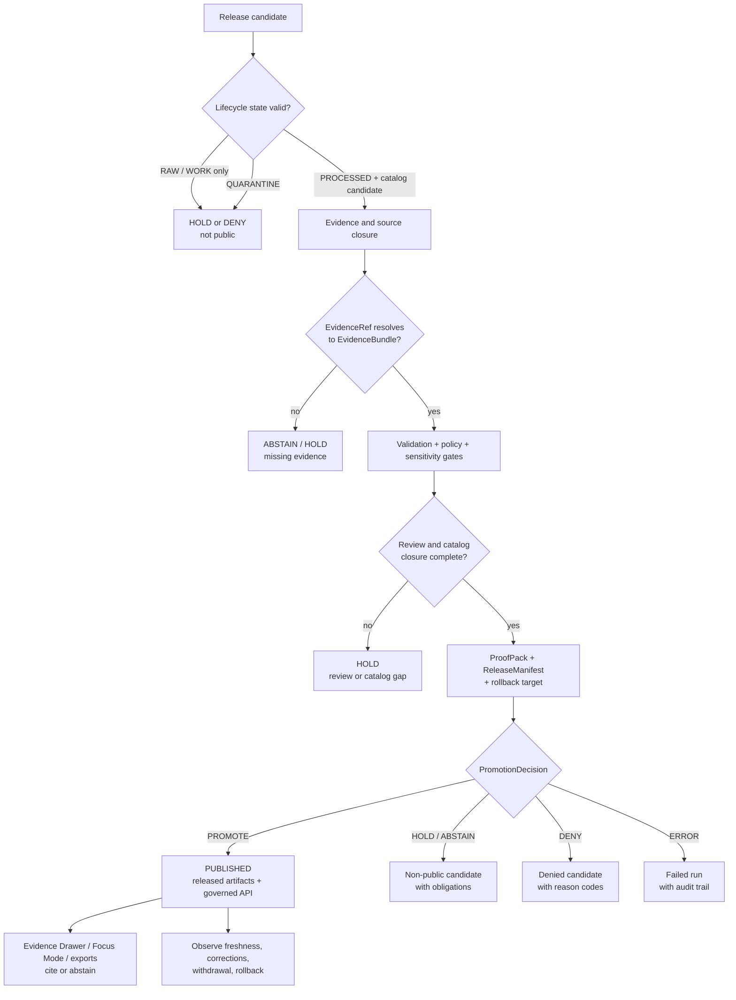

<!-- [KFM_META_BLOCK_V2]
doc_id: kfm://doc/NEEDS-VERIFICATION-publication-runbook-uuid
title: Publication Runbook
type: standard
version: v1
status: draft
owners: TODO-VERIFY-CODEOWNERS-or-release-stewards
created: 2026-04-28
updated: 2026-04-28
policy_label: TODO-VERIFY-public-or-restricted
related: ["NEEDS-VERIFICATION: docs/runbooks/README.md", "NEEDS-VERIFICATION: docs/architecture/README.md", "NEEDS-VERIFICATION: docs/governance/README.md", "NEEDS-VERIFICATION: contracts/README.md", "NEEDS-VERIFICATION: schemas/README.md", "NEEDS-VERIFICATION: policy/README.md", "NEEDS-VERIFICATION: data/receipts/README.md", "NEEDS-VERIFICATION: data/proofs/README.md", "NEEDS-VERIFICATION: data/catalog/README.md", "NEEDS-VERIFICATION: data/published/README.md"]
tags: [kfm, publication, promotion, release, governance, evidence]
notes: [Created as a doctrine-grounded draft for docs/runbooks/publication.md; mounted repo evidence was not available in the authoring session; doc_id, owners, policy label, related paths, schema names, workflow names, and executable commands require verification before publication.]
[/KFM_META_BLOCK_V2] -->

# Publication Runbook

Release-facing procedure for moving KFM material into governed publication without breaking evidence, policy, review, correction, or rollback continuity.

> [!IMPORTANT]
> In KFM, publication is a **governed state transition**.  
> A copied file, uploaded tile, rendered scene, switched layer toggle, generated answer, or passing validator is **not** publication by itself.

| Field | Value |
|---|---|
| **Status** | `draft` |
| **Target path** | `docs/runbooks/publication.md` |
| **Evidence posture** | CONFIRMED doctrine / PROPOSED procedure / NEEDS VERIFICATION repo wiring |
| **Primary audience** | release operators, domain stewards, policy reviewers, maintainers, UI/API owners |
| **Primary invariant** | `RAW -> WORK / QUARANTINE -> PROCESSED -> CATALOG / TRIPLET -> PUBLISHED` |
| **Public-surface rule** | Public clients use governed APIs, released artifacts, catalog records, tile services, and EvidenceBundle resolution. |
| **Quick jumps** | [Scope](#scope) · [Publication law](#publication-law) · [Operating flow](#operating-flow) · [Release packet](#release-packet) · [Gate sequence](#gate-sequence) · [Procedure](#procedure) · [Decision outcomes](#decision-outcomes) · [Rollback](#rollback-correction-and-withdrawal) · [Verification](#verification-checklist) · [Appendix](#appendix-illustrative-shapes) |

---

## Scope

This runbook governs the last trust-bearing step before KFM material becomes visible through a public, restricted, steward, export, map, dossier, story, or Focus Mode surface.

It is intentionally stricter than a deployment checklist. Deployment can move bytes. Publication changes what outward-facing users are allowed to treat as released KFM meaning.

### This runbook applies to

- release candidates that contain public or restricted claims
- map layers, PMTiles, MVT, COG, 3D scene, or export artifacts intended for outward use
- EvidenceBundle-backed dossiers, stories, Focus responses, and Evidence Drawer payloads
- catalog, triplet, provenance, or discovery records that make a claim discoverable
- correction, supersession, rollback, or withdrawal actions that affect a released claim
- domain lanes where rights, sensitivity, exact-location, review, or source-role status affects visibility

### This runbook does not authorize

- direct public reads from `RAW`, `WORK`, `QUARANTINE`, canonical stores, proof-only stores, reviewer-only stores, or model-runtime stores
- publication from raw model output or UI-rendered text without EvidenceBundle-backed support
- treating process receipts as release proof
- treating a validation pass as promotion
- treating a file under a published-looking path as published without a PromotionDecision and ReleaseManifest
- silently widening precision, audience, geography, time, rights, or sensitivity scope

[Back to top](#publication-runbook)

---

## Repo fit

| Direction | Surface | Status |
|---|---|---|
| **Requested file** | `docs/runbooks/publication.md` | CONFIRMED target path from task |
| **Upstream doctrine** | architecture, governance, data lifecycle, policy, contracts, schemas | NEEDS VERIFICATION for exact repo paths |
| **Upstream machine inputs** | SourceDescriptor, EvidenceBundle, ValidationReport, PolicyDecision, CatalogMatrix, ProofPack | PROPOSED object-family names unless repo schemas confirm exact names |
| **Publication state object** | PromotionDecision + ReleaseManifest | PROPOSED wiring / CONFIRMED doctrine |
| **Downstream public surfaces** | governed API, MapLibre shell, Evidence Drawer, Focus Mode, exports, catalog, released tiles | PROPOSED wiring / CONFIRMED doctrine |
| **Rollback surfaces** | rollback target, CorrectionNotice, withdrawal record, cache invalidation note | PROPOSED wiring / CONFIRMED doctrine |

> [!NOTE]
> This draft avoids hard links to adjacent files because the authoring session did not expose the mounted repository. Replace `NEEDS VERIFICATION` placeholders with repo-relative links after `docs/`, `contracts/`, `schemas/`, `policy/`, `data/`, and `.github/` conventions are inspected.

---

## Publication law

KFM publication is governed by these rules.

### 1. Inspectable claim first

The durable public unit is not the tile, map popup, graph edge, paragraph, layer, dashboard, scene, or AI answer.

The durable public unit is the **inspectable claim**: a statement reconstructable to evidence, spatial scope, temporal scope, source role, policy posture, review state, release state, and correction lineage.

### 2. Lifecycle state matters

The canonical movement is:

```text
SOURCE EDGE
  -> RAW
  -> WORK / QUARANTINE
  -> PROCESSED
  -> CATALOG / TRIPLET
  -> PUBLISHED
  -> governed API / released artifacts / EvidenceBundle resolution
  -> UI, Evidence Drawer, Focus Mode, export, story, review surfaces
```

Material does not skip lifecycle states for convenience.

### 3. Promotion is not a file move

A candidate becomes publishable only when the release packet proves the transition.

At minimum, the packet must show:

- identity and source-role support
- rights and sensitivity posture
- validation results
- policy disposition
- review state
- catalog or provenance closure
- proof assembly
- rollback target
- correction path
- release scope and audience

### 4. Cite or abstain

Any outward claim that cannot resolve to admissible evidence must not be polished into confidence.

It must return or display a bounded negative state such as:

- `MISSING_EVIDENCE`
- `SOURCE_STALE`
- `DENIED_BY_POLICY`
- `GENERALIZED_GEOMETRY`
- `RESTRICTED_ACCESS`
- `CONFLICTED_SUPPORT`
- `CITATION_FAILED`
- `RELEASE_WITHDRAWN`
- `RUNTIME_ERROR`

### 5. Derived surfaces are carriers, not truth

Tiles, PMTiles, search indexes, graph projections, summaries, reports, stories, scenes, and model outputs are downstream carriers. They do not silently replace source records, EvidenceBundles, release manifests, or policy decisions.

### 6. Sensitivity fails closed

When rights, sovereignty, cultural sensitivity, exact location, rare species, archaeology, critical infrastructure, living-person, DNA, private land, source terms, or steward obligations are unclear, the candidate is held, generalized, redacted, restricted, quarantined, or denied.

[Back to top](#publication-runbook)

---

## Operating flow



> [!WARNING]
> The diagram is a runbook model, not proof that repo workflows already implement these nodes. Map it to the actual workflow YAML, validators, schemas, and release tooling during implementation.

[Back to top](#publication-runbook)

---

## Release packet

A publication candidate should be promoted only when it has a compact, reviewable release packet.

| Artifact | Role | Publication requirement |
|---|---|---|
| `SourceDescriptor` | Source identity, role, rights, cadence, authority, access posture | Required before source-derived publication |
| `DatasetVersion` | Stable identity for processed or released dataset scope | Required when dataset scope changes |
| `EvidenceBundle` | Release-grade support for claims | Required for consequential claims |
| `ValidationReport` | Machine-readable schema, geometry, temporal, linkage, rights, and policy checks | Blocking on `FAIL` or `ERROR` |
| `PolicyDecision` | Admissibility, rights, sensitivity, visibility, and obligations | Blocking unless release class is allowed |
| `ReviewRecord` | Steward, policy, domain, or release review result | Required where sensitivity, rights, or material public effect exists |
| `CatalogMatrix` | STAC / DCAT / PROV / triplet closure or equivalent catalog proof | Required for discoverable publication |
| `ProofPack` | Release-grade proof assembly tying manifests, validations, evidence, and review | Required for significant release |
| `ReleaseManifest` | Artifact set, digests, scope, release ID, rollback target | Required before `PUBLISHED` |
| `PromotionDecision` | State-elevation decision from candidate to released scope | Required for publication |
| `CorrectionNotice` | Public correction, supersession, or withdrawal record | Required after material released-output change |
| `RuntimeResponseEnvelope` | Governed API / Focus outward response envelope | Downstream of release; not promotion authority |
| `EvidenceDrawerPayload` | UI trust payload for public or steward display | Downstream of release; not promotion authority |

### Receipt, proof, catalog, and publication split

| Surface | Owns | Must not silently own |
|---|---|---|
| `data/receipts/` | process memory: what ran, what was observed, what changed | release proof or publication approval |
| `data/proofs/` | release-significant proof objects and attestable support | catalog discoverability or public aliasing by itself |
| `data/catalog/` | discovery, provenance closure, dataset/layer references | canonical truth or release approval |
| `data/published/` | released materialized scope and public-safe artifacts | policy decisions, source authority, or proof definitions |
| governed API | public/restricted resolution and response envelopes | direct raw/canonical access |
| UI / renderer | trust-visible display, selection, navigation, review handoff | deciding truth, safety, release, or citation validity |

[Back to top](#publication-runbook)

---

## Gate sequence

The gate labels below are runbook labels. Rename them to repo-native gate names only after schema and workflow conventions are confirmed.

| Gate | Name | Pass condition | Fail-closed result |
|---|---|---|---|
| **P0** | Candidate identity | Candidate has stable ID, declared scope, source lineage, lifecycle state, and `spec_hash` or equivalent deterministic identity. | `ERROR` for malformed identity; `HOLD` for missing stable identity |
| **P1** | Source and rights | Every source has source role, rights posture, citation posture, access posture, and publication intent. | `DENY` or `HOLD` |
| **P2** | Evidence closure | Every consequential claim resolves `EvidenceRef -> EvidenceBundle`; unsupported claims are removed, narrowed, or marked abstaining. | `ABSTAIN` / `HOLD` |
| **P3** | Validation closure | Schema, geometry, temporal, CRS, source-role, catalog-linkage, citation, and artifact-digest checks pass. | `ERROR` or `HOLD` |
| **P4** | Policy and sensitivity | Rights, sensitivity, audience, release class, and location precision pass policy checks. | `DENY`, `HOLD`, redaction, generalization, or restricted release |
| **P5** | Review closure | Required steward, domain, policy, security, cultural, or release reviews are recorded. | `HOLD` |
| **P6** | Catalog and proof closure | CatalogMatrix / provenance closure and ProofPack are complete and internally consistent. | `HOLD` |
| **P7** | Release assembly | ReleaseManifest names artifacts, digests, scope, audience, rollback target, cache behavior, and correction path. | `ERROR` or `HOLD` |
| **P8** | Runtime readiness | Governed API, Evidence Drawer, Focus Mode, export, and map layer surfaces resolve released scope only and expose negative states. | `HOLD` |
| **P9** | Promotion decision | PromotionDecision is recorded as `PROMOTE`, `HOLD/ABSTAIN`, `DENY`, or `ERROR` with reason codes and audit reference. | Non-promote outcomes remain non-public |

> [!NOTE]
> The corpus uses more than one finite vocabulary in related promotion sketches. Until the actual schema is confirmed, this runbook treats `HOLD` and `ABSTAIN` as semantically related but schema-dependent. Normalize the enum in the machine contract before making it executable.

[Back to top](#publication-runbook)

---

## Procedure

### 0. Reconfirm the repo boundary

Run this before editing or publishing.

```bash
# NEEDS VERIFICATION: adapt to repo-native scripts and root path.
git status --short
git branch --show-current

find .github docs contracts schemas policy data tools tests apps packages release \
  -maxdepth 3 -type f 2>/dev/null | sort | sed -n '1,240p'

rg -n \
  "Publication|PromotionDecision|ReleaseManifest|ProofPack|CatalogMatrix|EvidenceBundle|CorrectionNotice" \
  docs contracts schemas policy data tools tests .github 2>/dev/null
```

Record the result in the release packet or review handoff. Do not infer implementation maturity from doctrine alone.

### 1. Identify the candidate

Confirm the candidate has:

- candidate ID
- requested release class
- audience class
- domain lane
- claim class
- spatial scope
- temporal scope
- source descriptors
- artifact refs
- lifecycle state
- rollback target candidate
- correction route

Candidate material still in `RAW`, `WORK`, or `QUARANTINE` is not publishable.

### 2. Assemble evidence

For every consequential claim:

1. resolve its EvidenceRefs
2. verify the EvidenceBundle exists and is policy-safe for the target audience
3. confirm source roles support the claim being made
4. confirm spatial and temporal scope are explicit
5. confirm rights and sensitivity are visible
6. confirm citation and correction state are present

Remove or narrow claims that fail evidence closure.

### 3. Run validators

Use repo-native validators when available. Until those are verified, treat this as the expected validator family.

```bash
# NEEDS VERIFICATION: command names are illustrative.
python tools/validators/publication/validate_release_packet.py \
  --candidate data/work/publication/<candidate-id>/release-packet.json

python tools/validators/evidence_bundle/validate.py \
  --bundle data/work/publication/<candidate-id>/evidence-bundle.json

python tools/validators/catalog_matrix/validate.py \
  --matrix data/work/publication/<candidate-id>/catalog-matrix.json

python tools/validators/promotion_gate/validate.py \
  --candidate data/work/publication/<candidate-id>
```

A green validator result proves only that the candidate is ready for review or promotion decision. It does not publish.

### 4. Apply policy

Policy review must cover at least:

- release class
- rights and license posture
- source terms
- privacy and living-person risk
- exact-location exposure
- cultural or sovereign sensitivity
- archaeological, rare species, critical infrastructure, or private-land sensitivity
- AI participation and citation posture
- export and sharing posture
- correction and withdrawal readiness

Policy failure must be visible as `DENY`, `HOLD`, `ABSTAIN`, or `ERROR`, not hidden as missing UI.

### 5. Complete review

Record required reviews as ReviewRecords or repo-native equivalents.

| Review area | Required when |
|---|---|
| Domain steward | claim is domain-significant or source-role-sensitive |
| Policy reviewer | rights, sensitivity, audience, or publication label is consequential |
| Security reviewer | release affects exposed local systems, auth boundaries, critical infrastructure, secrets, or operational endpoints |
| Cultural / tribal / community steward | sovereignty, cultural sensitivity, archaeology, sacred sites, or community-controlled knowledge is implicated |
| Release operator | alias, cache, artifact, or outward route changes |
| Documentation owner | docs, runbooks, release notes, or correction state changes |

### 6. Build the release manifest

The ReleaseManifest should identify:

- release ID
- candidate ID
- release class
- audience class
- artifact list
- artifact digests
- catalog refs
- proof refs
- evidence bundle refs
- policy decision refs
- review refs
- outward routes or aliases
- rollback target
- correction route
- cache invalidation notes
- generated-at and generated-by fields

### 7. Record the PromotionDecision

The decision must be finite, reviewable, and auditable.

| Decision | Meaning | Public effect |
|---|---|---|
| `PROMOTE` | Candidate may become published under the named release scope. | Release artifacts may be made available through governed surfaces. |
| `HOLD` / `ABSTAIN` | Candidate is not sufficiently supported, reviewed, fresh, or policy-clear. | Candidate remains non-public or restricted; obligations are recorded. |
| `DENY` | Candidate violates policy, rights, sensitivity, evidence, or publication law. | Candidate remains non-public; release path is blocked unless materially changed. |
| `ERROR` | Tooling, schema, resolver, artifact, or workflow failure prevents decision. | Candidate remains non-public; error is recorded and reviewed. |

### 8. Publish through governed surfaces

Only after `PROMOTE`:

- materialize released artifacts
- update release aliases
- update catalog records
- enable governed API resolution
- enable Evidence Drawer payloads
- enable Focus Mode responses
- update exports or story surfaces
- record runtime smoke results
- preserve rollback target
- update release notes and correction readiness

Do not expose candidate paths or internal stores.

### 9. Observe after release

After publication, check:

- governed API resolves release ID
- Evidence Drawer opens with source, evidence, rights, sensitivity, review, freshness, and correction state
- Focus Mode returns finite outcomes and citations
- map layers do not leak hidden geometry or internal refs
- exports carry trust metadata
- stale, withdrawn, or superseded states are visible
- rollback target remains reachable

[Back to top](#publication-runbook)

---

## Decision outcomes

A publication decision must answer four questions.

| Question | Required answer |
|---|---|
| **What changed?** | candidate ID, release ID, affected claims, artifacts, scopes, routes, aliases |
| **Why is it admissible?** | evidence closure, source roles, validation, policy, review, catalog/proof closure |
| **Who can see it?** | audience class, policy label, sensitivity posture, generalization/redaction state |
| **How is it reversed or corrected?** | rollback target, correction route, supersession or withdrawal path |

### Decision anti-patterns

Avoid these during review:

- “It is in `data/published/`, so it is published.”
- “The map renders, so the claim is valid.”
- “The model answered, so the evidence is enough.”
- “The source is official, so all derived claims are official.”
- “The validator passed, so reviewers are optional.”
- “The feature is hidden in the UI, so it is safe.”
- “The prior release can be recovered manually, so rollback exists.”
- “The correction note can wait until after users notice.”

[Back to top](#publication-runbook)

---

## Runtime and UI release boundary

Publication is complete only when outward surfaces preserve KFM trust state.

| Surface | Must do | Must never do |
|---|---|---|
| Governed API | Resolve released scope, EvidenceBundles, citations, policy state, freshness, correction state. | Read RAW, WORK, QUARANTINE, canonical, proof-only, or model-runtime stores directly for public response. |
| Map shell | Render released styles, sources, layers, tiles, and public-safe artifacts with trust cues. | Treat pixels, popups, feature properties, or client filters as evidence authority. |
| Evidence Drawer | Show source roles, support summary, EvidenceBundle refs, temporal scope, rights, sensitivity, review, freshness, transforms, and audit linkage. | Behave like an optional tooltip for consequential claims. |
| Focus Mode | Answer only over admissible evidence with finite outcomes and citations. | Operate as a sovereign free-form chatbot. |
| Export / Share | Carry release ID, citations, trust cues, policy context, correction state, and generalization/redaction context. | Strip trust metadata or widen audience silently. |
| Review surface | Record review actions, obligations, diffs, and approval/denial decisions. | Become a hidden administrative truth system with different evidence law. |

### Required outward negative states

At least these states should be representable in API, UI, export, and review handoff payloads:

```text
MISSING_EVIDENCE
SOURCE_STALE
DENIED_BY_POLICY
GENERALIZED_GEOMETRY
RESTRICTED_ACCESS
CONFLICTED_SUPPORT
CITATION_FAILED
RELEASE_WITHDRAWN
RUNTIME_ERROR
```

[Back to top](#publication-runbook)

---

## Rollback, correction, and withdrawal

Rollback and correction are part of publication, not afterthoughts.

### Rollback before release

A candidate cannot be promoted unless the ReleaseManifest includes a rollback target or an explicit reason why rollback is impossible and what compensating control exists.

Rollback planning should identify:

- previous release ID
- previous artifact refs and digests
- alias or route to restore
- cache invalidation action
- catalog state to restore or supersede
- public correction requirement
- review owner
- maximum acceptable time to rollback

### Correction after release

Create a CorrectionNotice or repo-native equivalent when a public or restricted release materially changes.

Material changes include:

- claim correction
- release withdrawal
- sensitivity reclassification
- rights or license change
- source authority downgrade
- temporal or spatial scope correction
- artifact digest change
- rollback event
- release supersession
- public trust-state change

### Withdrawal

Withdrawal is appropriate when released material should no longer resolve as current.

Withdrawal must preserve:

- affected release ID
- reason
- effective time
- replacement or supersession reference, when available
- public or restricted notice, when appropriate
- audit reference
- reviewer or steward decision

> [!CAUTION]
> Do not delete release history as a substitute for correction. KFM correction lineage is part of public trust.

[Back to top](#publication-runbook)

---

## Verification checklist

Use this checklist before recording `PROMOTE`.

### Candidate and lifecycle

- [ ] Candidate ID is stable.
- [ ] Candidate lifecycle state is not `RAW`, `WORK`, or `QUARANTINE`.
- [ ] Candidate scope is explicit: place, time, domain, audience, and release class.
- [ ] Candidate does not depend on unreviewed local state, hidden branch files, or manual-only context.
- [ ] Candidate has a rollback target or documented compensating control.

### Evidence and source closure

- [ ] Every consequential claim resolves to EvidenceBundle or is removed/narrowed/abstained.
- [ ] SourceDescriptor coverage is complete for all cited sources.
- [ ] Source roles match claim roles.
- [ ] Rights and citation posture are explicit.
- [ ] Source freshness and version state are visible.
- [ ] Evidence support quality is visible where users will read the claim.

### Validation and policy

- [ ] Schema validation passed.
- [ ] Geometry, CRS, temporal, and artifact digest checks passed where applicable.
- [ ] Source-role and authority checks passed.
- [ ] Citation validation passed for outward claims.
- [ ] PolicyDecision is recorded.
- [ ] Sensitive exact-location, private, cultural, living-person, DNA, rare species, archaeology, critical infrastructure, and source-terms risks are resolved or fail closed.
- [ ] Negative-path fixtures exist for at least one relevant failure mode.

### Review and release

- [ ] Required ReviewRecords are complete.
- [ ] CatalogMatrix or equivalent catalog/provenance closure is complete.
- [ ] ProofPack or release proof assembly is complete.
- [ ] ReleaseManifest names artifacts, digests, routes, aliases, scope, and rollback.
- [ ] PromotionDecision is finite and auditable.
- [ ] Release notes or changelog entry are prepared when behavior or public meaning changes.

### Runtime and public surfaces

- [ ] Governed API resolves only released scope.
- [ ] No public route reads raw, work, quarantine, proof-only, reviewer-only, or model-runtime stores directly.
- [ ] Evidence Drawer payload exists for consequential claims.
- [ ] Focus Mode outcomes are finite and citation-bearing where answerable.
- [ ] Map layer/style/tile artifacts are manifest-bound.
- [ ] Export and share surfaces preserve trust metadata.
- [ ] Withheld or restricted features do not leak through client-only filtering, saved state, or exports.
- [ ] Stale, withdrawn, superseded, generalized, redacted, or denied states render visibly.

[Back to top](#publication-runbook)

---

## Open verification backlog

Resolve these before this runbook is marked `review` or `published`.

| Item | Why it matters | Status |
|---|---|---|
| Confirm `docs/runbooks/publication.md` exists or is new. | Avoid overwriting stable anchors or adjacent convention. | NEEDS VERIFICATION |
| Confirm owner from CODEOWNERS or release governance. | Prevent orphaned release procedure. | NEEDS VERIFICATION |
| Confirm policy label for this document. | Publication runbooks may be public, restricted, or steward-only. | NEEDS VERIFICATION |
| Confirm canonical schema home. | Avoid duplicate authority between `contracts/` and `schemas/`. | NEEDS VERIFICATION |
| Confirm finite promotion enum. | Corpus sketches vary between `promote/hold/deny`, `PROMOTE/ABSTAIN/DENY/ERROR`, and related runtime vocabularies. | NEEDS VERIFICATION |
| Confirm workflow names and validator commands. | Runbook commands must become executable or be marked illustrative. | NEEDS VERIFICATION |
| Confirm release artifact storage and aliasing. | Publication cannot be checked without known release surfaces. | NEEDS VERIFICATION |
| Confirm proof, receipt, catalog, and published directory conventions. | Prevent receipts from being treated as proofs or catalog records as release approval. | NEEDS VERIFICATION |
| Confirm API/UI contract names. | Evidence Drawer, Focus Mode, and export behavior must preserve trust state. | NEEDS VERIFICATION |
| Confirm rollback implementation. | Public release requires reversal and correction path. | NEEDS VERIFICATION |

[Back to top](#publication-runbook)

---

## Appendix: illustrative shapes

The examples below are **illustrative**, not production contracts. Use repo-native schemas after verification.

<details>
<summary><strong>Illustrative release packet shape</strong></summary>

```json
{
  "schema": "kfm.publication.release_packet.v1",
  "candidate_id": "kfm://candidate/NEEDS-VERIFICATION",
  "release_class": "public",
  "audience": "public",
  "domain": "hydrology",
  "spatial_scope": {
    "type": "declared_scope",
    "label": "NEEDS-VERIFICATION"
  },
  "temporal_scope": {
    "valid_time": "NEEDS-VERIFICATION",
    "as_of": "NEEDS-VERIFICATION"
  },
  "source_descriptor_refs": [],
  "evidence_bundle_refs": [],
  "validation_report_refs": [],
  "policy_decision_refs": [],
  "review_record_refs": [],
  "catalog_matrix_ref": "NEEDS-VERIFICATION",
  "proof_pack_ref": "NEEDS-VERIFICATION",
  "release_manifest_ref": "NEEDS-VERIFICATION",
  "rollback_ref": "NEEDS-VERIFICATION"
}
```

</details>

<details>
<summary><strong>Illustrative PromotionDecision shape</strong></summary>

```json
{
  "schema": "kfm.publication.promotion_decision.v1",
  "decision_id": "kfm://decision/NEEDS-VERIFICATION",
  "candidate_id": "kfm://candidate/NEEDS-VERIFICATION",
  "release_manifest_ref": "kfm://release/NEEDS-VERIFICATION",
  "decision": "PROMOTE",
  "reason_codes": ["ALL_REQUIRED_GATES_PASS"],
  "gate_results": [
    {"gate": "P0", "status": "PASS"},
    {"gate": "P1", "status": "PASS"},
    {"gate": "P2", "status": "PASS"},
    {"gate": "P3", "status": "PASS"},
    {"gate": "P4", "status": "PASS"},
    {"gate": "P5", "status": "PASS"},
    {"gate": "P6", "status": "PASS"},
    {"gate": "P7", "status": "PASS"},
    {"gate": "P8", "status": "PASS"},
    {"gate": "P9", "status": "PASS"}
  ],
  "obligations": [],
  "audit_ref": "kfm://audit/NEEDS-VERIFICATION",
  "rollback_ref": "kfm://rollback/NEEDS-VERIFICATION",
  "decided_by": "NEEDS-VERIFICATION",
  "decided_at": "2026-04-28T00:00:00Z"
}
```

</details>

<details>
<summary><strong>Illustrative pre-promotion command bundle</strong></summary>

```bash
# NEEDS VERIFICATION: adapt commands to repo-native tooling.

set -euo pipefail

CANDIDATE="${1:?candidate id or path required}"

python tools/validators/source_descriptor/validate.py "$CANDIDATE"
python tools/validators/evidence_bundle/validate.py "$CANDIDATE"
python tools/validators/catalog_matrix/validate.py "$CANDIDATE"
python tools/validators/policy/validate_publication_policy.py "$CANDIDATE"
python tools/validators/promotion_gate/validate.py "$CANDIDATE"

python tools/ci/render_promotion_review_handoff.py \
  --candidate "$CANDIDATE" \
  --output "data/work/publication_review/${CANDIDATE}/promotion-review-handoff.md"
```

</details>

<details>
<summary><strong>Minimum review handoff sections</strong></summary>

```text
## Candidate / Release Identity
## Scope
## Artifact Inventory
## Evidence Closure
## Source Roles and Rights
## Validation Results
## Policy and Sensitivity
## Catalog and Proof Closure
## Review Records
## Runtime and UI Readiness
## Rollback Target
## Correction / Withdrawal Path
## Promotion Recommendation
## Remaining Obligations
```

</details>

[Back to top](#publication-runbook)
