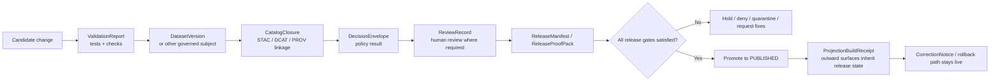

<!-- [KFM_META_BLOCK_V2]
doc_id: kfm://doc/<uuid-NEEDS-VERIFICATION>
title: Release Readiness
type: standard
version: v1
status: draft
owners: @team/metablock [user-provided; NEEDS VERIFICATION]
created: YYYY-MM-DD
updated: YYYY-MM-DD
policy_label: NEEDS VERIFICATION
related: [docs/runbooks/release-readiness.md (PROPOSED target path), ReleaseManifest / ReleaseProofPack (NEEDS VERIFICATION), ReviewRecord (NEEDS VERIFICATION), CorrectionNotice (NEEDS VERIFICATION)]
tags: [kfm, release, readiness, promotion, rollback, verification]
notes: [Converted from a user-supplied badge row into a repo-ready draft; badge values are treated as provided inputs, not independently reverified mounted repo state.]
[/KFM_META_BLOCK_V2] -->

# Release Readiness

Govern the decision to promote a reviewed candidate into a public-safe KFM release, with explicit proof objects, fail-closed gates, and visible rollback or correction posture.

<a id="status"></a>

> [!IMPORTANT]
> This draft turns the supplied badge row into a reviewable runbook-style document. The badge values for owners, license, receipt, and gate colors are **user-provided inputs**. In the current session, the mounted workspace evidence is PDF-heavy and does **not** directly verify repo paths, workflow YAML, tests, manifests, dashboards, or runtime traces.

| Field | Current draft value |
|---|---|
| Doc status | **draft** |
| Runtime/readiness signal | **NEEDS VERIFICATION** — the supplied badge says `CONFIRMED`, but the repo-doc brief expects a doc-status vocabulary such as `experimental`, `active`, `stable`, or `deprecated`. |
| Owners | `@team/metablock` *(user-provided; repo verification pending)* |
| Target path | `docs/runbooks/release-readiness.md` *(PROPOSED target path from this session)* |
| Last-run receipt | `9f3a1c7` *(user-provided; proof-pack linkage not reverified in mounted repo)* |
| License marker | `Apache-2.0` *(user-provided; repo verification pending)* |

<!-- MetaBlock v2: Portable Badge Row -->
<p align="left">
  <!-- Status -->
  <a href="#status"></a>

  <!-- Gates A–G -->
  <a href="#gate-a"></a>
  <a href="#gate-b"></a>
  <a href="#gate-c"></a>
  <a href="#gate-d"></a>
  <a href="#gate-e"></a>
  <a href="#gate-f"></a>
  <a href="#gate-g"></a>

  <!-- License -->
  <a href="LICENSE"></a>

  <!-- Last‑run receipt -->
  <a href="#automation"></a>

  <!-- Owners -->
  <a href="#owners"></a>
</p>

**Quick jumps:** [Scope](#scope) · [Repo fit](#repo-fit) · [Inputs](#accepted-inputs) · [Exclusions](#exclusions) · [Gate matrix](#gate-matrix) · [Automation](#automation) · [FAQ](#faq) · [Appendix](#appendix)

## Scope

This file defines the **release-readiness decision surface** for KFM. It does not treat release as a cosmetic label or a successful build alone. In KFM doctrine, promotion is a governed state change backed by typed proof artifacts; outward-facing surfaces reconstruct released scope through governed APIs, evidence resolution, policy state, freshness state, and surface state. If those ingredients are missing, the correct outcome is a visible negative state rather than a best-effort bluff.

This runbook is therefore about three things:

1. deciding whether a candidate is ready to move toward `PUBLISHED`,
2. identifying the minimum proof objects that make that decision reviewable, and
3. preserving rollback, withdrawal, supersession, and correction paths as first-class release behavior.

[Back to top](#release-readiness)

## Repo fit

**Path**

`docs/runbooks/release-readiness.md` *(PROPOSED target path; current-session repo tree not directly mounted for verification)*

**Upstream inputs**

- [Required evidence pack](#required-evidence-pack)
- [Gate matrix](#gate-matrix)
- **TODO — replace with verified repo-local links** to the mounted `ReleaseManifest`, `ReleaseProofPack`, `ReviewRecord`, `DecisionEnvelope`, contract schemas, and CI workflow docs.

**Downstream consequences**

- [Rollback and correction](#rollback-and-correction)
- [FAQ](#faq)
- **TODO — replace with verified repo-local links** to `CHANGELOG.md`, correction notices, rollback notes, release manifests, and any public-surface release documentation.

**Audience**

Maintainers, reviewers, stewards, release owners, policy operators, and any contributor proposing a behavior-significant change that could alter public interpretation, runtime trust, or outward release state.

[Back to top](#release-readiness)

## Accepted inputs

This file belongs in the review path for candidate changes that can point to **reviewable evidence units** rather than only intent statements.

| Input family | What belongs here | Minimum expectation |
|---|---|---|
| Candidate release artifacts | `DatasetVersion`, `CatalogClosure`, `ReviewRecord`, `DecisionEnvelope`, `ReleaseManifest`, `ReleaseProofPack` | The candidate can be tied to a specific release unit, not just a branch name or verbal summary. |
| Verification evidence | Schema/example validation, catalog-closure checks, policy bundle tests, stale-projection checks, runtime citation-negative tests, correction drills, docs/accessibility gate outputs | Evidence is inspectable enough to survive later review. |
| Operational readiness evidence | Rollback note, correction path, surface-state handling notes, audit linkage, observability or readiness outputs | The release can fail closed and recover visibly. |
| Documentation deltas | Updated contracts, examples, runbooks, changelog entries, release-facing docs | Behavior-significant documentation changes stay in sync with release meaning. |

**Typical evidence line styles**

```md
**Evidence:** Release manifest `release/manifests/<release-id>.json`
**Evidence:** Candidate proof pack `release/proof-pack/<date>/`
**Evidence:** Reviewed PR + schema diff + rollback note
```

[Back to top](#release-readiness)

## Exclusions

This file is **not** the place for:

- speculative roadmap items,
- doctrine-only aspirations with no reviewable release unit,
- raw CI success with no promotion evidence,
- direct runtime or public-trust claims that cannot reconstruct their evidence path,
- silent overrides of rights, sensitivity, correction, or rollback posture,
- generic deployment checklists that do not change release trust state.

> [!CAUTION]
> A correct build does **not** automatically justify promotion. Delivery, deployment, and promotion are distinct actions in KFM and must not be flattened into one stage.

[Back to top](#release-readiness)

## Working definitions

| Label | Use in this file |
|---|---|
| **CONFIRMED** | Directly supported by the attached KFM corpus or by the user-supplied badge row. |
| **INFERRED** | Strongly implied by the corpus, but not directly enumerated as mounted repo implementation. |
| **PROPOSED** | Recommended build or documentation shape that fits doctrine, but is not proven as live repo reality in this session. |
| **UNKNOWN** | Not verified strongly enough from the currently visible workspace evidence. |
| **NEEDS VERIFICATION** | Reviewer action required before treating the point as settled repo truth. |

## Release-readiness model

KFM treats release readiness as a **trust transition**, not a file move. The candidate should be able to answer four questions before promotion:

1. **What exactly is being released?**
2. **What proof objects make that release reviewable?**
3. **What public or runtime surfaces will inherit the release state?**
4. **What happens if the release must be denied, held, corrected, generalized, superseded, withdrawn, or rolled back?**

### Minimal release flow



[Back to top](#release-readiness)

## Gate matrix

<a id="gate-a"></a>
<a id="gate-b"></a>
<a id="gate-c"></a>
<a id="gate-d"></a>
<a id="gate-e"></a>
<a id="gate-f"></a>
<a id="gate-g"></a>

| Gate | Focus | Badge-row signal *(user-provided)* | Ready when | Fail-closed if missing |
|---|---|---|---|---|
| **Gate A — Docs** | Behavior-significant documentation stays aligned with release meaning | Green | Contracts, examples, runbooks, docs/accessibility deltas, and any release-facing explanations agree with the candidate release unit. | Hold promotion until docs and examples reflect actual release meaning. |
| **Gate B — Tests** | Verification evidence is present and reviewable | Green | Relevant schema/example validation, catalog-closure checks, policy tests, stale or citation-negative tests, and correction drills are attached or referenced. | Deny readiness if proof remains rhetorical. |
| **Gate C — CI** | Build-and-check proof exists, but is not mistaken for promotion by itself | Green | CI proves the candidate artifact can be built and checked and the resulting evidence is linkable from the release unit. | No release claim based on build success alone. |
| **Gate D — Security** | Rights, sensitivity, least privilege, and release-integrity posture are explicit | Amber | Rights/sensitivity decisions, signature or attestation posture where required, audit linkage, and trust-boundary consequences are visible. | Hold or deny when policy, provenance, or exposure posture is unresolved. |
| **Gate E — Performance** | Movement-first budgets and freshness posture are understood | Green | Release notes or proof artifacts name the relevant locality, freshness, bounded fan-out, latency, memory, or rebuildability consequences. | Withhold release if performance claims cannot be tied to evidence or if freshness semantics are absent. |
| **Gate F — SLOs** | Readiness, observability, and recovery posture are explicit enough to explain failure | Green | Logs, metrics, traces, audit refs, readiness signals, and rollback notes can explain what the released change would do under failure. | Treat the candidate as not release-ready if it cannot explain itself operationally. |
| **Gate G — Rollout** | Promotion, rollback, supersession, and correction are visibly planned | Red | `ReleaseManifest` or `ReleaseProofPack` names rollout scope, review state, checksums, rollback posture, and correction path. | Do not promote if rollout remains implied or correction lineage would be invisible. |

> [!NOTE]
> The green/amber/red gate coloring above is preserved from the supplied badge row. It is **not** independently reverified current repo state.

[Back to top](#release-readiness)

## Required evidence pack

The current corpus converges on a compact set of proof-object families that make release decisions reviewable.

| Proof object | Why it exists | Minimum anchors that should be visible in release readiness |
|---|---|---|
| `ValidationReport` | Proves what checks passed, failed, or quarantined | check list, severity, reason codes, subject refs |
| `DatasetVersion` | Carries the authoritative candidate or promoted subject set | stable ID, version ID, support semantics, time semantics, provenance links |
| `CatalogClosure` | Shows outward metadata closure and release linkage | STAC/DCAT/PROV refs, identifiers, outward profile refs, release linkage |
| `DecisionEnvelope` | Makes policy results machine-readable | subject, action, result, reason codes, obligation codes, policy basis, audit ref |
| `ReviewRecord` | Captures the approval, denial, escalation, or note | reviewer role, decision, timestamp, refs, comments |
| `ReleaseManifest` / `ReleaseProofPack` | Assembles the public-safe release and its proof | version refs, catalog refs, decision refs, docs/accessibility gate, rollback/correction posture, bundle plan |
| `ProjectionBuildReceipt` | Proves a derived surface was built from known release scope | release ref, projection type, surface class, build time, freshness basis, stale-after policy |
| `CorrectionNotice` | Preserves visible lineage under change | affected releases, replacement releases, affected surfaces, rebuild refs, cause, public note |

### Minimum release gate reminder

A candidate should not be marked release-ready without all applicable items below:

- dataset version reference,
- catalog closure,
- review record where required,
- release receipt or proof pack,
- evidence-resolution pass or sample proof,
- rollback note,
- updated contract, example, and runbook delta where behavior changed.

[Back to top](#release-readiness)

## Quickstart

1. **Identify the reviewable release unit.** Prefer the smallest unit a later reviewer can verify: release manifest, proof pack, reviewed PR, correction notice, or dataset promotion artifact.
2. **Assemble the evidence pack.** Gather the applicable proof objects from the table above.
3. **Check gate coverage.** Use the [Gate matrix](#gate-matrix) rather than relying on green CI alone.
4. **Name public consequences.** State which surfaces, exports, or trust-visible behaviors would inherit the release state.
5. **Name the negative path.** Record what should happen if the candidate is held, denied, generalized, corrected, or rolled back.
6. **Only then mark ready.** If any required proof object is missing, leave the candidate in a non-promoted state.

### Illustrative reviewer command checklist

```text
[ ] Release unit is explicit and reviewable
[ ] Evidence pack is linked
[ ] Docs/examples/runbooks are aligned
[ ] Policy decision and review state are visible
[ ] Rollback / correction posture is named
[ ] Public-surface consequences are understood
[ ] Unknowns are called out, not smoothed away
```

[Back to top](#release-readiness)

## Usage guidance

### 1. Use this file during candidate review

A release review should cite this runbook when a candidate affects:

- public interpretation,
- policy or rights handling,
- runtime answer behavior,
- release or correction lineage,
- derived projections or outward exports,
- rollback or withdrawal posture.

### 2. Keep release meaning small and reviewable

KFM favors the **smallest-real-thing** that proves doctrine on real evidence. A release-readiness decision should therefore be framed around the smallest unit that carries public or operator consequence, not an amorphous bundle of “everything that changed this week.”

### 3. Preserve negative outcomes as valid outcomes

`hold`, `deny`, `abstain`, `stale-visible`, `generalized`, `withdrawn`, and `superseded` are not embarrassing edge cases. They are part of the release contract and should appear in notes, runbooks, and public-surface handling when they apply.

[Back to top](#release-readiness)

## Automation

<a id="automation"></a>

**CONFIRMED doctrine:** release readiness should be supported by typed artifacts and proof objects.

**UNKNOWN mounted implementation:** the current session did not expose the repo’s actual workflow YAML, emitted proof packs, CI jobs, or release-manifest paths.

**PROPOSED working rule for this doc:** automation should only elevate a candidate to “ready for review” when it can point to the required proof objects, and should never imply that build success alone equals promotion.

### Minimal automation contract for this doc

```yaml
release_readiness:
  release_unit: NEEDS_VERIFICATION
  required_artifacts:
    - ValidationReport
    - DatasetVersion
    - CatalogClosure
    - DecisionEnvelope
    - ReviewRecord
    - ReleaseManifest_or_ReleaseProofPack
    - rollback_note
  deny_if_missing:
    - policy_decision
    - release_linkage
    - correction_path_for_public_change
    - docs_delta_for_behavior_change
```

[Back to top](#release-readiness)

## Rollback and correction

A release-ready candidate is not finished unless it has a **visible recovery path**.

| Situation | Expected response |
|---|---|
| Post-release error | Publish a visible correction or rollback path; do not leave the old public meaning to linger invisibly. |
| Rights or sensitivity issue discovered late | Generalize, withdraw, or hold the affected surface, and record the change through correction lineage. |
| Staleness or projection drift | Mark stale-visible or rebuild, rather than quietly serving out-of-scope derivatives. |
| Conflicting evidence on a consequential claim | Escalate to corroboration review; do not let runtime synthesis settle it silently. |

> [!WARNING]
> Correction preserves lineage; it does not erase prior public state without trace.

[Back to top](#release-readiness)

## Definition of done

A candidate is ready to leave this runbook with a **yes** only when:

- the release unit is explicit,
- required proof objects are attached or linkable,
- behavior-significant docs are synchronized,
- policy and review state are visible,
- rollback or correction posture is named,
- public-surface consequences are understood,
- remaining uncertainty is marked as `UNKNOWN` or `NEEDS VERIFICATION`, not hidden.

## FAQ

<a id="faq"></a>

### Does a green CI run make a release ready?

No. CI proves the artifact can be built and checked. Promotion changes trust state and public consequence, so it needs release evidence, review state, and rollback posture.

### Can a doctrine manual by itself prove a release happened?

No. Doctrine can define expectations, but release history and release readiness need a reviewable release unit such as a manifest, proof pack, PR, correction notice, or equivalent artifact.

### What if the exact repo paths are not visible in the current session?

Keep the doctrinal requirements, mark the repo-local paths as `NEEDS VERIFICATION`, and replace placeholders only after the mounted workspace confirms them.

### Should a correction overwrite the old release note?

No. Append a correction entry or correction notice that preserves lineage.

[Back to top](#release-readiness)

## Owners

<a id="owners"></a>

| Owner marker | Current draft reading |
|---|---|
| Badge row owner | `@team/metablock` |
| Verification state | **NEEDS VERIFICATION** — current-session repo ownership files were not directly visible |
| Review expectation | Replace this table with verified ownership metadata once the mounted repo exposes CODEOWNERS, docs ownership markers, or equivalent governance files |

[Back to top](#release-readiness)

## Appendix

<a id="appendix"></a>

<details>
<summary><strong>Appendix A — why release readiness matters to KFM trust surfaces</strong></summary>

KFM’s public and steward-facing surfaces are trust-visible by design. Map, timeline, dossier, story, Evidence Drawer, export, Focus, and review surfaces are supposed to expose provenance, freshness, review state, and policy context at the point of use. That is why release readiness is not a backend-only concern: a weak release decision leaks immediately into outward interpretation.

</details>

<details>
<summary><strong>Appendix B — release-readiness anti-patterns</strong></summary>

Avoid these patterns:

- treating deployment as publication,
- relying on build green lights with no proof pack,
- silently updating public meaning after a release,
- omitting docs/runbook deltas for behavior-significant changes,
- hiding unresolved rights or sensitivity questions inside “later cleanup,”
- calling a candidate “ready” when its rollback path is still undefined.

</details>

<details>
<summary><strong>Appendix C — placeholder replacement checklist once the repo is mounted</strong></summary>

Replace the following before commit:

- `<uuid-NEEDS-VERIFICATION>` in the meta block,
- `YYYY-MM-DD` created/updated values,
- exact upstream and downstream repo-local links,
- verified owner source,
- verified license source,
- verified receipt/proof-pack linkage,
- any gate state that should be sourced from actual repo evidence instead of the supplied badge row.

</details>
