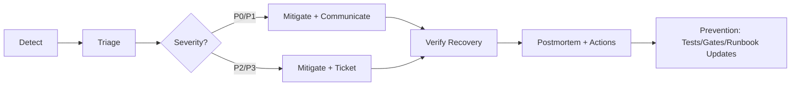

# Reliability Runbooks (KFM)


> **Intent:** Keep Kansas Frontier Matrix (KFM) reliable **without** violating governance, provenance, or policy boundaries.  
> Reliability incidents are treated as **governed events**: we fix the cause, preserve evidence, and prevent recurrence.

---

## 📘 Overview

### Purpose
This folder is the entry point for KFM reliability operations:
- **Incident response** for runtime and pipeline failures
- **SLO/SLI thinking** for freshness, latency, and correctness
- **Trigger + retry** decisions (avoiding retry storms, non-idempotent actions, and silent staleness)
- **Runbook patterns** aligned with KFM’s “rebuildable + reproducible + signed” posture

### Scope

| In scope ✅ | Out of scope ❌ |
|---|---|
| Runbooks for outages, degradations, data staleness, and pipeline failures | Feature design proposals (see `docs/specs/` / architecture docs) |
| Reliability guardrails for triggers, retries, and promotions | Security incident response (see `docs/runbooks/security/` if present) |
| Observability expectations: what to log/measure and what IDs to capture | One-off “hotfix edits” to downstream stores that bypass catalogs (discouraged) |

### Audience
- Primary: ops / platform / pipeline owners
- Secondary: backend, UI, governance reviewers who need “what happened + evidence trail”

### Definitions (quick)
- **SLI**: Service Level Indicator (a measured metric)
- **SLO**: Service Level Objective (target for an SLI over a window)
- **Run receipt**: machine-verifiable record of a pipeline run (run_id + inputs + checksums + outputs + policy bundle version)
- **Promotion**: moving artifacts from raw/work → processed/served (always gated)

---

## 🗂️ Directory Layout

### Tree
```text
docs/runbooks/reliability/
├── README.md                         # (this file) index + standards
├── trigger-retry-matrix.md           # decision matrix: retries/backoff/idempotency
└── trigger-mechanisms/
    └── README.md                     # choosing cron vs event vs PR-first vs watchers
```

### Index (start here)

| Document | When to use | Link |
|---|---|---|
| Trigger & Retry Decision Matrix | You’re deciding **whether/how** to retry or backoff (and how to avoid storms) | [trigger-retry-matrix.md](./trigger-retry-matrix.md) |
| Trigger Mechanisms Guide | You’re deciding **how** a pipeline should trigger (cron/event/webhook/PR-first) | [trigger-mechanisms/README.md](./trigger-mechanisms/README.md) |

> 🧭 **Related (outside this folder):**  
> - Pipeline orchestration guidance: `docs/runbooks/data-pipelines/`  
> - Observability components: `ops/observability/`  
> - Policy / governance rules: `docs/security/` and `docs/standards/`

---

## 🚨 If You’re In An Incident (first 10 minutes)

1. **Protect governance first**
   - If the incident involves potential sensitive exposure, treat as **P0** and restrict blast radius.
   - Prefer **rollback-first** and **fail-closed** behavior over “temporary allow”.

2. **Identify the failure surface**
   - Is it: **API**, **pipeline**, **policy gate**, **catalog/provenance**, **index/search/graph**, or **UI/Focus Mode**?

3. **Capture identifiers immediately** (before logs rotate)
   - `correlation_id` / request ID
   - `run_id` (pipeline run)
   - `dataset_id` + `dataset_version_id`
   - `policy_bundle_version`
   - `commit_sha` / image tag (if applicable)

4. **Assess impact**
   - Who is affected? Which datasets or endpoints?
   - Is this a **freshness breach** (silent staleness) or an obvious outage?

5. **Mitigate**
   - Stop the bleed (disable triggers, pause promotions, trip kill-switch if available)
   - Apply the least invasive change consistent with governance

6. **Verify recovery**
   - Confirm SLI improvement and ensure no policy boundaries were bypassed

7. **Communicate + document**
   - Record the timeline and evidence bundle pointers (audit refs, run receipts)

8. **Open postmortem**
   - Even for fast recovery, create an action list and assign owners

---

## 🔒 Reliability Principles That Are Non-Negotiable

### 1) Trust membrane stays intact
- External clients and the frontend do **not** access databases directly.
- Operational access uses approved channels and must be logged/audited.

### 2) Evidence-first operations
- Any mitigation that changes data or outputs must remain **reproducible** and traceable to inputs and run receipts.
- Prefer “fix upstream + rebuild” over “manual downstream edits”.

### 3) Fail-closed gates
- Unknown/uncertain should not become “allowed” under incident pressure.
- Promotions should block on missing provenance, missing receipts, or failed policy checks.

---

## 🧾 What Every Reliability Runbook Must Capture

### Required identifiers (minimum)
| Field | Why it matters |
|---|---|
| `incident_id` | stable handle for postmortem + links |
| `severity` | determines escalation + comms |
| `start_time` / `end_time` | timeline + MTTR |
| `correlation_ids[]` | tie symptoms to traces/logs |
| `run_ids[]` | tie symptoms to pipeline runs |
| `dataset_ids[]` + `dataset_version_ids[]` | tie symptoms to governed artifacts |
| `policy_bundle_version` | confirm which rules were enforced |
| `mitigation_summary` | what changed and why |
| `verification_steps` | how “fixed” was validated |

### Minimal incident note template
```yaml
incident:
  incident_id: "INC-YYYYMMDD-###"
  severity: "P0|P1|P2|P3"
  started_at: "YYYY-MM-DDTHH:MM:SSZ"
  detected_by: "alert|user_report|manual"
  summary: "One sentence: impact + surface"

evidence:
  correlation_ids: ["..."]
  run_ids: ["..."]
  dataset_ids: ["..."]
  dataset_version_ids: ["..."]
  policy_bundle_version: "..."
  artifacts:
    - type: "run_receipt"
      ref: "..."
    - type: "audit_log"
      ref: "..."
```

---

## 📈 Observability Expectations (Reliability Signals)

Reliability depends on being able to answer, quickly and reproducibly:
- **What changed?**
- **What ran?**
- **What artifacts were produced?**
- **Which gate blocked promotion (and why)?**
- **What is the blast radius?**

### Signals to instrument (baseline)
- Pipeline runs: success/fail, duration, rows/bytes processed, retry counts
- Freshness: “time since last successful promotion” per dataset family
- Quality drift: schema errors, geometry invalid counts, null-rate shifts, out-of-bounds checks
- API health: request rate, error rate, latency (p50/p95/p99), policy-deny rate
- Storage/index health: queue depth, index lag, storage capacity/latency (where applicable)

> If a system component cannot surface these signals, create a reliability ticket to add them before scaling usage.

---

## 🧭 SLO Starting Points (seed defaults)

> These are placeholders until KFM’s formal SLO registry exists. Keep them conservative and revise with measured baselines.

| Area | Example SLI | Example SLO target | Notes |
|---|---|---|---|
| Dataset freshness | “time since last successful promotion” | dataset-specific (e.g., ≤ 24h for daily feeds) | Each dataset family must define its cadence |
| Pipeline success | % runs succeeding (window) | ≥ 99% / 30d | Exclude planned maintenance windows |
| API availability | successful responses / total | ≥ 99.9% / 30d | Excluding policy-denies (tracked separately) |
| Search/index lag | time from promotion → searchable | ≤ 15m (target) | Depends on index design |
| Policy gate health | % expected allow/deny decisions stable | “no silent bypass” | Any bypass is a P0 |

---

## 🧑‍✈️ Incident Lifecycle



### Severity guidance (suggested)
| Sev | User impact | Response | Notes |
|---|---|---|---|
| P0 | safety/governance risk, widespread outage, sensitive exposure | immediate escalation | treat as governed incident |
| P1 | major degradation, key datasets stale | urgent response | mitigate same day |
| P2 | partial degradation, limited blast radius | business-hours | fix within sprint |
| P3 | nuisance, cosmetic, low impact | backlog | address when convenient |

*(Escalation contacts and on-call rotations: **TBD (not confirmed in repo)**.)*

---

## 🧱 Runbook Pattern For Governed Pipelines

KFM pipelines should be repairable by re-running a deterministic process:
1) snapshot raw inputs (with checksums)  
2) transform deterministically  
3) emit delivery formats  
4) emit catalogs + lineage  
5) validate + sign  
6) promote via PR with rollback tag

This pattern is intentionally “boring”: it makes recovery and rebuilds possible.

---

## ✍️ How To Add A New Reliability Runbook

<details>
<summary><strong>Runbook template (copy/paste)</strong></summary>

```markdown
---
title: "RUNBOOK: <short name>"
path: "docs/runbooks/reliability/<...>.md"
doc_kind: "runbook"
status: "draft|active|deprecated"
last_updated: "YYYY-MM-DD"
doc_uuid: "<uuid>"
severity_scope: ["P0","P1","P2","P3"]
---

# RUNBOOK: <short name>

## Purpose
## Scope
## Symptoms
## Preconditions / Safety
## Required Evidence (IDs + logs + receipts)
## Triage Steps
## Mitigation Steps
## Verification Steps
## Rollback
## Post-incident Actions
## References
```

</details>

### Definition of Done (DoD) for a reliability runbook
- [ ] YAML front-matter present and valid (fields filled, no missing keys)
- [ ] Clear “Symptoms” section with **observable** indicators
- [ ] “Required Evidence” lists IDs (correlation/run/dataset/version/policy bundle)
- [ ] Step-by-step triage + mitigation + verification
- [ ] Rollback strategy documented (or explicitly “not possible” with rationale)
- [ ] Links are relative and link-check clean
- [ ] No instructions that bypass policy, provenance, or the trust membrane
- [ ] Reviewed by at least one maintainer + (if sensitive) governance reviewer

---

## ⚖️ Governance Review Triggers (Reliability)

Escalate for governance review when a runbook:
- references sensitive locations, restricted sources, or protected communities
- recommends policy exceptions, temporary allows, or bypasses
- changes how evidence/citations are generated or resolved
- changes retention, deletion, or provenance storage

---

## 🔗 Related Docs (recommended jumping-off points)

- Trigger mechanism selection: [trigger-mechanisms/README.md](./trigger-mechanisms/README.md)
- Retry policy decision support: [trigger-retry-matrix.md](./trigger-retry-matrix.md)
- Observability stack (if present): `../../../ops/observability/`
- Standards / doc enforcement (if present): `../../standards/`
- Supply chain + provenance controls (if present): `../../security/supply-chain/`

---

## References
- Prefer internal docs and governed specs first.
- If you must link external resources, keep them minimal and justify relevance.
