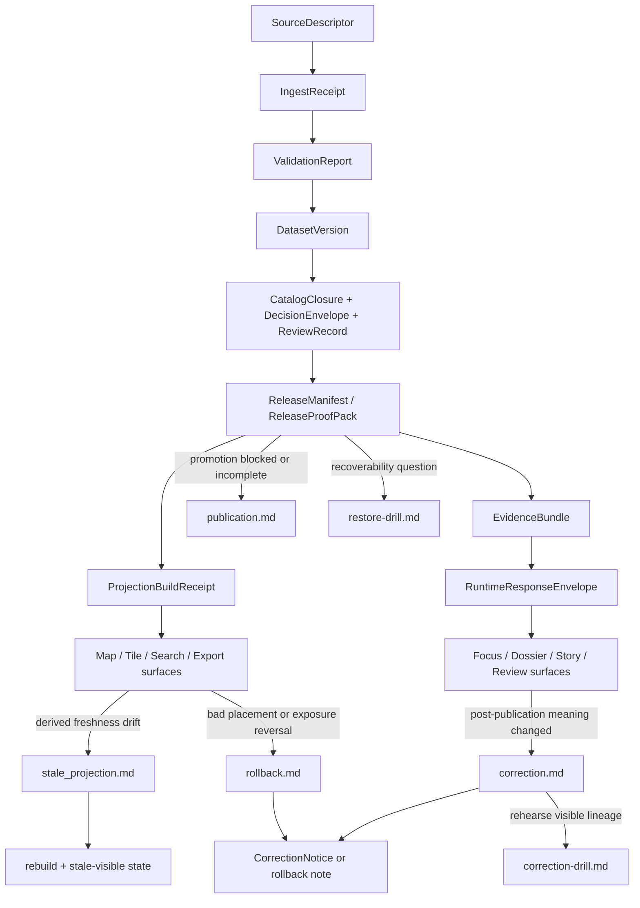

<!-- [KFM_META_BLOCK_V2]
doc_id: kfm://doc/<NEEDS-VERIFICATION-UUID>
title: Reliability Runbooks
type: standard
version: v1
status: draft
owners: <NEEDS VERIFICATION>
created: <NEEDS VERIFICATION>
updated: <NEEDS VERIFICATION>
policy_label: <NEEDS VERIFICATION>
related: [<NEEDS VERIFICATION: docs/runbooks/publication.md>, <NEEDS VERIFICATION: docs/runbooks/correction.md>, <NEEDS VERIFICATION: docs/runbooks/stale_projection.md>, <NEEDS VERIFICATION: docs/runbooks/rollback.md>, <NEEDS VERIFICATION: runbooks/restore-drill.md>, <NEEDS VERIFICATION: runbooks/correction-drill.md>]
tags: [kfm, reliability, runbooks]
notes: [Source-bounded draft; current session exposed attached PDFs and repo-grounded audit artifacts but not a mounted live repo tree; owners, dates, identifiers, and exact adjacent paths require verification.]
[/KFM_META_BLOCK_V2] -->

# Reliability Runbooks

> Trust-preserving operational guidance for rollback, correction, stale-state handling, restore drills, and release-proof continuity in Kansas Frontier Matrix (KFM).

| Status | Owners | Target path | Evidence posture |
| --- | --- | --- | --- |
| **experimental** | **`<NEEDS VERIFICATION>`** | `docs/runbooks/reliability/README.md` *(INFERRED target path)* | Source-bounded draft grounded in attached KFM doctrine and repo-grounded audit artifacts |


**Quick jump:** [Scope](#scope) · [Repo fit](#repo-fit) · [Inputs](#inputs) · [Exclusions](#exclusions) · [Directory tree](#directory-tree) · [Quickstart](#quickstart) · [Usage](#usage) · [Diagram](#diagram) · [Runbook registry](#runbook-registry) · [Task list](#task-list) · [FAQ](#faq) · [Appendix](#appendix)

> [!IMPORTANT]
> In KFM, **reliability is not only uptime**. It includes fail-closed behavior, release-proof continuity, correction visibility, rollback lineage, stale-projection handling, restore rehearsal, and trust-visible negative outcomes.

---

## Scope

This directory is the operator-facing index for reliability work that touches governed publication, derived freshness, correction lineage, rollback, restore rehearsal, or runtime trust continuity.

It does **not** redefine KFM doctrine. It routes that doctrine into operator-readable runbooks, drills, and completion checks.

### Reliability in KFM

A KFM surface can be online and still be unreliable.

Examples of reliability failure in this repo context include:

- a public map that still renders a withdrawn or corrected release as if it were current
- a derived tile or search layer that lost release linkage or stale visibility
- a runtime answer that returns fluent prose instead of `ABSTAIN`, `DENY`, or `ERROR`
- a rollback with no visible lineage trail
- a restore path that was never rehearsed

### Status legend used in this README

| Label | Meaning here |
| --- | --- |
| **CONFIRMED** | Explicitly established in the attached KFM doctrine corpus or the repo-grounded audit artifact |
| **INFERRED** | Conservative structural completion needed to make this directory usable without claiming mounted implementation |
| **PROPOSED** | Recommended child runbook, placement, or workflow shape that fits doctrine but was not directly verified in a live repo tree |
| **UNKNOWN** | Not directly verifiable in this session |
| **NEEDS VERIFICATION** | Review item maintainers should confirm against the live repository before commit |

<details>
<summary><strong>Draft source basis used in this edition</strong></summary>

| Source basis used for this draft | Why it matters here |
| --- | --- |
| March 2026 KFM canonical master reference material | Contract families, runtime outcomes, verification families, proposed runbook artifact set, truth posture |
| March 2026 replacement-grade blueprint/manual | Five-plane model, phase acceptance, release/proof evidence, hydrology-first slice, sample artifact skeletons |
| March 2026 unified geospatial architecture manual | Rollback vs correction distinction, visible stale/superseded/withdrawn states, release evidence minimum |
| Ollama / Ubuntu phase-one runtime guide | Local runtime boundaries, restore-drill and correction-drill naming cues |
| Repo-grounded deep research sprint artifact | Repo-adjacent documentation surfaces and still-missing validator / CI / drill evidence |

</details>

[Back to top](#reliability-runbooks)

---

## Repo fit

### Path, upstream, and downstream relationships

| Item | Role in the repo | Status |
| --- | --- | --- |
| `docs/runbooks/reliability/README.md` | This directory index and routing guide | **INFERRED** |
| [`../publication.md`](../publication.md) | Publication / release runbook | **PROPOSED** |
| [`../correction.md`](../correction.md) | Correction / supersession / withdrawal runbook | **PROPOSED** |
| [`../stale_projection.md`](../stale_projection.md) | Derived freshness and rebuild runbook | **PROPOSED** |
| [`../rollback.md`](../rollback.md) | Rollback / exposure-reversal runbook | **PROPOSED** |
| `../../../runbooks/restore-drill.md` | Restore rehearsal entrypoint | **PROPOSED · NEEDS VERIFICATION** |
| `../../../runbooks/correction-drill.md` | Correction rehearsal entrypoint | **PROPOSED · NEEDS VERIFICATION** |
| `../../../contracts/README.md` | Contract surface reference for proof objects and schema families | **CONFIRMED in repo-grounded audit artifact · NEEDS VERIFICATION in live tree** |
| `../../../schemas/README.md` | Schema surface reference for valid / invalid examples and machine checks | **CONFIRMED in repo-grounded audit artifact · NEEDS VERIFICATION in live tree** |
| `../../../policy/README.md` | Policy vocabulary and deny-by-default posture | **CONFIRMED in repo-grounded audit artifact · NEEDS VERIFICATION in live tree** |
| `../../../tests/README.md` | Test-intent surface for drills, negative-path checks, and runtime proof | **CONFIRMED in repo-grounded audit artifact · NEEDS VERIFICATION in live tree** |
| `../../../.github/workflows/README.md` | Workflow intent surface for merge gates and promotion/reliability automation | **CONFIRMED in repo-grounded audit artifact · NEEDS VERIFICATION in live tree** |

### Repo-fit summary

This README sits between:

- **upstream doctrine and contracts**: proof objects, route families, policy/result grammar, release evidence
- **downstream execution**: tests, workflow gates, stale-state visuals, correction/restore drills, and public trust surfaces

> [!NOTE]
> The current session exposed attached PDFs and repo-grounded audit artifacts, but **not** a mounted live repo tree. Path-level and adjacency claims therefore remain explicitly reviewable instead of being presented as settled repository fact.

[Back to top](#reliability-runbooks)

---

## Inputs

The following belong here, or should be linked from here, when a reliability event is classified, handled, rehearsed, or reviewed.

| Input | Why it belongs here |
| --- | --- |
| `ReleaseManifest` / `ReleaseProofPack` | Reliability in KFM starts from a release-scoped proof object, not an unscoped symptom |
| `CatalogClosure` | Reliability events often turn on what was outwardly admissible and discoverable |
| `DecisionEnvelope` | Policy result, obligations, and `audit_ref` must stay machine-readable |
| `ReviewRecord` | Promotion, denial, escalation, correction, and rollback remain review-bearing transitions |
| `CorrectionNotice` | Post-publication meaning change must remain visible rather than silently overwritten |
| `ProjectionBuildReceipt` | Derived tiles, search, graph, vector, style, or export layers must prove release linkage and freshness basis |
| `EvidenceBundle` | Consequential runtime and surface claims must remain one hop away from inspectable support |
| `RuntimeResponseEnvelope` samples | Finite runtime outcomes and audit linkage are part of reliability, not an afterthought |
| validation output / invalid fixtures | Reliability gates are only real when negative paths are exercised |
| surface-state screenshots | Trust-visible states such as stale, withdrawn, denied, or generalized need visual proof |
| restore-drill / correction-drill records | Recovery confidence and correction discipline must be rehearsed, not merely described |

### Release evidence minimum

Where release evidence is assembled, the minimum reliability packet should join:

- release manifest
- catalog-closure references
- decision / review references
- validation reports
- projection build receipts where applicable
- docs / accessibility gate result
- rollback / correction posture
- signature / attestation references where adopted

---

## Exclusions

This directory should **not** become a generic operations catch-all.

| Does **not** belong here | Put it here instead |
| --- | --- |
| Canonical schema definitions | `contracts/` and `schemas/` |
| Policy bundles, reason codes, obligation codes, sensitivity classes | `policy/` |
| Source admission packets and descriptor authoring guidance | source-onboarding / descriptor documentation |
| General deployment bring-up or host bootstrap | runtime / phase-one bring-up documentation |
| UI doctrine for Map Explorer, Evidence Drawer, Focus Mode, or shell choreography | UI / shell doctrine docs |
| Feature-specific ADRs and implementation decisions | architecture / ADR directories |
| Generic uptime-only SRE material detached from release state, evidence, or correction | separate operations documentation, if present |

### Exclusion rule

If a document does not help answer **“what do we do when release-backed trust is at risk?”**, it probably does not belong in this directory.

[Back to top](#reliability-runbooks)

---

## Directory tree

The doctrine clearly names several reliability-adjacent runbooks, but their final placement was **not** directly verifiable in a mounted repo tree. The tree below is therefore a **reviewable normalization**, not a hidden fact claim.

```text
docs/
└── runbooks/
    ├── publication.md              # PROPOSED doctrine-named sibling
    ├── correction.md               # PROPOSED doctrine-named sibling
    ├── stale_projection.md         # PROPOSED doctrine-named sibling
    ├── rollback.md                 # PROPOSED doctrine-named sibling
    └── reliability/
        └── README.md               # this file (INFERRED target path)

runbooks/                           # NEEDS VERIFICATION: exact parent may differ
├── restore-drill.md               # PROPOSED drill entrypoint
└── correction-drill.md            # PROPOSED drill entrypoint

# Adjacent documentation surfaces reported by repo-grounded audit artifact
contracts/
schemas/
policy/
tests/
.github/workflows/
```

### Why this shape

- doctrine and blueprint material explicitly call out publication, correction, stale-projection, and rollback as runbook-worthy reliability surfaces
- the same corpus also pushes restore and correction drills as explicit rehearsal artifacts
- the repo-grounded audit artifact reports adjacent documentation surfaces for contracts, schemas, policy, tests, and workflow intent, but does **not** prove the live tree in this session

---

## Quickstart

Use this README when a trust-bearing release or runtime surface becomes questionable.

1. **Classify the event**
   - publication gate failure
   - rollback candidate
   - correction / supersession / withdrawal
   - stale derived layer
   - restore or rehearsal
2. **Pin the scope**
   - `release_id`
   - `dataset_version_id`
   - `audit_ref`
   - affected surfaces
3. **Collect proof objects**
   - at minimum: `ReleaseManifest` or `ReleaseProofPack`
   - plus the most relevant supporting objects for the event
4. **Choose the primary runbook**
   - publication
   - rollback
   - correction
   - stale projection
   - restore drill
   - correction drill
5. **Fail closed first**
   - do not silently degrade into uncited, stale-normal, or correction-hidden behavior
6. **Publish visible state**
   - stale-visible
   - generalized
   - withdrawn
   - denied
   - abstained
7. **Record validation and follow-up**
   - tests run
   - artifacts updated
   - screenshots captured
   - next owner assigned

### Minimal reliability packet

```text
incident/
└── YYYY-MM-DD-<slug>/
    ├── classification.md
    ├── scope.txt
    ├── release_refs.txt
    ├── proof/
    │   ├── manifest-or-proofpack/
    │   ├── decision-review/
    │   └── correction-or-rollback/
    ├── screenshots/
    ├── notes.md
    └── follow-up-checks.md
```

[Back to top](#reliability-runbooks)

---

## Usage

### Use this directory for a live reliability event

When the issue already affects meaning, visibility, freshness, release integrity, or recovery confidence:

1. start from the nearest release-backed object, not from a UI symptom alone
2. determine whether the problem is **semantic**, **delivery/freshness**, **runtime**, or **recoverability**
3. select one primary runbook owner
4. attach proof objects before changing public meaning
5. leave a visible lineage trail

### Use this directory for a scheduled drill

When the goal is rehearsal rather than live remediation:

1. choose a public-safe fixture or release-safe sample
2. declare the expected negative or recovery states in advance
3. run the procedure end to end
4. record what was missing
5. convert gaps into artifacts, tests, or runbook deltas

### Rollback vs correction

| Path | Use when | Do **not** confuse it with |
| --- | --- | --- |
| **rollback** | runtime placement, exposure, or derived delivery needs to be reversed | **correction**, which changes public meaning while preserving visible lineage |
| **correction** | released meaning changed, narrowed, superseded, or withdrawn | **rollback**, which may restore prior placement but does not itself justify meaning change |
| **stale projection** | authoritative release is sound but derived tiles/search/vector/graph/export layers lag it | authoritative-truth failure |
| **publication** | promotion is incomplete, blocked, or not outwardly admissible | post-publication incident response |
| **restore drill** | continuity or recoverability is the question | semantic correction or exposure rollback |
| **correction drill** | the team needs to rehearse visible correction behavior | live correction action |

### Reliability routing rule

When the team is unsure which runbook applies, prefer this order:

1. **correction** if public meaning changed
2. **rollback** if runtime placement or exposure changed but meaning can be restored by reversal
3. **stale projection** if release truth is sound but derived delivery lags it
4. **publication** if promotion is incomplete or blocked
5. **restore drill** if continuity or recoverability is the main question
6. **correction drill** when the goal is rehearsal of visible lineage under change

[Back to top](#reliability-runbooks)

---

## Diagram


```mermaid
flowchart TD
    A[SourceDescriptor] --> B[IngestReceipt]
    B --> C[ValidationReport]
    C --> D[DatasetVersion]
    D --> E[CatalogClosure + DecisionEnvelope + ReviewRecord]
    E --> F[ReleaseManifest / ReleaseProofPack]
    F --> G[ProjectionBuildReceipt]
    F --> H[EvidenceBundle]
    H --> I[RuntimeResponseEnvelope]
    G --> J[Map / Tile / Search / Export surfaces]
    I --> K[Focus / Dossier / Story / Review surfaces]

    F -->|promotion blocked or incomplete| R[publication.md]
    J -->|derived freshness drift| S[stale_projection.md]
    J -->|bad placement or exposure reversal| T[rollback.md]
    K -->|post-publication meaning changed| U[correction.md]

    T --> V[CorrectionNotice or rollback note]
    U --> V
    S --> W[rebuild + stale-visible state]

    F -->|recoverability question| X[restore-drill.md]
    U -->|rehearse visible lineage| Y[correction-drill.md]
```

---

## Runbook registry

| Runbook / entrypoint | Primary trigger | Required proof objects | Main trust question | Status |
| --- | --- | --- | --- | --- |
| `README.md` | Need to classify or route a reliability event | event classification + release scope | Which runbook owns this issue? | **INFERRED** |
| `publication.md` | Promotion blocked, incomplete, or not outwardly admissible | `CatalogClosure`, `DecisionEnvelope`, `ReviewRecord`, `ReleaseManifest` / `ReleaseProofPack` | Is this candidate actually publishable? | **PROPOSED** |
| `rollback.md` | Deployment or exposure reversal needed | `ReleaseManifest`, relevant `ProjectionBuildReceipt` objects, rollback note, correction artifact if meaning changed | Can runtime placement be reversed without breaking lineage? | **PROPOSED** |
| `correction.md` | Released meaning changed; supersession / withdrawal / narrowing required | `CorrectionNotice`, `DecisionEnvelope`, `ReviewRecord`, affected release refs | How do we preserve lineage while changing public meaning? | **PROPOSED** |
| `stale_projection.md` | Derived tiles/search/vector/scene/export outputs lag promoted release | `ProjectionBuildReceipt`, release refs, stale basis, rebuild outcome | How do we keep stale state visible and rebuild safely? | **PROPOSED** |
| `restore-drill.md` | Recovery rehearsal or restore validation | restore evidence, validation output, post-restore trust checks | Can we recover without trust collapse? | **PROPOSED** |
| `correction-drill.md` | Scheduled rehearsal of correction behavior | sample correction packet, surface-state capture, proof-object diff | Can correction be performed visibly and repeatably? | **PROPOSED** |

### Trigger matrix

| Symptom | Preferred runbook | Immediate fail-closed action |
| --- | --- | --- |
| Candidate release missing proof-pack pieces | `publication.md` | Stop promotion; do not publish |
| Public surface changed meaning after release | `correction.md` | Mark the affected surface and preserve lineage |
| Deploy succeeded but trust state is wrong | `rollback.md` | Revert placement and assess whether a correction artifact is also required |
| Tiles/search/vector/export output older than corrected release | `stale_projection.md` | Mark stale-visible; trigger rebuild |
| Recovery path unproven or restore just occurred | `restore-drill.md` | Validate trust objects and public-safe state before reopening confidence |
| Team has never rehearsed visible correction | `correction-drill.md` | Use a public-safe sample packet before the next live correction need |

### Proof object checklist

| Object | Reliability use |
| --- | --- |
| `SourceDescriptor` | Declares source role, rights posture, cadence, and publication intent |
| `IngestReceipt` | Proves fetch and landing occurred |
| `ValidationReport` | Explains pass/fail/quarantine state |
| `DatasetVersion` | Pins the authoritative candidate or promoted subject set |
| `CatalogClosure` | Confirms outward metadata closure and release linkage |
| `DecisionEnvelope` | Records machine-readable policy result |
| `ReviewRecord` | Captures approval, denial, escalation, or review note |
| `ReleaseManifest` / `ReleaseProofPack` | Ties a release to its governable proof |
| `ProjectionBuildReceipt` | Proves a derived layer was built from a known release |
| `EvidenceBundle` | Explains what supports a claim or surface |
| `RuntimeResponseEnvelope` | Makes runtime outcome accountable |
| `CorrectionNotice` | Preserves visible lineage under post-publication change |

[Back to top](#reliability-runbooks)

---

## Task list

### Definition of done for a trust-bearing reliability event

- [ ] Event classification is explicit
- [ ] Affected release scope is named
- [ ] Required proof objects are attached or linked
- [ ] Negative outcome / visible surface state is declared where applicable
- [ ] Lineage is preserved; no silent overwrite occurred
- [ ] Derived rebuild decision is recorded
- [ ] Follow-up validation ran or was deliberately deferred with explanation
- [ ] Screenshots or equivalent trust-state evidence were captured for user-visible changes
- [ ] Runbook delta was recorded if the procedure changed
- [ ] Next owner and next review point are assigned

### Reliability gates that should exist before “done” is trusted

- [ ] schema validation
- [ ] contract validation
- [ ] policy result checks
- [ ] catalog-closure integrity where release scope changed
- [ ] stale-state and correction-state visibility checks
- [ ] runtime citation-negative / negative-path checks where outward answers are involved
- [ ] rollback or restore evidence capture
- [ ] documentation sync check for behavior-significant change

### Drill completion conditions

- [ ] rehearsal scope was declared before execution
- [ ] expected outcomes were named in advance
- [ ] pass / fail / missing-artifact findings were recorded
- [ ] screenshots or recorded render evidence were captured where trust-visible state matters
- [ ] fixture or sample packet remains reusable for future drills
- [ ] follow-up backlog items have owners

[Back to top](#reliability-runbooks)

---

## FAQ

### What makes this a “reliability” doc instead of a generic ops doc?

Because KFM reliability is tied to **trust state**, not only service availability. A system can be up and still be unreliable if it hides stale data, loses lineage, skips visible correction, or emits unsupported confident answers.

### What is the difference between rollback and correction?

**Rollback** reverses runtime placement or exposure. **Correction** changes public meaning while preserving visible lineage. A single incident may require both.

### What if only a derived layer is stale?

Use the stale-projection path first. Do not reclassify a derived-freshness problem as authoritative-truth failure unless the canonical release itself is wrong.

### Should this directory contain policy or schema source of truth?

No. This directory should **consume** those artifacts operationally, not own them.

### Why is hydrology mentioned so often?

Because the attached doctrine repeatedly treats hydrology as the preferred first governed thin slice: public-safe enough to prove the end-to-end chain, place/time rich, and well suited to evidence drill-through and correction rehearsal.

[Back to top](#reliability-runbooks)

---

## Appendix

<details>
<summary><strong>Appendix A — Open verification items</strong></summary>

| Item | Why it matters |
| --- | --- |
| Does `docs/runbooks/reliability/README.md` already exist? | This draft was written without a mounted live repo tree |
| Are publication/correction/stale_projection/rollback siblings under `docs/runbooks/` or local to another runbooks directory? | Final relative links depend on this |
| Are `restore-drill.md` and `correction-drill.md` already present elsewhere? | Avoid parallel drill universes |
| Are `contracts/README.md`, `schemas/README.md`, `policy/README.md`, `tests/README.md`, and `.github/workflows/README.md` present exactly as reported by the repo-grounded audit artifact? | Repo fit should not silently drift from live tree reality |
| Does the repo already contain runnable schema files, fixtures, validator commands, or merge-blocking workflow YAML? | Reliability claims should not outrun mounted implementation evidence |
| Which team or steward group owns reliability runbooks? | Owner placeholders must be replaced before commit |
| What is the correct document UUID, policy label, created date, and updated date? | Meta block should be synchronized before publication |

</details>

<details>
<summary><strong>Appendix B — Trust states that should remain visible</strong></summary>

| State | Why it matters |
| --- | --- |
| `promoted` | Release-backed and outwardly admissible |
| `generalized` | Precision intentionally reduced for policy or safety reasons |
| `partial` | Coverage or completeness is incomplete |
| `stale-visible` | Derived surface is out of freshness tolerance |
| `superseded` | A later release or correction replaced the previous outward view |
| `withdrawn` | Prior release or view is no longer valid for outward use |
| `denied` | Policy blocks the requested action or surface |
| `abstained` | Scope or evidence is insufficient for a supported answer |
| `errored` | Runtime failed without a safe evidence path |
| `correction-pending` | A known correction exists but propagation is still underway |

</details>

<details>
<summary><strong>Appendix C — Editorial note on path certainty</strong></summary>

This README intentionally distinguishes between:

- **doctrine-confirmed reliability responsibilities**
- **repo-grounded but not live-mounted documentation surfaces**
- **proposed runbooks and drills**
- **unknown live file placement**

That separation is deliberate. It keeps the file commit-ready **after verification**, rather than pretending the current session proved more of the repository than it did.

</details>
