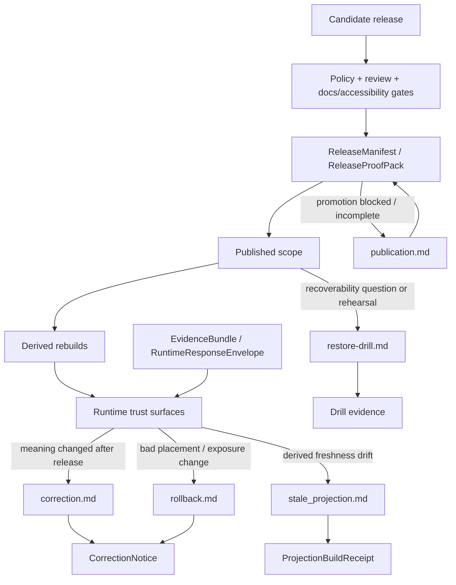

<!-- [KFM_META_BLOCK_V2]
doc_id: kfm://doc/<NEEDS-VERIFICATION-UUID>
title: Reliability Runbooks
type: standard
version: v1
status: draft
owners: <NEEDS VERIFICATION>
created: <NEEDS VERIFICATION>
updated: <NEEDS VERIFICATION>
policy_label: <NEEDS VERIFICATION>
related: [<NEEDS VERIFICATION: docs/runbooks/publication.md>, <NEEDS VERIFICATION: docs/runbooks/correction.md>, <NEEDS VERIFICATION: docs/runbooks/stale_projection.md>, <NEEDS VERIFICATION: docs/runbooks/rollback.md>, <NEEDS VERIFICATION: runbooks/restore-drill.md>, <NEEDS VERIFICATION: runbooks/correction-drill.md>]
tags: [kfm, reliability, runbooks]
notes: [Source-bounded draft; mounted repo inspection was not available in this session; path and adjacent links require verification.]
[/KFM_META_BLOCK_V2] -->

# Reliability Runbooks

> Trust-preserving operational guidance for rollback, correction, stale-state handling, restore drills, and release-proof continuity in Kansas Frontier Matrix (KFM).

| Status | Owners | Target path | Evidence posture |
| --- | --- | --- | --- |
| **experimental** | **`<NEEDS VERIFICATION>`** | `docs/runbooks/reliability/README.md` *(INFERRED target path)* | Source-bounded draft grounded in attached KFM doctrine and repo-grounded audit artifacts |


**Quick jump:** [Scope](#scope) · [Repo fit](#repo-fit) · [Inputs](#inputs) · [Exclusions](#exclusions) · [Directory tree](#directory-tree) · [Quickstart](#quickstart) · [Usage](#usage) · [Diagram](#diagram) · [Runbook registry](#runbook-registry) · [Task list](#task-list) · [FAQ](#faq) · [Appendix](#appendix)

> [!IMPORTANT]
> In KFM, **reliability is not only uptime**. It includes fail-closed behavior, release-proof continuity, correction visibility, rollback lineage, stale-projection handling, restore rehearsal, and trust-visible negative outcomes.

---

## Scope

This directory is the **operational index** for reliability work that changes or preserves trust state after publication, promotion, rebuild, correction, restore, or runtime failure.

In this README, reliability covers:

- **correction** when public meaning changes after release
- **rollback** when runtime placement or exposure must be reversed
- **stale projection** handling when derived artifacts lag release scope
- **restore drills** and recovery rehearsal
- **release proof-pack continuity**
- **trust-visible negative outcomes** such as `ABSTAIN`, `DENY`, `ERROR`, `stale-visible`, `generalized`, `withdrawn`, and `partial`

It does **not** redefine KFM doctrine. It operationalizes it.

### Status legend used in this README

| Label | Meaning here |
| --- | --- |
| **CONFIRMED** | Explicitly named or strongly established in the attached KFM manuals or repo-grounded audit artifact |
| **INFERRED** | Conservative structural completion needed to make the directory usable without claiming mounted implementation |
| **PROPOSED** | Recommended placement, child runbook, or workflow shape that fits doctrine but was not directly verified in the mounted repo |
| **UNKNOWN** | Not directly verifiable in this session |
| **NEEDS VERIFICATION** | Review item maintainers should confirm against the live repo before commit |

[Back to top](#reliability-runbooks)

---

## Repo fit

### Path, upstream, and downstream relationships

| Item | Role in the repo | Status |
| --- | --- | --- |
| `docs/runbooks/reliability/README.md` | This directory index and routing guide | **INFERRED** |
| [`../publication.md`](../publication.md) | Publication / release runbook named in doctrine | **PROPOSED** |
| [`../correction.md`](../correction.md) | Correction / supersession / withdrawal runbook named in doctrine | **PROPOSED** |
| [`../stale_projection.md`](../stale_projection.md) | Derived freshness and rebuild runbook named in doctrine | **PROPOSED** |
| [`../rollback.md`](../rollback.md) | Rollback runbook named in doctrine | **PROPOSED** |
| [`../../../contracts/README.md`](../../../contracts/README.md) | Contract surface reference; reliability depends on these schemas and fixtures | **CONFIRMED in repo-grounded audit; NEEDS VERIFICATION in live tree** |
| [`../../../schemas/README.md`](../../../schemas/README.md) | Schema surface reference; reliability depends on valid/invalid examples and validation | **CONFIRMED in repo-grounded audit; NEEDS VERIFICATION in live tree** |
| [`../../../policy/README.md`](../../../policy/README.md) | Policy vocabulary and deny-by-default posture | **CONFIRMED in repo-grounded audit; NEEDS VERIFICATION in live tree** |
| [`../../../tests/README.md`](../../../tests/README.md) | Test intent surface; reliability drills and negative-path checks belong downstream here | **CONFIRMED in repo-grounded audit; NEEDS VERIFICATION in live tree** |
| [`../../../.github/workflows/README.md`](../../../.github/workflows/README.md) | Workflow intent surface; release/rollback/correction gates should be wired here | **CONFIRMED in repo-grounded audit; NEEDS VERIFICATION in live tree** |

### Repo-fit summary

This README should sit between:

- **upstream trust law**: contract families, route families, policy/result grammar, release proof objects
- **downstream execution**: tests, workflow gates, runtime envelopes, stale-state visuals, restore/correction drill artifacts

> [!NOTE]
> The attached doctrine names several runbooks and proof objects, but the mounted workspace for this session did **not** expose the live repo tree. Relative links above are therefore intentionally reviewable rather than silently asserted as current fact.

[Back to top](#reliability-runbooks)

---

## Inputs

The following belong here, or should be referenced from here, when they are used to explain or execute a reliability action:

- `ReleaseManifest` / `ReleaseProofPack`
- `DecisionEnvelope`
- `ReviewRecord`
- `CorrectionNotice`
- `ProjectionBuildReceipt`
- `RuntimeResponseEnvelope`
- `EvidenceBundle`
- restore-drill and correction-drill evidence
- screenshot baselines for trust states
- rollback notes, stale-state notices, and release-linked operator checklists

### Accepted input classes

| Input | Why it belongs here |
| --- | --- |
| Release-linked incident notes | Reliability work starts from a named release, not an unscoped symptom |
| Proof objects | KFM reliability is evidence-bearing, not anecdotal |
| Validation and test output | Schema, policy, geospatial, UI, and citation failures all affect trust state |
| Surface-state screenshots | KFM requires visible stale / generalized / withdrawn / denied states |
| Drill records | Restore and correction must be rehearsable, not hypothetical |

---

## Exclusions

This directory should **not** become a catch-all operational folder.

| Does **not** belong here | Put it here instead |
| --- | --- |
| Canonical schema definitions | `contracts/` and `schemas/` |
| Policy bundles, reason codes, obligation codes | `policy/` |
| Source admission packets and descriptor authoring guidance | source-onboarding / descriptor docs |
| General deployment bring-up or host bootstrap | runtime / phase-one bring-up docs |
| UI design doctrine for Map Explorer, Evidence Drawer, Focus Mode | UI / shell doctrine docs |
| Feature-specific implementation ADRs | ADR or architecture decision directory |
| Generic uptime-only SRE material detached from evidence and release state | separate operations docs, if they exist |

### Exclusion rule

If a document does not help answer **“what do we do when release-backed trust is at risk?”**, it probably does not belong in this directory.

[Back to top](#reliability-runbooks)

---

## Directory tree

The doctrine clearly names several reliability-adjacent runbooks, but their final placement was **not** directly verifiable in the mounted repo. The tree below is therefore a **reviewable normalization**, not a hidden fact claim.

```text
docs/
└── runbooks/
    ├── publication.md              # PROPOSED doctrine-named sibling
    ├── correction.md               # PROPOSED doctrine-named sibling
    ├── stale_projection.md         # PROPOSED doctrine-named sibling
    ├── rollback.md                 # PROPOSED doctrine-named sibling
    └── reliability/
        └── README.md               # this file (INFERRED target path)

# Cross-repo neighbors named in repo-grounded evidence
contracts/
schemas/
policy/
tests/
.github/workflows/
```

### Why this shape

- doctrine names publication, correction, stale-projection, and rollback runbooks explicitly
- testing doctrine names `restore-drill` work explicitly
- repo-grounded evidence confirms `contracts/`, `schemas/`, `policy/`, `tests/`, and `.github/workflows/` as documentation surfaces, but does not prove full runnable implementation yet

---

## Quickstart

Use this README when a trust-bearing release or runtime surface becomes questionable.

1. **Classify the event**
   - publication gate failure
   - bad deployment / rollback candidate
   - correction / supersession / withdrawal
   - stale derived layer
   - restore or rehearsal
2. **Pin the scope**
   - `release_id`
   - `dataset_version_id`
   - `audit_ref`
   - affected surfaces
3. **Collect proof objects**
   - at minimum: `ReleaseManifest` or `ReleaseProofPack`
   - plus the most relevant supporting objects for the event
4. **Choose the runbook**
   - publication
   - rollback
   - correction
   - stale projection
   - restore drill
5. **Fail closed first**
   - do not silently degrade into uncited or stale-normal behavior
6. **Publish visible state**
   - stale-visible
   - generalized
   - withdrawn
   - denied
   - abstained
7. **Record follow-up validation**
   - tests run
   - artifacts updated
   - screenshots captured
   - next corrective action assigned

### Minimal incident packet

```text
incident/
└── YYYY-MM-DD-<slug>/
    ├── classification.md
    ├── scope.txt
    ├── release-ids.txt
    ├── proof-objects/
    ├── screenshots/
    ├── decision-notes.md
    └── follow-up-checks.md
```

---

## Usage

### Use this directory for a real incident

When the issue is real and already affects meaning, visibility, freshness, release integrity, or recovery confidence:

1. start from the nearest release-backed object, not from a UI symptom alone
2. identify whether the problem is **semantic**, **operational**, or **derived-freshness**
3. select one primary runbook owner
4. attach proof objects before changing public meaning
5. leave a visible lineage trail

### Use this directory for a scheduled drill

When the goal is rehearsal rather than live remediation:

1. choose a public-safe fixture set
2. declare the expected negative or recovery states in advance
3. run the procedure end to end
4. record what was missing
5. turn gaps into artifacts, tests, or runbook deltas

### Reliability routing rule

If the team is unsure which runbook applies, prefer this order:

1. **correction** if public meaning changed
2. **rollback** if runtime placement/exposure changed but meaning can be restored by reversal
3. **stale projection** if authoritative release is sound but derived delivery lags it
4. **publication** if promotion is incomplete or blocked
5. **restore drill** if continuity or recoverability is the main question

[Back to top](#reliability-runbooks)

---

## Diagram


```mermaid
flowchart TD
    A[Candidate release] --> B[Policy + review + docs/accessibility gates]
    B --> C[ReleaseManifest / ReleaseProofPack]
    C --> D[Published scope]
    D --> E[Derived rebuilds]
    E --> F[Runtime trust surfaces]

    F -->|meaning changed after release| G[correction.md]
    F -->|bad placement / exposure change| H[rollback.md]
    F -->|derived freshness drift| I[stale_projection.md]
    C -->|promotion blocked / incomplete| J[publication.md]
    D -->|recoverability question or rehearsal| K[restore-drill.md]

    G --> L[CorrectionNotice]
    H --> L
    I --> M[ProjectionBuildReceipt]
    J --> C
    K --> N[Drill evidence]

    O[EvidenceBundle / RuntimeResponseEnvelope] --> F
```

---

## Runbook registry

| Runbook / entrypoint | Primary trigger | Required proof objects | Main trust question | Status |
| --- | --- | --- | --- | --- |
| `README.md` | Need to route or classify a reliability event | event classification + release scope | Which runbook owns this failure? | **INFERRED** |
| `publication.md` | Promotion blocked, incomplete, or not yet governable | `CatalogClosure`, `DecisionEnvelope`, `ReviewRecord`, `ReleaseManifest` / `ReleaseProofPack` | Is this candidate actually publishable? | **PROPOSED** |
| `rollback.md` | Deployment or exposure reversal needed | `ReleaseManifest`, deployment evidence, rollback note, correction note if meaning changed | Can runtime placement be reversed without breaking lineage? | **PROPOSED** |
| `correction.md` | Released meaning changed; supersession / withdrawal / narrowing required | `CorrectionNotice`, `ReviewRecord`, `DecisionEnvelope`, affected release refs | How do we preserve lineage while changing public meaning? | **PROPOSED** |
| `stale_projection.md` | Derived tiles/search/vector/scene outputs lag promoted release | `ProjectionBuildReceipt`, release refs, stale basis, rebuild outcome | How do we keep stale state visible and rebuild safely? | **PROPOSED** |
| `restore-drill.md` | Recovery rehearsal or restore validation | restore evidence, validation output, post-restore trust checks | Can we recover without trust collapse? | **PROPOSED** |
| `correction-drill.md` | Scheduled rehearsal of correction behavior | sample correction packet, surface-state capture, proof-object diff | Can correction be performed visibly and repeatably? | **PROPOSED** |

### Trigger matrix

| Symptom | Preferred runbook | Immediate fail-closed action |
| --- | --- | --- |
| Candidate release missing proof-pack pieces | `publication.md` | Stop promotion; do not publish |
| Public surface changed meaning after release | `correction.md` | Mark affected surface and preserve lineage |
| Deploy succeeded but trust state is wrong | `rollback.md` | Revert placement and assess whether correction artifact is also required |
| Tiles/search/vector output older than corrected release | `stale_projection.md` | Mark stale-visible; trigger rebuild |
| Recovery path unproven or restore just occurred | `restore-drill.md` | Validate trust objects and public-safe state before reopening confidence |

### Proof object checklist

| Object | Reliability use |
| --- | --- |
| `SourceDescriptor` | Confirms source role, rights posture, cadence, and publication intent |
| `IngestReceipt` | Proves fetch/landing event happened |
| `ValidationReport` | Explains pass/fail/quarantine state |
| `DatasetVersion` | Pins authoritative candidate or promoted subject set |
| `CatalogClosure` | Confirms outward metadata closure and linkage |
| `DecisionEnvelope` | Records machine-readable policy result |
| `ReviewRecord` | Captures human approval / denial / escalation |
| `ReleaseManifest` / `ReleaseProofPack` | Ties release to its governable proof |
| `ProjectionBuildReceipt` | Proves derived rebuild from a known release |
| `EvidenceBundle` | Explains what supports a claim or surface |
| `RuntimeResponseEnvelope` | Makes outward runtime outcome accountable |
| `CorrectionNotice` | Preserves visible lineage under change |

---

## Task list

### Definition of done for a trust-bearing reliability event

- [ ] Event classification is explicit
- [ ] Affected release scope is named
- [ ] Required proof objects are attached or linked
- [ ] Negative outcome / visible surface state is declared where applicable
- [ ] Lineage is preserved; no silent overwrite occurred
- [ ] Derived rebuild decision is recorded
- [ ] Follow-up validation ran or was deliberately deferred with explanation
- [ ] Screenshots or equivalent trust-state evidence were captured for user-visible changes
- [ ] Runbook delta was recorded if the procedure changed
- [ ] Next owner and next review point are assigned

### Reliability gates that should exist before “done” is trusted

- [ ] schema validation
- [ ] contract validation
- [ ] policy result checks
- [ ] geospatial validity / CRS / time checks where relevant
- [ ] citation-negative behavior checks
- [ ] stale-state and correction-state visibility checks
- [ ] rollback or restore evidence capture
- [ ] documentation sync check for behavior-significant change

[Back to top](#reliability-runbooks)

---

## FAQ

### What makes this a “reliability” doc instead of a generic ops doc?

Because KFM reliability is tied to **trust state**, not only service availability. A system can be up and still be unreliable if it hides stale data, loses lineage, skips correction visibility, or emits confident uncited answers.

### What is the difference between rollback and correction?

**Rollback** reverses runtime placement or release exposure. **Correction** changes public meaning while preserving visible lineage. A single incident may require both.

### What if only a derived layer is stale?

Use the stale-projection path first. Do not reclassify a derived-freshness problem as authoritative truth failure unless the canonical release itself is wrong.

### Should this directory contain policy or schema source of truth?

No. This directory should **consume** those artifacts operationally, not own them.

### Why is hydrology mentioned so often?

Because the doctrine repeatedly treats hydrology as the preferred first thin slice: public-safe, place/time-rich, operationally legible, and useful for reliability drills without immediately forcing the highest sensitivity burdens.

---

## Appendix

<details>
<summary><strong>Appendix A — Open verification items</strong></summary>

| Item | Why it matters |
| --- | --- |
| Does `docs/runbooks/reliability/README.md` already exist? | This draft was written without direct mounted repo inspection |
| Are doctrine-named runbooks siblings under `docs/runbooks/`, or local to `docs/runbooks/reliability/`? | Final relative links depend on this |
| Are `contracts/README.md`, `schemas/README.md`, `policy/README.md`, `tests/README.md`, and `.github/workflows/README.md` present exactly as linked? | Repo-grounded evidence says yes, but the live tree was not mounted here |
| Does the repo already contain runnable schema files, fixtures, or merge-blocking workflow YAML? | Current evidence suggests documentation surfaces exist, but full implementation remains unproven |
| Which team or steward group owns reliability runbooks? | Owner placeholders should be replaced before commit |
| Does the repo already have restore- or correction-drill docs in another location? | Avoid parallel runbook universes |

</details>

<details>
<summary><strong>Appendix B — Trust states that should remain visible</strong></summary>

| State | Why it matters |
| --- | --- |
| `promoted` | Release-backed and public-safe |
| `generalized` | Precision intentionally reduced |
| `partial` | Coverage or completeness is incomplete |
| `stale-visible` | Derived surface is out of freshness tolerance |
| `withdrawn` | Prior release or view no longer valid for outward use |
| `denied` | Policy blocks the requested action or surface |
| `abstained` | No reconstructible evidence path or scope is insufficient |
| `conflicted` | Independent admissible sources disagree materially |

</details>

<details>
<summary><strong>Appendix C — Editorial note on path certainty</strong></summary>

This README intentionally distinguishes between:

- **doctrine-confirmed reliability responsibilities**
- **repo-grounded but not live-mounted doc surfaces**
- **proposed child runbooks named in doctrine**
- **unknown live file placement**

That separation is deliberate. It keeps the file commit-ready **after verification**, rather than pretending the current session proved more of the repo than it did.

</details>
