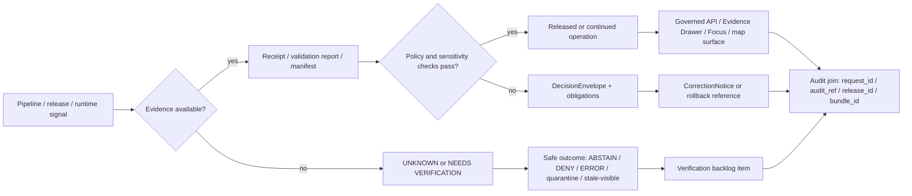

<!-- [KFM_META_BLOCK_V2]
doc_id: kfm://doc/NEEDS-VERIFICATION
title: Reliability Runbooks
type: standard
version: v1
status: draft
owners: NEEDS-VERIFICATION
created: YYYY-MM-DD
updated: YYYY-MM-DD
policy_label: NEEDS-VERIFICATION
related: [docs/runbooks/publication.md, docs/runbooks/correction.md, docs/runbooks/rollback.md, docs/registers/VERIFICATION_BACKLOG.md, data/receipts/, data/proofs/, policy/]
tags: [kfm, runbook, reliability, operations, observability, rollback]
notes: [Repo-ready draft generated from attached KFM doctrine. Actual doc_id, owners, dates, policy label, adjacent paths, workflows, dashboards, emitted artifacts, and runtime maturity remain NEEDS VERIFICATION.]
[/KFM_META_BLOCK_V2] -->

# Reliability Runbooks

Operational reliability guidance for keeping KFM evidence, releases, runtime surfaces, and rollback paths reconstructable instead of merely “healthy.”

<a id="top"></a>

> [!NOTE]
> **Status:** `experimental`  
> **Owners:** `NEEDS VERIFICATION`  
> **Path:** `docs/runbooks/reliability/README.md`  
> **Authority level:** operational support / evidence-system reliability  
> **Truth posture:** doctrine-aligned `PROPOSED` runbook structure; implementation depth `NEEDS VERIFICATION`


**Quick jumps:** [Scope](#scope) · [Repo fit](#repo-fit) · [Accepted inputs](#accepted-inputs) · [Exclusions](#exclusions) · [Directory tree](#directory-tree) · [Quickstart](#quickstart) · [Usage](#usage) · [Diagram](#diagram) · [Signal matrix](#signal-matrix) · [Definition of done](#definition-of-done) · [FAQ](#faq) · [Appendix](#appendix)

---

## Scope

This directory is the landing page for **KFM reliability runbooks**: the operational procedures that help maintainers detect, explain, recover from, and document reliability failures without weakening KFM’s evidence-first doctrine.

Reliability in KFM is broader than uptime. A reliable KFM surface must be able to answer:

| Reliability question | Required posture |
|---|---|
| What changed? | Reconstruct from receipts, manifests, logs, traces, policy decisions, and review state. |
| Why was it allowed or denied? | Resolve to a policy or review decision, not a vague operator note. |
| What evidence supported the user-visible result? | Resolve `EvidenceRef` to `EvidenceBundle` or abstain. |
| What failed, and what was the safe outcome? | Emit or record `ABSTAIN`, `DENY`, `ERROR`, quarantine, stale-visible state, rollback, or correction. |
| Can the state be restored or corrected visibly? | Preserve rollback references, correction notices, and audit joins. |

> [!IMPORTANT]
> A green deployment, running process, or successful tile render is **not** enough. In KFM, reliability means the system can reveal, defend, and reconstruct its own state.

[Back to top](#top)

---

## Repo fit

This README is a **directory landing page**, not a release record and not a replacement for policy, contracts, schemas, receipts, proofs, or deployment manifests.

| Relationship | Link / path | Status | Why it matters |
|---|---|---:|---|
| Local path | `docs/runbooks/reliability/README.md` | `PROPOSED` | Target file requested for this run. |
| Docs landing | [`../../README.md`](../../README.md) | `NEEDS VERIFICATION` | Should orient readers to canonical docs, registers, and runbooks. |
| Runbooks landing | [`../README.md`](../README.md) | `NEEDS VERIFICATION` | Should list operational runbooks as a family. |
| Promotion gate | [`../publication.md`](../publication.md) | `CONFIRMED path / content status may vary` | Release reliability depends on promotion evidence, not deployment success alone. |
| Correction and rollback | [`../correction.md`](../correction.md) + [`../rollback.md`](../rollback.md) | `CONFIRMED path / content status may vary` | Reliability recovery must preserve visible lineage. |
| Verification backlog | [`../../registers/VERIFICATION_BACKLOG.md`](../../registers/VERIFICATION_BACKLOG.md) | `NEEDS VERIFICATION` | Unverified reliability surfaces should become concrete checks. |
| Policy | [`../../../policy/README.md`](../../../policy/README.md) | `NEEDS VERIFICATION` | Deny, abstain, release, sensitivity, and rights decisions should stay executable. |
| Receipts | [`../../../data/receipts/README.md`](../../../data/receipts/README.md) | `NEEDS VERIFICATION` | Process memory belongs with emitted receipt surfaces, not in prose only. |
| Proofs | [`../../../data/proofs/README.md`](../../../data/proofs/README.md) | `NEEDS VERIFICATION` | Release-grade evidence should remain separate from runtime logs. |
| CI workflows | `../../../.github/workflows/` | `NEEDS VERIFICATION` | Workflow maturity must be confirmed from actual files and runs. |

> [!WARNING]
> Link targets above are doctrine-aligned and repo-plausible, but this draft does not prove they exist in the current branch. Verify targets before merging or replace missing links with tracked TODOs.

[Back to top](#top)

---

## Accepted inputs

The following belong in this directory or in companion reliability runbooks when they are tied to concrete evidence.

| Accepted input | Belongs here when... | Expected evidence |
|---|---|---|
| Reliability triage procedure | It explains how maintainers classify a failure without guessing. | Incident timeline, impacted surface, truth label, owner, next safe action. |
| Health and readiness checks | They test KFM-specific readiness, not only process liveness. | DB reachability, policy load, evidence resolution, published scope, audit sink. |
| Observability guidance | It joins logs, metrics, traces, receipts, policy decisions, and release refs. | Request IDs, audit refs, release IDs, bundle IDs, dashboard links. |
| Backup and restore procedure | It proves restore behavior, not just backup creation. | Restore drill receipt, recovery point, recovery time, integrity check. |
| Rollback and correction drills | They preserve visible lineage and avoid silent overwrite. | `CorrectionNotice`, rollback ref, release diff, reviewer action. |
| Source outage handling | It defines safe stale-visible, quarantine, abstain, or deny behavior. | Source descriptor, freshness record, failure disposition. |
| Promotion failure handling | It explains how to stop a release when proof is incomplete. | `DecisionEnvelope`, validation report, policy result, denied obligations. |
| Local exposure checks | They verify no public path bypasses governed APIs. | Auth check, firewall/proxy notes, no-direct-DB/model/artifact access proof. |

[Back to top](#top)

---

## Exclusions

| Do not keep here as canonical truth | Keep it here instead | Why |
|---|---|---|
| Shared object definitions | `contracts/` and `schemas/` | Reliability runbooks may reference object families; they do not define them. |
| Policy rules, deny reasons, and obligations | `policy/` | Policy must remain executable, testable, and independently reviewable. |
| Raw data, WORK artifacts, QUARANTINE contents, or unpublished candidates | `data/raw/`, `data/work/`, `data/quarantine/`, `data/processed/` | Reliability work must not create a side door into pre-publication state. |
| Release proof packs | `data/proofs/` or release proof surfaces | Proof objects should be immutable and release-linked. |
| Process receipts | `data/receipts/` or version-adjacent receipt surfaces | Receipts are emitted process memory, not prose summaries. |
| Runtime logs as the only incident record | Observability store + incident note + receipt/proof refs | Logs help reconstruct; they do not replace release evidence or correction lineage. |
| Secrets, tokens, keys, host passwords, or private URLs | Secret manager / deployment layer | Reliability docs must be inspectable without leaking power. |
| Generic SLO targets copied from elsewhere | A repo-confirmed SLO register or service-specific runbook | KFM should not invent availability claims without dashboards and ownership. |
| Emergency or life-safety instructions | Official emergency systems and source guidance | KFM may provide governed evidence context; it is not an emergency alerting system. |

[Back to top](#top)

---

## Directory tree

Current target file:

```text
docs/runbooks/reliability/
└── README.md
```

Companion files should be added only after the mounted repo confirms naming conventions, owners, and adjacent runbook paths.

| Companion file | Status | Purpose |
|---|---:|---|
| `INCIDENT_RESPONSE.md` | `PROPOSED` | Incident classification, safe outcomes, evidence capture, and handoff. |
| `HEALTH_AND_READINESS.md` | `PROPOSED` | KFM-specific readiness checks for governed API, policy, evidence, and audit sinks. |
| `OBSERVABILITY.md` | `PROPOSED` | Logging, metrics, traces, request IDs, release IDs, and audit joins. |
| `BACKUP_RESTORE.md` | `PROPOSED` | Backup verification, restore drills, and recovery evidence. |
| `LOCAL_EXPOSURE_CHECKLIST.md` | `PROPOSED` | Firewall, proxy, VPN, auth, no-direct-store, and no-direct-model exposure checks. |
| `DEGRADED_MODES.md` | `PROPOSED` | Stale-visible, generalized, partial, abstained, denied, withdrawn, and error states. |

[Back to top](#top)

---

## Quickstart

Use this page when a reliability issue appears, when a release is blocked, or when an operator is asked whether KFM is “healthy.”

1. **Classify the affected plane.**  
   Choose data lifecycle, promotion/release, runtime/API, UI trust surface, model adapter, source freshness, policy, backup/restore, or local exposure.

2. **Find the evidence.**  
   Look for a receipt, proof, manifest, policy decision, validation report, runtime envelope, audit ref, trace, dashboard, or reviewer action.

3. **Label what is known.**  
   Use `CONFIRMED`, `INFERRED`, `PROPOSED`, `UNKNOWN`, or `NEEDS VERIFICATION`. Do not upgrade uncertainty through tone.

4. **Prefer the safe outcome.**  
   If support is incomplete, choose `ABSTAIN`, `DENY`, `ERROR`, quarantine, stale-visible, generalization, rollback, or correction rather than silent success.

5. **Record the recovery path.**  
   Link the action to a rollback reference, correction notice, receipt, proof pack, or verification backlog item.

### Read-only inspection snippets

These snippets are safe discovery commands. They should not modify the repository.

```bash
# Confirm branch and working tree state.
git status --short
git branch --show-current

# Inspect likely operational surfaces without assuming they exist.
find .github docs contracts schemas policy data tools tests apps packages infra release \
  -maxdepth 3 -type f 2>/dev/null | sort | sed -n '1,250p'

# Look for reliability-relevant object families.
grep -RInE \
  'run_receipt|ReleaseManifest|EvidenceBundle|DecisionEnvelope|CorrectionNotice|ValidationReport|audit_ref|request_id|rollback|stale|ABSTAIN|DENY|ERROR' \
  docs contracts schemas policy data tools tests apps packages 2>/dev/null | sed -n '1,200p'
```

> [!CAUTION]
> Do not “fix” reliability by deleting evidence, rewriting history, bypassing policy, exposing internal stores, or replacing a denied state with a vague success page.

[Back to top](#top)

---

## Usage

### Reliability planes

| Plane | What can fail | Minimum safe response |
|---|---|---|
| Data lifecycle | RAW/WORK/QUARANTINE state leaks, invalid transform, stale source, bad checksum. | Quarantine, deny publication, emit validation failure, preserve receipt. |
| Promotion / release | Missing proof pack, failed policy, incomplete catalog closure, unsigned artifact. | Block release, emit `DecisionEnvelope`, link verification backlog. |
| Runtime / API | Evidence resolution fails, policy unavailable, audit sink unwritable, backing store unreachable. | Return `ERROR`, `ABSTAIN`, or `DENY`; do not fabricate answers. |
| Map / UI trust surface | Layer appears without freshness, review, evidence, or correction state. | Hide, mark stale-visible, generalize, or show denied/withdrawn state. |
| Governed AI / Focus | Citation check fails, released scope missing, model runtime exposed directly. | `ABSTAIN`, `DENY`, or `ERROR`; emit AI/runtime receipt where supported. |
| Local exposure | DB, artifact tree, Ollama, RAW/WORK/QUARANTINE, or canonical store is client-visible. | Block exposure, rotate affected credentials, record incident, verify no-direct path. |
| Backup / restore | Backup exists but restore is untested, corrupted, or cannot rejoin proof objects. | Mark recovery posture `NEEDS VERIFICATION`; run restore drill before claiming readiness. |
| Correction / rollback | Prior state replaced silently or rollback cannot be reconstructed. | Publish correction notice or rollback ref; preserve previous release linkage. |

### Maturity ladder

Use this ladder when documenting reliability coverage. It avoids collapsing a design idea into enforcement.

| Level | Meaning | Allowed claim |
|---:|---|---|
| 0 | Named need only | `PROPOSED` |
| 1 | Procedure documented | `PROPOSED / NEEDS VERIFICATION` |
| 2 | Fixture or dry-run exists | `INFERRED` until repo evidence is inspected |
| 3 | CI tested | `CONFIRMED` only with workflow and run evidence |
| 4 | Merge-blocking or promotion-blocking | `CONFIRMED` only with branch/protection/gate evidence |
| 5 | Runtime-enforced and observable | `CONFIRMED` only with logs, traces, dashboards, and emitted artifacts |

[Back to top](#top)

---

## Diagram


```mermaid
flowchart LR
    A[Pipeline / release / runtime signal] --> B{Evidence available?}

    B -->|yes| C[Receipt / validation report / manifest]
    B -->|no| X[UNKNOWN or NEEDS VERIFICATION]

    X --> Y[Safe outcome: ABSTAIN / DENY / ERROR / quarantine / stale-visible]

    C --> D{Policy and sensitivity checks pass?}
    D -->|yes| E[Released or continued operation]
    D -->|no| F[DecisionEnvelope + obligations]

    E --> G[Governed API / Evidence Drawer / Focus / map surface]
    F --> H[CorrectionNotice or rollback reference]
    Y --> I[Verification backlog item]

    G --> J[Audit join: request_id / audit_ref / release_id / bundle_id]
    H --> J
    I --> J
```

[Back to top](#top)

---

## Signal matrix

| Signal | Treat as | First evidence to find | Safe failure mode |
|---|---|---|---|
| Process is running | Weak health signal | Readiness check and audit sink status | Do not claim ready. |
| API returns `200` | Weak runtime signal | Evidence resolution, policy state, published scope, audit ref | Return explicit `ERROR` or `ABSTAIN` if trust path fails. |
| Policy bundle missing | Release/runtime blocker | Policy load log, decision result, fixture test | `DENY` or block promotion. |
| Citation validation failed | Runtime trust failure | Citation report, EvidenceBundle resolver output | `ABSTAIN` or `ERROR`. |
| Source freshness expired | Data reliability issue | Source descriptor, refresh record, dataset version | Stale-visible, quarantine, or deny publication. |
| Proof pack missing | Promotion blocker | ReleaseManifest, proof index, attestation refs | Hold release. |
| Dashboard unavailable | Observability gap | Logs, traces, alternate audit path | Mark runtime maturity `NEEDS VERIFICATION`. |
| Backup completed | Incomplete recovery evidence | Restore drill result and integrity check | Do not claim recoverability until restore is tested. |
| Rollback executed | Recovery event | Rollback ref, previous release ref, correction notice | Preserve lineage; do not silently overwrite. |
| Direct internal exposure found | Security incident | Proxy/firewall/auth evidence, access logs | Block exposure; record incident; verify no-direct path. |

[Back to top](#top)

---

## Definition of done

Before this directory is treated as `active`, complete the checklist below.

- [ ] Confirm `docs/runbooks/reliability/` exists in the mounted repository.
- [ ] Confirm or replace every relative link in [Repo fit](#repo-fit).
- [ ] Replace `NEEDS-VERIFICATION` metadata values with approved doc ID, owners, dates, and policy label.
- [ ] Inventory actual workflows, dashboards, logs, traces, emitted receipts, proofs, manifests, and correction artifacts.
- [ ] Confirm whether promotion, correction, rollback, and source-refresh runbooks already exist.
- [ ] Add this README to the docs/runbooks landing page.
- [ ] Confirm policy maturity using the ladder above rather than aspiration.
- [ ] Run markdown linting or the repo-native documentation checks.
- [ ] Run link checking after adjacent files are verified.
- [ ] Record unresolved gaps in the verification backlog.

[Back to top](#top)

---

## FAQ

### Is reliability the same as uptime?

No. Uptime is one signal. KFM reliability also requires evidence resolution, policy state, release state, auditability, correction lineage, and safe visible failure modes.

### Can logs prove a public claim?

Logs can support reconstruction, but they do not replace `EvidenceBundle`, policy decision, review state, release proof, or correction objects.

### Can a deployment be successful while a release is unreliable?

Yes. A deployment may succeed while promotion evidence is missing, policy is unavailable, source rights are unresolved, or runtime citation checks fail.

### Should this directory define SLOs?

Only after owners, dashboards, service boundaries, and emitted evidence are verified. Until then, SLOs belong in a `PROPOSED` or `NEEDS VERIFICATION` register.

### What is the safest response when evidence is missing?

Use a visible negative or constrained state: `ABSTAIN`, `DENY`, `ERROR`, quarantine, stale-visible, generalized, withdrawn, or partial. Do not bluff continuity.

[Back to top](#top)

---

## Appendix

<details>
<summary>Reliability event card template</summary>

Use this compact card for incidents, drills, or disputed reliability claims.

| Field | Value |
|---|---|
| Event ID | `NEEDS VERIFICATION` |
| Date/time | `YYYY-MM-DDTHH:MM:SSZ` |
| Reporter | `NEEDS VERIFICATION` |
| Affected plane | data lifecycle / release / runtime / UI / AI / source / backup / exposure |
| User-visible impact | `NEEDS VERIFICATION` |
| Evidence found | receipt / proof / manifest / log / trace / dashboard / policy decision / review record |
| Evidence missing | `NEEDS VERIFICATION` |
| Truth label | CONFIRMED / INFERRED / PROPOSED / UNKNOWN / NEEDS VERIFICATION |
| Safe outcome | ABSTAIN / DENY / ERROR / quarantine / stale-visible / rollback / correction |
| Follow-up owner | `NEEDS VERIFICATION` |
| Backlog link | `NEEDS VERIFICATION` |

</details>

<details>
<summary>Open verification backlog for this README</summary>

| Verification item | Why it matters | Blocking level |
|---|---|---:|
| Mounted repo tree and target branch | Confirms this path and adjacent docs exist. | High |
| Workflow inventory | Prevents CI and promotion gate overclaims. | High |
| Dashboard / trace inventory | Confirms observability maturity. | High |
| Receipt/proof/manifest examples | Confirms emitted reliability evidence exists. | High |
| Backup and restore drill evidence | Confirms recovery is tested, not assumed. | Medium |
| CODEOWNERS / branch protections | Confirms review and gate burden. | Medium |
| Runtime envelope samples | Confirms finite outcomes and audit refs are real. | Medium |
| Local exposure posture | Confirms deny-by-default public/semi-public boundary. | High |

</details>
